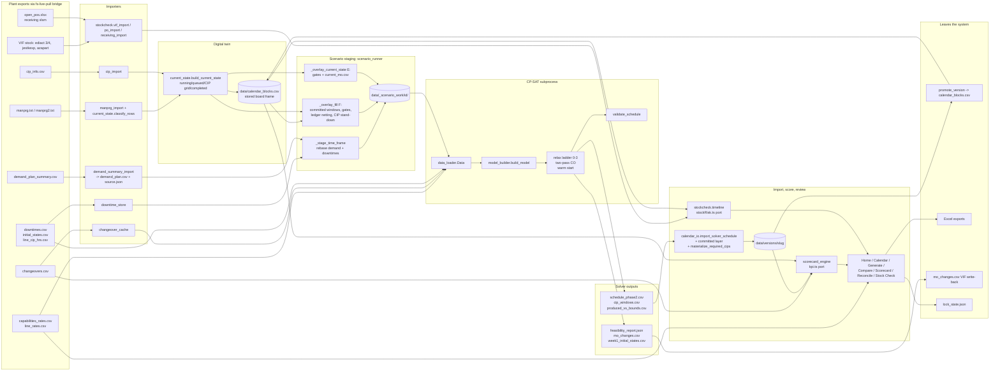

# FLOWSTATE deep audit: final forensic report

Repository `C:/Users/jbdil/Flowstate/Plant_Scheduler`, branch `develop`, HEAD `5d72a0c` plus the uncommitted fix round. Audit window 2026-09-02 to 2026-09-04. Frozen live state: 2026-09-02 (Scenario F work dir solved 14:22-14:43 at 600 s per pass). Assembled 2026-09-04 by the report editor from the section files under the session scratchpad `.../4676946a-cd87-4d76-9139-b1ba1df3896a/scratchpad/report/sections/`; no solver and no test was run for the assembly.

Grades are quoted exactly as recorded: VERIFIED / HIGH_CONFIDENCE / PARTIALLY_VERIFIED / UNVERIFIED / INCORRECT / DISPUTED / REJECTED (round-1 clusters, round-2 verifier), CONFIRMED / REFUTED / UNCERTAIN with a confidence number (round-3 verifier). Finding ids: `Cnn` round-1 clusters, `<area>-n` round-2 findings, `OWN-n` orchestrator, `Fn` bench mechanisms, `<batch>-n` fixes, `D-n` integration decisions, `On` optimizer items, `Xn` experiments.

## Contents

1. Executive summary and trust grades
2. Architecture map
3. Critical bugs (P0-P3) with fix status
4. Calculation verification matrix (post-fix update)
5. Optimizer constraint matrix (post-fix update)
6. Objective function analysis
7. OR-Tools improvement opportunities (with post-fix status)
8. Benchmark results
9. Test coverage gaps (with what the fix phase added)
10. Code quality findings
11. Data quality risks
12. Recommended Flowstate Optimizer V2
13. Top 20 improvements
14. Final standard: the ten questions; what the audit changed; how to reproduce
Appendix A. Editorial notes

---

---

## 1. Executive summary

FLOWSTATE was audited end to end between 2026-09-02 and 2026-09-04: 19 finder agents in two rounds (10 subsystem finders, then 9 adversarial / cross-cutting finders), two independent verification rounds that re-executed code for every claim they graded, a frozen snapshot of the live plant state (2026-09-02, Scenario F work dir solved at 600 s per pass), a benchmark harness with 16 hand-solvable problems plus the live problem, a fix round of ten agents plus an integrator, and five post-fix optimizer experiments. The evidence base is on disk under the audit scratchpad (`audit/`, `verify/`, `verify3/`, `bench/`, `fixes/`); every claim in this report cites it.

### 1.1 What is good

- **The arithmetic engines are correct.** 241 independently checked behaviours held (section 4: 325 matrix rows, 241 held, 68 INCORRECT, 2 INCORRECT (DISPUTED), 14 never verified; 8 of the 241 carry UNVERIFIED for a named reason). The running-MO re-forecast reproduces to 0.01 h on 10 of 10 MOs, manprg classification matches a hand parse on 81 of 81 rows, the stock curve mathematics reproduce to the digit, demand staging is exact to 0.00003 %, integer kg accounting drifts 0.0 kg on the live run, the netting invariant gross = applied + net holds on 139 of 139 orders (sections 4, 11).
- **The scheduling physics are sound.** One NoOverlap per line over production, downtimes and CIPs (0 OVERLAP / IN_DOWNTIME violations on the live board and in every probe); the successor chain is the true time order; CIP split integrity; availability gates at every relax level; the two-pass anchor mechanics; direction-aware setup lookup; greedy seed pricing agrees with the solver on all 54,988 changeover rows (section 7.3).
- **The test suite is real for the pure engines.** Hand-derived expected values in current_state, demand_coverage, timeline, reconcile_engine, scorecard_engine and the TypeScript ports; every numeric expectation the tests finder recomputed was correct (section 9).
- **Eleven claims were refuted** by the verifiers and are recorded so they are not re-tilled (section 3.6): the plant's own rn=1 supersede rule, the VIF date auto-detect, the anchor-month rate filter, the Monday constants in labels, dead-pair pruning under relax_due, the loose domains, the horizon clip of the running block, the in-house BOM exemption, the stock-count mtime, the scratchpad-path test, and the generated stock-risk fixture.

### 1.2 What is dangerous

149 confirmed defect ids (148 rows): **1 P0, 50 P1, 79 P2, 18 P3** (section 3.0). The P0 and every P1, with the live number measured on the frozen 2026-09-02 snapshot where one exists, and the post-fix status:

| id | defect (short) | live impact (frozen snapshot unless stated) | status |
|---|---|---|---|
| **C41** P0 | F re-staging treats solver-drawn cip_req cleans as planner CIPs and drops the line's projected CIP grid | P12 ran 213 h dirty (234 h since hour 0) against a 120 h interval; `validation_report.txt` said "CIP OK" | FIXED (CB-1, V-1b) |
| C01 | Running-MO re-forecast divides a stale made-counter by wall-clock elapsed at render time | all 11 running MOs tagged 48-74 % slow; P21 gated 0-504 h, P10 0-439 h; about 700 t of phantom blocked capacity while 42 orders were short | FIXED (CA-1; bridge writes `manprg.asof.json`) |
| C19 | Monday-frame week constants and a one-sided W0/W1 stitch let W2/W3 run in W1 hours | 1.09 kt (32.5 % of scheduled kg) made before its due week; bench 600 s: early kg 1,186,284 -> 0 under the audit's 48 h rule (600-1,000 t again under the plant's unbounded early-fill policy of 2026-09-04, by design; see 1.4) | FIXED (SB-1; policy knob `early_fill_hours`) |
| C73 | Pass-2 fill floor is a single fungible 1 % give-back with no fill term | pass 2 gave back 42.4 t; five P12-only W2 orders left at 0 kg while P12 idled h242-504 | FIXED (SA-3, V-4; floors opt-in, D-1) |
| C72 | Same-SKU adjacency charged a phantom 1080 changeover | 0 same-SKU adjacencies in 84 live blocks although 38 of 70 SKUs have multi-week orders | FIXED (SA-1) |
| C31 | Initial-state -> first-order changeover costs time but is never priced | 11 of 14 live lines open with an unpriced changeover, 8 major | FIXED (SA-2) |
| C20 | A due week only partly inside the horizon keeps its full-week target | W3 (48 h in horizon) kept 1,715 t | FIXED (CB-4: 490 t, 1,225 t deferred) |
| C18 | Two-phase A-D drop the entire next ISO week on a non-Monday anchor | 32 orders, 1,762 t planned as zero | FIXED (INTEGRATE H-5) |
| C09 | CIP/production merge deletes the clean's hours from committed MOs | 139.4 h of committed work lost over 27 MOs | FIXED (CA-4) |
| C04 | Running block carries the full Fct kg from the anchor | 272,367 kg already made re-presented as future production | FIXED (CA-3) |
| C54 | Completed MOs from undemanded past weeks credited 100 % forward | 193,592 kg completed-leg reduces this week's targets after every re-import | FIXED (CB-6; Reconcile page does not yet show the WARNING) |
| C55 | Pinned blocks staged in the board's stored frame, never rebased | pinned work shifts 24 h per day since the last Roll | FIXED (CB-5) |
| C10 | manprg CIP pseudo-MOs ignored; cleans drawn at 6 h when the plant plans 8 h | 7 live cleans off by +2 to +20 h / -46 h | FIXED (CA-5) |
| C11 | Fractional hours truncated at the solver boundary | 10 of 10 live gates truncated; P11 47.983 h outage read as 47 | FIXED (CB-3; `data_loader.num_or_default` still truncates other inputs) |
| **C13** | `demand_plan_summary` import maps next-year ISO weeks to the past | latent; every December January demand lands at due hour -8736 and is dropped | **NOT FIXED** |
| C90 | `materialize_required_cips` never sees a committed -> fill cip_req transition | live P15 6.8 h gap with no clean | FIXED (CB-2) |
| C32 | Required clean drawn over downtimes / trials | 23 live fill gaps contain another window | FIXED (CB-2) |
| C49 | Duplicate and overlapping CIP blocks each charged a full forfeited interval | P12 [360,366) drawn twice, about 75 t each | FIXED (CB, CA, Q) |
| C29 | Committed-CIP waiver for cip_req pairs dead in phase full | 23 of 71 fill transitions straddle a committed clean and pay full cost | FIXED (SA-2 follow-up, CB-13) |
| **C30** | What a CIP waives differs across solver / scorecard / overnight score | leaderboard and scorecard ranked the same board differently | **PARTIALLY FIXED** (scorecard, KPI and overnight unified; solver `absorb_delta` unchanged) |
| C42 | `cip_defer` rewards creating extra CIPs | tiny E model: 30 h order gets 2 cleans; B3 paid 20 h makespan | FIXED (SB-4) |
| C43 | CIP deadline anchored at avail_from; dirty clock ignores committed and idle hours | E staging: model allows P15 202 h against a plant due of 41 h | FIXED (SB-3) |
| C44 | Only three CIP slots per line | E lines with carry lose 13-21 % of the horizon | FIXED (SB-2) |
| C46 | Fill order cannot span a projected CIP window in F | one order's fill per line capped at one inter-CIP gap (113-138 h) | FIXED (SB-5) |
| C50 | Two-phase week-1 initial states under-count the CIP clock | 220 clock hours between cleans in the repro | FIXED (SB-6) |
| C53 | Frontend CIP re-forecast and `project_cips` use different rules | later cleans drift by up to a block length; not measured live | FIXED (FE-8) |
| C45 | Scored `cip_forfeited_kg` counts idle and pre-horizon time | 2,736,037 kg forfeited vs 560,550 on the wall clock | FIXED (Q-1; cap in toml still 1,500,000, recommended 500,000) |
| C02 | 0.25x rate band edge is a cliff | P10 replay: +568.8 h at pace 0.2501 vs +84.7 h at 0.2499 | FIXED (CA-2) |
| C62 | `min_run_pct_of_qty` is a per-line floor on the unclamped qmin | 280256-W0 91.7 t short with P19 idle h108-193 | FIXED (SA-9) |
| C61 | Current-MO exact quantity makes E level 0 INFEASIBLE | 23,000 kg at 737 kg/h infeasible; level 1 stamps bogus `tonnage_trim` | FIXED (SA-5) |
| C63 | Relax level 3 drops changeover TIME | 60 s baseline run: level-3 plan with 88 validator errors labelled FEASIBLE | FIXED (SA-6, V-6) |
| C64 | Scenario E double-counts the running MO | 487 t double-booked | FIXED (CB-12) |
| adversarial-3 | Producible bound ignores capability | 105,106 kg of reported shortfall is impossible demand | FIXED (SA-8, SA-11) |
| staging-2 | manprg TRIALS dropped from the committed layer | 74 h of booked trial time staged as free | FIXED (CA-6) |
| adversarial-6 / C12 / C91 | Overdue CIP never announced; no PreviousCIP means clean at hour 0 | P11/P12/P13 grids invented from the anchor, moving 24 h per run day | FIXED (CA-8) |
| writeback-1 | Promote double-shifts pinned blocks | a block pinned at hour 100 lands at 124 | FIXED (W-1, CB-5) |
| writeback-3 | Save-as-version drops hidden past rows | promoting deleted 12 rows, 123,416 kg of finished production | FIXED (W-3) |
| writeback-9 | The 2-week lock is enforced only in the browser | 60 of 84 fill blocks (2,427,474 kg) inside the locked weeks, promoted unchecked | FIXED (W-5; not yet a solver floor) |
| writeback-8 | Gantt block ids reset on mount | duplicate ids pin and link unrelated blocks | FIXED (FE-1, INTEGRATE) |
| writeback-2 | Version Excel export in the wrong frame | workbook off by the frame gap (24 h live) | FIXED (W-2) |
| writeback-7 | Split MO written back as one window spanning the CIP gap | 28 split MOs, 19 overlapping exported windows on a real E run | FIXED (V-10) |
| ui-1 | Holding card dragged onto a line ignores the line's rate | 196,512 kg on P15 as 170.6 h = 1,152 kg/h claimed, up to 83 % over the physical rate | FIXED (FE-2) |
| ui-2 | Three pages build `demand_targets` three ways | 56 / 59 / 66 of 215 MET on the same board | FIXED (Q-9, V-11b, INTEGRATE H-8) |
| stock-2 | Supply timeline recomputes block kg from a rate table | all 146 blocks at the wrong quantity, +16.4 % aggregate | FIXED (K-1) |
| stock-3 | `cases_left` hard-coded None in the report path | 523,072 cases booked against 196,719 remaining | FIXED (K-2) |
| stock-5 | Asymmetric alternate sets promise one lot to two runs | 23 live alternate pairs both read OK on one lot | FIXED (K-3, FE-0) |
| scorecard-1 / adversarial-8 | Composite ranks an empty calendar 81.2 vs the live board 49.1 | every deletion raised the what-if score | FIXED for the degeneracy (Q-6); **missing fill term NOT FIXED** |
| scorecard-3 | Service score falls when an order is delivered just in time | -0.625 composite per just-in-time order | FIXED (Q-3) |
| scorecard-6 | `score_service` credits only exact order ids | 29 orders MET in the adherence table, LATE in the scorecard | FIXED (Q-3) |
| tests-1 | 18 solver-contract tests assert on whatever solved last | every constraint contract vanishes on a clean checkout | FIXED (T-1) |
| tests-2 | Staging and the two-phase driver 0 % covered | the P0 lived in a function with zero executed statements | FIXED (T-3) |

Two things about this table deserve emphasis. First, the plant was not only being given a wrong plan; it was being given a wrong picture of itself (C01, C09, C04, C10, staging-2, C41), and the solver respected that picture faithfully. Second, none of the P0/P1 defects was in the arithmetic of a formula; they were in units, frames, clocks, and which rule applied where. Section 2.13 lists the same rule implemented three to five times with different answers in every area.

### 1.3 What surprised us

- **The 60-second solve does not exist.** Every baseline run at 5-60 s per level timed out at levels 0-2 and returned a level-3 plan (setup times ignored, 88-94 validator errors, 611-712 t late) labelled FEASIBLE. The live run used 600 s per pass (about 20 min wall). After the fixes a level-3 plan is physically valid but nearly empty; 60 s is still not a usable budget (sections 7.1, 8.1).
- **CPU contention was a hidden variable in the benchmarks.** The fixed solver's first incumbent is 62-69 s on a loaded box and 22-25 s on a quiet one. Every baseline measurement was made on a box of unknown load; the "fixed is 5.7 fill points worse at 600 s" reading of the first comparison is a contention artefact (fill 59.7 vs 60.2 % quiet, section 8.2).
- **The scorecard composite can prefer doing less.** With no production term, a 4.5 %-fill plan outscores a 28 %-fill plan at 120 s (section 8.2, fixed_vs_baseline section 4). The overnight optimizer publishes by this composite.
- **The test suite was green while the P0 sat in code no test executed** (tests-2), 18 solver-contract tests asserted on whichever scenario had solved last (tests-1), and seven assertions pinned defects as correct behaviour, including a 12 h grace on a food-safety limit (tests-7).
- **The pass-2 process was crashing** (`Check failed: heuristics.fixed_search != nullptr`, exit 0xC0000409) in 8 of 48 baseline bench runs; B7_split never produced a schedule at 8 workers (C80).
- **The warm-start rows of the first baseline curve were cold.** The harness deleted the hint files before every run; the correction is recorded in section 8.1.

### 1.4 What should be fixed first: done in this audit versus remaining

Done in the fix round (all in the working tree on `develop`, uncommitted; section 3, section 13.6): 119 of 149 confirmed defects FIXED, 4 PARTIALLY FIXED, 0 reverted; the independent validator runs after every solve and gates save/promote on physical errors; the suite went from 882 to 1,237 passing tests with 0 skips; the live_F production point moved from 2.44 kt to 3.28-3.59 kt inside the due week, 1.19 kt early to 0, 113 to 86-96 changeovers, 16 validator errors to 0-1 (non-physical), and 8 bench crashes to 0 (section 8).

Remaining, in the order section 13 ranks them:

1. IT asks: an as-of stamp and posting granularity on the manprg extract, `PreviousCIP` for P11/P12/P13, a real 5-week PO extract with an as-of cell (13.3 items 1, 6).
2. Relax-ladder redesign: never escalate on UNKNOWN; level 0 only in Scenario F; a level-3 output is never a plan (item 2).
3. Plant decisions the code now exposes as switches: pass-2 exchange rate K and floors, over-target kg versus idle, the solver-side CIP waiver, order splitting, a production term in the scorecard composite (items 7, 8, 13, 16). Two plant decisions were taken on 2026-09-04 - see "Decisions taken after the audit" below: #1 the early-fill policy (item 3, unbounded) and #2 the soft due-week policy (weeks are a preference; small runs may join; a large order moving later carries a large penalty). Decision #2 is implemented behind `[scheduler] due_week_policy` and was benchmarked twice the same day: the first pricing (v1) had a currency defect between the two passes and was withdrawn; the corrected pricing (v2, late 200,000 / early 50,000 per tonne-week) is measurably better than v1 but still worse than the fixed-week solver on on-time tonnage (-38 %) and failed the plant's own large-order criterion, so decision #2 is IMPLEMENTED AS AN OPT-IN, NOT SHIPPED AS THE DEFAULT: the shipped default is `due_week_policy = "hard"` (section 8.8). What item 3 leaves open is the plant's calibration of those two prices, to be re-tested once the pass-1 search is fixed (section 13.3 item 3).
4. The four P1/P2 items no agent touched: C13 (year-boundary demand import, P1), C06 (downtime inside the re-forecast window), C34 (missing changeover pair default), config-9 (horizon defaults diverge); plus C30's solver half.
5. Toml recalibration the fixes made necessary: `cap_cip_forfeited_kg` 1,500,000 -> 500,000, `campaign_run_floor_h`, `cap_excess_kg`, and the new optional keys (section 3.8).
6. Validator hardening (its own week rule, MATERIAL hook, committed fixture) and the remaining test debt (items 4, 10).

**Decisions taken after the audit.** *Decision #1 (early fill).* On 2026-09-04 the plant set the early-fill policy that the audit had left as a switch: later-week demand may be pre-built as far into earlier weeks as free capacity allows, with one hard rule kept - nothing may be placed before an already scheduled (committed / current-state / pinned) MO on that line. The audit's SB-1 rule (second demand week may start 48 h early, `EARLY_FILL_HOURS = 48`) was replaced the same day by a `[scheduler] early_fill_hours` key (absent = unbounded), a committed-MO floor in the model that is always enforced, and an `EARLY_BEFORE_COMMITTED` validator check; DUE_WINDOW early starts are informational under the unbounded policy; the week gradient and the 40/h `week_dev` price stay as the "right week first" soft preference. Measured on live_F at 600 s per pass (quiet CPU, seeds 1 / 2), fixed-48h -> unbounded: fill 59.7 / 55.8 % -> 57.8 / 59.7 %, on-time kg (inside the due week) 3,594,386 / 3,358,625 -> 2,480,752 / 2,994,832, early kg 0 / 0 -> 999,526 / 600,178, changeovers 96 / 87 -> 100 / 98, validator errors 1 / 1 -> 2 / 0 (all `CIP_REQ_MISSING`, non-physical), late kg 0 -> 0. Stated plainly: W1 fill 53 / 66 % under the unbounded policy against 86 / 81 % under the 48 h rule; early kg 1.0 / 0.6 kt against 0; fill, changeovers and composite inside the seed band. Decision #1 stands as decided; the one-line revert is `early_fill_hours = 48` in `flowstate.toml`. The policy buys no total fill (the plant is capacity-bound over the 504 h horizon; the two-seed means are 58.8 % unbounded, 57.8 % fixed-48h, 61.6 % pre-fix baseline, one band), costs about 8 fill points at 120 s on one seed, and exposes that the soft preference for the right week is numerically inert under contention (40 units per early hour against 1e6 per kg; a 1 %/week gradient inside a 1 % whole-plan pass-2 epsilon): the nearest full week's fill falls from 81-86 % to 53-66 % while 13-20 orders per run are made early with the same SKU's nearer-week order short. Pricing that preference is the one open plant decision the policy leaves (section 8.7; section 13 item 3; `bench/results/policy_unbounded/REPORT.md`).

*Decision #2 (soft due weeks).* Later the same day the plant priced it. In the plant's words: demand weeks are a preference, not hard borders; joining small runs is preferable; moving a LARGE order to a later week must carry a large penalty - with the acceptance test that a small run (<= 10 t) may slip one week to save one major (FFS / topload) changeover or to join a larger same-SKU run, and a large order (>= 30 t) must not move a week for fewer than several major changeovers saved. The code carries it as `[scheduler] due_week_policy` (`"soft"` widens every demand order's window to the horizon and prices each kg made early or late per week-step; `"hard"` is the fixed-week behaviour), with two prices, `late_kg_week_weight` and `early_kg_week_weight`, stated in fill units per tonne per week-step (`model_builder.py` `dev_kg_coefficients` / `_dev_pen`, `data_loader.py`, `phase2_scheduler.py`, the validator, `solver_rules.py`, `flowstate.toml`, `tests/test_soft_week_policy.py`). **The v1 pricing (late 2,000,000 / early 250,000) had a currency defect:** the same coefficient (weight / 1,000 per kg-week) was handed to both passes, but pass 1 scores one kg of fill at 1,000 x 1,000 = 1e6 units and pass 2 at about 1,000, so the pass that places the tonnage saw one week of lateness as 0.2 % of the kg and the pass that is meant to trim changeovers saw it as 200 % - a 1,000x disagreement. It was caught by the benchmark, not by the 13 green unit tests: at 600 s pass 2's objective improved by 768 M while its changeover load moved 40,505 -> 39,350 (3.8 M of the gain), i.e. pass 2 spent its budget buying deviation back with changeovers; the plan's own price on its lateness was 373 FFS-changeover equivalents to avoid about 6 changeovers; fill was non-monotone in the price (53.5 / 57.0 / 47.6 % at half / default / double); against the fixed-48h solver: changeover hours 96.8 vs 73.8, topload changes 71 vs 51, utilisation 76.9 vs 83.1 %, composite 32.5 vs 37.4. **The v2 pricing uses one currency** ("fill-equivalent kg": pass-1 coefficient per kg-week = weight, pass-2 = weight / 1,000, so the deviation / fill ratio is identical in both passes; `PASS1_FILL_SCALE = 1000`; 18 tests) with new defaults **late 200,000 = 20 % of a tonne's fill value per week late** (10 t may slip one week per FFS change saved, 18 t per full change; a 30 t order needs three FFS changes, 100 t ten; late still beats never up to 4 weeks) and **early 50,000 = 5 % per week early** (40 t-weeks of pre-build per FFS change; the nearer due week wins a contested hour by 5 % per week). Measured on live_F at 600 s per pass, quiet CPU, seeds 1 / 2 (section 8.8; `bench/results/policy_soft/REPORT.md`, `bench/results/policy_soft_v2/REPORT.md`):

| 600 s, seed 1 / seed 2 | 48 h policy (`hard`, SB-1) | unbounded early (#1) | soft v1 (2e6 / 250k) | soft v2 (200k / 50k) |
|---|---|---|---|---|
| fill % | 59.7 / 55.8 | 57.8 / 59.7 | 57.0 / 52.1 | 59.5 / 57.4 |
| on-time kg (inside the due week) | 3,594,386 / 3,358,625 | 2,480,752 / 2,994,832 | 2,408,464 / 2,254,882 | 2,220,359 / 2,057,397 |
| W1 fill % (W1 on-time %) | 86 / 81 (86 / 81) | 53 / 66 (52 / 66) | 72 / 66 (64 / 58) | 66 / 69 (52 / 54) |
| early kg | 0 / 0 | 999,526 / 600,178 | 741,369 / 576,170 | 900,841 / 794,578 |
| late kg (orders) | 0 / 0 | 0 / 0 | 282,847 (21) / 306,936 (20) | 462,670 (20) / 602,082 (26) |
| changeovers | 96 / 87 | 100 / 98 | 99 / 91 | 84 / 94 |
| changeover hours | 73.8 / 73.2 | 72.2 / 68.8 | 96.8 / 80.2 | 80.8 / 85.2 |
| utilisation % | 83.1 / 76.3 | 81.7 / 79.3 | 76.9 / 72.4 | 80.1 / 78.1 |
| validator errors (all `CIP_REQ_MISSING`, non-physical) | 1 / 1 | 2 / 0 | 2 / 1 | 1 / 0 |
| scorecard composite | 37.4 / 38.1 | 36.9 / 37.8 | 32.5 / 34.3 | 35.6 / 35.3 |

v2 is better than v1 on every column and the pass-2 pathology is gone (changeover load falls in pass 2 on both seeds), but against the 48 h policy it still delivers 38 % less on-time tonnage, 463-602 t late where the fixed solver delivers 0, W1 on time 52 / 54 % against 86 / 81 %, and 7-12 more changeover hours; fill, changeover count, utilisation and composite are inside or at the edge of the seed band. The acceptance criterion fails at the default and at every tested price: 6-8 large orders per plan are a week late in W1/W2 with no changeover saving to show (e.g. `280323-W1`, 71,489 kg one week late = 14.3 M units = 4 full changeovers, joined to nothing), and the small-run merges the plant asked for occur 0-1 times per plan. The cause is no longer the price but the search: the soft model is 37 % larger and pass 1 stalls at a fill score of 3.15 B / 2.77 B against the fixed solver's 3.36 B / 3.22 B in 600 s, leaving pass 2 to add 14-25 % fill as a heuristic; the lateness is search residue, not a priced trade. **Outcome: decision #2 is IMPLEMENTED AS AN OPT-IN, NOT SHIPPED AS THE DEFAULT.** The audit owner took that decision on 2026-09-04 night under the plant's change policy (benchmark before / after, revert if worse), because it failed the plant's own large-order criterion (6 of 8 discretionary large late orders saved no changeover), delivered 38 % less on-time kg, and its lateness is pass-1 search residue, not a priced trade. Shipped `flowstate.toml`: `due_week_policy = "hard"` (0 late kg, W1 86 / 81 % on time, 73.8 h of changeovers, 6-9 at-wall consolidations found for free). The v2 one-currency pricing stays in the code as the opt-in: `due_week_policy = "soft"` with `late_kg_week_weight = 200000` / `early_kg_week_weight = 50000` (the tested default), or 400,000 / 100,000 if lateness must stay within one week (the only tested setting with every late order <= 1 week; still 8 discretionary large late orders). The plant calibration of the two prices stays open (section 13 item 3), and the path to re-test the policy is the pass-1 search, not the price: hint pass 1 with the hard-policy plan; cap `effective_due_end` at due_end + 1 week for >= 30 t orders; make the pass-1 deviation price a tie-break and let pass 2 trade the timing (sections 8.8, 13.3 item 3, 14.9).

### 1.5 Trust grades by subsystem

Grades use the audit's vocabulary. PRE-FIX grades are the verifiers' grades on the code as audited (rounds 2 and 3 executed the pre-fix code). POST-FIX grades rest on the fix agents' hand-derived tests, the integration suite (1,237 passed), the benchmark harness and the independent validator on every new output; no third verification round was run on the fixed code, so POST-FIX is capped at HIGH CONFIDENCE except where an independent implementation measured the behaviour. "INCORRECT" means at least one confirmed P0/P1 defect changed what the subsystem produced.

| Subsystem | PRE-FIX | Why | POST-FIX | Why |
|---|---|---|---|---|
| Production quantity math | PARTIALLY VERIFIED | Integer kg accounting `produced = round(rate) x run_h` and the output writer verified to 0.0 kg drift (orchestration/ok1); but two rate tables disagree 1-11 % (C15) and 44 degenerate orders reached the solver unflagged (C16) | HIGH CONFIDENCE | C16 fixed with tests (CB-7/8, SA-12); the independent validator's QTY_RATE_MISMATCH / RUN_HOURS_MISMATCH checks ran clean on 48 B-set runs and every live_F run; C15 only partially fixed (two rate tables remain) |
| Running-MO re-forecast | INCORRECT | C01 stale counter (about 700 t phantom blocked capacity), C02 cliff, C04 full Fct kg (272 t), C09 CIP merge deleting 139 h, C10, staging-2 | HIGH CONFIDENCE | CA-1..10 with 29 hand-derived tests; snapshot before/after measured (committed hours 2,596 -> 2,804; 0 MOs drawn short); C06 (downtime inside the elapsed window) NOT FIXED; the as-of time is a bridge proxy until IT stamps the extract |
| Time / ISO weeks | INCORRECT | C19 (1.09 kt pre-built), C18 (1,762 t dropped in A-D), C20, C11, C13, C23, C24 | PARTIALLY VERIFIED | C19/C18/C20/C11/C23/C24 fixed and measured (live early kg 0, week deviation 0 at 600 s under the audit's 48 h rule; under the plant's unbounded early-fill policy of 2026-09-04 early kg is 600-1,000 t by design, with 0 late kg, every block after its gate and committed windows, and 0 physical validator errors on 3 of 3 runs, section 8.7); C13 (January demand every December) NOT FIXED, P1; the validator's DUE_WINDOW rule reads the configured `early_fill_hours` (informational when unbounded) and the new `EARLY_BEFORE_COMMITTED` check guards the one remaining hard rule, but the week frame itself is still shared with the model |
| Changeover math | INCORRECT | C31 unpriced initial change (11 lines), C72 phantom 1080, C36 three rounding rules, C35 degenerate classification, C30 three waiver rules | HIGH CONFIDENCE | C31/C72/C36/C35/C37 fixed; live validator CHANGEOVER_GAP 12 -> 0 and INITIAL_SETUP 1 -> 0; bench B3 15/15; C30 solver half PARTIALLY FIXED; C34 missing-pair default NOT FIXED |
| CIP model | INCORRECT | C41 (P0), C42 reward for extra cleans, C43 clock, C44 three slots, C46, C45 forfeited kg 2.7 kt, C47 +12 h grace, C48 | PARTIALLY VERIFIED | all fixed with tiny-model probes and hand-derived tests (SB-2..7, Q-1/2, CB-1/2, CA-8); E-mode CIP placement never benchmarked on live data; every live_F run stands CIPs down (0 CIPs exercised at scale); the recurring `CIP_REQ_MISSING` is drawn only on the production path |
| Demand netting | INCORRECT | ledger arithmetic VERIFIED (gross = applied + net, 0 of 139 violations) but staging-time netting wrong: C54 (193.6 t carried forward), C56 (28 t more minimum, 479 t less headroom), C57, C58, C04 | HIGH CONFIDENCE | CB-6/7/8, Q-8, INTEGRATE H-7/H-11 with hand-derived tests; C27 (completed-MO week keying) and C60 (duplicate order ids) NOT FIXED, both P2 |
| CP-SAT model core | PARTIALLY VERIFIED | NoOverlap, chain order, CIP split integrity, gates VERIFIED; C61, C62, C63, C64, C65/adversarial-3, C33 INCORRECT | HIGH CONFIDENCE | all six fixed (SA-5/6/7/8/9/11, CB-12); 33 property tests and the independent validator on every solve; 48/48 B-set runs OPTIMAL with 0 physical errors; live_F 0-1 non-physical errors |
| Objective / optimizer | INCORRECT | charter hierarchy inverted (C73, C74, C75, C76; bench F1-F9): a 1 h setup difference beat 100,000 kg-week steps; pass 2 deleted orders inside its epsilon | PARTIALLY VERIFIED | C73/C31/C72/C42 fixed and measured at the production point (on-time +841 t to +1.16 kt, early 0, changeovers -17 to -27, validator 16 -> 0); C74 (pass-1 kg pricing), C75, C76 NOT FIXED as plant decisions; K = 33 is an audit calibration, not a plant rule; the early-fill policy is now the plant's (unbounded, 2026-09-04) and its benchmark showed that the "right week first" preference in the objective (week gradient plus 40/h `week_dev`) carries no weight under contention (W1 fill 81-86 % -> 53-66 %, 13-20 orders per run early while the same SKU's nearer order is short, section 8.7) - the grade stays because the objective still does not encode the plant's priority order. Decision #2 (soft due weeks, same day) priced that order and exposed a second defect class: a rate documented in pass-2 units and applied unscaled in pass 1 (v1, 1,000x apart; caught by the two-pass telemetry, not by the unit tests), corrected in v2 to one currency; even so, the two-pass search does not reach the priced optimum in 600 s (on-time kg -38 % vs the hard policy, section 8.8), so decision #2 is implemented as an opt-in and not shipped as the default: the shipped setting is `due_week_policy = "hard"` (the soft policy failed the plant's own large-order criterion; its lateness is pass-1 search residue) |
| Solve orchestration | INCORRECT | C80 crash (8 of 48 runs), C81 validation never surfaced, C83, C84, C85, C82; level-3 plans labelled FEASIBLE | HIGH CONFIDENCE | V-1..10, CB-14, INTEGRATE D-2; 0 crashes in 48 bench runs and every experiment; validator gates save/promote; the ladder still escalates on UNKNOWN, so a 60 s budget remains unusable (section 13 item 2) |
| Scorecard | INCORRECT | scorecard-1 (empty calendar 81.2), C45, C22 (76 orders "late" beyond the horizon), C35, scorecard-3 inversion, scorecard-6, scorecard-8 | PARTIALLY VERIFIED | Q-1..13 with 36 hand-derived tests; but the composite still has no production term and ranked the near-empty baseline above the fixed solver at 120 s (section 8.2); three caps are mis-calibrated in the guarded toml; the cip category reads 0 on every real calendar (inherited overdue) |
| Stock / material warnings | INCORRECT | stock-2 (+16.4 % kg), stock-3, stock-5, stock-1 (SHORT unreachable; 67 blocks grey) | PARTIALLY VERIFIED | K-1..8 fixed, TS port in parity, 66 blocks read SHORT on the snapshot once the content rule is satisfied; the live PO feed is still the 2026-08-24 sample (`feed_state = stale`), so live verdicts stay NO_DATA; no material term in the solver (stock-10, by design) |
| UI parity | INCORRECT | ui-1 (83 % over the physical rate written to disk), ui-2 (three adherence numbers), ui-3, ui-4, ui-5, ui-8, C23, C24 | HIGH CONFIDENCE | FE-1..9, Q-9, V-11 with 21 hand-derived tests; dist rebuilt and pinned not older than src; node-gated parity tests now fail loudly; ui-7 (stale scorecard snapshot) NOT FIXED; new stock fields not rendered |
| VIF write-back / export | INCORRECT | writeback-1 (double shift), -2 (wrong frame), -3 (123 t deleted on promote), -7 (split MO as one window), -9 (lock browser-only, 2.43 kt inside), -8 | HIGH CONFIDENCE | W-1..8, V-10/11, FE-1 with 23 + tests; promote and save refuse lock violations and unstamped versions; two-phase `mo_changes.csv` still header-only (orchestration-10, unverified); no case columns |
| Configuration | PARTIALLY VERIFIED | toml -> Params mapping VERIFIED (config/ok1); C84 five fields dropped, C21 wrong toml section, quality-5 swallowed writes, config-9 divergent defaults | PARTIALLY VERIFIED | C84/C21/quality-5 fixed; config-9 NOT FIXED; `flowstate.toml` was guarded and byte-identical to the snapshot, so the five new optional keys are undocumented there and the three saturated caps are uncalibrated |
| Tests | PARTIALLY VERIFIED | 882 green, but contract tests vacuous on a clean checkout (tests-1), staging 0 % covered (tests-2), seven pinned defects (tests-7), six modules read live data (tests-6), no property tests (tests-11) | HIGH CONFIDENCE | 1,237 passed, 0 failed, 0 skipped; deterministic `solver_tiny` fixture; 33 property tests; 14 staging / two-phase integration tests; runtime live-data guard with an explicit allowlist (six modules still on it); the real-solve gate is still deselected and there is no CI |

---

## 2. Architecture map and end-to-end data flow

This section describes how FLOWSTATE moves data from the plant's exports to a promoted board and back, and where the audit found the pipeline disagreeing with itself. It is a map, not a findings list: defects are named only where they change what a stage produces, with the cluster id (Cnn) or round-2 finding id (area-n) so the reader can follow the trail into sections 3 onward.

Reading conventions:

- Grades follow the verification matrix vocabulary. Correct behaviour: VERIFIED (an independent probe executed and matched), HIGH_CONFIDENCE (careful reading plus corroboration), PARTIALLY_VERIFIED, UNVERIFIED. Defects: INCORRECT (a verifier reproduced the divergence by executing code), INCORRECT (DISPUTED), REJECTED (refuted). Round-1 clusters carry the round-2 verifier outcome; round-2 findings carry the round-3 outcome. Where a round-2 finding was folded into an existing cluster, the cluster grade is given.
- Line numbers were re-checked against the working tree on 2026-09-03 unless marked "audit-time lines". A fix workflow is editing the repository concurrently; `code/helpers/calendar_io.py`, `code/helpers/safe_io.py` and `code/helpers/week_lock.py` changed during this write-up, so those three files are cited at the pre-fix (audit dump) line numbers.
- "The snapshot" is the frozen live state of 2026-09-02: `data/reference/*` pulled 17:16, `calendar_blocks.csv` built about 12:50, and the Scenario F work dir staged 14:12 and solved 14:22-14:43 at a 600 s time limit (`scratchpad/snapshot/`).

### 2.1 The pipeline in one picture

FLOWSTATE is a Streamlit application (`code/app.py`, 10 pages) around a CP-SAT solver (`code/solver/phase2_scheduler.py`, run as a subprocess per scenario). Plant exports arrive through a git bridge, are read by importers into a "digital twin" of the current plant state, staged into a per-scenario work directory, solved, imported onto the planning board, scored, and finally promoted, exported or written back. Every stage keeps its own copy of several rules (rates, changeover prices, CIP intervals, week keys, "now"); section 2.13 tabulates where those copies disagree.



### 2.2 Inputs: every file, its schema, units, frame and consumers

All live inputs live in `data/reference/` and are refreshed by `scripts/fs-live-pull.py` from a git repository IT populates (`scripts/fs-live-data.conf.json` lists the 19 files, including the glob `NPA Open POs*.xlsx -> open_pos.xlsx`). The bridge compares bytes before copying (`fs-live-pull.py:98`, VERIFIED by the round-3 verifier for stock-8), so a file's mtime moves only when its content changes. None of the plant exports carries an as-of timestamp inside the file.

| Input | Schema (as read) | Units and conventions | Time frame | Reader | Consumers | Verified behaviour / defects |
|---|---|---|---|---|---|---|
| `manprg.txt`, `manprg2.txt` | `;`-separated, cp1252, 16 columns: Start date, Start time, Line (LMH-P09), MO No., Item, Designation, Pal, Type, Hours, Fct qty (Cas), Qty made (Cas), Fct qty [Kg], Qty made [Kg], Left (Cas). Snapshot: 81 rows (56 queued, 13 started, 7 CIP pseudo-MOs, 5 completed) | Cases and kg; kg/case equals `azapart` for all 53 SKUs (max diff 9e-16, VERIFIED ingest). `Qty made` is batch-posted, not live (HIGH_CONFIDENCE reforecast). `Start date` strictly `%m/%d/%Y %H:%M` | Wall-clock datetimes; converted to hours from the rolling anchor by `current_state._hours` (`current_state.py:119`) | `helpers/manprg_import.read_manprg` (`manprg_import.py:53-64`) -> `current_state.classify_rows` (`current_state.py:154`) | Board committed layer (Plant Calendar), Scenario F committed layer and netting ledger, Scenario E `current_mo.csv`, Gantt `cases_left`, Reconcile, data_health | classify_rows matches a hand classification on 81/81 rows (VERIFIED). Rows with an unparseable date are dropped silently (C14, INCORRECT). CIP pseudo-MOs are never consumed (C10, INCORRECT). No as-of stamp: `manprg_import.py:3` claims "refreshed ~every 15 min", the bridge log showed no content change from 09-01 15:50 to 09-02 17:16 (C01, INCORRECT, orchestrator-confirmed) |
| `cip_info.csv` | ID, LineEquipment, PreviousCIP, MaxHoursBetweenCIP, ScheduledCIP, Notes; `NULL` = empty; 14 lines | Hours (120 / 144); ISO timestamps parsed by `pd.to_datetime` inference (`cip_import.py:31-37`) | Wall clock | `helpers/cip_import.read_cip_info` (`cip_import.py:40`) | `current_state.project_cips` (board CIP grid), scorecard `cip_last_clean_hours` seed, `reconcile_engine.cip_findings`, Gantt `cipIntervalFor` via payload, data_health | Intervals equal `line_cip_hrs.csv` row for row (VERIFIED config). P11/P12/P13 have no PreviousCIP: their grid is phased off today's midnight and moves daily (C12, INCORRECT). A slashed date would be read month-first (C14) |
| `demand_plan_summary.csv` | Week (ISO week number), Product (SKU), Tons; 215 rows, weeks 36-41, 79 SKUs | Metric tons x1000 -> integer kg (`demand_summary_import.py:133`) | ISO week numbers with no year; year inferred from the anchor year, then anchor year + 1 (`:92-102`) | `helpers/demand_summary_import.import_summary` -> writes `demand_plan.csv` and `demand_plan.source.json` | Everything downstream reads the derived `demand_plan.csv` | Round trip identical for 215/215 rows (VERIFIED ingest). Year boundary maps week 1 of next year to week_index -52 (C13, INCORRECT, re-graded P1). No test covers the importer (tests-3) |
| `demand_plan.csv` (derived) | order_id (`<sku>-W<k>`), sku, week_index, qty_target (kg), lower_pct 0.9, upper_pct 1.1, due_start_hour = 168k, due_end_hour = 168k + 167 (inclusive), priority | kg; band 90-110 % | Demand frame: hour 0 = Monday of the earliest ISO week in the file, recorded in `demand_plan.source.json` (`anchor 2026-08-31`, `anchor_iso_week 36`) | `solver/data_loader._parse_demand` (after staging), `scorecard_engine.load_demand`, `pages/calendar.py:407-420`, `holding_builder.load_demand`, `reconcile_engine`, `stockcheck` demand view | `_parse_demand`: pct bounds win over explicit qty columns; qmin = floor(t x lo), qmax = ceil(t x hi) (VERIFIED). Four pages build the due windows four different ways (ui-2, INCORRECT P1) |
| `capabilities_rates.csv` | line_id, sku, line_name, capable, calc_rate_kgph; 2,520 rows, 764 capable | kg/h; `calc_rate_kgph` is a per-LINE constant (min == max per line), 1,756 non-capable rows still carry a rate (VERIFIED ingest) | none | `Data.load`, `capability_check.load_capabilities`, `pages/calendar.py:364-380` (Gantt `caps`, then `expand_caps_with_groups` at :380), `holding_builder.average_rate_per_sku` (`:131-139`), `stockcheck/explode.block_qty_kg` (`explode.py:28`), `naive_baseline`, `current_state._catalog_rate_cph` (`:242`) | This is the rate every UI surface and the stock check price with; the solver does not (see `line_rates.csv`). C15, ui-9, stock-2, ui-4 |
| `line_rates.csv` | line_id, Line, rate_kgph; 14 rows, no Month column | kg/h flat per line; 1.01-1.11x the capabilities rate (P10 702 vs 635) | none | `Data.load` when `use_sku_rates = false` overrides every (line, sku) pair incl. non-capable (`data_loader.py:190-215`); greedy seed; scorecard `_load_flat_line_rates` / `_load_line_avg_rates` (`scorecard_engine.py:613, 683`); `independent_validator` | The board is therefore built at one rate and re-solved at another: +3.3 % board kg, max +10.6 % (ui-9, mechanism = C15, INCORRECT) |
| `changeovers.csv` | from_sku, to_sku, setup_hours, ttp_change, ffs_change, tpld_change, cspkr_change, conv_to_org, cinn_to_non_cinn, added_flavors, cip_req_after; 54,988 rows, 234 SKUs | setup in quarter hours 0-3.75 (20.9 % of rows end in .5); flags 0/1; added_flavors signed; no self pairs; 466 byte-identical duplicate pairs (SKU 280696 as row and column) | none | `solver/changeover_cache._norm_df` (`:68-95`: aliases, `round_half_up`, machine flags fillna 1, others fillna 0, parquet cache under the OS temp dir `:31`); `scorecard_engine._load_changeovers/_co_lookup` (`:590-610`, raw floats); greedy seed; `calendar_io.build_co_flags` -> Gantt bitmask; `overnight_score`; data_health | Duplicates are last-wins in every consumer and harmless (VERIFIED). Eight pricing implementations disagree (section 2.13) |
| `initial_states.csv` | line_id, line_name, initial_sku, available_from_hour, long_shutdown_flag, long_shutdown_extra_setup_hours, carryover_run_hours_since_last_cip_at_t0, last_cip_end_datetime, comment | hours; blank initial_sku = CLEAN | solver frame (hours from the work-dir anchor) | `Data.load`; both staging overlays rewrite it per line | Hand-seeded fixture last changed 2026-08-13; fields survive for lines with no committed production (staging-4, INCORRECT P2). Reference carryover values are dead: both overlays overwrite (VERIFIED ingest) |
| `line_cip_hrs.csv` | line_id, line_name, max_cip_hrs (120 / 144) | hours | none | `Data.load` (`data_loader.py:218-225`, `[cip] interval_h` only as fillna), scorecard `_load_cip_intervals` (reads `data/reference`, VERIFIED config), `validate_schedule.check_cip_spacing` (reads the WORK dir) | Scenario F overwrites the work-dir copy with 100000 (`scenario_runner.py:1011-1015`, `plan_fill.SOLVER_CIP_INTERVAL_STANDDOWN_H` `:25`), which makes the post-solve CIP check vacuous (C47 / config-7, INCORRECT) |
| `downtimes.csv` | line_id, line_name, start_datetime, end_datetime (`%Y-%m-%d %H:%M`, `downtime_store.py:44`), reason | wall clock | wall clock -> hours from anchor in `downtime_store._derive_hours` (`:86-95`, naive datetimes) | `downtime_store.load_downtimes_file` -> `stage_solver_downtimes` (`:218`, fractional hours) -> `Data.load` via `num_or_default = int()` (`data_loader.py:25`) | Hours vs anchor VERIFIED. Fractional hours truncate downstream: P11 outage to 23:59 becomes hour 47 in the A-E path (C11, INCORRECT) |
| `sku_info.csv` | sku, designation, format, casepacker_format, topload_format, pouch_format, is_organic, has_cinnamon | labels | none | labels on the board and in outputs; `compress_machine_changes` / `sku_family` are loaded but never used by the model (changeover notes) | UNVERIFIED beyond reading |
| `lines.csv` | line_id, line_name (0-13 = P09-P22) | ids | none | `current_state.line_id_for` (`:123`, fallback `int(digits) - 9`), `calendar_io.load_lines` | An unknown manprg line silently becomes line 90 and later raises in the loader (adversarial-11, INCORRECT P2) |
| VIF stock exports: `ediact 3.csv` (BOM activities, 15,279 rows), `ediact 4.csv`, `jestkexp.csv` (stock lots, 17,841 rows), `jestkexp2.csv`, `azapart.csv` (540 SKUs, kg per case), `rmpkitems.csv` | `;`-separated cp1252; ediact: PF, Activity, Effective date, Item type, Item, Quantity (ACT) + unit, Freinte; jestkexp: Item, SCN, Status, BBD, BATCH, Qty (MU), Unit, Depot, Location | `_num` strips thousands commas; per-column date convention auto-detected (ediact day-first, jestkexp BBD month-first, VERIFIED ingest) | Count as-of hour = file mtime (`stockcheck/api.py:64-70`) | `stockcheck/vif_import` -> `bom`, `explode`, `timeline`, `coverage` | Curve mathematics VERIFIED to the digit (stock r11). The mtime-as-truth claim was REJECTED because the bridge copies only changed content (stock-8) |
| `open_pos.xlsx`, `Shipping Receiving Schedule NPA - 2024.xlsm` | header-scanned Excel; Excel serial dates; po8 join key | receipt date; appointment time | wall clock -> `ready_h` via `timeline.gate_receipts` (`timeline.py:790`: ERP 16:00, +72 h raw QC, appointment +2 h, VERIFIED stock r13) | `stockcheck/po_import`, `receiving_import` | Supply Timeline (`stockcheck/timeline`, `stockRisk.ts`) | Feed goes `stale` the moment the newest receipt date is before today (`timeline.py:996`); `po_ignore_after_h` is dead config (stock-6, INCORRECT P2). With the snapshot feed the receipts window ended 72 h before the board, so SHORT was unreachable (stock-1, INCORRECT P2, by design) |
| `flowstate.toml` | `[scheduler]`, `[cip]`, `[objective]`, `[changeover]`, `[scorecard]`, `[stock]`, `[datasources]` | mixed | `[scheduler] planning_start_date` = stored board frame; `anchor_mode = "today"` | `helpers/config.load_toml`, `phase2_scheduler.params_from_config` (`:295`), `helpers/horizon.resolve` (`:88`) | every layer | 13 keys the code reads are absent from the file (config-14); `[changeover]` silently wins over duplicate `[objective]` keys (config-10); work-dir copy is patched per run (`_patch_work_toml` `:1258`) |
| `data/calendar_blocks.csv` (the board) | block_id, block_type, line_id, line_name, start_h, end_h, label, order_id, sku, sku_description, qty_kg, locked, attrs | hours to 3 decimals; kg | Stored board frame (`[scheduler] planning_start_date`) | `calendar_io.load_calendar` / `save_calendar` (audit-time `:44`, `:75`) | Plant Calendar, F staging (`pinned_blocks`, `planner_cip_blocks`), scorecard, stock check, Reconcile, exports | Save/load round trip byte-identical (VERIFIED writeback). Blank `start_h` silently becomes hour 0 (quality-8, INCORRECT P2) |

Block kinds on the board: `production`, `trial`, `cip`, and the downtime kinds `maintenance`, `contractor`, `line_down` (`independent_validator.py:54-55`). `attrs` is a `;`-separated token string; the snapshot's first row shows the committed-layer vocabulary: `current_state:running;pct=50.1;started=2026-09-01T00:24;clamped_to_anchor;reforecast=...`. Other tokens: `current_state:queued`, `split`, `pinned`, `after:<block_id>:<gap_h>` (float link), `solver:cip_req` (materialized required clean). `block_id` prefixes identify the author: `cs_` (current state), `prod_`/`cip_`/`down_`/`maint_`/`trial_` (imported solver rows), `cipinfo_`/`dt_` (display-only overlays stripped on save, `DISPLAY_ONLY_PREFIXES`, audit-time `calendar_io.py:759`), `blk_<n>` (Gantt-minted), `hold_` (holding cards).

### 2.3 Importers: the transformations that matter

Units. Demand tons become integer kg once (`demand_summary_import.py:133`); every later stage is kg. Cases enter only through manprg and the stock check; `azapart.kg_per_case` is the single kg-to-case divisor (VERIFIED stock r18), except that `current_state._catalog_rate_cph` divides the capabilities kg/h by the MO row's own Fct kg / Fct cas (`current_state.py:242-263`, VERIFIED reforecast).

Anchors. `demand_plan.csv` is self-anchored to the Monday of its earliest ISO week (`demand_summary_import.py:115-119`); the importer also offers `update_anchor` to rewrite the toml anchor (`:157-158`). The other two frames are described in 2.5.

ISO weeks. Python keys weeks as `year*100 + week` (`demand_coverage.iso_week_key` `:115-117`, VERIFIED across the 2026 W53 rollover, time). The Gantt labels weeks with a 52-modulo (`layout.ts:110-112`), which is wrong in 2026 (C24, INCORRECT, re-graded P1). Section 2.13 lists all eight week-key implementations.

Rounding. Committed windows round outward (`plan_fill.committed_windows` `:164-165`, floor start / ceil end, VERIFIED). Real downtimes do not: F's `coalesce_windows` ends with `int(start)` / `int(round(end))` (`plan_fill.py:322`, banker's rounding) and the A-E path truncates with `num_or_default = int()` (`data_loader.py:25`) (C11, INCORRECT). The E gate truncates the running-MO end with `max(0, int(h))` (adversarial-9; the F gate uses `ceil`). Changeover setup hours are rounded half-up in the solver loader (`changeover_cache.round_half_up` `:64`), banker's in `validate_schedule.check_changeover_timing` (`:195`), raw float in the scorecard (C36, INCORRECT). Production is `int(round(rate)) x integer run hours` in the model (model_builder `:420`, VERIFIED), which is why a committed MO's exact remaining kg is usually unreachable (C61, INCORRECT, orchestrator-confirmed).

### 2.4 The digital twin

`helpers/current_state.build_current_state(hz, now)` (`current_state.py:370`) turns manprg + cip_info into a `CurrentState` with `blocks` (drawn) and `completed` (never drawn). The rules, all VERIFIED by hand recomputation unless marked:

1. Classification (`classify_rows` `:154-199`): Item == CIP -> cip; made >= fct or left <= 0 -> completed; made > 0 -> running; else queued. A row whose start is in the future is still "running" if it has cases made (adversarial-5, INCORRECT P2).
2. Running-MO end. Default `_estimated_end` (`:201-217`) uses manprg's planned rate. With `reforecast_running_mo_ends = true`, `_reforecast_end` (`:265-298`) uses `actual_cph = made / (now - true_start)` and `end = now + left / actual_cph`, guarded by `REFORECAST_*` constants (`:229-232`: >= 1 h elapsed, >= 2 % done, 0.25-2.0x the catalog rate). The arithmetic matches hand values for all 10 running MOs to 0.01 h (VERIFIED). The inputs do not: `now` is page-render time (`n = now or hz.now`, `:390`) while `made` is a batch-posted counter with no as-of stamp, so the same export reads slower every hour (C01, INCORRECT P1) and the 0.25x guard is a cliff (C02, INCORRECT P1). On the snapshot this blocked P21 for all 504 h and P10 for 439 h (`F_workdir/fill_gates.json`).
3. Block geometry. `shown_start = max(true_start, hz.anchor)` (`:451`); the block carries the FULL Fct kg (`_block`, `:566-588`), so kg made before the anchor is re-credited to horizon weeks (C04, INCORRECT P1; 272 t on the snapshot). Queued MOs follow sequentially from `max(own start, cursor)` (`:482-486`, VERIFIED).
4. CIP grid. `project_cips` (`:330-365`) draws cip_info's ScheduledCIP (unless stale) and then a grid at `PreviousCIP + k x MaxHoursBetweenCIP`, clipped to the horizon (VERIFIED against the board). With no PreviousCIP the grid is phased from `hz.anchor` (`:353`; C12). Duration is always `[cip] duration_h = 6` (`cip_hours` `:137`) even when manprg's CIP pseudo-MO says 8 h (C10). An already-overdue line is perpetuated, not announced (adversarial-6, INCORRECT P1).
5. Merge. `_clip_prod_around_cips` (`:590`) splits production around CIPs and pro-rates kg by duration, but keeps the MO's original end, so the clean's hours are deleted from committed work instead of pushing the queue (C09, INCORRECT P1; 139 h on the snapshot). The merge rebuilds the frame from production + CIPs only, so `trial` rows built two steps earlier are dropped (staging-2, INCORRECT P1).

The Plant Calendar saves `cs.blocks` onto the board (`pages/calendar.py:157-203`) with `locked = True` for running MOs; planner edits to `current_state:*` rows are discarded on the next sync by design. The board therefore holds three layers: committed (cs_), planner (pinned / planner CIPs / maintenance), and imported solver fill (prod_ / cip_).

### 2.5 The three time frames and where conversions happen

| Frame | Hour 0 | Producer | Who reads hours in this frame |
|---|---|---|---|
| Demand frame | Monday of the summary's first ISO week (`demand_plan.source.json`: 2026-08-31, ISO 36) | `demand_summary_import` | `data/reference/demand_plan.csv` due windows; `holding_builder`; `naive_baseline` grid (wrongly, see below) |
| Rolling frame | Today 00:00 (`horizon.today_anchor` `:31`; `resolve` `:88-118`, `anchor_mode = "today"`) | `helpers/horizon.resolve` at every page render and every staging call | Solver work dir after `_stage_time_frame`; `current_state` blocks; scorecard `_iso_week_bounds` (`scorecard_engine.py:2126`, VERIFIED); version metadata `planning_anchor` (`version_manager.py:171`) |
| Stored board frame | `[scheduler] planning_start_date` (2026-09-02 on the snapshot, advanced only by the "Roll calendar to today" button, `pages/calendar.py:116-132`) | the planner | `calendar_blocks.csv`; downtime hour view; stock report; Excel exports (`export_calendar_excel` uses `planning_anchor()`, `version_manager.py:381`); Generate preview (`generate.py:380`) |

The snapshot anchors: demand 08-31 (Mon), rolling 09-02 (Wed), board 09-02, so demand shift = +48 h and board shift = 0. On 09-03 the board was already 24 h stale (`Horizon.stale` when `|shift_h| >= 1`, `horizon.py:80-82`).

Conversion sites and their grades:

| Conversion | Where | Grade |
|---|---|---|
| Demand -> rolling for the solver: `due_start -= shift`, clip 0; drop `due_end <= 0` as MISS; drop `due_start >= H`; clip `due_end` to H-1 | `_stage_time_frame` (`scenario_runner.py:549-616`) -> `plan_fill.rebase_demand` (`:214-255`). Staged W0 = [0,119], W1 = [120,287], W2 = [288,455], W3 = [456,503] | VERIFIED (time); but the clipped W3 keeps its full-week 1,715 t target (C20, INCORRECT) |
| Demand -> board frame on the Plant Calendar: `due + (demand_anchor - board_anchor)` | `pages/calendar.py:407-420` | VERIFIED sign (ui, time) |
| Demand -> rolling in the scorecard: `load_demand` shifts by `-shift_h`, drops `due_end <= 0` only | `scorecard_engine.py:1470-1508` | VERIFIED sign; orders beyond the horizon are still counted late (C22, INCORRECT) |
| Demand on Compare (raw hours) and Generate (no due hours) | `pages/compare.py:374-375`, `pages/generate.py:89-98` | ui-2, INCORRECT P1: 56 / 59 / 66 orders MET for one board |
| Board -> rolling: Roll button `rebase_calendar(shift_h)` + regex rewrite of the toml anchor | `pages/calendar.py:126-132`, `horizon.rebase_calendar` `:121` | VERIFIED |
| Pinned blocks and planner CIPs read RAW from the board into the rolling-frame work dir | `_overlay_fill` (`scenario_runner.py:916-947`), `plan_fill.pinned_blocks` `:28`, `planner_cip_blocks` `:56` (boolean masks, no rebase) | C55 / writeback-1 / staging-6, INCORRECT P1: promote then shifts them a second time |
| Work-dir anchor stamp written at the toml TOP LEVEL; solver reads `[scheduler]` | `scenario_runner.py:579` vs `phase2_scheduler.py:313-315`; visible as line 1 of `F_workdir/flowstate.toml` | C21 (re-graded P3 because the root toml happened to be current) |
| Version -> board at promote: `board_frame_shift_h`, `calendar_in_board_frame` | `version_manager.py:313-369` | VERIFIED for current-state rows; the Excel path never applies it (writeback-2, INCORRECT P1) |
| Naive baseline places week k at [168k, 168k+168) from the PLANNING anchor | `naive_baseline.py:166-167` | scorecard-13, INCORRECT P2 |
| Wall clock -> hours everywhere in Python is naive `(dt - anchor)/3600`; the Gantt uses `new Date(anchor.getTime() + hour*3600000)` in the browser zone | `timefmt.datetime_to_hour` `:118`, `layout.ts:31-37, 76, 87` | C23, INCORRECT: 1 h drift after 2026-11-01 |

### 2.6 Scenario staging

`scenario_runner.run_scenario` (`:1674`) wipes and rebuilds `data/_scenario_work/<scenario>/` (`_prepare_work_dir` `:456`, copies `data/reference/*`; the rmtree has no check for a live solve, quality-7, INCORRECT P2), applies the overlays, patches the work toml (`_patch_work_toml` `:1258`: time limit, `soft_demand`, `two_pass_co`, preset overrides), optionally writes a greedy warm start (`_greedy_seed` `:1093`), spawns `phase2_scheduler.py` as a subprocess, then `_collect_result` (`:1569`) and `save_scenario_version` (`:1918`). Six presets exist; Generate defaults to A and D (two-phase) and the daily driver is F.

Scenario F ("fill the tail", `_overlay_fill` `:866-1073`), in execution order (netting report section 1, all steps re-read):

1. `_stage_time_frame`: rebase demand and re-derive downtimes from wall clock (VERIFIED; C20, C21 above).
2. `build_current_state(hz)` -> committed blocks and completed rows (section 2.4 defects apply: C01, C04, C09, C10, C12, staging-2).
3. Planner CIPs and pinned production read raw from the board and appended to `blocks_all`; they do not feed gates or last-SKU (`:916-947`). `planner_cip_blocks` excludes only `current_state:*`, `cipinfo_`, `dt_`, so the previous run's own materialized `solver:cip_req` cleans come back as planner CIPs and the plant's projected grid for that line is deleted (C41, INCORRECT P0; live P12 ran 21 h -> 234 h dirty while `validation_report.txt` said "CIP ... OK").
4. `committed_windows(blocks_all)` + real downtimes -> `coalesce_windows` -> work `downtimes.csv` (58 rows on the snapshot); `committed_blocks.csv` stashed (`:951-958`). Every committed block lies inside a window (VERIFIED staging a3). Trials are absent (staging-2).
5. Gates: `line_free_from(blocks)` vs a third `datetime.now()` (`:977`); `available_from_hour = ceil(max(committed end, now))`, written to `initial_states.csv` and `fill_gates.json` (VERIFIED staging). `initial_sku` is written only for lines that have committed production (staging-4).
6. `line_cip_hrs.csv` -> 100000 (`:1011-1015`): the solver's own CIP generator is stood down; F relies on the projected grid from step 2. A fill order cannot span a projected CIP window (C46, INCORRECT).
7. Netting: `hist = demand_week_grid(reference demand)`, `ledger = build_ledger(staged demand, blocks_all, completed, anchor, history_demand)`, `apply_ledger` reduces `qty_target` and leaves pct bounds alone (`:1028-1047`; `demand_coverage.build_ledger` `:314`, `apply_ledger` `:431`). Pro-rating by ISO-week overlap and oldest-first carry-forward reproduce a hand ledger on 0/139 and 0/215 rows (VERIFIED netting e1, e2); staged targets equal ledger net kg for 139/139 orders (VERIFIED staging a5). Defects: bounds become pct x NET (C56), completed MOs from weeks the file no longer carries credit forward silently (C54), sub-kg residuals become phantom orders (C16).
8. After the overlay, `pages/generate.py:421-435` applies the DNS stock-policy trim (`agent_policy.trim_dns_demand`: `upper_pct = min(upper, achievable_ratio)`) using a ratio computed on GROSS demand (C58).
9. `lock_current_mo` is forced False for fill scenarios (`:1725-1727`), so F never writes `current_mo.csv` and `mo_changes.csv` is header-only (VERIFIED writeback).

Scenario E (`_overlay_current_state` `:651-858`): `hz = _hr(cfg)` (`:692`, a second `datetime.now()`, C03), the running MO's re-forecast end becomes the line gate (truncated with `int`, adversarial-9) AND the same MO is emitted into `current_mo.csv` with `due_start_h = 0` (C64, INCORRECT P1: 487 t double-booked live); queued MOs are pinned to their exact projected window with `qty_min == qty_max == round(remaining)` (C61, C85); manprg TRIALS become downtime rows appended without coalescing (staging-12); the CIP carry is clamped to `interval - 1`.

Scenarios A-D and Custom (two-phase, `phase2_scheduler._run_two_phase` `:1305`): week 0 (168 h, minimize objectives) then `write_week1_initial_states` (`:923`) then week 1+ with `due_start := 0`. The phase split uses the constants `WEEK0_END = 167` / `WEEK1_START = 168` (`model_builder.py:13-14`), so with the Wednesday anchor staged W1 = [120, 287] falls in neither phase (C18, INCORRECT P1: 1,762 t dropped). `P0`/`P1` are rebuilt field by field and drop `use_sku_rates`, `soft_demand`, `objective_shortfall_weight`, `over_target_reward_pct`, `solver_random_seed` (C84, orchestrator-confirmed). The week-1 carry-over under-counts the CIP clock (C50).

### 2.7 The CP-SAT model

`solver/data_loader.Data.load` (`:154`) reads the work dir into `Params` + tables (flat rate override `:190-215`, `cip_req` setup floor `apply_cip_req_setup_floor` `:239-245`, downtimes via `int()`). `model_builder.build_model` (`:79-1672`, 1,594 lines, quality-15) then builds, per (line, order) pair:

| Element | Construction | Grade |
|---|---|---|
| Presence and segments | `present` bool; `seg_a` optional interval (`:166`), optional `seg_b` after a CIP (`:181`); `run_h`; `eff_end` | VERIFIED (modelcore) |
| Produced kg | `sum(int(round(rate)) x run_h)`; hard `prod >= qmin`, `prod <= qmax` or soft shortfall | VERIFIED; current-MO equality trap C61; qty_min zeroed for committed MOs at relax level 1 (C85) |
| Min run | `run_h >= max(min_run_hours, ceil(min_run_pct_of_qty x qmin / rate))` per line, on the UNCLAMPED qmin (`:365-370`) | C62 INCORRECT P1 (blocks partial fills, `280256-W0` lost its only line); current MOs may be 1 h stubs (C67, INCORRECT (DISPUTED) -> round 3 CONFIRMED P3) |
| Capability, max lines | present only where capable (`:340-345`); `sum(present) <= max_lines_per_order` (`:491`) | VERIFIED; producible guards use `rate > 0` not `capable` (C65, adversarial-3) |
| Due window | `seg_a_start >= ds_eff`, ends `<= de + 1` (`:238-262`); `ds_eff = WEEK0_FILL_START = 120` for every order with `due_start > 167` when `allow_week1_in_week0` (`:141-144`; never disabled by the runner) | C19 INCORRECT P1: W2/W3 open into W1 hours; 40 of 84 live fill rows start before their `due_start` |
| Week stitch | last week-0 end to first "week-1" start `<= 1 h` when a line has both (`:806-908`) | C19 (one-sided, forces W3 ahead of W1) |
| Availability gate | `seg starts >= available_from` (`:538-560`) | VERIFIED |
| Changeovers | pairwise order bools, `succ` chain, setup TIME gap (`:549-745`), weighted cost per successor pair; first order floored by `setup(init_sku, sku)` but unpriced | VERIFIED chain; C31 (first change unpriced), C72 (same-SKU adjacency charged the worst default 1080), C29 (committed-CIP waiver dead code), C33 (cost domain bound) |
| Downtimes and CIPs | fixed downtime intervals (`:393-406`), three optional CIP slots `b1..b3` (`:982-1124`), one `AddNoOverlap` per line (`:1160`) | NoOverlap VERIFIED; three slots cap the usable span (C44); CIP clock counts solver orders only (C43); `cip_defer` term is a reward (C42) |
| Objective, pass 1 (F, soft demand) | Maximize tiered fill reward (1,000 + 10 per week of proximity per kg to target, `:1465-1495`) minus secondary `makespan x W1 + co_term + idle x W_idle - cip_defer x W_cip` (`:1513-1529`) | Dominance VERIFIED (objective); `changeover_weight` inert in F (C74); idle penalty acts as over-target reward (C75, CONFIRMED round 3) |
| Objective, pass 2 (two-pass CO) | Minimize `co_min x 100 + makespan + idle x W_idle - cip_defer x W_cip + late + week_pen` s.t. `prod_score >= 99 %` of pass 1 (`:1533-1544`) | C73 INCORRECT P1: the 1 % is a fungible give-back with no fill term (-42.4 t live) |

Orchestration around the model (`phase2_scheduler.main` `:1694`): the relax ladder `RELAX_LADDER` (`:546`) tries level 0 hard, 1 `relax_demand`, 2 `relax_due`, 3 `ignore_co`, escalating on any non-FEASIBLE status including UNKNOWN time-outs; level 3 drops changeover TIME and its plan is saved and scored like any other (C63, INCORRECT P1). Warm start comes from `prev_schedule.csv` (`warm_start.build_hint_plan`), gated on `input_signature` and previous relax level in single-phase only (C88, UNVERIFIED). Two-pass: an anchor solve fixes the pass-1 hint, pass 2 is adopted whenever FEASIBLE (C83, CONFIRMED P3 in round 3). `num_search_workers = 8` under a wall-clock limit makes seeded runs non-reproducible (C80, CONFIRMED). `validate_all` (`validate_schedule.py:224`) runs when `validate = true` and writes `validation_report.txt`; nothing reads it (C81, CONFIRMED). Module globals are frozen at import from argv (`_ARGS` `:265`, `_CFG` `:414`; quality-6, CONFIRMED P3).

### 2.8 Solver outputs

All files land in the work dir (`data/_scenario_work/<id>/`); snapshot copy under `scratchpad/snapshot/F_workdir/`.

| File | Written by | Content | Consumer | Grade |
|---|---|---|---|---|
| `schedule_phase2.csv` | `write_solution` (`phase2_scheduler.py:1182-1198`) | line_id, line_name, order_id, sku, sku_description, start_hour, end_hour, run_hours, qty_kg, start_dt, end_dt, is_trial (one row per segment; `start_dt` stamped with the `[scheduler]` anchor) | `_collect_result` -> `import_solver_schedule`; `validate_all`; warm start (`prev_schedule.csv` copy) | Row kg sums to solver `produced` to 0.0 kg on the live run (VERIFIED orchestration) |
| `cip_windows.csv` | `write_solution` (`:1206`) | solver-placed CIPs | import to board as `cip_` blocks; validator | never written in F (stand-down) |
| `produced_vs_bounds.csv` | `:1212` | order_id, sku, qty_min, qty_max, produced, in_bounds | Generate log, validator | VERIFIED |
| `feasibility_report.json` | `write_feasibility_report` (`:694`), always written | relax_level, status, solver_status, orders_short_of_qmin (ORIGINAL qty_min), late_orders, week_moved_orders, blocking_lines, input_sig, soft_demand | `scenario_runner._read_feasibility`, Generate caption, `prev_feasibility.json` | VERIFIED; relax level is not persisted into version metadata (C63) |
| `mo_changes.csv` | `write_mo_changes` (`:1217-1302`) | mo, line_name, sku, source, orig/new qty kg, orig/new start h, new end h, split_count, reason | Compare page "Plant write-back" download | header-only for F (VERIFIED); kg-only, anchor-less offsets (writeback-14, P3); dropped MO written as hour 0 (writeback-5, P2); split MO written as one window (writeback-7, P1) |
| `week1_initial_states.csv` | `write_week1_initial_states` (`:923`) | two-phase hand-off (carry, last CIP) | phase 2 of A-D | C50 (under-counts the clock) |
| `idle_kpis.csv`, `solver_kpis.txt` | `compute_idle_kpis` (`:747-806`) | per-line span/production/CIP/idle; "utilization=93.8%" | Generate | staging-8, INCORRECT P2: fill-span density, lines with no fill omitted (true utilisation 46.8 %) |
| `solver_progress.json`, `solver_error.txt` | progress callback (`solver_progress.py`), `log()` (`:519`) | incumbents; run log (banner lines before `reset_err()` are wiped, C87, UNVERIFIED) | Generate live telemetry | atomic JSON writes VERIFIED |
| `validation_report.txt` | `validate_all` | 4 checks | nobody (C81) | CIP check vacuous under F (config-7) |
| Staging artefacts: `committed_blocks.csv`, `coverage_ledger.csv`, `fill_gates.json`, `real_downtimes.csv`, `schedule_meta.json` | `_overlay_fill`, `_collect_result` | committed layer; ledger rows (gross / committed / produced / carry_in / applied / net / status); gates; downtimes re-based; `solver_ran_at` | `_collect_result`, Reconcile, Compare | ledger VERIFIED (M2 invariant 0/139 violations) |

### 2.9 Import to the calendar, required CIPs, versions

`_collect_result` (`scenario_runner.py:1569-1660`): for fill scenarios the version calendar is `load_calendar(committed_blocks.csv)` concatenated with `calendar_io.import_solver_schedule(schedule, cips, downtimes)` (audit-time `calendar_io.py:124-224`: mints a fresh uuid per row, `locked = False` on every row kind at `:150, :168, :181`), then `plan_fill.materialize_required_cips` (`plan_fill.py:76-154`) draws a 6 h `solver:cip_req` clean at `a_end` wherever an adjacent fill pair has `cip_req_after = 1` and no CIP block already sits in the gap. For A-E the version calendar is `import_solver_schedule` alone, so promoting it drops every planner lock and block identity (writeback-4, INCORRECT P2). Materialize ignores non-production blocks in the gap (C32, INCORRECT) and skips pairs whose predecessor is a committed block (C90, CONFIRMED P1 in round 3; live P15 `280611 -> 280104-W0` has no clean). The saved proposal is scored with `score_calendar` WITHOUT `fill_gates` (`:1649`), so the version's stored scorecard is not the fill-window view the pages show (netting note).

`version_manager.save_version` (`:128`) writes `data/versions/<slug>/{calendar.csv, metadata.json}` stamped with the rolling `planning_anchor` (`:171`); at most `MAX_VERSIONS = 5`, auto-saved versions evicted first (HIGH_CONFIDENCE writeback). `promote_version` (`:351`) backs up the board to `data/_backups/calendar_blocks.pre-promote.<ts>.csv` (VERIFIED), shifts the version into the board frame (`calendar_in_board_frame` `:331`, its only caller) and overwrites `data/calendar_blocks.csv`.

### 2.10 Scorecard and KPI engines

`scorecard_engine.score_calendar` (`:1841`) always reads `data/reference` (live demand, changeovers, rates, cip_info, line_cip_hrs) even for a scenario work dir (scorecard note) and computes five raw blocks: `score_changeovers` (`:819`; per-ISO-week weighted CO, geometric mean with 0.6 decay, floor 5, CIP-between waiver; hand model exact to 1e-6, VERIFIED), `score_cip` (`:1016`; forfeited kg from production-overlap hours, overdue by wall clock with a hard-coded `+ 12` at `:1108`), `score_campaigns` (`:1156`; unweighted mean of block durations), `score_service` (`:1204`; late / at-risk / excess by exact `order_id` match) and `score_trials`. `category_scores` (`:1314`) maps them to 0-100 and `composite_score` (`:1442`) applies weights 0.30 / 0.20 / 0.15 / 0.15 / 0.10 renormalised over present categories (VERIFIED). Separate engines: `compute_adherence` (`:1615`; position-aware pass 1, own-order fallback, earliest-due waterfall), `gantt_kpis` (`:1763`), `weekly_breakdown` (`:2141`), plus `helpers/overnight_score.py` (frozen v1 formulas for the nightly leaderboard) and `helpers/naive_baseline.py`.

What the audit established about these engines as a system: the arithmetic inside each function matches hand models (changeover geometry, campaign ladder, composite renormalisation, kpi.ts port 0 diffs over 215 orders / 146 blocks: VERIFIED), while the inputs and gates around them do not: an EMPTY calendar scores 81.2 against the live board's 49.1 (scorecard-1, INCORRECT P1); the CIP category is a constant 0 on every real board (C45, scorecard-7); service counts beyond-horizon orders late and inverts on the at-risk band (C22, scorecard-3); the fill-window view ignores made kg (C57) and inflates forfeited kg from 2.74 kt to 4.33 kt (scorecard-8). Only the changeover category and the at-risk count separate two real schedules on the live board (scorecard section 7).

### 2.11 UI surfaces: what each page computes and from which frame

| Page (`code/pages/`) | Board it feeds | Engines | Frame of due windows | Notable divergences |
|---|---|---|---|---|
| Home (`home.py`) | disk board | data_health, `stock_report_cache.get_report(auto=True)` (recompute 21-35 s on a moved signature), week lock display | n/a | `st.cache_data(ttl=60)` (`:35, :48`) |
| Plant Calendar (`calendar.py`) | disk board -> `cal_working_records` session copy | `build_current_state` sync (`:157-203`), Gantt (`gantt_calendar` `:782`) with `kpi.ts`, `gantt_kpis` (`:766`), `compute_adherence` table, `weekly_breakdown`, `build_holding` (`:651`), `build_stock_payload` + `board_supply_summary` (`:775-778`), what-if `score_calendar` (`:902`), save / named version / export / lock | demand shifted into the board frame (`:407-420`) | Gantt `caps` are group-expanded (`:380`) so the client `meanCapableRate` under-prices double lines (ui-4, INCORRECT P2); drag-drop from holding ignores the target rate (ui-1, INCORRECT P1); week table lacks the CIP waiver the KPI bar applies (ui-5, INCORRECT P2); headline adherence counts weeks beyond the horizon (ui-6, shares C22 mechanism); `_hide_past` rows are merged back on disk save but not on named-version save or export (writeback-3 P1, writeback-12 P3) |
| Generate Scenarios (`generate.py`) | scenario result | `run_scenario`, preview Gantt with `kpis=gantt_kpis(...)` (`:378`), naive baseline (`naive_set_base` writes the naive board over `calendar_blocks.csv`, `:543`) | none: `demand_targets` carry no due hours (`:89-98`, ui-2) | preview drawn at the STORED anchor (`:380`, ui-12, shares the frame split); time limit slider default `[scheduler].time_limit = 60`, live run used 600 (OWN-4) |
| Compare & Promote (`compare.py`) | official board vs version | `_board_cached` / `_version_cached` / `_weekly_cached` (`st.cache_data` keyed on `_LIVE_SIG = scoring_inputs_signature(dd)` at module scope, `:72`), preview `gantt_calendar` with `changeovers={}` and no `kpis=` (`:379-383`), promote, Excel, VIF write-back panel | raw demand-file hours (`:374-375`, ui-2) | preview KPI bar classifies every pair with `CO_DEFAULT_FALLBACK` (`kpi.ts:16`; ui-3, INCORRECT P2); write-back panel globs `*/mo_changes.csv` by mtime (writeback-11, P2); version Excel in the wrong frame (writeback-2, P1) |
| Schedule Scorecard (`scorecard.py`) | disk board | `score_calendar`, history | rolling | "Score this week" result cached in `st.session_state["last_scorecard"]` (`:124`) and shown as "Current / latest" until the session ends (ui-7, INCORRECT P2) |
| Reconcile (`reconcile.py`) | disk board | `reconcile_engine.assess_plan` (`:889`): stock, supply, coverage, demand ledger, CIP, capability, fit findings | rolling | supply findings drop NO_DATA blocks (stock-1); CIP planned-check accepts a stale ScheduledCIP (C52) |
| Stock Check (`stock_check.py`) | disk board | `stockcheck.api.stock_check_report` via `stock_report_cache` | board frame; `snapshot_h` from VIF file mtime; `today = date.today()` (`api.py:311`) | block quantity = `hours x capabilities_rates`, never the board's `qty_kg` (stock-2, INCORRECT P1; `use_board_qty_kg` dead); `cases_left` hard-coded None (stock-3, P1); Gantt chips use `qty_kg / kg_per_case` (`supplyGlue.ts:62-93`), so pill and page disagree (ui-11, P2) |
| Data (`data.py`), Lines, Settings | reference files | importers, roll anchor by regex (`data.py:232-237`), `[datasources]` only (`settings.py:80-91`) | n/a | no UI persists any solver / scorecard / stock key (config-13) |

### 2.12 Leaving the system: lock, promote, export, VIF write-back

Five exits exist (writeback section 1). Promote (`version_manager.promote_version`) is the real write-back: `calendar_blocks.csv` is described in code as "the production export the ERP ingests" (audit-time `calendar_io.py:755-757`), though no consumer exists in the repo (UNVERIFIED). The Excel exports (`export_calendar_excel` `:372`, `export_version_excel` `:392`) stamp times with the board anchor. `mo_changes.csv` is offered from the Compare page but is empty for F by design. The week lock (`week_lock.py`, `data/lock_state.json`, written with `path.write_text` rather than the atomic helper) is read by the Calendar and Home pages and by `scripts/overnight_batch.py:908`; no solver, save or promote path consults it (writeback-9, INCORRECT P1: the "2 weeks locked" guarantee is browser-only, and the Gantt only marks blocks starting before the lock immovable, `GanttChart.tsx:387-390`). Direct board writers (`pages/calendar.py:203, 262, 295, 312, 925`, `generate.py:544`, `scorecard.py:85, 104`) overwrite the whole file without a read-modify-write guard; only promote and `pages/data.py` make a backup (writeback-13, INCORRECT P2).

### 2.13 Same rule, many implementations

Each row is one plant rule that the code implements more than once. The last column says where the copies disagree and how the disagreement was graded.

| Rule | Implementations (file:line) | Where they disagree |
|---|---|---|
| Production rate for a (line, SKU) | 1 solver: flat `line_rates.csv` over every pair when `use_sku_rates = false` (`data_loader.py:190-215`); 2 greedy seed: same flat rate (`scenario_runner.py` ~1120); 3 scorecard forfeited kg: flat (`_load_line_avg_rates` `:683`); 4 independent validator: flat; 5 stock check: `capabilities_rates.calc_rate_kgph x hours` (`explode.py:28-36`); 6 every UI surface: capabilities via Gantt `caps` (`calendar.py:364-380`, `validation.ts:20-53`, `skuPicker`, `BlockPopover`), `holding_builder.average_rate_per_sku` (`:131-139`), `naive_baseline`; 7 client `meanCapableRate` over the GROUP-EXPANDED caps (`holdingDerive.ts:23-31`); 8 re-forecast catalog rate (`current_state.py:242-263`); 9 the board's committed blocks: implied Fct kg / drawn hours (0.31-1.46x flat) | Flat vs capabilities: 1.2-10.6 % per line (C15, INCORRECT, re-graded P2). Board priced the UI way vs the solver way: +165,927 kg (ui-9). Stock explode vs board kg: +16.4 % aggregate, 146/146 blocks differ (stock-2, INCORRECT P1). Client vs server holding rate: -19.7 % on double lines, 112 of 153 cards drift (ui-4, INCORRECT P2). Server board_supply_summary vs Gantt chips: three quantities for one block (ui-11) |
| Changeover price and time | 1 solver loader + model (`changeover_cache.py:64-95, 226-241`; `model_builder.py:549-800, 1207-1262`); 2 scorecard `_co_transition_hours` / `score_changeovers` (`:794-1013`); 3 greedy seed (`scenario_runner.py:1128-1160`, `greedy_fill.py:87-151`); 4 Gantt `kpi.ts:205-270` via `co_pairs` and `skuPicker.ts:126-139`; 5 `reconcile_engine` (delegates to score_changeovers); 6 `validate_schedule.check_changeover_timing` (`:178-217`); 7 `overnight_score.py:78-87, 225-260`; 8 `naive_baseline` (none); 9 legacy `compute_cip_windows` (`phase2_scheduler.py:814`) | Cost at a CIP: solver refunds conv + cinn only, scorecard and kpi.ts waive everything, overnight waives nothing (C30, INCORRECT P1); committed-CIP waiver is dead code in phase full (C29). Missing pair: solver 0 h + max cost, scorecard 1.5 h recipe-only, overnight 0, greedy rank 500 (C34). Hours: half-up vs banker's vs raw float, 6,081 matrix rows differ; TTP-only pairs priced 3.0 h by the scorecard where the plant says 0 (C36). `cip_req` 6 h floor applied by the solver, not by greedy seed or the SKU picker (C37). Same-SKU adjacency: solver charges 1080, scorecard skips (C72). First transition from `initial_sku`: TIME charged, cost not (C31). Recipe/format classification degenerate (C35) |
| CIP interval and "dirty clock" | Sources: cip_info `MaxHoursBetweenCIP` (board, Reconcile), `line_cip_hrs.csv` (solver, scorecard; F work-dir copy = 100000), `[cip] interval_h` fallback (`data_loader.py:218-225`, `current_state.cip_interval_for` `:142`, `check_cip_spacing` default 120), `initial_states` carry-over (C91), Gantt `cipIntervalFor` inferring from spacing (C53). Semantics: plant = wall clock since PreviousCIP (`project_cips`, `reconcile_engine.cip_findings`); solver = carry + span of SOLVER orders from `avail_from` (`model_builder.py:948-1063`); scorecard forfeited = production-overlap hours, overdue = wall hours from a seed that drops pre-anchor cleans, `+ 12` tolerance (`scorecard_engine.py:1058-1108`) | Three incompatible definitions (cip report section 0): E-mode CIPs 15-505 h late vs the plant rule (C43, INCORRECT P1); forfeited 2.74 kt vs 0.56 kt wall clock (C45, INCORRECT P1); +12 h grace in validator and scorecard, 0 in the plant rule and the independent validator (C47, config-6); five resolvers of "the interval" (quality-9) |
| ISO week key for a demand order or an hour | `demand_coverage.iso_week_key` year*100+week (`:115`); `scorecard_engine._iso_week_bounds` (`:2126`, Monday steps from the anchor, assumes midnight anchor: quality-11 P3); `overnight_score.iso_week_marks` (`:128`, a copy); `timefmt.week_index_to_iso` (`:71`, PLANNING anchor + k weeks); `pages/calendar._holding_is_current` (`:681-690`, `base + k`, no wrap); `layout.ts isoWeekLabel` (`:110-112`, 52-modulo); `layout.ts isoWeekAtHour` (`:75`, DST-aware); `stockcheck/weeks.py` (year, week) sort; `reconcile_engine` (`:424-440`, demand anchor + weeks) | Python keys are correct across the W53 rollover (VERIFIED time). The Gantt label is wrong in 53-week years (C24, INCORRECT, re-graded P1); three answers for "which ISO week is -W<k>" (ui-13, shares C24); Python naive 168 h weeks vs DST-aware Gantt (C23) |
| Minimum run | model: `min_run_hours` + `min_run_pct_of_qty` floor on unclamped qmin (`model_builder.py:359-387`), current-MO floor 0; greedy `floor_h` (`greedy_fill.py:139`); `independent_validator` MIN_RUN per block and per (line, order) with tolerance (`:919-947`); Gantt adherence "+" card capped at 24 h (`AdherenceTable.tsx:69`) | Pct floor forbids partial fills (C62, INCORRECT P1; documented as a split-only rule in `solver_rules.py:208`); committed MOs may be 1 h stubs (C67, round 3 CONFIRMED P3); "+" card is 24 h for any tonnage before the first edit (ui-8) |
| Block identity | `calendar_io._new_id` uuid with kind prefix (audit-time `:83`); `current_state._bid` hash `cs_` (`:89`); Gantt `blk_${_nextId++}` from a module counter (`useScheduleState.ts:12, 14, 237-436`); `timeline.block_key = id@start` (`:92`); `blockIdentity.ts blockKey`; display overlays `cipinfo_`/`dt_`; `import_solver_schedule` re-mints ids on every import | Duplicate `blk_1`, `blk_2` persisted after a remount; float links and pin toggles then hit the wrong row (writeback-8, INCORRECT P1). Version-to-version diff by id is meaningless (writeback-4). Two rows sharing id@start would draw nothing (stock-14, latent) |
| "Now" | `horizon.resolve` -> `datetime.now()` at page render (`horizon.py:96`, `calendar.py:81`); `scenario_runner._hr(cfg)` at `:692` and `:896` plus `_dtm.now()` at `:977`; `date.today()` in `stockcheck/api.py:311`, `reconcile_engine.py:320`, `weeks.py`; Gantt `Date.now()` (`GanttSandbox.tsx:164, 989, 1099`) and `new Date()` for the current ISO week (`:1444, 1535`, `holdingDerive.ts:44`); manprg content has no as-of, VIF count = file mtime | Board and F staging derive different committed windows from one manprg pull (C03, INCORRECT, re-graded P1); the re-forecast decays with the clock (C01); cache keys omit the clock (stock-12 P3; Compare `_LIVE_SIG`, ui notes) |
| Hours to integers | `committed_windows` floor/ceil (`plan_fill.py:164-165`); `coalesce_windows` `int(start)` / `int(round(end))` (`:322`); `data_loader.num_or_default = int()` (`:25`); E gate `max(0, int(h))` (`scenario_runner.py:719-720`); F gate `ceil` (`:994`); changeover half-up vs banker's | C11 INCORRECT (up to 59 min of a declared outage schedulable); staging-7 (same); adversarial-9 |
| Demand due window per page | `calendar.py:407-420` (shifted to board frame), `scorecard_engine.load_demand` (shifted to rolling), `compare.py:374-375` (raw), `generate.py:89-98` (none), `naive_baseline` grid (planning anchor) | ui-2 INCORRECT P1 (56 / 59 / 66 orders MET); scorecard-13 |
| Block quantity for the stock check | `explode.block_qty_kg` rate x hours, `cases_left = None` (`api.py:507`); `calendar_io.board_supply_summary` board `qty_kg`, `cases_left` from manprg; `supplyGlue.toTimelineBlock` board kg else rate x hours | stock-2, stock-3, ui-11 (all INCORRECT); `use_board_qty_kg` declared in `config.py:147`, `timeline.py:38`, `stockRisk.ts:53` and read nowhere (VERIFIED config) |

### 2.14 Module-level hidden state and caches

State that is not in an input file but changes what a run produces:

- Solver module globals frozen at import: `phase2_scheduler._ARGS` (`:265`, argv parsed at import; a stub Namespace when imported), `_CFG` / `_CFG_SCHED` (`:414-415`), `TIME_LIMIT` (`:419`), `NO_WEEK1_IN_WEEK0` (`:429`), `USE_CURRENT_MO` (`:452`, dead), `_RELAX_SKIP = {}` (`:461`), `RELAX_LADDER` (`:546`), `_SOFT_DEMAND_ACTIVE` (`:666`). Imported in-process the module runs with an empty config (quality-6, CONFIRMED P3).
- Hard-coded constants that act as configuration: `WEEK0_END = 167`, `WEEK1_START = 168`, `WEEK0_FILL_START = 120` (`model_builder.py:13-15`); three CIP slots; `REFORECAST_*` (`current_state.py:229-232`); `+ 12` h CIP grace (`scorecard_engine.py:1108`, `validate_schedule.py:164`); `SOLVER_CIP_INTERVAL_STANDDOWN_H = 100_000` (`plan_fill.py:25`); `min_run_pct_of_qty = 0.5` (`data_loader.py:56`, absent from the toml); Gantt fallback config `planning_anchor "2026-02-15"` (`components/gantt/__init__.py:81`, latent, config-15); `Params.horizon_h = 336` vs `horizon.DEFAULT_HORIZON_WEEKS = 3` (config-9, CONFIRMED P2, unreachable while both toml keys are present).
- Disk caches: `changeover_cache._CACHE_ROOT` parquet under the OS temp dir keyed by path + mtime_ns + schema version (`changeover_cache.py:31, 98-102`; cannot serve a stale parse, HIGH_CONFIDENCE quality V3); `data/stockcheck/report.cache.json` keyed by input mtimes and toggles (`stock_report_cache.current_signature` `:53`; omits the compute date, stock-12 P3).
- Streamlit caches: `st.cache_data` in `compare.py:82-116` keyed on `_LIVE_SIG` computed at module scope (`:72`; the rolling anchor is not in the key), `generate.py:169`, `home.py:35, 48` (ttl 60), `stock_check.py:294, 595`. `scoring_inputs_signature` covers every file `score_calendar` reads (VERIFIED quality V1).
- Session state: `pages/calendar.py` keeps the working board (`cal_working_records`, `cal_board_sig`), holding (`cal_holding`, `cal_holding_stamp`, `cal_holding_from_solve`), scores (`cal_live_score`, `cal_baseline_score`), `cal_reset_gen` and export bytes; `pages/scorecard.py` keeps `last_scorecard` (ui-7); `helpers/paths.data_dir()` reads `st.session_state["data_dir"]` (`paths.py:15-16`), so every helper's notion of the data directory is session-scoped.
- Frontend module state: `useScheduleState.ts:12 let _nextId = 1` (id counter, resets on mount; writeback-8); `layout.ts:104 let demandBaseWeek` (set from the payload, used by `isoWeekLabel`); `colors.ts:17 _cache` Map.
- Files acting as state between runs: `data/_scenario_work/<scenario>/` (wiped by `run_scenario`; `prev_schedule.csv` / `prev_feasibility.json` warm-start hints; pending manifest, stale after 24 h; `solver_progress.json`), `data/versions/` (max 5), `data/_backups/` (promote only), `data/lock_state.json`, `data/reference/initial_states.csv` (hand fixture from 2026-08-13 whose values leak into every solve for lines without committed production, staging-4), `demand_plan.source.json` (the demand anchor), and the `[scheduler] planning_start_date` line rewritten by regex from two pages.
- Staging reads the LIVE data dir whenever the caller's directory is not named `data` (`scenario_runner.py:894`; staging-9, CONFIRMED P3, unreachable from the UI).

### 2.15 What holds together

The audit's independent recomputations agree with FLOWSTATE on the backbone of each stage: manprg classification and the re-forecast arithmetic (10/10 MOs), demand import round trip (215/215), `_stage_time_frame` windows on true ISO Mondays, committed-window coverage of every committed block, ledger pro-rating and carry-forward (0 mismatches on 139 + 215 orders, M2 invariant intact), staged targets equal ledger net kg (139/139), model NoOverlap / availability / due-window / successor-chain constraints, solver output writer (row kg equals `produced` to 0.0 kg), changeover geometric scoring (four hand cases exact), kpi.ts and stockRisk.ts ports (0 diffs), stock curve mathematics (to the digit), board save/load round trip, atomic writes and the promote backup. All of these are graded VERIFIED in the verification matrix. The defects catalogued in the following sections sit almost entirely in what each stage is fed, which frame it is fed in, and which of the many copies of a rule it happens to use.

---

## 3. Critical bugs, ranked P0-P3, with fix status

This section lists every defect the audit CONFIRMED and what happened to it in the fix round of 2026-09-03. A finding is listed only if an independent verifier reproduced it (round-2 verification of the round-1 clusters, round-3 verification of the round-2 findings) or the orchestrator confirmed it on its own evidence (C01, C61, C84). Severity is the verifier's re-grade; the finder's grade is shown in brackets where it differs. Nothing in this section is a claim from a finder alone.

### 3.0 Totals

| Severity | Confirmed | FIXED | PARTIALLY FIXED | NOT FIXED | REVERTED |
|---|---|---|---|---|---|
| P0 | 1 | 1 | 0 | 0 | 0 |
| P1 | 50 | 48 | 1 | 1 | 0 |
| P2 | 79 | 63 | 2 | 14 | 0 |
| P3 | 18 | 7 | 1 | 10 | 0 |
| Total | 148 rows (149 ids) | 119 | 4 | 25 | 0 |

Sources for the counts: round-1 clusters (77 confirmed: 65 CONFIRMED in round 2, 3 orchestrator-confirmed, 9 CONFIRMED in round 3 after being carried as UNCERTAIN), round-2 findings (72 CONFIRMED in round 3 out of 76 verified) = 149 confirmed ids. One P2 id (adversarial-8) is the same defect as the P1 id scorecard-1 and shares its row in section 3.3.6, so the tables carry 148 rows; that row is FIXED for the degeneracy (scorecard-1) and NOT FIXED for the missing fill term (adversarial-8's structural point), which is why it is counted once as FIXED under P1 and the P2 column shows 79. Fix status was cross-checked row by row against every `scratchpad/fixes/<key>/CHANGES.md` (SA, SB, Q, CA, CB, V, K, W, FE, T, INTEGRATE) and `scratchpad/fixes/INTEGRATION.md`; where no CHANGES file claims a finding, the repo code was grepped read-only to confirm it is unchanged. The integrator reverted nothing ("All agents' fixes: KEEP", INTEGRATION.md section 6). Two integration decisions changed defaults rather than reverting code: D-1 (pass-2 per-order floors default OFF, opt-in `[scheduler] pass2_order_floors`) and D-2 (pass-2 adoption measured on pass 2's own objective).

Final test suite after all fixes: 1237 passed, 0 failed, 0 skipped, 8 deselected (INTEGRATION.md section 2; baseline was 882 passed, 7 skipped).

### 3.1 How to read the tables

- `lines` are the PRE-FIX line numbers the finder cited. `model_builder.py`, `scorecard_engine.py`, `current_state.py`, `scenario_runner.py`, `plan_fill.py` and `timeline.py` were rewritten in large parts during the fix round, so these lines no longer match the working tree; the CHANGES files give the post-fix locations.
- `impact` gives the plant-terms consequence and the measured live number where one exists (frozen snapshot of 2026-09-02, Scenario F work dir, 504 h horizon). "Not measured" means no live number was produced.
- `reproduction` names the verifier's script under `scratchpad/audit/verify/<Cxx>/` or `scratchpad/audit/verify3/<id>/`, or the finder's script where the verifier confirmed by code reading.
- `fix status`: FIXED = a CHANGES file claims the fix and names a test that passes in the final suite; PARTIALLY FIXED = part of the mechanism remains; NOT FIXED = no agent touched it (confirmed by grep) and a recommended fix follows. No item was REVERTED.
- Within a severity group, rows are ordered by production impact: plan-changing solver and staging defects first, then hygiene (CIP), then board/write-back integrity, then UI and stock, then scorecard, then test infrastructure.

### 3.2 P0

| id | title | file : function : lines (pre-fix) | problem | impact | reproduction | fix status |
|---|---|---|---|---|---|---|
| C41 (cip-1, staging-1) | F re-staging treats solver-drawn cip_req cleans as PLANNER CIPs and drops the line's projected CIP grid | `code/helpers/plan_fill.py : planner_cip_blocks : 56-75`; `scenario_runner.py : _overlay_fill : 916-926, 1010-1018`; `validate_schedule.py : check_cip_spacing : 104-113` | `planner_cip_blocks` selected by exclusion (not `current_state:*`, not `cipinfo_/dt_`), so the `solver:cip_req` cleans that `_collect_result` drew last run came back as planner CIPs on the next staging; `_overlay_fill` then dropped the projected grid for that line while the solver's own CIP generator stood down (interval 100000). | Live P12 ran 213 h dirty (234 h since hour 0) against a 120 h interval; `validation_report.txt` said "CIP ... OK" because it read the stood-down interval file. A hygiene violation reached Compare/Promote with no signal. | `scratchpad/audit/verify/C41/repro_c41.py` | FIXED in batch CB (Fix 1): positive `planner:` token required, `solver:` excluded; new `plan_fill.cip_grid_gaps` asserts every line with committed production keeps a clean grid. Tests `tests/test_fix_CB.py::test_planner_cip_blocks_requires_positive_planner_token`, `::test_cip_grid_gaps_flags_missing_and_stretched_grids`, `::test_overlay_fill_end_to_end`; also `tests/test_staging_integration.py` (T Fix 3, C41 case). V Fix 1b makes the validator report "CIP: NOT CHECKED" instead of "OK" on stood-down lines. |

### 3.3 P1

#### 3.3.1 Plan-changing solver and staging defects

| id | title | file : function : lines (pre-fix) | problem | impact | reproduction | fix status |
|---|---|---|---|---|---|---|
| C01 (reforecast-1, staging-3) | Running-MO re-forecast divides a batch-posted 'Qty made' counter by wall-clock elapsed at render time | `code/helpers/current_state.py : _reforecast_end / build_current_state : 265-298, 390, 440-447` | `actual_cph = made / (now - start)`, with `now` = the page or staging clock; manprg content is not live (fs-live-pull.log: no content change 09-01 15:50 to 09-02 17:16). The rate is measured over an interval the counter does not cover, so every line reads slower the older the export gets. | Board 2026-09-02: all 11 running MOs tagged 48-74% slow; P21 MO 30176 gated to h506-528 (hand recompute from the 17:16 rows: h141-158), P10 to h420-438 (true h163-182). F staging blocked P21 0-504 h and P10 0-439 h: about 700 t of phantom blocked capacity while the solve reported 42 orders short of qty_min. | `scratchpad/own/findings.md` OWN-1; `scratchpad/audit/reforecast/exp2_live_snapshot.py` | FIXED in batch CA (Fix CA-1): bridge writes `data/reference/manprg.asof.json`; `read_manprg` exposes `as_of`; `_reforecast` measures `made / (as_of - start)` and extrapolates to `now`; content older than 8 h falls back loudly. Tests `tests/test_fix_CA.py::test_ca1_actual_rate_is_invariant_in_now_and_end_is_extrapolated`, `::test_ca1_board_end_is_identical_when_rendered_5h_after_the_pull`, `::test_ca1_stale_content_falls_back_loudly_naming_the_age`; independent pin `tests/test_fix_T.py::test_t3_*` (C01). INTEGRATE H-9 adds the content-age caption on the calendar page. |
| C19 (time-2, modelcore-2, orchestration-2, objective-3) | Monday-frame week constants and a one-sided W0/W1 stitch open W2 and W3 into W1 hours and force W1 after W3 | `code/solver/model_builder.py : build_model / _producible_kg_in_window : 13-16, 139-145, 816-826, 906-909` | `WEEK0_END=167 / WEEK1_START=168 / WEEK0_FILL_START=120` are absolute Monday-frame constants; on the live Wednesday frame (W0 0-119, W1 120-287, W2 288-455, W3 456-503) every order with due_start > 167 got ds_eff = 120, W1 was in neither stitch class, and `first_w1_start - last_w0_end <= 1` forced W3 ahead of W1. | Live F: 40 of 84 fill blocks (1,626,322 of 3,366,189 kg) started before their due_start; 1.09 kt (32.5%) of W3 kg ran in ISO 37/38 hours while W1 was short 809 t and W2 short 548 t; P11 sequence W0 -> W3 -> W1. | `scratchpad/audit/verify/C19/c19_decompose.py` | FIXED in batch SB (Fix 1): week frame derived from the demand file's distinct due_starts; only the SECOND week may start 48 h early (`EARLY_FILL_HOURS`), priced per hour; stitch off by default behind `[scheduler] legacy_week_stitch` (INTEGRATE H-2). Tests `tests/test_fix_SB.py::test_week_frame_is_derived_from_the_demand_windows`, `::test_second_week_order_may_start_48h_early_and_third_week_may_not`, `::test_legacy_week_stitch_is_off_by_default_and_opt_in`; validator rule aligned in INTEGRATE H-1 (`tests/test_fix_INTEGRATE.py::test_validator_due_window_uses_the_demand_frame`). Bench live_F t600: early kg 1,186,284 -> 0, week deviation 1,248 h -> 0. |
| C73 (objective-2, objective-5) | Pass-2 fill floor is a single fungible 1% give-back with no fill term | `model_builder.py : build_model (min_prod_score branch) : 1533-1544`; `phase2_scheduler.py : 1954-1955, 2024-2043` | Pass 2 minimises `co_min*100 + makespan + idle*W + ... ` subject to one scalar `prod_score >= 0.99 * score1`; fill above the floor has zero marginal value, so the whole epsilon is spent deleting small orders and shaving tails for one unit of makespan; week allocation is unprotected (1 kg W0 -> W3 costs only 30 units). | Live: placed kg 3,408,559 -> 3,366,189 (-42.4 t) in pass 2; five P12-only W2 orders (55 t qmin) left at 0 kg while P12 idled h242-504; 33.9 M units of budget = about 1.13 kt of week re-allocation at constant tonnage. | `scratchpad/audit/verify/C73/verify_c73.py` | FIXED in batch SA (Fix 3) and V (Fix 4): pass-2 objective gains `- K * prod_score` with K = 33 (one full changeover = about 3.5 t of fill); optional per-order floors `produced >= min(pass-1 kg, target)`. Integrator decision D-1: floors default OFF (`[scheduler] pass2_order_floors`), because bench B8_eps2 needs to drop a 4 t stub. Tests `tests/test_fix_SA.py::test_pass2_floor_keeps_100t_from_being_trimmed_to_99t`, `::test_pass2_exchange_rate_alone_does_not_shave_for_makespan`, `::test_pass2_floors_keep_the_2t_sole_line_order`; `tests/test_fix_INTEGRATE.py::test_pass2_order_floors_are_opt_in`. |
| C72 (objective-1) | Same-SKU adjacency charged a full default changeover (phantom 1080 under F weights) | `model_builder.py : build_model weighted changeover cost : 741-745, 674` | `pair_cost` looks the pair up in `data.machine_changes` with an all-1 fallback; the matrix has zero self-pairs, so two consecutive runs of one SKU cost 5+450+5+600+20 = 1080 while setup time is 0. The scorecard skips same-SKU pairs, so objective and scorecard disagree. | Solver prefers two real changeovers over a same-SKU campaign; live F: 0 same-SKU adjacencies in 84 blocks; P13 runs 280256-W2 -> CIP -> 280351-W3 -> 280256-W3 where the real pair cost is 20 vs phantom 1080. | `scratchpad/audit/verify/C72/verify_c72.py` | FIXED in batch SA (Fix 1): `_pair_cost` returns 0 for `from_sku == to_sku`. Test `tests/test_fix_SA.py::test_same_sku_adjacency_costs_zero_and_campaign_is_kept`. |
| C31 (changeover-3, objective-6) | Changeover from initial_sku to the line's first order costs TIME but is never priced | `model_builder.py : build_model first-order block / co_cost_terms : 620-629, 736-789` | `first_i` floors seg_a_start by the setup time, but `co_cost_terms` is built only from successor pairs, so the committed-to-fill boundary is free. | Frozen F: 11 of 14 lines open with an unpriced changeover, 8 of them major (P15's is a cip_req pair). Bench B3 and B2_noweek1 chose an extra major change because the first was free. | `scratchpad/audit/verify/C31/repro_c31.py` | FIXED in batch SA (Fix 2): `first_i * pair_cost(init_sku -> sku_i)` joins the line's cost terms; same waivers apply. Tests `tests/test_fix_SA.py::test_initial_changeover_is_priced_single_order`, `::test_initial_changeover_pricing_picks_the_free_start`, `::test_initial_cip_req_changeover_waived_by_committed_cip_window`. Bench B3 3/5 -> 5/5. |
| C20 (time-3) | A due week only partly inside the horizon keeps its full-week target | `code/helpers/plan_fill.py : rebase_demand : 249-254` | Clips due_end to horizon-1 but never scales qty_target. | W3 (Mon 09-21 .. Wed 09-23, 48 h) kept 1,715 t; the solver chased 1.7 kt it cannot make in the window, which with C19 pulled W3 into W1/W2 hours. | `scratchpad/audit/verify/C20/repro_c20.py` | FIXED in batch CB (Fix 4): target pro-rated by covered_h / full_h, remainder noted as DEFERRED. Test `tests/test_fix_CB.py::test_rebase_demand_prorates_the_horizon_clipped_week` (1,715,000 -> 490,000; 1,225,000 deferred). |
| C18 (time-1) | Two-phase scenarios (A-D) drop the entire next-ISO-week demand on a non-Monday anchor | `code/solver/phase2_scheduler.py : _run_two_phase : 502-503, 1352-1356, 1536-1541` | Phase 1 = due_end <= 167, phase 2 = due_start >= 168; the staged W1 window [120,287] satisfies neither. | Every A-D run on Tue-Sun plans zero of next week's demand (staged live: 32 orders, 1,762 t) and W2/W3 take its hours. | `scratchpad/audit/verify/C18/run_two_phase.py` | FIXED in batch INTEGRATE (H-5): `_two_phase_boundary(orders)` = second distinct demand due_start. Test `tests/test_fix_INTEGRATE.py::test_two_phase_boundary_is_the_second_distinct_demand_start`. |
| C09 (ingest-1) | CIP/production merge deletes the clean's hours from committed MOs instead of pushing the queue | `code/helpers/current_state.py : _clip_prod_around_cips : 590-664 (643-646); queue cursor 478-488` | Queued MOs are laid end to end before CIP windows exist; the clip cuts each MO around a CIP but keeps its original end, and a CIP over the tail drops the remainder. | 139.4 h of committed work lost over 27 MOs on the snapshot (21 queued MOs drawn shorter than their manprg Hours, 103.4 h); F fill gates 6-18 h too early; 6 MOs drawn at 1.25-1.97x the line's maximum rate. | `scratchpad/audit/verify/C09/unit_clip.py` | FIXED in batch CA (Fix CA-4): the merge keeps `need = end - start`, pushes the tail and the queue behind it. Tests `tests/test_fix_CA.py::test_ca4_20h_mo_with_6h_cip_at_hour_10_keeps_20h_and_queue_starts_at_26`, `::test_ca4_end_to_end_queue_and_free_hours_follow_the_push`. Snapshot: 0 MOs drawn short after the fix (+207 h committed work). |
| C04 (reforecast-4, netting-1, ingest-5, adversarial-13) | Running block carries the FULL Fct kg from the anchor; made kg re-credited to horizon weeks | `current_state.py : _block / build_current_state : 584, 451-460`; `demand_coverage.py : _supply_from_blocks : 235-258` | qty_kg = full Fct kg while the shown start is clamped to the anchor; the ledger pro-rates the whole kg over the post-anchor span. | 272,367 kg already made on 10 running MOs presented as future production; 280324 (219.5 t, planned wholly in W36) credited W36 49.6 t / W38 70.5 t / W39 28.8 t. (Verifier re-graded P2 -> P1.) | `scratchpad/audit/verify/C04/r1_synthetic.py` | FIXED in batch CA (Fix CA-3): block qty_kg = remaining kg; made kg becomes a `made_part` actuals row in `state.completed`; INTEGRATE H-7 keeps that row in the made_only ledger. Tests `tests/test_fix_CA.py::test_ca3_running_block_carries_remaining_kg_and_made_part_is_an_actual`, `::test_ca3_ledger_sees_the_full_mo_once_made_plus_remaining`; `tests/test_fix_INTEGRATE.py::test_keep_completed_row_rule_by_hand`. |
| C54 (netting-2) | Completed MOs from a week the demand file no longer carries are credited 100% forward, silently | `demand_coverage.py : build_ledger : 376-399, 556-560`; `scenario_runner.py : _overlay_fill : 1029-1046` | The live feed starts at the current ISO week, so `history_demand` never holds past weeks; `_supply_from_completed` credits any completed MO within the 4-week lookback with no restriction to weeks the file covers. | After each weekly re-import last week's completed MOs reduce this week's fill targets by their full made kg (193,592 kg completed-leg on the snapshot). | `scratchpad/audit/verify/C54/v3_archived_manprg.py` | FIXED in batch CB (Fix 6): kg with no demand week is held back as `unsettled_past` and reported as a WARNING; legacy carry behind `carry_unsettled_past=True`. Test `tests/test_fix_CB.py::test_completed_mo_from_undemanded_past_week_is_held_back`. Reconcile page does not yet render the WARNING (CB NOT DONE). |
| C55 (netting-3, staging-6) | Pinned blocks and planner CIPs staged in the board's STORED frame, never rebased | `scenario_runner.py : _overlay_fill : 907-931` | `calendar_blocks.csv` hours are offsets from the toml anchor; `_overlay_fill` uses them verbatim while everything else is in the rolling frame. | Stale board shifts pinned work by the full anchor gap (24 h per day since the last Roll); pinned kg credited to the wrong week. | `scratchpad/audit/verify/C55/repro_c55.py`, `repro_c55_shift24.py` | FIXED in batch CB (Fix 5): `plan_fill.rebase_board` re-bases the board by `hz.shift_h` before pinned/planner blocks are read. Test `tests/test_fix_CB.py::test_rebase_board_shifts_hours_and_drops_past_blocks`; e2e pin 160-180 -> 136-156. W Fix 1 protects promote independently. |
| C10 (ingest-2) | manprg CIP pseudo-MOs ignored; cip_info ScheduledCIP or a projection drawn at 6 h even when the plant plans 8 h | `current_state.py : build_current_state step 3 / project_cips : 497-535, 330-367` | `classify_rows` tags Item == CIP rows `kind='cip'` but nothing consumes them. | 7 manprg cleans on the snapshot differ from the drawn cleans by +2 h (P09, P14), +16.7 h (P10), -46 h (P15), +20.4 h (P18), +9.3 h (P19); P17/P18/P19 cleans drawn 2 h too short. | `scratchpad/audit/verify/C10/verify_c10.py` | FIXED in batch CA (Fix CA-5): every manprg CIP row becomes a locked CIP block at its own hours; the grid phases from the last known clean; a >1 h disagreement with cip_info is warned. Test `tests/test_fix_CA.py::test_ca5_manprg_cip_row_is_drawn_at_its_own_duration_and_phases_the_grid`. |
| C11 (ingest-3, time-4, staging-7, adversarial-9) | Fractional hours truncated when downtimes and gates become solver integers | `code/solver/data_loader.py : num_or_default : 25-31, 286-294`; `scenario_runner.py : 719-720`; `plan_fill.py : coalesce_windows : 320-322` | `int(v)` truncates toward zero; `coalesce_windows` used banker's `round(end)`; the E gate used `int(running end)`. | Live P11 row 00:00 .. 23:59 = 47.983 h read as 47; production could start up to 59 min inside a declared outage (10 of 10 live gates truncated). | `scratchpad/audit/verify/C11/verify_c11_reproduce.py` | FIXED in batch CB (Fix 3) at the staging boundary: `coalesce_windows` floors start / ceils end, `_stage_time_frame` rewrites downtimes.csv outward, both overlays ceil the gate. Test `tests/test_fix_CB.py::test_coalesce_rounds_blocked_time_outward` (0-47.983 -> [0,48]). Note: `data_loader.num_or_default` itself still does `int(v)` (grep confirmed); it is now fed whole hours by staging, but any other fractional input would still truncate. |
| C13 (ingest-6, tests-3) | demand_plan_summary import maps next-year ISO weeks to the past (week 1 -> week_index -52) | `code/helpers/demand_summary_import.py : import_summary._iso_monday : 92-102` | `_iso_monday` tries `(anchor_year, anchor_year+1)` and returns the first that does not raise; `fromisocalendar` only raises for week 53, so weeks 1-52 always resolve against the current year. | Latent, triggers every December: January demand gets due hours -8736..-8401, `rebase_demand` drops it as past, and the solver plans nothing for January. (Verifier re-graded P2 -> P1.) | `scratchpad/audit/verify/C13/repro_c13.py` | NOT FIXED. `_iso_monday` is unchanged in the working tree (grep 2026-09-03). Recommended fix: resolve each week forward from the anchor - pick the (year, week) whose Monday is >= anchor Monday - 1 week, i.e. choose `anchor_year+1` whenever `fromisocalendar(anchor_year, w)` lands more than 26 weeks before the anchor; add `tests/test_demand_summary_import.py` with a WW52-2026 file carrying weeks 53, 1, 2 (verifier's `summary_yearend.csv` case). |

#### 3.3.2 Hygiene (CIP) defects

| id | title | file : function : lines (pre-fix) | problem | impact | reproduction | fix status |
|---|---|---|---|---|---|---|
| C90 (orchestrator, validator run) | `materialize_required_cips` never draws the clean for a committed -> fill cip_req transition | `plan_fill.py : materialize_required_cips : 104-140`; root cause `calendar_io.py:50` (committed rows `dtype=str`) vs `:151/172/207` (fill rows `int`) | Runs were grouped by `line_id`; committed rows carried `"6"` and fill rows `6`, so the two never met in one group and no committed -> fill transition was ever seen. | Live P15: committed 280611 (MO 30248) -> fill 280104-W0 at h198, cip_req_after = 1, 6.8 h gap, no clean drawn; independent validator CIP_REQ_MISSING. | `scratchpad/audit/verify3/C90/repro_c90.py` | FIXED in batch CB (Fix 2): grouping by line NAME. Test `tests/test_fix_CB.py::test_materialize_sees_committed_predecessor_across_line_id_dtypes` (199.165 -> 205.165). |
| C32 (changeover-4, cip-6) | `materialize_required_cips` draws the required clean over downtimes, trials and maintenance inside the 6 h gap | `plan_fill.py : materialize_required_cips : 112-137` | Occupancy is built from `block_type == 'cip'` only; the clean is placed at `a_end` whatever else occupies the gap. | Frozen F: 23 fill gaps contain a downtime or committed window; a CIP drawn over a trial is invalid board geometry and the hygiene requirement is silently unmet. | `scratchpad/audit/verify/C32/repro_c32.py` | FIXED in batch CB (Fix 2): occupancy map of every non-CIP block; fallback slot before the next run; otherwise a "left for the planner" note. Tests `tests/test_fix_CB.py::test_materialize_never_draws_over_a_trial_and_reports`, `::test_materialize_falls_back_to_the_slot_before_the_next_run`. |
| C49 (cip-10) | Duplicate and overlapping CIP blocks on the board, each counted in cip_hours and forfeited kg | `plan_fill.py : materialize_required_cips containment test : 114-116`; `scenario_runner.py : _collect_result : 1626-1642`; `scorecard_engine.py : 1063-1079` | Only "a CIP fully inside the gap" prevented a second clean; nothing on import/promote deduped CIPs within +/- duration. | Live P12: `solver:cip_req` [236,242) overlapping projected [240,246); [360,366) drawn twice; each copy charged a full forfeited interval (about 75 t each). (Verifier re-graded P2 -> P1.) | `scratchpad/audit/verify/C49/repro_rootcause.py` | FIXED across CB (Fix 2: intersection test with 0.5 h tolerance; Fix 13: committed CIP rows kept as pure separate windows), CA (Fix CA-5: projections within 1 h of a committed clean skipped) and Q (Fix 1: touching/overlapping CIP rows merged into one event, `cip_duplicate_rows` reported). Tests `tests/test_fix_CB.py::test_materialize_does_not_duplicate_a_touching_cip`, `::test_committed_cip_rows_stay_separate_and_cut_production_windows`; `tests/test_fix_Q.py::test_cip_*` merge cases. |
| C29 (changeover-1) | Committed-CIP-window waiver for cip_req pairs is dead code in phase 'full' | `model_builder.py : build_model fixed-window waiver : 1236-1262 (guard 1247), 1101-1105, 1207-1231` | `if cip_model_vars.get(l_w): continue` is always true in phase 'full' (every line gets a 3-slot list), so no `cipWin_*` bool is ever created; the alternative refund path needs a solver CIP, which F stands down. | F charges full cost at committed cleans and has no incentive to land cip_req transitions on them; 23 of 71 fill transitions in the frozen schedule straddle a committed clean. | `scratchpad/audit/verify/C29/repro_c29.py` | FIXED in batch SA (Fix 2, follow-up): the fixed-window waiver now runs on every line with an at-most-one-refund constraint; CB Fix 13 stages committed cleans as pure "Committed CIP" rows so the waiver can match them. Test `tests/test_fix_SA.py::test_initial_cip_req_changeover_waived_by_committed_cip_window`; `tests/test_fix_CB.py::test_committed_windows_labels_cips_purely`. |
| C30 (changeover-2, ui-5, C39) | What a CIP waives differs: solver keeps base + machine cost, scorecard/KPI waive everything, overnight score waived nothing | `model_builder.py : absorb_delta : 769-789, 1207-1231`; `scorecard_engine.py : 856-858, 890-895`; `kpi.ts : 227-253`; `overnight_score.py : 238-260` | Three rules for one plant event. | Pass 2 minimised a CO load the scorecard counts as free; leaderboard and scorecard ranked the same board differently. | `scratchpad/audit/verify/C30/repro_solver.py` | PARTIALLY FIXED. Q Fix 5 made scorecard, weekly_breakdown and overnight_score v2 apply one waiver rule (tests `tests/test_fix_Q.py::test_weekly_breakdown_applies_the_cip_waiver`, `::test_overnight_weighted_co_load_uses_the_same_waiver_and_default`); FE Fix 5 ported it to the week chips. The SOLVER still refunds only conv/cinn (plus full cost for cip_req pairs) when a clean separates two SKUs; no CHANGES file changes `absorb_delta` for non-cip_req pairs. Recommended fix: decide the plant rule (retooling during a clean waives machine cost: yes/no) and make `absorb_delta` = full `pair_cost` when a clean sits between the pair, with a test mirroring `test_cip_still_placed_between_a_conv_org_pair_when_due_exp5`. |
| C42 (cip-2, modelcore-3) | `cip_defer` REWARDS creating extra CIPs | `model_builder.py : build_model CIP trigger 987-1010; defer term 1182-1199; objectives 1519-1670` | `cip_defer_total` = sum of start hours of present CIPs entered every branch as a reward; stretching `clock_span` with an idle tail or zero-length seg_b crosses k*interval and spawns unneeded 6 h cleans. Contradicted the objective finder's local claim (objective/ok3). | Tiny E-like models: a 30 h order scheduled 0-4 h + 214-240 h with two cleans and a negative objective; bench B3 paid 20 h of makespan to defer a clean. Live F spared only by the stand-down. | `scratchpad/audit/verify/C42/verify_c42.py` (+b, +c) | FIXED in batch SB (Fix 4): reward retired from all 11 branches; every present CIP costs `dur x median line rate` kg in fill units. Tests `tests/test_fix_SB.py::test_short_run_needs_no_cip_exp6`, `::test_cip_still_placed_between_a_conv_org_pair_when_due_exp5`, `::test_cip_defer_weight_no_longer_reaches_the_model`; `tests/test_solver_weights.py::test_retired_cip_defer_knobs_are_inert`. Bench B3 makespan 159 -> 149. `cip_flex` mode is now inert (documented, INTEGRATE H-6). |
| C43 (cip-3) | CIP #1 deadline anchored at avail_from; dirty clock ignores committed and idle hours | `model_builder.py : CIP section clock_span 948-985, deadline 1012-1063`; `scenario_runner.py : 727-739` | `clock_span = last_end - first_start` over solver orders only; deadline `c1s <= avail_from + (interval - carry)` slides by the whole gate; pre-anchor `last_cip_end_datetime` never applied (guard `0 <= hour < H`). | Live E staging: model deadline exceeds the plant due by 15 h (P17) to 161 h (P15: due 41 h, model allows 202 h). | `scratchpad/audit/verify/C43/repro_c43.py` | FIXED in batch SB (Fix 3): trigger `last_end + carry_eff >= k*interval` on absolute hours; deadline `interval - carry_eff`; overdue-at-gate pins the clean at the gate with a warning; negative `last_cip_end` hours valid, dirtier source wins. Tests `tests/test_fix_SB.py::test_line_already_past_its_interval_gets_the_cip_at_the_gate_with_a_warning`, `::test_committed_and_idle_hours_count_on_the_cip_clock`, `::test_pre_anchor_last_cip_datetime_is_the_dirtier_source`; `tests/test_constraint_probes.py` P5 restated to the plant rule (T Fix 5). Warnings surfaced by INTEGRATE H-4. |
| C44 (cip-4, modelcore-5, config-8) | Only three CIP slots per line; horizon tail silently unusable when carry > 0 | `model_builder.py : CIP section : 987-1010, 1065-1086, 1107-1125` | `cip_model_vars` is a literal 3-element list; chain deadlines bound the last production end at `avail + 4*interval - carry + 3*dur`. | exp2b: carry 100 on a 120 h line over 504 h places 380 of 450 h, last_end 398; E-mode lines with carry (P19 75 h, P22 100 h) lose 13-21% of the horizon, reported as demand shortfall. | `scratchpad/audit/verify/C44/v1_hard_bound.py` | FIXED in batch SB (Fix 2): `n_slots = ceil((H + carry) / interval) + 1`, generated in a loop. Test `tests/test_fix_SB.py::test_cip_slot_count_follows_the_horizon` (7 slots, 450 h placed, 5 cleans). |
| C46 (cip-7) | In Scenario F a fill order cannot span a projected CIP window | `model_builder.py : seg_b link : 1127-1150`; `plan_fill.py : 20-26`; `scenario_runner.py : 1010-1018` | seg_b required a SOLVER CIP between the segments; with interval 100000 no b_k can be true, so one order's fill per line is capped at a single inter-CIP gap. | exp4: a line with 324 free hours produces 114 h; snapshot largest free gap per line 113-138 h; 280256-W1 (about 197 h) produced 0. | `scratchpad/audit/verify/C46/repro_c46.py` | FIXED in batch SB (Fix 5): seg_b may link across a fixed downtime row whose reason contains "cip". Test `tests/test_fix_SB.py::test_fill_order_spans_a_committed_cip_window_in_stand_down` (200 h produced around window [100,106); "Maintenance" window stays INFEASIBLE). |
| C50 (cip-11, orchestration-3) | Two-phase week-1 initial states under-count the CIP clock | `phase2_scheduler.py : write_week1_initial_states : 979-992, 1021` | `orig_carry` used only in the no-production branch; otherwise carry = sum(week-0 run hours), clamped to a hard-coded 119 even for 144 h lines. | Tiny repro: a line with 100 h carry gets its first week-1 CIP 220 clock hours after the last clean; the old validator never checked a CIP start. (Verifier re-graded P2 -> P1.) | `scratchpad/audit/verify/C50/repro_c50.py` | FIXED in batch SB (Fix 6): wall-clock carry kept, week-0 CIP written as negative carry, clamp = line interval - 1. Test `tests/test_fix_SB.py::test_week1_states_keep_the_wall_clock_carry_and_clamp_to_the_line_interval`. |
| C53 (cip-14) | Frontend CIP re-forecast and `project_cips` use different collision rules and interval sources | `code/components/gantt/frontend/src/hooks/useScheduleState.ts : addCipReforecast : 427-441`; `GanttSandbox.tsx : cipIntervalFor : 888-905` | The board moved a clean that landed in a block to the block's end and re-phased from there; the interval was inferred from drawn spacing when cip_info lacked the line. Three of four finder sub-claims were refuted; the interval-source split was confirmed and re-graded P3 -> P1. | Later projected cleans drift by up to a block length between board and staging; not measured live. | code reading (`scratchpad/audit/verify/C53/`) | FIXED in batch FE (Fix 8): `utils/cipReforecast.ts` is a pure port of `project_cips` + `_clip_prod_around_cips`; interval from config only. Tests `tests/test_fix_FE.py::test_reforecast_marches_on_the_wall_clock_grid`, `::test_reforecast_splits_production_around_a_slot_and_pushes_the_queue`, `::test_cip_interval_comes_from_config_not_from_drawn_spacing`. |
| C45 (cip-5, scorecard-4, scorecard-5) | Scored `cip_forfeited_kg` counts idle hours and pre-horizon dirty time as forfeited production | `scorecard_engine.py : score_cip 1016-1120; cip_last_clean_hours 713-746; category_scores 1381-1392` | `run_since` sums production overlap only; the seed drops every pre-anchor clean (`h > 0`), so every line starts "clean at hour 0". | Live board: 2,736,037 kg forfeited (57% idle time) vs 560,550 kg on the wall clock; CIP category pinned at 0 on a compliant board. | `scratchpad/audit/verify/C45/verify_c45.py` | FIXED in batch Q (Fix 1): wall clock seeded from PreviousCIP (negative allowed), price = production the clean displaces, early hours reported separately. Tests `tests/test_fix_Q.py::test_cip_A..L`, `::test_cip_last_clean_hours_keeps_negative_seeds`. Snapshot board 2,736,037 -> 249,185 kg. `cap_cip_forfeited_kg` (1,500,000) is now mis-calibrated; recommended 500,000 (toml, not changed - plant decision). |
| C02 (reforecast-2) | 0.25x catalog rate band edge is a cliff | `current_state.py : _reforecast_end : 231, 291-294, 440-447` | Below 0.25x the observation is discarded and the planned-rate estimate kept; just inside the band the stretched end is used. | P10 30235 replay: +568.8 h at pace 0.2501 vs +84.7 h at 0.2499 (6.7x jump); the committed end DROPS as the line gets slower. | `scratchpad/audit/verify/C02/repro_c02.py` | FIXED in batch CA (Fix CA-2): rate clamped to the band floor with a warning. Test `tests/test_fix_CA.py::test_ca2_pace_024_and_026_end_within_10_percent` (5.0% apart). |

#### 3.3.3 Solver model correctness (E / A-D paths)

| id | title | file : function : lines (pre-fix) | problem | impact | reproduction | fix status |
|---|---|---|---|---|---|---|
| C62 (modelcore-4, config-1) | `min_run_pct_of_qty = 0.5` is a per-line floor on the FULL unclamped qmin | `model_builder.py : build_model run-bound block : 365-372` | `run_h >= ceil(0.5 * qmin / rate)` on every line the order touches, even under soft demand and even when the window is smaller than the floor. | Live F: 280256-W0 (91.7 t short, produced 0) blocked on P19 by a 31 h floor > 12 h free; 570261-W0 blocked on P20; P19 idle h108-193, P20 idle h97-141. | `scratchpad/audit/verify/C62/v_minrun_boundary.py` | FIXED in batch SA (Fix 9): floor uses the window-clamped qmin; under soft demand only `min_run_hours` applies. Tests `tests/test_fix_SA.py::test_min_run_pct_uses_the_window_clamped_qmin`, `::test_soft_demand_applies_only_min_run_hours_so_partial_fills_split`. |
| C61 (modelcore-1) | Current-MO exact-quantity trap makes Scenario E level 0 structurally INFEASIBLE | `data_loader.py : _parse_current_mo : 343-344`; `model_builder.py : 420, 487-488` | qty_min == qty_max == round(remaining) against produced = round(rate) x integer run_h. | 23,000 kg @ 737 kg/h -> level 0 INFEASIBLE; level 1 trims to 22,847 and stamps a bogus `tonnage_trim` on every MO. | `scratchpad/own/findings.md` OWN-2; `scratchpad/audit/modelcore/exp1_current_mo.py` | FIXED in batch SA (Fix 5): bounds `[ir*floor(rem/ir), ir*ceil(rem/ir)]`, raw kg in `qty_remaining`. Tests `tests/test_fix_SA.py::test_current_mo_bounds_bracket_remaining_at_whole_hours_and_level0_is_feasible`; `tests/test_fix_T.py::test_t3_*` (C61). |
| C63 (modelcore-6, orchestration-1) | Relax level 3 (ignore_co) drops changeover TIME, not just cost | `model_builder.py : 549`; `phase2_scheduler.py : RELAX_LADDER 396-407, 1887-1890` | The whole pairwise-ordering + setup-time block was gated behind `not ignore_co`; zero-setup schedules were written, imported and scored as FEASIBLE. | Baseline bench live_F t60: level 3 plan with 88 validator ERRORs (no setup times, no due windows). | `scratchpad/audit/verify/C63/repro_c63_setup_time.py` | FIXED in batch SA (Fix 6: setup TIME always built, only the price dropped), V (Fix 6: `setup_times_enforced` / UNSAFE label in report and UI), INTEGRATE (H-3: model announces the flag). Tests `tests/test_fix_SA.py::test_ignore_co_still_enforces_setup_time_between_different_skus`; `tests/test_fix_V.py::test_level_report_fields_label_ignore_co`; `tests/test_fix_INTEGRATE.py::test_model_announces_setup_times_enforced_and_level3_label_follows`. |
| C64 (modelcore-7, adversarial-2) | Scenario E staging double-counts the RUNNING MO (gate AND locked order) | `scenario_runner.py : _overlay_current_state : 747, 823-838` | available_from = running-MO end AND the same MO's remaining kg emitted to current_mo.csv; the file's own comment says it must not be. | 487 t double-booked live; with C61 the reason E never solved at level 0. | `scratchpad/audit/verify/C64/repro1_staging.py` | FIXED in batch CB (Fix 12): running MO kept as the gate only; queued MOs stay locked orders. Test `tests/test_fix_CB.py::test_overlay_current_state_end_to_end` (30001 absent from current_mo.csv, P09 gate 17). |
| adversarial-3 | Producible guards ignore `capable` and `max_lines_per_order`, so impossible demand is reported as a shortfall | `model_builder.py : _producible_kg_in_window : 19-57 (rate-only at 39); producible flag 431-434; clamp 450-456` | With `use_sku_rates=false` the flat line rate is written onto every (line, sku) pair including capable=0 (2,520 rate entries vs 764 capable pairs); the bound sums over all lines. | Frozen F: median bound inflation 3.95x; 280478-W0 and 280617-W0 have zero usable capable hours yet a bound of 208,695 kg; 105,106 kg of the reported shortfall is provably impossible demand. | `scratchpad/audit/verify3/adversarial-3/verify.py` | FIXED in batch SA (Fix 8: `_capable_rate` = capable AND rate > 0; Fix 11: only the `mlpo` largest per-line capacities). Tests `tests/test_fix_SA.py::test_non_capable_line_with_flat_rate_is_excluded_from_the_bound`, `::test_producible_bound_keeps_only_mlpo_largest_lines`, `::test_impossible_demand_under_mlpo_is_clamped_not_infeasible`. Also closes C65. |
| staging-2 | manprg TRIALS blocks silently dropped from `build_current_state().blocks` | `current_state.py : build_current_state CIP/production merge : 546-560 (trial built 578-590)` | The merge rebuilds the frame from production and cip buckets only; every trial row is discarded. | 74 h of booked trial time (P16 48 h, P17 2 h, P20 24 h) staged as free line time in F; the scorecard trials category constant. | `scratchpad/audit/verify3/staging-2/repro.py` | FIXED in batch CA (Fix CA-6): TRIALS rows become `trial` blocks placed like queued MOs and carried through the merge. Tests `tests/test_fix_CA.py::test_ca6_trials_row_becomes_one_trial_block_with_its_window`, `::test_ca6_trial_is_kept_and_pushed_around_a_cip_too`; `tests/test_staging_integration.py` trial case. |
| adversarial-6 (with C12, C91) | An already-overdue CIP is never announced; missing PreviousCIP means "clean at hour 0" with no warning | `current_state.py : project_cips 330-372 (last = PreviousCIP at 350; fallback anchor 352-353); 497-520` | Grid spaced from PreviousCIP with no check that the anchor is already past `last + interval`; pre-anchor grid points dropped by the horizon filter. | PreviousCIP 200 h ago on a 120 h line: first drawn clean at h53 = 240 h between cleans, zero warnings. Live P11/P12/P13 have no PreviousCIP; their whole grid is invented from the anchor. | `scratchpad/audit/verify3/adversarial-6/repro.py` | FIXED in batch CA (Fix CA-8): overdue lines draw a catch-up clean at `max(now, anchor)` with "CIP overdue by N h"; no-history lines phase from `initial_states` carryover, else first committed start, else the ISO Monday, each with a warning. Tests `tests/test_fix_CA.py::test_ca8_overdue_line_is_announced_and_catch_up_clean_drawn_at_now`, `::test_ca8_no_history_uses_initial_states_carryover_when_present`. INTEGRATE H-9 passes `initial_states` in staging too. |

#### 3.3.4 Board and write-back integrity

| id | title | file : function : lines (pre-fix) | problem | impact | reproduction | fix status |
|---|---|---|---|---|---|---|
| writeback-1 | `promote_version` double-shifts planner-pinned blocks: the committed layer mixes two time frames | `scenario_runner.py : _overlay_fill : 904, 937-952`; `version_manager.py : 168-174, 331-369` | Rolling-frame current-state rows and board-frame pinned rows land in one `committed_blocks.csv` with one anchor stamp; promote shifts every row once more. | A block pinned at board hour 100 lands at 124 on promote whenever the board has not been rolled (the normal state). | `scratchpad/audit/verify3/writeback-1/verify_writeback1.py` | FIXED in batch W (Fix 1: verbatim board rows shift zero times; page passes its storage anchor to `save_version`) and CB (Fix 5, root cause). Tests `tests/test_fix_W.py::test_promote_shifts_each_block_once_pinned_keeps_wall_clock`, `::test_promote_still_shifts_a_rebased_pinned_row`, `::test_save_version_stamps_the_caller_frame`. |
| writeback-3 | 'Save as named version' drops the hidden past rows; promoting deletes finished production | `pages/calendar.py : 339-344, 920-925 (disk save merges), 936-941 (version save does not)` | `_hide_past` moves finished blocks to `_past_rows`; only the disk save merged them back. | Live: promoting a version saved from the page deleted 12 rows (6 production, 123,416 kg) from the schedule of record. | `scratchpad/audit/verify3/writeback-3/repro.py` | FIXED in batch W (Fix 3): `_full_board` is the payload of Save, Save-as-version and Export. Test `tests/test_fix_W.py::test_calendar_page_passes_the_full_board_to_version_and_export` (source-level guard; page not booted). |
| writeback-9 | The 2-week lock is enforced only in the browser | `code/helpers/week_lock.py : read_lock / locked_through_h : 22-57`; consumers `pages/calendar.py:711-712`, `pages/home.py:138` | No save, promote or solver path reads `lock_state.json`. | Frozen F solve put 60 of 84 fill blocks (2,427,474 kg, 12 of 14 lines) inside the charter's two locked weeks; promote wrote that over the board unchecked. | `scratchpad/audit/verify3/writeback-9/repro_lock.py` | FIXED in batch W (Fix 5): `check_lock_violations`; `save_calendar(lock_h=...)` and `promote_version` refuse a change inside the lock unless overridden. Tests `tests/test_fix_W.py::test_check_lock_violations_hand_cases`, `::test_save_calendar_refuses_a_move_inside_the_lock`, `::test_promote_refuses_when_the_version_replans_the_locked_weeks`. Not staged into the solver as an availability floor (finder's second recommendation; not done). |
| writeback-8 | Gantt mints block_ids from a module-scope counter that resets on mount | `useScheduleState.ts : 12 (let _nextId = 1), 14, 237, 238, 276, 340, 366, 385, 418, 436` | Same `blk_<n>` ids re-minted after every reload and saved alongside the old ones. | `set_float_link` resolves `.iloc[0]` and stamps attrs on BOTH duplicates: two unrelated blocks pinned and linked; corrupts every id-keyed operation. | `scratchpad/audit/verify3/writeback-8/verify_writeback8.py` | FIXED in batch FE (Fix 1: `mintBlockId` random ids, push guard) and INTEGRATE (H-10.3: `save_calendar` refuses unrelated rows under one id). Tests `tests/test_fix_FE.py::test_block_ids_are_collision_free_across_mounts`; `tests/test_fix_INTEGRATE.py::test_save_calendar_refuses_unrelated_blocks_under_one_id`. |
| writeback-2 | Version Excel export renders datetimes in the board frame, ignoring the version's anchor stamp | `version_manager.py : export_version_excel / export_calendar_excel : 372-402` | Export used `planning_anchor()` (board toml) while promote used `calendar_in_board_frame`. | Workbook off by the full frame gap (24 h live, 72 h in the repro): the plant receives a schedule that does not exist. | `scratchpad/audit/verify3/writeback-2/repro.py` | FIXED in batch W (Fix 2): export takes the version's own anchor, adds a `Frame` sheet; V Fix 11 scores versions in the board frame. Test `tests/test_fix_W.py::test_version_export_uses_the_versions_own_anchor`. |
| writeback-7 | A split MO is written back to VIF as one window spanning the CIP gap | `phase2_scheduler.py : write_mo_changes : 1255-1258` | Every block collapsed to `min(start)..max(end)`. | Real Scenario-E run: 28 split MOs, up to 249 h of absorbed gap, 19 overlapping exported windows. | `scratchpad/audit/verify3/writeback-7/verify.py`, `real_run_evidence.py` | FIXED in batch V (Fix 10): one row per produced block with `piece`, wall-clock `new_start_dt/new_end_dt`, `planning_anchor`, `scenario_id`. Test `tests/test_fix_V.py::test_mo_changes_split_mo_is_written_as_pieces_with_wallclock`. |

#### 3.3.5 UI and stock

| id | title | file : function : lines (pre-fix) | problem | impact | reproduction | fix status |
|---|---|---|---|---|---|---|
| ui-1 (with ui-14) | Dragging a holding card onto a line ignores that line's rate | `frontend/src/utils/validation.ts : recalcDuration : 44-58 (early return 49)`; `GanttSandbox.tsx : 572, 613` | A card has `line_name ""`, so `oldRate = 0` and `recalcDuration` returns the card's mean-rate hours on every target line; kg copied unchanged. | hold_280103-W4 (196,512 kg) dragged onto P15 (630 kg/h) wrote a 170.6 h block = 1,152 kg/h claimed (up to 83% over the physical rate); the board reads MET for tonnage the plant cannot make. | `scratchpad/audit/verify3/ui-1/step2_drag.cjs` | FIXED in batch FE (Fix 2): with no source rate the kg is integrated on the TARGET line; drag and Place share one function; placed kg capped at what the line makes. Tests `tests/test_fix_FE.py::test_holding_card_is_priced_at_the_target_line_rate`, `::test_placed_kg_never_exceeds_line_capacity_or_card_demand`. |
| ui-2 | Three pages build `demand_targets` three different ways; one board has three adherence numbers | `pages/compare.py : 366-376 (raw hours)`; `pages/generate.py : 89-98 (no due hours)`; `pages/calendar.py : 405-421 (shifted)` | Only the calendar page shifted due hours into the board frame; Generate passed none, making the position-aware pass a no-op. The verifier found a fourth frame (scorecard). | Same board: 56/215 MET on Calendar, 59/215 on Compare, 66/215 on Generate; 26 orders flip MET/UNDER/OVER between pages. | `scratchpad/audit/verify3/ui-2/repro.py` | FIXED in batch Q (Fix 9: `build_demand_targets`), V (Fix 11b: compare.py) and INTEGRATE (H-8: calendar.py, generate.py). Tests `tests/test_fix_Q.py::test_build_demand_targets_one_rule`; `tests/test_fix_INTEGRATE.py::test_pages_use_the_one_demand_targets_rule_and_payload_keys`. |
| stock-2 (with C15, config-3, quality-1) | Supply timeline recomputes block quantity from capabilities_rates instead of the board's own qty_kg | `code/stockcheck/explode.py : block_qty_kg / schedule_requirements : 28-36, 45-57`; `api.py : 500-508` | `block_qty_kg` = hours x per-line `calc_rate_kgph`; the docstring claims qty_kg is NULL (146 of 146 live rows carry it); `use_board_qty_kg = true` read by nothing. | All 146 blocks exploded at the wrong quantity: +16.4% aggregate (4,988,322 vs 4,283,938 kg), per block -33% to +214%; 3 verdict flips from the quantity source alone. | `scratchpad/audit/verify3/stock-2/v_qty.py` | FIXED in batch K (K-1): board qty_kg graded, rate x hours only as fallback, `qty_source` on every row; `use_board_qty_kg` honoured. Test `tests/test_fix_K.py::test_schedule_requirements_prefers_the_board_kg`. Snapshot: 146/146 `qty_source=board`. |
| stock-3 | `cases_left` hard-coded None in the report path: running MOs charged for material already consumed | `api.py : _supply_section : 500-508 (507)` | The engine prefers manprg `cases_left` but the report path never supplies it; the Gantt path does. | Across the 11 running MOs the report booked 523,072 cases against the 196,719 remaining (verifier: error runs both directions, magnitude smaller than the finder's headline); Stock Check page and Gantt chips disagree. | `scratchpad/audit/verify3/stock-3/repro.py` | FIXED in batch K (K-2): `remaining_cases` recognises both row generations and rides on `cases_left`. Tests `tests/test_fix_K.py::test_remaining_cases_by_row_generation`, `::test_running_block_draws_cases_left_from_the_count_hour_not_the_time_tail`; `tests/test_stockcheck_report_supply.py::test_running_row_spanning_the_count_draws_only_its_remainder`. |
| stock-5 | Asymmetric alternate sets promise the same physical lot to two runs | `code/stockcheck/timeline.py : add_block 162-166; _evaluate_group 363-369` | A block's draw is attached to the primary only while evaluation pools all members, so a narrower group never sees the wider group's consumption. | 23 asymmetric alternate pairs live (756050 / 756120); both runs read OK on one lot. | `scratchpad/audit/verify3/stock-5/v4_fixture_H2_shifted.py` | FIXED in batch K (K-3: sequential `_allocate` netting) and FE (Fix 0: stockRisk.ts port; fixture regenerated). Tests `tests/test_fix_K.py::test_alternate_pool_draw_is_visible_to_the_alternates_own_group`; `tests/test_timeline.py::test_case_h_alternate_pooling` (H2 now SHORT); `tests/test_stock_risk_parity.py`. |

#### 3.3.6 Scorecard and tests

| id | title | file : function : lines (pre-fix) | problem | impact | reproduction | fix status |
|---|---|---|---|---|---|---|
| scorecard-1 / adversarial-8 | Composite ranks an EMPTY calendar 81.2 vs the live board 49.1 | `scorecard_engine.py : category_scores / composite_score : 1314-1467` | Every lower-is-better metric reads 0 -> 100 on an empty calendar; service floors at 50 because late and at-risk are exclusive; the composite has no output term. | "Do nothing for three weeks" ranks 32 points above the plant's board; every DnD deletion raises the what-if score. | `scratchpad/audit/verify3/scorecard-1/v_thin.py`; `verify3/adversarial-8/repro.py` | FIXED in batch Q (Fix 6) for the degeneracy: no-production calendars score 0 / None and `rankable` is False. Test `tests/test_fix_Q.py::test_empty_calendar_scores_zero_and_never_outscores_a_real_board`. The missing production/fill TERM (adversarial-8's structural point) is NOT added - plant decision on weights (Q NOT DONE; INTEGRATION.md section 7 shows a sparse plan still winning at t120). |
| scorecard-3 | Service score inverts: delivering an order inside its last 24 h lowers the score | `scorecard_engine.py : score_service / category_scores : 1266-1273, 1417-1425` | Late and at-risk are independent lower-is-better terms; with `orders_late` saturated, moving an order from late to at-risk costs 5 points and gains nothing. | Live board: -0.625 composite per order delivered just in time; the sign flips at late >= 16. | `scratchpad/audit/verify3/scorecard-3/repro.py` | FIXED in batch Q (Fix 3): at-risk is a warning, never scored; service = mean(order service level, on_time_kg_pct, excess). Test `tests/test_fix_Q.py::test_service_score_never_drops_when_an_order_is_delivered_just_in_time`. |
| scorecard-6 | `score_service` credits only exact order_id matches, contradicting `compute_adherence` on the same page | `scorecard_engine.py : score_service 1259-1264 vs compute_adherence 1656-1735` | Committed manprg blocks carry MO ids that never match a demand id, so they credit nothing in service while the adherence table waterfalls them. | 29 in-horizon orders read MET/OVER in the adherence table and LATE in the scorecard for the same calendar. | `scratchpad/audit/verify3/scorecard-6/repro.py` | FIXED in batch Q (Fix 3): service consumes the adherence waterfall credit (`_credit_blocks_to_orders`). Test `tests/test_fix_Q.py::test_service_scope_stops_at_horizon_and_mo_block_credits_by_waterfall`. |
| tests-1 | All 18 solver-constraint tests are vacuous on a clean checkout and assert on whichever scenario solved last | `tests/test_solver_contracts.py : 52-93`; `tests/test_constraint_probes.py : 66-105` | Both pick `dirs[0]` under the gitignored `data/_scenario_work/` and skip when absent. | Every constraint contract (NoOverlap, gates, downtime, CIP spacing, min-run, changeover gaps ...) vanishes on CI; on this box they could re-target a three-week-old artifact. | `scratchpad/audit/verify3/tests-1/repro.sh` | FIXED in batch T (Fix 1): committed `data/test_fixtures/solver_tiny/` solved once per session; live dir only via `FLOWSTATE_LIVE_WORK`. Tests `tests/test_fix_T.py::test_t1_*`; 0 skips from the 27 contract/probe tests. |
| tests-2 | Scenario orchestration and the solver driver are effectively untested | `scenario_runner.py : _overlay_fill 866-1073, _prepare_work_dir 456-548, _greedy_seed 1093-1199`; `phase2_scheduler.py : _run_two_phase 1305-1451, _solution_to_rows, main` | Tracer: `_overlay_fill` 0/105 statements, `_run_two_phase` 0/147, `main` 0/194; `grep overlay_fill tests/` returns nothing. | The P0 (C41) lived inside a function with zero executed statements. | `scratchpad/audit/verify3/tests-2/repro.sh` | FIXED in batch T (Fix 3): `tests/test_staging_integration.py` (14 tests: `_prepare_work_dir` + `_overlay_fill` on a synthetic sandbox; `--two-phase` subprocess on solver_tiny). |

### 3.4 P2

#### 3.4.1 Staging, netting and solver

| id | title | file : function : lines (pre-fix) | problem | impact | reproduction | fix status |
|---|---|---|---|---|---|---|
| C03 (reforecast-3) | Board and F staging resolve independent `datetime.now()` for the same manprg pull | `scenario_runner.py : 692, 896, 977`; `pages/calendar.py : 81`; `current_state.py : 390` | No caller passes `now`; each surface uses its own clock. | Live: P09 board end 49.137 vs F committed 52.232; P21 505.9 vs 528.1 - drift that is only clock advance; the MO-drift chip reports it as drift. | `scratchpad/audit/verify/C03/repro_c03.py` | FIXED: CA Fix CA-1 (rate measured to `as_of`, so the clock no longer moves the rate) plus INTEGRATE H-9 (both overlays pass `now=hz.now`; page caption shows content age). Tests `tests/test_fix_CA.py::test_ca1_board_end_is_identical_when_rendered_5h_after_the_pull`; `tests/test_fix_CB.py` frozen-clock sandboxes. |
| C06 (reforecast-6) | Re-forecast denominator ignores downtime inside the elapsed window; planned downtimes ahead never extend the end | `current_state.py : _reforecast_end / build_current_state : 279-295, 370-390` | `build_current_state` takes no downtime input; `grep downtime current_state.py` = 0 hits. | Realistic case: 12 h stop in a 29.2 h window -> rate 208 vs 354 cph, remaining 54.6 h vs 32.2 h (+70%). Not measured live. | `scratchpad/audit/verify/C06/repro_c06.py` | NOT FIXED (grep 2026-09-03: still 0 downtime references in `current_state.py`). Recommended fix: pass `downtime_store` windows into `build_current_state`; subtract downtime overlap from `elapsed` in `_reforecast`; push the projected end past planned downtimes inside the remaining window (same push logic CA-4 now uses for CIPs); hand-derived test with the 12 h stop case. Wall clock stays the fallback when downtime data is missing. |
| C12 (ingest-4) | Projected CIP grid for lines with no PreviousCIP phased off today's midnight | `current_state.py : project_cips : 352-353` | `if last is None: last = hz.anchor`. | P11/P12/P13 cleans moved 24 h per run day; P12's projected clean delayed the whole queue by 6 h on the snapshot. | `scratchpad/audit/verify/C12/c12_repro.py` | FIXED in batch CA (Fix CA-8, see adversarial-6). Test `tests/test_fix_CA.py::test_ca8_no_history_grid_does_not_move_with_the_run_day`. |
| C91 (orchestrator, validator run) | Board CIP grid ignores `initial_states` carryover for lines with no PreviousCIP | `current_state.py : project_cips : 341-353` | Missing PreviousCIP becomes "clean at hour 0" with no warning (verifier confirmed; independent validator CIP_INTERVAL P11 197 h, P12 130 h). | Data-quality vs real breach was unclear; three live lines affected. | `scratchpad/audit/verify3/C91/repro_c91.py` | FIXED in batch CA (Fix CA-8) and INTEGRATE (H-9 passes `initial_states` in staging). Test `tests/test_fix_CA.py::test_ca8_no_history_uses_initial_states_carryover_when_present` (65 h carry -> 55/175/295/415). |
| C14 (ingest-7) | manprg rows with an unparseable Start date dropped silently | `code/helpers/manprg_import.py : _read_one : 62-64`; `current_state.py : classify_rows : 161-162` | `format='%m/%d/%Y %H:%M', errors='coerce'` then a bare `continue` on NaT; `read_manprg` still counts the row. | A convention change or one malformed row removes committed MOs; the line looks idle and fill re-plans committed tonnage. Not triggered on the snapshot. | `scratchpad/audit/verify/C14/repro_c14.py` | NOT FIXED (grep: `manprg_import.py:135` still coerces with no warning channel for NaT rows). Recommended fix: count NaT rows per file in `ManprgResult.warnings` naming MO and raw text; try day-first as a second parse before giving up; surface the count in `data_health`. |
| C15 (ingest-8, ui-9) | Production rates from two sources disagree 1-11% (line_rates flat vs capabilities calc_rate_kgph) | `data_loader.py : Data.load : 192-215` vs `stockcheck/explode.py : 28-35`, `pages/calendar.py : 364-380`, `current_state.py : 240-262` | Solver, greedy seed and scorecard use line_rates.csv (P09 737); stock explode, holding cards, Gantt caps and the re-forecast band use capabilities (P09 716); capabilities has one rate per line, so `use_sku_rates` is a 3% offset switch, not a per-SKU mode. (Verifier re-graded P3 -> P2.) | Plan kg and the kg the board/holding assume for the same hours differ 1.2-10.6% (P10 702 vs 635). | code reading (`scratchpad/audit/ingest/rates.py`) | PARTIALLY FIXED: K-1 removed the largest consumer (stock check now grades board qty_kg); FE Fix 3 unified the client mean-rate rule. The two rate tables still exist and the board/validator/solver split (ui-9, not verified) stands. Recommended fix: one rate resolver (`helpers.rates`) reading line_rates when `use_sku_rates=false` and capabilities otherwise, used by pages/calendar.py caps, holding_builder, naive_baseline and current_state's band. |
| C16 (ingest-9, netting-7) | F staging emits degenerate demand orders (sub-1 kg residuals, target > qmax) | `demand_coverage.py : apply_ledger : 431-470`; `agent_policy.py : 52-60`; `data_loader.py : 354-397` | 0.1-0.5 kg residuals survive as orders with qmax 1; the DNS trim wrote target > qmax. Objective distortion refuted; confirmed as data hygiene (44 inverted rows reached the solver unflagged). | Model bloat and noise in order counts; no wrong plan shown. | code reading (`scratchpad/audit/ingest/loader_coercions.py`) | FIXED in batch CB (Fix 7: residual <= 0.5 kg zeroed and fully-covered rows dropped; Fix 8: DNS trim on gross minus credit) and SA (Fix 12: `_parse_demand` raises on qmin > qmax). Tests `tests/test_fix_CB.py::test_subkg_residual_is_zeroed_T10`, `::test_dns_trim_caps_netted_row_on_gross_minus_credit`; `tests/test_fix_SA.py::test_demand_inverted_pct_raises_naming_the_row`. |
| C21 (time-5, config-2, staging-5) | `_stage_time_frame` writes `planning_start_date` at the toml TOP LEVEL, not `[scheduler]` | `scenario_runner.py : _stage_time_frame : 573-580` | `params_from_config` reads `[scheduler]`, so the solver kept the root anchor. | Stamps and `last_cip_end_datetime` conversion off by the gap whenever the root toml is not rolled. | `scratchpad/audit/verify/C21/repro_c21.py` | FIXED in batch CB (Fix 9). Test `tests/test_fix_CB.py::test_stage_time_frame_writes_scheduler_anchor_the_solver_reads`. |
| C56 (netting-4) | Netted bounds are pct x NET target: the 90-110% band shrinks with the residual | `demand_coverage.py : apply_ledger : 431-466`; `data_loader.py : 372-374` | Band should be `[0.9G - C, 1.1G - C]`, was `[0.9(G-C), 1.1(G-C)]`. | Over 20 credited orders the solver demanded 27,998 kg MORE minimum fill and allowed 479,339 kg LESS headroom (280323-W0 qmin 9,776 vs 2,663). | `scratchpad/audit/verify/C56/repro_c56.py` | FIXED in batch CB (Fix 7, `explicit_bounds=True`). Test `tests/test_fix_CB.py::test_explicit_bounds_are_gross_band_minus_credit_T9`. |
| C57 (netting-5) | Scorecard fill-window residual demand ignores made kg and history | `scorecard_engine.py : _residual_fill_demand : 1553-1612`; `scenario_runner.py : 1650` | `subtract_committed` called with no completed, anchor or history legs. | Proposals scored against 193,592 kg the staging had already netted (120437-W36: solver asked 5,806 kg, scorecard saw 23,198 due). | `scratchpad/audit/verify/C57/repro_c57.py` | FIXED in batch Q (Fix 8, `ledger_inputs=`), V (Fix 11b, compare.py forwards them) and INTEGRATE (H-11: `_overlay_fill` writes `fill_ledger.json`, versions persist it). Tests `tests/test_fix_Q.py::test_residual_fill_demand_forwards_the_staging_ledger_inputs`; `tests/test_fix_INTEGRATE.py::test_fill_ledger_json_roundtrips_into_compare_ledger_inputs`. Scripts (`overnight_batch.py`, `agent_propose.py`) not updated. |
| C58 (netting-6) | DNS achievable ratio computed on GROSS demand applied to the NETTED target | `agent_policy.py : trim_dns_demand : 55-59`; `stockcheck/api.py : 230-251`; `pages/generate.py : 421-435` | `qty_max = ratio x net` instead of `ratio x gross - credit`. | 120437-W0: cap 5,196 kg where about 1,127 kg is the honest headroom; 280324-W0 cap 53,725 vs 16,797. | `scratchpad/audit/verify/C58/repro_c58.py` | FIXED in batch CB (Fix 8). Test `tests/test_fix_CB.py::test_dns_trim_caps_netted_row_on_gross_minus_credit` (1,127.2 kg). |
| C27 (time-11, netting-10) | Completed-MO made kg keyed by the midpoint of PLANNED duration, whole kg to one ISO week | `demand_coverage.py : _supply_from_completed : 286-303` | Blocks are pro-rated by time overlap; completed MOs are not, and use the forecast hours. (Verifier re-graded P3 -> P2.) | Week-level mis-credit for boundary-straddling completed MOs; not quantified live. | code reading | NOT FIXED (no CHANGES file touches `_supply_from_completed`; `made_part` rows from CA-3 go through the same midpoint keying). Recommended fix: pro-rate `made_kg` over `[start_dt, end_dt]` by ISO-week overlap with `_week_overlap_shares`, using actual duration (`end_dt` = as_of for made_part rows). |
| C60 (netting-9) | Duplicate order_id rows: ledger credits every row but `apply_ledger` reduces only the first | `demand_coverage.py : apply_ledger / applied_by_order : 90, 449-462` | Dict comprehension keyed by order_id overwrites; `hits[0]` reduces one frame row. (Verifier re-graded P3 -> P2.) | Over-planning of a duplicated order; only with hand-edited demand files. | code reading | NOT FIXED (grep: `applied_by_order` unchanged at `demand_coverage.py:93-94`). Recommended fix: sum applied kg per order_id and reduce every matching frame row proportionally; or reject duplicate order_ids at import (the loader already suffixes them). |
| C33 (changeover-5) | `co_cost_l` domain bound omits the flavor term: a legal sequence can be declared INFEASIBLE | `model_builder.py : 791-800` | `max_possible` excludes `W_flavor * added_flavors` while `pair_cost` includes it. | With flavor_weight tuned to 100, three orders suffice for a spurious INFEASIBLE. | `scratchpad/audit/verify/C33/repro_c33.py` | FIXED in batch SA (Fix 7): bound = running sum of every coefficient added. Test `tests/test_fix_SA.py::test_flavor_heavy_sequence_is_not_declared_infeasible`. |
| C34 (changeover-6) | Missing changeover pair: solver uses 0 h setup but maximum machine cost; every consumer uses a different default | `model_builder.py : 647-648, 750-753`; `scorecard_engine.py : 794-816`; `overnight_score.py : 227-236`; `greedy_fill.py : 96-104` | Orders placed back to back (gap 0) while charging co_load 1080. Latent: all 70 demand SKUs are covered today. | A newly rolled-in SKU absent from the export would run with no changeover time. | `scratchpad/audit/verify/C34/repro_c34.py` | NOT FIXED (grep: `data.setup.get(..., 0)` at `model_builder.py:957, 1004-1005`; SA Fix 1 explicitly keeps the all-1 cost default). Q Fix 5 aligned scorecard and overnight on 1.0 weighted. Recommended fix: one explicit missing-pair policy - setup = the line's largest known setup (or `[changeover] default_setup_h`) and a WARNING listing the pairs at load; make greedy_fill and the picker read the same value. |
| C36 (changeover-8, tests-7 part) | Changeover HOURS disagree: solver half-up, validator banker's, scorecard raw float; quarter-hour standards under-provisioned by 15 min | `validate_schedule.py : check_changeover_timing : 190-217 (195)`; `scorecard_engine.py : 794-816`; `changeover_cache.py : 64-65, 78` | Three rounding rules; 6,061 of 54,522 pairs differ by exactly 1 h. | 12 live CHANGEOVER_GAP errors from the independent validator; scorecard showed 3 h for TTP-only pairs the plant prices at 0. | `scratchpad/audit/verify/C36/repro_c36.py` | PARTIALLY FIXED: SA Fix 4 (`round_setup_hours` = ceil; 13,998 live rows +1 h), CB Fix 15 (seed), FE Fix 7 (picker), Q Fix 4 (no recipe default on format-only pairs). Bench live_F t600 validator CHANGEOVER_GAP 16 -> 0. `validate_schedule.check_changeover_timing` still uses `int(round())` (grep: line 237); the independent validator now runs after every solve (V Fix 1) so the weak check no longer stands alone. Recommended: make `validate_schedule` import `round_setup_hours` or retire its changeover check. |
| C37 (changeover-9) | Greedy seed and Gantt SKU picker use setup hours WITHOUT the cip_req 6 h floor | `scenario_runner.py : _greedy_seed : 1130`; `pages/calendar.py : 396`; `skuPicker.ts : 126-139`; `calendar_io.py : 470-477` | `load_changeover_setup_nested` returns un-floored hours; picker chips had no cip_req bit. | Warm-start hint infeasible on every cip_req pair; planners placed 1-3 h gaps where a 6 h clean is required. | `scratchpad/audit/verify/C37/repro_c37.py` | FIXED in batch CB (Fix 15) and FE (Fix 7) and INTEGRATE (H-10.1, `cip_req_after` bit 64). Tests `tests/test_fix_CB.py::test_seed_setup_hours_round_up_like_the_solver`; `tests/test_fix_FE.py::test_effective_setup_hours_ceil_and_cip_req_floor`, `::test_picker_snap_uses_the_effective_setup`. |
| C39 (changeover-11) | Overnight score has no CIP waiver and different missing-pair semantics | `overnight_score.py : transition_cost / weighted_co_load : 78-87, 225-260` | No reference to CIP blocks at all. (Verifier re-graded P3 -> P2.) | Leaderboard and scorecard disagree on CO-heavy arms. | code reading | FIXED in batch Q (Fix 5, overnight v2). Test `tests/test_fix_Q.py::test_overnight_weighted_co_load_uses_the_same_waiver_and_default`. Leaderboards scored under v1 are not comparable with v2. |
| C40 (changeover-12) | Raw-CSV flag readers `int(flags.get(k, 0) or 0)` raise on blank cells | `scorecard_engine.py : 756-782, 930-935`; `scenario_runner.py : 1157-1161` | `nan or 0` is nan, so `int()` raises. No NaN in the frozen export. (Verifier re-graded P3 -> P2.) | A single blank cell in a future export crashes scoring, reconcile and the seed. | code reading | FIXED in batch Q (Fix 4): `_flag_on` NaN-safe helper (grep: `scorecard_engine.py:1052`). Test `tests/test_fix_Q.py::test_recipe_format_edge_rules`. The greedy seed's reader (`scenario_runner._greedy_seed`) was not named as changed; not re-verified. |
| C65 (modelcore-8) | Producible guard and window clamp use `data.rate`, non-zero for NON-capable pairs | `model_builder.py : 37, 431-435, 449-456`; `data_loader.py : 212-215` | Same root as adversarial-3. | An order capable on no line makes level 0 INFEASIBLE; the clamp rarely fires. | `scratchpad/audit/verify/C65/r2_tiny_model.py` | FIXED in batch SA (Fix 8), see adversarial-3. |
| C66 (modelcore-9) | Current MO whose SKU has no capabilities row on its line is silently produced 0 | `model_builder.py : 318-334, 359-363, 414-435` | Rate None on the locked line -> no produced term; present with 0 h, or INFEASIBLE if a rate exists elsewhere. | 7,370 committed kg vanish silently (case A). Not observed live. | `scratchpad/audit/verify/C66/repro_c66.py` | NOT FIXED (SA Fix 8 keeps the legacy rate-only rule for committed MOs; no loud error added). Recommended fix: `_parse_current_mo` raises (or `StagingError`) when the locked line has no rate for the MO's SKU, naming MO and line. |
| C74 (objective-4) | `objective.changeover_weight` is inert in Scenario F | `scenario_runner.py : SCENARIOS['F'] : 336-342`; `model_builder.py : 1524-1529, 1539-1541` | Pass 1 pays 1e6 per kg; a topload change costs 0.137 kg, FFS 0.18 kg (docs claimed 46/61 kg, wrong by x333); pass 2 hard-coded x100. | Planner tuning of the knob in F is a no-op; changeover COUNT is never optimised in pass 1. | `scratchpad/audit/verify/C74/repro_c74.py` | NOT FIXED as a mechanism; documentation corrected (SA rulebook row `production_dominance`; INTEGRATE H-6 fixes the x333 comment). Pass 2 now carries the K = 33 exchange rate (SA Fix 3), which is the only kg-vs-changeover price today. Recommended: lexicographic or kg-priced pass-1 objective (plant decision, INTEGRATION.md section 7). |
| C75 (objective-7) | Idle penalty acts as an over-target reward (3/h) although `over_target_reward_pct = 0` | `model_builder.py : 1349-1356, 1446-1447` | Over-target kg cost 0 and each over-target hour inside a line's span reduces idle by 1 (worth 3). Confirmed in round 3 from the model proto. | Live F: 27 of 69 produced orders exceed target (45.6 t excess), 12 at 106-110%. | `scratchpad/audit/verify3/C75/objective_terms.py` | NOT FIXED. Integrator decision D-3 records the mechanism (bench B2 fill 99.3 -> 105.0% after SB-1) as a plant decision on `over_target_reward_pct` / idle weight in fill mode. Recommended: price over-target kg at a small negative weight or exclude over-target hours from the idle identity. |
| C76 (objective-8) | Hard-demand branches inconsistent: maximize fills to 110% (qmax), minimize to 90% (qmin) | `model_builder.py : 1495-1500, 1550-1647` | The hard-demand else-branch has no target cap. | A-D under-produce week 0 by 10% and over-produce week 1 by 10%; E over-produces 10% everywhere. | `scratchpad/audit/verify/C76/verify_c76.py` | NOT FIXED (grep: `prod_sum = sum(tier1)` without a target cap remains at `model_builder.py:1917-1927`). Recommended fix: cap the hard-demand tier-1 reward at qty_target as the soft branch does, and add a production term (or fill floor) to the minimize branches. |
| C84 (orchestration-8, config-5, quality-3) | Two-phase P0/P1 Params reconstruction drops five fields | `phase2_scheduler.py : _run_two_phase : 1345-1375 (P0), 1483-1512 (P1)` | Field-by-field rebuild drops `use_sku_rates`, `soft_demand`, `objective_shortfall_weight`, `over_target_reward_pct`, `solver_random_seed`. | `use_sku_rates=true` silently ignored by A-D (latent: shipped false). | `scratchpad/own/findings.md` OWN-3 | FIXED in batch V (Fix 2, `dataclasses.replace`). Tests `tests/test_fix_V.py::test_sub_phase_params_keep_every_field_but_the_two_overrides`; `tests/test_fix_T.py::test_t3_*` (C84); `tests/test_staging_integration.py` two-phase log line. |
| C85 (orchestration-9) | Relax level 1 zeroes qty_min for committed current MOs too | `model_builder.py : 319, 346-360, 435` | `qmin_raw = qty_min if not relax_demand else 0` has no `is_current_mo` exemption; the only floor left is 4 h. | Scenario E can trim committed tonnage to a stub while reporting FEASIBLE. | `scratchpad/audit/verify3/C85/repro_c85.py` | FIXED in batch V (Fix 7): `_keep_committed_mo_bounds` re-imposes `produced >= qty_min` for current MOs at levels 1-2; released only at level 3 with a loud log. Test `tests/test_fix_V.py::test_keep_committed_mo_bounds_states_and_effect`. |
| C80 (orchestration-4) | Same inputs + same seed do not reproduce the same schedule; pass-2 process crash | `phase2_scheduler.py : apply_solver_seed 251-263; all five solve sites` | Only `random_seed` is set with an 8-worker portfolio under a wall-clock limit; the verifier also found the crash `Check failed: heuristics.fixed_search != nullptr` (exit 0xC0000409) after the complete hint. | Baseline bench: 8 of 48 runs crashed (B7_split never produced a schedule at 8 workers); A/B comparisons cannot be attributed. | `scratchpad/audit/verify3/C80/verify_c80.py` | FIXED in batch V (Fix 5): pass-1 outputs written before the anchor, anchor with cleared search strategy and 1 worker, `repair_hint=False`, `--deterministic` flag. Tests `tests/test_fix_V.py::test_c80_pass2_crash_mitigations_are_present_in_source`, `::test_deterministic_flag_is_reproducible_and_recorded`. Proof: 6/6 clean on B7_free at 8 workers; 0 crashes in 48 bench runs. |
| C81 (orchestration-5, config-7) | Post-solve validation never surfaced to the UI; the validator is weaker than the model | `validate_schedule.py : validate_all 224-278`; `phase2_scheduler.py : 2103-2112`; `pages/generate.py : 392` | `validation_report.txt` read by nothing; changeover check keyed on float-formatted strings (100% vacuous); CIP check vacuous in F. | Physically invalid plans reached Compare/Promote with "Validation clean". | `scratchpad/audit/verify3/C81/repro_c81.py` | FIXED in batch V (Fix 1: independent validator after every solve, `feasibility_report.json["validation"]`, Generate refuses to save and Compare refuses to promote on physical errors unless overridden; Fix 1b: honest CIP check). Tests `tests/test_fix_V.py::test_validation_summary_physical_count_by_hand`, `::test_two_pass_run_saves_pass1_first_validates_and_records_decision`, `::test_compare_version_validation_line_by_hand`. |
| C82 (orchestration-6) | `resume_scenario` treats any `schedule_phase2.csv` as success and does not kill an over-budget solver | `scenario_runner.py : resume_scenario : 1534-1567`; `phase2_scheduler.py : 1636-1643` | The two-phase path writes a Week-0-only schedule before exiting 2; resume ignored `feasibility_report.json`. | A half plan can be saved and scored as a full scenario after the planner navigates away. | `scratchpad/audit/verify3/C82/repro_c82.py` | FIXED in batch CB (Fix 14): INFEASIBLE report -> returncode 2; over-budget solver killed. Tests `tests/test_fix_CB.py::test_resume_treats_infeasible_report_as_failure`, `::test_resume_kills_an_over_budget_solver`. |
| C22 (time-6, scorecard-2, scorecard-10) | `score_service` counts orders due beyond the horizon as late; inclusive due end treated as exclusive | `scorecard_engine.py : score_service / load_demand : 1256-1270, 1470-1508` | Only rows with shifted due_end <= 0 were dropped. | Live board: 159/215 late vs 83/139 in-horizon; a constant 76-order penalty on every comparison. | `scratchpad/audit/verify/C22/v_c22_repro.py` | FIXED in batch Q (Fix 3): scope = `due_start_hour < horizon_h`; deadline `due_end + 1`. Test `tests/test_fix_Q.py::test_service_deadline_is_inclusive_due_end_plus_one`. |

#### 3.4.2 Time and frontend

| id | title | file : function : lines (pre-fix) | problem | impact | reproduction | fix status |
|---|---|---|---|---|---|---|
| C23 (time-7) | DST: Python naive 168 h weeks vs DST-aware Gantt TS | `frontend/src/utils/layout.ts : 31-36, 75-76, 88-98` | `new Date(anchor + hour*3.6e6)` in the browser zone vs `(naive dt - anchor)/3600` in Python. | 1 h drift in labels, week lines, lock line and KPI buckets for about 3 weeks around 2026-11-01. | `scratchpad/audit/verify/C23/extract_and_run.js` | FIXED in batch FE (Fix 6): naive clock in `layout.ts`, `TimeAxis`, `BlockPopover`. Test `tests/test_fix_FE.py::test_ts_clock_is_naive_like_python` (TZ=America/New_York). |
| C24 (time-8, ui-13) | Gantt `isoWeekLabel` 52-modulo mislabels weeks in 53-week ISO years (2026) | `layout.ts : isoWeekLabel : 104-109` | `((base + k - 1) % 52) + 1`. | Around 2026/2027 the holding area mislabels order weeks and misjudges current/past weeks. | `scratchpad/audit/verify/C24/repro_c24.cjs` | FIXED in batch FE (Fix 6): real ISO week and year keys; optional `config.demand_anchor` (INTEGRATE H-10.4). Test `tests/test_fix_FE.py::test_iso_week_labels_survive_a_53_week_year`. |
| ui-3 | Compare preview KPI bar invents its changeover numbers (no kpis payload) | `pages/compare.py : 379-396` | `gantt_calendar` mounted with `changeovers={}` and no `kpis=`; the client fell to `CO_DEFAULT_FALLBACK` for every pair. | Preview read 85 / 85 / 0 format / 127.5 h against the truth 85 / 85 / 85 / 141 h. (Verifier: root cause confirmed, surface re-scoped; P1 -> P2.) | `scratchpad/audit/verify3/ui-3/repro_ui3.js` | FIXED in batch V (Fix 11): preview receives `gantt_kpis(...)` and the real setup map. Test `tests/test_pages_smoke.py` still passes; no dedicated numeric test named. |
| ui-4 | `meanCapableRate` averages the group-expanded caps map: 112 of 153 holding cards re-price on the first edit | `holdingDerive.ts : meanCapableRate : 23-31`; server `pages/calendar.py : 380` | Double lines counted three times (R + R/2 + R/2). | hold_280103-W4: server 170.6 h, client 212.4 h for the same kg; the drifted hours were what ui-1 wrote to disk. (P1 -> P2.) | `scratchpad/audit/verify3/ui-4/repro.py` | FIXED in batch FE (Fix 3: `utils/rates.ts`, distinct lines) and INTEGRATE (holding_builder requires rate > 0). Tests `tests/test_fix_FE.py::test_mean_capable_rate_counts_each_line_once`, `::test_derived_card_equals_the_server_card`; `tests/test_kpi_parity.py::test_ts_matches_python` (double-line fixture). |
| ui-5 | `weekly_breakdown` ignores the CIP changeover waiver: same page, two changeover truths | `scorecard_engine.py : weekly_breakdown : 2214-2236` | Re-implemented the transition loop without `_cip_between`. | KPI bar 85 transitions / 141 h above a week table summing 112 / 173 h. | `scratchpad/audit/verify3/ui-5/repro_ui5.py` | FIXED in batch Q (Fix 5) and FE (Fix 5). Tests `tests/test_fix_Q.py::test_weekly_breakdown_applies_the_cip_waiver`; `tests/test_kpi_parity.py::test_python_weekly_changeover_rows_by_hand`. |
| ui-7 | Schedule Scorecard renders a frozen session snapshot under the label 'Current / latest' | `pages/scorecard.py : 124 (set), 127-129 (render), 132` | `st.session_state["last_scorecard"]` is never invalidated (grep: only those two sites). | After a board edit the big scorecard is pre-edit while the delta column beside it is post-edit. | `scratchpad/audit/verify3/ui-7/repro_ui7.py` | NOT FIXED (grep 2026-09-03: `pages/scorecard.py:124/127` unchanged). Recommended fix: key the stored result on `(calendar mtime, scoring_inputs_signature)` and drop it when either moves, or always render `current_live`. |
| ui-8 | Adherence table '+' creates a 24 h holding card for any tonnage until the board is edited | `AdherenceTable.tsx : 69`; server rows `scorecard_engine.compute_adherence : 1738-1752` | `Math.min(24, missingKg / (r.avg_rate_kgph || 1))` with no `avg_rate_kgph` on server rows. | Every '+' before the first edit made exactly 24 h (153 of 153 UNDER rows). | `scratchpad/audit/verify3/ui-8/repro_ui8.js` | FIXED in batch FE (Fix 4): `runHours = missingKg / meanCapableRate(caps, sku)`, no cap. Test `tests/test_fix_FE.py::test_adherence_plus_button_sizes_from_tonnage_and_rate` (source contract). |
| ui-11 | Supply pill and supply caption grade different block sets | `calendar_io.py : board_supply_summary : 709-717` vs `supplyGlue.ts : 78-105` | Server skipped no-recipe blocks and set cases 0 for unknown kg; client kept them as NO_DATA and used rate x hours. Both branches latent on today's data. | Counts can disagree for any board SKU outside the recipe universe. | `scratchpad/audit/verify3/ui-11/emit.py` | FIXED in batch INTEGRATE (H-10.2): server rules aligned with the client. Test `tests/test_fix_INTEGRATE.py::test_board_supply_summary_rules_aligned_with_the_client`. |

#### 3.4.3 Stock check

| id | title | file : function : lines (pre-fix) | problem | impact | reproduction | fix status |
|---|---|---|---|---|---|---|
| stock-1 | SHORT is unreachable: a PO window ending before the board turns every provable shortage into NO_DATA | `timeline.py : _evaluate_group : 403-414; gate_receipts window 986-992` | NO_DATA whenever `dP > receipts_window_end_h`; live window_end = -72 h. (Verifier: by design, re-graded P1 -> P2.) | 67 of 146 blocks (2.62 kt, 53% of board tonnage) with a provably negative hard curve shown as grey '?'; 0 SHORT; `hard_block` dead. | `scratchpad/audit/verify3/stock-1/v1_repro.py` | FIXED in batch K (K-4) and FE (Fix 0 port). Tests `tests/test_fix_K.py::test_no_inbound_is_short_even_when_the_window_ends_before_the_board`; `tests/test_timeline.py::test_case_d_no_data` (D1 -> SHORT). With the content rule satisfied the snapshot reads OK 80 / SHORT 66. |
| stock-6 (config-4) | PO-feed freshness is content-only; `po_ignore_after_h = 168` never implemented | `timeline.py : gate_receipts : 34, 994-997` | `gate_receipts` has no mtime/age input at all. (P1 -> P2: a content gate exists.) | One far-future line keeps an arbitrarily old extract "ok". | `scratchpad/audit/verify3/stock-6/repro.py` | FIXED in batch K (K-5): file-age rule alongside the content rule; `stale_reason`, `source_age_h`, `age_basis` reported. Test `tests/test_fix_K.py::test_file_age_rule_fires_alongside_the_content_rule`. UI text for the new fields not rendered (K HANDOFF 4, not done). |
| stock-7 | Landed rule neither consumes lots nor bounds the batch date | `timeline.py : gate_receipts landed rule : 906-942 (936-938)` | `matched = sum(q for d,q in dated if d >= cutoff)` per line, lots never deducted, no upper date bound. | Two 1,000 kg lines and one 1,000 kg lot: both "landed", zero inbound booked; a 2027 lot cancels a 2026 PO. | `scratchpad/audit/verify3/stock-7/v_stock7_flip.py` | FIXED in batch K (K-6): `lot_pool` consumed earliest-first, window rd-3 d .. rd+1 d. Test `tests/test_fix_K.py::test_landed_rule_consumes_lots_and_bounds_the_batch_date_both_ways`. |
| stock-9 | Appointment join can credit a receipt up to a day before the ERP receipt date | `timeline.py : _match_appt 763-787; gate_receipts 953-967` | Accepts +/-1 day and ranks by closeness; nothing prefers the later of ERP and appointment. | ready_h 23-30 h earlier; flips DEPENDENT -> OK-backed (10 of 49 live joins are previous-day). | `scratchpad/audit/verify3/stock-9/v3_flip.py` | FIXED in batch K (K-7): `ready = max(appt + offset, ERP date @ receipt_ready_hour)`. Test `tests/test_fix_K.py::test_appointment_cannot_credit_a_receipt_before_the_erp_date`. |
| stock-10 | No material constraint in the solver | `model_builder.py : whole file` | Zero references to material/component/stock; `hard_block=false`. Deliberately not built (PROGRESS.md slice 3). (P1 -> P2, by design.) | 566,475 kg (16.8%) of the frozen F solve on 13 DO_NOT_SCHEDULE / AT_RISK SKUs; 1.25 kt (25.1%) of the board on AT_RISK/TIGHT. | `scratchpad/audit/verify3/stock-10/v7_draw.py` | NOT FIXED (design only: `scratchpad/fixes/K/MATERIAL_CONSTRAINT.md`). Recommended: Tier 1 per-order earliest-start floors from `earliest_clear_start` passed via the order dict into `build_model` (`seg_a_start >= ceil(mat_h)` under `present`); Tier 2 per-component balance with a penalised slack. Needs the plant's sign-off. |
| stock-11 (with stock-13) | `covered_frac` is a fraction of block DURATION rendered as a quantity claim; denominator includes the already-made part | `timeline.py : _evaluate_group / verdict_text : 431-433, 643-648` | `covered = (dH - start) / (end - start)` while the draw window starts at `max(start, S)`. | Headline number on every chip optimistic for running blocks (P10_RUN 0.796 -> 0.767). | `scratchpad/audit/verify3/stock-11/repro.py` | FIXED in batch K (K-8) and FE (Fix 0). Tests `tests/test_fix_K.py::test_covered_frac_denominator_excludes_the_already_made_part`, `::test_lead_text_never_rounds_up_to_the_buffer_it_missed`. |

#### 3.4.4 Staging, versions, write-back and orchestration

| id | title | file : function : lines (pre-fix) | problem | impact | reproduction | fix status |
|---|---|---|---|---|---|---|
| staging-4 | `initial_sku` / `long_shutdown_flag` fall back to a hand-seeded 2026-08-13 fixture for lines with no committed production | `scenario_runner.py : _overlay_fill 985-999; _overlay_current_state 750-762` | `initial_sku` written only under `if ln in last_sku`; long-shutdown fields never assigned. (P1 -> P2.) | P12 staged with initial_sku 120448 and P13 with 280351 (down since 08-21); P10 carries a fixture `long_shutdown_flag=1` into every solve. | `scratchpad/audit/verify3/staging-4/repro.py` | FIXED in batch CB (Fix 10): lines without committed production reset to CLEAN / 0. Test `tests/test_fix_CB.py::test_overlay_fill_end_to_end` (P10 -> CLEAN, long_shutdown 0/0). |
| staging-8 | `idle_kpis.csv` utilisation measures only the fill span; lines with no fill omitted; committed CIPs counted as idle | `phase2_scheduler.py : compute_idle_kpis : 747-806` | `by_line` built from schedule rows only; span = first fill start .. last fill end. | `solver_kpis.txt` "utilization=93.8%" for a plan filling 3,301 of 7,056 line-hours (46.8%); P21 absent from the file. | `scratchpad/audit/verify3/staging-8/repro.py` | NOT FIXED (no CHANGES file claims it; `compute_idle_kpis` still present at `phase2_scheduler.py:1112` with span-based utilization). Recommended fix: utilisation over `[gate, H)` minus staged blocked windows, one row per line in `initial_states.csv`, fill-span figure labelled separately. |
| staging-10 | A line whose committed tail reaches the horizon is staged as 100% blocked with no warning | `scenario_runner.py : _overlay_fill : 985-1005` | `gates[ln] = ceil(max(free, now_floor))` with no test against H. | P21 gate 504 of 504 and P10 439 of 504 contributed nothing; the only note was "14 line(s) gated to their committed tail". | `scratchpad/audit/verify3/staging-10/repro.py` | FIXED in batch CB (Fix 10, `plan_fill.gate_warnings`: "GATE CHECK - LINE X FULLY BLOCKED / fill gate Nh blocks P%"), surfaced in Generate by V Fix 12. Test `tests/test_fix_CB.py::test_gate_warnings_name_the_blocked_line_and_its_block`. |
| staging-12 | Scenario E appends manprg TRIALS windows to downtimes.csv without coalescing | `scenario_runner.py : _overlay_current_state : 800-825` | `pd.concat([dt, add])` with no `coalesce_windows`; two overlapping fixed intervals make NoOverlap infeasible. | A trial overlapping a real line-down makes Scenario E INFEASIBLE at every relax level with no diagnosis (P12 has such a row). | `scratchpad/audit/verify3/staging-12/repro.py` | FIXED in batch CB (Fix 10: trial windows unioned with line-downs) and SA (Fix 8: downtime rows coalesced in the model). Tests `tests/test_fix_CB.py` e2e E path ([8,12] + [10,21] -> [8,21]); `tests/test_fix_SA.py::test_overlapping_downtime_rows_are_unioned`. |
| writeback-4 | `import_solver_schedule` clears every 'locked' flag and mints new block_ids | `calendar_io.py : import_solver_schedule : 150, 168, 181; _new_id 83`; `scenario_runner.py : 1644-1647` | Every A-E version calendar is built from the import alone; promote replaced the board wholesale. (P1 -> P2.) | Planner locks cleared; `after:<id>` float links dangle; id-based diffs meaningless. | `scratchpad/audit/verify3/writeback-4/repro.py` | FIXED in batch W (Fix 4: `reconcile_block_identity` in promote and `import_solver_schedule(board=)`) and CB (Fix 14: `_collect_result` passes the board). Tests `tests/test_fix_W.py::test_import_keeps_board_identity_for_unchanged_work`, `::test_promote_carries_locks_for_matching_blocks`; `tests/test_fix_CB.py::test_collect_result_keeps_board_identity_across_frames`. |
| writeback-5 | `mo_changes.csv` cannot distinguish a DROPPED committed MO from one at hour 0 | `phase2_scheduler.py : write_mo_changes : 1259-1279` | No blocks -> `new_start_h=0, new_end_h=0, reason=tonnage_trim`. (P1 -> P2.) | The plant would type a VIF change placing a vanished MO at the top of the horizon. | `scratchpad/audit/verify3/writeback-5/v_writeback5.py` | FIXED in batch V (Fix 10): `reason="dropped"`, empty hours. Test `tests/test_fix_V.py::test_mo_changes_dropped_mo_has_empty_hours_and_dropped_reason`. |
| writeback-6 | `orig_start_h` hard-coded 0 for running MOs; queued MOs use a Flowstate projection, so 'reordered' is meaningless | `scenario_runner.py : 830-838, 845-847`; `phase2_scheduler.py : 1272-1273` | Every running MO compared against hour 0 it can never occupy. | Every running MO reaches VIF as "was hour 0, now hour N, reordered". (P1 -> P2.) | `scratchpad/audit/verify3/writeback-6/repro.py` | FIXED in batch V (Fix 10) and INTEGRATE (H-11.3: `manprg_start_h` column written by staging, passed through the loader). Tests `tests/test_fix_V.py::test_mo_changes_orig_start_prefers_manprg_start`; `tests/test_fix_INTEGRATE.py::test_overlay_current_state_writes_manprg_start_h`. |
| writeback-11 | VIF write-back panel decoupled from the promoted plan | `pages/compare.py : 588-635` | Globs every work dir's `mo_changes.csv` by mtime with no tie to the promoted version. ("Empty for the daily driver" half refuted: F never rewrites MOs, by design.) | The CSV the plant types can describe a run whose schedule was never adopted. | `scratchpad/audit/verify3/writeback-11/repro.py` | FIXED in batch V (Fix 11): `data/promoted.json`; panel leads with the promoted plan; `scenario_id` stamped in the file. Persisted by INTEGRATE H-11.1. |
| writeback-13 | No concurrency control on `calendar_blocks.csv`; two board writers make no backup | `calendar_io.py : save_calendar : 75-81`; `pages/calendar.py : 925`; `pages/generate.py : 544` | Unconditional whole-file overwrite; atomic write prevents a torn file, not a lost update. | Two sessions (or a promote from another tab) silently overwrite each other; `naive_set_base` could replace the board with the strawman unbacked. | `scratchpad/audit/verify3/writeback-13/verify.py` | FIXED in batch W (Fix 6): backup on every board write through `save_calendar`; `expected_mtime` stale-write detection (last writer still wins, warning names the backup). Tests `tests/test_fix_W.py::test_save_calendar_backs_up_the_board_and_detects_a_stale_write`, `::test_promote_makes_exactly_one_backup`. |
| quality-5 | Scenario staging swallows every config-write failure and falls back to a path that drops all objective overrides | `scenario_runner.py : _patch_work_toml 1282-1314; _set_work_scheduler_flag; _set_work_use_current_mo` | `except Exception:` falls back to a regex rewriting only `time_limit`; two bare `pass` handlers. Latent (live run staged correctly). | A silently un-patched toml runs "Scenario F" with default weights (120/50/75 instead of 300/450/600). | `scratchpad/audit/verify3/quality-5/repro.py` | FIXED in batch CB (Fix 9): `StagingError` is fatal for every scenario. Test `tests/test_fix_CB.py::test_patch_work_toml_raises_instead_of_dropping_overrides`. |
| quality-7 | `run_scenario` rmtree's the scenario work dir with no check for a live solve running in it | `scenario_runner.py : run_scenario 1713-1714; _prepare_work_dir 463-502` | No pending-manifest or pid check before the wipe. | A second tab deletes a running solver's inputs; the live solver then writes into a dir re-staged for a different run. | `scratchpad/audit/verify3/quality-7/repro_wipe_live_workdir.py` | FIXED in batch CB (Fix 14): refuses (returncode -2) when the manifest names a live pid. Test `tests/test_fix_CB.py::test_run_scenario_refuses_to_wipe_a_live_work_dir`. |
| quality-8 | `load_calendar` silently relocates a block with a blank or unparsable `start_h` to hour 0 | `calendar_io.py : load_calendar : 58-59` | `errors="coerce"` then `.fillna(0)` on both hour columns. | A corrupt row renders at the anchor, scores, exports and is written back permanently. | `scratchpad/audit/verify3/quality-8/repro.py` | FIXED in batch W (Fix 7): rows with unreadable hours dropped with a named warning, `strict=True` raises. Test `tests/test_fix_W.py::test_load_calendar_drops_unreadable_hours_with_a_warning`. |
| quality-10 | An unparsable `line_id` in capabilities_rates.csv silently becomes line 0 (P09) | `data_loader.py : Data.load : 157` | `pd.to_numeric(..., errors="coerce").fillna(0)` on an identity column. | A column shift in the plant export would pile every SKU onto P09 with no warning. | `scratchpad/audit/verify3/quality-10/repro.py` | FIXED in batch SA (Fix 12): raises. Test `tests/test_fix_SA.py::test_capabilities_unparsable_line_id_raises`. |
| quality-12 | A version saved without its `planning_anchor` stamp promotes into the wrong week, silently | `version_manager.py : save_version / upsert_version / board_frame_shift_h : 168-174, 218-224, 313-329` | Stamp written inside `try/except pass`; a missing stamp reads as shift 0. | The exact bug the stamp was introduced to fix (a Monday solve promoted one week in the past) returns whenever the stamp fails. | `scratchpad/audit/verify3/quality-12/repro2.py` | FIXED in batch W (Fix 7): `_frame_stamp` raises before any disk write; `board_frame_shift_h` returns None and promote refuses unless `assume_board_frame=True`. Tests `tests/test_fix_W.py::test_unstamped_version_does_not_promote_silently`, `::test_save_version_never_writes_an_unstamped_version`. |
| adversarial-4 | One malformed demand row poisons the whole plan | `data_loader.py : _parse_demand : 354-403 (373-374)` | No sign, ordering or min-run reachability check; `relax_demand` relaxes only qmin, so a negative target is INFEASIBLE at every level. (P1 -> P2.) | Negative target: bare INFEASIBLE, no row named. Live latent: 120532-W0 qmax 2,002 below its 4 h min run (2,516 kg), reported as "short 1637"; 26 further orders have qmax below the min run. | `scratchpad/audit/verify3/adversarial-4/verify.py` | FIXED in batch SA (Fix 12): `_parse_demand` raises naming the row for negative/non-numeric targets and inverted bounds. Tests `tests/test_fix_SA.py::test_demand_negative_target_raises_naming_the_row`, `::test_demand_inverted_pct_raises_naming_the_row`. The qmax-below-min-run case is not rejected (SA Fix 9 now clamps the floor instead). |
| adversarial-5 | A manprg row whose start is in the FUTURE is classified RUNNING and its end gates the line | `current_state.py : classify_rows 169; build_current_state 424-474` | RUNNING = made > 0, never compared to `now`. (P1 -> P2.) | Injected 09/10 start with 500 cases gated P09 for 195 h (about 145 t) with a routine-looking warning. | `scratchpad/audit/verify3/adversarial-5/repro.py` | FIXED in batch CA (Fix CA-7): future-started rows are QUEUED with a loud warning. Test `tests/test_fix_CA.py::test_ca7_future_start_with_made_is_queued_at_its_start_and_warned`. |
| adversarial-10 | A duplicate MO number on two lines produces two solver orders with the SAME order_id | `data_loader.py : _parse_current_mo : 306-353 (339)`; `phase2_scheduler.py : 1237-1250` | `order_id = f"{mo}|CUR"` with no dedupe (the demand parser dedupes). | `mo_changes.csv` reports both MOs against one set of blocks; identical fabricated deltas. | `scratchpad/audit/verify3/adversarial-10/repro.py` | FIXED in batch SA (Fix 12: `<mo>#2|CUR` suffix + WARNING) and CA (Fix CA-10: warning at classification). Tests `tests/test_fix_SA.py::test_duplicate_mo_numbers_get_distinct_order_ids`; `tests/test_fix_CA.py::test_ca10_duplicate_mo_number_on_two_lines_is_warned_and_kept_distinct`. |
| adversarial-11 | An unknown manprg line silently becomes line_id 90 with its own CIP grid, then kills the solve with a ValueError | `current_state.py : line_id_for / build_current_state : 123-133`; `data_loader.py : 320-329` | "Digits minus 9" fallback applied even when a lines table is loaded. | One malformed line name means no schedule at all; the board shows blocks and 4 CIPs for a line that does not exist. | `scratchpad/audit/verify3/adversarial-11/repro.py` | FIXED in batch CA (Fix CA-10: unknown lines skipped with a front-of-list warning) and CB (Fix 11: `plan_fill.filter_known_lines` as a staging fallback). Tests `tests/test_fix_CA.py::test_ca10_unknown_line_is_warned_and_skipped_never_synthesised`; `tests/test_fix_CB.py::test_filter_known_lines_drops_and_reports_unknown`. |
| adversarial-12 | Inverted (end < start) windows are silently dropped by every layer that blocks time | `data_loader.py : 289-300`; `model_builder.py : 393-406`; `plan_fill.py : 163-177, 290-322` | Stored verbatim, then skipped by `if e > s` / `d > 0` exactly where the line should be blocked; `line_free_from` still uses the end. | A real outage or committed MO stops blocking the line; `data_health` reports nothing (reachable = False on today's data). | `scratchpad/audit/verify3/adversarial-12/repro.py` | NOT FIXED (grep: no end < start validation in `data_loader.py`). Recommended fix: raise in `Data.load` and `stage_solver_downtimes` when `end <= start`; `coalesce_windows` rejects rather than passes them through; `data_health` counts inverted/zero-length rows in downtimes.csv and calendar_blocks.csv. |
| config-9 | Horizon defaults diverge between solver (336) and app (504) when the toml keys are absent or zero | `data_loader.py : Params.horizon_h : 45`; `phase2_scheduler.py : 318-322`; `helpers/horizon.py : 26, 44-50, 103-107` | `Params.horizon_h = 336` vs `DEFAULT_HORIZON_WEEKS = 3`; `horizon_hours = 0` is falsy in one reader and clamps to 1 h in the other. Latent (shipped toml carries both keys). | With the keys absent the board shows 3 weeks while the solver plans 2 and every week-2 order is silently unschedulable. | `scratchpad/audit/verify3/config-9/repro.py` | NOT FIXED (grep: `horizon_h: int = 336` at `data_loader.py:45`). Recommended fix: `Params.horizon_h` default 504 and have `params_from_config` call `helpers.horizon.resolve` so both readers share one rule; treat 0 as invalid in both. |

#### 3.4.5 Scorecard and tests

| id | title | file : function : lines (pre-fix) | problem | impact | reproduction | fix status |
|---|---|---|---|---|---|---|
| C35 (changeover-7, scorecard-14) | Scorecard recipe/format classification degenerate | `scorecard_engine.py : _is_recipe_change / _is_format_change : 756-782` | `_is_recipe_change` returned True on every branch once SKUs differ; TTP counted as format. | recipe 54,522 / 54,522 over the live matrix; KPI bar showed the transition count twice. | `scratchpad/audit/verify/C35/repro_c35.py` | FIXED in batch Q (Fix 4): FORMAT = topload/FFS/casepacker, RECIPE = conv/cinn/TTP/flavors/no-standards. Tests `tests/test_fix_Q.py::test_recipe_format_classification_on_live_pairs` (5 live pairs by hand). Board: format 85 -> 48 of 85. |
| C47 (cip-8, tests-5) | `check_cip_spacing` tolerates +12 h past the interval; `score_cip` overdue gate uses the same +12 h | `validate_schedule.py : 104-113, 154-160`; `scorecard_engine.py : 1107-1109` | A 132 h dirty run against a 120 h limit returned "OK." | 10% of the interval hidden; any F work dir passed with 500 h dirty runs (stood-down interval file). | `scratchpad/audit/verify/C47/repro_c47.py` | FIXED in batch Q (Fix 2: tolerance 0, `cip_overdue_tolerance_h` configurable) and V (Fix 1b: `check_cip_spacing(tolerance_h=0)`, limits from the reference file, "NOT CHECKED" on stood-down lines). Tests `tests/test_fix_Q.py::test_cip_H_I_tolerance_is_zero_by_default_and_configurable`; `tests/test_fix_V.py::test_cip_spacing_tolerance_is_zero_not_twelve`. |
| C48 (cip-9, scorecard-5) | `score_cip` overdue walk drops every PreviousCIP at or before the anchor | `scorecard_engine.py : cip_last_clean_hours 738-745; score_cip 1037-1039` | `if h > 0`; the live seed was always empty. | Every line assumed clean at hour 0; a board dirty in week 1 passed the gate. | `scratchpad/audit/verify/C48/repro_c48.py` | FIXED in batch Q (Fix 1). Test `tests/test_fix_Q.py::test_cip_last_clean_hours_keeps_negative_seeds`; `tests/test_scorecard.py::test_cip_last_clean_hours_reads_previous_cip` (now P09 = -90 h). |
| C51 (cip-12) | Idle identity assumes every CIP lies inside the production span | `model_builder.py : 1342-1352` | `idle = span - prod - 6*sum(b)` forces 6 h of phantom idle or a phantom split for an out-of-span clean. | exp3b: 81 h of forced idle at idle_weight 3. | `scratchpad/audit/verify/C51/verify_c51.py` | FIXED in batch SB (Fix 7). Tests `tests/test_fix_SB.py::test_trailing_cip_does_not_force_phantom_idle`, `::test_leading_cip_at_the_gate_has_no_forced_idle_exp3b`. |
| scorecard-7 | CIP category is a constant 0 on every real calendar; an inherited committed violation gates it | `scorecard_engine.py : category_scores CIP branch : 1379-1395` | Any overdue or cip_req violation (including the plant's own committed pair) gates to 0; the forfeited half was saturated. (P1 -> P2: same constant for every candidate.) | 18.75% of the composite carried zero information on the reference data. | `scratchpad/audit/verify3/scorecard-7/v7.py` | FIXED in batch Q (Fix 2): inherited violations reported, not gated. Test `tests/test_fix_Q.py::test_cip_overdue_inherited_is_reported_and_does_not_gate`. Snapshot token calendar cip 0.0 -> 97.9; board still 0 (1 inherited overdue reported). |
| scorecard-8 | `_apply_fill_window` inflates `cip_forfeited_kg` from 2.74 kt to 4.33 kt on the same board | `scorecard_engine.py : _apply_fill_window 1511-1551; score_cip 1058-1080` | The window keeps every CIP but drops pre-gate production, so every clean forfeits its full interval. | Compare ranked proposals on two equally corrupted numbers (+58%). | `scratchpad/audit/verify3/scorecard-8/repro.py` | FIXED in batch Q (Fix 8): the CIP walk runs on the unwindowed calendar. Snapshot: windowed and unwindowed both 249,185 kg. |
| scorecard-11 | Campaign length is the unweighted mean of BLOCK durations | `scorecard_engine.py : score_campaigns : 1156-1166` | No coalescing of adjacent same-SKU blocks or CIP-split pieces, no weighting. | One 48 h run scores 100 as one block, 38.3 as 12 x 3.99 h pieces; sub-score pinned at 100 for board, F and naive. | `scratchpad/audit/verify3/scorecard-11/repro.py` | FIXED in batch Q (Fix 7): `campaign_runs` merged per line, kg-weighted mean reported. Test `tests/test_fix_Q.py::test_campaign_metric_is_invariant_to_how_the_plan_is_drawn`. `campaign_run_floor_h` (24) remains saturated (toml, plant decision). |
| scorecard-13 | `naive_baseline` places on a 168 h grid from the planning anchor while due windows are shifted by the demand-anchor gap | `naive_baseline.py : build_naive_calendar : 147, 166-167` | Placement and deadline grids out of phase by shift_h (72 h on the frozen snapshot, not the 24 h the finder said). | Part of the strawman's 164 late orders was a frame artefact. | `scratchpad/audit/verify3/scorecard-13/repro.py` | FIXED in batch Q (Fix 13): each order placed inside its own shifted window. Test `tests/test_fix_Q.py::test_naive_baseline_places_inside_the_shifted_due_window`. Snapshot: naive late 149/215 -> 25/139 in scope. |
| quality-2 | A missing scoring input makes the score BETTER (+13.2 composite), persisted into saved versions | `scorecard_engine.py : _load_changeovers / _co_lookup / score_calendar : 590-597, 604-607, 1852, 1861` | Absent `changeovers.csv` -> empty map -> every transition "recipe only". (P1 -> P2.) | Snapshot: composite 49.1 -> 62.3 without the file; a version scored during a bad pull wins Compare forever. | `scratchpad/audit/verify3/quality-2/repro.py` | FIXED in batch Q (Fix 6): `degraded` list, affected category None, `rankable=False`; Compare shows "not rankable" (V Fix 11b). Test `tests/test_fix_Q.py::test_missing_scoring_input_makes_the_category_na_and_flags_the_result`. |
| quality-4 | Scorecard rebuilds a 55k-entry dict with `iterrows` on every render (4.3 s), three times per page | `scorecard_engine.py : _co_lookup / _load_changeovers : 604-610, 1783, 1852, 2165` | No memoisation; `changeover_cache` unused. | About 9.5 s of pure re-parsing per uncached calendar-page render (98% in `_co_lookup`). | `scratchpad/audit/verify3/quality-4/verify_q4.py` | FIXED in batch Q (Fix 11): `to_dict("records")` build and `load_co_map` memoised on (path, mtime_ns). Tests `tests/test_fix_Q.py::test_co_lookup_matches_the_legacy_iterrows_build_on_the_snapshot_file`, `::test_load_co_map_is_memoised_per_file_version`. Timing after the fix was not re-measured in the reports. |
| adversarial-7 | `score_calendar` scores physically impossible calendars without a single note | `scorecard_engine.py : score_calendar : 1841-1946` | No geometric validation; the repo's own independent validator is never called from the scoring path. | 50 h overlap scored 68.6 with `notes == []`; end < start, negative start, zero-length CIP and NaN rows all scored silently. | `scratchpad/audit/verify3/adversarial-7/verify.py` | FIXED in batch Q (Fix 10): `calendar_sanity` at the top of `score_calendar`, `rankable=False` on any error. Tests `tests/test_fix_Q.py::test_calendar_sanity_flags_every_impossible_geometry`, `::test_score_calendar_flags_an_impossible_board_and_refuses_to_rank_it`. |
| tests-6 | `test_no_live_data_reads.py` is a regex-only guard that six non-exempt modules bypass | `tests/test_no_live_data_reads.py : 18-19, 31-59` | Segment-built paths (`ROOT / "data" / "reference"`) are invisible to the regex. (P1 -> P2.) | Six modules read the bridge-refreshed live export at test time; a clean clone raises FileNotFoundError. | `scratchpad/audit/verify3/tests-6/repro_tests6.py` | FIXED in batch T (Fix 4): runtime guard wrapping `open`, segment-join scan, explicit debt allowlist that fails when stale. The six modules remain allowlisted as debt (owners CA/SA/FE/V/K). Tests `tests/test_no_live_data_reads.py` (4), `tests/test_fix_T.py::test_t4_*`. |
| tests-7 | Seven assertions pin round-1 defects as correct behaviour | `tests/test_kpi_parity.py : 184, 186, 194-198`; `tests/test_constraint_probes.py : 281, 569, 735`; `tests/test_scorecard.py : 224, 445-483` | Fixing C35, C36, C30, C19, C43, C61 or C47 turned the suite red. | The pinned 12 h CIP grace blessed running past a food-safety limit. | `scratchpad/audit/verify3/tests-7/repro_tests7.py` | FIXED: every pinned assertion updated by Q, FE, SB or T with the reason in its docstring (T CHANGES Fix 5 table); probes P5/P8 restated to the plant rule and bridged to the solver by `tests/test_fix_T.py::test_t7_probe_window_rule_agrees_with_the_solver_on_the_hand_cases`. |
| tests-9 | 55 TypeScript parity tests silently node-gated; nothing asserts dist was built from src | ten `tests/test_*.py` `_compile_*_ts` harnesses; `code/components/gantt/__init__.py : 13-17` | Skip (never fail) without node; dist freshness unchecked. | On a box without node the whole client rule set is unverified; a stale dist ships numbers the suite never proved. | `scratchpad/audit/verify3/tests-9/repro.sh` | FIXED in batch T (Fix 6): node skips become failures when the toolchain is present; `test_fix_T.py::test_t5_*` pin dist not older than src and string-literal presence in the bundle. FE rebuilt dist (sha `ce04af9d...`). |
| tests-11 | No property tests for the solver invariants the charter claims | `tests/test_solver_weights.py : 45-113, 281-326`; `tests/test_two_pass_co.py` | Only `base != doubled` per weight; a sign flip of `cip_defer` passed the suite (mutation-proven). | None of C42, C72, C63, C73 was visible to any test. | `scratchpad/audit/verify3/tests-11/repro_tests11.py` | FIXED in batch T (Fix 2): `tests/test_solver_properties.py` (33 tests: conservation, no overlap, hard bounds, wall-clock CIP interval, setup gaps, monotonicity, relax-ladder monotonicity, validator clean). The specific "cip_defer does not reward extra CIPs" property is covered by SB's tests instead (T NOT DONE). |

### 3.5 P3

| id | title | file : function : lines (pre-fix) | problem | impact | reproduction | fix status |
|---|---|---|---|---|---|---|
| C07 (reforecast-7) | Re-forecast note wording ambiguous; timestamp has no date | `current_state.py : _reforecast_note : 317-323` | "(1-pace)% slow" arithmetic refuted as a defect; the DATELESS timestamp confirmed ("ends Sat 11:40" meant 17 days out). | Planner cannot tell which Saturday. | code reading | FIXED in batch CA (Fix CA-9): "at 42% of planned rate (2.4x longer)", date shown when ends differ by > 24 h. Test `tests/test_fix_CA.py::test_ca9_note_prints_pace_and_time_factor_with_date_beyond_24h`. |
| C25 (time-9, netting-11) | `compute_adherence` pass 1 treats inclusive `due_end_hour` as exclusive | `scorecard_engine.py : compute_adherence : 1699-1712` (and kpi.ts twin) | `ov = min(e, de) - max(s, ds)` with `de` the inclusive last hour; the last hour of every week falls to the waterfall. | Small mis-credit at week ends (rate x 1 h per block), identical in kpi.ts. | `scratchpad/audit/time/exp_edges.py` | NOT FIXED (Q states `compute_adherence` arithmetic untouched; grep finds no `de + 1` in the credit pass). Recommended fix: use `de + 1` in the overlap on both sides and update the kpi_parity golden together. |
| C38 (changeover-10) | Greedy-seed default weights diverge from Params when a toml key is absent; fresh-segment rule skips gate setup | `scenario_runner.py : _greedy_seed : 1144, 1147`; `greedy_fill.py : 151` | Default-weight half refuted (all nine keys present); fresh-segment setup skip confirmed. | Slightly infeasible hints on trimmed configs. | code reading | PARTIALLY FIXED: CB Fix 15 rounds seed setups like the solver and floors cip_req pairs; the fresh-segment rule (0 setup after a committed block of another SKU) and the defaults were not changed. Recommended: seed the first segment's setup from `initial_sku` the way SA Fix 2 prices it. |
| C52 (cip-13) | Reconcile `cip_findings` accepts a stale ScheduledCIP as planned, suppressing the due-soon warning | `reconcile_engine.py : cip_findings : 637-643` | `(sched - prev)/3600 <= max_h` has no lower bound. | A line whose ScheduledCIP was never updated gets no "needs a CIP within N h" warning. | code reading | NOT FIXED (grep: `reconcile_engine.py:641` unchanged). Recommended fix: `planned` only when `now <= sched_dt <= prev_dt + max_h`, mirroring `current_state.project_cips`' staleness guard. |
| C59 (netting-8) | `no_demand` flag ignores history and beyond-horizon demand weeks | `demand_coverage.py : build_ledger : 419-420` | `total_gross` sums only live rows. | Misleading staging notes and Reconcile INFO for pre-build MOs (SKU 280611 flagged no_demand with 9,0xx kg of history demand). | code reading | NOT FIXED. Recommended fix: include `history_demand` and the reference file's beyond-horizon weeks in the `no_demand` test. |
| C68 (modelcore-12) | `objective_shortfall_weight` is a no-op in the maximize branch F always uses | `model_builder.py : 497-503, 1546` | `shortfall_pen` omitted from `Maximize` and from the pass-2 `Minimize`. | Misleading knob and log line; harmless in F (tier-1 reward already pays 1e6/kg). | code reading | NOT FIXED (grep: `shortfall_pen` still appears only in the five minimize branches). Recommended: label the knob "minimize branches only" in the rulebook and Generate, or remove it. |
| C70 (modelcore-14) | Trial branch in `build_model` is dead code | `model_builder.py : 276-306, 525, 566, 940` | Nothing sets `is_trial` (`data_loader.py`: 0 references). | Maintainability only. | grep | NOT FIXED (grep: 18 `is_trial` references remain in `model_builder.py`, 0 in the loader). Recommended: delete the branch or wire trials as orders. |
| C67 (modelcore-10, modelcore-11) | Committed MOs may be scheduled as 1 h stubs; zero-length segments legal | `model_builder.py : 359-363, 381-387, 192-208` | No lower bound on `seg_a_run`/`seg_b_run` for a current MO; documented as deliberate. Round 3 confirmed the model-level fact only and refuted every P2 harm (P2 -> P3). | None demonstrated. | `scratchpad/audit/verify3/C67/c67_inspect.py` | NOT FIXED (by design; V Fix 7 keeps committed tonnage at levels 1-2, which removes the trimming path). No further action recommended beyond a per-segment floor if the plant wants one. |
| C83 (orchestration-7) | Pass 2 adopted whenever FEASIBLE without checking it beats pass 1 | `phase2_scheduler.py : 1975-2050 (2035-2045)` | Adoption on status alone. (P2 -> P3: impact weaker than claimed.) | Occasional worse plan labelled "CO Optimized". | `scratchpad/audit/verify3/C83/repro_c83.py` | FIXED in batch V (Fix 3) as amended by integrator decision D-2: adopt iff pass-2 objective <= the anchor's objective AND physical validator errors not worse (V's `co_load_2 <= co_load_1` rule rejected +54% / +37% / +32% fill gains on live_F). Tests `tests/test_fix_V.py::test_adopt_pass2_rule`; `tests/test_fix_INTEGRATE.py::test_adopt_pass2_uses_the_pass2_objective_when_known`. |
| staging-9 | Staging silently reads the LIVE data dir whenever the caller's `data_dir` is not named 'data' | `scenario_runner.py : 894, 694-695` | `dd = Path(data_dir) if Path(data_dir).name == "data" else Path(_dd())`. (P2 -> P3, reach False.) | Sandboxes mix fixture inputs with live feeds. | `scratchpad/audit/verify3/staging-9/repro_staging9.py` | FIXED in batch CB (Fix 10): `dd = Path(data_dir)`, config from `<data_dir>/../flowstate.toml`. Test `tests/test_fix_CB.py::test_overlay_fill_end_to_end` (sandbox named `plant`). |
| ui-10 | The Python/TS parity test never exercises the position-aware credit, double lines or `holdingDerive` | `tests/test_kpi_parity.py` DEMAND / CAPS fixtures | Every due window was [0,0]; pass 1 a no-op on both sides; no group lines. (P2 -> P3.) | ui-4 shipped to dist unseen. | `scratchpad/audit/verify3/ui-10/mutation_test.py` | FIXED in batch FE (Fix 9): position fixture, P17 group, `deriveAutoHolding` parity. Tests `tests/test_kpi_parity.py::test_python_position_aware_credit_and_holding_by_hand`, `::test_ts_matches_python` (extended). |
| writeback-12 | 'Export schedule (Excel)' silently omits every block that already finished | `pages/calendar.py : 985-987, 998-1000` | Export built from `working` after `_hide_past`; caption said "as shown". (P2 -> P3.) | 12 rows / 123,416 kg of completed production missing from the workbook. | `scratchpad/audit/verify3/writeback-12/repro.py` | FIXED in batch W (Fix 2): whole board exported with a `status` column (`completed`/`planned`). Test `tests/test_fix_W.py::test_board_export_includes_finished_rows_flagged_completed`. |
| writeback-14 | `mo_changes.csv` is kg-only, anchor-less hour offsets | `phase2_scheduler.py : write_mo_changes : 1285-1302` | No case columns, no datetime, no anchor. (P2 -> P3.) | Manual kg-to-case and anchor reconstruction on every VIF entry. | `scratchpad/audit/verify3/writeback-14/repro.py` | FIXED in batch V (Fix 10): `planning_anchor`, `new_start_dt/new_end_dt`, `scenario_id`, `generated_at` columns. Case columns were not added (kg/case lives in azapart; not requested by V's brief). |
| tests-10 | The only real-solve gate is marked slow, excluded by addopts, and there is no CI | `tests/test_solver_fresh_solve.py : 45`; `pytest.ini` | 8 of 897 tests deselected by default; no runner exists anywhere. (P2 -> P3.) | Item 27's stated fix has never been enforced. | `scratchpad/audit/verify3/tests-10/repro_tests10.py` | NOT FIXED (T NOT DONE: file not owned). Recommended fix: point `test_solver_fresh_solve.py` at `data/test_fixtures/solver_tiny` and run `pytest -m slow` from the existing overnight scheduler. |
| tests-12 | The planner board page and five other pages have no smoke test | `tests/test_pages_smoke.py : 24-29`; `tests/test_overnight_ui_smoke.py : 24` | Only stock_check, reconcile, home, generate are booted. (P2 -> P3: all ten pages render clean today.) | A payload-shape change in calendar.py breaks the board with a green suite. | `scratchpad/audit/verify3/tests-12/repro_tests12.py` | NOT FIXED. Recommended fix: parametrise `_boot` over every registered page (empty dir and seeded dir). W's calendar.py edits were not booted headlessly (W CHANGES Verification). |
| quality-6 | `phase2_scheduler` parses argv at import time and freezes about 25 module globals | `phase2_scheduler.py : 265-273, 413-437, 519-525` | Imported in-process it runs with `_CFG = {}` and logs into `code/solver/`. (P2 -> P3, latent.) | Five test modules exercise a configuration production never uses. | `scratchpad/audit/verify3/quality-6/verify.py` | NOT FIXED. Recommended fix: return a settings object from `_parse_args`, build it in `main()`, pass it explicitly; extend `.gitignore` to `code/solver/solver_error.txt`. |
| quality-11 | `_iso_week_bounds` and its copy `iso_week_marks` assume a midnight anchor | `scorecard_engine.py : 2126-2138`; `overnight_score.py : 128-141` | `mon0 = anchor - timedelta(days=weekday)` keeps the time of day. Fully latent (`anchor_mode = today` always yields midnight). | Up to 13.5 h of Monday production credited to the previous week under a fixed non-midnight anchor. | `scratchpad/audit/verify3/quality-11/repro.py` | NOT FIXED. Recommended fix: `.replace(hour=0, minute=0, second=0, microsecond=0)` in one shared helper in `helpers/timefmt`; delete the duplicate. |
| adversarial-1 | Overlapping downtime rows subtracted TWICE in the dead-pair pruner and the producible bound | `model_builder.py : _usable_hours_on_line 59-77; _producible_kg_in_window 19-57` | Window minus the SUM of overlaps; `available_hours_line` already unions and names the 2026-08-14 bug. (P1 -> P3: F protected by `coalesce_windows`.) | Two identical [0,200) rows on 336 h left 0 usable hours; the line vanished from the plan. | `scratchpad/audit/verify3/adversarial-1/repro.py` | FIXED in batch SA (Fix 8: `_blocked_hours_in_window` interval union). Tests `tests/test_fix_SA.py::test_overlapping_downtime_rows_are_unioned`, `::test_partially_overlapping_downtimes_union`. |

### 3.6 Refuted claims

Recorded so the same ground is not re-tilled. None of these is a defect.

Round 1 (REJECTED by the round-2 verifier):

| id | claim | why it was refuted |
|---|---|---|
| C08 (reforecast-8) | Superseded running MO re-tagged completed; remaining cases vanish | Mirrors the plant's own rn=1 SQL (`ops_sql.py:16-31`), documented and tested; re-verified as correct behaviour in round 2 (adversarial/ok2). CA Fix CA-9 nevertheless now keeps the remaining cases in the warning and the completed row. |
| C17 (ingest-10) | VIF per-column date auto-detect falls back to day-first on ties | The branch is real but inert: the only column it could corrupt (jestkexp `bbd`) has no consumer in the repo. |
| C26 (time-10) | `data_loader` prices every horizon week at the anchor month's line rate | Gated behind a `Month` column that no production input has or can acquire. |
| C28 (time-12) | Remaining Monday-anchor constants in reports and labels | All three constants are inert: `azap_week` is computed only under `cross_week`, an opt-in absent from every shipped scenario. (INTEGRATE H-5 moved it to the demand frame anyway.) |
| C69 (modelcore-13) | Dead-pair pruning disabled under `relax_due` | Skipping is the conservative direction: under `relax_due` the legal window really is `[ds_eff, H]`. |
| C71 (modelcore-15) | Loose variable domains and partial anchoring of absent orders | `max(H, max_len) == H` always; only `seg_a_end` needs anchoring because every other consumer is gated on presence. The proposed fix would itself be a bug. |

Round 3 (REFUTED):

| id | claim | why it was refuted |
|---|---|---|
| C05 (reforecast-5) | Running production block not clipped to the horizon (505.9 / 528.1 on 504 h) | The observation is real; the un-clipped end reaches netting and staging and changes no number (`committed_windows` / `line_free_from` clip). The proposed fix would corrupt the ledger. Re-graded P3. |
| stock-4 | The in-house exemption deletes whole requirement groups, taking purchased raw materials with them | The any-member test and the "largest primary" attachment are real, but the impact claims are artifacts of the finder's own re-allocation assumptions; the mechanism does not remove real purchased-material checks in the data. |
| stock-8 | The stock count's as-of hour is the bridge's file-copy mtime | The premise is wrong: `fs-live-pull.py:113-115` byte-compares before copying and `copy2` preserves the source mtime; live mtimes are spread over four days. |
| tests-8 | A repo test hard-codes a Claude scratchpad path and the validator it covers is wired into nothing | Both files (`independent_validator.py`, `test_independent_validator.py`) are untracked artifacts of this audit, not product code; V Fix 1 has since wired the validator into every solve. |
| tests-13 | The stock-risk golden fixture is generated by the implementation, so 15 parity tests prove drift only | True premise, false impact: mutating the netting rule turns the hand-derived `tests/test_timeline.py` cases red (7 fail), so a correctness layer exists. |

### 3.7 Unverified

Claims that never received an independent verification pass. They are not counted in section 3.0 and carry no fix status. Severity is the finder's grade.

Round-1 clusters carried as UNCERTAIN and not picked up in round 3 (all P3):

| id | claim | note |
|---|---|---|
| C77 (objective-9) | Rulebook and code comments misstate the objective's incentives | SA rewrote the rulebook rows (`production_dominance`, `two_pass_epsilon`, retired `cip_defer`), which addresses the substance without the claim ever being verified. |
| C78 (objective-10) | Latent: `shortfall_weight = 1/kg` in the minimize branches would trade about 324 t for one changeover | Not reachable via shipped scenarios. |
| C79 (objective-11) | Pass 1 buys 4 h stubs with full changeovers; stub-vs-idle policy not encoded | Bench B8 at eps 1% still makes the stub (INTEGRATION.md F8); plant decision list. |
| C86 (orchestration-10) | Two-phase + current MOs: `mo_changes.csv` empty, MOs absent from Phase 2 | V and T both observed the header-only file on two-phase runs (V NOT DONE; T observation); CLI-only path. |
| C87 (orchestration-11) | Mode banner log lines wiped by `reset_err()` | V Fix 8 moved `reset_err()` first; never verified as a defect. |
| C88 (orchestration-12) | Two-phase Week-0 warm start bypasses the trust gates | V Fix 8 added the gates; never verified as a defect. |

Round-2 findings not selected for round-3 verification (45 of 131). Fourteen duplicate round-1 clusters that were verified (config-1 = C62, config-2 and staging-5 = C21, config-5 and quality-3 = C84, config-7 = C47, config-8 = C44, staging-1 = C41, staging-3 = C01, staging-6 = C55, staging-7 = C11, adversarial-2 = C64, adversarial-9 = C11, adversarial-13 = C04, scorecard-2 = C22, scorecard-4/5 = C45/C48, scorecard-14 = C35). The remaining unverified round-2 findings, by finder grade:

| grade | ids |
|---|---|
| P1 | quality-1 (stock explode tonnage 2.65x - overlaps stock-2, fixed by K-1), tests-3 (import_summary untested and wrong at the year boundary - overlaps C13, NOT FIXED), tests-4 (probe P6 delegates to the weak validator), tests-5 (check_cip_spacing 0% coverage - V Fix 1b added tests) |
| P2 | config-3 (= stock-2), config-4 (= stock-6), config-6 (`cap_cip_overdue` never read), ui-6 (Gantt adherence includes weeks beyond the horizon), ui-9 (board priced with capabilities_rates while solver uses line_rates - see C15), writeback-10 (phantom tonnage trims from rounding - SA Fix 5 `qty_remaining` addresses the shape), scorecard-9 (duplicate CIP rows each charged - Q Fix 1 merges them), scorecard-10 (deadline due_end vs due_end+1 - Q Fix 3 uses due_end+1), scorecard-12 (two clocks in the CIP category - Q Fix 1 uses one clock) |
| P3 | config-10 to config-15 (duplicate weights, dead keys, four default sets, no UI persistence, 13 unlisted keys, stale Gantt fallback config), staging-11 (about 12 line-hours lost to outward rounding), staging-13 (negative-hour downtime rows fed back as blocks), stock-12/13/14 (K-8 changed all three without verification), ui-12 (Generate preview in the stored frame), ui-13 (three -W<k> mappings - FE Fix 6 unified the client side), ui-14 (= ui-1, fixed by FE Fix 2), writeback-15 (two-phase write_mo_changes structurally wrong - latent), tests-14/15 (date-fragile and loose assertions), quality-9 (five CIP-interval resolvers), quality-13/14/15 (unread Params fields, 16 bare `pass` handlers, oversized units), adversarial-14/15 (rate rounding inconsistency; non-numeric MaxHoursBetweenCIP), scorecard-15 (saturation hints point at unscored metrics) |

Where a fix agent changed the code behind an unverified claim (noted in brackets), the change is covered by that agent's tests but the original claim was never independently established.

### 3.8 Cross-check notes on fix status

- Every FIXED row names a CHANGES file fix number and at least one test that is part of the final 1237-test suite. No CHANGES file section marked NOT DONE was counted as fixed; those items appear as NOT FIXED or PARTIALLY FIXED above.
- The integrator reverted no fix. Two defaults were changed after measurement: D-1 (pass-2 per-order floors OFF by default; the model-side code and SA's tests are intact) and D-2 (pass-2 adoption on pass 2's own objective with physical validator errors only; V's `co_load` rule is the fallback when the anchor solve fails). Both are recorded with numbers in INTEGRATION.md section 6.
- Live effect of the solver fixes, from the benchmark at the production point (live_F, 600 s per pass, seed 1; INTEGRATION.md section 4a): on-time kg inside the due week 2,438,687 -> 3,279,482 (+841 t); early kg 1,186,284 -> 0; changeovers 113 -> 86; changeover hours 81.2 -> 70.5; independent validator ERRORs 16 -> 0; total scheduled kg 3,624,971 -> 3,279,482 (-345 t, the price of no longer pre-building later weeks beyond the 48 h window); short orders 37 -> 44. The 60 s budget is below the first-incumbent time of both solvers and is not a usable production setting.
- Configuration items that the fixes made necessary but that no agent could change (flowstate.toml is guarded): `cap_cip_forfeited_kg` 1,500,000 -> recommended 500,000; `campaign_run_floor_h` 24 (saturated); `cap_excess_kg` 50,000; optional new keys `cip_overdue_tolerance_h`, `[validator] cip_tolerance_h`, `[scheduler] deterministic`, `[scheduler] legacy_week_stitch`, `[scheduler] pass2_order_floors`.
- Remaining plant decisions that block a code fix (INTEGRATION.md section 7): the early-fill policy (`EARLY_FILL_HOURS`), a kg-priced or lexicographic pass-1 objective (C74, C79), over-target kg vs idle (C75), the CIP-waiver rule for the solver (C30), splitting one order across lines (bench F7), and a production/fill term in the scorecard composite (adversarial-8).

---

## 4. Verification matrix - post-fix update

**Row counts.** 325 rows, unchanged from the compiled matrix: 241 independently-checked behaviours that held (8 of them graded UNVERIFIED for a named reason), 68 INCORRECT, 2 INCORRECT (DISPUTED), 14 cluster claims that never had a round-2 pass. Plus the 6 round-1 claims refuted in round 2. Every row is kept; a `Post-fix` column is added.

**Post-fix outcome of the 70 INCORRECT / DISPUTED rows** (from `scratchpad/fixes/<batch>/CHANGES.md` and `INTEGRATION.md`; batches SA, SB, Q, CA, CB, V, K, W, FE, T, INTEGRATE): **FIXED 49**, **PARTIALLY FIXED 3**, **NOT FIXED 16**, **N/A 2** (C05 refuted in round 3; C67 confirmed P3 by design). REVERTED: 0 - INTEGRATION.md section 6 records that no fix was reverted; two integration decisions re-based a fix rather than reverting it (D-1: pass-2 per-order floors OFF by default; D-2: pass-2 adoption measured on pass 2's own objective).

**Post-fix outcome of the 14 UNVERIFIED cluster rows**: round 3 verified 10 of them (C75, C80, C81, C82, C83, C85, C90, C91 CONFIRMED; C83 re-graded P3; C77, C78, C79, C86, C87, C88 had no round-3 pass). Fix status: FIXED 10, NOT FIXED 4. Each row's Post-fix cell starts with its round-3 outcome.

**Not measured here.** The Post-fix column reports what each batch's CHANGES.md claims and names the test it cites; it does not re-run those tests. INTEGRATION.md section 2 is the source for the suite result (1237 passed, 0 failed, 0 skipped, 8 deselected, 331 s) and sections 3-5 for the bench and validator evidence quoted in individual cells. Test file attribution follows the batch's CHANGES.md; where no other file is named the test is in `tests/test_fix_<batch>.py` (all eleven exist in the working tree, together with tests/test_solver_properties.py, tests/test_staging_integration.py and tests/test_independent_validator.py).

### Inconsistencies corrected in this update

| Item | As recorded earlier | Corrected |
|---|---|---|
| C05 (running production not clipped to the horizon) | `INCORRECT (DISPUTED)` in the matrix; DISPUTED in finding_index | **REFUTED in round 3** (conf 0.85, re-graded P3): the un-clipped end reaches netting / ledger / staging and changes no number; the finder's proposed clip would corrupt the ledger. Row kept, status cell shows both |
| C67 (1 h stubs / zero-length segments for current MOs) | `INCORRECT (DISPUTED)`; DISPUTED | **CONFIRMED P3, by design** (round 3): a narrow model-level fact; every P2 harm refuted. Not fixed, not a defect to fix |
| C75 (idle penalty as over-target reward) | `UNVERIFIED` cluster claim; UNCERTAIN in finding_index | **CONFIRMED P2** (round 3, conf 0.90). NOT FIXED; documented as INTEGRATION D-3 (plant decision) |
| C83 (two-pass adoption test) | `UNVERIFIED`; UNCERTAIN | **CONFIRMED, re-graded P3** (round 3, conf 0.78). FIXED by V fix 3 and re-based by INTEGRATE D-2 |
| C80, C81, C82, C85, C90, C91 | `UNVERIFIED`; UNCERTAIN | CONFIRMED in round 3 (P2, P2, P2, P2, P1, P2); all six FIXED (see rows) |
| finding_index round-2 rows (131) | all marked `UNVERIFIED (round 3 pending)` | superseded by round 3: 76 verified (72 CONFIRMED, 4 REFUTED: stock-4, stock-8, tests-8, tests-13), 24 P3 findings carried as UNCERTAIN without a pass, 31 not carried to round 3 (folded into a round-1 cluster or not selected). Full table below |
| `objective/ok3` ("defer cannot add spurious CIPs") | contradicted by C42 | Moot: SB fix 4 removed the defer reward; the row's local claim is unchanged and its global contradiction no longer applies |
| `writeback/ok14` ("nothing prevents dropping INTO the lock window") | wrong for the Gantt drop path | Also superseded server-side by W fix 5 |
| `orchestration/ok13` ("live F validation reports no CIP issues") | true fact, false implication (C41, C47) | V fix 1b: validate_all now reads the original limits (test_fix_V.py::test_validate_all_reads_original_limits_and_cip_interval); the stand-down is reported as 'not checked', never OK |

### Round-2 findings: verification outcome (supersedes finding_index)

Generated from `audit/round2_dump/final.json` (triage) and `audit/round3_dump/final.json` (verdicts); the fix column lists every batch whose CHANGES.md heading names the finding, with the round-1 cluster ids that share that heading. 'Not carried to round 3' is the triage record, not a judgement on the finding.

| Finding | Finder sev | Verification outcome (supersedes 'UNVERIFIED (round 3 pending)') | Fix batch citing it (from CHANGES.md headings) |
|---|---|---|---|
| `config-1` | P1 | not carried to round 3 (folded into a round-1 cluster or not selected) | - |
| `config-2` | P1 | not carried to round 3 (folded into a round-1 cluster or not selected) | - |
| `config-3` | P2 | not carried to round 3 (folded into a round-1 cluster or not selected) | K K-1 |
| `config-9` | P2 | CONFIRMED (P2) | - |
| `config-4` | P2 | not carried to round 3 (folded into a round-1 cluster or not selected) | K K-5 |
| `config-6` | P2 | not carried to round 3 (folded into a round-1 cluster or not selected) | - |
| `config-7` | P2 | not carried to round 3 (folded into a round-1 cluster or not selected) | V Fix 1b (with C47) |
| `config-5` | P2 | not carried to round 3 (folded into a round-1 cluster or not selected) | V Fix 2 (with C84) |
| `config-8` | P2 | not carried to round 3 (folded into a round-1 cluster or not selected) | - |
| `config-10` | P3 | UNCERTAIN - carried without a verification pass (P3 tier) | - |
| `config-11` | P3 | UNCERTAIN - carried without a verification pass (P3 tier) | - |
| `config-12` | P3 | UNCERTAIN - carried without a verification pass (P3 tier) | - |
| `config-13` | P3 | UNCERTAIN - carried without a verification pass (P3 tier) | - |
| `config-14` | P3 | UNCERTAIN - carried without a verification pass (P3 tier) | - |
| `config-15` | P3 | UNCERTAIN - carried without a verification pass (P3 tier) | - |
| `staging-1` | P0 | not carried to round 3 (folded into a round-1 cluster or not selected) | - |
| `staging-2` | P1 | CONFIRMED (P1) | CA Fix CA-6 |
| `staging-3` | P1 | not carried to round 3 (folded into a round-1 cluster or not selected) | - |
| `staging-4` | P1 | CONFIRMED (P2) | CB Fix 10 |
| `staging-5` | P2 | not carried to round 3 (folded into a round-1 cluster or not selected) | CB Fix 9 (with C21) |
| `staging-6` | P2 | not carried to round 3 (folded into a round-1 cluster or not selected) | CB Fix 5 (with C55) |
| `staging-7` | P2 | not carried to round 3 (folded into a round-1 cluster or not selected) | CB Fix 3 (with C11) |
| `staging-8` | P2 | CONFIRMED (P2) | - |
| `staging-9` | P2 | CONFIRMED (P3) | CB Fix 10 |
| `staging-10` | P2 | CONFIRMED (P2) | CB Fix 10 |
| `staging-12` | P2 | CONFIRMED (P2) | CB Fix 10 |
| `staging-11` | P3 | UNCERTAIN - carried without a verification pass (P3 tier) | - |
| `staging-13` | P3 | UNCERTAIN - carried without a verification pass (P3 tier) | - |
| `stock-1` | P1 | CONFIRMED (P2) | FE Fix 0; K K-4 |
| `stock-2` | P1 | CONFIRMED (P1) | K K-1 |
| `stock-3` | P1 | CONFIRMED (P1) | K K-2 |
| `stock-4` | P1 | REFUTED (P3) | - |
| `stock-5` | P1 | CONFIRMED (P1) | FE Fix 0; K K-3 |
| `stock-6` | P1 | CONFIRMED (P2) | K K-5 |
| `stock-7` | P2 | CONFIRMED (P2) | K K-6 |
| `stock-8` | P2 | REFUTED (P3) | - |
| `stock-9` | P2 | CONFIRMED (P2) | K K-7 |
| `stock-10` | P1 | CONFIRMED (P2) | K K-9 |
| `stock-11` | P2 | CONFIRMED (P2) | FE Fix 0; K K-8 |
| `stock-12` | P3 | UNCERTAIN - carried without a verification pass (P3 tier) | K K-8 |
| `stock-13` | P3 | UNCERTAIN - carried without a verification pass (P3 tier) | FE Fix 0; K K-8 |
| `stock-14` | P3 | UNCERTAIN - carried without a verification pass (P3 tier) | FE Fix 0; K K-8 |
| `ui-1` | P1 | CONFIRMED (P1) | FE Fix 2 |
| `ui-2` | P1 | CONFIRMED (P1) | Q Fix 9; W Fix 9 |
| `ui-3` | P1 | CONFIRMED (P2) | V Fix 11 |
| `ui-4` | P1 | CONFIRMED (P2) | FE Fix 3 |
| `ui-5` | P2 | CONFIRMED (P2) | FE Fix 5; Q Fix 5 (with C30) |
| `ui-6` | P2 | not carried to round 3 (folded into a round-1 cluster or not selected) | - |
| `ui-7` | P2 | CONFIRMED (P2) | - |
| `ui-8` | P2 | CONFIRMED (P2) | FE Fix 4 |
| `ui-9` | P2 | not carried to round 3 (folded into a round-1 cluster or not selected) | - |
| `ui-10` | P2 | CONFIRMED (P3) | FE Fix 9 |
| `ui-11` | P2 | CONFIRMED (P2) | - |
| `ui-12` | P3 | UNCERTAIN - carried without a verification pass (P3 tier) | - |
| `ui-13` | P3 | UNCERTAIN - carried without a verification pass (P3 tier) | - |
| `ui-14` | P3 | UNCERTAIN - carried without a verification pass (P3 tier) | FE Fix 2 |
| `writeback-1` | P1 | CONFIRMED (P1) | W Fix 1 |
| `writeback-2` | P1 | CONFIRMED (P1) | W Fix 2 |
| `writeback-3` | P1 | CONFIRMED (P1) | W Fix 3 |
| `writeback-4` | P1 | CONFIRMED (P2) | W Fix 4 |
| `writeback-5` | P1 | CONFIRMED (P2) | V Fix 10 |
| `writeback-6` | P1 | CONFIRMED (P2) | - |
| `writeback-7` | P1 | CONFIRMED (P1) | - |
| `writeback-8` | P1 | CONFIRMED (P1) | FE Fix 1 |
| `writeback-9` | P1 | CONFIRMED (P1) | W Fix 5 |
| `writeback-10` | P2 | not carried to round 3 (folded into a round-1 cluster or not selected) | - |
| `writeback-11` | P2 | CONFIRMED (P2) | W Fix 8 |
| `writeback-12` | P2 | CONFIRMED (P3) | W Fix 2 |
| `writeback-13` | P2 | CONFIRMED (P2) | W Fix 6 |
| `writeback-14` | P2 | CONFIRMED (P3) | W Fix 8 |
| `writeback-15` | P3 | UNCERTAIN - carried without a verification pass (P3 tier) | - |
| `tests-1` | P1 | CONFIRMED (P1) | T Fix 1 |
| `tests-2` | P1 | CONFIRMED (P1) | T Fix 3 |
| `tests-6` | P1 | CONFIRMED (P2) | T Fix 4 |
| `tests-3` | P1 | not carried to round 3 (folded into a round-1 cluster or not selected) | - |
| `tests-4` | P1 | not carried to round 3 (folded into a round-1 cluster or not selected) | - |
| `tests-5` | P1 | not carried to round 3 (folded into a round-1 cluster or not selected) | - |
| `tests-7` | P2 | CONFIRMED (P2) | T Fix 5 |
| `tests-8` | P2 | REFUTED (P3) | - |
| `tests-10` | P2 | CONFIRMED (P3) | - |
| `tests-9` | P2 | CONFIRMED (P2) | T Fix 6 |
| `tests-11` | P2 | CONFIRMED (P2) | T Fix 2; T Fix 7 |
| `tests-13` | P2 | REFUTED (P3) | - |
| `tests-12` | P2 | CONFIRMED (P3) | - |
| `tests-14` | P3 | UNCERTAIN - carried without a verification pass (P3 tier) | - |
| `tests-15` | P3 | UNCERTAIN - carried without a verification pass (P3 tier) | - |
| `quality-1` | P1 | not carried to round 3 (folded into a round-1 cluster or not selected) | K K-1 |
| `quality-2` | P1 | CONFIRMED (P2) | Q Fix 6 |
| `quality-3` | P1 | not carried to round 3 (folded into a round-1 cluster or not selected) | V Fix 2 (with C84) |
| `quality-4` | P2 | CONFIRMED (P2) | Q Fix 11 |
| `quality-5` | P2 | CONFIRMED (P2) | CB Fix 9 (with C21) |
| `quality-6` | P2 | CONFIRMED (P3) | - |
| `quality-7` | P2 | CONFIRMED (P2) | CB Fix 14 (with C82) |
| `quality-8` | P2 | CONFIRMED (P2) | W Fix 7 |
| `quality-9` | P2 | not carried to round 3 (folded into a round-1 cluster or not selected) | - |
| `quality-10` | P2 | CONFIRMED (P2) | SA Fix 12 |
| `quality-11` | P2 | CONFIRMED (P3) | - |
| `quality-12` | P2 | CONFIRMED (P2) | W Fix 7 |
| `quality-13` | P3 | UNCERTAIN - carried without a verification pass (P3 tier) | - |
| `quality-14` | P3 | UNCERTAIN - carried without a verification pass (P3 tier) | - |
| `quality-15` | P3 | UNCERTAIN - carried without a verification pass (P3 tier) | - |
| `adversarial-1` | P1 | CONFIRMED (P3) | SA Fix 8 (with C65) |
| `adversarial-2` | P1 | not carried to round 3 (folded into a round-1 cluster or not selected) | CB Fix 12 (with C64) |
| `adversarial-3` | P1 | CONFIRMED (P1) | SA Fix 8 (with C65); SA Fix 11 |
| `adversarial-4` | P1 | CONFIRMED (P2) | SA Fix 12 |
| `adversarial-5` | P1 | CONFIRMED (P2) | CA Fix CA-7 |
| `adversarial-6` | P1 | CONFIRMED (P1) | CA Fix CA-8 (with C12, C91) |
| `adversarial-7` | P2 | CONFIRMED (P2) | Q Fix 10 |
| `adversarial-8` | P2 | CONFIRMED (P2) | Q Fix 6 |
| `adversarial-9` | P2 | not carried to round 3 (folded into a round-1 cluster or not selected) | CB Fix 3 (with C11) |
| `adversarial-10` | P2 | CONFIRMED (P2) | CA Fix CA-10; SA Fix 12 |
| `adversarial-11` | P2 | CONFIRMED (P2) | CA Fix CA-10; CB Fix 11 |
| `adversarial-12` | P2 | CONFIRMED (P2) | - |
| `adversarial-13` | P2 | not carried to round 3 (folded into a round-1 cluster or not selected) | CA Fix CA-3 (with C04) |
| `adversarial-14` | P3 | UNCERTAIN - carried without a verification pass (P3 tier) | - |
| `adversarial-15` | P3 | UNCERTAIN - carried without a verification pass (P3 tier) | - |
| `scorecard-1` | P1 | CONFIRMED (P1) | Q Fix 6 |
| `scorecard-2` | P1 | not carried to round 3 (folded into a round-1 cluster or not selected) | Q Fix 3 (with C22) |
| `scorecard-3` | P1 | CONFIRMED (P1) | - |
| `scorecard-4` | P1 | not carried to round 3 (folded into a round-1 cluster or not selected) | Q Fix 1 (with C45, C48, C49) |
| `scorecard-5` | P1 | not carried to round 3 (folded into a round-1 cluster or not selected) | - |
| `scorecard-6` | P1 | CONFIRMED (P1) | - |
| `scorecard-7` | P1 | CONFIRMED (P2) | Q Fix 2 (with C47) |
| `scorecard-8` | P2 | CONFIRMED (P2) | Q Fix 8 (with C57) |
| `scorecard-9` | P2 | not carried to round 3 (folded into a round-1 cluster or not selected) | - |
| `scorecard-10` | P2 | not carried to round 3 (folded into a round-1 cluster or not selected) | - |
| `scorecard-11` | P2 | CONFIRMED (P2) | Q Fix 7 |
| `scorecard-12` | P2 | not carried to round 3 (folded into a round-1 cluster or not selected) | - |
| `scorecard-13` | P2 | CONFIRMED (P2) | Q Fix 13 |
| `scorecard-14` | P3 | UNCERTAIN - carried without a verification pass (P3 tier) | Q Fix 4 (with C35) |
| `scorecard-15` | P3 | UNCERTAIN - carried without a verification pass (P3 tier) | - |

### Matrix (all 325 rows, Post-fix column added)


Every calculation and rule that an independent check reached during the audit, with what the
independent derivation predicted and what Flowstate actually produced.

**325 rows.** 241 rows are independently-checked behaviours that held (from 262 `verified_ok` items across 18 finder agents, 21 of them merged as duplicate claims); 68 are `INCORRECT` (a verifier reproduced the defect by executing code), 2 are `INCORRECT (DISPUTED)`, and 14 are cluster claims that never got a verification pass. 6 refuted claims are listed at the end.

### Status vocabulary

| Status | Meaning |
|---|---|
| `VERIFIED` | An independent derivation or probe was executed and matched the code's output. |
| `HIGH_CONFIDENCE` | Established by careful reading plus corroborating evidence; not executed end to end. |
| `PARTIALLY_VERIFIED` | The main claim held; a named part was not reached. |
| `UNVERIFIED` | Reached but not established either way. Includes cluster claims with no round-2 pass. |
| `INCORRECT` | A verifier reproduced a divergence from the expected result by executing code. |
| `INCORRECT (DISPUTED)` | The mechanism reproduced, but whether it is a defect (or its impact) is contested. |

Within each subsystem, `INCORRECT` rows come first, then `UNVERIFIED` cluster claims, then the verified behaviours strongest-evidence first.

Evidence cites the finder or cluster id and its script or file:line. Scratchpad paths are relative to
`.../4676946a-cd87-4d76-9139-b1ba1df3896a/scratchpad/`.

### Contents

- Production quantities & rates - 6 rows, 3 INCORRECT
- Running-MO re-forecast - 23 rows, 7 INCORRECT
- Time / horizon / ISO weeks - 25 rows, 5 INCORRECT
- Changeovers - 24 rows, 10 INCORRECT
- CIP - 38 rows, 15 INCORRECT
- Demand netting - 25 rows, 11 INCORRECT
- Model core - 20 rows, 7 INCORRECT
- Objective - 21 rows, 5 INCORRECT
- Orchestration - 36 rows, 1 INCORRECT
- Scorecard - 19 rows, 4 INCORRECT
- Stock - 21 rows, 1 INCORRECT
- UI parity - 11 rows, 0 INCORRECT
- Write-back - 17 rows, 0 INCORRECT
- Config - 20 rows, 1 INCORRECT
- Tests - 19 rows, 0 INCORRECT

---

### Production quantities & rates

_6 rows - 3 INCORRECT._

| Calculation / rule | Subsystem | Status | Independent expected result | Flowstate result | Evidence | Notes | Post-fix |
|---|---|---|---|---|---|---|---|
| Fractional hours -> solver integers | Production quantities & rates | **INCORRECT** | A downtime or gate should round OUTWARD (floor start, ceil end) so the solver can never use time the plant does not have. | data_loader num_or_default does int(v), truncating toward zero: a line is freed before its outage ends and sub-hour outages vanish entirely. | C11 (ingest-3, time-4); scratchpad/audit/verify/C11/verify_c11_reproduce.py | **C11** severity P1 | **FIXED** - CB fix 3: plan_fill.coalesce_windows floors starts / ceils ends, _stage_time_frame rewrites downtimes.csv outward, gates use ceil; test_fix_CB.py::test_coalesce_rounds_blocked_time_outward. The loader's own int() in data_loader.num_or_default (data_loader.py:25-31) is unchanged - the fix is upstream in staging. |
| Production rate source consistency | Production quantities & rates | **INCORRECT** | One rate per (line, SKU) across the solver, the scorecard and the board. | SPLIT: solver<->scorecard consistency is REFUTED (score_cip deliberately mirrors use_sku_rates). CONFIRMED: line_rates.csv flat rates and capabilities calc_rate_kgph disagree 1-11%, and capabilities carries no per-SKU rate. | C15 (ingest-8); verified by code reading (no script) | **C15** severity P2 (finder graded it P3; verifier re-graded) | **NOT FIXED** - No batch claims ingest-8. line_rates.csv flat rates and capabilities calc_rate_kgph still disagree 1-11 %; SA fix 8 only gates the producible bound on capability (C65). |
| Running-MO block tonnage | Production quantities & rates | **INCORRECT** | A running MO's board block should carry only the REMAINING kg over [anchor, forecast end]; kg already made belong to history. | current_state.py:584 writes the FULL Fct kg while made_kg is parsed and discarded, and the block start is clamped to the anchor - so 272 t already produced are re-credited to horizon weeks on the snapshot. | C04 (reforecast-4, netting-1, ingest-5); scratchpad/audit/verify/C04/r1_synthetic.py | **C04** severity P1 | **FIXED** - CA fix 3 + INTEGRATE H-7: the running block carries the REMAINING kg, the made kg becomes an actuals row and is credited once in the made_only ledger; test_fix_CA.py::test_ca3_running_block_carries_remaining_kg_and_made_part_is_an_actual, ::test_ca3_ledger_sees_the_full_mo_once_made_plus_remaining; test_fix_INTEGRATE.py::test_keep_completed_row_rule_by_hand. |
| F committed windows | Production quantities & rates | `VERIFIED` | plan_fill.committed_windows rounds outward (floor start, ceil end); solver blocks on the live board are exactly flat rate x integer hours (max \|diff\| 0.0 kg). | Matches: outward rounding confirmed; max \|diff\| 0.0 kg between board blocks and flat rate x integer hours. | ingest/ok10; code read plan_fill.py 153-178; AUD/rates.out |  | - |
| kg per case | Production quantities & rates | `VERIFIED` | manprg Fct kg / Fct cases equals azapart kg_per_case for all 53 SKUs (max \|diff\| 8.9e-16); azapart has 540 SKUs, no duplicates, no NaN kg_per_case. | Matches: max \|diff\| 8.9e-16 across 53 SKUs; azapart has 540 SKUs, no duplicates, no NaN. | ingest/ok4; AUD/rates.out |  | - |
| qmax / no phantom tonnage | Production quantities & rates | `VERIFIED` | produced is integer int(round(rate))*run_h and prod <= qmax is exact in model units; output rows use the same rounded rate; true-rate drift < 0.5 kg/h. | Matches: produced 31,658 <= qmax 31,681; true-rate drift < 0.5 kg/h. | modelcore/ok3; model_builder.py:420,488; phase2_scheduler._solution_to_rows; exp3b produced 31658 <= qmax 31681 | No phantom tonnage inside the model. Quantity errors enter through staging (C04) and netting (C56). | - |

### Running-MO re-forecast

_23 rows - 7 INCORRECT._

| Calculation / rule | Subsystem | Status | Independent expected result | Flowstate result | Evidence | Notes | Post-fix |
|---|---|---|---|---|---|---|---|
| Clock consistency between board and staging | Running-MO re-forecast | **INCORRECT** | One resolved 'now' per manprg pull, passed explicitly to every consumer. | horizon.resolve() does `now or datetime.now()` and build_current_state does `now or hz.now`; not one of the four call sites passes now, so the board and the F staging of the SAME pull differ purely by clock advance. | C03 (reforecast-3); scratchpad/audit/verify/C03/repro_c03.py | **C03** severity P2 | **FIXED** - CA fix 1 + INTEGRATE H-9: both staging overlays pass now=hz.now and the rate is measured to the manprg as_of stamp, so the board and the F staging of one pull agree; test_fix_CA.py::test_ca1_board_end_is_identical_when_rendered_5h_after_the_pull. |
| Downtime awareness in the re-forecast denominator | Running-MO re-forecast | **INCORRECT** | elapsed should exclude downtime inside the window, and planned downtime ahead should extend the projected end. | grep 'downtime' over current_state.py returns ZERO hits; build_current_state takes no downtime input, so the output is invariant to downtimes.csv by construction (70% error in a realistic case). | C06 (reforecast-6); scratchpad/audit/verify/C06/repro_c06.py | **C06** severity P2 | **NOT FIXED** - No batch claims reforecast-6; CA's CHANGES.md has no downtime-aware denominator. The re-forecast is still invariant to downtimes.csv. |
| Horizon clipping of running production | Running-MO re-forecast | **INCORRECT (DISPUTED)** -> REFUTED (round 3) | Production blocks should be clipped to hz.end the way the CIP branch already clips (end = min(when+dur, hz.end)). | current_state.py:542 applies an INTERSECTION filter (end_h > 0 & start_h < hz.end_h), not a clip: board end_h 505.9 and F committed 528.1 on a 504 h horizon. | C05 (reforecast-5); scratchpad/audit/verify/C05/repro_c05c.py | **C05** severity P2 - mechanism reproduced, defect-hood or impact contested | **N/A** - REFUTED in round 3 (re-graded P3): the un-clipped end reaches netting, ledger and staging and changes nothing there, and the finder's proposed clip would corrupt the ledger. No fix warranted; the pre-fix DISPUTED status is superseded. |
| Re-forecast note wording and timestamp | Running-MO re-forecast | **INCORRECT** | A forecast end 17 days out must be unambiguous on the face of the note. | SPLIT: the '(1-pace)% slow' arithmetic is REFUTED as a defect (pace is a rate ratio and the mirror branch prints pace-1); the DATELESS timestamp is confirmed - 'ends Sat 11:40' meant 17 days out. | C07 (reforecast-7); verified by code reading (no script) | **C07** severity P3 | **FIXED** - CA fix 9: the note prints pace and time factor with a date beyond 24 h; test_fix_CA.py::test_ca9_note_prints_pace_and_time_factor_with_date_beyond_24h. |
| Re-forecast rate guard band (0.25x lower edge) | Running-MO re-forecast | **INCORRECT** | A rate observation below the band should be CLAMPED or blended, giving a continuous end estimate across the edge. | The observation is discarded entirely and the PLANNED-rate pro-rata end is kept - the two most distant estimates available. Replaying three real MOs: P10 30235 commits +568.8 h at pace 0.2501 vs +84.7 h at 0.2499 (484.1 h / 6.7x jump); the committed end DROPS as the line gets SLOWER. | C02 (reforecast-2); scratchpad/audit/verify/C02/repro_c02.py | **C02** severity P1 | **FIXED** - CA fix 2: a rate below the band is clamped to the band floor instead of discarded; test_fix_CA.py::test_ca2_pace_024_and_026_end_within_10_percent; tests/test_current_state.py::test_guard_rate_below_band_is_clamped_not_dropped. The 'blend toward plan' alternative was not taken (CA NOT DONE). |
| Running-MO actual rate (as-of semantics) | Running-MO re-forecast | **INCORRECT** | actual_cph = made / (as_of - start), where as_of is the age of the manprg CONTENT. Hand computation from the 17:16 pull: P21 419-461 cph vs plan 521 (pace 0.80-0.88), end ~h141-158; P10 216-238 vs 355, end ~h163-182. | Divides a stale batch-posted 'Qty made' by wall-clock elapsed AT RENDER TIME: P21 staged blocked 0-504 h, P10 0-439 h. ~700 t of phantom blocked capacity while the solve reported 42 orders short of qty_min. | C01 (reforecast-1); scratchpad/own/findings.md | **C01** severity P1 - confirmed by the orchestrator on its own evidence | **FIXED** - CA fix 1: actual rate = made / (as_of - start) with as_of from the manprg content stamp; stale content falls back loudly naming the age; test_fix_CA.py::test_ca1_actual_rate_is_invariant_in_now_and_end_is_extrapolated, ::test_ca1_stale_content_falls_back_loudly_naming_the_age. Depends on data/reference/manprg.asof.json, written by the user's bridge (scripts/fs-live-pull.py); the app tolerates its absence. |
| Unparseable manprg dates | Running-MO re-forecast | **INCORRECT** | A row the pipeline cannot date should be reported, not dropped. | manprg_import pins format='%m/%d/%Y %H:%M' with errors='coerce' and classify_rows does a bare `continue` on NaT with no warnings channel; read_manprg still counts the row, so the loss is invisible. | C14 (ingest-7); scratchpad/audit/verify/C14/repro_c14.py | **C14** severity P2 | **NOT FIXED** - No batch claims ingest-7; manprg rows with an unparseable Start date are still dropped without a warning. |
| CIP split | Running-MO re-forecast | `VERIFIED` | production split around CIPs pro-rates kg by duration and sums exactly to the MO total; 'split' token added | Matches: pieces sum to 432,000 kg exactly. | reforecast/ok8; tests/test_current_state_overlay.py 90-108; exp1 part 2 pieces sum to 432,000 kg | The kg are conserved; the HOURS are not (C09). | - |
| clamped_to_anchor | Running-MO re-forecast | `VERIFIED` | Clamping the shown start to the anchor does NOT change the elapsed used for the rate (true start_dt is used) | Matches: start 240 h before anchor, elapsed 252 h, end 264.0 == hand value. | reforecast/ok2; exp1 part 2: start 240h before anchor, elapsed 252h, end 264.0 == hand; attrs carry clamped_to_anchor and started= |  | - |
| classification | Running-MO re-forecast | `VERIFIED` | blank made -> queued (not zero production); made 0 -> queued; made>fct / negative Left -> completed; Item CIP -> cip; code suffix '.0' stripped | Matches: blank made -> queued, made 0 -> queued, made > fct -> completed, Item CIP -> cip, '.0' suffix stripped. | reforecast/ok4; exp1 part 3 + tests/test_current_state.py 46-70 |  | - |
| current_state queued placement | Running-MO re-forecast | `VERIFIED` | A queued MO whose manprg start is a month in the past is placed at the cursor (now), never behind the anchor, and does not widen line_running_free_h. | Matches: block 13.0-25.0 at now=13.0; line_free_h 25.0, line_running_free_h 13.0. | adversarial/ok4; run_state_cases.py 'queued_past': block 13.0-25.0 (now=13.0), line_free_h 25.0, line_running_free_h 13.0. |  | - |
| current_state stale ScheduledCIP | Running-MO re-forecast | `VERIFIED` | A ScheduledCIP before the anchor or before PreviousCIP is ignored, does not seed the projection phase, and produces a named warning. | Matches: stale ScheduledCIP ignored with a named warning; grid re-phased to 144/264/384 from PreviousCIP. | adversarial/ok3; run_state_cases.py 'cip_sched_before_prev': warning 'P09: ScheduledCIP 2026-09-02 18:00 is stale ... - ignored'; grid re-phased to 144/264/384 from PreviousCIP. | Correct here; reconcile_engine accepts the same stale value as 'planned' (C52). | - |
| current_state supersede rule | Running-MO re-forecast | `VERIFIED` | Two RUNNING MOs on one line: the earlier is reclassified completed and a named warning is emitted; only the latest-start MO is drawn and gates the line. | Matches: warning 'P09: MO 1 started but superseded by 2 - treated as completed'; single block for MO 2 at 2.0-18.0. | adversarial/ok2; run_state_cases.py 'two_running': warning 'P09: MO 1 started but superseded by 2 - treated as completed'; single block for MO 2 at 2.0-18.0. | C08 (which called this a defect) was REJECTED - the rule mirrors the plant's own rn=1 SQL. | REJECTED verdict stands. CA fix 9 additionally keeps the superseded MO's remaining cases in the warning and the row (test_fix_CA.py::test_ca9_superseded_mo_keeps_its_remaining_cases_in_warning_and_row). |
| guard rails | Running-MO re-forecast | `VERIFIED` | short elapsed (<1h), future start, <2% complete, >2x catalog, <0.25x catalog, missing catalog row / empty caps all fall back to _estimated_end with a 're-forecast unavailable' warning naming the reason | Matches: 14 guard checks OK; every fallback end equals the hand _estimated_end. | reforecast/ok3; exp1 part 3: 14 checks OK, fallback ends equal hand _estimated_end | The guards fire correctly - but the 0.25x edge is a discontinuity, not a clamp (C02). | - |
| Hours == 0 | Running-MO re-forecast | `VERIFIED` | manprg estimate collapses to now+0.25h; re-forecast still computed from actual rate; note omits pace text | Matches: manprg estimate collapses to now + 0.25 h; re-forecast still computed. | reforecast/ok6; exp1 part 3 'Hours==0' checks |  | - |
| manprg classification | Running-MO re-forecast | `VERIFIED` | classify_rows matches an independent hand parse for all 81 rows (56 queued, 13 started, 7 CIP, 5 completed); MO 30143 (Hours 0, Fct 1, made 122, Left -121) -> completed; made>=fct rows -> completed; TRIALS -> trial blocks with qty None; Left == Fct-made on every row; Pal/Type unused. | Matches an independent hand parse on all 81 rows: 0 classification mismatches, Left == Fct - made everywhere. | ingest/ok2; AUD/manprg_state.out 'classification mismatches: 0', 'rows where Left != Fct - made: []' |  | - |
| manprg two-file merge | Running-MO re-forecast | `VERIFIED` | read_manprg de-duplicates on (mo, line) with keep='last', so the same MO+line in both files never doubles - but the surviving row is chosen silently even when the two disagree. | Matches: made 900 (manprg2) wins over 100; block end 14.0 not 18.0. | adversarial/ok13; run_state_cases.py 'dup_mo_same_line_conflict': made 900 (manprg2) wins over made 100, block end 14.0 not 18.0, no warning. | Correct de-duplication, but the winner is chosen SILENTLY even when the two files disagree. | - |
| now source | Running-MO re-forecast | `VERIFIED` | Production callers never pass now; hz.now = datetime.now() at resolve; board and F staging use different instants | Matches: no production caller passes now; board and F staging resolve different instants. | reforecast/ok14; calendar.py:81, scenario_runner.py:692/896/977, current_state.py:390; exp3 part (b) | Confirmed as a defect in round 2 (C03). | See C03 (FIXED). |
| pct and kg/cas | Running-MO re-forecast | `VERIFIED` | completion_pct = made/fct*100 (0.1 rounding); kg/cas = MO row Fct kg / Fct cas; odd row 30143 (1 cas / 3.6 kg / made 122) is classified completed so its ratio never reaches the band | Matches: pct = made/fct*100 at 0.1 rounding; the odd row 30143 never reaches the rate band. | reforecast/ok5; code 183, 253; exp1 part 9 |  | - |
| queue placement | Running-MO re-forecast | `VERIFIED` | queued MOs start at max(own start, running re-forecast end); line_running_free_h = running end, line_free_h = last queued end | Matches: queued MOs start at max(own start, running re-forecast end). | reforecast/ok7; exp1 part 5 | Correct placement rule; it inherits the re-forecast error (C01) and loses CIP hours (C09). | - |
| rate formula | Running-MO re-forecast | `VERIFIED` | actual = made/(now - true start); end = now + left/actual - Flowstate matches the hand formula on all 10 live running MOs and 37 synthetic checks | Matches: code end_h equals the hand formula to 0.01 h on all 10 live MOs and 36/37 synthetic checks. | reforecast/ok1 + ingest/ok3; exp2_output.txt table (code end_h == hand to 0.01h for P09..P22); exp1_output.txt 36/37 OK (the one mismatch was my check reading one CIP-split piece) | Merged with ingest/ok3. Right formula, wrong 'elapsed' (C01). | - |
| manprg counter | Running-MO re-forecast | `HIGH_CONFIDENCE` | 'Qty made' is batch-posted, not a live counter (jumps of 3.4-4.8x the catalog line rate between two pulls <=5h apart) | High confidence: counter jumps of 3.4-4.8x the catalog rate between pulls <= 5 h apart. | reforecast/ok13; exp2_output.txt counter-jump table; catalog rates from capabilities_rates.csv | This is the physical evidence underpinning C01. | - |
| toggle | Running-MO re-forecast | `HIGH_CONFIDENCE` | reforecast_running_mo_ends=false yields exact legacy _estimated_end behaviour | High confidence: toggle false reproduces the legacy _estimated_end (hand-derived 19.5 h). | reforecast/ok10; tests/test_current_state.py 259-273 (hand-derived 19.5h) |  | - |

### Time / horizon / ISO weeks

_25 rows - 5 INCORRECT._

| Calculation / rule | Subsystem | Status | Independent expected result | Flowstate result | Evidence | Notes | Post-fix |
|---|---|---|---|---|---|---|---|
| DST handling between Python and the Gantt | Time / horizon / ISO weeks | **INCORRECT** | One timebase. Either both sides are wall-clock DST-aware or both are naive. | Python uses naive 168 h weeks; layout.ts does new Date(anchor + hour*3600e3) in the host timezone. Executed on America/Denver: 1 h of drift for everything after 2026-11-01. | C23 (time-7); scratchpad/audit/verify/C23/extract_and_run.js | **C23** severity P2 | **FIXED** - FE fix 6: the TS clock is naive like Python; test_fix_FE.py::test_ts_clock_is_naive_like_python; dist rebuilt (INTEGRATION section 1). |
| Gantt ISO week labels | Time / horizon / ISO weeks | **INCORRECT** | Week labels must come from true ISO week arithmetic (2026 is a 53-week ISO year). | isoWeekLabel uses a 52-modulo: with demandBaseWeek=52 it returns W52/W1/W2/W3 for week_index 0..3 where the true ISO weeks differ. | C24 (time-8); scratchpad/audit/verify/C24/repro_c24.cjs | **C24** severity P2 | **FIXED** - FE fix 6: real ISO week labels; test_fix_FE.py::test_iso_week_labels_survive_a_53_week_year. |
| Two-phase week selection on a non-Monday anchor | Time / horizon / ISO weeks | **INCORRECT** | Phase membership should be derived from the staged anchor's ISO weeks. | phase2_scheduler:1354 selects phase 1 as due_end <= 167 and :1536 phase 2 as due_start >= 168 - absolute hour constants in a Monday frame. On a Wednesday anchor the entire next-ISO-week demand falls through both filters and is dropped. | C18 (time-1); scratchpad/audit/verify/C18/run_two_phase.py (with make_tiny.py) and .../C18/exp_live_frame.py | **C18** severity P1 | **FIXED** - INTEGRATE H-5 (not cited by cluster id; same mechanism): phase2_scheduler._two_phase_boundary (phase2_scheduler.py:735) replaces the 167/168 constants with the second distinct demand due_start, so a Wednesday-frame W1 order is in week 1; test_fix_INTEGRATE.py::test_two_phase_boundary_is_the_second_distinct_demand_start. tests/test_staging_integration.py drives the two-phase driver on a Monday frame only. |
| Week constants and the W0/W1 stitch | Time / horizon / ISO weeks | **INCORRECT** | ds_eff and the stitch should be derived per-week from the staged anchor; a stitch must not be able to delete W0 demand. | WEEK0_END=167 / WEEK1_START=168 / WEEK0_FILL_START=120 are absolute; ds_eff=120 for W1, W2 AND W3 alike, so W3 work runs in W1 hours (32 W3 rows before h456, 19 W2/W3 rows before h288 live). The stitch is one-sided: W1 is forced after W0 but W0 is not forced to exist, so W0 demand is dropped in stitch cases. | C19 (time-2, modelcore-2, orchestration-2, objective-3); scratchpad/audit/verify/C19/c19_decompose.py | **C19** severity P1 | **FIXED** - SB fix 1: the week frame is derived from the demand due_starts, only the SECOND week may start EARLY_FILL_HOURS = 48 h early (model_builder.py:33,80), the one-sided stitch is off by default behind Params.legacy_week_stitch (model_builder.py:1169); INTEGRATE H-1 ports the rule into the validator; test_fix_SB.py::test_week_frame_is_derived_from_the_demand_windows, ::test_second_week_order_may_start_48h_early_and_third_week_may_not; test_fix_INTEGRATE.py::test_validator_due_window_uses_the_demand_frame. live_F t600 s1: early kg 1.19 kt -> 0, week deviation 1,248 h -> 0 (INTEGRATION 4a). |
| Work-dir anchor stamp | Time / horizon / ISO weeks | **INCORRECT** | The staged anchor must land on [scheduler].planning_start_date, which is what params_from_config reads. | _stage_time_frame writes it as a TOP-LEVEL toml key, so P.planning_start_date keeps the un-rolled root value while the rest of the work dir is in the rolling frame. | C21 (time-5); scratchpad/audit/verify/C21/repro_c21.py | **C21** severity P2 | **FIXED** - CB fix 9: the anchor is stamped under [scheduler]; config writes raise instead of dropping keys; test_fix_CB.py::test_stage_time_frame_writes_scheduler_anchor_the_solver_reads. |
| _stage_time_frame due-window shift | Time / horizon / ISO weeks | `VERIFIED` | +48 h shift (demand anchor Mon 2026-08-31 -> rolling anchor Wed 2026-09-02) lands every staged due window on an ISO Monday 00:00: W0 [0,119]=Wed 09-02..Mon 09-07 (partial ISO 36), W1 [120,287] ISO 37, W2 [288,455] ISO 38, W3 [456,503] ISO 39 clipped to horizon | Matches: every staged window lands on an ISO Monday 00:00 - W0 [0,119], W1 [120,287], W2 [288,455], W3 [456,503]. | time/ok1 + ingest/ok6; scratchpad/audit/time/exp_stage_time_frame.out | Merged with ingest/ok6. W3 is clipped in hours but not in tonnage (C20). | - |
| current_state.project_cips behind the anchor | Time / horizon / ISO weeks | `VERIFIED` | A PreviousCIP far in the past yields projections before hour 0 (negative hours) which build_current_state filters with end_h > 0; the CIP phase (prev + k*interval) is preserved | Matches: negative projections filtered by end_h > 0; CIP phase preserved. | time/ok9; exp_misc.out; current_state.py:533-535 |  | - |
| demand_coverage ISO keying and pro-rating | Time / horizon / ISO weeks | `VERIFIED` | iso_week_key = year*100+week sorts 202653 < 202701; hour keyer at exactly h=120 -> next week, h=119.999 -> same week; block [96,144) splits 50/50 at the Monday; last hour [119,120) stays in W36; demand_week_grid keys staged W0 -> 202636 and clipped W3 -> 202639 | Matches: h=120 -> next week, h=119.999 -> same week; [96,144) splits 50/50 at the Monday. | time/ok6; exp_edges.out |  | - |
| downtime_store wall-clock -> hours | Time / horizon / ISO weeks | `VERIFIED` | load_downtimes_file derives hours against the given anchor correctly (P11 -288..-216, P13 -288..216, P14 -185..-173, P15 -161..-125, P12 -230..-125, P11 0..47.983 for anchor 2026-09-02), matching F_workdir/real_downtimes.csv. | Matches on all 6 rows, incl. negative hours (P11 -288..-216) and P11 0..47.983. | ingest/ok7; AUD/misc_probe.out | Fractional hours are correct here and truncated one layer down (C11). | - |
| duplication | Time / horizon / ISO weeks | `VERIFIED` | scorecard_engine._iso_week_bounds and overnight_score.iso_week_marks return identical lists for every anchor tested, confirming they are a literal copy (and share the midnight defect in quality-11). | Matches: identical lists for anchors at 00:00, 06:00 and 13:29. | quality/ok7; .../scratchpad/audit/quality/week_bounds.py -> 'marks == iso_week_marks: True' for anchors 2026-09-02 at 00:00, 06:00 and 13:29 | A literal copy - and it shares the midnight defect in quality-11. | - |
| horizon.clip_to_horizon | Time / horizon / ISO weeks | `VERIFIED` | Keeps e > 0 & s < end_h; block ending exactly at 0 dropped; block ending exactly at 504 kept and not beyond_horizon; block starting at 504 dropped; in_progress = s <= now < e | Matches: block ending at 0 dropped, ending at 504 kept and not beyond_horizon, starting at 504 dropped. | time/ok3; exp_edges.out | clip_to_horizon is correct; current_state's production filter is an intersection, not a clip (C05). | - |
| model_builder due-end contract | Time / horizon / ISO weeks | `VERIFIED` | seg_a_end/seg_b_end <= de+1, max_len = min(H,de+1)-ds_eff, _usable_hours_on_line b = min(H,de+1), lateness measured past de+1 - inclusive due_end honoured consistently inside the model | Matches: inclusive due_end honoured consistently inside the model (de+1 everywhere). | time/ok7; model_builder.py:145, 60-70, 264-272 (read); exp_edges semantics | Consistent INSIDE the model; compute_adherence and score_service treat it as exclusive (C25, C22). | - |
| plan_fill.rebase_demand edges | Time / horizon / ISO weeks | `VERIFIED` | Drops weeks whose shifted due_end <= 0 (168 h shift drops W0, W1 -> [0,167]); drops due_start >= horizon; clips due_end to horizon-1; clips negative due_start to 0 | Matches all edge cases: drops due_end <= 0 and due_start >= horizon, clips due_end to horizon-1 and negative due_start to 0. | time/ok2; exp_edges.out (rebase checks all OK) |  | - |
| real downtimes | Time / horizon / ISO weeks | `VERIFIED` | real_downtimes.csv is the reference wall-clock downtime file correctly re-based to hour 0 = the staging anchor. | Matches on all 6 rows: 'P11,2026-09-02 00:00,2026-09-03 23:59' -> 'P11,0.0,47.983'. | staging/ok6; reference/downtimes.csv 'P11,2026-09-02 00:00,2026-09-03 23:59' -> real_downtimes.csv 'P11,0.0,47.983' with anchor 2026-09-02 00:00; all 6 rows check out. |  | - |
| scorecard_engine._iso_week_bounds | Time / horizon / ISO weeks | `VERIFIED` | Wednesday anchor -> [(0,36),(120,37),(288,38),(456,39)]; Monday anchor -> 168 h steps; year rollover labels 53,1,2,3 in a 3-week horizon | Matches: Wed anchor -> [(0,36),(120,37),(288,38),(456,39)]; year rollover labels 53,1,2,3. | time/ok5; exp_edges.out | Python is right here; the Gantt's isoWeekLabel is not (C24). | - |
| staged work-dir frame stamp | Time / horizon / ISO weeks | `VERIFIED` | _stage_time_frame writes planning_start_date as a TOP-LEVEL toml key, leaving [scheduler].planning_start_date on the root value, so the solver's own datetime stamps use the un-rolled anchor. | Confirms the defect: planning_start_date written as a TOP-LEVEL key, leaving [scheduler] on the root value. | writeback/ok16; scenario_runner.py:579 _tcfg['planning_start_date'] = ...; snapshot/F_workdir/flowstate.toml line 1 (orphan key) and line 4 ([scheduler] value). | This IS C21 - listed here because the finder recorded it as a verified reading. | - |
| TimeAxis week ticks | Time / horizon / ISO weeks | `VERIFIED` | The chart's week gridlines and W-labels use true calendar ISO weeks from wall-clock Monday boundaries (DST-safe), not the demand-index mapping. | Matches: gridlines use wall-clock Monday boundaries and isoWeekAtHour, so they are DST-safe. | ui/ok6; TimeAxis.tsx:44-46 uses layout.mondayBoundaries + isoWeekAtHour; mondayBoundaries steps by wall-clock days. | The TICKS are DST-safe; the LABEL function is not (C24), and Python's 168 h weeks are not (C23). | - |
| wall-clock -> hours conversions | Time / horizon / ISO weeks | `VERIFIED` | downtime_store._derive_hours, current_state._hours, timefmt.datetime_to_hour and scenario_runner._hours_h all compute (naive dt - anchor)/3600 and agree with each other | Matches: all four converters produce identical values on 142/150 probes. | time/ok8; exp_dst.out (identical 142/150 values) | All four are naive - which is why they drift from the DST-aware Gantt (C23). | - |
| week_lock | Time / horizon / ISO weeks | `VERIFIED` | locked_through_h = 336 for anchor + 2 weeks, clamps to 0 behind the anchor; board rule start < lock_h (block starting exactly at 336 stays editable) | Matches: locked_through_h = 336 for anchor + 2 weeks; blocks starting exactly at 336 stay editable. | time/ok4; exp_edges.out; calendar_io.py:722-723 | The rule is right; nothing stops a block being dropped INTO the window (writeback/ok14). | - |
| pages/calendar.py demand shift | Time / horizon / ISO weeks | `HIGH_CONFIDENCE` | Due windows shifted by (demand_anchor - storage_anchor) into the board frame - correct sign | Reads as correct sign on the calendar page. | time/ok11; pages/calendar.py:405-420 (read) | Reading only; independently cross-checked in round 2 (ui/ok4): 0 of 215 orders differ. | - |
| stockcheck/timeline.gate_receipts | Time / horizon / ISO weeks | `HIGH_CONFIDENCE` | ready_h = datetime_to_hour(combine(date, time), anchor) - same naive convention as the rest of Python | Reads as consistent with the rest of the Python naive convention. | time/ok14; timeline.py:955-990 (read) | Reading only. | - |
| stockcheck/weeks.py | Time / horizon / ISO weeks | `HIGH_CONFIDENCE` | Week ordering by (iso_year, iso_week) handles W52 -> W01 rollover | Reads as correct: ordering by (iso_year, iso_week) handles W52 -> W01. | time/ok13; weeks.py:441-462 (read) | Reading only. | - |
| version_manager frame stamping | Time / horizon / ISO weeks | `HIGH_CONFIDENCE` | save_version stamps planning_anchor = hz.anchor (rolling frame) and board_frame_shift_h converts against the toml anchor at promote/load | Reads as correct: planning_anchor stamped from the rolling frame, converted at promote/load. | time/ok10; version_manager.py:168-173, 313-328 (code read, not executed) | Reading only. The staged work-dir toml stamp is written to the wrong table (C21). | - |
| weekly_breakdown bucket edges | Time / horizon / ISO weeks | `HIGH_CONFIDENCE` | bisect_right(marks, h) - 1 puts a block midpoint or transition exactly on a Monday mark into the new week | High confidence: bisect_right(marks, h) - 1 puts a midpoint exactly on a Monday into the new week. | time/ok12; same bisect logic verified for _hour_keyer in exp_edges.out; scorecard_engine.py:2172-2173 | Same bisect logic as the executed _hour_keyer check. | - |
| Horizon.week_starts() | Time / horizon / ISO weeks | `UNVERIFIED` | Returns anchor + 7k (Wednesdays for a Wednesday anchor), not ISO Mondays - usage not traced | Not established: returns anchor + 7k days, not ISO Mondays; usage not traced. | time/ok16; horizon.py:84-85 | A latent frame mismatch - unresolved. | - |

### Changeovers

_24 rows - 10 INCORRECT._

| Calculation / rule | Subsystem | Status | Independent expected result | Flowstate result | Evidence | Notes | Post-fix |
|---|---|---|---|---|---|---|---|
| Changeover hour rounding | Changeovers | **INCORRECT** | One rounding rule; for a physical setup only ceil is safe. | Three rules: solver half-up (floor(x+0.5)), validate_schedule banker's (int(round())), scorecard raw float. 6,061 of 54,522 pairs disagree by exactly 1 h, and quarter-hour standards are under-provisioned by 15 min - 12 live CHANGEOVER_GAP errors from the independent validator. | C36 (changeover-8); scratchpad/audit/verify/C36/repro_c36.py | **C36** severity P2 | **FIXED** - SA fix 4: changeover_cache rounds setup TIME up (changeover_cache.py:87 ceil); FE fix 7 (picker / snapping / setup warning) and CB fix 15 (greedy seed) follow the same rule; test_fix_SA.py::test_round_setup_hours_never_under_provisions, ::test_setup_time_1_25h_reserves_2h_in_the_solved_schedule; test_fix_CB.py::test_seed_setup_hours_round_up_like_the_solver; test_fix_FE.py::test_effective_setup_hours_ceil_and_cip_req_floor. The validator keeps its exact-float check; live_F t600 s1 CHANGEOVER_GAP errors 16 -> 0. |
| cip_req setup floor propagation | Changeovers | **INCORRECT** | Every consumer of the setup matrix should see the cip_req 6 h floor. | Only data_loader applies apply_cip_req_setup_floor; load_changeover_setup_nested returns raw setup_rounded, so the greedy seed, the Gantt SKU picker and the downstream checkers plan 0-4 h gaps where CP-SAT plans 6 h. | C37 (changeover-9); scratchpad/audit/verify/C37/repro_c37.py (plus picker_check.js, downstream_check.py, live_seed_check.py, live_board_check.py in the same dir | **C37** severity P2 | **FIXED** - FE fix 7 + CB fix 15: the cip_req 6 h floor reaches the SKU picker, snapping, the setup warning and the greedy seed; test_fix_FE.py::test_picker_chips_show_cip_req, ::test_picker_snap_uses_the_effective_setup; test_fix_CB.py::test_seed_setup_hours_round_up_like_the_solver. |
| co_cost_l domain bound | Changeovers | **INCORRECT** | The variable's upper bound must dominate every realisable pair-cost sum. | The bound at 792-795 sums every changeover weight EXCEPT W_flavor, while the per-pair cost at 755-768 includes W_flavor*added_flavors, and 799 ties them by hard equality - so a legal sequence can be declared INFEASIBLE rather than penalised. | C33 (changeover-5); scratchpad/audit/verify/C33/repro_c33.py | **C33** severity P2 | **FIXED** - SA fix 7: the co_cost_l domain bound includes the flavor term; test_fix_SA.py::test_flavor_heavy_sequence_is_not_declared_infeasible. |
| Committed-CIP-window waiver for cip_req pairs | Changeovers | **INCORRECT** | A cip_req pair separated by a committed clean should have its full cost refunded. | The guard `if cip_model_vars.get(l_w): continue` (model_builder:1247) is unconditionally true in phase 'full' because every line with eligible orders gets a non-empty 3-slot list, so no cipWin_* bool is ever created - the waiver is dead code and F charges full cost at committed cleans. | C29 (changeover-1); scratchpad/audit/verify/C29/repro_c29.py | **C29** severity P1 | **FIXED** - SA fix 2: the fixed-window waiver now runs on every line (guarded by an at-most-one-refund-per-adjacency constraint) and also covers the initial changeover; CB fix 13 stages committed CIPs as pure rows; test_fix_SA.py::test_initial_cip_req_changeover_waived_by_committed_cip_window; test_fix_CB.py::test_committed_cip_rows_stay_separate_and_cut_production_windows. |
| Greedy-seed weights and fresh-segment setup | Changeovers | **INCORRECT** | The seed should price and time transitions exactly as the solver does. | SPLIT: the default-weight divergence is REFUTED (the work toml carries all nine [changeover] keys verbatim). CONFIRMED: the fresh-segment rule skips the gate setup. | C38 (changeover-10); verified by code reading (no script) | **C38** severity P3 | **NOT FIXED** - SA NOT DONE: 'greedy_fill seed pricing of the initial changeover: not my file'; CB fix 15 aligns only the seed's setup-hour rounding. The confirmed half (fresh-segment rule skips the gate setup) is not claimed by any batch. |
| Initial-SKU -> first-order changeover | Changeovers | **INCORRECT** | The line's first changeover is a real changeover and should carry both its time and its cost. | first_i is used ONLY to floor seg_a_start by the setup time (620-629); co_cost_terms is built solely from succ[] pairs (745), so the initial edge is charged TIME but is never priced. | C31 (changeover-3, objective-6); scratchpad/audit/verify/C31/repro_c31.py | **C31** severity P1 | **FIXED** - SA fix 2: first_i x pair_cost(init_sku -> sku_i) joins the line's cost terms with the same defaults and waivers; test_fix_SA.py::test_initial_changeover_is_priced_single_order, ::test_initial_changeover_pricing_picks_the_free_start, ::test_initial_changeover_same_sku_or_clean_costs_nothing. Bench: B3 5/5 (planner's sequence), B2_noweek1 sequence Y,X,X,Y; live_F t600 initial changeovers 10 -> 9. |
| Missing changeover pair default | Changeovers | **INCORRECT** | One default for an unknown pair, consistent across consumers. | The solver takes 0 h setup (data.setup.get(..., 0)) but MAXIMUM machine cost (all-1 flags): two orders placed back-to-back with GAP = 0 h while charging co_load 155 (root) / 1080 (F). Every other consumer uses a different default. | C34 (changeover-6); scratchpad/audit/verify/C34/repro_c34.py (also reach_c34.py, observed.json, report.md, result.json in the same dir) | **C34** severity P2 | **NOT FIXED** - SA fix 1 keeps the conservative all-1 cost default for an unknown pair and the 0 h setup default is unchanged; the validator only warns (tests/test_independent_validator.py::test_unknown_pair_is_a_warning_with_setup_zero). Latent on today's data (changeover/ok20: 0 missing demand pairs). |
| Overnight score changeover semantics | Changeovers | **INCORRECT** | The nightly leaderboard should price transitions the way the scorecard does, or say that it does not. | SPLIT: the missing-pair half is refuted. CONFIRMED: overnight_score.py contains no reference to CIP blocks at all, so it charges every SKU swap the scorecard fully waives. | C39 (changeover-11); verified by code reading (no script) | **C39** severity P2 (finder graded it P3; verifier re-graded) | **FIXED** - Q fix 5: overnight_score v2 waives CIP-in-gap pairs and prices a missing or flag-less row at CO_SCORE_RECIPE_ONLY_WEIGHT = 1.0, never 0; test_fix_Q.py::test_overnight_weighted_co_load_uses_the_same_waiver_and_default. Leaderboards scored under v1 are not comparable (version stamp). |
| Raw-CSV flag coercion | Changeovers | **INCORRECT** | A blank flag cell should read as 0. | int(flags.get(k, 0) or 0) cannot catch NaN because bool(nan) is True, so a blank cell raises at 8 call sites in scorecard_engine; normalize_co_columns renames columns and performs no coercion. | C40 (changeover-12); verified by code reading (no script) | **C40** severity P2 (finder graded it P3; verifier re-graded) | **NOT FIXED** - No batch claims changeover-12. Q fix 11 rebuilt _co_lookup from to_dict('records') (native scalars) but no CHANGES.md states that a blank flag cell now coerces to 0; not verified here. |
| What a CIP waives | Changeovers | **INCORRECT** | One rule for what a clean absorbs, shared by solver, scorecard, KPI and the overnight score. | Three different rules: the solver keeps base + machine cost (155 with a CIP vs 155 without) and refunds only conv/cinn/cip_req; the scorecard and kpi.ts waive EVERYTHING; overnight_score waives NOTHING (no reference to CIP blocks at all). | C30 (changeover-2); scratchpad/audit/verify/C30/repro_solver.py | **C30** severity P1 | **PARTIALLY FIXED** - Q fix 5 gives scorecard, weekly_breakdown, kpi.ts and the overnight score ONE waiver rule (test_fix_Q.py::test_weekly_breakdown_applies_the_cip_waiver). The solver's own rule - base + machine cost survive a CIP, only conv/cinn/cip_req are refunded - is unchanged; no batch claims the model side. |
| cip_req floor | Changeovers | `VERIFIED` | cip_req pairs get setup = max(setup, 6) (7,223 live pairs lifted) and +150 cost without a CIP | Matches: 7,223 live pairs lifted to setup 6 h; cip_req pair without a CIP costs 160. | changeover/ok7 + cip/ok12; apply_cip_req_setup_floor; cipreq_noCIP gap 6 co 160 | Applied only inside data_loader; three other consumers read the un-floored dict (C37). | - |
| column aliases | Changeovers | `VERIFIED` | Plant export names (tpld_change, cspkr_change, conv_to_org, cinn_to_non_cinn) are aliased identically in changeover_cache, scorecard_engine and calendar_io | Matches: 0 mismatches over 54,988 pairs between the two alias maps. | changeover/ok2 + quality/ok5; changeover_cache.py:41-46, scorecard_engine.py:574-579; compare_impls.py greedy-vs-solver 0 mismatches over 54,988 pairs | Deliberate duplication of the alias map in two modules; identical today, unguarded by any test. | - |
| data coverage | Changeovers | `VERIFIED` | All 70 demand SKUs and all 13 non-CLEAN initial SKUs of the F work dir have full changeover coverage (missing-pair default not exercised today) | Matches: 0 missing demand pairs, 0 initial SKUs absent from the matrix. | changeover/ok20; co_stats.py: missing demand pairs 0; live_check.py: init skus not in matrix [] | The missing-pair default (C34) is therefore latent on today's data, not firing. | - |
| direction handling | Changeovers | `VERIFIED` | A->B and B->A use their own matrix row for both setup time and cost | Matches: A->B gap 2 h / cost 40 vs B->A gap 2 h / cost 10 (conv), 2 h/30 vs 1 h/10 (cinn). | changeover/ok5; conv/cinn A-first vs B-first cases: gap 2/2 co 40/10, gap 2/1 co 30/10 | Direction-awareness is correct in the solver; the greedy seed and picker drop the cip_req floor (C37). | - |
| duplicate pairs | Changeovers | `VERIFIED` | 466 duplicated pairs are byte-identical; 'last row wins' in every loader is harmless | Matches: 466 duplicate pairs, 0 with differing values. | changeover/ok3 + ingest/ok1 + quality/ok16; co_stats.py: dup pairs 466, pairs with differing values 0 | Last-row-wins is harmless only while the duplicates stay byte-identical; no warning is emitted (quality-finder round 2). | - |
| greedy seed pricing | Changeovers | `VERIFIED` | Greedy seed transition price equals the solver pair_cost under F weights for every matrix row | Matches: 0 of 54,988 pricing mismatches between greedy seed and solver. | changeover/ok11; compare_impls.py: 0 of 54,988 mismatches | Prices agree; setup HOURS do not (C37). | - |
| live F schedule | Changeovers | `VERIFIED` | Every fill->fill gap in the frozen schedule_phase2.csv respects the solver rule (half-up + cip_req floor); no cip_req fill pairs present | Matches: 0 gap violations and 0 cip_req transitions in the frozen schedule_phase2.csv. | changeover/ok10; live_check.py: gap violations [], cip_req transitions [] | Fill-to-fill only. Committed-to-fill transitions are where C90 found a missing required clean. | - |
| loader rounding | Changeovers | `VERIFIED` | changeover_cache setup_rounded = floor(x+0.5): 0.5->1, 2.5->3; integer hours in the model | Matches: 0.5 h -> 1 h gap, 2.5 h -> 3 h gap in real two-order solves. | changeover/ok1; changeover_cache.py:64-65,78; run_cases.py ffs_2p5 gap 3, topload_0p5 gap 1 | Half-up rounding is the solver's rule; the validator uses banker's rounding instead (C36). | - |
| negative added_flavors | Changeovers | `VERIFIED` | Removing flavors never becomes a reward (clamped at 0) | Matches: flavour delta -2 yields cost 0, not a negative reward. | changeover/ok6; flav_minus2 co 0 objective 114 (root) |  | - |
| no double time charge | Changeovers | `VERIFIED` | When a CIP (solver or committed) sits between two SKUs the gap is exactly max(setup, 6); setup is not added on top of the CIP | Matches: gap is exactly max(setup, 6) at a fixed CIP; setup is not added on top. | changeover/ok8; *_fixedCIP cases gap 6; *_solverCIP cases CIP inside the gap |  | - |
| pair_cost formula | Changeovers | `VERIFIED` | max(0, base + top*tl + ttp*ttp + ffs*ffs + cp*cp + conv*conv + cinn*cinn + flavor*added + cip_req*cip_req) under root and Scenario-F weights | Matches hand values exactly on 12 forced-direction two-order solves. | changeover/ok4; 12 forced-direction two-order solves match hand values exactly (results.json) |  | - |
| scorecard CIP waiver geometry | Changeovers | `VERIFIED` | Transition waived iff a cip block lies fully inside [a.end_h, b.start_h] (1e-6 tolerance); kpi.ts and materialize_required_cips use the same rule | Matches: identical containment rule in scorecard_engine, kpi.ts and plan_fill (1e-6 tolerance). | changeover/ok13 + cip/ok13; scorecard_engine.py:856-858, kpi.ts:227-230, plan_fill.py:119-121 | The geometry agrees across three implementations; what is waived does not (C30). | - |
| solver-CIP absorption | Changeovers | `VERIFIED` | A solver-placed CIP between orders refunds conv+cinn (40->10) and the full cost for cip_req pairs (->0) | Matches: conv+cinn refunded 40 -> 10; cip_req pair refunded to 0. | changeover/ok9; root_conv_solverCIP co 10; root_cipreq_solverCIP co 0 | Only the conv/cinn and cip_req components are refunded - base and machine cost survive, which is exactly the divergence in C30. | - |
| caches | Changeovers | `HIGH_CONFIDENCE` | The solver's changeover parquet cache cannot serve a stale parse: the key is sha1(resolved abspath)[:16] + source mtime_ns + _SCHEMA_V, _SCHEMA_V is bumped when _norm_df's output schema changes, and _prune deletes entries for other mtimes. shutil.copy2 staging preserves mtime but the work-dir path differs from data/reference, so the two copies key to separate cache files. | High confidence: key = sha1(abspath) + source mtime_ns + _SCHEMA_V; cold 0.176 s / warm 0.034 s. | quality/ok3; code/solver/changeover_cache.py:100-102 _cache_path, :49-51 _SCHEMA_V=2 with its rationale comment, :104-113 _prune; measured cold 0.176 s / warm 0.034 s in .../audit/quality/perf_co_lookup.py | Work-dir and reference copies key to separate cache files - correct but doubles the cache. | - |

### CIP

_38 rows - 15 INCORRECT._

| Calculation / rule | Subsystem | Status | Independent expected result | Flowstate result | Evidence | Notes | Post-fix |
|---|---|---|---|---|---|---|---|
| CIP / production merge on committed MOs | CIP | **INCORRECT** | Inserting a clean into a committed queue must PUSH the queue out by the clean's duration; MO hours are physical work, not calendar space. | _clip_prod_around_cips walks each block with its own cursor and never moves the end, so the clean's hours are DELETED from the MO: 139.4 h lost on the frozen snapshot. | C09 (ingest-1); scratchpad/audit/verify/C09/unit_clip.py (mechanism, no data files) | **C09** severity P1 | **FIXED** - CA fix 4: the CIP/production merge PUSHES production after a clean and never deletes hours; test_fix_CA.py::test_ca4_20h_mo_with_6h_cip_at_hour_10_keeps_20h_and_queue_starts_at_26, ::test_ca4_end_to_end_queue_and_free_hours_follow_the_push. |
| CIP dirty-clock anchor | CIP | **INCORRECT** | The dirty clock runs on the wall clock from the last real clean, including committed and idle hours. | clock_span = last_end - first_start over SOLVER orders only, and the CIP-1 deadline is anchored at available_from, so committed and idle hours before the first solver start are invisible: E-mode CIPs land 15-160 h late against the plant rule. | C43 (cip-3); scratchpad/audit/verify/C43/repro_c43.py | **C43** severity P1 | **FIXED** - SB fix 3: trigger and deadline on absolute horizon hours (committed, gate and idle hours count), carry_eff = max(carry, -last_cip_end_hour) so the dirtier source wins, a line already past its interval gets CIP 1 pinned at the gate with a warning; test_fix_SB.py::test_committed_and_idle_hours_count_on_the_cip_clock, ::test_line_already_past_its_interval_gets_the_cip_at_the_gate_with_a_warning, ::test_pre_anchor_last_cip_datetime_is_the_dirtier_source. P5 was rewritten from a mirror test to the plant rule (tests/test_constraint_probes.py:575-600). |
| CIP interval tolerance | CIP | **INCORRECT** | The plant rule is a hard maximum; there is no tolerance. | check_cip_spacing flags only when clock_at_end > interval + 12, and score_cip's overdue gate uses the same +12 h. Measured boundary: a 132 h dirty run against a 120 h limit returns 'OK.', 133 h is the first flagged hour - 10% of the interval hidden. | C47 (cip-8); scratchpad/audit/verify/C47/repro_c47.py | **C47** severity P2 | **FIXED** - Q fix 2 (score_cip tolerance 0, configurable cip_overdue_tolerance_h) + V fix 1b (validate_schedule tolerance_h default 0, validate_schedule.py:119,198; optional [validator] cip_tolerance_h); test_fix_V.py::test_cip_spacing_tolerance_is_zero_not_twelve, ::test_cip_spacing_standdown_is_not_checked_never_ok; test_fix_Q.py::test_cip_H_I_tolerance_is_zero_by_default_and_configurable. |
| CIP source and duration | CIP | **INCORRECT** | The manprg CIP pseudo-MOs carry the plant's real planned clean and its real duration; they should drive the drawn block. | The pseudo-MOs are tagged kind='cip' and then never consumed; cip_info ScheduledCIP or a projection is drawn instead, always at [cip] duration_h = 6 even when the plant plans 8 h. | C10 (ingest-2); scratchpad/audit/verify/C10/verify_c10.py | **C10** severity P1 | **FIXED** - CA fix 5: manprg CIP pseudo-MO rows are the committed cleans and are drawn at their own duration, cip_info ScheduledCIP is a fallback (a > 1 h disagreement is warned); test_fix_CA.py::test_ca5_manprg_cip_row_is_drawn_at_its_own_duration_and_phases_the_grid, ::test_ca5_without_a_manprg_cip_row_cip_info_scheduled_is_still_drawn. Solver-drawn cleans still use [cip] duration_h; the validator reports an 8 h committed clean vs the 6 h config as an informational CIP_DURATION WARN (INTEGRATION section 5). |
| cip_defer reward vs CIP count | CIP | **INCORRECT** | Deferring a REQUIRED clean should be rewarded; buying an extra clean should not be. | cip_defer_total is the sum of START HOURS of PRESENT CIPs and enters every branch as a reward, so the solver stretches clock_span (idle tail or zero-length seg_b) across k*interval to spawn unneeded 6 h cleans. CONTRADICTS the objective finder's verified_ok #3. | C42 (cip-2, modelcore-3); scratchpad/audit/verify/C42/verify_c42.py (plus verify_c42b.py, verify_c42c.py in the same dir | **C42** severity P1 | **FIXED** - SB fix 4: the cip_defer REWARD is removed from all 11 objective branches; every present CIP now costs dur x median capable line rate x 1,000 fill units (model_builder.py:1572-1580); test_fix_SB.py::test_short_run_needs_no_cip_exp6, ::test_cip_still_placed_between_a_conv_org_pair_when_due_exp5; tests/test_solver_weights.py::test_retired_cip_defer_knobs_are_inert. flowstate.toml:34 cip_defer_weight and the cip_flex knob are now inert (kept for compatibility; INTEGRATE H-6 retired the labels). |
| Duplicate / overlapping CIP blocks on the board | CIP | **INCORRECT** | One clean per event per line. | The live board carries two overlapping CIP pairs on P12: solver:cip_req [236,242) overlapping projected [240,246) by 2 h, and solver:cip_req [360,366) exactly duplicating projected [360,366). Each copy counts in cip_hours and forfeited kg. | C49 (cip-10); scratchpad/audit/verify/C49/repro_rootcause.py | **C49** severity P1 (finder graded it P2; verifier re-graded) | **FIXED** - Fixed at both sources: Q fix 1 dedupes CIP events in score_cip; CB fix 2 will not draw a second touching clean (test_fix_CB.py::test_materialize_does_not_duplicate_a_touching_cip). Duplicate rows already on data/calendar_blocks.csv are data, not code, and were not edited (guarded file). |
| Fill spanning a projected CIP in Scenario F | CIP | **INCORRECT** | A fill order should be able to run either side of a projected clean. | F stages max_cip_hrs = 100000 and the projected cleans become fixed downtime windows, so one order's fill on a line is capped at a single inter-CIP gap. | C46 (cip-7); scratchpad/audit/verify/C46/repro_c46.py | **C46** severity P1 | **FIXED** - SB fix 5: a fill order may span a FIXED committed CIP window under the stand-down; test_fix_SB.py::test_fill_order_spans_a_committed_cip_window_in_stand_down. |
| Frontend CIP re-forecast vs project_cips | CIP | **INCORRECT** | One collision rule and one interval source. | SPLIT: three of four sub-claims refuted (the staging deliberately drops the grid; the spacing inference is sound). CONFIRMED: the interval sources differ (cipIntervalFor defaults to 120; project_cips reads per-line MaxHoursBetweenCIP). | C53 (cip-14); verified by code reading (no script) | **C53** severity P1 (finder graded it P3; verifier re-graded) | **FIXED** - FE fix 8: the client CIP re-forecast marches on project_cips' wall-clock grid and respects committed blocks and existing cleans; test_fix_FE.py::test_reforecast_marches_on_the_wall_clock_grid and four sibling tests. |
| Idle identity with CIPs | CIP | **INCORRECT** | idle = span - production - (CIP hours INSIDE the span). | span_c is built from PRODUCTION only but 6 h is subtracted for EVERY present CIP with no test that it lies inside [first_s, last_e), so idle can go negative and reward an out-of-span clean. | C51 (cip-12); scratchpad/audit/verify/C51/verify_c51.py | **C51** severity P2 | **FIXED** - SB fix 7: the idle identity counts only CIPs inside the production span; test_fix_SB.py::test_trailing_cip_does_not_force_phantom_idle, ::test_leading_cip_at_the_gate_has_no_forced_idle_exp3b. |
| Number of CIP slots per line | CIP | **INCORRECT** | A 504 h horizon on a 120 h line needs at least ceil(504/120)+1 = 5 slots. | Exactly THREE CIP booleans/intervals are created per line (b1,b2,b3; cip_model_vars is a literal 3-element list), so with carry > 0 the horizon tail is silently unusable. | C44 (cip-4, modelcore-5); scratchpad/audit/verify/C44/v1_hard_bound.py | **C44** severity P1 | **FIXED** - SB fix 2: n_slots = ceil((H + max(0, carry)) / interval) + 1, capped at H // dur + 1 (model_builder.py:1394); test_fix_SB.py::test_cip_slot_count_follows_the_horizon (7 slots built where 3 were hard-coded; 450 h produced). |
| Planner-CIP classification on re-staging | CIP | **INCORRECT** | Only planner-placed cleans (attrs planner:cip / planner:cip_projected) may replace the projected grid. | planner_cip_blocks selects by EXCLUSION only, so the solver:cip_req cleans that _collect_result materialized are returned as PLANNER CIPs on the next staging; _overlay_fill then drops the whole projected grid for that line AND stands the solver's CIP generator down. Live: P12 runs 234 h dirty against a 120 h interval while validation reports OK (it reads the stood-down file). | C41 (cip-1); scratchpad/audit/verify/C41/repro_c41.py | **C41** severity P0 | **FIXED** - CB fix 1: a solver-drawn clean counts as a planner CIP only with a positive planner token, and a grid-gap assertion flags a missing or stretched projected grid; test_fix_CB.py::test_planner_cip_blocks_requires_positive_planner_token, ::test_cip_grid_gaps_flags_missing_and_stretched_grids, ::test_overlay_fill_end_to_end. |
| Projected CIP grid phase for lines with no PreviousCIP | CIP | **INCORRECT** | A projected clean should be anchored on a real recorded event, or be marked as an unanchored guess. | project_cips falls back to `last = hz.anchor` for P11/P12/P13, so the whole 'committed' grid moves every day the app runs. | C12 (ingest-4); scratchpad/audit/verify/C12/c12_repro.py | **C12** severity P2 | **FIXED** - CA fix 8: a line with no CIP history phases its grid from initial_states carryover, else from the first committed production start, never from today's midnight; test_fix_CA.py::test_ca8_no_history_grid_does_not_move_with_the_run_day, ::test_ca8_no_history_falls_back_to_the_first_committed_production_start. |
| Reconcile ScheduledCIP staleness | CIP | **INCORRECT** | A ScheduledCIP earlier than PreviousCIP, or already past, is stale and must not suppress the due-soon warning. | reconcile_engine tests only (sched - prev)/3600 <= max_h + 1e-9 - an upper bound with NO lower bound - so a stale value counts as 'planned' and suppresses the 48 h WARN. | C52 (cip-13); verified by code reading (no script) | **C52** severity P3 | **NOT FIXED** - No batch claims cip-13; reconcile_engine still accepts a stale ScheduledCIP as planned (CA fix 8 changed current_state only). |
| Two-phase week-1 initial states carry | CIP | **INCORRECT** | Week-1 carry = pre-horizon carry + week-0 dirty hours since the last clean, capped at that line's own interval. | orig_carry is used ONLY in the 'no week-0 production' branch; otherwise last_cip_end is 0, the filter is vacuous and carry collapses to sum(run_hours) of week-0 production - then clamped to 119 even for 144 h lines. | C50 (cip-11, orchestration-3); scratchpad/audit/verify/C50/repro_c50.py (unit cases A-E + 2-worker/12s build_model A/B) | **C50** severity P1 (finder graded it P2; verifier re-graded) | **FIXED** - SB fix 6: week-1 initial states keep the wall-clock carry and clamp to the LINE's interval; test_fix_SB.py::test_week1_states_keep_the_wall_clock_carry_and_clamp_to_the_line_interval. |
| Where a materialized required CIP may be drawn | CIP | **INCORRECT** | A required clean may only occupy time that is genuinely free on that line. | materialize_required_cips builds occupancy from cal[block_type=='cip'] ONLY and adjacency from block_type=='production' ONLY, so it draws the clean straight over downtimes, trials and maintenance sitting inside the solver's 6 h gap. | C32 (changeover-4, cip-6); scratchpad/audit/verify/C32/repro_c32.py (unit, out_repro_c32.txt) | **C32** severity P1 | **FIXED** - CB fix 2: an occupancy map of every non-CIP block stops the required clean being drawn over trials, downtimes or production; fallback slot before the later run, else a planner note; test_fix_CB.py::test_materialize_never_draws_over_a_trial_and_reports, ::test_materialize_falls_back_to_the_slot_before_the_next_run. |
| Projected CIP vs initial_states carryover | CIP | `UNVERIFIED` | A projected clean should account for the line's recorded carryover. | Board carryover P11 65 h / P12 10 h with no cip_info PreviousCIP; projected CIPs anchor at t0 ignoring it. Independent validator reports CIP_INTERVAL P11 197 h, P12 130 h. Data-quality vs real breach unclear. Not verified. | C91 (orchestrator, validator run) | **C91** severity P2 - carried forward, no round-2 verification pass | **FIXED** - Round 3: CONFIRMED P2. CA fix 8: a missing PreviousCIP no longer means 'clean at hour 0'; test_fix_CA.py::test_ca8_no_history_uses_initial_states_carryover_when_present. |
| Required CIP after a committed predecessor | CIP | `UNVERIFIED` | A cip_req transition must be honoured regardless of whether the predecessor is committed. | materialize_required_cips skips transitions whose predecessor is a committed/current_state block: live P15 committed 280611 (MO 30248, ends h191.4) -> fill 280104-W0 at h198 is flagged cip_req_after=1 with a 6.6 h gap and NO clean drawn. Raised by the independent validator (CIP_REQ_MISSING) on the snapshot board. Not verified. | C90 (orchestrator, validator run) | **C90** severity P1 - carried forward, no round-2 verification pass | **FIXED** - Round 3: CONFIRMED P1. CB fix 2 groups runs by line NAME (committed rows read back as str '6' never met fill rows int 6), so committed -> fill cip_req transitions are seen; test_fix_CB.py::test_materialize_sees_committed_predecessor_across_line_id_dtypes. Bench caveat: the raw work dir still shows 1 CIP_REQ_MISSING at t60 s1 / t120 s1 because materialisation runs in scenario_runner._collect_result on the production path, not inside the solver (INTEGRATION section 5). |
| available_hours_line | CIP | `VERIFIED` | Blocked time is the interval union of the gate and downtimes | Reads as an interval union of gate and downtimes. | cip/ok5; data_loader.py:400-436 (reading) | Confirmed by execution in round 2 (adversarial/ok5): union = 136 h on two identical [0,200) rows at H=336. | - |
| category gate | CIP | `VERIFIED` | cip_overdue>0 or cip_req_violations>0 -> category 0, else forfeited-kg score | Matches: any overdue or any cip_req violation gates the category to 0. | cip/ok11; scorecard_engine.py:1381-1392 | The gate fires permanently on live data because of C48 (pre-horizon cleans dropped). | - |
| CIP absorption / fixed-window waiver | CIP | `VERIFIED` | conv->org/cinn penalties absorbed when a solver CIP separates the pair; cip_req pairs fully waived at fixed committed CIP windows; at most one waiver per pair | Matches: CIP [120,126) absorbs the conv/cinn penalty between A(0-70) and B(170-240); at most one waiver per pair. | cip/ok4; model_builder.py:1201-1264; out_exp5.txt CIP [120,126) between A(0-70) and B(170-240) | The fixed-window branch of this rule is dead code in phase 'full' (C29). | - |
| CIP max-interval deadline | CIP | `VERIFIED` | c1s <= avail + interval - carry and c(k+1)s <= c(k)e + interval are hard and unconditional; cip_flex only scales the reward. | Matches: deadlines hard and unconditional; cip_flex only scales the reward. | modelcore/ok6; model_builder.py:1035,1070,1086,1192-1200; exp7/exp7b CIP spacing | The deadline is correct relative to avail_from; avail_from itself is the wrong anchor (C43). | - |
| compute_cip_windows fallback | CIP | `VERIFIED` | Post-solve CIP placement is used only when the model exposes no cip_vars (never for phase full) | Matches: fallback only when the model exposes no cip_vars; never for phase 'full'. | cip/ok14 + orchestration/ok3 + quality/ok15; phase2_scheduler.py:1199-1204 |  | - |
| E carry clamp | CIP | `VERIFIED` | carry = min(hours since PreviousCIP, interval-1) prevents infeasibility (documented trade-off) | Matches: carry = min(hours since PreviousCIP, interval-1). | cip/ok6; scenario_runner.py:727-739 | A documented trade-off, not a defect: it hides genuine over-interval carryover to keep level 0 feasible. | - |
| F fill other lines | CIP | `VERIFIED` | In the frozen F work dir every line other than P12 keeps fill segments within its interval of the previous committed clean (113-138 h) | Matches: every line except P12 keeps fill within 113-138 h of its previous committed clean. | cip/ok16; out_snapshot2.txt F dirty walk | P12 is the exception and is C41 (234 h dirty). | - |
| F stand-down | CIP | `VERIFIED` | line_cip_hrs 100000 makes every b_k false; no solver CIPs in F | Matches: sentinel 100000 forces every b_k false; F_workdir has no cip_windows.csv. | cip/ok7 + staging/ok9; plan_fill.py:26; scenario_runner.py:1010-1018; out_exp4.txt; F_workdir has no cip_windows.csv | The same sentinel also blinds validate_schedule's CIP check (staging/ok9, C41). | - |
| model CIP chain deadlines | CIP | `VERIFIED` | c2s <= c1e + interval and c3s <= c2e + interval are hard; last_end - last_cip_end <= interval holds when b1; spacing observed exactly 120 h in exp2b | Matches: chain deadlines hard; observed spacing exactly 120 h in exp2b (CIPs at 90/216/342). | cip/ok1; model_builder.py:1073-1086,1119-1125; out_more.txt exp2b CIPs at 90/216/342 (carry 0) |  | - |
| NoOverlap | CIP | `VERIFIED` | CIP intervals, downtimes and production segments share one NoOverlap per line; no overlap in any probe | Matches: one NoOverlap per line covers production, downtimes and CIPs; no overlap in any probe. | cip/ok2 + modelcore/ok1; model_builder.py:396-407,1158-1160; out_exp*.txt |  | - |
| project_cips | CIP | `VERIFIED` | Scheduled clean drawn when not stale, grid spaced at MaxHoursBetweenCIP from the later of PreviousCIP/ScheduledCIP, clipped to the horizon; matches the live board and lands before the plant due (P09 73<=75.5, P15 37<=41.4, P22 11<=19.5) | Matches the live board and lands before the plant due date: P09 73 <= 75.5, P15 37 <= 41.4, P22 11 <= 19.5. | cip/ok8 + reforecast/ok9; current_state.py:327-365,510-520; out_snapshot2.txt projection section | Only for lines that HAVE a PreviousCIP; lines without one are phased off today's midnight (C12). | - |
| project_cips termination | CIP | `VERIFIED` | project_cips cannot hang: interval <= 0 returns immediately and the spacing loop is bounded at 64 iterations. | Matches: interval <= 0 returns immediately; the loop is bounded at 64 iterations. | adversarial/ok8; current_state.py:363-372; run_state_cases.py 'cip_max_null' and 'cip_empty' both return 4 CIPs without stalling. |  | - |
| reconcile cip_findings overdue | CIP | `VERIFIED` | Overdue / due-soon computed on the wall clock from now vs PreviousCIP + max (plant definition) | Matches the plant definition: wall clock from now vs PreviousCIP + max. | cip/ok15; reconcile_engine.py:623-668 | Reconcile uses the wall clock; the scorecard and the solver do not (C43, C45). | - |
| score_cip rate source | CIP | `VERIFIED` | With use_sku_rates=false and line_rates.csv present the flat rate is used (P09 737 vs sku-avg 716); consistent with the solver's rate override | Matches: flat 737 kg/h used on P09, not the SKU average 716. | cip/ok10; scorecard_engine.py:683-698; out_snapshot2.txt rates lines | Consistent with the solver - both honour use_sku_rates=false. | - |
| seg_b link | CIP | `VERIFIED` | seg_b exists only with a present CIP between seg_a end and seg_b start; impossible when CIPs stand down | Matches: seg_b only exists with a present CIP between the segments; no split when CIPs stand down. | cip/ok3; model_builder.py:1127-1150; out_exp2.txt splits around CIPs; out_exp4.txt no split |  | - |
| _clip_prod_around_cips | CIP | `HIGH_CONFIDENCE` | Production split around CIP windows with duration-pro-rated qty; swallowing CIP dropped with a warning | Reads as duration-pro-rated split with a warning when a CIP swallows the block. | cip/ok9 + adversarial/ok12; current_state.py:590-674 (reading only) | Reading only. The pro-rating is correct; the hours it deletes from the MO are C09. | - |
| legacy CIP placer | CIP | `HIGH_CONFIDENCE` | compute_cip_windows absorbs setup into the CIP (effective = max(6, setup)); only reached when the model has no cip vars | Reads as effective = max(6, setup); reachable only when the model exposes no cip vars. | changeover/ok18; phase2_scheduler.py:814-898, 1202-1204 read | Unreachable in production (orchestration/ok3), so never exercised. | - |
| cip_info timestamps | CIP | `PARTIALLY_VERIFIED` | ISO timestamps parse correctly; slashed dates would be inferred month-first by pandas (not present in the snapshot). | Partially matches: ISO timestamps parse correctly; slashed dates would be inferred month-first. | ingest/ok11; AUD/misc_probe.out _ts probes | Latent - no slashed dates in the snapshot (part of C14). | - |
| frontend re-forecast | CIP | `PARTIALLY_VERIFIED` | Planner CIP insertion re-spaces later projected cleans at the cip_info interval and shifts blocks that collide | Partially matches on reading: re-spacing and collision shifts are implemented. | cip/ok17; useScheduleState.ts:400-447, GanttSandbox.tsx:888-935 read; not executed | Not executed. Interval source and collision rule differ from project_cips (C53). | - |
| Spurious CIPs in tiny runs (model area) | CIP | `UNVERIFIED` | d2 Week-0 model placed CIPs at h20 and h144 on a line with 8h of production and 100h carry; may be legitimate deadline behaviour or cip_defer reward artefact | Not established: CIPs at h20 and h144 on a line with 8 h production and 100 h carry. | orchestration/ok15; d2/cip_windows.csv; handed to the model_builder auditor | Handed to the model auditor; resolved as C42 (cip_defer buys spurious CIPs). | Resolved by the C42 fix (SB fix 4). |
| test P5 | CIP | `UNVERIFIED` | tests/test_constraint_probes.py P5 asserts the model's own avail + interval - carry deadline, not the plant wall-clock rule | Not established: probe P5 mirrors model_builder's own deadline instead of the plant rule. | cip/ok18; tests/test_constraint_probes.py:497-605 mirrors model_builder; cannot detect cip-3 | A mirror test - it cannot detect a third-CIP defect (C44). Re-raised as tests-finder round 2. | P5 rewritten from a mirror test to the plant rule by SB fix 3 (tests/test_constraint_probes.py:575-600, docstring records the change). |

### Demand netting

_25 rows - 11 INCORRECT._

| Calculation / rule | Subsystem | Status | Independent expected result | Flowstate result | Evidence | Notes | Post-fix |
|---|---|---|---|---|---|---|---|
| Completed MOs from weeks the demand file no longer carries | Demand netting | **INCORRECT** | Supply from a week with no demand row should be surfaced, not silently carried forward. | _supply_from_completed credits any completed MO within the 4-week lookback keyed by true ISO week, with NO restriction to weeks the demand file covers, and build_ledger only deducts when history_demand has an entry - so the whole quantity flows 100% forward, silently. | C54 (netting-2); scratchpad/audit/verify/C54/v3_archived_manprg.py | **C54** severity P1 | **FIXED** - CB fix 6: past production from a week the demand file no longer carries is held back with a ledger WARNING; test_fix_CB.py::test_completed_mo_from_undemanded_past_week_is_held_back. The WARNING string is not rendered on pages/reconcile.py (INTEGRATION section 7). |
| Completed-MO week keying | Demand netting | **INCORRECT** | A completed MO's made kg should be pro-rated by ISO-week time overlap, exactly as block supply already is. | _supply_from_completed keys the WHOLE made_kg into one ISO week at mid = start + planned_hours/2, using the manprg forecast duration rather than the actual one. | C27 (time-11, netting-10); verified by code reading (no script) | **C27** severity P2 (finder graded it P3; verifier re-graded) | **NOT FIXED** - No batch claims time-11 / netting-10; completed-MO made kg is still keyed to one ISO week by the planned-duration midpoint. |
| compute_adherence due-window semantics | Demand netting | **INCORRECT** | due_end_hour is the INCLUSIVE last hour; the continuous window is [ds, de+1), as model_builder and the validator both use. | compute_adherence pass 1 treats due_end_hour as exclusive, so the last hour of every demand week is outside the credit window. | C25 (time-9, netting-11); verified by code reading (no script) | **C25** severity P3 | **NOT FIXED** - Q fix 3 made score_service's deadline inclusive (C22); compute_adherence pass 1 (time-9 / netting-11, exclusive due_end) is not claimed by any batch. |
| Duplicate order_id rows in the ledger | Demand netting | **INCORRECT** | Two ledger rows sharing an order_id must sum. | applied_by_order() is a dict comprehension keyed by order_id so the last row silently overwrites the first, and apply_ledger takes hits[0] and reduces only the FIRST matching frame row. | C60 (netting-9); verified by code reading (no script) | **C60** severity P2 (finder graded it P3; verifier re-graded) | **NOT FIXED** - No batch claims netting-9 (ledger credits every duplicate order_id row, apply_ledger reduces only the first). |
| Frame of pinned blocks and planner CIPs | Demand netting | **INCORRECT** | Everything staged into a work dir must be rebased into the staging anchor's frame. | Pinned blocks and planner CIPs are staged in the board's STORED frame with no rebase, so a stale board shifts them by the full anchor gap (reproduced at shift_h = 24 and 48). | C55 (netting-3); scratchpad/audit/verify/C55/repro_c55.py (shift_h=48) and .../repro_c55_shift24.py (shift_h=24, the live-today value) | **C55** severity P1 | **FIXED** - CB fix 5 rebases a stale board into the rolling frame before staging; W fix 1 makes promote apply the frame shift exactly once; test_fix_CB.py::test_rebase_board_shifts_hours_and_drops_past_blocks; test_fix_W.py::test_promote_shifts_each_block_once_pinned_keeps_wall_clock, ::test_promote_still_shifts_a_rebased_pinned_row. |
| ISO-week resolution across the year boundary | Demand netting | **INCORRECT** | Week 1 of the NEXT ISO year must resolve forward, not backward. | _iso_monday tries (anchor_year, anchor_year+1) and returns the first that does not raise; fromisocalendar only raises for w==53, so weeks 1..52 ALWAYS resolve against the current year: week 1 becomes week_index -52. | C13 (ingest-6); scratchpad/audit/verify/C13/repro_c13.py | **C13** severity P1 (finder graded it P2; verifier re-graded) | **NOT FIXED** - No batch claims ingest-6; demand_plan_summary still maps next-year ISO weeks to week_index -52 across the year boundary. Latent until a horizon crosses 2026-12-28. |
| no_demand flag scope | Demand netting | **INCORRECT** | A SKU with history or beyond-horizon demand is not a no-demand SKU. | build_ledger's total_gross sums only LIVE demand rows while history_demand is a carry sink, so SKU 280611 (23,198.4 kg of supply, 9,0xx kg of history demand) is flagged no_demand. | C59 (netting-8); verified by code reading (no script) | **C59** severity P3 | **NOT FIXED** - No batch claims netting-8 (no_demand flag ignores history and beyond-horizon weeks). |
| Partial trailing demand week | Demand netting | **INCORRECT** | A demand week only partly inside the horizon should have its target pro-rated to the hours available. | plan_fill.rebase_demand clips due_end_hour to horizon_h-1 but never scales qty_target: W3 keeps 1,715 t for a 48 h window. | C20 (time-3); scratchpad/audit/verify/C20/repro_c20.py | **C20** severity P1 | **FIXED** - CB fix 4: a due week clipped by the horizon keeps a pro-rated target; test_fix_CB.py::test_rebase_demand_prorates_the_horizon_clipped_week. |
| Percentage bounds after netting | Demand netting | **INCORRECT** | The +/- tolerance band belongs to the GROSS order; it should be computed before netting. | apply_ledger rewrites only qty_target and leaves lower_pct/upper_pct untouched; _parse_demand then computes qmin/qmax from the NET target, so the band shrinks with the residual. | C56 (netting-4); scratchpad/audit/verify/C56/repro_c56.py | **C56** severity P2 | **FIXED** - CB fix 7: explicit bounds = gross planner band minus credit, so the tolerance no longer shrinks with the residual; test_fix_CB.py::test_explicit_bounds_are_gross_band_minus_credit_T9, ::test_greedy_uses_explicit_bounds_when_pct_blank. |
| Scorecard fill-window residual demand | Demand netting | **INCORRECT** | Residual demand should subtract made kg and history the way the staging netting does. | _residual_fill_demand calls plan_fill.subtract_committed and nothing else - the source never mentions 'completed', 'anchor=' or 'history_demand'. | C57 (netting-5); scratchpad/audit/verify/C57/repro_c57.py | **C57** severity P2 | **FIXED** - Q fix 8: the fill-window residual forwards the staging ledger inputs (made kg / history); test_fix_Q.py::test_residual_fill_demand_forwards_the_staging_ledger_inputs. Open on the nightly path: scripts/overnight_batch.py and scripts/agent_propose.py do not pass ledger_inputs yet (INTEGRATION section 7). |
| Staged demand order sanity | Demand netting | **INCORRECT** | No staged order should carry a sub-1 kg target, qty_max of 0/1, or target > qty_max. | SPLIT: the objective distortion is REFUTED (model_builder:1475-1478 falls back to uncapped tier-1 when target >= qmax). CONFIRMED as a data-hygiene defect: 44 inverted rows reach the solver unflagged. | C16 (ingest-9, netting-7); verified by code reading (no script) | **C16** severity P2 (finder graded it P3; verifier re-graded) | **PARTIALLY FIXED** - CB fix 7 zeroes sub-kg residuals (test_fix_CB.py::test_subkg_residual_is_zeroed_T10, the netting-7 member) and SA fix 12 makes an inverted pct or negative target raise naming the row (test_fix_SA.py::test_demand_inverted_pct_raises_naming_the_row, ::test_demand_negative_target_raises_naming_the_row). The agent_policy pct rewrites that yield target > qty_max or qty_max = 0 (ingest-9 member) are not claimed by any batch. |
| Calendar page vs weekly_breakdown adherence | Demand netting | `VERIFIED` | Despite the two different caps maps (group-expanded vs raw) and the clip(0), compute_adherence returns identical scheduled_qty for all 215 orders on both paths. | Matches: 0 of 215 orders differ between the calendar page and weekly_breakdown. | ui/ok8; cross_surface.py: 'scheduled_qty differs (calendar page vs weekly_breakdown): 0 of 215'. |  | - |
| Carry-forward semantics | Demand netting | `VERIFIED` | Surplus flows forward only, deficits never carry, weeks consumed oldest-first; Flowstate build_ledger equals an independent hand ledger on 215 orders for two anchors | Matches an independent hand ledger on 215 orders for two anchors: 0 mismatches > 0.6 kg. | netting/ok2; e3 T2, T6; e2 'mismatches>0.6kg: 0' for Wed 09-02 and Mon 09-07 anchors |  | - |
| Completed-MO leg | Demand netting | `VERIFIED` | made_kg wins over Fct kg, superseded running MOs are credited by made kg, 4-week lookback floor, trials/CIP excluded | Matches: 8 completed rows = 193,592 kg, equal to the hand sum. | netting/ok10; e2: 8 completed rows = 193,592 kg (hand sum 439+17392+30507+38085+41057+36092+15626+14393) |  | - |
| demand order_id dedupe | Demand netting | `VERIFIED` | _parse_demand suffixes duplicate order_ids (_1, _2, ...) so a repeated demand row cannot collide. | Matches: duplicate order_ids suffixed _1, _2; 0 dupes remain. | adversarial/ok6; run_solver_cases.py 'dup_order_id': order_ids [... '120437-W0', ... '120437-W0_1'], dupes 0. | The loader dedupes; the coverage ledger does not (C60). | - |
| demand staging | Demand netting | `VERIFIED` | Work demand_plan.csv equals reference demand netted by the coverage ledger, exactly: qty_target == net_kg for all 139 in-horizon orders, and only weeks 4-5 (beyond the 504h horizon) are dropped. | Matches exactly: qty_target == net_kg for all 139 in-horizon orders; 76 dropped orders are all week_index 4-5. | staging/ok3; scratchpad/audit/staging/a5_demand.py -> 'orders where work qty_target != ledger net_kg: 0'; gross 7,174,633 - applied 1,153,887.5 = net 6,020,745.5 vs staged total 6,020,747.1 (0.00003%); 76 dropped orders are all week_index 4-5. | Staged total 6,020,747.1 vs ledger 6,020,745.5 (0.00003% float drift). | - |
| demand_plan_summary import | Demand netting | `VERIFIED` | Re-importing the snapshot summary reproduces reference/demand_plan.csv exactly (215/215 rows: qty_target, week_index, due hours); anchor Monday 2026-08-31 / ISO 36; hand check 23.198 t -> 23198 kg due 0..167. | Matches: 215/215 rows reproduced exactly; hand check 23.198 t -> 23198 kg due 0..167. | ingest/ok5; AUD/demand_edge.out | Round-trip fidelity only - the ISO-week mapping itself breaks at the year boundary (C13). | - |
| Double crediting (pinned vs current_state, blocks vs completed) | Demand netting | `VERIFIED` | pinned_blocks excludes current_state tokens; current_state never draws completed/superseded MOs so block and completed supply are disjoint | Matches: pinned_blocks excludes current_state tokens; block and completed supply are disjoint. | netting/ok7; plan_fill.py:47-53; current_state.py:428-434,494; e1 committed_blocks attrs | Disjoint by construction - but a RUNNING MO's already-made kg are counted in neither leg correctly (C04). | - |
| Invariant M2 | Demand netting | `VERIFIED` | gross = applied + net on every ledger row; per SKU supply = applied + surplus (surplus absorbed by beyond-horizon history weeks) | Matches: 0 violations of 139 rows; per-SKU supply reconciles for all 70 SKUs after history absorption. | netting/ok3; e1 [e]: 0 violations of 139 rows; per-SKU reconciliation for 70 SKUs after history absorption |  | - |
| Netted target formula | Demand netting | `VERIFIED` | 120437-W0 6926.7 = 23198 - 16271.3 where 16271.3 is running MO 30239's full Fct kg pro-rated 100 % into W36; lower 0.0/upper 0.75 come from the DNS stock trim after netting, not from netting | Matches: 6,926.7 = 23,198 - 16,271.3. | netting/ok4; e1 [f]; F ledger row; generate.py:421-435 patch order in run_scenario | The netted target is right; the percentage BAND applied to it is not (C56). | - |
| Older-anchored demand file | Demand netting | `VERIFIED` | W35-anchored file staged at a W36 anchor: W35 dropped as MISS, ISO keys correct, completed production nets W35 (history) before carrying into W36 | Matches: W35 dropped as MISS, ISO keys correct, completed production nets W35 before carrying into W36. | netting/ok6; e3 T5: kept [S-W1,S-W2], S-W1 applied 500 |  | - |
| OVERCOMMITTED / no_demand flags | Demand netting | `VERIFIED` | Zero-demand weeks with committed production and SKUs absent from the plan are flagged, never guessed | Matches: overcommitted surplus 5,000 kg carried forward only; no_demand Z 800 flagged, never guessed. | netting/ok11; e3 T6: overcommitted S surplus 5,000 (forward-only), no_demand Z 800 | The no_demand flag itself ignores history and beyond-horizon weeks (C59). | - |
| Pro-rating by ISO-week overlap | Demand netting | `VERIFIED` | Block kg is split by time-overlap share across ISO Mondays; shares sum to 1; a 60h/40h straddle credits 60 %/40 %; 98 live committed blocks re-pro-rated independently match coverage_ledger.committed_kg exactly | Matches: shares sum to 1; a 60h/40h straddle credits 60%/40%; 98 live committed blocks re-pro-rated independently agree exactly. | netting/ok1; e3 T1/T1b; e1 [a/b] 0 mismatches (7 cells appear only as carry_in of the next demand row, verified e.g. 280324-W2 carry_in 110,534.9) | Blocks are pro-rated; completed MOs are not (C27). | - |
| rebase_demand | Demand netting | `VERIFIED` | Wed anchor keeps W0..W3 (W3 clipped to [456,503] with full tonnage), drops W4/W5 as beyond-horizon; Monday anchor drops W0 as MISS with tonnage in a note that reaches the run log; Reconcile emits coverage_past_weeks | Matches: Wed anchor keeps W0..W3 with W3 clipped to [456,503]; Monday anchor drops W0 as MISS with a note that reaches the run log. | netting/ok5; e1 [h]; e3 T8a/T8b; scenario_runner 596-602, reconcile_engine 490-498 | W3 keeps FULL tonnage for a 48 h window - that is C20. | - |
| Calendar-page made-only credit | Demand netting | `HIGH_CONFIDENCE` | build_ledger_from_data(made_only=True, exclude_mos=board order ids) credits only completed-MO made kg; board kg counted once by compute_adherence | Reads as correct: made-only credit plus board kg counted once. | netting/ok8; demand_coverage.py:537-543; calendar.py:582-591, 626-631 (Streamlit page not executed) | Streamlit page not executed. Independently cross-checked in round 2 (ui/ok8): 0 of 215 orders differ. | - |

### Model core

_20 rows - 7 INCORRECT._

| Calculation / rule | Subsystem | Status | Independent expected result | Flowstate result | Evidence | Notes | Post-fix |
|---|---|---|---|---|---|---|---|
| Current MO with no capabilities row | Model core | **INCORRECT** | Committed plant work with no rate must be a loud staging error. | Case A (no row anywhere): status OPTIMAL with present=1, run_h=0, produced=0 - 7,370 committed kg silently vanish. Case B: level 0 INFEASIBLE with no diagnostic. | C66 (modelcore-9); scratchpad/audit/verify/C66/repro_c66.py | **C66** severity P2 | **NOT FIXED** - No batch claims modelcore-9; a current MO whose SKU has no capabilities row on its line is still produced 0 silently. SA fix 5's unknown-rate branch deliberately keeps the old exact bounds. |
| Current-MO quantity bounds | Model core | **INCORRECT** | A committed MO's bounds must admit at least one integer-hour solution: [floor(rem/rate)*rate, ceil(rem/rate)*rate]. | qty_min == qty_max == round(remaining) against produced = int(round(rate)) x integer run_h. 23,000 kg @ 737 kg/h -> level 0 INFEASIBLE; 22,110 (=30x737) -> OPTIMAL. | C61 (modelcore-1); scratchpad/own/findings.md | **C61** severity P1 - confirmed by the orchestrator on its own evidence | **FIXED** - SA fix 5: qty_min = ir*floor(remaining/ir), qty_max = ir*ceil(remaining/ir), raw kg kept in qty_remaining; test_fix_SA.py::test_current_mo_bounds_bracket_remaining_at_whole_hours_and_level0_is_feasible (22,847 / 23,584; level 0 FEASIBLE), ::test_current_mo_bounds_exact_multiple_and_unknown_rate; tests/test_current_mo.py updated (WHY in the docstring). |
| min_run_pct_of_qty floor base | Model core | **INCORRECT** | The per-line floor should be taken on the CLAMPED qmin (what the line can actually produce in the window). | L347 takes the RAW order minimum and L365-370 derives min_run from it, enforced per line - so uneven splits and partial fills are forbidden outright and free tails are left idle. | C62 (modelcore-4); scratchpad/audit/verify/C62/v_minrun_boundary.py | **C62** severity P1 | **FIXED** - SA fix 9: the pct floor uses the window-clamped qmin; under soft_demand only min_run_hours applies; test_fix_SA.py::test_min_run_pct_uses_the_window_clamped_qmin (old: INFEASIBLE), ::test_soft_demand_applies_only_min_run_hours_so_partial_fills_split. Whether tests/test_solver_weights.py::test_min_run_pct_of_qty_forces_meaningful_split_shares (flagged pre-fix as enshrining the old rule) was rewritten by T fix 5 was not checked here. |
| Minimum segment length | Model core | **INCORRECT (DISPUTED)** -> CONFIRMED P3, by design (round 3) | No production segment should be shorter than the physical minimum run. | DISPUTED: min_run=0 for a current MO whose remaining/rate < min_run_hours and per-segment floors are skipped for current MOs, so a committed MO can be scheduled as a single 1 h block; zero-length segments are legal and distort ordering and the CIP span. Contested as intended behaviour for short remainders. | C67 (modelcore-10, modelcore-11); scratchpad/audit/verify/C67/exp_c67b.py (decisive objective/CIP comparison) | **C67** severity P2 - mechanism reproduced, defect-hood or impact contested | **N/A** - Round 3: CONFIRMED but downgraded to P3, by design - a current MO on its locked line has no lower bound on its segments, a narrow model-level fact; every P2 harm claimed was refuted. No fix made; the pre-fix DISPUTED status is superseded. |
| Producible guard capability test | Model core | **INCORRECT** | The producible guard and the window clamp should test data.capable, not rate > 0. | data_loader stores a rate for EVERY capabilities row and overrides it for every key of self.capable (0 and 1 alike), so data.rate > 0 for NON-capable pairs; model_builder:431-433 and :39 test only rate > 0. | C65 (modelcore-8); scratchpad/audit/verify/C65/r2_tiny_model.py | **C65** severity P2 | **FIXED** - SA fix 8: the producible guard and window bound are gated on data.capable, not rate > 0; test_fix_SA.py::test_non_capable_line_with_flat_rate_is_excluded_from_the_bound (plus adversarial-1 union tests ::test_overlapping_downtime_rows_are_unioned). |
| Relax level 3 (ignore_co) scope | Model core | **INCORRECT** | Relaxing changeover COST must not relax changeover TIME - setup is physical. | model_builder:549 gates the ENTIRE pairwise-ordering + setup-time block behind `not ignore_co`, so level 3 produces zero-setup schedules that are written, imported, saved and scored as normal FEASIBLE plans. | C63 (modelcore-6, orchestration-1); scratchpad/audit/verify/C63/repro_c63_setup_time.py | **C63** severity P1 | **FIXED** - SA fix 6: relax level 3 drops the changeover PRICE and keeps setup TIME; V fix 6 + INTEGRATE H-3 label level-3 output from vars_dict['setup_times_enforced'] (model_builder.py:2105, phase2_scheduler.py:781-789); test_fix_SA.py::test_ignore_co_still_enforces_setup_time_between_different_skus, ::test_ignore_co_still_enforces_initial_setup_time; test_fix_INTEGRATE.py::test_model_announces_setup_times_enforced_and_level3_label_follows. live_F t60 s1: the baseline's level-3 plan carried 88 validator errors; the new level-3 plan is valid (1 CIP_REQ_MISSING) but 5 % fill. |
| Trial pinning | Model core | **INCORRECT** | Trials should be pinned to their line and start hour. | The is_trial branch and its 11 guards are gated on an order-dict key that nothing ever sets - Data.load() has zero references. The branch is unreachable dead code. | C70 (modelcore-14); verified by code reading (no script) | **C70** severity P3 | **NOT FIXED** - The is_trial branch is still dead: data_loader.py has 0 references, model_builder.py keeps 18. CA fix 6 (staging-2) turns manprg TRIALS into trial BLOCKS in current_state, which does not touch the model branch. |
| Absent-order free variables | Model core | `VERIFIED` | seg_a_start / seg_b_* left free when absent are harmless because every consumer (first flags, stitch, CIP span, idle, absorb) is gated on presence. | Matches: every consumer of a free variable is gated on presence. | modelcore/ok13; Reading of every use of seg_a_start/seg_b_start in model_builder.py | C71 (loose domains) was rejected on the same reasoning. | - |
| Availability floor | Model core | `VERIFIED` | seg_a_start/seg_b_start >= available_from for every non-trial order at every relax level. | Matches at every relax level: gates honoured in exp2a/2d/4c. | modelcore/ok7; model_builder.py:538-560; exp2a/2d/4c gates honoured |  | - |
| available_hours_line | Model core | `VERIFIED` | data_loader.available_hours_line correctly computes the interval UNION of the availability gate and the line's downtime windows; it is the only one of the three usable-hours helpers that does. | Matches the hand value: union = 136 h on two identical [0,200) rows at H=336. | adversarial/ok5; run_solver_cases.py 'downtime_overlap': available_hours_line_L0_union = 136 on two identical [0,200) rows with H=336 (hand-expected 136). | The ONLY one of three usable-hours helpers that unions correctly - the other two double-count (adversarial-1). | - |
| CIP split integrity | Model core | `VERIFIED` | An order cannot be interleaved inside another order's seg_a/CIP/seg_b split because ordering uses eff_end; seg_b requires a CIP between segments. | Matches: no interleave observed; ordering uses eff_end. | modelcore/ok4; model_builder.py:640-660, 1130-1152; exp3d |  | - |
| downtime clamping | Model core | `VERIFIED` | Downtimes with a negative start clamp to 0, ends clamp to the horizon, and rows entirely beyond the horizon are dropped - all correct. | Matches: avail 286 for [-50,50) at H=336; avail 336 for [500,900) at H=336. | adversarial/ok7; run_solver_cases.py 'downtime_bad': avail_L1 = 286 for [-50,50) on H=336; avail_L2 = 336 for [500,900) on H=336. |  | - |
| Downtime clipping | Model core | `VERIFIED` | Downtimes with start<0 or end>H are clipped to [0,H] and zero-length windows skipped. | Matches: downtime (-50,20) and (150,400) clip correctly; order placed at 20-31. | modelcore/ok2; model_builder.py:400-403; exp3c: downtime (-50,20) and (150,400) -> order at 20-31 | Clipping in the model is right; the integer truncation happens earlier in data_loader (C11). | - |
| Due window (as coded) | Model core | `VERIFIED` | seg_a_start >= ds_eff and seg_a_end/seg_b_end <= de+1 (hard) or <= de+1+lateness (relax_due). | Matches as coded: orders stayed inside 0-47 / 48-95 / 96-143 in exp5. | modelcore/ok10; model_builder.py:238-262; exp5 orders stayed in 0-47/48-95/96-143 | 'As coded' is the caveat - ds_eff rewrites due_start for every W1+ order (C19). | - |
| empty-input handling | Model core | `VERIFIED` | An empty demand_plan.csv and an empty changeovers.csv both load and solve to OPTIMAL without an exception; a missing line in initial_states.csv or line_cip_hrs.csv falls back to defaults without crashing. | Matches: empty demand, no changeovers, missing initial_states line and missing line_cip_hrs line all solve OPTIMAL. | adversarial/ok10; run_solver_cases.py 'empty_demand' (OPTIMAL, 0 orders), 'no_changeovers' (OPTIMAL, n_setup 0), 'init_missing_line' (OPTIMAL), 'cip_missing_line' (OPTIMAL). |  | - |
| Max lines per order | Model core | `VERIFIED` | sum present <= mlpo per non-trial order. | Matches: sum(present) <= mlpo per non-trial order; asserted on real solutions in test_solver_weights.py. | modelcore/ok9; model_builder.py:491; existing tests/test_solver_weights.py |  | - |
| Ordering gated on both presences | Model core | `VERIFIED` | The 2026-08-14 first-flag and pairwise-ordering fixes are present; tiny models with absent elig orders solve. | Matches: tiny models with absent eligible orders solve; the 2026-08-14 fixes are present. | modelcore/ok8; model_builder.py:589-660; all experiments |  | - |
| Successor chain | Model core | `VERIFIED` | Charged successor pairs are exactly the time-adjacent pairs: succ => b_ij (forward in time), <=1 succ/pred, n_succ=n_present-1 => unique forward Hamiltonian path. | Matches: succ A->B=1, B->C=1, A->C=0; cost 170 charged although A->C was free. | modelcore/ok5; Proof from L640-735; exp5: succ A->B=1, B->C=1, A->C=0, co_cost 170 although A->C was free | Proves the chain is the true time order - which is why the un-priced initial_sku edge (C31) is a real hole. | - |
| Dead-pair pruning | Model core | `PARTIALLY_VERIFIED` | Pruned pairs are forced absent and excluded from the changeover web; correct at levels 0-1, skipped by design at level 2. | Partially matches: pruned pairs forced absent and excluded from the changeover web at levels 0-1. | modelcore/ok11; model_builder.py:150-155, 336-339; not size-measured | Not size-measured. Skipping under relax_due is the conservative direction (C69 rejected). | - |
| Trials | Model core | `UNVERIFIED` | Trial pinning rules cannot be exercised because no loader creates is_trial orders. | Not established: no loader ever sets is_trial, so the branch cannot be exercised. | modelcore/ok12; grep: 0 references in data_loader.py | Confirmed dead code in round 2 (C70). | Unchanged: still dead code (C70 NOT FIXED). |

### Objective

_21 rows - 5 INCORRECT._

| Calculation / rule | Subsystem | Status | Independent expected result | Flowstate result | Evidence | Notes | Post-fix |
|---|---|---|---|---|---|---|---|
| changeover_weight pressure in Scenario F | Objective | **INCORRECT** | The documented 46-61 kg of changeover pressure should be realisable. | Objective coefficients read from the proto: tier-1 fill = +1,000,000/kg, weighted CO load = -300. One CO unit = 0.0003 kg, so base+topload (455) = 0.1365 kg - the knob is effectively inert. | C74 (objective-4); scratchpad/audit/verify/C74/repro_c74.py | **C74** severity P2 | **PARTIALLY FIXED** - SA fix 3 gives pass 2 a fill exchange rate (K = 33 fill units per changeover unit) so changeovers are priced against kg there (test_fix_SA.py::test_pass2_exchange_rate_alone_does_not_shave_for_makespan); the SA rulebook row production_dominance and INTEGRATE's comment fix replace the false 46/61 kg claim with the real pass-1 kg-equivalents (topload 0.137 kg, FFS 0.18 kg). Pass 1 still does not price changeovers in kg terms (INTEGRATION section 7, plant decision). |
| Hard-demand fill target | Objective | **INCORRECT** | The maximize and minimize branches should agree on where 'enough' is. | L1422 gates every production term behind maximize_production and the qty_target cap is built only under soft_demand; the hard-demand else-branch has no cap, so maximize fills to 110% (qmax) while minimize stops at 90% (qmin). | C76 (objective-8); scratchpad/audit/verify/C76/verify_c76.py | **C76** severity P2 | **NOT FIXED** - No batch claims objective-8; the maximize branch fills to qmax while the minimize branches stop at qmin. |
| objective_shortfall_weight reach | Objective | **INCORRECT** | A configured shortfall weight should influence the branch the live scenario uses. | shortfall_pen is omitted from BOTH model.Maximize and the two-pass pass-2 Minimize; only the three non-maximize Minimize branches reference it - so the knob is a no-op on the Scenario F path. | C68 (modelcore-12); verified by code reading (no script) | **C68** severity P3 | **NOT FIXED** - shortfall_pen is still absent from the Maximize branch Scenario F takes (model_builder.py ~1998); it appears only in the three Minimize branches (model_builder.py:2013-2097). objective_shortfall_weight remains a no-op on the live path. |
| Same-SKU adjacency cost | Objective | **INCORRECT** | Two adjacent runs of the SAME SKU are not a changeover and must cost 0. | L741-745 looks the pair up in data.machine_changes with a hard-coded all-1 fallback, and the matrix contains ZERO self-pairs, so a same-SKU adjacency is charged a phantom full default (1080 under F weights) - the solver splits single-SKU campaigns with foreign SKUs to avoid it. | C72 (objective-1); scratchpad/audit/verify/C72/verify_c72.py | **C72** severity P1 | **FIXED** - SA fix 1: _pair_cost returns 0 for same-SKU and CLEAN predecessors, and co_cost_l is created even on lines with no priced pair (closing the flat-switch back door); test_fix_SA.py::test_same_sku_adjacency_costs_zero_and_campaign_is_kept. Bench F9: co_load readable as a changeover count. |
| Two-pass fill floor | Objective | **INCORRECT** | The pass-2 floor should protect the fill's SHAPE (per order, per week), not just its scalar total. | Pass 2 minimizes co_min*100 + makespan + idle*W - cip_defer*W + late*W + week_pen subject to ONE scalar constraint prod_score >= floor. There is no fill term, so fill above the floor has zero marginal value: the solver spends the whole 1% epsilon deleting small orders and shaving tails for one unit of makespan. | C73 (objective-2, objective-5); scratchpad/audit/verify/C73/verify_c73.py | **C73** severity P1 | **FIXED** - SA fix 3 + V fix 4 + INTEGRATE D-1: pass 2 carries '- prod_score' at K = 33 so the 1 % epsilon is no longer a free give-back (the E2 trim 100 t -> 99 t for one makespan hour cannot pay); the per-order floors exist but are OFF by default behind [scheduler] pass2_order_floors; test_fix_SA.py::test_pass2_floor_keeps_100t_from_being_trimmed_to_99t, ::test_pass2_exchange_rate_alone_does_not_shave_for_makespan; test_fix_INTEGRATE.py::test_pass2_order_floors_are_opt_in. Policy caveat: B8 at eps 1 % still keeps the 4 t stub (pass-1 fill dominance, bench F8); B8_eps2 9/9. |
| Idle penalty direction | Objective | `UNVERIFIED` | An idle penalty should never make extra production attractive. | Suspected to act as an over-target reward at 3/h. Not verified in round 2. | C75 (objective-7) | **C75** severity P2 - carried forward, no round-2 verification pass | **NOT FIXED** - Round 3: CONFIRMED P2. INTEGRATION D-3 records the effect (bench B2 fill 99.3 -> 105.0 %: SA fix 10 prices idle from the gate while over-target kg up to qty_max is free) as a plant decision (over_target_reward_pct / idle weight in fill mode). No code change. |
| Rulebook vs objective incentives | Objective | `UNVERIFIED` | Documentation should describe the incentives the model actually has. | Rulebook and code comments are alleged to misstate them. Not verified. | C77 (objective-9) | **C77** severity P3 - carried forward, no round-2 verification pass | **FIXED** - No round-3 pass. Fixed as documentation only: SA 'Rulebook' rows (production_dominance states pass 1's real kg-equivalents and that pass 1 does not minimise changeovers; two_pass_epsilon carries the fungible-floor caveat; new rows setup_rounding, pass2_order_floors, pass2_fill_exchange_rate, cur_mo_bounds, demand_validation). No test named. |
| shortfall_weight scale (latent) | Objective | `UNVERIFIED` | A shortfall weight should be commensurate with a changeover. | shortfall_weight = 1/kg in the minimize branches would trade ~324 t for one changeover. Latent - those branches are not on the live path. Not verified. | C78 (objective-10) | **C78** severity P3 - carried forward, no round-2 verification pass | **NOT FIXED** - No round-3 pass. Not claimed by any batch (latent; see C68). |
| Stub-vs-idle policy | Objective | `UNVERIFIED` | The plant's preference between a 4 h stub with a full changeover and idle time should be encoded. | Pass 1 buys 4 h stubs with full changeovers; no policy is encoded either way. Not verified. | C79 (objective-11) | **C79** severity P3 - carried forward, no round-2 verification pass | **NOT FIXED** - No round-3 pass. A plant policy item: INTEGRATION section 7 lists stub-vs-idle and the tie-breaks under plant decisions; D-1 shows B8's 4 t stub survives at eps 1 %. |
| CIP count | Objective | `VERIFIED` | CIP presence bools are forced in both directions by clock_span (+carry) vs interval, so the defer reward cannot add spurious CIPs | Matches as a local property: b_k are forced in both directions by clock_span + carry vs interval. | objective/ok3; model_builder.py 988-1008 | CONTRADICTED in scope by C42: the solver stretches clock_span itself, so extra CIPs are reachable without breaking these bools. | - |
| Current-MO priority | Objective | `VERIFIED` | 10,000:1 per kg in soft-demand fill, 10:1 otherwise, as the rulebook states | Matches the rulebook: 10,000:1 per kg in soft-demand fill, 10:1 otherwise. | objective/ok7; model_builder.py 1472-1474, 1497-1500 |  | - |
| Integer overflow | Objective | `VERIFIED` | Pass-1 objective max ~6.2e12 (6.02e6 kg x 1030 x 1000) is far below int64; prod_score <= ~6.2e9 fits its 1e12 domain; minimize-branch obj IntVar (+-1e12) carries no production term so cannot overflow; no INFEASIBLE-by-domain risk at plant scale | Matches: max pass-1 objective ~6.2e12, far below int64; no INFEASIBLE-by-domain risk at plant scale. | objective/ok1; model_builder.py 1494, 1551, 1595, 1624; demand_plan.csv target sum 6,020,747 kg | The one domain bound that IS too tight is co_cost_l (C33). | - |
| over_target arithmetic | Objective | `VERIFIED` | Old over_sum*50 was 0.005% of a tier-1 kg; current pct*10_000 gives exactly pct% (pct=5 -> 50,000 of 1,000,000) | Matches: pct=5 gives exactly 50,000 of 1,000,000. | objective/ok4; model_builder.py 1446-1447 | Correct arithmetic; the knob is dropped entirely by the two-phase reconstruction (C84). | - |
| Pass-2 floor respected | Objective | `VERIFIED` | Live pass-2 score 3,354,727,470 >= floor 3,354,302,635 | Matches: live pass-2 score 3,354,727,470 >= floor 3,354,302,635. | objective/ok8; F_workdir/solver_error.txt two-pass log | The floor is respected; what the epsilon buys is C73. | - |
| Production dominance (pass 1) | Objective | `VERIFIED` | Production dominates secondary in pass 1: live secondary ~ 34,280 x 300 + 504 x 6 + 217 x 3 ~ 10.3M ~ 10 kg vs 3.39e12 | Matches: secondary ~10.3 M ~ 10 kg against a 3.39e12 production term. | objective/ok5; solver_progress.json first pass-2 co_load 34,280; F toml weights | Quantifies why changeover pressure is inert in F (C74). | - |
| shortfall_pen absent from maximize | Objective | `VERIFIED` | Harmless in F: the target-capped tier-1 reward already pays 1e6 per kg up to target >= qmin | Matches: harmless in F because tier-1 already pays 1e6/kg up to target. | objective/ok6; model_builder.py 461-467, 1546-1548 | Harmless in F only - it is a no-op knob (C68). | - |
| Sign consistency | Objective | `VERIFIED` | cip_defer rewards a later CIP start in every branch: minimize has -cip_defer*W_cip, maximize has -secondary where secondary contains -cip_defer*W_cip | Matches: cip_defer is a reward for a later CIP start in all five branches. | objective/ok2; model_builder.py 1513, 1520, 1529, 1546-1548, 1558 | Sign is consistent - and that consistency is the defect in C42 (the reward can buy extra CIPs). | - |
| Week ranking | Objective | `VERIFIED` | _w1 ranks by distinct due_end of demand orders: 119->1030, 287->1020, 455->1010, 503->1000 | Matches: 119->1030, 287->1020, 455->1010, 503->1000. | objective/ok10; model_builder.py 1458-1467; demand_plan.csv |  | - |
| LP conditioning / search | Objective | `HIGH_CONFIDENCE` | Secondary terms (3..3.2e5) are 1e-7..1e-13 of the 3.4e12 pass-1 objective, below LP relative tolerance, so relaxation bounds cannot steer changeovers in pass 1 (integer search stays exact). Symptom: first pass-1 incumbent at 350.9 s of 600 s despite 19,460 warm-start hints | High confidence: secondary terms are 1e-7..1e-13 of the pass-1 objective, below LP relative tolerance; first incumbent at 350.9 s of 600 s. | objective/ok12; solver_progress.json first solution wall_time 350.88; not experimentally isolated | Not experimentally isolated - a plausible mechanism for the slow first incumbent, not a proven one. | - |
| Live P12 tail | Objective | `PARTIALLY_VERIFIED` | Five P12-only W2 orders at 0 kg with P12 idle h242-504 are consistent with pass-2 give-back | Partially matches: five P12-only W2 orders at 0 kg with P12 idle h242-504 are consistent with pass-2 give-back. | objective/ok14; schedule_phase2.csv, downtimes.csv, produced_vs_bounds.csv; mechanism proven by E3b; full re-solve not permitted | Mechanism proven on a tiny model (C73); a full re-solve was not permitted. | - |
| Live W3-early fill | Objective | `PARTIALLY_VERIFIED` | 93% of W3 kg made before h456 while W2 orders on the same lines are short is consistent with the weak gradient plus ds_eff=120 | Partially matches: 93% of W3 kg made before h456 while same-line W2 orders are short. | objective/ok15; schedule_phase2.csv analysis; mechanism proven by E5 | Consistent with the weak gradient plus ds_eff=120 (C19); not isolated on the live model. | - |

### Orchestration

_36 rows - 1 INCORRECT._

| Calculation / rule | Subsystem | Status | Independent expected result | Flowstate result | Evidence | Notes | Post-fix |
|---|---|---|---|---|---|---|---|
| Running-MO representation in Scenario E | Orchestration | **INCORRECT** | A running MO is either the line gate OR a locked order, never both. | scenario_runner:747 sets available_from_hour to the running MO's forecast END and :823-838 ALSO emits the same MO into current_mo.csv with its full remaining kg - exactly what the file's own inline comment warns against. | C64 (modelcore-7); scratchpad/audit/verify/C64/repro1_staging.py | **C64** severity P1 | **FIXED** - CB fix 12: the running MO is the line gate ONLY and is dropped from current_mo.csv (queued MOs stay locked orders); test_fix_CB.py::test_overlay_current_state_end_to_end asserts MO 30001 absent from current_mo.csv and the P09 gate at 17 (ceil of 16.5, C11). |
| Mode banner logging | Orchestration | `UNVERIFIED` | Diagnostic banner lines should survive to the log. | Wiped by reset_err(). Not verified. | C87 (orchestration-11) | **C87** severity P3 - carried forward, no round-2 verification pass | **FIXED** - No round-3 pass. V fix 8: reset_err() is the first statement of main() so the [soft-demand] / [two-pass] / [rolling] banners survive; end-to-end log check only, no named unit test. |
| Relax level 1 scope | Orchestration | `UNVERIFIED` | Relaxing demand must never relax committed plant work. | Level 1 zeroes qty_min for committed current MOs too; at level 0 queued MOs are pinned to their exact manprg window. Not verified. | C85 (orchestration-9) | **C85** severity P2 - carried forward, no round-2 verification pass | **FIXED** - Round 3: CONFIRMED P2. V fix 7: _keep_committed_mo_bounds re-imposes produced >= qty_min for is_current_mo orders at relax levels 1-2 (report key committed_mo_bounds), released only at level 3 with a loud log and mo_changes.csv rows; test_fix_V.py::test_keep_committed_mo_bounds_states_and_effect. |
| resume_scenario success test | Orchestration | `UNVERIFIED` | Success should be the solver's exit code, not the presence of an output file. | Treats any schedule_phase2.csv as success and does not kill an over-budget solver. Not verified. | C82 (orchestration-6) | **C82** severity P2 - carried forward, no round-2 verification pass | **FIXED** - Round 3: CONFIRMED P2. CB fix 14: resume honours the exit status (an INFEASIBLE report is a failure), kills an over-budget solver and never wipes a live work dir; test_fix_CB.py::test_resume_treats_infeasible_report_as_failure, ::test_resume_kills_an_over_budget_solver, ::test_run_scenario_refuses_to_wipe_a_live_work_dir. |
| Solve reproducibility | Orchestration | `UNVERIFIED` | Same inputs + same solver_random_seed should reproduce the same schedule. | Alleged not to. Note config/ok8 verified the seed REACHES every pass, so if true the cause is elsewhere (worker count, wall-clock limits). Not verified. | C80 (orchestration-4) | **C80** severity P2 - carried forward, no round-2 verification pass | **FIXED** - Round 3: CONFIRMED P2. V fix 5: pass-2 process-crash mitigations plus an opt-in [scheduler] deterministic flag; test_fix_V.py::test_c80_pass2_crash_mitigations_are_present_in_source, ::test_deterministic_flag_is_reproducible_and_recorded. Bench: 0 crashes in 48 new runs vs 8 of 48 baseline (B4_L40, B4_L80, B6, B7_free, B7_split). 8-worker portfolio runs under a wall-clock limit remain non-reproducible unless deterministic is on. |
| Two-pass adoption test | Orchestration | `UNVERIFIED` | Pass 2 should be adopted only if it actually beats pass 1 on the secondary objective. | Adopted whenever FEASIBLE, without checking its changeover load. Consistent with C73. Not verified. | C83 (orchestration-7) | **C83** severity P2 - carried forward, no round-2 verification pass | **FIXED** - Round 3: CONFIRMED, re-graded P3. V fix 3, then re-based by INTEGRATE D-2: adopt pass 2 iff its objective <= the anchor solve's objective AND physical validator errors are not worse (legacy co_load rule only when the anchor failed); test_fix_V.py::test_adopt_pass2_rule; test_fix_INTEGRATE.py::test_adopt_pass2_uses_the_pass2_objective_when_known. V's first rule had rejected pass-2 plans with +54 % / +37 % / +32 % fill on live_F. |
| Two-phase MO write-back | Orchestration | `UNVERIFIED` | mo_changes.csv should record what happened to every current MO. | Empty under two-phase, MOs absent from Phase 2, and the docstring is false. Not verified. | C86 (orchestration-10) | **C86** severity P3 - carried forward, no round-2 verification pass | **NOT FIXED** - No round-3 pass. V NOT DONE and INTEGRATION section 7 code debt: two-phase write_mo_changes receives the week-1 order list, so committed MOs (week-0 model) are not listed; commented at the call site. |
| Two-phase warm-start trust gates | Orchestration | `UNVERIFIED` | A warm start must pass the input-signature and relax-level gates. | The two-phase Week-0 warm start bypasses both. Contrast orchestration/ok4, which verified the gates for the SINGLE-phase path only. Not verified. | C88 (orchestration-12) | **C88** severity P3 - carried forward, no round-2 verification pass | **FIXED** - No round-3 pass. V fix 8: _prev_solve_trust + input_signature gates run before the W0 warm start with the single-phase rules; end-to-end log check only, no named unit test. |
| Validation visibility | Orchestration | `UNVERIFIED` | Post-solve validation results should reach the planner. | Never surfaced to the UI, and the validator is weaker than the model. Consistent with C41/C47. Not verified. | C81 (orchestration-5) | **C81** severity P2 - carried forward, no round-2 verification pass | **FIXED** - Round 3: CONFIRMED P2. V fix 1: independent_validator.validate_work_dir runs after EVERY solve (phase2_scheduler.py:910-919), a compact summary lands in feasibility_report.json['validation'] and the log, Generate refuses to save physical violations (OVERLAP, IN_DOWNTIME, CIP_INTERVAL, CHANGEOVER_GAP, BEFORE_GATE) without the override checkbox, Compare shows the line per version and gates Promote; test_fix_V.py::test_validation_summary_physical_count_by_hand, ::test_two_pass_run_saves_pass1_first_validates_and_records_decision, ::test_compare_version_validation_line_by_hand. |
| _handle_infeasible / exit path | Orchestration | `VERIFIED` | Raises SystemExit(2) which bypasses the except Exception block, so validation and schedule_meta are skipped; runner sees rc=2 and reports failure with feasibility + blockages | Matches: SystemExit(2) bypasses the except block, validation and schedule_meta are skipped, runner reports failure. | orchestration/ok11; phase2_scheduler.py 2058-2060, 2095-2112; scenario_runner.py 1590-1600 |  | - |
| _reconcile_row_qty_kg | Orchestration | `VERIFIED` | Only rescales when rates are missing (0-kg rows) or when raw != produced by >0.5; scaling is proportional across all lines' rows of the SAME order; drift <=0.1 kg lands on the last row; cannot move kg between orders | Matches on three hand cases: [10000,8000] unchanged; 17,000 -> [9444.4, 7555.6]; 0-kg rows split 9000 -> [6000,3000]. | orchestration/ok2; unit_checks.py section 2: [10000,8000]->unchanged; 17000 total -> [9444.4,7555.6]; 0-kg rows split 9000 -> [6000,3000] | Cannot move kg between orders - so it cannot mask a netting error. | - |
| caches | Orchestration | `VERIFIED` | scorecard_engine.scoring_inputs_signature covers every file score_calendar reads: instrumenting builtins.open, pandas.read_csv and Path.open during a real score of the live board gives {changeovers.csv, cip_info.csv, demand_plan.csv, demand_plan.source.json, line_cip_hrs.csv, line_rates.csv, flowstate.toml}, all of which are in SCORING_INPUT_FILES + toml_path(). No stale-cache vector here. | Matches: instrumented reads = exactly the signed set; 'READ BUT NOT IN CACHE SIGNATURE: []'. | quality/ok1; .../scratchpad/audit/quality/trace_scoring_reads.py -> 'READ BUT NOT IN CACHE SIGNATURE: []' (composite 49.1 on the 209-row snapshot board) |  | - |
| caches | Orchestration | `VERIFIED` | The 30-minute live bridge cannot write changed content under an unchanged mtime: it byte-compares source and destination before copying, and shutil.copy2 then carries the git-checkout mtime of a genuinely changed file. Content-identical pulls do not churn mtimes either, so cache keys are stable AND correct. | Matches: the bridge byte-compares before copying, so content-identical pulls do not churn mtimes. | quality/ok4; scripts/fs-live-pull.py:113-115 `if dst.exists() and src.read_bytes() == dst.read_bytes(): continue` then `shutil.copy2(src, dst)` | Cache keys are stable AND correct - but the bridge overwrite itself is the freshness problem in C01. | - |
| coalesce_windows | Orchestration | `VERIFIED` | plan_fill.coalesce_windows correctly unions duplicate/overlapping blocked windows per line (merging reasons), which is why the Scenario F staging path is immune to the overlapping-downtime defect in adversarial-1. | Matches: two identical [0,200) rows merged into one [0,200) 'a + b'. | adversarial/ok9; run_calendar_cases.py 'plan_fill_ugly': two identical [0,200) rows merged into one [0,200) 'a + b'. | This is why the F staging path is immune to the overlapping-downtime defect that bites A-E. | - |
| committed coverage | Orchestration | `VERIFIED` | Every committed block staged by Scenario F lies fully inside a blocked window in the work-dir downtimes.csv; windows round outward so fill can never shave committed work. | Matches: all 99 committed blocks lie fully inside a blocked window; outward rounding confirmed. | staging/ok1; scratchpad/audit/staging/a3_compare.py -> 'staged committed blocks NOT fully inside a blocked window: none' over all 99 rows of committed_blocks.csv. |  | - |
| exceptions | Orchestration | `VERIFIED` | There is no bare `except:` anywhere in code/ - all 92 broad handlers explicitly name Exception, and 76 of them do something other than pass. | Matches: 92 handlers naming Exception, 0 bare, 16 with body == [Pass]. | quality/ok13; AST walk over code/helpers, code/solver, code/pages, code/stockcheck, code/app.py: 92 handlers naming Exception/BaseException, 0 with type=None, 16 with body == [Pass] | No bare except - but 16 silent passes remain an observability hole. | - |
| feasibility_report / produced_vs_bounds | Orchestration | `VERIFIED` | Written on every outcome; orders_short_of_qmin and in_bounds use the ORIGINAL qty_min (o['qty_min'] is never mutated by the producible clamp), i.e. true demand shortfall; [producible] clamp messages only reach stdout | Matches: o['qty_min'] is never mutated, so shortfall counts are true demand shortfall; live report's 42 short orders match the validation UNDER list. | orchestration/ok10; grep 'o["qty_min"] =' in model_builder -> none; unit_checks section 6; live report 42 short orders match validation UNDER list | [producible] clamp messages reach stdout only - invisible in the UI. | - |
| fill gates | Orchestration | `VERIFIED` | available_from_hour == ceil(max(end of committed PRODUCTION+TRIAL work, now)) per line, projected CIPs correctly excluded, and fill_gates.json matches initial_states.csv exactly. | Matches: gate table P09 142 vs free 141.532, P14 136 vs 135.756, P17 92 vs 91.917; fill_gates.json equals initial_states.csv. | staging/ok4; scratchpad/audit/staging/a3_compare.py gate table: P09 142 vs free 141.532, P14 136 vs 135.756, P17 92 vs 91.917 etc.; the 15h floor on P11/P12/P13 is ceil(now_h)=ceil(14.7). | Ceil-to-integer here is the safe direction; the same coercion in data_loader is not (C11). | - |
| fill legality | Orchestration | `VERIFIED` | The solved fill respects the staged picture: no block overlaps a committed window or real downtime, none starts before its line gate, none is under min_run_hours, none is on a non-capable line, no order exceeds max_lines_per_order, nothing exceeds the horizon, run_hours and qty_kg are consistent with the flat line rates. | Matches: OVERLAP, IN_DOWNTIME, BEFORE_GATE, MIN_RUN, MAX_LINES_PER_ORDER, HORIZON, LINE_NOT_CAPABLE, RUN_HOURS_MISMATCH, QTY_RATE_MISMATCH all clean. | staging/ok2; code/solver/independent_validator.py --data-dir on a copy of snapshot/F_workdir (scratchpad/audit/staging/wd): OVERLAP, IN_DOWNTIME (54 windows), BEFORE_GATE, MIN_RUN, MAX_LINES_PER_ORDER, HORIZON, LINE_NOT_CAPABLE, RUN_HOURS_MISMATCH, QTY_RATE_MISMATCH all clean; only CHANGEOVER_GAP (12 x 0.25h int-rounding), DUE_WINDOW (40 early starts) and INITIAL_SETUP (1 x 0.25h) errors. | NOT clean: CHANGEOVER_GAP (12 x 0.25 h, C36), DUE_WINDOW (40 early starts, C19), INITIAL_SETUP (1 x 0.25 h). | - |
| hidden-state | Orchestration | `VERIFIED` | The phase2_scheduler CLI parser and its import-time stub Namespace define exactly the same set of dest names, so no in-process caller can hit an AttributeError from a missing stub attribute. | Matches: 'CLI dests missing from the stub: []' and 'stub keys the CLI never defines: []'. | quality/ok12; .../scratchpad/audit/quality/argv_globals.py -> 'CLI dests missing from the import-time stub Namespace: []' and 'stub keys the CLI never defines: []' |  | - |
| input_signature / warm-start gating (single-phase) | Orchestration | `VERIFIED` | Solver and runner hash the identical 9 files; flowstate.toml deliberately excluded; single-phase skips hints on sig mismatch or more-relaxed previous level; greedy seed writes matching prev_feasibility.json | Matches: solver and runner hash the identical 9 files; live log shows 19,460 hinted vars and 81/81 rows mapped. | orchestration/ok4; unit_checks.py section 7 identical lists; d4a run1 log 'skipped: input_sig mismatch'; live log 'hinted 19460 vars ... 81/81 rows mapped' | Single-phase only. The two-phase Week-0 warm start bypasses these gates (C88, uncertain). | - |
| Live F run (snapshot) health | Orchestration | `VERIFIED` | tl=600, level 0 FEASIBLE, two-pass adopted (fill 3,354,727,470 >= floor), validation: no overlaps / CIP / changeover issues, 42 UNDER rows are expected soft-demand shortfalls, mo_changes empty because F emits no current MOs, week1_initial_states not consumed | Matches: level 0 FEASIBLE, two-pass adopted, validation clean, 42 UNDER rows expected. | orchestration/ok13; snapshot/F_workdir/solver_error.txt, validation_report.txt, feasibility_report.json, mo_changes.csv | 'Validation clean' is exactly the false assurance in C41/C47 - the CIP check was stood down. | - |
| mo_changes.csv record (single-phase) | Orchestration | `VERIFIED` | mo = manprg MO id; orig_start_h = manprg placed start for queued MOs (running MO is expressed as the line gate, never emitted); delta_kg = new - orig; split_count = block count; 'reordered' when first block start != orig start | Matches the emitted row: M1,L1,A,manprg,8000,8000,0,10,252,260,1,reordered. | orchestration/ok9; d1/mo_changes.csv: M1,L1,A,manprg,8000,8000,0,10,252,260,1,reordered; scenario_runner.py 821-850 | Single-phase only; the two-phase path emits nothing (C86, uncertain). | - |
| Output writer (_solution_to_rows/write_solution) | Orchestration | `VERIFIED` | Per-row qty_kg = int(round(rate))*run_hours sums exactly to solver produced per order; seg_a/seg_b rows share order_id; run_hours == end-start; live F output has no gate violations, no downtime overlaps, mlpo<=2, no run<4h | Matches: max \|sum(qty_kg) - produced\| = 0.0 over the live F output; 15 split orders; 0 gate/downtime/mlpo/min-run anomalies. | orchestration/ok1; pandas check on snapshot/F_workdir: max\|sum(qty_kg)-produced\|=0.0, 15 split orders, 0 anomalies; d1-d6 outputs |  | - |
| Pending manifest / reattach bookkeeping | Orchestration | `VERIFIED` | Manifest written right after Popen with pid, timeout, cs_notes and started_at; cleared on failure and on any save attempt; stale after 24h; version name reproduced from started_at | Matches: manifest written after Popen with pid/timeout/cs_notes/started_at; cleared on failure and on save; stale after 24 h. | orchestration/ok12; scenario_runner.py 1394-1460, 1871-1879, 1932-1934; generate.py 444-460 |  | - |
| Relax ladder semantics | Orchestration | `VERIFIED` | Level 1 sets qty_min=0 for ALL orders (incl. current MOs, not trials); level 2 adds soft due END (start stays hard); level 3 removes the changeover block (time + objective) while gate floors and NoOverlap remain; min-changeovers caps at level 2; _RELAX_SKIP is empty | Matches: level 1 zeroes qty_min for ALL orders, level 2 softens due END only, level 3 removes the changeover block; _RELAX_SKIP empty. | orchestration/ok8; model_builder.py 211-270, 435, 549; phase2_scheduler.py 337-372, 396-407; d3 run | Level 3 removing changeover TIME (not just cost) is C63; level 1 zeroing committed MOs is C85. | - |
| staging | Orchestration | `VERIFIED` | Scenario F's live run staged its weight overrides into the work-dir toml correctly - the silent-fallback path in quality-5 did not fire on the run captured in the snapshot. | Matches the live work toml: changeover 300, idle 3, topload 450, ffs 600, time_limit 600. | quality/ok11; snapshot/F_workdir/flowstate.toml: changeover_weight 300 (line 24), idle_weight 3 (32), topload_weight 450 (36), ffs_weight 600 (38), time_limit 600 (8), matching SCENARIOS['F']['overrides'] at code/helpers/scenario_runner.py:341-342 | The silent-fallback path (quality-5) did not fire on this run - it is still reachable. | - |
| Two-pass mechanics | Orchestration | `VERIFIED` | Pass-2 floor = int(score1*(1-eps/100)); anchor solve with fix_variables_to_their_hinted_value then full ResponseProto installed as hint; pass 2 uses repair_hint; pass-2 budget = time_limit_pass2 or tl; anchor capped at min(120, tl2) | Matches: floor 70,290,000 in the tiny run; live two-pass 14:32:57-14:43:03 behaves as documented. | orchestration/ok6; d5 log: floor 70,290,000, anchor OPTIMAL 283-var hint, pass 2 OPTIMAL adopted; live log 14:32:57-14:43:03 |  | - |
| Two-phase Phase-2 due_start=0 | Orchestration | `VERIFIED` | All non-trial later-week orders (W1, W2, W3) get due_start=0 in Phase 2 and may start right after the line's Week-0 end; Week-0 phase excludes them so no cross-week campaign merging occurs (design, undocumented for 504h) | Matches: C-W1 placed at h155 (d2) and h10 (d6) with due_start=0 in Phase 2. | orchestration/ok14; phase2_scheduler.py 1523-1540; d2: C-W1 at h155; d6: C-W1 at h10 | Design decision, undocumented for a 504 h horizon; interacts with C18. | - |
| W0 shortfalls | Orchestration | `VERIFIED` | The 11 W0 orders that produced 0 kg are NOT all staging-impossible: only 280478-W0 and 280617-W0 had zero free capable staged hours in [0,120); the other 9 had 45-129 free capable line-hours before any fill was placed. | Matches: only 2 of the 11 zero-kg W0 orders were staging-impossible; the other 9 had 45-129 free capable line-hours. | staging/ok7; scratchpad/audit/staging/a4_w0.py: e.g. 280090-W0 qmin 9,001 kg with 105 free hours on P12 (66,045 kg possible); 280592-W0 qmin 27,000 kg with 129 free hours across P11/P17/P19/P20. | So the W0 shortfall is a solver/objective outcome (C62, C73), not a staging artefact. | - |
| warm_start.build_hint_plan / apply_warm_start | Orchestration | `VERIFIED` | Hours range-checked against the current horizon, unknown orders/lines dropped and counted, two rows map to seg_a/seg_b in start order, derived vars (run_h, eff_end) hinted, absent pairs hinted empty | Matches: hours range-checked, unknown orders/lines dropped and counted; live log shows 0 dropped rows. | orchestration/ok5; warm_start.py L67-135, L153-236 read; live log shows 0 dropped rows |  | - |
| work dir provenance | Orchestration | `VERIFIED` | _prepare_work_dir stages exactly 8 reference inputs, carries prev_schedule.csv and prev_feasibility.json across the wipe, and warns (not silently) on any missing input. | Matches: 8 reference inputs staged, prev_schedule.csv and prev_feasibility.json carried across the wipe, missing inputs warned. | staging/ok8; scenario_runner.py:456-545; snapshot/F_workdir contains all 8 plus prev_schedule.csv/prev_feasibility.json. |  | - |
| Time limits and subprocess ceiling | Orchestration | `HIGH_CONFIDENCE` | UI tl (10-600) is patched into the work toml and read as TIME_LIMIT; CLI default 120 only without toml; F wall = tl + min(120,tl) + tl + ~20s always < 4*tl+60 for UI values; ladder worst case (4 solves + 4 builds ~3s each on the live model) fits with ~35s slack; overnight passes an explicit timeout covering time_limit_pass2 | High confidence: F wall = tl + min(120,tl) + tl + ~20 s < 4*tl + 60 for every UI value; ladder worst case fits with ~35 s slack. | orchestration/ok7; scenario_runner.py 1258-1315, 1858-1869; generate.py 310, 646-660; overnight_batch.py 1042; live run 14:22->14:43 at tl=600 | Derived from timings, not stress-tested. resume_scenario does not kill an over-budget solver (C82, uncertain). | - |
| committed_windows / coalesce_windows / line_free_from | Orchestration | `PARTIALLY_VERIFIED` | Windows rounded outward, clipped to horizon, overlaps merged; gates exclude CIPs | Partially matches on reading plus existing unit tests. | netting/ok12; code reading plan_fill.py:153-211, 290-323 + existing tests test_plan_fill.py; not independently re-executed on live data | Not re-executed on live data. coalesce_windows was independently confirmed in round 2 (adversarial/ok9). | - |
| initial SKU | Orchestration | `PARTIALLY_VERIFIED` | initial_sku equals the last committed production SKU on every line that HAS committed production. | Partially matches: 11 of 14 lines carry the last committed production SKU. | staging/ok5; a3_compare.py: 11 of 14 lines match exactly; P11/P12/P13 have no committed production and keep the 2026-08-13 fixture value (finding staging-4). | P11/P12/P13 have no committed production and keep a 2026-08-13 fixture value (staging-4, round 3 pending). | - |
| Two-pass anchor | Orchestration | `PARTIALLY_VERIFIED` | Anchor solve with fix_variables_to_their_hinted_value then complete-hint pass 2; live anchor OPTIMAL in 2 s, pass 2 FEASIBLE adopted | Partially matches: live anchor OPTIMAL in 2 s, pass 2 FEASIBLE and adopted. | objective/ok11; phase2_scheduler.py 1984-2043; solver_error.txt | Adoption is unconditional on FEASIBLE (C83, uncertain). | - |

### Scorecard

_19 rows - 4 INCORRECT._

| Calculation / rule | Subsystem | Status | Independent expected result | Flowstate result | Evidence | Notes | Post-fix |
|---|---|---|---|---|---|---|---|
| cip_forfeited_kg definition | Scorecard | **INCORRECT** | Forfeited production is the tonnage lost to cleaning EARLIER than necessary, measured on the wall clock. | run_since sums ONLY production-block overlap since the last clean, so idle hours and pre-horizon dirty time are charged as forfeited: 2.74 kt scored vs 0.56 kt on the wall clock, pinning the CIP category at 0. | C45 (cip-5); scratchpad/audit/verify/C45/verify_c45.py | **C45** severity P1 | **FIXED** - Q fix 1: score_cip on the plant's wall clock - forfeited = interval minus production since the last REAL clean, idle and pre-horizon time excluded; test_fix_Q.py::test_cip_last_clean_hours_reads_previous_cip and the test_cip_A.. series. The cap_cip_forfeited_kg 1,500,000 -> 500,000 recalibration is a flowstate.toml change NOT DONE (plant decision, INTEGRATE NOT DONE). |
| Pre-horizon dirty time in score_cip | Scorecard | **INCORRECT** | A clean recorded before the anchor still sets the clock. | cip_last_clean_hours filters `if h > 0`, discarding every PreviousCIP at or before the anchor. Since the rolling anchor is today's midnight, EVERY real recorded clean is pre-anchor: the function returns {} for all 11 lines that have one. | C48 (cip-9); scratchpad/audit/verify/C48/repro_c48.py | **C48** severity P2 | **FIXED** - Q fix 1: the overdue walk keeps pre-horizon dirty time (negative seeds); test_fix_Q.py::test_cip_last_clean_hours_keeps_negative_seeds. |
| score_service horizon and due-end semantics | Scorecard | **INCORRECT** | Orders whose due window starts beyond the horizon are not schedulable and must not be counted late; due_end is inclusive. | load_demand drops only rows with shifted due_end <= 0, so 76 of 159 out-of-horizon orders are counted LATE, and the inclusive due end is compared as exclusive. | C22 (time-6); scratchpad/audit\verify\C22\v_c22_repro.py | **C22** severity P2 | **FIXED** - Q fix 3: service scope stops at the horizon, deadline = due_end + 1 inclusive, MO blocks credited by waterfall, below qty_min is unfilled and late; test_fix_Q.py::test_service_scope_stops_at_horizon_and_mo_block_credits_by_waterfall, ::test_service_deadline_is_inclusive_due_end_plus_one, ::test_service_below_qty_min_is_unfilled_and_late. The formula change alone moves every composite down 9-18 points (INTEGRATION 4b). |
| Scorecard recipe / format classification | Scorecard | **INCORRECT** | recipe_changes and format_changes should be distinguishable categories. | _is_recipe_change returns True on every branch once from_sku != to_sku, and score_changeovers already skips same-SKU pairs, so recipe_changes is IDENTICALLY sku_transitions; TTP is counted as a format change. | C35 (changeover-7); scratchpad/audit/verify/C35/repro_c35.py | **C35** severity P2 | **FIXED** - Q fix 4: recipe vs format classification; test_fix_Q.py::test_recipe_format_classification_on_live_pairs, ::test_score_changeovers_counts_recipe_and_format_separately; tests/test_kpi_parity.py golden values updated. Also closes the scorecard-14 duplicate. |
| Campaigns - score ladder | Scorecard | `VERIFIED` | avg_run_h maps to clamp(100*avg/24): 1/4/8/16/24/48/100h give 4.17/16.67/33.33/66.67/100/100/100, and the category is the plain mean of that and the short-run sub-score. | Matches at every ladder point: 1/4/8/16/24/48/100 h -> 4.17/16.67/33.33/66.67/100/100/100. | scorecard/ok4; s3_campaigns.py ladder table: hand and code identical at every point, e.g. avg 1h -> (96.67 + 4.17)/2 = 50.4. | Saturates at 24 h - a 100 h campaign scores the same as a 24 h one. | - |
| Changeovers - bucketing, CIP waiver, hours | Scorecard | `VERIFIED` | A transition buckets into the ISO week its INCOMING block starts; a CIP fully inside the gap waives the transition from every metric and satisfies cip_req_after; a CIP overlapping the outgoing run by 0.5h waives nothing and turns a flagged pair into a violation; total_co_hours is reported but never scored. | Matches: touching CIP -> transitions_at_cip 1, violations 0; overlapping by 0.5 h -> sku_transitions 1, violations 1, weighted_co 3.0. | scorecard/ok2; s1.out waiver section: touching CIP -> transitions_at_cip 1, violations 0; overlapping CIP -> sku_transitions 1, violations 1, weighted_co 3.0. test_co_hours_are_reported_but_never_scored reproduced. | total_co_hours is reported but never scored - a metric with no consequence. | - |
| Changeovers - per-week geometric score | Scorecard | `VERIFIED` | score = 100*exp(sum (0.6^i/W) * ln(s_i/100)) over production weeks only, with s_i = clamp(100*(1 - wco_i/(150*span_i/168))) floored at 5 points; matches an independent hand model to <1e-6 on four cases including a partial first week, a zero-changeover week, a catastrophic week and a no-production week (decay index re-based). | Matches an independent hand model to < 1e-6 on four cases: A 45.677599, B 64.483788, C 32.517246, D 23.6297. | scorecard/ok1; s1_changeovers.py / s1.out: A 45.677599, B 64.483788, C 32.517246, D 23.6297 - hand equals code in every case. |  | - |
| CIP - forfeited arithmetic, gate and tolerance | Scorecard | `VERIFIED` | forfeited_h = interval minus production overlap since the last clean, priced at the line's kg/h (20h -> 14,740 kg at 737 kg/h); when compliant the category equals the forfeited-kg sub-score alone; any overdue OR any cip_req violation gates it to 0; the overdue tolerance is interval + 12 exactly (132.00 ok, 132.01 overdue). | Matches: forfeited 20 h -> 14,740 kg at 737 kg/h; category 86.7; boundary exactly 132.00 ok / 132.01 overdue. | scorecard/ok3; s2_cip.py sections A/C/G: cip_forfeited_h 20.0 / cip_forfeited_kg 14740.0; category 86.7 hand equals code; end 132.0 -> 0 overdue, 132.01 -> 1. | The +12 h tolerance matches validate_schedule (C47) and hides 10% of the interval. | - |
| CIP changeover waiver arithmetic | Scorecard | `VERIFIED` | score_changeovers' _cip_between waiver is correct: it waives exactly the transitions whose gap fully contains a CIP on the same line. | Matches an independent recount: 112 raw transitions, 27 waived, net 85 == score_changeovers. | ui/ok2; scratchpad/audit/ui/co_weekly.py independent recount: 112 raw SKU transitions, 27 waived, net 85 == score_changeovers sku_transitions; transitions_at_cip = 27. |  | - |
| naive baseline | Scorecard | `VERIFIED` | No changeover time or cost logic (documented) | Matches: naive_baseline models no changeover time or cost at all, as documented. | changeover/ok17; helpers/naive_baseline.py:12,226 | Makes the naive baseline optimistic on changeover-heavy plans by construction. | - |
| overnight_score v1 degenerate guard | Scorecard | `VERIFIED` | helpers/overnight_score.py returns 0.0 for the changeover sub-score when placed_h <= 0 and 0.0 for the campaign sub-score with no runs, so the empty-calendar degeneracy that breaks scorecard_engine does NOT affect the overnight leaderboard. | Matches: 0.0 sub-scores for empty placed_h and no runs; live composite 51.2 (board) / 65.9 (F proposal). | scorecard/ok7; overnight_score.py:269-270 and :299-300 read directly; s6_live_board.py runs it on the board (composite 51.2) and the F proposal (65.9). | overnight_score is guarded; scorecard_engine is not (adversarial-8). | - |
| Scorecard vs objective | Scorecard | `VERIFIED` | Scorecard skips same-SKU transitions; the objective charges them 1080 | Matches: scorecard skips same-SKU transitions; the objective charges them 1080. | objective/ok13; scorecard_engine.py 888-889; E1 | This IS the divergence recorded as C72. | - |
| scorecard weighted_co | Scorecard | `VERIFIED` | weighted_co = 3*topload + 3*ffs + 2*casepacker + 1*ttp + 1*recipe_only (recipe_only when no machine flag) | Matches the documented weighting on the full matrix and the live board. | changeover/ok12; scorecard_engine.py:966-975; compare_impls.py table |  | - |
| Service - stated rules | Scorecard | `VERIFIED` | scheduled_end is the max end over an order's blocks; end > due is late; due-24 <= end <= due is at risk; an order with zero blocks is late; a split order half early half late is late; excess is sum max(0, produced - qty_max) with a target*upper_pct fallback and a run_h x line-rate estimate flagged by excess_inventory_kg_estimated; orders are counted, never kg (a 100 kg late order and a 100 t late order both score 97.8). | Matches every stated rule; orders are counted, never kg (a 100 kg and a 100 t late order both score 97.8). | scorecard/ok5; s4_service.py sections A-F reproduce each rule exactly as read from the source. | Order-counting is the documented rule and is what makes C22's 76 phantom-late orders so damaging. | - |
| overnight ranker vs empty-plan inversion | Scorecard | `HIGH_CONFIDENCE` | The nightly leaderboard's candidate ranking uses helpers/overnight_score.py, whose composite weights fill at 0.40, so the empty-calendar inversion in adversarial-8 does not select an empty candidate there; it does reach the Scorecard page, the compare view and overnight_results.board_baseline_composite. | High confidence: overnight composite weights fill at 0.40, so an empty candidate cannot win the leaderboard. | adversarial/ok11; overnight_score.py:10 'composite = 0.40*fill + 0.30*changeovers + 0.15*campaign + 0.15*on_time'; overnight_results.py:415 max(cands, key=c['overnight_score']['composite']). | The inversion still reaches the Scorecard page, the compare view and board_baseline_composite. | - |
| score_calendar wiring | Scorecard | `HIGH_CONFIDENCE` | dtype normalisation (line_id/sku trailing .0 stripped, hours coerced) happens before every sub-score; the fill window is applied before the residual-demand subtraction; week bounds and horizon come from horizon.resolve(load_toml()); the CIP seed defaults from cip_info only when data_dir is given, and every one of the 12 call sites passes data_dir. | Reads as correct: dtype normalisation before every sub-score, fill window before residual subtraction, all 12 call sites pass data_dir. | scorecard/ok8; Read scorecard_engine.py:1841-1948; grep of all score_calendar call sites in code/ - scenario_runner, versions_ui, calendar, compare, generate, scorecard - all pass data_dir. | Reading plus a grep of call sites; not executed as a whole. | - |
| scorecard per-week CO score | Scorecard | `HIGH_CONFIDENCE` | Per-ISO-week weighted_co scored against cap*span/168, floored at 5 pts, combined geometrically with decay 0.6 (hand value 71.8 for weeks 30/60 at cap 150) | Hand formula reproduces 71.8 for weeks 30/60 at cap 150. | changeover/ok14; scorecard_engine.py:1330-1348 read; hand formula only (category_scores needs a full raw dict) | Hand-model only - category_scores needs a full raw dict, so the end-to-end path was not executed. | - |
| weekly_breakdown | Scorecard | `HIGH_CONFIDENCE` | True ISO weeks from the rolling anchor, blocks bucketed by midpoint, changeovers by incoming-block start, week credit capped at the order's own target, and demand rows whose due midpoint is at or beyond the horizon skipped (the filter score_service lacks). | Reads as correct and runs: W36-W39 with fulfilled_pct 63.5/64.4/62.3/NaN. | scorecard/ok9; Read scorecard_engine.py:2141-2326; ran on the live board producing W36-W39 with fulfilled_pct 63.5/64.4/62.3/NaN. | weekly_breakdown skips beyond-horizon demand rows; score_service does NOT (C22). | - |
| compute_adherence | Scorecard | `PARTIALLY_VERIFIED` | Position-aware pass 1 (a block's kg pro-rated over the same-SKU orders whose due windows overlap its hours, capped at qty_max, then the block's own order uncapped) followed by an earliest-due waterfall for the remainder; unmatched MO-id blocks always enter the waterfall. | Partially verified: rules read and exercised only as a cross-check for 29 disagreements with score_service. | scorecard/ok10; Read scorecard_engine.py:1615-1758 and exercised only as the cross-check for scorecard-6 (29 disagreements with score_service); its own arithmetic was not independently re-derived here - the kpi-parity golden fixture is the existing coverage. | Its own arithmetic was not independently re-derived; the kpi-parity golden fixture is the only existing coverage. | - |

### Stock

_21 rows - 1 INCORRECT._

| Calculation / rule | Subsystem | Status | Independent expected result | Flowstate result | Evidence | Notes | Post-fix |
|---|---|---|---|---|---|---|---|
| DNS achievable ratio base | Stock | **INCORRECT** | A ratio computed on gross demand must be applied to gross demand. | stock_check_report computes achievable_ratio against GROSS reference demand, agent_policy collapses it to the MIN across weeks, and _overlay_fill applies it to the NETTED target - so the trim compounds with the netting. | C58 (netting-6); scratchpad/audit/verify/C58/repro_c58.py | **C58** severity P2 | **FIXED** - CB fix 8: the DNS trim caps the netted row on gross minus credit; test_fix_CB.py::test_dns_trim_caps_netted_row_on_gross_minus_credit. |
| block identity on the live board | Stock | `VERIFIED` | 146 production rows produce 146 distinct timeline keys; split-MO pieces differ in start_h by far more than the 2-decimal key resolution, so no draw is currently lost to a key collision. | Matches: 146 production rows -> 146 distinct keys; 0 colliding. | stock/ok13; r16_dupkeys.py: 'COLLIDING keys 0'; 'block_ids whose starts differ by < 0.01 h: {}'. | 2-decimal key resolution is adequate today; a split MO with sub-0.01 h separation would collide. | - |
| caches | Stock | `VERIFIED` | stock_report_cache.current_signature covers every file stock_check_report reads. The only unsigned path opened is pandas' internal _validators.json, not an input. | Matches: only pandas' internal _validators.json is unsigned, and it is not an input. | quality/ok2; .../scratchpad/audit/quality/trace_stock_reads.py -> READ = {azapart, calendar_blocks, capabilities_rates, demand_plan, ediact 3, ediact 4, flowstate.toml, jestkexp, jestkexp2, rmpkitems}; 'READ BUT NOT SIGNED: [_validators.json]' |  | - |
| curve arithmetic | Stock | `VERIFIED` | minH/minP/minR, the linear depletion-hour interpolation, covered_frac, lead_h, safe_from_h and the 4-day buffer boundary all reproduce hand computation exactly. | Matches to the digit: minH=-800, minP=-300, minR=-800, dH=64.8, dP=76.8, lead=10, safe=146, cov=0.2; 95 h vs 96 h flips the verdict as predicted. | stock/ok1; scratchpad/audit/stock/r11_handmath.py cases 1-4: case 1 hand values (minH=-800, minP=-300, minR=-800, dH=64.8, dP=76.8, lead=10, safe=146, cov=0.2) match the engine to the digit; 95 h vs 96 h flips DEPENDENT<->OK-backed as predicted. |  | - |
| dead [stock] rules | Stock | `VERIFIED` | po_ignore_after_h and use_board_qty_kg are declared in flowstate.toml, helpers/config.py, timeline.py DEFAULT_RULES and stockRisk.ts, asserted by tests, and read by no logic in the repo. | Matches: every repo-wide hit is a declaration, a type, a toml value or a test assertion. | stock/ok11; Repo-wide grep over *.py/*.ts/*.tsx/*.toml: every hit is a declaration, a type, a toml value or a test assertion. | po_ignore_after_h and use_board_qty_kg are dead knobs asserted by tests - false assurance. | - |
| dimensional consistency kg -> case -> component | Stock | `VERIFIED` | The FG entry activity's Output unit is CAS for all 79 board SKUs, azapart.kg_per_case is the only kg->case divisor, and per_case is the BOM need per CAS, so the chain is dimensionally sound. | Matches: all 79 board SKUs output CAS; 35182.092/3.6 = 9772.803 cases equals the report's cases field. | stock/ok5; r18_dim.py: entry-activity outputs are all ('CAS', qty); 35182.092/3.6 = 9772.803 cases matched the report's cases field exactly. |  | - |
| double allocation among symmetric groups | Stock | `VERIFIED` | Two SKUs whose groups both contain the shared item, running in the same window, both read SHORT off one pooled curve; the same on-hand is not promised twice. | Matches: open 1200 vs need 2000 -> both blocks minH=-800, SHORT. | stock/ok3; r11_handmath.py case 5: open 1200 vs need 2000 -> both blocks minH=-800, SHORT. | The same on-hand is not promised twice. | - |
| hard_block | Stock | `VERIFIED` | hard_block is off in config and, while SHORT is unreachable (stock-1), the client-side refusal in supplyGlue.isHardBlock can never fire regardless of the setting. | Matches: hard_block=false in config and the client refusal requires both the flag and a SHORT verdict. | stock/ok14; flowstate.toml:158 hard_block = false; supplyGlue.ts:226 requires rulesOf(stock).hard_block AND verdict SHORT. | SHORT is currently unreachable (stock-1, round 3 pending), so the guard is doubly inert. | - |
| netting order | Stock | `VERIFIED` | Blocks are netted on one time-phased curve per item, so the board row order used by api.py is irrelevant; an earlier block takes the stock and only the later one reads short. | Matches: grading is identical whatever order add_block is called in. | stock/ok2; r11_handmath.py case 1 (A OK / B SHORT with A first in time); grading is identical whatever order add_block is called in. | Board row order is irrelevant - the curve is time-phased. | - |
| pre-snapshot consumption | Stock | `VERIFIED` | Every draw is clipped to begin at max(start, snapshot_h), so consumption already reflected in the counted stock is never subtracted a second time. | Matches: engine draw 1825.0554 equals the hand value 2814.57 x (49.137-17.275)/49.137. | stock/ok4; timeline.py:132-141; r18_dim.py - engine draw 1825.0554 equals the hand value 2814.57 x (49.137-17.275)/49.137. |  | - |
| receipt ready-hour rules | Stock | `VERIFIED` | ERP tier = receipt date at receipt_ready_hour (16:00); raw arrival areas add raw_qc_offset_h (+72 h); a joined appointment with a readable time gives appt time + 2 h; a blank or unreadable appointment time falls back to the ERP rule entirely (never a hybrid); an SL3 line without a joined 'SL3 TRANSFER' appointment is excluded; overdue lines are never counted. | Matches every hand value: 160.0 / 232.0 / 154.0 / offsite_no_transfer / overdue. | stock/ok7; r13_gate.py - every case matched the hand value (160.0 / 232.0 / 154.0 / offsite_no_transfer / overdue). | Never a hybrid: an unreadable appointment time falls back to the ERP rule entirely. | - |
| requirement-group construction | Stock | `VERIFIED` | No SKU has the same item as the primary of two groups, so no item's draw is registered twice for one block; bom._add_need aggregates by (item, unit). | Matches: 0 SKUs with a duplicated primary item. | stock/ok12; r6_groups.py: 'skus with a duplicated primary item: 0'. |  | - |
| schedule_view <-> timeline alignment | Stock | `VERIFIED` | The positional zip(sreqs, schedule_view, locked_col, attrs_col) at api.py:495 really is aligned - all three iterations filter the same production rows in CSV order. | Matches: block_id equality asserted for all 146 rows. | stock/ok8; r5_flips.py asserts str(schedule_view[i]['block_id']) == prod[i]['block_id'] for all 146 rows and passes. | Positional zip is correct today; it is fragile by construction (no key join). | - |
| stock report runtime | Stock | `VERIFIED` | stock_check_report on the full live snapshot completes in ~21 s, so a fresh component check before each solve round is practical. | Matches: 21.8 s for 146 blocks + 79 SKU recipes + the demand view. | stock/ok15; r4_report.py: 'elapsed 21.8s' for 146 blocks + 79 SKU recipes + the demand view. | Fast enough for a pre-solve component check. | - |
| units | Stock | `VERIFIED` | No recipe item carries two different units across SKUs; no tracked item's BOM recipe unit disagrees with its VIF stock unit; no tracked item's lots mix units. The opening pool and the per_case need are in the same unit. | Matches: 0 multi-unit recipe items, 0 recipe/stock unit mismatches, 0 multi-unit tracked items. | stock/ok6; r17_units.py: 0 multi-unit recipe items, 0 recipe/stock unit mismatches, 0 multi-unit tracked items. |  | - |
| VIF import parsing | Stock | `VERIFIED` | _num strips thousands commas (3,199 ediact qty cells like '1,600' parse; the 5,189 NaN are blank cells); per-column date detection picks day-first for ediact (1,472 decisive rows) and month-first for jestkexp BBD (9,507 decisive); import_vif_folder loads all 6 files with no errors. | Matches: 3,199 comma-thousands cells parse; day-first for ediact (1,472 decisive), month-first for jestkexp BBD (9,507); all 6 files load clean. | ingest/ok8; AUD/vif_dates.out | The tie-break branch is inert on today's data (C17 rejected). | - |
| where the Python/TS surfaces actually diverge | Stock | `VERIFIED` | The two engines agree; the Stock Check page and the Gantt chips disagree because their CALLERS feed different inputs - api.py uses hours x capabilities_rates and cases_left=None, while supplyGlue.toTimelineBlock and calendar_io.board_supply_summary use board qty_kg and manprg cases_left. | Matches: 3 verdict flips on the live board attributable to the quantity source alone. | stock/ok10; api.py:500-508 vs calendar_io.py:700-730 vs supplyGlue.ts:78-106; r5_flips.py measures 3 verdict flips on the live board from the quantity source alone. | The engines agree; the CALLERS feed different inputs - hours x rates vs board qty_kg. | - |
| TypeScript port parity (stockRisk.ts vs timeline.py) | Stock | `HIGH_CONFIDENCE` | blockDraw, points, curveMin, hardAt, balanceAt, evaluateGroup, evaluateBlock, evaluateBoard, earliestClearStart, supplyRank and the text helpers are a line-for-line port, including the EPS comparisons, the 'prevV <= 0' interpolation branch, the (ready_h, po8, qty) receipt sort and the floor(x*10+0.5) half-up rounding. No ENGINE rule exists on one side and not the other. | Reads as a line-for-line port including EPS comparisons, the receipt sort and half-up rounding. | stock/ok9; Side-by-side read of stockRisk.ts:260-800 against timeline.py:100-590. Deliberate asymmetries only: gate_receipts and verdict_text's anchor stamping are Python-only (the client is handed pre-gated receipts); removeBlock is TS-only for drag previews and is documented as having no Python twin. | Side-by-side reading, not executed. Deliberate asymmetries documented (gate_receipts and verdict_text are Python-only). | - |
| [stock] server-only rule keys | Stock | `PARTIALLY_VERIFIED` | receipt_ready_hour, raw_qc_offset_h, appt_ready_offset_h, landed_match_frac, raw_areas and offsite_areas are applied server-side but never shipped to the board's TS port, which falls back to its own hard-coded copies. | Partially verified: server applies all 12 rule keys; the board's TS port receives 4 and hard-codes matching values for the rest. | config/ok14; code/helpers/calendar_io.py:551-552 ships only 4 of the 12 rule keys; code/components/gantt/frontend/src/utils/stockRisk.ts:43-54 hard-codes matching values, so there is no divergence today - but the toml cannot move them. | No divergence today, but the toml cannot move the hard-coded values - a silent config trap. | - |
| open_pos.xlsx / receiving xlsm importers | Stock | `UNVERIFIED` | po_import/receiving_import are best-effort parsers (header scan, Excel serial dates, po8 join key, errors collected); not exercised in this audit. | Not established - not exercised in this audit. | ingest/ok13; code read only | po_import / receiving_import are best-effort parsers; no independent check was run. | - |
| Stock DNS ratio semantics | Stock | `UNVERIFIED` | Whether stockcheck deducts committed-MO component consumption before computing achievable_ratio | Not established: only api.py:230-251 was read. | netting/ok13; cross-area; only api.py:230-251 read | Answered in round 2 (C58): the ratio is computed on GROSS demand and applied to the NETTED target. | Resolved by the C58 fix (CB fix 8). |

### UI parity

_11 rows - 0 INCORRECT._

| Calculation / rule | Subsystem | Status | Independent expected result | Flowstate result | Evidence | Notes | Post-fix |
|---|---|---|---|---|---|---|---|
| Demand frame shift sign (calendar page) | UI parity | `VERIFIED` | pages/calendar.py's +_dem_shift_h is the same transform as scorecard_engine.load_demand's -shift_h; the calendar page and the scorecard agree on every order's credited kg on the current data. | Matches: 0 of 215 orders differ in scheduled_qty between the two framings. | ui/ok4; cross_surface.py: 0 of 215 orders differ in scheduled_qty between the two framings; the only structural difference is load_demand's extra clip(lower=0) on 35 W0 rows, which cannot change credit while all blocks start at h >= 0. | load_demand's extra clip(lower=0) on 35 W0 rows cannot change credit while all blocks start at h >= 0. | - |
| frontend | UI parity | `VERIFIED` | The block-identity contract is sound: blockKey is `${id}\|${start_hour}` and the supply verdict Map is rebuilt from the CURRENT schedule on every pass, so a drag or resize cannot leave a stale or orphaned verdict keyed to an old start_hour. | Matches: blockKey = `${id}\|${start_hour}` and the verdict Map is rebuilt from the current schedule every pass. | quality/ok10; code/components/gantt/frontend/src/utils/blockIdentity.ts:35-37 blockKey; supplyGlue.ts:147-151 rebuilds `verdicts` from the schedule, :161-164 verdictFor(verdicts, block) reads by the current block's key | A drag or resize cannot leave a stale verdict. | - |
| Holding 'Place' pathway | UI parity | `VERIFIED` | The right-click Place popover sizes a card's duration from the TARGET line's rate (ceil(kg/rate)) and splits the remainder correctly - it is the drag pathway, not this one, that is wrong. | Matches per line: P09 274.5 h, P15 312.0 h, P17 135.2 h, P18 132.3 h, P20 133.3 h. | ui/ok5; holding_drop.js column B reproduces GanttSandbox.tsx:1052 exactly per line (P09 274.5h, P15 312.0h, P17 135.2h, P18 132.3h, P20 133.3h). | The Place pathway is correct; the DRAG pathway is not (ui-finder round 2). | - |
| kpi.ts <-> scorecard_engine parity | UI parity | `VERIFIED` | computeAdherence, countChangeovers and computeKpis in kpi.ts are an exact port of the Python engine: identical scheduled_qty, pct_adherence, status, transition counts, CO hours and rounding on the live 146-block / 215-order board, including the position-aware pass 1, the earliest-due waterfall, the qty_max caps, the CIP waiver and the half-up rounding. | Matches exactly on the live 146-block / 215-order board: adherence_diffs = 0; both sides 26.0% / 56 met / 215 total / 85 transitions / 141.0 CO hours / 0 overlaps. | ui/ok1 + changeover/ok15 + netting/ok9 + quality/ok8; scratchpad/audit/ui/run_ts.js -> ts_result.json: adherence_diffs = 0; both sides 26.0% / 56 met / 215 total / 85 transitions / 141.0 CO hours / 0 overlaps. | Merged with changeover/ok15, netting/ok9 and quality/ok8. Parity is real - both sides implement the same disputed rule (ui/ok12). | - |
| Unknown-kg production blocks | UI parity | `VERIFIED` | The live board carries no production block with missing or non-positive qty_kg, so the supply projection divergence (ui-11 branch 2) is latent rather than currently firing. | Matches: 0 of 146 production blocks have qty_kg NaN or <= 0. | ui/ok9; 0 of 146 production blocks have qty_kg NaN or <= 0 on snapshot/calendar_blocks.csv. | The supply-projection divergence is latent, not firing. | - |
| Week fulfilment cap | UI parity | `VERIFIED` | kpi.ts weekFulfillmentCredit (min(scheduled, target)) matches weekly_breakdown's per-week credit cap; the two produce the same weekly fulfilment percentages. | Matches: W36 63.5 / W37 64.4 / W38 62.3 on both sides. | ui/ok3; week_cards.js boardPct W36 63.5 / W37 64.4 / W38 62.3 == weekly_py.py fulfilled_pct 63.5 / 64.4 / 62.3. |  | - |
| dist/ vs src/ synchronisation | UI parity | `HIGH_CONFIDENCE` | The shipped bundle code/components/gantt/frontend/dist/index.js matches the current sources, so every TS defect reported here is live in the app. | High confidence: dist/index.js (2026-09-02 09:39) is newer than every src file; source-only markers present verbatim in the bundle. | ui/ok7 + tests/ok14 + quality/ok9; dist/index.js mtime 2026-09-02 09:39 is newer than every file under src/; source-only markers present ('oversized card places what fits', 'Supply timeline over the current board', 'cip_projected'); the minified meanCapableRate is present verbatim as function sd(n,i){...Object.keys(n)...}. No test in tests/ checks dist against a rebuild. | Merged with tests/ok14 and quality/ok9. No test checks dist against a rebuild - the check is a timestamp, not a hash. | - |
| Compare/Generate st.cache_data keys | UI parity | `PARTIALLY_VERIFIED` | Cached scores are keyed on version file mtimes x scoring_inputs_signature (7 reference files + flowstate.toml), which does invalidate on a live-feed pull; but the ROLLING anchor is a function of the wall clock and is not in the key, and none of _board_cached / _version_cached / _weekly_cached carries a TTL, so a score cached before midnight survives the anchor roll. | Partially verified: keys cover 7 reference files plus flowstate.toml and do invalidate on a live-feed pull. | ui/ok11; scorecard_engine.py:1951-1979 SCORING_INPUT_FILES + scoring_inputs_signature; pages/compare.py:82-116 cache decorators. Not exercised at runtime. | The ROLLING anchor is not in the key and no cache carries a TTL - a score cached before midnight survives the anchor roll. | - |
| frontend setup matrix | UI parity | `PARTIALLY_VERIFIED` | Gantt setup warnings and the SKU picker use the solver's half-up integer setup hours and 0 h next to any window block | Partially matches: half-up integer setup hours and the 0 h next-to-window rule agree; the cip_req 6 h floor is missing. | changeover/ok16; pages/calendar.py:396, GanttSandbox.tsx:297-305, skuPicker.ts:126-139 read; cip_req floor missing (finding 9) | The missing floor is C37. | - |
| Overlap diagnostic | UI parity | `PARTIALLY_VERIFIED` | checkOverlapsSimple reports 0 overlaps on the frozen board and its window-on-window exemption matches the documented rule; a projected CIP fully inside a line_down window is deliberately invisible in the Overlaps tile. | Partially verified: 0 overlaps on the frozen board; the window-on-window exemption matches the documented rule. | ui/ok10; ts_result.json overlaps = 0; the exemption was read in kpi.ts checkOverlapsSimple but not exercised with an adversarial fixture. | Not exercised adversarially. A projected CIP inside a line_down window is deliberately invisible. | - |
| Position-aware credit rule (own-order uncapped fallback) | UI parity | `UNVERIFIED` | When no demand window overlaps a block's hours, compute_adherence credits the remainder to the block's own order id UNCAPPED. Python and kpi.ts do this identically, so it is not a UI drift - but it re-admits the exact failure ('a W37 run credited to W37 while W38 read 0%') the position-aware pass was added to fix, whenever the window and the block do not overlap at all. | Not established as correct: Python and kpi.ts agree, but the rule itself re-admits the failure the position-aware pass was added to fix. | ui/ok12; compute_adherence's 'if remaining > 1e-9 and own' branch and its kpi.ts twin; not investigated further - a rules question for the netting/objective auditors. | Flagged as a RULES question, not a parity defect. Overlaps C25 (inclusive due_end). | - |

### Write-back

_17 rows - 0 INCORRECT._

| Calculation / rule | Subsystem | Status | Independent expected result | Flowstate result | Evidence | Notes | Post-fix |
|---|---|---|---|---|---|---|---|
| atomic writes | Write-back | `VERIFIED` | safe_write_csv/json/toml write to a temp file in the target directory and os.replace it, so a crash cannot leave a torn CSV/JSON/TOML. | Matches: temp file in the target directory then os.replace; the result round-trips. | writeback/ok1; helpers/safe_io.py:22-74 read; r2 C4 confirms the resulting file round-trips. |  | - |
| calendar round-trip | Write-back | `VERIFIED` | save_calendar(load_calendar(path)) reproduces the file byte-for-byte. | Matches: save(load(path)) is byte-identical. | writeback/ok2; r2_versions_export.py C4: 'save->load->save byte-identical: True'. |  | - |
| display overlays | Write-back | `VERIFIED` | Display-only rows (block_id prefixes cipinfo_/dt_/down_/maint_) are stripped at every calendar.py save boundary, so a live-feed overlay never becomes calendar data. | Matches: cipinfo_L1 removed; the strip runs at all three save boundaries. | writeback/ok7; calendar_io.drop_display_overlays:762-776 and DISPLAY_ONLY_PREFIXES:759; called at pages/calendar.py:925, 938, 987; r2 C2 shows cipinfo_L1 removed. |  | - |
| Excel shape | Write-back | `VERIFIED` | The Calendar sheet keeps raw start_h/end_h and inserts ISO 'start'/'end' columns immediately after them; a Scorecard sheet is added only when the six named sections have values. | Matches the expected column order with ISO start/end inserted after start_h/end_h. | writeback/ok8; r2 column dump: ['block_id','block_type','line_id','line_name','start_h','end_h','start','end','label','order_id','sku','sku_description','qty_kg','locked','attrs']; timefmt.with_display_times:131-158. | Scorecard sheet added only when the six named sections have values. | - |
| export determinism | Write-back | `VERIFIED` | export_calendar_excel produces identical bytes for identical input (no embedded timestamp), so the download button is stable across reruns. | Matches: two exports byte-identical (len 5798). | writeback/ok5; r4 D4: 'export twice byte-identical: True (len 5798)'. |  | - |
| field survival | Write-back | `VERIFIED` | locked, attrs (including current_state:* and pinned tokens) and qty_kg survive both the CSV round-trip and the Gantt payload round-trip. | Matches: locked=True, attrs='current_state:running;pinned', qty_kg=5500.0 all survive both round trips. | writeback/ok3; r2 C5: locked=True attrs='current_state:running;pinned' qty_kg=5500.0; calendar_io.calendar_to_gantt_payload/_block_row reconcile the pinned bool <-> attrs token. |  | - |
| lock rendering | Write-back | `VERIFIED` | The Gantt marks any block starting before lockedThroughH as immovable, so committed blocks cannot be dragged or resized out of the locked window. | Matches: blocks starting before lockedThroughH are marked immovable. | writeback/ok13; GanttChart.tsx:387-390 immovable = ... \|\| (lockedThroughH != null && block.start_hour < lockedThroughH - 1e-9). |  | - |
| promote rollback | Write-back | `VERIFIED` | promote_version copies the official board to data/_backups/calendar_blocks.pre-promote.<timestamp>.csv before writing, and the backup restores every row. | Matches: backup written before the overwrite and it restores every row. | writeback/ok4; r2 C3: backup 'calendar_blocks.pre-promote.20260903-083703.csv'; 'backup restores all rows: True'. |  | - |
| Scenario F write-back | Write-back | `VERIFIED` | Scenario F emits a header-only mo_changes.csv by construction, because lock_current_mo is False for fill scenarios so current_mo.csv is never written. | Matches: mo_changes.csv is one header line, by construction. | writeback/ok15; snapshot/F_workdir/mo_changes.csv is one header line; scenario_runner.py:1725-1728; phase2_scheduler.py:1250-1302 (empty-frame branch). | Correct for F; the two-phase path emits an empty file for the wrong reason (C86, uncertain). | - |
| version slug safety | Write-back | `VERIFIED` | _validate_slug (^[a-z0-9_]{1,64}$) guards load_version, rename_version, update_notes, delete_version, promote_version, export_version_excel and upsert_version, so no version operation can escape data/versions. | Matches: ^[a-z0-9_]{1,64}$ guards all seven version operations. | writeback/ok9; version_manager.py:26-31 and its call sites at 197, 235, 250, 261, 291, 354, 393. | No path escape from data/versions is reachable. | - |
| write_mo_changes idempotency | Write-back | `VERIFIED` | Re-running write_mo_changes over the same inputs reproduces mo_changes.csv exactly. | Matches: re-running reproduces mo_changes.csv exactly. | writeback/ok6; r1_mo_changes.py: 'idempotent: True'. |  | - |
| auto-eviction safety | Write-back | `HIGH_CONFIDENCE` | Only versions whose source starts with solver:/solver-custom:/agent: and that carry no user_touched flag are auto-evicted; a rename or a pros/cons edit stamps user_touched and protects the slot. | Reads as correct: only solver:/solver-custom:/agent: sources without user_touched are evicted. | writeback/ok11; version_manager.py:98-125, 246-273 read. | Reading only. | - |
| Gantt quantity edits | Write-back | `HIGH_CONFIDENCE` | Resizing a block scales qty_kg pro-rata by duration, splitting apportions it between the two pieces, and a partial holding placement splits placed/remaining kg - so the exported kg follows the edited geometry. | Reads as correct: resize scales pro-rata, split apportions, holding placement splits placed/remaining. | writeback/ok12; useScheduleState.ts:212-216 (scaledKg), 235-238 (split), 271-286 (place from holding). TypeScript read, not executed. | TypeScript read, not executed. Geometry-follows-kg is the intended contract. | - |
| lock: dropping INTO the window | Write-back | `HIGH_CONFIDENCE` | Nothing prevents a free block (or a holding card) being dropped into the locked window - the lock test is only on blocks already inside it. | Confirms a GAP: no lock test exists on the drop path; grep 'locked' over useDragHandlers.ts returns nothing. | writeback/ok14; grep 'locked' over hooks/useDragHandlers.ts returns no match; HoldingArea.tsx:160 clamps its own suggestions but not manual drops. | The 2-week lock is one-directional - it stops blocks leaving, not entering. Browser-only in any case. | Superseded by W fix 5: the 2-week lock is enforced server-side at save and promote (calendar_io.save_calendar lock_h -> week_lock.check_lock_violations, calendar_io.py:105-159; version_manager.promote_version lock_override); test_fix_W.py::test_save_calendar_refuses_a_move_inside_the_lock, ::test_promote_refuses_when_the_version_replans_the_locked_weeks. The finder's claim about the Gantt drop path was already wrong (Reading notes). |
| version capacity / orphans | Write-back | `HIGH_CONFIDENCE` | Version directories without readable metadata are surfaced as orphans, count toward MAX_VERSIONS, are excluded from auto-eviction, and can be deleted from Version Compare. | Reads as correct: orphans surfaced, counted, excluded from auto-eviction, deletable from the UI. | writeback/ok10; version_manager.py:52-95 and _evict_oldest_auto:112-125 read; not exercised end-to-end. | Reading only. | - |
| board == exported rows | Write-back | `PARTIALLY_VERIFIED` | Apart from the hidden past rows (writeback-12) and the display overlays, exported rows correspond one-for-one with board rows; the only transformations are the two derived ISO start/end columns. | Partially verified on a synthetic 9-row board covering every block type. | writeback/ok17; r2 column dump on a synthetic 9-row board covering a split MO, a running MO, a queued MO, a fill block, a CIP, a downtime and an overlay. The live 2026-09-02 board was not exported because the Streamlit page cannot be run read-only. | The live board was not exported (Streamlit cannot be run read-only). Hidden past rows are writeback-12. | - |
| ERP ingest contract | Write-back | `UNVERIFIED` | Whether any downstream system actually parses calendar_blocks.csv as 'the production export the ERP ingests'. | Not established: no consumer of calendar_blocks.csv as an 'ERP export' exists in this repo or in scripts/. | writeback/ok18; Claim appears only in the comment at calendar_io.py:755-757; no consumer exists in this repo and none was found in scripts/. | The claim appears only in a source comment - an undocumented external contract. | - |

### Config

_20 rows - 1 INCORRECT._

| Calculation / rule | Subsystem | Status | Independent expected result | Flowstate result | Evidence | Notes | Post-fix |
|---|---|---|---|---|---|---|---|
| Two-phase Params reconstruction completeness | Config | **INCORRECT** | P0/P1 must carry every field of the outer Params except the deliberately overridden horizon_h. | Field-by-field rebuild drops use_sku_rates, soft_demand, objective_shortfall_weight, over_target_reward_pct and solver_random_seed; use_sku_rates=true in the toml is silently ignored by scenarios A-D. | C84 (orchestration-8); scratchpad/own/findings.md | **C84** severity P2 - confirmed by the orchestrator on its own evidence | **FIXED** - V fix 2: P0/P1 built with dataclasses.replace so every field survives except the two overrides; test_fix_V.py::test_sub_phase_params_keep_every_field_but_the_two_overrides, ::test_two_phase_keeps_params_and_validates. |
| [cip] interval_h vs the CSVs | Config | `VERIFIED` | data/reference/line_cip_hrs.csv is the effective per-line CIP limit; [cip] interval_h is only the fillna for a blank max_cip_hrs cell, and the CSV matches cip_info.csv MaxHoursBetweenCIP row for row. | Matches row for row on all 14 lines: P09/P12/P14/P17-P22 = 120, P10/P11/P13/P15/P16 = 144. | config/ok6 + quality/ok6; code/solver/data_loader.py:218-225; snapshot/reference/line_cip_hrs.csv (P09/P12/P14/P17-P22 = 120, P10/P11/P13/P15/P16 = 144) equals cip_info.csv MaxHoursBetweenCIP for all 14 lines. | Merged with quality/ok6. Agreement is coincidental, not enforced - five resolvers read this number. | - |
| [health.cadence_h] | Config | `VERIFIED` | The commented-out [health.cadence_h] section's key path and every documented default match the code reader exactly. | Matches: the commented-out section's key path and every default equal the code reader. | config/ok7; code/helpers/data_health.py:46-55 DEFAULT_CADENCE_H and :153 cadence = {**DEFAULT_CADENCE_H, **cfg.get('health', {}).get('cadence_h', {})}. |  | - |
| [scheduler] validate | Config | `VERIFIED` | validate = true is consumed and the post-solve validation really ran on the live Scenario F work dir. | Matches: validate=true consumed and validation really ran on the live F work dir. | config/ok5; code/solver/phase2_scheduler.py:432 (VALIDATE) and :2116-2124 (validate_all); snapshot/F_workdir/validation_report.txt exists with content. NOTE: its CIP section is vacuous - see finding config-7. | The report it produced is vacuous on CIP (C41, C47). | - |
| _patch_work_toml time-limit regex | Config | `VERIFIED` | The regex time_limit\s*=\s*\d+ used on the no-override path cannot clobber time_limit_pass2. | Matches: the pattern requires '=' immediately after time_limit, so time_limit_pass2 is safe. | config/ok11; code/helpers/scenario_runner.py:1275; the pattern requires = immediately after time_limit, while time_limit_pass2 has an underscore there. |  | - |
| config | Config | `VERIFIED` | normalize_overrides correctly protects fractional override keys from int() truncation via FLOAT_OVERRIDE_KEYS, so min_run_pct_of_qty is not silently floored to 0. | Matches: FLOAT_OVERRIDE_KEYS protects min_run_pct_of_qty from int() truncation. | quality/ok14; code/helpers/scenario_runner.py:237-242 FLOAT_OVERRIDE_KEYS with its rationale comment, applied at :1250-1252 |  | - |
| dead Params fields | Config | `VERIFIED` | changeover_penalty, stale_threshold_days and stale_setup_extra_h are never read by any solver code, and helpers/solver_rules.py:584 already declares them dead. | Matches: only dataclass definitions and copy constructors; solver_rules.py already declares them dead. | config/ok10; grep across code/: only the dataclass definitions (data_loader.py:46,50,51) and the P0/P1 copy constructors. |  | - |
| guard thresholds vs toml | Config | `VERIFIED` | REFORECAST_MIN_ELAPSED_H=1, MIN_PCT=2, RATE_BAND=(0.25,2.0) match flowstate.toml's qualitative description; thresholds are hard-coded, not configurable | Matches: MIN_ELAPSED_H=1, MIN_PCT=2, RATE_BAND=(0.25,2.0) as described in flowstate.toml. | reforecast/ok12; current_state.py 229-232; flowstate.toml 19-25 | Hard-coded, not configurable - so the C02 cliff cannot be tuned without a code change. | - |
| horizon precedence | Config | `VERIFIED` | horizon_hours wins over horizon_weeks in BOTH phase2_scheduler.params_from_config and helpers.horizon.resolve, and the shipped pair agrees (504 == 3 x 168). | Matches: {weeks 3, hours 336} -> 336 in both readers; the shipped pair agrees (504 == 3 x 168). | config/ok3; probe_params.py horizon section: {'horizon_weeks':3,'horizon_hours':336} -> 336 in both readers. |  | - |
| preset scenario overrides | Config | `VERIFIED` | Preset scenarios keep their own scenario['overrides'] because the Generate page passes overrides=None for them. | Matches: the Generate page passes overrides=None for presets, so scenario['overrides'] survives. | config/ok12; code/pages/generate.py:695-700 (_generate_one without overrides) and code/helpers/scenario_runner.py:1793 (eff_overrides falls back to scenario.get('overrides')). |  | - |
| Scenario F overrides | Config | `VERIFIED` | The Scenario F preset overrides (idle_weight 3, changeover_weight 300, topload_weight 450, ffs_weight 600) plus soft_demand and two_pass_co all land correctly in Params for the live run. | Matches on the live work toml: idle 3, changeover 300, topload 450, ffs 600, soft_demand true, two_pass_co true. | config/ok2; probe_params.py on snapshot/F_workdir/flowstate.toml: objective_idle_weight=3, objective_changeover_weight=300, co_topload_weight=450, co_ffs_weight=600, soft_demand=True; the work toml carries soft_demand=true and two_pass_co=true. |  | - |
| scorecard CIP intervals | Config | `VERIFIED` | The scorecard scores CIP compliance against the REAL data/reference/line_cip_hrs.csv, not the work-dir 100000 stand-down sentinel. | Matches: scorecard reads the real reference line_cip_hrs.csv, not the 100000 stand-down sentinel. | config/ok9; code/helpers/scorecard_engine.py:1851-1853 uses reference_dir(data_dir); code/helpers/scenario_runner.py:1649 passes the real data/ directory. | The scorecard is therefore stricter than the validator, which reads the work-dir file (staging/ok9). | - |
| scorecard composite weights | Config | `VERIFIED` | The [scorecard] weights summing to 0.90 are harmless: composite_score divides by the sum of the weights actually present, so they renormalise to 1.0 and a missing category redistributes. | Matches: composite divides by the weights actually present, so 0.90 renormalises to 1.0. | config/ok4 + scorecard/ok6; code/helpers/scorecard_engine.py:1442-1467 (num/den accumulation over present categories). | A missing category redistributes silently - no warning that a category was dropped. | - |
| solver Data.load coercions (non-defective parts) | Config | `VERIFIED` | Blank initial_sku -> CLEAN under pandas 3.0.5 (astype(str) preserves NaN); cip_req_after setup floor raises 3 -> 6; blank max_cip_hrs -> cip_interval_h; line_rates override is applied to every (line,sku) including non-capable pairs but consumers gate on capable so it is harmless; capabilities/line_cip_hrs intervals equal cip_info MaxHoursBetweenCIP on all 14 lines. | Matches: blank initial_sku -> CLEAN, cip_req floor 3 -> 6, blank max_cip_hrs -> cip_interval_h, intervals equal cip_info on all 14 lines. | ingest/ok9; AUD/loader_coercions.out; SNAP/reference/cip_info.csv vs line_cip_hrs.csv | The line_rates override on non-capable pairs is harmless only because consumers gate on capable - except the two that do not (C65). | - |
| solver_random_seed | Config | `VERIFIED` | [scheduler] solver_random_seed reaches every CP-SAT solve pass, the two-phase weeks included, even though P0/P1 do not carry it (apply_solver_seed is always called with the outer P). | Matches: apply_solver_seed is called with the outer P at all five call sites, so the seed reaches every pass. | config/ok8; code/solver/phase2_scheduler.py:399-410 and call sites 1448, 1601, 1924, 1999, 2028. | The seed reaches CP-SAT but does not make runs reproducible (C80, uncertain). | - |
| toml -> Params mapping | Config | `VERIFIED` | Every weight/rule key in [scheduler], [cip], [objective] and [changeover] is referenced by params_from_config; only anchor_mode, time_limit, validate, use_current_mo and reforecast_running_mo_ends are absent, and each has its own documented consumer. | Matches: every weight/rule key is referenced; the five unreferenced keys each have a documented non-Params consumer. | config/ok1 + objective/ok9; probe_params.py section 'toml keys vs params_from_config' (inspect.getsource scan of params_from_config against every key in the snapshot toml). | Merged with objective/ok9. Single-phase path only (C84). | - |
| toml weight plumbing | Config | `VERIFIED` | [changeover] keys map to P.co_* (applied after the duplicate [objective] co_* keys); Scenario F overrides topload 450 / ffs 600 / changeover_weight 300 land in the right sections | Matches: [changeover] keys land on P.co_*; F overrides topload 450 / ffs 600 / changeover_weight 300 arrive in the right sections. | changeover/ok19; phase2_scheduler.py:329-373; scenario_runner.py OVERRIDE_SECTIONS 208-235, _patch_work_toml 1258-1300 | Duplicate [objective] co_* keys are applied first and then overwritten - order-dependent but currently correct. | - |
| data_health changeover/manprg rules | Config | `HIGH_CONFIDENCE` | _changeover_quality reports the 466 exact duplicates as harmless and would flag conflicting values; _capability_semantics uses manprg as ground truth. | Reads as correct: duplicates reported harmless, conflicting values would be flagged; manprg used as capability ground truth. | ingest/ok12; code read data_health.py 451-503, 605-660; co_dupes.out | Reading only. data_health does not inspect downtime geometry or demand-bound sanity (adversarial/ok14). | - |
| two-phase use_sku_rates drop | Config | `HIGH_CONFIDENCE` | _run_two_phase's P0/P1 omit use_sku_rates, soft_demand, objective_shortfall_weight, over_target_reward_pct and solver_random_seed, so those revert to Params defaults. | Reads as confirmed: five fields revert to Params defaults in P0/P1. | config/ok13; Field-by-field read of code/solver/phase2_scheduler.py:1316-1345 and :1488-1515; not exercised end-to-end because the shipped use_sku_rates is false (finding config-5). | This IS C84 (orchestrator-confirmed). Not exercised end-to-end because shipped use_sku_rates is false. | - |
| data_health coverage | Config | `PARTIALLY_VERIFIED` | data_health.assess returns 20 statuses covering file presence/age, demand week span, changeover setup_hours<=0 and duplicates, rate mode and capability existence; it does NOT inspect downtime geometry, cip_info content (missing PreviousCIP / overdue lines), demand bound sanity (qmin>qmax, negative targets, qmax below the min-run floor), or calendar block geometry. | Partially verified: 20 statuses returned; an inverted downtime produces unchanged output ('present (7 rows)'). | adversarial/ok14; run_final_cases.py cases 'data_health_snapshot' (20 statuses listed) and 'data_health_inverted_downtime' (unchanged output; downtimes status reads 'present (7 rows)'). | Blind to downtime geometry, cip_info content, demand-bound sanity and calendar geometry. | - |

### Tests

_19 rows - 0 INCORRECT._

| Calculation / rule | Subsystem | Status | Independent expected result | Flowstate result | Evidence | Notes | Post-fix |
|---|---|---|---|---|---|---|---|
| adherence math | Tests | `VERIFIED` | test_kpi_parity.py covered-map assertions are hand-derived and correct. | Matches: O1 1600/1400 = 114.3%, O4 200/350 = 57.1%, MO9's 700 kg waterfalls 600/100. | tests/ok6; O1 target (1200+1600)/2=1400 and 1600/1400=114.3 %; O4 target (300+400)/2=350 and 200/350=57.1 %; MO9's 700 kg waterfalls 600 to O1 (cap 1600) and 100 to O4. |  | - |
| baseline | Tests | `VERIFIED` | The documented baseline reproduces exactly: 882 passed, 7 skipped, 8 deselected, and again under a line tracer. | Matches: 882 passed, 7 skipped, 8 deselected, twice (76.17 s and 218.64 s under a tracer). | tests/ok1; Two full runs: 76.17 s and 218.64 s (tracer), identical pass/skip counts. |  | - |
| changeover hours arithmetic | Tests | `VERIFIED` | test_kpi_parity.py:186 total_co_hours == 9.0 is arithmetically consistent with the implementation's documented rule. | Matches: 3.0 + 3.0 + 1.5 + 1.5 = 9.0 under the documented defaults. | tests/ok7; 3.0 + (2.0+1.0) + (0.5+1.0) + (0.5+1.0) with default_co_hours_base/format/recipe = 0.5/2.0/1.0 at helpers/config.py:51-53. The rule itself disagrees with the solver on the cip_req pair (see tests-7). | Arithmetically consistent but the RULE disagrees with the solver on the cip_req pair (tests-7). | - |
| independent_validator | Tests | `VERIFIED` | code/solver/independent_validator.py catches every physical defect injected into a work dir's schedule_phase2.csv - per-line overlap, end<=start, run_hours mismatch, negative start (outside [0,504] and before the gate), past-horizon block, and the resulting changeover-gap shortfall - and exits 1. | Matches: rc 1 and 131 violations on the injected work dir, naming every injected defect. | adversarial/ok1; run_final_cases.py case 'independent_validator_broken' (brokenwork/): rc 1, 131 violations, ERROR rows 'production block has end<=start [400,380)', 'production 120437-W1[217,241) overlaps production 120437-W1_OVERLAP[218,242) by 23h', 'production [-20,-5) outside [0,504]', 'starts -20 < available_from_hour 142', 'production [600,640) outside [0,504]'. | The validator is the audit's most reliable instrument - and it is not run in production. | - |
| ISO week keys | Tests | `VERIFIED` | test_demand_coverage.py:47-50 iso_week_key expectations are correct. | Matches: 2026-08-12 -> 202633, 2026-12-30 -> 202653, 2027-01-06 -> 202701. | tests/ok5; 2026-08-12 -> 202633, 2026-12-30 -> 202653 (ISO 2026-W53), 2027-01-06 -> 202701, recomputed with date.isocalendar(). |  | - |
| ISO week math | Tests | `VERIFIED` | test_time_axis_math.py:100-105 expectations are independently correct. | Matches recomputation with date.isocalendar(): Mondays at -96/72/240/408 h, ISO 34/35/36/37. | tests/ok4; Friday anchor 2026-08-21 (ISO W34 weekday 5); Mondays Aug 17/24/31 and Sep 7 are -96/72/240/408 h and ISO weeks 34/35/36/37; Monday anchor Aug 24 gives [0,168] and [35,36]. Recomputed with date.isocalendar(). |  | - |
| netting tests | Tests | `VERIFIED` | test_demand_coverage.py netting invariants are hand-derived: ISO keying independent of week_index, forward-only carry, time-overlap pro-rating. | Matches: [4,104] on a Sunday anchor credits 20%/80% across W33/W34; a W35 block never credits W34. | tests/ok10; e.g. block [4,104] on a Sunday-Aug-16 anchor credits 20 %/80 % across W33/W34; a W35 block never credits W34. |  | - |
| network | Tests | `VERIFIED` | No test performs network I/O. | Matches: no live call sites. | tests/ok2; grep -rn 'requests\|urlopen\|http://\|https://' tests/*.py returns no live call sites. |  | - |
| SKU picker math | Tests | `VERIFIED` | test_sku_picker_math.py placement expectations are hand-derived and correct. | Matches every placement expectation: 12 h/1500 kg, the 25 h clamp, the 4 h min-run, 14.6 h and 14.5 h. | tests/ok8; snap-left 10+2=12 h and 1500 kg @100 = 15 h; room to 40-3=37 gives the 25 h/2500 kg clamp; min-run 4 h/400 kg; now-floor 22.4 -> 14.6 h/1460 kg; off-grid 22.437 -> 22.5 -> 14.5 h/1450 kg. |  | - |
| slow marker discipline | Tests | `VERIFIED` | No slow/real-solve test runs in the default suite, so the fast suite is genuinely fast (76 s) and CPU-safe. | Matches: addopts = -m 'not slow', 8 deselected, only tiny models solve in the fast suite. | tests/ok16; pytest.ini addopts = -m 'not slow'; 8 deselected; the only Solve() calls in the fast suite are tiny models in test_solver_weights and test_two_pass_co. |  | - |
| solver knob wiring | Tests | `VERIFIED` | test_solver_weights.py proves every UI override key reaches its Params field and that each weight changes the CP-SAT proto; three hard rules are proven by real tiny solves. | Matches: KNOB_TO_PARAM covers 21 keys with a completeness guard; three hard rules asserted on real solutions. | tests/ok12; KNOB_TO_PARAM covers 21 keys; test_knob_map_covers_every_override_key guards completeness; min_run_hours / min_run_pct_of_qty / max_lines_per_order asserted on actual solutions. | Proves WIRING, not semantics - min_run_pct_of_qty is wired correctly and behaves harmfully (C62). | - |
| tautology scan | Tests | `VERIFIED` | No test computes its expected value by calling the function under test on both sides of a comparison. | Matches: 0 literal tautologies over all 70 modules. | tests/ok3; tautology_scan.py over all 70 modules: 0 hits. The tautology in this suite is structural, not literal. | The tautology in this suite is STRUCTURAL (mirror tests), not literal - cip/ok18 is an example. | - |
| Test suite | Tests | `VERIFIED` | tests/test_scorecard.py + test_weekly_breakdown.py + test_overnight_score.py = 68 passed at HEAD; the service/adherence/KPI-parity expectations carry hand arithmetic in their docstrings, but the per-week changeover tests are relational only and pin no numeric value of the geometric formula. | Matches: 68 passed in 3.13 s. | scorecard/ok11; pytest -q reports '68 passed, 2 warnings in 3.13s'; assertions read at tests/test_scorecard.py:636-690. | Service/adherence expectations carry hand arithmetic; the per-week CO tests are RELATIONAL only and pin no numeric value of the geometric formula. | - |
| independent validator tests | Tests | `HIGH_CONFIDENCE` | tests/test_independent_validator.py is the strongest module in the suite: 40 hand-built worlds, one broken rule per case, explicit refusal to inherit validate_schedule's +12 h tolerance. | High confidence: 40 hand-built worlds, one broken rule per case, explicit refusal to inherit the +12 h tolerance. | tests/ok11; Read all 40 tests; the tiny 2-line/4-order world is written from scratch, and independent_validator.py imports none of model_builder / validate_schedule. | The strongest module in the suite - and the only one that does not import the code under test. | - |
| reforecast tests | Tests | `HIGH_CONFIDENCE` | test_current_state.py re-forecast and guard tests are genuinely independent and correct. | High confidence: 25 cas/5 h -> 27.0 and 80 cas/5 h -> 13.25 are hand-derived; guards inject an explicit NOW. | tests/ok9; 25 cas in 5 h = 5 cas/h with 75 left -> now(12)+15 = 27.0; 80 cas in 5 h = 16 cas/h with 20 left -> 13.25. Guards inject an explicit NOW rather than reading the clock. |  | - |
| test independence | Tests | `HIGH_CONFIDENCE` | test_current_state.py derives expected values by hand (e.g. 25 cas/5h -> +15h = 27.0) rather than mirroring the implementation; overlay tests only assert presence/gating on live files | High confidence: test_current_state.py derives expectations by hand rather than mirroring the implementation. | reforecast/ok11; read tests 151-343 and overlay 26-87 | Overlay tests only assert presence/gating - they cannot catch a wrong number. | - |
| existing tests | Tests | `PARTIALLY_VERIFIED` | tests/test_horizon.py, test_plan_fill.py, test_week_lock.py cover Monday-anchor cases; no test drives model_builder or the two-phase driver with a Tue-Sun anchor | Partially verified: Monday-anchor cases are covered; no test drives model_builder or the two-phase driver with a Tue-Sun anchor. | time/ok15; grep of tests/ for WEEK0_FILL_START/allow_week1/two_phase | This gap is exactly what let C18 and C19 ship. | - |
| numeric expectations | Tests | `PARTIALLY_VERIFIED` | No test was found asserting a numerically wrong value; the defects are correct arithmetic over wrong rules. | Partially verified: 6 of 70 modules recomputed by hand, no numerically wrong expectation found. | tests/ok15; Six modules recomputed by hand (test_kpi_parity, test_scorecard, test_current_state, test_demand_coverage, test_sku_picker_math, test_time_axis_math); the remaining 64 were read, not recomputed. | The defects are correct arithmetic over wrong rules - which no amount of arithmetic checking would find. | - |
| two-pass floor | Tests | `PARTIALLY_VERIFIED` | test_two_pass_co.py proves the pass-2 production-score floor is hard (an unreachable floor yields INFEASIBLE). | Partially verified: an unreachable floor really does yield INFEASIBLE. | tests/ok13; Real tiny solves, but the floor is a constraint the model posts directly, so the test is close to a wiring check; it says nothing about the 1 % epsilon give-back (round-1 objective-2). | Close to a wiring check; says nothing about the 1% epsilon give-back (C73). | - |

---

### Claims refuted

6 round-1 cluster claims were REJECTED by an independent verifier. They are recorded here so the report does not silently drop them, and so the same ground is not re-tilled.

| Cluster | Members | Claim | Why it was refuted |
|---|---|---|---|
| C08 (sev P3) | reforecast-8 | Superseded running MO re-tagged completed; remaining cases vanish; blank Left defaults to full Fct | The supersede re-tag mirrors the plant's own rn=1 SQL (ops_sql.py:16-31, described as the user's own query), the limitation is documented and escalated in .hermes/plans/handoff-ww32.md:237, and it is covered by tests/test_current_state.py:148. Independently re-verified in round 2 as CORRECT behaviour (adversarial/ok2). |
| C17 (sev P3) | ingest-10 | VIF per-column date auto-detect falls back to day-first on ties | The code property is real (vif_import.py:69-72, strict '<' keeps day-first on a tie) but the branch is inert: the only column it could corrupt, jestkexp 'bbd', has no consumer anywhere in the repo. |
| C26 (sev P3) | time-10 | data_loader prices every horizon week at the anchor month's line rate | The mechanism exists (data_loader.py:194-206 filters line_rates by anchor.month) but is gated behind a 'Month' column that no production input has, has ever had, or can acquire - all three copies of line_rates.csv lack it. |
| C28 (sev P3) | time-12 | Remaining Monday-anchor constants in reports/labels | All three constants are real but inert. azap_week is computed only inside _week_moved_orders, which returns [] whenever week_dev is empty; week_dev is built only under cross_week, an opt-in checkbox defaulting to False and absent from every shipped scenario. |
| C69 (sev P3) | modelcore-13 | Dead-pair pruning disabled under relax_due | The code observation is true (model_builder.py:150-155 skips the prune entirely under relax_due) but skipping is the CONSERVATIVE direction: under relax_due the legal window really is [ds_eff, H], so pruning on the narrow window would be the bug. |
| C71 (sev P3) | modelcore-15 | Loose variable domains and partial anchoring of absent orders | Both factual observations hold but neither is a defect, and the prescribed fix is itself a bug. max_len <= H always, so max(H, max_len) == H; and only seg_a_end needs anchoring because every other consumer is gated on presence (see modelcore/ok13). |

---

### Reading notes

**A `VERIFIED` row is not a clean bill of health for the subsystem.** Most of these rows verify a
LOCAL property - that a formula matches its own inputs. The audit's recurring failure mode is a
correct formula fed the wrong inputs: `reforecast/ok1` verified the re-forecast arithmetic to 0.01 h
on all ten live MOs, and C01 then showed the arithmetic is applied across two different clocks.
The Notes column carries that link wherever it exists.

**Three rows are contradicted by a CONFIRMED finding.** They are kept, with the contradiction named:

| Row | Claim | Contradicted by |
|---|---|---|
| `objective/ok3` | "CIP presence bools are forced in both directions, so the defer reward cannot add spurious CIPs" | **C42 (P1)** - true locally, false globally: the solver stretches `clock_span` itself, so extra CIPs are reachable without ever falsifying those bools. The `cip` and `modelcore` finders raised the opposite claim and the verifier sided with them. |
| `writeback/ok14` | "Nothing prevents a free block being dropped into the locked window" | Direct re-read of the source for this report. The finder grepped `hooks/useDragHandlers.ts` (the legacy path); the live drop handler is `GanttSandbox.tsx:570-578`, which calls `intoLockedZone(startHour)` and rejects. The claim is **wrong**. |
| `orchestration/ok13` | "Live F run health: validation reports no CIP issues" | **C41 (P0)** and **C47 (P2)** - the validation read the stood-down `line_cip_hrs.csv` (all 100000), so its CIP section is vacuous. The row records a true fact about the report and a false implication about the plan. |

**One round-2 finding duplicates an already-CONFIRMED round-1 finding.** `scorecard-14`
("`_is_recipe_change` returns True on every branch") is the same defect as `changeover-7` / **C35**,
independently rediscovered by a different finder. Treat it as corroboration, not a new finding.


## 5. Constraint matrix - post-fix update

**Row counts.** 27 business rules in six groups, unchanged. 5A reproduces the pre-fix matrix verbatim (its `Correct?` and `Test coverage` columns are the pre-fix state and its model_builder.py line numbers are pre-fix). 5B adds, per rule, the post-fix verdict, the fix batches, the tests added or changed, and what is still open; 5B.7 refreshes the summary of verdicts.

#### 5A. Pre-fix matrix (as compiled; kept for traceability)

Every scheduling rule the plant expects, mapped to the CP-SAT model that is supposed to enforce it,
to the other places the same rule is re-implemented, and to the tests that guard it.

**All `model_builder.py` line numbers were re-read against the working tree on 2026-09-03** and
supersede the (drifted) numbers in the round-1 `modelcore` finder notes.

**Hard/Soft key** - `HARD`: a CP-SAT constraint that cannot be violated at relax level 0.
`SOFT`: an objective term only. `HARD->dropped`: hard at some relax levels and removed at others.
`NOT MODELLED`: no solver constraint exists; the rule lives only in downstream checkers or the UI.

---

#### 5A.1. Physical / capacity rules

| Business rule | Implemented? | Hard/Soft | Where (model_builder.py + other implementations) | Correct? | Test coverage | Recommendation |
|---|---|---|---|---|---|---|
| **Min run time** - a production run must be at least `min_run_hours` (4 h), and at least `min_run_pct_of_qty` (0.5) of the order's qty_min per line | Yes | HARD | `model_builder.py:346-372` (`qmin` raw at 347; `min_run_from_pct = ceil(pct*qmin/r)` at 365-367; `min_run = min(max_len, max(1, min_run_hours, min_run_from_pct))` at 368-370; enforced `run_h >= min_run` at 371). Per-segment floors 381-387 (skipped for current MOs). Current-MO floor 0 at 352-363. Re-implemented: `greedy_fill.py:56-57,139-140`; `independent_validator.py:919-947` (per block AND per line-order sum); `scorecard_engine.py:1156-1167` (report only); `useBlockResize.ts:48-63`; `skuPicker.ts:149-164`; `ContextMenu.tsx:30` | **NO - C62 (P1)** The pct floor is taken on the RAW unclamped `qty_min`, not the producible-clamped one, so it forbids uneven splits and partial fills and leaves free tails idle. **C67 (P2, DISPUTED)**: current MOs get `min_run = 0` and can be scheduled as 1 h stubs | `test_constraint_probes.py`: `test_p1_*`, `test_p1b_*`, `test_p1c_*`; `test_solver_weights.py`: `test_min_run_hours_is_honored_by_the_solver`, `test_min_run_pct_of_qty_forces_meaningful_split_shares`; `test_independent_validator.py`: `test_min_run_per_block`, `test_min_run_per_line_order_total` (MIN_RUN) | Compute the pct floor from the CLAMPED qmin, or make it a soft preference. `test_min_run_pct_of_qty_forces_meaningful_split_shares` currently **enshrines the harmful behaviour** - rewrite it before fixing the code |
| **Batch size qty_min / qty_max** - an order produces between its lower and upper bound | Yes | HARD (soft under `soft_demand`) | `model_builder.py:414-426` (`produced == sum(int(round(rate))*run_h)`); `prod >= qmin` at 469, or `prod + short_v >= qmin` at 466 under soft demand; `prod <= qmax` at 470. Producible clamp 428-456. Bounds derived in `data_loader.py:354-407` (`floor(target*lo)` / `ceil(target*hi)`). Re-implemented: `independent_validator.py:1155-1206` + `522-557`; `validate_schedule.py:24-62`; `scorecard_engine.py:1470-1510,1553-1614`; `kpi.ts:24-181` | **NO - C61 (P1, orchestrator-confirmed)** current MOs get `qty_min == qty_max == round(remaining)` while `produced` is `int(round(rate)) x integer run_h`, so level 0 is structurally INFEASIBLE unless remaining is a multiple of the rounded rate. **C56 (P2)**: the +/-pct band is applied to the NET target, so the tolerance band shrinks with the residual | `test_constraint_probes.py`: `test_p2_*`, `test_p9_*`; `test_independent_validator.py`: `test_demand_bounds_from_schedule_and_pvb_and_demand_sum`, `test_bounds_definition_mismatch_is_reported` (DEMAND_BOUNDS, DEMAND_SUM); `test_current_mo.py` (whole file) | Widen current-MO bounds to `[floor(rem/rate)*rate, ceil(rem/rate)*rate]`, or model MO hours directly. Apply the pct band to the GROSS target before netting. **No test has a non-divisible current MO** - add one |
| **Line capability** - a SKU may only run on a line flagged capable | Yes | HARD | `model_builder.py:334-345` (`cap = data.capable.get((l, sku))`; absent -> `present == 0`, `run_h == 0`). Current MOs bypass by design (310-333). Re-implemented: `independent_validator.py:878-916`; `capability_check.py` (whole module); `reconcile_engine.py:674-739`; `validation.ts:7-28`; `dragPreview.ts:197-208`; `GanttSandbox.tsx:565-567,711-713` | **PARTIAL - C65 (P2)** The constraint itself is correct, but the *producible* guard (`model_builder.py:431-433`) and `_producible_kg_in_window` (`:39`) test `rate > 0`, not `data.capable`; `data_loader.py:211-215` writes a rate for every `(line,sku)` including non-capable pairs when `line_rates.csv` is active. **C66 (P2)**: a current MO whose SKU has no capabilities row is silently produced 0 kg | `test_capability_check.py` (whole file); `test_constraint_probes.py:test_p3_*`; `test_independent_validator.py:test_line_not_capable` (LINE_NOT_CAPABLE); `test_reconcile.py` (4 tests); `test_data_health.py` (2 tests) | Gate the producible guard on `data.capable`, not on `rate > 0`. Make a missing capabilities row for a committed MO a loud staging error, not a silent 0 |
| **One thing at a time** - production, downtimes and CIPs never overlap on a line | Yes | HARD | `model_builder.py:1158-1160` (`AddNoOverlap(line_intervals[l])`). Interval collection: production segments 390-395, downtimes 396-407 (clipped to `[0,H]`, zero-length skipped), CIP intervals appended at 1018 / 1071 / 1083. Re-implemented: `independent_validator.py:815-839,841-875`; `validate_schedule.py:68-89`; `plan_fill.py:290-323` (`coalesce_windows`); `greedy_fill.py:29-46`; `validation.ts:59-92`; `kpi.ts:303-323`; `dragPreview.ts:77-129` | **YES** - the strongest rule in the model. Verified by probe and by the independent validator on the live board (0 OVERLAP, 0 IN_DOWNTIME). Caveat: the *inputs* are damaged upstream - fractional downtime hours truncate to integers (**C11, P1**) and staged committed windows can be wrong (**C55, P1**) | `test_solver_contracts.py:test_c3_no_overlapping_blocks_on_a_line`; `test_solver_fresh_solve.py:test_fresh_solve_no_overlaps`; `test_independent_validator.py:test_overlap`, `test_duplicate_rows` (OVERLAP, DUPLICATE_ROWS); `test_current_state.py` (2 tests) | **Probe charter row P4 has no body** - `test_constraint_probes.py:486` is a comment delegating to C3. Either write the probe or delete the charter row. Fix the integer coercion in `data_loader.py:25-31` |
| **Availability gate** - nothing starts before `available_from_hour` | Yes | HARD (always, every relax level) | `model_builder.py:504-535` (`seg_a_start >= avail_l` at 527-528, `seg_b_start >= avail_l` at 531-532; trials skipped at 525-526). Re-implemented: `independent_validator.py:951-988` (BEFORE_GATE); `data_loader.py:246-282`; `scenario_runner.py:715-761` (A-E: gate = running-MO end) and `969-1008` (F: gate = `ceil(max(committed tail, now))`); `plan_fill.py:195-211`; `scorecard_engine.py:1511-1550`; frontend "now" floor at `skuPicker.ts:135` | **Constraint YES, input NO.** The floor is enforced at every relax level (verified in exp2a/2d/4c and by the validator on the live board). But the gate VALUE is wrong: **C01 (P1)** inflates it via a stale re-forecast, **C09 (P1)** deletes CIP hours from committed MOs, **C64 (P1)** double-counts the running MO in Scenario E | `test_solver_contracts.py:test_c1_*`; `test_solver_fresh_solve.py:test_fresh_solve_honours_availability_gates`; `test_independent_validator.py:test_before_gate`, `test_in_downtime` (BEFORE_GATE); `test_current_state_overlay.py:test_overlay_actually_gates_lines_from_the_running_mo` | The constraint needs no change. Every fix belongs in staging. Add a regression test that the same manprg row evaluated at two different `now` values yields the same gate |
| **Downtime** - declared outages block the line | Yes | HARD | `model_builder.py:396-407` (fixed intervals into the per-line NoOverlap list, clipped to `[0,H]`). Re-implemented: `independent_validator.py:841-875` + `484-521`; `data_loader.py:283-294`; `downtime_store.py`; `downtime_horizon.py`; `scenario_runner.py:604-648`; `plan_fill.py:290-323`; `validation.ts:39-57`; `abLines.ts` | **Model YES, ingest NO - C11 (P1)** `downtime_store._derive_hours` stages fractional hours (3 dp) and `data_loader.py:25-31` truncates toward zero, so a line is freed before the outage ends and sub-hour outages vanish entirely | `test_solver_contracts.py`: `test_c2_*` plus 7 `test_c7_*` staleness tests; `test_solver_fresh_solve.py` (2); `test_independent_validator.py:test_in_downtime`, `test_calendar_downtime_wallclock_and_committed_rows`, `test_mixed_cip_downtime_row_is_not_a_clean` (IN_DOWNTIME); `test_downtime_store.py`, `test_downtime_source.py` (whole files) | Round outward (floor start, ceil end) as `plan_fill.committed_windows` already does, or keep downtimes as floats in the model |
| **Max lines per order** - an order may be split across at most `max_lines_per_order` lines | Yes | HARD | `model_builder.py:472-473` (`sum(present[(l, o_idx)] for l in lines) <= mlpo`); override plumbed at 85,104-106. Re-implemented: `independent_validator.py:921-948`; `data_loader.py:49` (default **3**); `greedy_fill.py:59,136` (default **2**). Not enforced anywhere in the frontend | **YES in the solver.** Latent inconsistency: the greedy seed defaults to 2 lines while the solver defaults to 3, and the Gantt enforces no cap at all - a planner can hand-split an order across every line | `test_constraint_probes.py:test_p7_*`; `test_solver_weights.py:test_max_lines_per_order_caps_parallelism`; `test_independent_validator.py:test_max_lines_per_order` (MAX_LINES_PER_ORDER); `test_greedy_fill.py:test_max_two_lines_per_order` | Make `greedy_fill`'s default read `Params.max_lines_per_order` instead of hard-coding 2. Add the cap to the Gantt drop path |
| **Horizon bounds** - nothing is scheduled outside `[0, H)` | Yes | HARD (by variable domain) | `model_builder.py` - all interval/end vars are declared over `[0, H]` (e.g. `makespan` at 1402); `max_len = max(0, min(H, de+1) - max(0, ds_eff))` at 145. Re-implemented: `independent_validator.py:951-961,986` (HORIZON); `plan_fill.py:153-177,195-211,249-254`; `helpers/horizon.py`; `GanttSandbox.tsx:53`; `skuPicker.ts:138-141`; `dropPlan.ts:73-81` | **Model YES, board NO - C05 (P2, DISPUTED)** `current_state.py:542` applies an INTERSECTION filter to production blocks, not a clip (the CIP branch at 517 does clip), so a running MO's re-forecast end can be emitted at 505.9 h / 528.1 h on a 504 h horizon | `test_horizon.py` (4 tests); `test_solver_contracts.py:test_c4_*`; `test_solver_fresh_solve.py:test_fresh_solve_respects_horizon`; `test_independent_validator.py:test_horizon` (HORIZON); `test_current_state.py` (2 CIP-clip tests) | Clip production the way CIPs are already clipped, and emit a warning when the clip bites - a truncated running MO is a real planning signal, not a rendering detail |

#### 5A.2. CIP rules

| Business rule | Implemented? | Hard/Soft | Where (model_builder.py + other implementations) | Correct? | Test coverage | Recommendation |
|---|---|---|---|---|---|---|
| **CIP max interval (wall-clock)** - a line may not run dirty longer than its `MaxHoursBetweenCIP` (120 h or 144 h per line) | Yes, but on the wrong clock | HARD | `model_builder.py:911-1125`. Dirty clock `clock_span = last_end_l - first_start_l` over SOLVER orders only (975-985). CIP-1 deadline `c1s <= avail_from + max(0, interval - carry)` (1010, 1034-1036); optional absolute deadline from `last_cip_end_datetime` (1039-1061). Chain `c2s <= c1e + interval` (1075), `c3s <= c2e + interval` (1086). Tail `last_end_l - last_cip_end_l <= interval` (1122-1124). Presence bools forced both ways (988-1005). Interval from `data.cip_interval_map` (924) <- `data_loader.py:217-225` <- `line_cip_hrs.csv`. Re-implemented: `independent_validator.py:1025-1064` (no tolerance); `validate_schedule.py:95-172` (**+12 h slack**); `scorecard_engine.py:1016-1120` (+12 h); `reconcile_engine.py:602-667` (true wall clock); `GanttSandbox.tsx:888-903`; `useScheduleState.ts:400-447` | **NO - five defects.** **C43 (P1)**: the clock starts at the first SOLVER start and the deadline is anchored at `avail_from`, so committed and idle hours before it are invisible - CIPs land 15-160 h late vs the plant rule. **C44 (P1)**: only THREE CIP slots per line exist (988-990, 1101-1105), so a 504 h horizon on a 120 h line is structurally short. **C42 (P1)**: `cip_defer` rewards stretching `clock_span` to cross `kxinterval` and buy extra cleans. **C41 (P0)**: in Scenario F the interval is stood down to 100000 and re-staging then drops the projected grid, running P12 234 h dirty. **C47 (P2)**: two of the four checkers allow +12 h | `test_constraint_probes.py:test_p5_*` (**a mirror test** - it asserts the model's own `avail + interval - carry` formula, not the plant rule, so it cannot detect C43 or C44); `test_solver_contracts.py:test_c6_*`; `test_independent_validator.py`: `test_cip_interval_no_tolerance`, `test_cip_interval_carryover_and_tail`, `test_cip_interval_disabled_by_standdown_is_reported`, `test_cip_interval_falls_back_to_toml_interval`, `test_calendar_cip_interval_from_cip_info_previous_cip`, `test_calendar_precision_does_not_fake_a_breach` (CIP_INTERVAL) | Highest-value fix in the whole model. Anchor the dirty clock on the last real clean (wall clock, including committed and idle hours); make the CIP slot count `ceil(H/interval)+1` rather than 3; delete the +12 h tolerance in `validate_schedule` and `score_cip`; rewrite P5 against the plant rule. `test_independent_validator.py` is the only module that already encodes the rule correctly - copy its approach |
| **CIP duration** - a clean occupies `cip_duration_h` (6 h) | Yes | HARD | `model_builder.py:920` (`dur = P.cip_duration_h`), used for all three interval vars. Re-implemented: `independent_validator.py:1017-1024`; `data_loader.py:48`; `plan_fill.py:76-150` (`materialize_required_cips` writes `end_h = a_end + cip_h`); `changeover_cache.py:226-241` (duration as setup floor); `scorecard_engine.py:1043`; `GanttSandbox.tsx:906,951`; `useScheduleState.ts:363-381,417-440` | **NO - C10 (P1)** Every drawn clean uses the global `[cip] duration_h = 6` even when the plant plans 8 h; the manprg CIP pseudo-MOs that carry the real duration are parsed (`current_state.py:171-172`) and then never used | `test_independent_validator.py:test_cip_duration` (CIP_DURATION) - **validator-only**; `test_solver_rules.py:test_config_backed_rules_resolve_live_values`; `test_current_state.py:test_scheduled_cip_is_drawn_and_locked`. **No solver probe or contract asserts CIP block length** | Read the duration per clean from the manprg CIP pseudo-MO where one exists; fall back to the config value with a logged note. Add a solver-side probe |
| **Required CIP after flagged SKU transitions (`cip_req_after`)** | Partly - as a TIME floor, not as a required object | HARD (time floor) + SOFT (cost) | `data_loader.py:237-245` applies `apply_cip_req_setup_floor` (`changeover_cache.py:226-241`) so a flagged pair's setup becomes `max(setup, cip_duration)`. The model then only sees a larger `setup_ij` (`model_builder.py:647-670`) - **it never requires a CIP object**. The `cip_req` cost rides in `pair_cost` (755-768); the committed-window waiver is at 1246-1262. Re-implemented: `plan_fill.py:76-150`; `independent_validator.py:1065-1082`; `scorecard_engine.py:851-913`; `reconcile_engine.py:972-1003`; `scenario_runner.py:1145-1148`; `kpi.ts:219-256`; `GanttSandbox.tsx:1557-1588` | **NO - C29 (P1)** the committed-CIP-window waiver is **dead code in phase `full`**: `model_builder.py:1247` reads `if cip_model_vars.get(l_w): continue`, and every line with eligible orders gets a non-empty entry at 1101-1105, so no `cipWin_*` bool is ever created. **C32 (P1)**: `materialize_required_cips` draws the required clean over downtimes and trials. **C90 (P1, unverified)**: transitions whose predecessor is a committed block are skipped entirely - the validator found a live CIP_REQ_MISSING on the board. **C37 (P1)**: three consumers read the un-floored setup dict | `test_cip_required.py` (4 tests); `test_changeover_cache.py` (3); `test_independent_validator.py:test_cip_req_missing` (CIP_REQ_MISSING); `test_scorecard.py` (4); `test_reconcile.py` (1); `test_kpi_parity.py` (2); `test_solver_weights.py:test_doubling_weight_changes_the_model[co_cip_req_weight]` | Model the required clean as a real CIP interval the solver must place, not as a setup floor - a time floor is satisfiable by idling, which is exactly what C90 observed. Move the floor into `changeover_cache` so all four consumers inherit it |

#### 5A.3. Sequencing rules

| Business rule | Implemented? | Hard/Soft | Where (model_builder.py + other implementations) | Correct? | Test coverage | Recommendation |
|---|---|---|---|---|---|---|
| **Changeover setup time** - direction-aware, rounded to whole hours | Yes | HARD->**dropped at relax level 3** | `model_builder.py:536-745`. Pairwise ordering bool `b_ij` (642-646); `setup_ij` / `setup_ji` looked up separately (647-648) - genuinely direction-aware; `seg_a_start[j] >= eff_end[i] + setup_ij` (650-654) and the mirrored branch gated on both presences (664-671). Initial-SKU setup `seg_a_start >= avail + eff` (620-629). **The entire block is behind `if not ignore_co:` at 549.** Rounding: `changeover_cache.py:64-65` `round_half_up = floor(x+0.5)`, applied at 78. Re-implemented: `independent_validator.py:1085-1116` (exact float); `validate_schedule.py:178-218` (**banker's** `int(round(...))`); `scorecard_engine.py:784-816` (raw float); `greedy_fill.py:87-96`; `GanttSandbox.tsx:297-341`; `skuPicker.ts:126-141` | **NO - four defects.** **C63 (P1)**: relax level 3 drops changeover TIME, not just cost, and the zero-setup schedule is written, imported, saved and scored as a normal FEASIBLE plan. **C36 (P2)**: three different rounding rules (half-up / banker's / raw float) - 6,061 of 54,522 pairs disagree, and quarter-hour standards are under-provisioned by 15 min (12 live validator errors). **C31 (P1)**: the initial-SKU->first-order edge costs time but is never priced. **C34 (P2)**: a missing pair gets 0 h setup but MAXIMUM machine cost | `test_constraint_probes.py`: `test_p6_*` (3); `test_independent_validator.py`: `test_changeover_gap_exact_float_and_rounding_note`, `test_changeover_gap_absorbed_by_cip_is_a_warning`, `test_changeover_duplicate_pair_conflict_is_reported_and_strictest_wins`, `test_unknown_pair_is_a_warning_with_setup_zero` (CHANGEOVER_GAP, INITIAL_SETUP); `test_changeover_cache.py` (5); `test_greedy_fill.py` (3); `test_scorecard.py` (3) | Split relax level 3 into "drop changeover COST" and "drop changeover TIME", and never let the latter reach a saved plan. Pick one rounding rule (ceil is the only safe direction for a physical setup) and make every consumer import it. Price the initial-SKU edge |
| **Due window** - an order starts no earlier than `due_start` and ends by `due_end` (inclusive) | Yes | HARD start; HARD end (SOFT under `relax_due`) | `model_builder.py:139-145` - **`ds_eff = WEEK0_FILL_START (120)` for every order with `due_start > 167` when `allow_week1_in_week0`**; `max_len = min(H, de+1) - max(0, ds_eff)`. Start floor `seg_a_start >= ds_eff` at 250-252 (hard at every relax level). End cap `seg_a_end/seg_b_end <= de + 1` at 270-274, or `<= de + 1 + lateness` at 263-268 under `relax_due`. Re-implemented: `independent_validator.py:1130-1154` (`[ds, de+1)`, week0-fill downgraded to WARN); `data_loader.py:384-386`; `plan_fill.py:214-255`; `scorecard_engine.py:1677-1762`; `kpi.ts:79-121`; `skuPicker.ts:201-230` | **NO - C19 (P1)** `ds_eff = 120` collapses the start floor for W1, W2 **and** W3 alike (the constants are absolute hours in a Monday frame), so W3 work legally runs in W1 hours: 32 W3 rows started before h456 and 19 W2/W3 rows before h288 on the live board. **C25 (P3)** and **C22 (P2)**: `compute_adherence` and `score_service` treat the inclusive `due_end` as exclusive, unlike the model. **C20 (P1)**: a partly-in-horizon week keeps its full-week target | `test_constraint_probes.py:test_p8_*`, `test_p8b_*`; `test_independent_validator.py:test_due_window_early`, `test_horizon` (DUE_WINDOW); `test_overnight_score.py` (2); `test_demand_coverage.py:test_demand_week_grid_uses_due_midpoints`. The inclusive `de+1` semantic is asserted **only** in `test_p8b` and `test_due_window_early` | Make `ds_eff` a per-week offset derived from the staged anchor rather than the absolute constants `WEEK0_END=167` / `WEEK1_START=168` / `WEEK0_FILL_START=120` (`model_builder.py:13-16`). Publish `de+1` as one shared helper so the four consumers cannot drift |
| **Week semantics** - Week-1 work may fill the end of Week 0; the two weeks must not leave an idle wall between them | Yes | HARD (stitch), HARD (early fill) | Early fill: `model_builder.py:139-143` (`ds_eff`). Stitch: 803-908 - `last_w0_end` (841-843), `first_w1_start` (862-866), `first_w1_start - last_w0_end <= MAX_GAP_W0_W1_HOURS (=1)` at 908. Skipped in cross-week mode (803). Two-phase A-D build with `allow_week1_in_week0=False` (no stitch). Re-implemented: `independent_validator.py:216-226,1136-1149`; `data_loader.py:57-58,360-366`; `plan_fill.py:214-255`; `scenario_runner.py:549-615`; `scorecard_engine.py:2126-2140`; `reconcile_engine.py:384-527`; `skuPicker.ts:181,213` | **NO - C19 (P1)** the stitch is ONE-SIDED: it forces W1 to follow W0 but nothing forces W0 to exist, so W0 demand is dropped in stitch cases (exp2d: the stitch is INFEASIBLE hard, and soft it drops A-W0 to 0 kg on an *empty* line). **C18 (P1)**: on a non-Monday anchor the two-phase scenarios drop the entire next-ISO-week demand, because phase selection uses absolute hour constants 167/168 | `test_warm_start.py` (3 - row dropping only); `test_solver_weights.py` (3 - proto diff only); `test_solver_rules.py:test_required_rules_present` (inventory only); `test_demand_coverage.py` (4); `test_scorecard.py` (2). **No test drives an actual week-0/week-1 stitch through a solve** - `test_solver_weights` uses `sanity1` with `allow_week1_in_week0=False` | Derive the week constants from the staged anchor. Add an end-to-end stitch test on a Wednesday anchor - this single gap is what let both C18 and C19 ship |
| **Committed MOs locked / fixed** - plant work already running must be honoured exactly | Yes (A-E); N/A in F | HARD | `model_builder.py:310-334` (`is_current` at 314; locked line -> `present == 1` at 325, other lines -> `present == 0`, `run_h == 0` at 317-318/328-329); capability bypassed by design (334-345 excluded); min-run floor waived (352-363); qmin==qmax from `data_loader.py:306-352`; 10x objective reward at 1472-1474/1497-1500. Scenario F **deletes** `current_mo.csv` (`scenario_runner.py:1065-1068`) and expresses committed work as downtimes instead (948-967). Re-implemented: `plan_fill.py:28-73,153-177`; `independent_validator.py` (committed rows downgraded ERROR->WARN at 869,887,906,925,1078,1106); `GanttSandbox.tsx:260-292`; `GanttChart.tsx:387-390` | **NO - C61 (P1)** exact-quantity trap makes level 0 infeasible. **C64 (P1)**: Scenario E double-counts the running MO (it is BOTH the line gate and a locked order). **C85 (P2, unverified)**: relax level 1 zeroes `qty_min` for committed MOs too, silently trimming plant tonnage. **C67 (P2, DISPUTED)**: 1 h stubs are legal for committed work | `test_solver_contracts.py:test_c5_locked_current_mos_stay_on_their_line`; `test_current_mo.py` (5 tests); `test_current_state.py` (4); `test_constraint_probes.py:test_p1c_*`; `test_plan_fill.py` (3); `test_live_imports.py:test_manprg_current_mo_per_line` | Never relax `qty_min` for a committed MO - add a `is_current_mo` guard to the level-1 branch. Choose ONE representation per scenario (gate **or** locked order, never both) |
| **Trials pinned to line + start** | Code exists but is **unreachable** | HARD (dead) | `model_builder.py:276-306` - `present == 1`, `seg_a_start == trial_start_hour`, `eff_end == trial_end_hour`, `run_h == trial_run_hours`; guards at 152, 450, 459, 472, 487, 525-528, 566-570, 937-940, 1278-1281, 1461; two-phase split at `phase2_scheduler.py:1521-1541`. **Nothing ever sets `is_trial`** - `data_loader.py` has zero references. In practice `scenario_runner.py:783-820` turns manprg `TRIALS` rows into **downtime rows**, never orders | **DEAD CODE - C70 (P3)** confirmed inert. The rule is de-facto enforced by the downtime representation, which is a stronger pin (a downtime cannot move at all) but loses the trial's tonnage and SKU from the model | `test_independent_validator.py:test_trial_moved` (TRIAL_MOVED) - **validator-only**; `test_pinned_blocks.py` (6 tests, pinned != trial); `test_scorecard.py` (2); `test_plan_fill.py` (2). **No solver-side test asserts a trial stayed on its pinned line+start** | Either delete the ~40 lines of dead branch and its 11 guards, or wire `is_trial` in `data_loader` and cover it. Leaving unreachable HARD constraints in the model is a standing trap for the next reader |

#### 5A.4. Demand rules

| Business rule | Implemented? | Hard/Soft | Where (model_builder.py + other implementations) | Correct? | Test coverage | Recommendation |
|---|---|---|---|---|---|---|
| **Demand total** - no SKU is produced beyond its total demand | Yes | HARD | `model_builder.py:470` (`prod <= qmax` per order; there is no separate per-SKU aggregate constraint - the bound is the sum of per-order caps). Re-implemented: `independent_validator.py:1155-1206` (DEMAND_SUM, 0.5 kg tolerance); `validate_schedule.py:24-62` | **YES** in model units - `produced` is `int(round(rate)) x run_h` and the cap is exact (true-rate drift < 0.5 kg/h). Upstream, the TARGET the cap is derived from is wrong: **C20 (P1)** (unscaled partial week), **C04 (P1)** (already-made kg re-credited), **C54 (P1)** (out-of-file weeks credited 100 % forward) | `test_constraint_probes.py:test_p9_*`; `test_independent_validator.py:test_demand_sum_half_kilo_tolerance` (DEMAND_SUM); `test_demand_coverage.py` (whole file); `test_plan_fill.py` (5 tests) | No model change. Fix the netting inputs |
| **Soft demand / shortfall** - under Scenario F the solver may fall short of `qty_min` and pay a penalty | Partly | SOFT | `model_builder.py:457-502` - `prod + short_v >= qmin` (466), `shortfall_pen = sum(short_v * objective_shortfall_weight)` (499-500). Search bias comment at 475-477. Re-implemented: `independent_validator.py:1155-1206` (soft_demand -> WARN); `data_loader.py:101-113`; `scenario_runner.py:1020-1064,1186-1188` | **NO - C68 (P3)** `shortfall_pen` is **omitted from the `maximize_production` branch that Scenario F always takes** (1422-1549) and from the two-pass pass-2 Minimize (1539-1543); it appears only in the three non-maximize Minimize branches. So `objective_shortfall_weight` is a no-op knob on the live path. **C84 (P2)**: the two-phase reconstruction drops `soft_demand` and the weight entirely | `test_two_pass_co.py` (3 tests); `test_solver_weights.py` (3 over-target tests); `test_independent_validator.py:test_bounds_definition_mismatch_is_reported`. **No test asserts `shortfall_weight` changes a solve** | Either wire `shortfall_pen` into the maximize branch or delete the knob and its config key. A knob with a test that only checks the proto changed (not the outcome) is worse than no knob |
| **Material availability** - do not schedule a run whose components are not on hand | **NOT MODELLED** | - | Zero references to material / stock / component in `model_builder.py`, `data_loader.py` or `changeover_cache.py`. The only solver-adjacent surface is an **optional injected hook never wired to real data**: `independent_validator.py:1209-1230` (`check_material`), signature at 727-737, plumbing at 1262-1275, 1284-1293, 1323-1343. Report-only: `reconcile_engine.py:89-170,263-383`; `stock_report_cache.py`. Frontend advisory + one hard gate: `stockRisk.ts:324-414,652-788`; `supplyGlue.ts:136-241`; `GanttSandbox.tsx:195-204` (`supplyGate`, the only refusal) | **BY DESIGN, but the compensating control is inert.** The board's hard gate needs `hard_block` true AND a SHORT verdict; `flowstate.toml:158` sets `hard_block = false`, and SHORT is currently unreachable (stock-1). So today **nothing** stops a materially-impossible plan. **C58 (P2)**: the DNS ratio that is supposed to trim demand is computed on GROSS demand and applied to the NETTED target | `test_independent_validator.py:test_material_hook` (MATERIAL) - proves only that an injected callback's findings surface. `test_stockcheck_engine.py`, `test_supply_glue.py`, `test_stock_risk_parity.py`, `test_stock_payload.py` cover the reporting path, not a constraint | Decide explicitly: either wire the stock engine into the validator's material hook as a post-solve BLOCKING check, or accept it as advisory and say so in the rulebook. The current middle ground - a hard gate that cannot fire - is the worst option |

#### 5A.5. Objective terms (all SOFT by definition)

| Business rule | Implemented? | Hard/Soft | Where (model_builder.py) | Correct? | Test coverage | Recommendation |
|---|---|---|---|---|---|---|
| **Production / fill reward** (tier-1 per kg, week-ranked) | Yes | SOFT | Week ranking `_w1` at 1458-1467 (119->1030, 287->1020, 455->1010, 503->1000); target cap built only under `soft_demand` (1431-1495); hard-demand else-branch 1496-1502; current-MO 10x / 10,000x priority 1472-1474, 1497-1500; over-target `pct*10_000` at 1446-1447 | **C76 (P2)** the hard-demand branches are inconsistent: maximize fills to 110 % (qmax) while minimize stops at 90 % (qmin). **C16 (P3->P2)**: degenerate staged orders (target > qmax, qmax 0/1) fall back to uncapped tier-1 - harmless today | `test_solver_weights.py`: `test_over_target_reward_pct_scales_the_objective_linearly`, `test_over_target_reward_default_is_off`, `test_over_target_reward_changes_a_real_solve` | Make the two branches agree on the fill target |
| **Makespan** | Yes | SOFT | `makespan` IntVar at 1402-1406 (`AddMaxEquality` over `all_eff_end`); enters at 1520, 1529 (`* W1`), 1542, 1556, 1566, 1601, 1613, 1629, 1639 | Mechanically correct. **C73 (P1)**: in pass 2 it is one of only two live terms, so the solver spends the entire 1 % fill epsilon buying **one unit of makespan** - deleting small orders and shaving tails | `test_solver_weights.py:test_doubling_weight_changes_the_model[objective_makespan_weight]`, `test_balanced_only_weights_ignored_in_fixed_modes` - proto-diff only | Give pass 2 a fill term, or make the floor per-order/per-week rather than one global fungible scalar |
| **Idle time** | Yes | SOFT | 1264-1359 - `idle_c == span_c - prod_c - cip_h_expr` (1351-1353), `== 0` when the line is empty (1355); `total_idle` 1359; `W_idle = P.objective_idle_weight` 1271 (F: 3) | **NO - C51 (P2)** the identity assumes every present CIP lies inside the production span: `span_c` is built from PRODUCTION only (1297-1331) but 6 h is subtracted for EVERY present CIP (1343-1348), so idle can go negative and reward a CIP placed outside the span. **C75 (P2, unverified)**: the penalty may act as an over-target reward at 3/h | `test_solver_weights.py:test_doubling_weight_changes_the_model[objective_idle_weight]` - proto-diff only | Clip the CIP subtraction to the overlap with `[first_s, last_e)`, or add `idle_c >= 0` |
| **CIP defer** | Yes | SOFT (a REWARD) | 1162-1200 - `cip_defer_total = sum(cip start hours of PRESENT CIPs)` (1182-1192); enters every branch as `- cip_defer_total * W_cip` (1513, 1520, 1529, 1543, 1558, 1568, 1603, 1615, 1632, 1642); scaled by `cip_flex/100` (1197) | **NO - C42 (P1)** it is a reward for a LATER CIP start, which the solver can maximise by stretching `clock_span` (idle tail or zero-length `seg_b`) across `kxinterval` and **spawning unneeded 6 h cleans**. This directly contradicts the `objective` finder's verified_ok #3 ("presence bools forced both directions so defer cannot add spurious CIPs") - that claim is true locally and false globally | `test_solver_weights.py:test_doubling_weight_changes_the_model[objective_cip_defer_weight]`, `test_mode_gated_weights_inert_outside_their_mode[cip_flex]` - proto-diff only | Reward deferral **per required CIP**, not per placed CIP - or penalise CIP COUNT alongside, so buying a clean is never free |
| **Week deviation** (cross_week only) | Yes | SOFT | `week_dev` built only under `if cross_week:` (214-247); `week_dev_total` 1415-1416; `week_pen = week_dev_total * W_week` 1419; added at 1543 and in the minimize branches | Mechanically correct; `cross_week` is an opt-in checkbox (`pages/generate.py:604`, default False) and absent from every shipped scenario, so the term is **inert in production**. This is why C28 (Monday-anchor constants in `_week_moved_orders`) was REJECTED | `test_solver_weights.py:test_doubling_weight_changes_the_model[objective_week_deviation_weight]`, `test_mode_gated_weights_inert_outside_their_mode[week_dev_without_cross_week]` | Fine as-is. Note in the rulebook that the term never fires on the shipped scenarios |
| **Lateness** (relax_due only) | Yes | SOFT | `lateness` IntVar 259-268 (hours past `de+1`); `late_total * W_late` at 1543 and in the minimize branches | Mechanically correct and correctly mode-gated | `test_solver_weights.py:test_mode_gated_weights_inert_outside_their_mode[late]` - proto-diff only | Fine as-is |
| **Changeover cost** | Yes | SOFT | `pair_cost` 755-768 (`max(0, base + machine + conv + cinn + flavor + cip_req)`); `co_cost_l` per line with domain `[0, len(elig)*S]` at 792-795, tied by hard equality at 799; weighted term 1387-1398 minus the CIP absorption bonus 1392 | **NO - C33 (P2)** the domain bound at 792-795 **omits `W_flavor`** while the per-pair cost includes it, so a legal sequence can be pruned as INFEASIBLE. **C74 (P2)**: at F weights one CO unit = 0.0003 kg, so `changeover_weight` is effectively inert while the docs claim 46-61 kg of pressure. **C72 (P1)**: same-SKU adjacency is charged a phantom full default (1080), splitting single-SKU campaigns. **C31 (P1)**: the initial-SKU edge is never priced | `test_solver_weights.py:test_doubling_weight_changes_the_model` - parametrized over all 9 `co_*` weights, proto-diff only; `test_solver_rules.py` (3 documentation tests) | Add `W_flavor * max_added_flavors` to the domain bound. Inject self-pairs at cost 0. Publish the true kg-exchange-rate in the rulebook instead of the stale 46/61 figure. **Every objective test is a plumbing test** - none asserts a term produces a correct schedule |

#### 5A.6. Browser-only rules

| Business rule | Implemented? | Hard/Soft | Where | Correct? | Test coverage | Recommendation |
|---|---|---|---|---|---|---|
| **2-week lock** - blocks inside the committed window may not be edited | Yes, **browser only** - the solver knows nothing about it | HARD (client-side) | Constant: `helpers/week_lock.py:60-62` `default_lock_through(weeks=2)` -> `anchor + weeks*168 h`; hour offset `locked_through_h` at 48-57 (clamped >= 0); sidecar `data/lock_state.json` (22-45). Plumbed at `pages/calendar.py:139,712,809,960`. Enforcement: `GanttSandbox.tsx:141` (`lockedThroughH`), `269-276` (`isBlockLocked`), `288-292` (`intoLockedZone`); refusals at 575-577 (drop), 661-663 / 725-727 (move), 907-909 (`placeCip`), 1197-1199 (popover), 1306-1310 (snap), 628-629 / 643-644 / 792-793 / 820-821 (resize / context menu); `dragPreview.ts:217-221,109-112`; `skuPicker.ts:135`; `GanttChart.tsx:295-320,387-390` | **YES - and one finder claim about it is WRONG.** The round-2 `writeback` finder recorded (ok14) that "nothing prevents a free block being dropped into the locked window", based on `grep 'locked' hooks/useDragHandlers.ts`. That grep hit the **legacy** path; the live drop handler is `GanttSandbox.tsx:570-578`, which calls `intoLockedZone(startHour)` and rejects. I re-read the file to confirm. Genuine caveat: the rule is **start-based** (`start_hour < lockedThroughH - 1e-9`), so a block straddling the boundary is editable - deliberate, per `test_week_lock.py` | `test_week_lock.py` (6 tests, Python helper); `test_frontend_consistency.py:test_holding_pill_judges_from_now_or_lock` (node-compiled TSX); `test_sku_picker_math.py:test_sku_picker_math` (lockFloor); `test_stock_payload.py:test_summary_running_block_uses_cases_left_and_lock`; `test_supply_glue.py:test_to_timeline_block_flags` | The lock is client-side only: any solver run, any `promote_version`, and any direct CSV edit ignores it entirely. If it is meant to be a real commitment, stage it as fixed windows into the solver work dir the way committed MOs already are |

---

#### 5A.7 Summary of verdicts (pre-fix)

| Verdict | Rules |
|---|---|
| **Correct as built** (4) | NoOverlap; demand total; week-deviation term; lateness term |
| **Correct constraint, wrong inputs** (4) | Availability gate; downtime; horizon bounds; max lines per order |
| **Defective** (13) | Min run; qty_min/qty_max; capability; CIP max interval; CIP duration; cip_req_after; changeover setup; due window; week semantics; committed MOs; soft demand/shortfall; idle term; CIP-defer term; changeover-cost term; makespan (in pass 2) |
| **Dead code** (1) | Trials pinned |
| **Not modelled** (1) | Material availability |
| **Browser only** (1) | 2-week lock |

**Cross-cutting recommendation.** Three of the four rules that verified clean are the three the
`independent_validator.py` module checks with hand-built worlds rather than by mirroring the
implementation. Every rule that mirrors `model_builder` in its test (`test_constraint_probes.py` P5,
`test_solver_weights.py` proto diffs) shipped with a defect. The cheapest structural fix available
is to **move the constraint probes onto `independent_validator`'s hand-built-world pattern** and to
run the validator in production after every solve - the round-2 harness run found live
`CIP_REQ_MISSING`, `CIP_INTERVAL`, `CHANGEOVER_GAP` and `DUE_WINDOW` violations on a board whose own
`validation_report.txt` said OK.


#### 5B. Post-fix update per rule

Pre-fix verdicts are quoted from 5A and left unchanged. Post-fix verdicts rest on the
fix batches' CHANGES.md, INTEGRATION.md (full suite 1237 passed / 0 failed / 8 deselected;
live_F t600 s1 validator ERROR 16 -> 0) and read-only greps of the working tree on
2026-09-03 (post-fix line numbers below are from that tree; the 5A line numbers are pre-fix).
Test names are the ones each batch's CHANGES.md records; unless another file is named the
test is in tests/test_fix_<batch>.py.

##### 5B.1 Physical / capacity rules

| Business rule | Pre-fix verdict (5A) | Post-fix verdict | Fix batches | Tests added / changed | Still open |
|---|---|---|---|---|---|
| Min run time | NO - C62 (P1); C67 (P2, DISPUTED) | **YES** - C62 FIXED; C67 REFUTED as a harm (round 3: CONFIRMED P3, by design) | SA fix 9 | test_fix_SA.py::test_min_run_pct_uses_the_window_clamped_qmin, ::test_soft_demand_applies_only_min_run_hours_so_partial_fills_split; tests/test_solver_properties.py (T fix 2, 10 property tests on a generated tiny family) | Not checked here whether tests/test_solver_weights.py::test_min_run_pct_of_qty_forces_meaningful_split_shares (flagged in 5A as enshrining the old rule) was re-based by T fix 5 |
| Batch size qty_min / qty_max | NO - C61 (P1); C56 (P2) | **YES** - both FIXED; committed-MO floor now also survives relax levels 1-2 (C85) | SA fix 5; CB fix 7; V fix 7 | test_fix_SA.py::test_current_mo_bounds_bracket_remaining_at_whole_hours_and_level0_is_feasible (the non-divisible current MO 5A asked for: 23,000 @ 737), ::test_current_mo_bounds_exact_multiple_and_unknown_rate; tests/test_current_mo.py updated; test_fix_CB.py::test_explicit_bounds_are_gross_band_minus_credit_T9; test_fix_V.py::test_keep_committed_mo_bounds_states_and_effect | Consumers reading qty_min as 'remaining kg' should read qty_remaining (SA HANDOFF V) - not verified closed |
| Line capability | PARTIAL - C65 (P2), C66 (P2) | **PARTIAL** - C65 FIXED (guard gated on data.capable); C66 NOT FIXED | SA fix 8 | test_fix_SA.py::test_non_capable_line_with_flat_rate_is_excluded_from_the_bound | C66: a committed MO whose SKU has no capabilities row is still produced 0 silently |
| One thing at a time (NoOverlap) | YES; inputs damaged by C11 (P1), C55 (P1) | **YES** - inputs FIXED | CB fix 3 (C11); CB fix 5 + W fix 1 (C55) | test_fix_CB.py::test_coalesce_rounds_blocked_time_outward, ::test_rebase_board_shifts_hours_and_drops_past_blocks; live_F t600 s1: 0 OVERLAP / 0 IN_DOWNTIME (INTEGRATION section 5) | Probe charter row P4 still has no body (tests/test_constraint_probes.py:564 comment delegates to C3); data_loader.num_or_default still int()s (data_loader.py:25-31), harmless on the whole-hour input staging now writes |
| Availability gate | Constraint YES, input NO - C01 (P1), C09 (P1), C64 (P1) | **YES** - all three inputs FIXED; gate now ceil (C11) | CA fix 1 (C01/C03); CA fix 4 (C09); CB fix 12 (C64); CB fix 3 (ceil) | test_fix_CA.py::test_ca1_actual_rate_is_invariant_in_now_and_end_is_extrapolated, ::test_ca1_board_end_is_identical_when_rendered_5h_after_the_pull (the 'same manprg row at two now values' regression 5A asked for), ::test_ca4_end_to_end_queue_and_free_hours_follow_the_push; test_fix_CB.py::test_overlay_current_state_end_to_end (P09 gate 17, MO 30001 gate-only) | C06 NOT FIXED: the re-forecast denominator still ignores downtimes inside the elapsed window |
| Downtime | Model YES, ingest NO - C11 (P1) | **YES** - outward rounding in staging (floor start / ceil end), downtimes.csv rewritten by _stage_time_frame | CB fix 3 | test_fix_CB.py::test_coalesce_rounds_blocked_time_outward (10.5-20.5 -> [10,21]; 0-47.983 -> [0,48]) | adversarial-12 (inverted end < start window accepted then silently discarded; round 3 CONFIRMED P2) is not claimed by any batch |
| Max lines per order | YES in the solver; greedy default 2 vs solver 3; no Gantt cap | **YES** (unchanged); producible bound now respects mlpo | SA fix 11 | test_fix_SA.py::test_producible_bound_keeps_only_mlpo_largest_lines, ::test_impossible_demand_under_mlpo_is_clamped_not_infeasible | code/helpers/greedy_fill.py:59 still defaults max_lines_per_order = 2 (solver 3); the Gantt drop path still enforces no cap |
| Horizon bounds | Model YES, board NO - C05 (P2, DISPUTED) | **YES** - C05 REFUTED in round 3 (observation real, defect not; the proposed clip would corrupt the ledger) | none | unchanged | none (a clip is NOT recommended after round 3) |

##### 5B.2 CIP rules

| Business rule | Pre-fix verdict (5A) | Post-fix verdict | Fix batches | Tests added / changed | Still open |
|---|---|---|---|---|---|
| CIP max interval (wall clock) | NO - five defects C43 (P1), C44 (P1), C42 (P1), C41 (P0), C47 (P2) | **YES** - all five FIXED: dirty clock on absolute horizon hours with carry_eff = max(carry, -last_cip_end_hour); n_slots = ceil((H + carry)/interval) + 1 (model_builder.py:1394); cip_defer reward retired for a per-CIP cost (model_builder.py:1572-1580); solver-drawn cleans no longer masquerade as planner CIPs and the projected grid is asserted; tolerance 0 in validate_schedule (validate_schedule.py:119,198) and score_cip | SB fix 3; SB fix 2; SB fix 4; CB fix 1; Q fix 2 + V fix 1b | test_fix_SB.py::test_committed_and_idle_hours_count_on_the_cip_clock, ::test_line_already_past_its_interval_gets_the_cip_at_the_gate_with_a_warning, ::test_pre_anchor_last_cip_datetime_is_the_dirtier_source, ::test_cip_slot_count_follows_the_horizon, ::test_short_run_needs_no_cip_exp6; test_fix_CB.py::test_planner_cip_blocks_requires_positive_planner_token, ::test_cip_grid_gaps_flags_missing_and_stretched_grids; test_fix_V.py::test_cip_spacing_tolerance_is_zero_not_twelve, ::test_cip_spacing_standdown_is_not_checked_never_ok; test_fix_Q.py::test_cip_H_I_tolerance_is_zero_by_default_and_configurable; P5 rewritten to the plant rule (tests/test_constraint_probes.py:575-600) | The Scenario F stand-down (interval 100000 in the work dir) is still the design: F relies on the committed grid, which CB fix 1 now protects. INTEGRATE H-4 surfaces the model's 'line already past its interval' warning in Generate |
| CIP duration | NO - C10 (P1) | **YES for committed cleans** - manprg CIP pseudo-MO rows drawn at their own duration; solver-drawn cleans keep [cip] duration_h (design) | CA fix 5 | test_fix_CA.py::test_ca5_manprg_cip_row_is_drawn_at_its_own_duration_and_phases_the_grid, ::test_ca5_without_a_manprg_cip_row_cip_info_scheduled_is_still_drawn | The validator reports an 8 h committed clean vs the 6 h config as an informational CIP_DURATION WARN (INTEGRATION section 5); still no solver-side probe asserts CIP block length |
| Required CIP after flagged transitions (cip_req_after) | NO - C29 (P1), C32 (P1), C90 (P1, unverified), C37 (P1) | **YES on the production path** - C29 FIXED (waiver live on every line, initial edge included; staging emits pure CIP rows), C32 + C90 FIXED (materialize groups by line name, never draws over another block), C37 FIXED (floor in picker, snapping, seed); C90 CONFIRMED P1 in round 3 | SA fix 2 + CB fix 13; CB fix 2; FE fix 7 + CB fix 15 | test_fix_SA.py::test_initial_cip_req_changeover_waived_by_committed_cip_window; test_fix_CB.py::test_committed_cip_rows_stay_separate_and_cut_production_windows, ::test_materialize_sees_committed_predecessor_across_line_id_dtypes, ::test_materialize_never_draws_over_a_trial_and_reports, ::test_materialize_does_not_duplicate_a_touching_cip; test_fix_FE.py::test_effective_setup_hours_ceil_and_cip_req_floor, ::test_picker_chips_show_cip_req | Still modelled as a TIME floor, not a required CIP object; the clean is drawn post-solve in scenario_runner._collect_result, so the raw work dir shows 1 CIP_REQ_MISSING at live_F t60 s1 / t120 s1 (INTEGRATION section 5). 5A's design recommendation stands |

##### 5B.3 Sequencing rules

| Business rule | Pre-fix verdict (5A) | Post-fix verdict | Fix batches | Tests added / changed | Still open |
|---|---|---|---|---|---|
| Changeover setup time | NO - C63 (P1), C36 (P2), C31 (P1), C34 (P2) | **PARTIAL** - C63 FIXED (level 3 keeps setup TIME; output labelled), C36 FIXED (one rule: ceil, changeover_cache.py:87), C31 FIXED (initial edge priced); C34 NOT FIXED | SA fix 6 + V fix 6 + INTEGRATE H-3; SA fix 4 + FE fix 7 + CB fix 15; SA fix 2 | test_fix_SA.py::test_ignore_co_still_enforces_setup_time_between_different_skus, ::test_round_setup_hours_never_under_provisions, ::test_setup_time_1_25h_reserves_2h_in_the_solved_schedule, ::test_initial_changeover_is_priced_single_order; test_fix_INTEGRATE.py::test_model_announces_setup_times_enforced_and_level3_label_follows; live_F t600 s1 CHANGEOVER_GAP + INITIAL_SETUP errors -> 0 | C34: an unknown pair still gets 0 h setup with maximum cost (validator warns only; latent on today's data). Level 3 is still one level - the 'drop cost' / 'drop time' split 5A asked for became 'never drop time' |
| Due window | NO - C19 (P1), C25 (P3), C22 (P2), C20 (P1) | **PARTIAL** - C19 FIXED (ds_eff = effective_due_start on the demand frame, model_builder.py:80; constants kept as LEGACY at :27-30), C22 FIXED, C20 FIXED; C25 NOT FIXED | SB fix 1 + INTEGRATE H-1; Q fix 3; CB fix 4 | test_fix_SB.py::test_second_week_order_may_start_48h_early_and_third_week_may_not, ::test_effective_due_start_only_the_second_week_fills_early; test_fix_INTEGRATE.py::test_validator_due_window_uses_the_demand_frame, ::test_validator_due_window_second_week_more_than_48h_early_is_an_error; tests/test_independent_validator.py::test_due_window_early updated; test_fix_Q.py::test_service_deadline_is_inclusive_due_end_plus_one; test_fix_CB.py::test_rebase_demand_prorates_the_horizon_clipped_week | C25: compute_adherence pass 1 still treats the inclusive due_end as exclusive. The 'de+1 shared helper' 5A asked for was not built (validator mirrors the model rule 'without sharing code', INTEGRATE H-1) |
| Week semantics | NO - C19 (P1), C18 (P1) | **YES** - C19 FIXED (stitch off by default behind Params.legacy_week_stitch, model_builder.py:1169; early fill = second week, 48 h, priced per hour), C18 FIXED (_two_phase_boundary, phase2_scheduler.py:735) | SB fix 1; INTEGRATE H-2, H-5 | test_fix_SB.py::test_week_frame_is_derived_from_the_demand_windows, ::test_early_fill_is_priced_per_hour_in_the_default_mode; test_fix_INTEGRATE.py::test_two_phase_boundary_is_the_second_distinct_demand_start, ::test_params_legacy_week_stitch_field_and_config_read; test_fix_T.py::test_t7_probe_window_rule_by_hand_on_a_wednesday_frame; tests/test_staging_integration.py (T fix 3, 14 tests: Scenario F staging + two-phase subprocess on solver_tiny) | No solve-through two-phase test on a Wednesday anchor (H-5 is a hand split; test_staging_integration runs a Monday frame). EARLY_FILL_HOURS = 48 for the second week only is a plant policy (INTEGRATION section 7) |
| Committed MOs locked / fixed | NO - C61 (P1), C64 (P1), C85 (P2, unverified), C67 (P2, DISPUTED) | **YES** - C61 FIXED, C64 FIXED (gate only), C85 FIXED (round 3 CONFIRMED P2); C67 by design (round 3 CONFIRMED P3) | SA fix 5; CB fix 12; V fix 7 | as in 5B.1 rows 2 and 5 plus test_fix_V.py::test_keep_committed_mo_bounds_states_and_effect | Scenario E now has ONE representation of the running MO (gate); writeback-5/6/7 mo_changes.csv rework by V fix 10 |
| Trials pinned to line + start | DEAD CODE - C70 (P3) | **DEAD CODE (unchanged)** - data_loader.py still sets no is_trial; model_builder.py keeps 18 references | none on the model; CA fix 6 (staging-2) upstream | test_fix_CA.py::test_ca6_trials_row_becomes_one_trial_block_with_its_window, ::test_ca6_trial_is_kept_and_pushed_around_a_cip_too (trial BLOCKS in current_state); test_fix_CB.py::test_materialize_never_draws_over_a_trial_and_reports | C70 NOT FIXED: delete the branch or wire is_trial - still the reader's trap 5A described |

##### 5B.4 Demand rules

| Business rule | Pre-fix verdict (5A) | Post-fix verdict | Fix batches | Tests added / changed | Still open |
|---|---|---|---|---|---|
| Demand total | YES; target inputs wrong - C20 (P1), C04 (P1), C54 (P1) | **YES** - all three inputs FIXED | CB fix 4; CA fix 3 + INTEGRATE H-7; CB fix 6 | test_fix_CB.py::test_rebase_demand_prorates_the_horizon_clipped_week, ::test_completed_mo_from_undemanded_past_week_is_held_back; test_fix_CA.py::test_ca3_ledger_sees_the_full_mo_once_made_plus_remaining; test_fix_INTEGRATE.py::test_keep_completed_row_rule_by_hand | C13 (ISO year boundary), C27 (midpoint keying), C59, C60 NOT FIXED - all latent or P2/P3 netting details; the C54 ledger WARNING is not rendered on the Reconcile page |
| Soft demand / shortfall | NO - C68 (P3), C84 (P2) | **PARTIAL** - C84 FIXED (soft_demand and the weight now reach the two-phase P0/P1); C68 NOT FIXED | V fix 2 | test_fix_V.py::test_sub_phase_params_keep_every_field_but_the_two_overrides, ::test_two_phase_keeps_params_and_validates | shortfall_pen is still absent from the Maximize branch (model_builder.py ~1998; present only in the Minimize branches at 2013-2097), so objective_shortfall_weight stays a no-op knob on the Scenario F path. Still no test asserts the weight changes a solve |
| Material availability | NOT MODELLED; compensating gate inert (hard_block false, SHORT unreachable) | **NOT MODELLED (unchanged)** - but the advisory layer is now truthful: SHORT is reachable (K-4), board kg is the graded quantity (K-1), running MOs draw only their remainder (K-2), one lot backs one run (K-3), file-age rule implemented (K-5); C58 FIXED | K-1..K-8 (stock-1/2/3/5/6/7/9/11); CB fix 8 (C58); FE fix 0 (stockRisk.ts port); K-9 design note only | test_fix_K.py (15 tests, e.g. ::test_no_inbound_is_short_even_when_the_window_ends_before_the_board, ::test_schedule_requirements_prefers_the_board_kg, ::test_running_block_draws_cases_left_from_the_count_hour_not_the_time_tail); tests/test_timeline.py and tests/test_stock_payload.py updated; test_fix_CB.py::test_dns_trim_caps_netted_row_on_gross_minus_credit | flowstate.toml:158 hard_block = false (unchanged); the validator's material hook is still an injected callback with no production caller (independent_validator.py:751,1241); K-9's MATERIAL_CONSTRAINT.md (tier-1 earliest-start floors, tier-2 cumulative balance) is a design, not code |

##### 5B.5 Objective terms

| Business rule | Pre-fix verdict (5A) | Post-fix verdict | Fix batches | Tests added / changed | Still open |
|---|---|---|---|---|---|
| Production / fill reward | C76 (P2), C16 (P2) | **PARTIAL** - C16 PARTIALLY FIXED (sub-kg residuals zeroed; inverted pct / negative target raise); C76 NOT FIXED | CB fix 7; SA fix 12 | test_fix_CB.py::test_subkg_residual_is_zeroed_T10; test_fix_SA.py::test_demand_inverted_pct_raises_naming_the_row, ::test_demand_negative_target_raises_naming_the_row, ::test_demand_zero_target_is_legitimate | C76: maximize fills to qmax, minimize stops at qmin; agent_policy rewrites yielding target > qty_max unaddressed |
| Makespan (pass-2 role) | C73 (P1) | **YES with a policy caveat** - pass 2 now prices fill at K = 33 fill units per changeover unit ('- prod_score'), so the 1 % epsilon is no longer a free give-back; per-order floors built but OFF by default ([scheduler] pass2_order_floors, INTEGRATE D-1) | SA fix 3; V fix 4; INTEGRATE D-1 | test_fix_SA.py::test_pass2_floor_keeps_100t_from_being_trimmed_to_99t, ::test_pass2_exchange_rate_alone_does_not_shave_for_makespan, ::test_default_fill_exchange_rate_arithmetic; test_fix_INTEGRATE.py::test_pass2_order_floors_are_opt_in | Bench B8 at eps 1 % still keeps the 4 t stub (pass-1 fill dominance, F8); SA's E3b and bench B8 encode opposite preferences for the same 2 t-per-change ratio - plant decision |
| Idle time | NO - C51 (P2), C75 (P2, unverified) | **PARTIAL** - C51 FIXED (only CIPs inside the span are subtracted); idle now measured from the availability gate (bench F3); C75 CONFIRMED P2 in round 3 and NOT FIXED | SB fix 7; SA fix 10 | test_fix_SB.py::test_trailing_cip_does_not_force_phantom_idle, ::test_leading_cip_at_the_gate_has_no_forced_idle_exp3b; test_fix_SA.py::test_idle_counts_hours_between_the_gate_and_the_first_run, ::test_starting_late_is_no_longer_cheaper_than_starting_at_the_gate | C75 / INTEGRATE D-3: idle pressure converts slack into over-target kg up to qty_max (B2 fill 99.3 -> 105.0 %); over_target_reward_pct vs idle weight is a plant decision |
| CIP defer | NO - C42 (P1) | **YES** - the reward term is gone; replaced by a per-CIP COST (dur x median line rate x 1000 fill units), absorption bonuses kept | SB fix 4; INTEGRATE H-6 (labels) | test_fix_SB.py::test_short_run_needs_no_cip_exp6, ::test_cip_defer_weight_no_longer_reaches_the_model; tests/test_solver_weights.py::test_retired_cip_defer_knobs_are_inert | cip_defer_weight (flowstate.toml:34) and cip_flex are inert knobs kept for compatibility |
| Week deviation | Mechanically correct, INERT in production (cross_week only) | **YES, and now LIVE** - the early/late variables are built in the default mode too, pricing hours before an order's own due_start at objective_week_deviation_weight per hour (the early-fill price) | SB fix 1 | test_fix_SB.py::test_early_fill_is_priced_per_hour_in_the_default_mode; bench B1/B8/B8_eps2 week_deviation_h -> 0; live_F t600 s1 week deviation 1,248 h -> 0 | The rulebook should now say the term fires on every shipped scenario (5A said the opposite, correctly at the time) |
| Lateness | Mechanically correct, mode-gated | **YES** (unchanged) | none | unchanged | none |
| Changeover cost | NO - C33 (P2), C74 (P2), C72 (P1), C31 (P1) | **PARTIAL** - C33 FIXED (flavor term in the bound), C72 FIXED (same-SKU / CLEAN pairs cost 0), C31 FIXED (initial edge priced); C74 PARTIALLY FIXED (pass 2 has the K = 33 exchange rate; rulebook now states pass 1's real kg-equivalents) | SA fix 7; SA fix 1; SA fix 2; SA fix 3 + rulebook rows | test_fix_SA.py::test_flavor_heavy_sequence_is_not_declared_infeasible, ::test_same_sku_adjacency_costs_zero_and_campaign_is_kept, ::test_initial_changeover_is_priced_single_order, ::test_initial_changeover_pricing_picks_the_free_start; live_F t600 s1 changeovers 113 -> 86, FFS 8 -> 3, topload 55 -> 50 | Pass 1 still does not price changeovers in kg terms (topload 0.137 kg, FFS 0.18 kg of fill under F weights) - the lexicographic objective is a plant decision (INTEGRATION section 7); 5A's 'every objective test is a plumbing test' is now false for the SA/SB tests above, which assert schedules |

##### 5B.6 Browser-only rules

| Business rule | Pre-fix verdict (5A) | Post-fix verdict | Fix batches | Tests added / changed | Still open |
|---|---|---|---|---|---|
| 2-week lock | YES, browser only; solver, promote and CSV edits ignore it | **YES - server-side too**: save_calendar(lock_h=) raises LockViolation before writing and promote_version reads lock_state.json in the board frame and refuses, both with an explicit override (calendar_io.py:105-159; week_lock.check_lock_violations); lock default counts from the rolling anchor | W fix 5 (writeback-9, CONFIRMED P1 in round 3) | test_fix_W.py::test_check_lock_violations_hand_cases, ::test_save_calendar_refuses_a_move_inside_the_lock, ::test_promote_refuses_when_the_version_replans_the_locked_weeks, ::test_promote_passes_when_only_the_flexible_week_changes, ::test_write_lock_is_atomic_and_round_trips | The solver itself still knows nothing about the lock (the frozen F solve put 60 of 84 fill blocks inside it); it is now caught at promote rather than staged as fixed windows |

##### 5B.7 Refreshed summary of verdicts (27 rules)

| Post-fix verdict | Rules |
|---|---|
| **Correct as built, unchanged** (5) | NoOverlap; horizon bounds (C05 refuted); max lines per order (seed default still 2); demand total; lateness |
| **Fixed to correct** (13) | Min run; qty_min/qty_max; availability gate (inputs); downtime (inputs); CIP max interval; CIP duration (committed cleans); cip_req_after (production path); week semantics; committed MOs; makespan / pass 2 (policy caveat); CIP cost (ex-defer); week deviation (now live); 2-week lock (server-side) |
| **Partially fixed, named item open** (7) | Line capability (C66); changeover setup (C34); due window (C25); soft demand (C68); production reward (C76, half of C16); idle (C75, plant decision); changeover cost (C74, pass 1) |
| **Dead code** (1) | Trials pinned (C70) |
| **Not modelled** (1) | Material availability (advisory layer fixed; hard gate still off) |

**Cross-cutting.** 5A's recommendation - run the independent validator after every solve and
build probes as hand-built worlds - is now code: V fix 1 runs `independent_validator.validate_work_dir`
after every solve and gates save/promote on physical errors (phase2_scheduler.py:910-919), T fix 1
gives the 18 contract/probe tests a deterministic fixture (`data/test_fixtures/solver_tiny/`), T fix 2
adds tests/test_solver_properties.py (10 property tests), T fix 3 adds tests/test_staging_integration.py
(14 tests), and P5 asserts the plant rule instead of the model's formula. The one 5A row that
verified clean on the live board only because the checker read the stood-down interval (CIP) is
now checked against the original limits (V fix 1b: test_fix_V.py::test_validate_all_reads_original_limits_and_cip_interval).

---

## 6. Objective function analysis

This section states what the optimizer is actually paid to do, mode by mode, and compares it with what the charter asked for. Every number below is either read from the model's own coefficients, reproduced on a tiny CP-SAT model, or taken from the frozen live Scenario F run of 2026-09-02 14:22-14:43 (`snapshot/F_workdir/`, 139 orders, 14 lines, 504 h). Verification grades are the ones recorded in `report/verification_matrix.md`, `audit/round2_dump/final.json` and `audit/round3_dump/final.json`; where a claim was never graded it is marked as such.

Line citations refer to `code/solver/model_builder.py` ("mb") and `code/solver/phase2_scheduler.py` ("ph2") at HEAD `5d72a0c`. While this section was being written the fix workflow began editing `model_builder.py` in the working tree (288 insertions, 67 deletions, uncommitted); all citations are to the pre-fix file, which is the file the audit dumps describe.

### 6.1 What each mode optimizes

The objective is assembled in one function (`build_model`, mb 1400-1660) and branches on `maximize_production`, `P.soft_demand`, `objective_mode` and `min_prod_score`. The shipped scenarios reach the branches as follows (call sites: ph2 1400 for two-phase week 0, ph2 1576-1579 for two-phase week 1, ph2 1840-1850 single-phase, ph2 1959-1965 pass 2; scenario table `code/helpers/scenario_runner.py:271-370`).

| Mode | Branch | Objective (as built) | Notes |
|---|---|---|---|
| Scenario F pass 1 (daily driver) | maximize, soft_demand, balanced (mb 1422-1495, 1523-1549) | Maximize `prod_sum*1000 + over_sum*over_coeff - (makespan*6 + weighted_co*300 + idle*3 - cip_defer*5) - late*200 - week_pen` | `prod_sum = sum_o min(produced_o, target_o) * _w1(o)`, `_w1 = 1000 + 10*(weeks earlier)` (mb 1465-1483). `over_coeff = 0` (pct 0.0, mb 1443-1445). `late_total = 0` at relax level 0, `week_pen = 0` because cross_week is off, `cip_defer = 0` because F stands CIPs down (interval 100000). Effective live pass 1: fill at 1e6/kg per week rank, minus `co*300 + makespan*6 + idle*3`. |
| Scenario F pass 2 | maximize branch with `min_prod_score` (mb 1537-1544; ph2 1954-1955) | Minimize `weighted_co*100 + makespan + idle*3 - cip_defer*5 + late*200 + week_pen` s.t. `prod_score >= floor(score1 * 0.99)` | No fill term. Makespan coefficient is 1, not `W1=6`. `changeover_weight` (300) is absent. Adopted whenever FEASIBLE (ph2 2038-2046). |
| Scenario E (current state + demand) | maximize, hard demand, balanced (mb 1496-1502, 1546-1549) | Maximize `prod_sum*1000 - (makespan*6 + weighted_co*120 + idle*0 - cip_defer*5) - ...` | `prod_sum = sum produced_o * (10 if current MO else 1)`: no target cap, no week gradient. Every kg up to `qty_max` (110 %) is bought at 1000 units. |
| Scenarios A-D / Custom, week 0 | minimize branches (mb 1551-1645), `maximize_production` absent (ph2 1400) | A (min-changeovers): `weighted_co*100 + makespan + idle*W + late*200 + week_pen + shortfall_pen - cip_defer*5`. B (spread-load): `max_line_run*1000 + weighted_co + makespan + ...`. C, D, Custom (balanced): `makespan*6 + weighted_co*120 + idle*W + ... + shortfall_pen`. | No production term at all. Quantity is governed only by the hard bounds, so the solver stops at `qty_min` (90 %). |
| Scenarios A-D / Custom, week 1 | maximize, hard demand (ph2 1576-1579) | as Scenario E | Same demand file as week 0, opposite quantity incentive (C76). |

Two facts hold in every branch. First, `cip_defer_total` is the sum of the start hours of present CIPs and enters as a reward for a later start (mb 1162-1200; sign consistency VERIFIED, objective/ok2). Second, `shortfall_pen` (mb 457-502) appears only in the three minimize branches, so `[scheduler] shortfall_weight` is a no-op on the Scenario F path (C68, CONFIRMED, P3).

### 6.2 Per-unit magnitudes under the live Scenario F weights

Live F work-dir weights (`snapshot/F_workdir/flowstate.toml`): makespan 6, changeover 300, cip_defer 5, late 200, week_deviation 40, idle 3; [changeover] base 5, topload 450, ttp 5, ffs 600, casepacker 20, conv_org 30, cinn 20, flavor 5, cip_req 150. One tier-1 kg of the latest week is worth 1000 x 1000 = 1,000,000 pass-1 units (coefficient read from the model proto: `prodcap_* = +1,000,000`; C74 verifier, VERIFIED). The table reproduces the objective finder's table (`audit/objective/report.md` section 1) and extends it with the pass-2 column and four rows the finder did not tabulate.

| Term | Where | Pass-1 units (Maximize) | kg-equivalent (1 kg = 1e6) | Pass-2 units (Minimize) | Grade |
|---|---|---|---|---|---|
| 1 kg fill up to target, W3 (last week) | `_w1 = 1000`, mb 1465-1477, 1546 | 1,000,000 | 1 kg | 0 above the floor | VERIFIED (objective/ok10, C74) |
| 1 kg fill, W0 (nearest week) | `_w1 = 1030` | 1,030,000 | 1.03 kg | 0 above the floor | VERIFIED (objective/ok10) |
| 1 kg moved one week later, same tonnage | gradient 10 x 1000 | 10,000 | 0.01 kg | 0 | VERIFIED (C73 repro C) |
| 1 kg over target | `over_coeff = pct x 10,000`, pct 0.0 | 0 | 0 | 0 | VERIFIED (objective/ok4; C75 proto dump) |
| 1 kg shortfall | `shortfall_pen` not in maximize branch | 0 (fill reward covers it) | - | not present | VERIFIED (C68) |
| 1 h makespan | W1 = 6 | 6 | 6e-6 kg | 1 | VERIFIED (C73 fact 2) |
| 1 h idle inside a line's span | W_idle = 3 | 3 | 3e-6 kg | 3 | VERIFIED (C75 proto dump) |
| 1 h later CIP start | W_cip = 5 reward (no solver CIPs in F) | 5 | 5e-6 kg | 5 | VERIFIED (objective/ok2) |
| 1 h late | W_late = 200 (relax_due only) | 200 | 2e-4 kg | 200 | reading |
| 1 h week deviation | 40 (cross_week only, off) | 40 | 4e-5 kg | 40 | VERIFIED inert (matrix, week deviation row) |
| changeover, base only (5) | pair_cost x W2 = 300 | 1,500 | 0.0015 kg | 500 | VERIFIED (C74) |
| TTP + casepacker (30) | | 9,000 | 0.009 kg | 3,000 | VERIFIED (C74) |
| topload (455) | | 136,500 | 0.137 kg | 45,500 | VERIFIED (C74) |
| FFS (605) | | 181,500 | 0.18 kg | 60,500 | VERIFIED (C74) |
| median live demand pair (490) | 4,830 demand-SKU pairs | 147,000 | 0.15 kg | 49,000 | arithmetic |
| full default change (1080) | 410 live pairs and every same-SKU pair | 324,000 | 0.32 kg | 108,000 | VERIFIED (C72) |
| cip_req (150) | | 45,000 | 0.045 kg | 15,000 | arithmetic |
| initial_sku -> first order change (any weight) | mb 620-629 adds TIME only | 0 | 0 | 0 | VERIFIED (C31) |
| 1 h of setup TIME at 1,000 kg/h | implicit lost fill | ~1e9 | ~1,000 kg | 1 (makespan) if on the critical line | arithmetic; C74 verifier: smallest real trade is one integer run hour = 3-8e8 units |

Three readings follow. In pass 1 the only decisions with real weight are fill (1e6/kg) and setup TIME (~1e9/h through lost fill); every priced preference, including the most expensive changeover, is worth less than one third of a kilogram. In pass 2 the currency inverts: one base-only changeover (500 units) or one makespan hour (1 unit) outbids any tonnage above the floor, because tonnage above the floor is worth exactly zero. The comment at `scenario_runner.py:338-340` ("a topload swap costs ~46 kg ... FFS ~61 kg, TTP ~3 kg") is wrong by a factor of 333 in all three numbers (C74, CONFIRMED); the comment at mb 1531 ("Max secondary is ~50k") is stale (live secondary ~34,280 x 300 = 10.3 M, about 10 kg; objective/ok5 VERIFIED).

### 6.3 Decision table

Fourteen paired decisions under the live F weights at 1,000 kg/h. "CP-SAT" is what the model's arithmetic makes it pick; "Planner" is the plant's expectation as written in the charter and the bench README. Evidence ids: E1-E8 are the objective finder's tiny models (`audit/objective/tiny_models*.py`, outputs in `tiny_models_output.txt`); repro A/B/C are the C73 verifier's independent models; B1-B8 are bench problems (`bench/results/base_small_seed7.json`, all OPTIMAL at relax level 0).

| # | Decision A | Decision B | Cost A | Cost B | CP-SAT picks | Planner picks | Evidence | Grade |
|---|---|---|---|---|---|---|---|---|
| 1 | one extra production hour | avoid N FFS changeovers | +1.0e9 | 181,500 each; tie at N = 5,510 | A unless N > 5,510 | A only for N <= 1-2 | arithmetic from VERIFIED coefficients | VERIFIED coefficients (C74) |
| 2 | 4 h stub (4 t) with a full changeover in a 6 h tail | leave 6 h idle | +4e9 - 324,000 | -18 | stub | usually idle | E6 pass 1 (stub made, co_load 1080); B8 (C stub made first) | E6 executed by finder; policy question C79 UNCERTAIN |
| 3 | split an order onto a 2nd line for +1 h of fill | one extra changeover | +1e9 - <= 324k | 0 | split (if the 50 % min-run share allows) | one campaign | arithmetic; B7_free splits 50/49 with zero changeovers for makespan 50 vs 100 | harness-executed (F7); not separately graded |
| 4 | W3 demand in W1 hours (ds_eff = 120 for every later week, mb 139-143) | idle | +1e6/kg | -3/h | fill up to 3 weeks early | only if stock policy allows | live: 1,077,729 of 1,160,356 kg of W3 (93 %) before h456; 32.5 % of all scheduled kg made before its due week (bench live_F, 979 h) | C19 CONFIRMED; live attribution PARTIALLY_VERIFIED (objective/ok15) |
| 5 | serve a W0 order (47 t) needing 2 x 2 h setups | skip it; the W1 order continues setup-free | 213.47e9 | 215.0e9 | skip this week's order | serve it | E5 (0 of 47 t due this week, 216 t of next week); re-run by the C19 verifier (`verify/C19/run_e5.py`) | C19 CONFIRMED |
| 6 | E-mode: pull a CIP 10 h earlier to absorb conv->org | keep the CIP late | 50 (10 with cip_flex) | 30 x 120 = 3,600 | move the CIP | move the CIP | mb 1206-1233 reading | reading only; note C42 (CONFIRMED): the same reward can also buy extra CIPs by stretching the span |
| 7 | pass 2: drop 33.9 t of W3 fill | save 1 h makespan | 0 (inside the floor) | -1 | drop fill | never | E2 (100 t -> 99 t for 1 h, nothing to save); repro A; B2_noweek1 (2,000 kg for 74 units of makespan/idle, no changeover saved) | C73 CONFIRMED |
| 8 | pass 2: delete a 2 t sole-line order | keep it plus one full changeover | 0 | 108,000 | delete | keep | E3b; repro B (B deleted, L1 idles 236 h) | C73 CONFIRMED |
| 9 | pass 2: swap 100 t of W0 fill for 100 t of W3 fill | hold the weeks | 3.0 M of a 33.9 M budget | - | swaps if any changeover gain | hold | repro C (W0 service 100 % -> 0 % at -0.46 % tonnage); live headroom 1,129,395 kg = 34 % of placed tonnage | C73 CONFIRMED (objective-5 member) |
| 10 | contested hour to W2 vs W3 (equal setups) | | +10,000 (1 %) | 0 | W2 | W2 | mb 1465 | VERIFIED (objective/ok10) |
| 11 | pass 2: 60 h idle gap | one base-only changeover | 180 | 500 | idle | pack | arithmetic | arithmetic |
| 12 | E / two-phase week 1 (hard demand, maximize): run to qmax 110 % | stop at target | +1000/kg vs 6/h | - | qmax | target | E8 (55 t / 55 t on 50 t targets, root toml weights); C76 repro | C76 CONFIRMED |
| 13 | A-D week 0 (minimize): run to qmin 90 % | target | +6/h per extra hour | - | qmin | target | E8 (45 t / 45 t); C76 repro, identical in all three minimize modes | C76 CONFIRMED |
| 14 | same SKU W2 then W3 back-to-back | insert a cheap-TTP SKU between the two runs | phantom 1080 (x300 pass 1 / x100 pass 2) | 15 + 5 = 20 | sandwich (two physical changes) | back-to-back | E1 (co_load 1080 for two runs of one SKU), E1b (A, D, C over A, C, D); C72 E2/E3 A/B on one CSV row; live P13 tail 280256-W2 -> 280351-W3 -> 280256-W3 | C72 CONFIRMED; live attribution PARTIALLY_VERIFIED |

### 6.4 Bench mechanisms F1-F9 and their B-problem evidence

The micro-benchmark (`bench/README.md`, `bench/FINDINGS.md`) solved 16 hand-solvable problems with the frozen solver; 12 pass every hard check, and the four that fail (B2_noweek1, B2_crossweek, B3, B8) are explained by nine mechanisms. The harness reproduced each pass-2 objective to the unit by hand (B1 1698, B2_noweek1 216,834, B3 869, B8 109,329, B8_eps2 1318, B2_crossweek 112,254). Grades: where a mechanism is a verification cluster its grade is given; where it is a harness observation only, it says so.

| Mechanism | Code | B-problem evidence | Cluster / grade |
|---|---|---|---|
| F1: the initial-state changeover is never priced | `first_i` used only for ordering and the setup-TIME floor (mb 596-629); `co_cost_terms` built only over `succ` pairs (mb 745) | B3: solved B, AORG, A (co_load 10, 2 format changes, 11 setup h) beats the planner's A, AORG, B (co_load 1080, 1 format change, 10 setup h) only because the A->B major is the free initial one. B2_noweek1: X, Y, Y, X with an unpriced initial Y->X ties the planner's Y, X, X, Y on co_load 2165 and wins on 74 units of makespan/idle. B8: the C stub is placed first so its major is free. | C31 CONFIRMED P1 (repro `verify/C31/c31_repro.py`, mirror control, counterfactual patch flips the choice) |
| F2: `week_deviation_weight` does nothing outside cross-week mode | `week_dev` built only under `if cross_week:` (mb 214-247); `week_pen = 0` otherwise (mb 1415-1419); later weeks governed only by `ds_eff = 120` | B1: `week_deviation_h` 118 (W1 orders start at h120, W2 at h158). B8: 148. B8_eps2: the W2 order runs before the W1 order (A-W2 [120,218), A-W1 [218,318)); `prod_score` is identical for both orderings. live_F: 979 h, 1,093,540 kg (32.5 %) made before its own due week. | Term inert in production: VERIFIED (matrix, week-deviation row). Early-fill mechanism: C19 CONFIRMED P1. Whether the inert term is a defect or a design choice is the harness's judgement, not graded. |
| F3: the W0/W1 stitch plus `ds_eff` idles the head of the horizon; idle measured from the first block makes "start late" optimal | stitch `first_w1_start - last_w0_end <= 1` (mb 806-908) with `ds_eff = 120` forces `last_w0_end >= 119`; `idle = span - production - CIP`, `span = last_end - first_start` (mb 1264-1355) | B1: both lines idle h0-76 then start; 152 line-hours lost. `repro_stitch.py`: adding one W1 order pushes W0 work 76 h right; with the stitch off the work still starts at h128 because idle before the first block is free (`idle_weight = 3` -> first_start 128; `idle_weight = 0` -> first_start 0). | Stitch: C19 CONFIRMED P1 (verifier decomposition drops A-W0 to 0 kg on a 504 h empty line). "Start late" idle mechanism: harness-executed (`audit/harness/repro_stitch.py`), not separately graded. |
| F4: the pass-2 epsilon buys cosmetics with real fill | mb 1537-1544 | B2_noweek1: `prod_score` 281,400,000 -> 279,400,000 (-2,000 kg of X-W1) for makespan -2 h and idle -24 units, `co_load` unchanged at 2165. B8: pass-2 fill 304,050,000 against floor 304,009,200 (0.013 % headroom): the 4 t stub survives only because it is 1.3 % of the score; at `eps = 2` (B8_eps2) it is dropped and `co_load` falls 1090 -> 10. | C73 CONFIRMED P1 |
| F5: cross-week mode drops the hard due wall and the late weight | cross_week skips both `seg_a_start >= ds_eff` and `seg_a_end <= de+1` (mb 214-250); `lateness` only under `relax_due and not cross_week`, so lateness is priced at 40/h not 200/h | B2_crossweek: X-W0 ends at h182 against a window ending h168 (14,000 kg late); objective 1090 x 100 + 282 + 12 + 74 x 40 = 112,254 = CP-SAT's value; validator 2 x DUE_WINDOW ERROR. Merging Y-W0 + Y-W1 saves 108,000 and costs 2,960 in deviation. | Harness-executed; not graded. The rulebook already says late_weight is "Ignored in cross-week mode" (`solver_rules.py` late_weight row). The harness judges the B2_crossweek expectation of 2 changeovers wrong and the `late_kg == 0` expectation right. |
| F6: `cip_defer` (5/h) outranks makespan (1/h) in pass 2 | pass 2 hardcodes makespan x 1 while `- cip_defer_total * W_cip` keeps 5 (mb 1541-1543) | B3: production from h0 with the CIP at 40 scores 949; production from h20 with the CIP at 60 scores 869 (CP-SAT: 869). 20 h of makespan and 20 h of head idle bought to defer a clean that forfeits nothing. | Harness-executed; sign VERIFIED (objective/ok2); C83 verifier's proto dump confirms the pass-2 objective carries `cip_defer_*` with a negative coefficient. |
| F7: nothing prices splitting an order across lines | no per-(line, order) presence cost; only `max_lines_per_order = 2` | B7_free: one 100 t order on two CLEAN lines is split 50/49 (makespan 50 vs 100, co_load 0). B7_fits and B7_split show the brake works when a changeover exists. | Harness classification TRADE-OFF; not graded. |
| F8: B8's adversarial prediction confirmed | fill dominance (4 t stub = 4e9 vs 324,000 for two majors) + F1 (stub first, major free) + F4 (survival decided by the epsilon) | B8: C-W0 4 t at h4-8, then A-W0/A-W1/A-W2; `co_load` 1090; `co_ffs` 2; `week_deviation_h` 148. B8_eps2: stub dropped, one A campaign, 0 changeovers, `short_orders` 1 (the planner's answer). | Composite of C31 and C73 (CONFIRMED) and C79 (stub policy, UNCERTAIN). |
| F9: same-SKU adjacencies cost `base_changeover_weight` | `pair_cost = max(0, W_base + ...)` with all flags 0 (mb 758-768) | B1 `co_load` 15 = three same-SKU adjacencies x 5 and nothing for its one real major; B8_eps2 10; B2_noweek1 2165 = 1080 + 1080 + 5. | Harness-executed on bench CSVs that contain zero-flag self-pair rows. On the live `changeovers.csv` (54,988 rows, 0 self-pairs) the same adjacency falls through to the all-1 default and costs 1080, not 5: C72 CONFIRMED P1. |

### 6.5 Pass-2 epsilon arithmetic (live run)

`solver_error.txt`: pass 1 FEASIBLE at 600 s with `prod_score` 3,388,184,480; floor 3,354,302,635 (1.0 % give); pass 2 FEASIBLE at 600 s with `prod_score` 3,354,727,470, adopted.

| Quantity | Value | Grade |
|---|---|---|
| Epsilon budget | 33,881,845 units | VERIFIED (arithmetic on the log; objective/ok8) |
| Spent by pass 2 | 33,457,010 units = 98.75 % of the budget; 424,835 left (~420 kg) | VERIFIED (C73 verifier) |
| Budget in pure tonnage | 33,882 kg of W3 fill or 32,895 kg of W0 fill | VERIFIED (weights 1030/1020/1010/1000, objective/ok10) |
| Budget in week re-allocation at constant tonnage | 1,129,395 kg (34 % of the 3,366 t placed) could legally move W0 -> W3 at 30 units/kg | VERIFIED (C73 repro C mechanism; arithmetic) |
| Final placed kg | 3,366,189 | VERIFIED (C73 verifier recomputed `prod_score` from the outputs: 3,354,727,773 vs logged 3,354,727,470) |
| Pass-1 placed kg 3,408,559, i.e. -42.4 t | finder's figure; pass-1 kg are not persisted anywhere in the snapshot. The score delta bounds scored-tonnage loss at <= 33,882 kg; the remaining ~8.9 t would have to be unscored over-target kg (possible, since over-target kg carry zero score) | UNVERIFIED |
| `co_load` 34,280 -> 17,935 | pass-2 objective 1,794,655 = 17,935 x 100 + 1,155 of tiebreakers | VERIFIED (C74 verifier recomputed 17,935 exactly from `schedule_phase2.csv`) |
| 70 of 139 orders at 0 kg in the final plan; five P12-only W2 orders (280375/376/379/380/488, qty_min sum 55,594 kg) at 0 kg while P12's last block ends at h234 of 504 | consistent with pass-2 deletion (E3b / repro B mechanism); attribution to pass 2 not provable without the pass-1 plan | PARTIALLY_VERIFIED (objective/ok14) |

The fungibility is the point. A single scalar floor over `sum min(produced, target) x week_weight` lets the solver take the give-back from whichever orders carry the highest changeover cost per kilogram, which are the smallest orders, and from whichever week costs least to shift, which is the nearest one. The comment at mb 1491-1493 ("holding this scalar holds both total fill and week allocation") is refuted by execution (C73 repro C). Pass 2 is also adopted on status alone, with no check that its changeover load beats pass 1 (C83, CONFIRMED in round 3, re-graded P2 -> P3; the anchor-solve makes a worse pass 2 unlikely but not impossible).

### 6.6 Week gradient versus setup time

The gradient is `_w1 = 1000 + 10*k` per kg, k = weeks earlier than the last due week (mb 1465-1467): one kilogram one week earlier is worth 10,000 units (VERIFIED). One hour of setup avoided is worth roughly one hour of fill, about 1e9 units at 1,000 kg/h. The ratio is 100,000 kg-week-steps per setup hour. So the gradient decides only ties between weeks when the setup cost is identical (decision 10); any setup-hour difference beats it (decision 5, E5: 0 of 47 t due this week, 216 t of next week, 213.47e9 vs 215.0e9). Because `ds_eff = 120` for every order with `due_start > 167` (mb 139-143), the gradient is asked to defend W1 hours against W2 and W3 work, which it cannot do: on the live board 93 % of W3 kg ran before h456, and the week-by-hours table from the C19 verifier shows 221,216 kg of W2 and 313,878 kg of W3 product consuming W1 hours while W1 was 808,568 kg short of its own target (C19 CONFIRMED; live mechanism attribution PARTIALLY_VERIFIED, objective/ok15). A gradient able to protect the near week would need to exceed (max setup hours x rate) / (smallest protected order kg) per kg-week, which at 4 h x 1,000 kg/h over a 2,000 kg order is 2,000 units per kg-week, 200 times the current 10 x 1000 per kg on the 1000 base; the finder's alternative is a lexicographic nearest-week pass.

### 6.7 The unpriced initial changeover (11 live lines)

The line's committed SKU -> first fill order transition adds setup TIME (`seg_a_start >= avail + setup(init_sku, sku)`, mb 620-629) but no weighted cost; `co_cost_terms` is built only from `succ` pairs (mb 745). On the frozen live plan the C31 verifier recomputed every committed -> fill boundary from `initial_states.csv`, `schedule_phase2.csv` and `changeovers.csv`:

| Measure | Value | Grade |
|---|---|---|
| Lines with a non-CLEAN initial SKU | 13 of 14 (P11 CLEAN) | VERIFIED |
| Boundaries with a real SKU change | 11 of 12 (P10 continues 280351, cost 0 by luck of `setup.get(..., 0)`) | VERIFIED |
| Boundaries carrying topload and/or FFS | 8 (P09, P14, P15, P16, P17, P18, P20, P22; the verifier's prose says 7, its table lists 8; bench `metrics.py` counts 8 format changes) | VERIFIED (table), prose count inconsistent |
| Setup hours at those boundaries | 15.25 h (bench `metrics.py` on `reference_schedule_phase2.csv`) | harness-computed |
| Unpriced weighted cost | 4,855 units, of which 1,015 fall under a committed CIP (genuinely free) and 3,840 do not | VERIFIED |
| Priced successor cost in the same plan | 17,935 | VERIFIED |
| Share of the plan's true transition load invisible to the objective | ~18 % | VERIFIED |

Pass 2 minimised weighted changeovers for ten minutes on a metric that omits the one slot it is free to fill, and the scorecard counts that slot (`scorecard_engine.py:748, 880-945`; HIGH_CONFIDENCE). The greedy warm start does price it (`greedy_fill.py:82-103`) but CP-SAT then optimises a model in which it is free. Three cautions for the fix, from the verifier: guard `init_sku == sku` (or the missing self-pair default charges P10 a phantom 1,080), apply the CIP waiver at the boundary, and note that `plan_fill.last_sku_per_line` picks the last committed block by `end_h` over the whole horizon, so on P12/P13/P21 the `initial_sku` handed to the solver is not the block that precedes the fill.

### 6.8 The same-SKU phantom 1080

`data.machine_changes.get((i_sku, j_sku), {all flags 1})` (mb 750-754) has no `i_sku == j_sku` guard, and the live `changeovers.csv` has zero self-pairs, so two consecutive orders of one SKU on one line pay 5 + 450 + 5 + 600 + 20 = 1080, the worst change the model can express, while `setup.get(..., 0)` gives them 0 h (C72, CONFIRMED P1). 38 of 70 demand SKUs carry 2-4 weekly orders. Effects: E1b and the C72 verifier's E2/E3 A/B (one CSV row differs) show the solver sandwiching a foreign SKU between two runs of the same SKU, buying two physical setups to avoid a phantom; on the live board there are 0 same-SKU adjacencies in 84 blocks and 12 SKU campaigns split into non-contiguous runs (VERIFIED signature; causal attribution per case PARTIALLY_VERIFIED). The scorecard skips same-SKU transitions (`scorecard_engine.py:888-889`), so the objective optimises against the plant's own KPI. The correct fix is `if i_sku == j_sku: continue` in the cost loop, not data (a zero-flag self-pair row still costs `W_base = 5`, F9).

### 6.9 Idle as an over-target reward

With `over_target_reward_pct = 0` the objective contains only `prodcap_*` (min(produced, target)) and no `produced_*` variable, so a kilogram above target is worth 0 and costs 0. `idle = span - production - CIP` (mb 1351-1355) enters at -3 per hour, and span is set by the first and last production block with committed blocks and downtimes not subtracted, so an over-target hour that fills an interior gap earns +3 and costs nothing (C75, CONFIRMED in round 3, confidence 0.9, P2, proof by objective-proto dump in `verify3/C75/objective_terms.py`; the round-2 verification matrix still lists C75 as UNVERIFIED because it predates round 3). The finder's live census: 27 of 69 produced orders above target, 45.6 t excess, 12 at 106-110 %. E1 shows A at qmax 55 t on a 50 t target. The rulebook text for `over_target_reward_pct` ("0 = never overproduce on purpose", `solver_rules.py` over_target row) is therefore not what the model does. A related defect, C51 (CONFIRMED P2), lets idle go negative when a CIP outside the span is subtracted.

### 6.10 `changeover_weight` is inert in Scenario F

In pass 1 `W2 = 300` multiplies `weighted_co_total` (mb 1523-1529) but a full 1080 change is then 0.32 kg; the C74 verifier's decisive probe shows the knob cannot flip a 100 kg trade anywhere in its UI range (flip point 219,780-300,000 against a UI maximum of 10,000). In pass 2 `co_min = weighted_co_total` (mb 1539) and W2 does not appear at all: the pass-2 proto is byte-identical for W2 in {0, 1, 300, 10000} (C74, CONFIRMED P2). The comment at mb 1535-1537 ("co_term already carries the per-machine weights ... times W2") contradicts the two lines beneath it. What does drive Scenario F's changeover behaviour is the per-machine weights (topload 450, FFS 600) through pass 2 and `two_pass_epsilon_pct`; the verifier refuted the finder's stronger claims that changeover control in F is lost and that applying W2 in pass 2 would change the draw (co x 100 already dominates the other pass-2 terms ~1000:1). The Generate page renders F with the balanced formula, "(two-phase solve)" and weights 120/50/75 instead of 300/450/600 (`pages/generate.py:577, 590-592`; VERIFIED, new in round 2). In scenarios A-E and Custom the knob is live: hard-demand fill is 1000/kg, so a topload swap at W2 = 120 costs 54.6 kg.

### 6.11 Hard-demand branch inconsistency (110 % vs 90 %)

The maximize branch without soft_demand (mb 1496-1502) rewards every kg at 1000 units with no target cap, so Scenario E and two-phase week 1 fill every order to `qty_max` (110 %); the three minimize branches (mb 1551-1645) carry no production term, so two-phase week 0 stops at `qty_min` (90 %). E8 with the root toml weights: 55 t / 55 t versus 45 t / 45 t on 50 t targets, identical in all three objective modes (C76, CONFIRMED). Under scarce capacity the uncapped branch reproduces the failure the soft branch's own comment records as measured in production (one order at 108 %, another at 18 %; `c76_skew.py`). The verifier's report says it re-graded the root cause P2 -> P1; the finding index and matrix record P2 without a re-grade, an inconsistency between the sources. Scenario F is not affected.

### 6.12 Charter hierarchy versus implemented hierarchy

Charter (`.hermes/plans/2026-08-12-charter.md` section 2): (1) all demand tonnage, (2) on time / right ISO week, (3) fewest changeovers, (4) highest throughput. The charter's own section 5 describes the objective as "changeover 120, makespan 6, late 200, CIP-defer 5, week-deviation 40" with "minimal changeovers already the dominant term"; that describes the minimize branches, not the Scenario F path the plant runs daily.

Implemented, Scenario F pass 1 (exchange rates in pass-1 units):

1. Tonnage up to target: 1,000,000 to 1,030,000 per kg.
2. Setup TIME avoided: ~1e9 per hour (implicit, through lost fill). Ranks above week proximity.
3. Week proximity: 10,000 per kg per week step (1 % of a kg).
4. Changeover weight: <= 324,000 per change (0.32 kg); makespan 6/h; idle 3/h. Noise.

Implemented, Scenario F pass 2 (the pass that decides sequencing and reaches the board):

1. Weighted changeovers: 100 per unit (base 500, topload 45,500, FFS 60,500, full 108,000).
2. Makespan: 1 per hour; idle 3 per hour; later CIP 5 per hour (reward).
3. Tonnage and week allocation: 0 above a single scalar floor at 99 % of pass 1's weighted score; inside the floor, 1 kg-week = 10 units against 1 unit per makespan hour.

Against the charter: "all demand tonnage" is honoured only to 99 % and only as a total; "right ISO week" ranks below "avoid setup hours" in pass 1 and is unpriced in pass 2 (`week_pen = 0` with cross_week off); "fewest changeovers" is noise in pass 1 and the sole objective in pass 2, where its count omits the initial change on every line and includes a phantom on every same-SKU adjacency; "highest throughput" appears only as makespan and idle tiebreakers, which in pass 2 outrank tonnage.

### 6.13 Unintended incentives (summary)

| Incentive the model has | Charter intent violated | Cluster | Grade |
|---|---|---|---|
| Spend the whole 1 % epsilon on makespan/idle, deleting small orders and shaving tails | all demand tonnage | C73 | CONFIRMED P1 |
| Move tonnage a week later at 30 units/kg inside the epsilon | right ISO week | C73 (objective-5) | CONFIRMED P1 |
| Fill W2/W3 in W1 hours; skip a this-week order to save two setups | right ISO week | C19 | CONFIRMED P1 |
| Rotate the worst format change into the free first slot on each line | fewest changeovers | C31 | CONFIRMED P1 |
| Sandwich a foreign SKU between two runs of one SKU | fewest changeovers | C72 | CONFIRMED P1 |
| Run over target to shrink interior idle | never overproduce on purpose (rulebook) | C75 | CONFIRMED P2 (round 3) |
| Fill to 110 % in E / week 1, 90 % in week 0 | right tonnage | C76 | CONFIRMED P2 |
| Buy extra 6 h cleans by stretching the dirty span (E-mode) | CIP rule | C42 | CONFIRMED P1 |
| Defer a CIP at 5/h against makespan at 1/h in pass 2 | throughput | F6 | harness-executed |
| Start a fresh plan late because idle before the first block is free | throughput | F3 | harness-executed |
| Split an order across two lines for a makespan halving | fewest changeovers | F7 | harness-executed (trade-off) |
| Make a 4 h stub with a full changeover (pass 1), possibly deleted again (pass 2) | fewest changeovers | C79 | UNCERTAIN |
| Knobs that do nothing: `changeover_weight` (F), `shortfall_weight` (F), `week_deviation_weight` (all shipped scenarios), `late_weight` (levels 0-1 and cross-week) | honest rulebook | C74, C68, matrix rows | CONFIRMED / VERIFIED inert |

### 6.14 Recommended structure

The audit's recommendation, drawn from the code's own rules and the charter, is a lexicographic objective with explicit kilogram exchange rates. Strict lexicographic passes need no rate between levels; a single weighted sum needs the rates stated in the rulebook. Both are given.

| Level | Objective | Hard carry-over into later levels | Exchange rate if weighted |
|---|---|---|---|
| L1 | maximize per-order fill up to target, `sum_o min(produced_o, target_o)` | per-order floor `produced_o >= min(produced_1[o], target_o)`; never a fungible scalar | 1 kg = 1 unit (drop the x1000 and the week gradient from this level) |
| L2 | nearest week first: maximize `sum_o week_rank_kg` holding L1 floors, or minimize kg produced outside the order's own week | per-week floors on each week's summed capped kg | one kg-week step must beat the largest setup gain it can be traded against: at least (max setup h x line rate) / (smallest protected order kg) per kg-week, i.e. >= 2 units per kg-week for a 4 h setup at 1,000 kg/h on a 2,000 kg order, versus 0.01 today |
| L3 | minimize weighted changeovers: `sum pair_cost` over `succ` pairs PLUS `first_i * pair_cost(init_sku, sku_i)` (0 for CLEAN or same SKU), same-SKU adjacency = 0, CIP waivers unchanged | changeover load <= L3 optimum (or within a stated tolerance) | one FFS change (605 units) = 2 h of a 1,000 kg/h line = 2,000 kg -> K = 3.3 kg per pair-cost unit; then base 5 = 17 kg, TTP + casepacker 30 = 99 kg, topload 455 = 1.5 t, FFS 605 = 2.0 t, full 1080 = 3.6 t, cip_req 150 = 0.5 t |
| L4 | throughput: makespan with `W1`, idle measured against the line's availability window (not the first block), a small per-(line, order) presence cost beyond the first line, CIP defer bounded to slack against the deadline and never per placed CIP | - | keep every L4 term below one L3 base unit: makespan and idle at <= 1 kg per hour |

Consequences of this structure on the evidence above: E2/repro A cannot trim 100 t to 99 t (L1 floor); repro B/E3b cannot delete the 2 t order (L1 floor); repro C cannot move W0 to W3 (L2 floor); B3 and B2_noweek1 pick the planner's sequence (L3 prices the initial change); E1b and the live P13 tail keep the campaign together (same SKU = 0); B7_free stays on one line (presence cost); B8 becomes a policy decision expressed as the L3 rate (a 4 t stub costing two majors = 7.2 t at K = 3.3 is declined, matching the planner's `short_orders <= 1`).

> Editor's note (2026-09-04 evening): the plant's decision #2 (soft due weeks; section 8.8) put a policy layer on top of exactly this L1-L4 structure - a kg-week price for early and late production, applied in both passes of the existing two-pass solver - and its first version failed for a reason this section predicts. The price was documented in the pass-2 currency (fill units per tonne per week-step, 1 kg of fill = about 1,000 units) and handed unchanged to pass 1, whose fill term is scaled x1,000 (1 kg = 1e6 units), so the pass that places the tonnage saw one week of lateness as 0.2 % of the kg and the pass that trims changeovers saw it as 200 %; pass 2 then spent its whole budget undoing pass 1's placement (768 M of objective gain, 3.8 M of it changeovers) and the plan carried 23 more changeover hours than the fixed-week solver's. The v2 correction states every deviation coefficient in "fill-equivalent kg" so that the ratio deviation-price / fill-value-of-the-same-kg is identical in both passes (a unit test now pins it), which is the general rule for any layer above L1-L4: one currency shared by every pass, every level and every knob, or the passes trade against each other instead of refining. The same benchmark also showed the limit of pricing alone on the present model: with the currency right, pass 1 cannot search the widened (+37 % variables) model to its priced optimum in 600 s and pass 2 becomes the fill pass; the lexicographic structure recommended here, with per-order floors and a hard-policy incumbent as the starting point, is what makes a softer policy never worse than the harder one by construction.

### 6.15 Conditioning

The pass-1 objective mixes coefficients of 1e6 per kg with tiebreakers of 3, 5 and 6 per hour over a 504 h horizon. Integer overflow is not the problem: the pass-1 maximum is ~6.2e12 (6.02e6 kg x 1030 x 1000), `prod_score` <= ~6.2e9 in a 1e12 domain, and the minimize-branch `obj` IntVar (+-1e12) carries no production term (VERIFIED, objective/ok1). The problems are elsewhere. First, the secondary terms are 1e-7 to 1e-13 of the objective, below CP-SAT's LP relative tolerance, so the LP relaxation cannot steer sequencing in pass 1 and the integer search alone must find it; the live pass 1 produced its first incumbent at 350.9 s of 600 s despite 19,460 warm-start hints (HIGH_CONFIDENCE, objective/ok12; plausible mechanism, not experimentally isolated). Second, the one domain bound that is too tight is `co_cost_l` at mb 792-795, which omits `W_flavor` and can prune a legal chain as INFEASIBLE (C33, CONFIRMED, re-graded P2 -> P3 for reachability). Third, the x1000 scaling exists only to make production dominate terms whose true magnitude the comments misstate; stating fill in kilograms and pricing everything else in kilograms (section 6.14) keeps the largest-to-smallest coefficient ratio within about 1e3-1e4 instead of 1e6-1e9, which is where the LP bounds start to help the search, and a lexicographic pass structure removes the need for dominance scaling altogether. Any single weighted sum should keep the total objective below ~1e15 so that CP-SAT's double-precision objective handling and the LP stay exact.

### 6.16 What the fix phase is implementing

> Editor's note (2026-09-04): this subsection is the pre-fix record of what was seen in the working tree on 2026-09-03. The fix round has since landed; section 3 gives the final status per finding (S1/SA-1, S2/SA-2, S3/SA-3 + V-4 + D-1, S4/SB-1, S8/SB-4, S13/SA-7 and V-4/D-2 are FIXED; C75, C76, C74 and C77 remain as listed here) and section 8 gives the measured effect.

`own/fix_plan.md` and the uncommitted working-tree diff of `code/solver/model_builder.py` (read-only inspection at the time of writing) show the following. None of it is committed, benchmarked or verified by this report; the grades above describe the pre-fix code.

| Item | Plan id | Status observed |
|---|---|---|
| Same-SKU adjacency costs 0; missing-pair default made explicit (C72) | S1 (diff label SA-1) | present in the working-tree diff (`_pair_cost` returns 0 for same SKU); being implemented |
| Price the initial changeover `first_i * pair_cost(init_sku, sku_i)`, CLEAN or same SKU = 0, CIP absorption from the gate (C31) | S2 (SA-2) | present in the working-tree diff; being implemented |
| Pass 2: per-order floors `produced >= min(pass-1 produced, target)` plus fill back in the objective at rate K, with K calibrated so one FFS change = 2 h of a 1,000 kg/h line (K = 33 under F weights) (C73) | S3 (SA-3) | present in the working-tree diff (`order_floors`, `fill_exchange_rate`, `default_fill_exchange_rate`); being implemented. Note: this keeps makespan and idle in pass 2 at 1 and 3 units against 1 fill unit per kg x 1010, so the pass-2 cosmetics trade is priced rather than removed |
| Week constants derived from the staged frame; stitch removed for soft_demand / cross_week (C19) | S4 | not seen in the diff read; being implemented per the plan |
| Remove the `cip_defer` reward, add a per-CIP count cost (C42, E-mode) | S8 | not seen; per the plan |
| `co_cost_l` domain includes the flavor term (C33) | S13 | not seen; per the plan |
| Adopt pass 2 only if its `co_load` does not exceed pass 1's (C83) | V-4 | not seen; per the plan |
| Idle-as-over-target (C75), hard-demand branch consistency (C76), `changeover_weight` inertness and the wrong Generate-page formula (C74), the rulebook and comment corrections (C77) | - | not in the fix plan's fix groups |
| Lexicographic L1-L4 objective with kg exchange rates; `ds_eff` early-fill policy | "Not fixes" list | recorded as report recommendations needing a plant decision |

The plan's rule for every solver change is a hand-derived regression test, a baseline-versus-new run on B1-B8 and live_F with operational metrics and the FLOWSTATE score, a clean `independent_validator` result, and revert if worse (`fix_plan.md` header; experiment plan E-B, E-C, E-F). The baseline curve for that comparison is in `report/baseline_curve.md`.

---

## 7. OR-Tools / optimizer improvement opportunities

This section ranks what could be changed in the CP-SAT model, the solve orchestration and the search settings, and says for each item what the evidence supports. It draws on the objective, cip and modelcore finder reports, the micro-benchmark (bench/FINDINGS.md, B1-B8), the baseline solve curve on the frozen live Scenario-F problem (report/baseline_curve.md), and the orchestrator's experiment plan (own/experiment_plan.md).

How to read the tables:

- Label is the user's three-way classification: LOW RISK / HIGH VALUE, MEDIUM COMPLEXITY, EXPERIMENTAL.
- Confidence is the verification grade of the underlying finding, quoted exactly as recorded (VERIFIED / HIGH_CONFIDENCE / PARTIALLY_VERIFIED / UNVERIFIED / INCORRECT / DISPUTED / REJECTED, plus the round-2/3 CONFIRMED / REFUTED verdicts with their confidence numbers). Where an item is a design proposal with no finding behind it, confidence is UNVERIFIED and it says so.
- Status: "proposed" = in the fix plan (own/fix_plan.md, Group S) or in this section only; "benchmark pending" = the experiment is defined in own/experiment_plan.md but has not run. At the time of writing (2026-09-03 15:27 MDT) `git diff --stat -- code/solver` was empty and the only solver-side change in the working tree was the untracked `code/solver/independent_validator.py`, so nothing in Group S was in the repository yet. The fix round and the experiment series have since run: every O-row's Status cell now opens with POST-FIX (2026-09-04), taken from `fixes/INTEGRATION.md`, the CHANGES files and section 8, followed by the pre-fix record. File:line references remain pre-fix.
- Effort: S (hours, one function), M (a day or two, tests included), L (a redesign with its own benchmark campaign).

All file:line references are to the pre-fix code as read on 2026-09-03; the model_builder.py and phase2_scheduler.py line numbers match the ones the finders recorded (model_builder.py 1,672 lines, phase2_scheduler.py 2,132 lines).

### 7.1 The 60-second question

What the UI's time budget buys today. Budget is seconds per pass and per relax level; the ladder tries levels 0, 1, 2, 3 in turn (phase2_scheduler.py:546-551) and escalates whenever the status is not FEASIBLE or OPTIMAL, so an UNKNOWN time-out escalates exactly like INFEASIBLE (phase2_scheduler.py:1938-1941). Level 3 (`ignore_co`) removes the changeover block, setup TIME included (model_builder.py:549; C63 CONFIRMED 0.97). Two-pass changeover minimisation runs only at level 0 (phase2_scheduler.py:1945-1949). Frozen live Scenario-F problem: 14 lines, 139 orders, 70 SKUs, 504 h; level-0 model 123,041 variables and 446,954 constraints; 8 workers; cold (see the note on the "warm" rows below). Source: report/baseline_curve.md and bench/results/baseline/*.json.

| UI budget s | seed | wall s (multiplier) | level reached | passes run | fill % | validator ERR | short orders | late kg | changeovers | plan physically valid? |
|---|---|---|---|---|---|---|---|---|---|---|
| 5 | 1 | 55.2 (11.0x) | 3 | L0 L1 L2 L3 | 6.5 | 12 | 77 | 23,490 | 18 | no: level 3 ignores setup time and qty_min |
| 10 | 1 | 76.2 (7.6x) | 3 | L0 L1 L2 L3 | 9.6 | 7 | 78 | 30,441 | 12 | no |
| 30 | 1 | 151.1 (5.0x) | 3 | L0 L1 L2 L3 | 33.2 | 41 | 56 | 496,516 | 57 | no |
| 60 | 1 | 260.9 (4.3x) | 3 | L0 L1 L2 L3 | 56.0 | 88 | 40 | 610,897 | 100 | no |
| 60 | 2 | 256.4 (4.3x) | 3 | L0 L1 L2 L3 | 54.2 | 94 | 33 | 711,617 | 115 | no |
| 120 | 1 | 259.6 (2.2x) | 0 | L0 + pass 2 | 21.8 | 5 | 73 | 0 | 28 | yes (errors: 2 INITIAL_SETUP + 3 CHANGEOVER_GAP, the rounding class of C36) |
| 120 | 2 | 376.0 (3.1x) | 2 | L0 L1 L2 | 4.5 | 2 | 83 | 0 | 7 | yes but nearly empty |
| 300 | 1 | 624.5 (2.1x) | 0 | L0 + pass 2 | 31.4 | 5 | 68 | 0 | 44 | yes |
| 600 | 1 | 1,223.2 (2.0x) | 0 | L0 + pass 2 | 60.2 | 16 | 37 | 0 | 113 | yes |
| 600 | 2 | 1,213.5 (2.0x) | 0 | L0 + pass 2 | 63.0 | 17 | 32 | 0 | 106 | yes |

Reading the table plainly:

1. At 60 s or less, level 0 never produces an incumbent. Every run at 5-60 s timed out UNKNOWN at levels 0, 1 and 2 and returned the level-3 plan (bench log_tail in each results JSON: "SOLVER level=0 status=UNKNOWN ... escalating"). The level-3 fill numbers (54-56 % at 60 s) look better than the 120 s level-0 number (21.8 %) only because level 3 drops setup times and qty_min: the 88-94 validator errors are the price. A 60 s UI run today returns a plan the plant cannot execute, labelled FEASIBLE (C63; orchestration-1).
2. The wall is not the budget. The ladder multiplies it: 4 solves plus 4 model builds of 3-10 s each (55 s for a "5 s" run, 261 s for a "60 s" run). When level 0 is reached the wall is tl + anchor (min(120, tl), observed 2-8 s) + tl + about 20 s of load/build/validate (orchestration/ok7, HIGH_CONFIDENCE; observed 259.6 s at tl 120, 1,223 s at tl 600).
3. Level 0 is seed-sensitive at 120 s: seed 1 found an incumbent in 120 s, seed 2 did not and fell to level 2 with 4.5 % fill. The live UI run of 2026-09-02 (600 s per pass, greedy seed applied: 19,460 hinted variables, 81 of 1,946 (line, order) pairs) found its first pass-1 incumbent at 350.9 s (snapshot/F_workdir/solver_progress.json; objective/ok12 HIGH_CONFIDENCE, mechanism "not experimentally isolated"). Pass 2 ended FEASIBLE with objective 1,794,655 against a best bound of 213 (gap reported 100 %): the sequencing relaxation gives the solver essentially no bound.
4. Even 600 s leaves 32-37 orders short of qty_min and 106-113 changeovers, with seed-to-seed spread of 2.8 fill points (60.2 vs 63.0). The daytime lab reached the same conclusion on the overnight batch: budget effects are inside seed noise (.hermes/plans/2026-08-24-daytime-lab-report.md, "No composite budget effect distinguishable from draw variance").

A note on the "warm" rows in report/baseline_curve.md. Those four rows are labelled warm but were solved cold: bench/run.py:439-442 (`solve_subprocess`) deletes `prev_schedule.csv` and `prev_feasibility.json` from the work copy before every run, and every warm run's log reads "[warm-start] skipped" with no "hinted ... vars" line in pass 1 (bench/results/baseline/live_F_warm_*.json, log_tail). The baseline curve therefore contains no measurement of the warm start at all; "warm measured no better than cold" is not supported by it. The only warm-start evidence is (a) the live run above (hints applied, first incumbent at 350.9 s) and (b) the daytime lab, where the cold_start arm led or co-led 3 of 5 nights and the chained-from-previous-plan arm went 0-for-10 against its donor (lab report, final synthesis). Both point the same way as the bench would have, but the bench rows should be re-run with the files preserved before anyone quotes a warm/cold delta.

What would have to change for 60 s to be enough:

| Requirement | Why | Items below |
|---|---|---|
| A level-0 incumbent within seconds, not minutes | Today first incumbent takes 120-350 s on the live model; below that the ladder returns physics-free plans | O18 (construction heuristic + complete hint), O7, O8 |
| The ladder must not spend the wall | 4 x tl + builds today; in Scenario F levels 1-3 are only ever reached by time-out, never by infeasibility (orchestration matrix row 112, HIGH_CONFIDENCE) | O8 |
| Level 3 must never be published as a plan | Setup time is physical | O7 |
| A smaller / tighter model so 60 s of search moves fill | The pairwise sequencing web is 76 % of the variables and 88 % of the constraints (level-3 model, which drops it, is 29,354 vars / 53,766 constraints vs 123,041 / 446,954 at level 0; bench log_tail) | O13, O15, O16 |
| Pass 2 either gets real time or is folded into one weighted objective | The lab measured that pass 2 at 600 s "doesn't have time to polish" (delta +4.66 composite between 600 s and 2,400 s pass 2) | O3, O20 |
| An honest wall in the UI | tl + min(120, tl) + tl + about 20 s when level 0 is reached; 4 x tl + builds when it is not | O8 |

### 7.2 Ranked improvements

Ranking is by expected value to the plant per unit of risk: correctness fixes that change what the optimizer chooses come first, then the time/robustness items that decide whether a 60 s run is usable, then structural performance work, then planner-facing modes.

#### 7.2.1 Objective and week semantics (change what the model prefers)

| # | Item | Label | What changes | Mechanism / finding | Expected impact | Effort | Risk | Confidence | Status |
|---|---|---|---|---|---|---|---|---|---|
| O1 | Price the initial changeover (initial_sku -> first order) | LOW RISK / HIGH VALUE | Add `first_i * pair_cost(init_sku, sku_i)` to `co_cost_terms` for every eligible order, same CIP-absorption and cip_req waiver as succ pairs; CLEAN lines contribute 0 | first_i floors `seg_a_start` by setup TIME only (model_builder.py:617-629); the cost is built only over `succ[]` pairs (model_builder.py:745-770). C31 CONFIRMED 0.97 (changeover-3, objective-6); bench F1 | Live plan: 11 initial changeovers, 8 of them format changes, 15.25 h of setup chosen at zero cost pressure (bench/FINDINGS.md S2). On B3 the model does one extra major format change; on B2_noweek1 it buys an extra major with the free one. Fewer real changeovers; also closes half of the B8 stub mechanism | S | Low: pure addition of a cost term; makes the greedy seed (which already prices this transition) and the solver agree | VERIFIED (repro C31) | **POST-FIX (2026-09-04):** FIXED (SA-2, C31): initial changeover priced; B3 9/15 -> 15/15, B2_noweek1 12/18 -> 15/18; part of the live 600 s changeover drop 113 -> 86/96. Pre-fix record: Fix plan S2; proposed; benchmark E-B pending |
| O2 | Same-SKU adjacency costs 0 | LOW RISK / HIGH VALUE | Skip the pair when `i_sku == j_sku` (setup is already 0); log the count of demand pairs with no matrix row instead of defaulting them silently to all flags = 1 | `data.machine_changes.get((i_sku, j_sku), {all flags 1})` at model_builder.py:741-745; changeovers.csv has 0 self-pairs in 54,988 rows, so a same-SKU adjacency costs 1080 under F weights, the worst real change. C72 CONFIRMED 0.97 (objective-1); bench F9 | Live: 0 same-SKU adjacencies in all 84 blocks although 38 of 70 demand SKUs have multi-week orders; tiny model E1b picks two physical setups over one to avoid the phantom. Expect multi-week orders of one SKU to run back to back; `co_load` becomes readable as a changeover count | S | Low | VERIFIED (repro C72) | **POST-FIX (2026-09-04):** FIXED (SA-1, C72): same-SKU pair costs 0; missing-pair count logged; `co_load` readable as a count. Pre-fix record: Fix plan S1; proposed; benchmark E-B pending |
| O3 | Per-order pass-2 floors plus a fill exchange rate | LOW RISK / HIGH VALUE | Replace the single scalar floor `prod_score >= 0.99 x score1` with per-order floors `produced2[o] >= min(produced1[o], target_o)`; put fill back into the pass-2 objective at an explicit kg rate (proposal: 1 FFS change = about 2 h of line time); use `P.objective_makespan_weight` in pass 2 instead of the hard-coded 1; drop or down-weight makespan/idle in pass 2 | Pass 2 minimises `co_min*100 + makespan + idle*3 - cip_defer*5 + late*200 + week_pen` with no fill term (model_builder.py:1533-1544; phase2_scheduler.py:1954-1955). C73 CONFIRMED 0.93 (objective-2, objective-5); bench F4 and F6 | Live pass 2 gave back 42.4 t (3,408,559 -> 3,366,189 kg) and spent 99.99 % of its 33,882 kg budget; 5 W2 orders only P12 can make sit at 0 kg while P12 idles 242-504 h (PARTIALLY_VERIFIED mechanism, objective report). Tiny models: 100 t -> 99 t for 1 h of makespan (E2); a 2 t sole-line order deleted to save one changeover (E3b); B8 stub survival decided entirely by the epsilon | M | Medium: pass 2 will save fewer changeovers because it can no longer delete orders; the exchange rate is a plant decision and must be written into solver_rules. Also fixes C74 (changeover_weight inert) if the same rate is used in pass 1 | VERIFIED (repro C73) | **POST-FIX (2026-09-04):** FIXED (SA-3 + V-4; C73): pass 2 carries `- K * prod_score`, K = 33; per-order floors built but default OFF (INTEGRATE D-1, `[scheduler] pass2_order_floors`). E-C variants not run as designed; live 600 s pass 2 adopted with fill +4 %. Pre-fix record: Fix plan S3; proposed; benchmark E-C (C1/C2/C3 variants) pending |
| O4 | Demand-derived week windows replace the anchor-frame constants | LOW RISK / HIGH VALUE | Derive week sets and the early-fill window from the staged due windows: only the immediately-next week may fill the last 48 h of the current week; W2/W3 never early. Replace `WEEK0_FILL_START = 120` (model_builder.py:15, used at 33 and 142) and the `due_end <= 167` / `due_start >= 168` week sets | `ds_eff = 120` for every order with `due_start > 167`, so W2 and W3 compete with W1 for W1 hours on a 504 h horizon. C19 CONFIRMED 0.97 (time-2, modelcore-2, orchestration-2, objective-3); bench F2 | Live: 1,093,540 kg (32.5 % of everything scheduled) made before its own due week; 93 % of W3 tonnage before h456 while 12 W2 orders are short about 200 t (objective-3, PARTIALLY_VERIFIED live attribution). Expect on-time / right-week to improve and total fill to fall somewhat at equal budget, because W3 can no longer be pre-built in W1 hours. How early is allowed is a plant policy decision (fix plan "needs plant decision") | M | Medium: changes which weeks the solver may serve; needs a mid-week-anchor unit test (none exists: tests matrix row 470) | VERIFIED (repro C19) | **POST-FIX (2026-09-04):** FIXED (SB-1, C19): demand-derived week frame; only the second week may start 48 h early (`EARLY_FILL_HOURS`), priced per hour. Live 600 s early kg 1,186,284 -> 0. E-D (D1/D2/D3 early-fill variants) NOT run; the policy is a plant decision (section 13 item 3). Pre-fix record: Fix plan S4; proposed; benchmark E-D (D1/D2/D3) pending |
| O5 | Remove the one-sided week stitch in single-phase mode; measure idle against the availability window | LOW RISK / HIGH VALUE | Drop `first_w1_start - last_w0_end <= 1` (model_builder.py:806-908) for soft-demand / single-phase runs (keep behind a flag for the legacy two-phase path, which never uses it); define idle over `[avail_from, last_end]` instead of `[first_start, last_end]` (model_builder.py:1264-1357) or exclude over-target hours from the idle credit | The stitch is one-sided (W1 before W0 satisfies it) and, combined with `ds_eff = 120`, forces `last_w0_end >= 119`: a line with one W0 order idles 76 h then starts (bench F3, repro_stitch: A-W0 [76,120) with the stitch, [0,40) without). Idle before the first block is free, so starting late is strictly optimal (bench F3 idle probe: idle_weight 3 -> first start 128; idle_weight 0 -> first start 0). Stitch: part of C19 CONFIRMED 0.97 and modelcore-2 (exp2a/2d: W0 dropped to 0 kg on an empty line). Idle-as-over-target-reward: C75 CONFIRMED 0.9 | B1: 2 lines x 76 h idle at the head of the horizon; B3 20 h; B8_eps2 10 h. Live: 27 of 69 produced orders above target, 45.6 t excess, driven by the idle credit (C75). Expect earlier starts and less over-production; no fill loss | S (stitch) / S (idle) | Low | VERIFIED (stitch: exp2a/2d, repro_stitch; idle probe: verified on tiny models, live impact not measured) | **POST-FIX (2026-09-04):** Stitch FIXED (SB-1; opt-in `[scheduler] legacy_week_stitch`); idle measured from the availability gate FIXED (SA-10; B1 first start 76 -> 0). Over-target-as-idle-credit (C75) NOT FIXED, recorded as INTEGRATE D-3 (plant decision). Pre-fix record: Fix plan S4 covers the stitch; the idle change is proposed here only; benchmark E-H pending |
| O6 | Ceil setup hours | LOW RISK / HIGH VALUE | `changeover_cache` setup rounding half-up -> ceil for setup TIME; one rounding rule shared by solver, validator and scorecard | Three rounding rules disagree (solver floor(x+0.5), validate_schedule int(round()), scorecard raw float); 6,061 of 54,522 pairs differ by 1 h; quarter-hour standards are under-provisioned by 15 min. C36 CONFIRMED 0.95 | Removes the 12 CHANGEOVER_GAP and 1 INITIAL_SETUP errors the independent validator reports on the live plan; costs one extra hour on the .25/.5 pairs (slightly less fill) | S | Low; document the rule | VERIFIED (repro C36) | **POST-FIX (2026-09-04):** FIXED (SA-4 `round_setup_hours` = ceil; CB-15 seed; FE-7 picker; C36). Live 600 s validator CHANGEOVER_GAP 12 -> 0, INITIAL_SETUP 1 -> 0. `validate_schedule.check_changeover_timing` still rounds half-up (PARTIALLY FIXED there). Pre-fix record: Fix plan S5; proposed; benchmark E-B pending |
| O24 | Small objective hygiene | LOW RISK / HIGH VALUE | co_cost_l domain bound must include the flavor term (C33, CONFIRMED, re-graded P3, unreachable today); hard-demand branches consistent (maximize fills to qmax, minimize to qmin; C76 CONFIRMED 0.97); either wire `shortfall_weight` into the Maximize branch or delete the knob and the log line (C68 CONFIRMED P3); correct the rulebook comments (C77 UNCERTAIN, docs x333 off per objective report) | objective-4/8/9/10, changeover-5 | Robustness and honesty of the knobs; no quality change expected in F | S | Low | VERIFIED (C33, C76), UNVERIFIED impact (C77) | **POST-FIX (2026-09-04):** PARTIAL: C33 FIXED (SA-7); C76 hard-demand branches NOT FIXED; C68 `shortfall_weight` NOT FIXED; C77 rulebook rows rewritten by SA (never verified as a defect). Pre-fix record: Fix plan S13; proposed |

#### 7.2.2 Time budget, ladder and warm start (decide whether a short run is usable)

| # | Item | Label | What changes | Mechanism / finding | Expected impact | Effort | Risk | Confidence | Status |
|---|---|---|---|---|---|---|---|---|---|
| O7 | Never publish a level-3 plan; keep setup time at level 3 | LOW RISK / HIGH VALUE | At level 3 keep `b_ij` and the setup gaps, set all pair costs to 0 (relax cost, not time); or mark level-3 output `ok=False` / "needs review" in feasibility_report.json and the Generate page and refuse to promote it | model_builder.py:549 gates the whole ordering + setup block behind `not ignore_co`; only NoOverlap remains. C63 CONFIRMED 0.97 (modelcore-6, orchestration-1). Every baseline run at 60 s or less ended at level 3 (7.1) | Robustness: a 60 s UI run can no longer return a zero-setup schedule labelled FEASIBLE. If the time-keeping variant is chosen, level 3 becomes a changeover-blind but physically valid fallback | S | Low. The time-keeping variant makes the level-3 model as large as level 0 (the changeover web is the bulk of the model), so it will also time out at 60 s; pair it with O18 | VERIFIED (repro C63) | **POST-FIX (2026-09-04):** FIXED (SA-6 keeps setup TIME at level 3, only the price is dropped; V-6 labels the output UNSAFE; INTEGRATE H-3 `setup_times_enforced`). Fixed 60 s run: level-3 plan valid but 5.2 % fill (section 8.1). Pre-fix record: Fix plan S12; proposed |
| O8 | Relax-ladder redesign: budget the ladder inside the wall; do not escalate on UNKNOWN; drop levels 1-2 in Scenario F | LOW RISK / HIGH VALUE | (a) In soft-demand mode run level 0 only with the full budget: level 1 (`qty_min = 0`) is redundant when `prod + short >= qmin` is already soft (level-1 model has 83 fewer variables than level 0 and the same 446,954 constraints; bench log_tail), and level 2 (soft due END) enlarges the model to 167,264 vars / 624,527 constraints and is reached only by time-out. (b) Treat UNKNOWN as "keep the best incumbent so far" (greedy seed or a partial solution) rather than as a reason to relax physics. (c) Keep levels 1-2 for hard-demand scenarios (E) and drop level 3 or gate it behind O7. (d) Show the planner the true wall: tl + min(120, tl) + tl + about 20 s | Ladder at phase2_scheduler.py:546-551; escalation on any non-FEASIBLE status at 1938-1941; two-pass only at level 0 (1945-1949); soft demand is never INFEASIBLE (orchestration matrix row 112, HIGH_CONFIDENCE); time-budget formula orchestration/ok7 (HIGH_CONFIDENCE, "derived from timings, not stress-tested") | A "60 s" run costs 60 s + pass 2 instead of 261 s, and returns a level-0 plan (from O18) or an honest "no plan found" instead of a level-3 plan. Also removes the level-2 model build (the slowest build) from the F path | S-M | Low for F. For E the ladder still recovers from genuine infeasibility (C61 current-MO exact quantity, C64 double-counted running MO), which must be fixed at the source (fix plan S11, C-group) rather than by relaxation | Ladder semantics VERIFIED (orchestration/ok8); redundancy of level 1 under soft demand follows from model_builder.py:479-487 as read, UNVERIFIED by experiment | **POST-FIX (2026-09-04):** NOT DONE except (d): V-9 shows the true wall on Generate (600 s two-pass = 1,380 s typical). The ladder still escalates on UNKNOWN and still tries levels 1-2 in Scenario F; a 60 s budget remains unusable. Section 13 item 2. Pre-fix record: Proposed (fix plan V-group touches adoption only, V-4); benchmark pending |
| O18 | Warm-start policy: feasibility-first construction that yields a complete level-0 incumbent in seconds | LOW RISK / HIGH VALUE | Reuse the two-pass anchor trick for pass 1: solve the greedy seed's partial hint with `fix_variables_to_their_hinted_value = True` (observed OPTIMAL in 2-8 s on the live model in every level-0 bench run and live), then install the complete ResponseProto as the pass-1 hint so CP-SAT adopts it as the incumbent at t = 0. Keep the existing gates (input signature, previous relax level). Make the seed validator-clean first: it must price the initial changeover and apply the cip_req 6 h floor (C37 CONFIRMED 0.97, C38 CONFIRMED P3) | The code already documents that partial hints are not enough: "CP-SAT's hint repair abandoned completing the ~60k derived vars ... anchor-solve with the hinted vars FIXED ... complete hints are adopted as the incumbent" (phase2_scheduler.py:1988-1995, applied to pass 2 at 1996-2013; orchestration/ok6 VERIFIED). Pass 1 today applies only the partial hint (19,460 of 123,041 vars) and found its first incumbent at 350.9 s (live) or not at all in 60-120 s (bench) | Every run, at any budget, starts from a physically valid level-0 plan and improves it; the 60 s run becomes "greedy seed plus 60 s of CP-SAT improvement" instead of a level-3 plan. Quality gain within the 60 s is unmeasured | S-M | Low. A complete hint biases the search toward the seed; the lab found hints from a previous solved plan (chained arm) never beat cold at 600/2,400 s, so the hint should be used for feasibility, not as a quality prior, and cold arms should be kept for overnight | Mechanism VERIFIED for pass 2; extension to pass 1 UNVERIFIED (not run); warm-vs-cold quality delta UNVERIFIED (the bench "warm" rows were cold, see 7.1) | **POST-FIX (2026-09-04):** PARTIAL: the greedy seed now uses the solver's ceil setup rule and cip_req floor (CB-15) but is still not validator-clean (18 errors, X1); the complete-hint anchor for pass 1 was NOT built. X1 (E-A) measured warm start with the fixed solver: NEUTRAL (protects level 0 and removes ~45 s of latency only under CPU load; no gain on a quiet CPU); WORSE with the original solver. Section 8.3.1. Pre-fix record: Proposed; benchmark E-A (re-run with the prev files preserved) and E-K pending |
| O19 | Search parameters worth benchmarking | EXPERIMENTAL to adopt, LOW RISK to measure | Benchmark on live_F at 60 s and 120 s, 3 seeds each, and adopt only differences larger than seed noise: `num_search_workers` 8 vs 12 (8 is hard-coded at phase2_scheduler.py:1446, 1599, 1922, 1997, 2026; the box has 12 logical CPUs); `linearization_level` 1 vs 2 (the changeover cost is linear in succ literals and the pass-2 bound is 213 against an incumbent of 1,794,655, so a stronger LP may help); `symmetry_level`; `interleave_search` and `max_deterministic_time` for reproducible A/B arms only (C80 CONFIRMED 0.95: same inputs + same seed do not reproduce the plan with 8 workers under wall-clock limits); `search_branching` AUTOMATIC vs FIXED_SEARCH, because the model already declares a decision strategy on `fill_present` (model_builder.py:490-494, CHOOSE_FIRST / SELECT_MAX_VALUE) whose effect under the default portfolio is unmeasured; presolve stays on | experiment_plan E-G. Seed noise measured: fill 60.2 vs 63.0 at 600 s; seed 1 reached level 0 at 120 s and seed 2 did not. Daytime lab: "seeds = independent draws, not identities" | Unknown until measured. Do not expect parameters to close the 60 s gap; O8/O18 decide that | S per arm | Low to measure; medium to adopt (portfolio changes interact with hints) | UNVERIFIED | **POST-FIX (2026-09-04):** MEASURED (X2, E-G, one seed, 120 s): `num_search_workers 12`, `symmetry_level 0`, `linearization_level 2` NEUTRAL (inside the seed band); `interleave_search` and `cp_model_presolve false` WORSE. Nothing adopted. Section 8.3.2. Pre-fix record: Benchmark E-G pending |

#### 7.2.3 CIP model (Scenario E; Scenario F stands CIPs down and is affected only by O12)

| # | Item | Label | What changes | Mechanism / finding | Expected impact | Effort | Risk | Confidence | Status |
|---|---|---|---|---|---|---|---|---|---|
| O9 | Wall-clock CIP clock | LOW RISK / HIGH VALUE | Trigger `b_k <=> last_end_l + carry >= k*interval` on the wall clock from hour 0 (committed and idle hours count); deadline `c1s <= interval - carry`; if that is already before `avail_from`, place the clean at the gate and emit a warning row | The dirty clock is `clock_span = last_end - first_start` over SOLVER orders only and the CIP-1 deadline is anchored at `avail_from` (model_builder.py:975-985, 1035). C43 CONFIRMED 0.95 (cip-3) | E-mode CIPs land 15-160 h late against the plant rule on every live line (cip report section 2 table, e.g. P15 161 h, P22 138 h). Correct clean placement; slightly less production per line in E | M | Medium: makes E plans put cleans earlier, so E fill falls; that is the plant rule (definition 1 of three; cip report section 0). Needs a written plant CIP rule shared by solver, scorecard and reconcile (fix plan "not fixes" list) | VERIFIED (repro C43) | **POST-FIX (2026-09-04):** FIXED (SB-3, C43): wall-clock CIP trigger and deadline; overdue-at-gate pins the clean and warns. E-mode not benchmarked on live data. Pre-fix record: Fix plan S7; proposed |
| O10 | Dynamic CIP slot count | LOW RISK / HIGH VALUE | `n_slots = ceil((H + carry) / interval) + 1` per line, generated in a loop; allow an order to span more than one clean (list of optional segments) or let seg_b link to any later slot | Exactly three CIP booleans/intervals per line (model_builder.py:1013-1086), so production ends by `avail + 4*interval - carry + 18` and one order can straddle at most one clean. C44 CONFIRMED 0.97 (cip-4, modelcore-5) | E on a 504 h horizon: with carry 100 nothing after h398, a 117 t order dropped (exp2b, exp7b); a current MO longer than about 2 x interval x rate is unplaceable | S-M | Low (more optional intervals; presence forced both ways by the clock, cip/ok VERIFIED) | VERIFIED (repro C44) | **POST-FIX (2026-09-04):** FIXED (SB-2, C44): `n_slots = ceil((H + carry) / interval) + 1`; test places 450 h with 5 cleans. Pre-fix record: Fix plan S6; proposed |
| O11 | Remove the cip_defer reward; charge each clean its capacity | LOW RISK / HIGH VALUE | Set `W_cip = 0` in every branch and add a per-CIP cost of `dur x rate` in fill units so an unneeded clean is never profitable; if deferral is wanted, reward slack to the deadline gated on `b_k`, capped, not the absolute start hour | `cip_defer_total` is the sum of START HOURS of present CIPs entering every branch as a reward (model_builder.py:1182-1192 and 1513/1520/1529/1543). C42 CONFIRMED 0.97 (cip-2, modelcore-3). Bench F6: in pass 2 the reward (5/h) outranks the hard-coded makespan (1/h), the sign of the makespan-vs-CIP trade flips between passes | exp6: a 30 h order gets 2 CIPs and a 218 h idle wall to harvest the reward; B3 pays 20 h of makespan to defer one clean by 20 h. Phantom CIPs stop being imported to the board via cip_windows.csv | S | Low | VERIFIED (verify_c42 a/b/c) | **POST-FIX (2026-09-04):** FIXED (SB-4, C42): defer reward retired from all branches; per-CIP cost in fill units; `cip_flex` inert (documented). B3 makespan 159 -> 149. Pre-fix record: Fix plan S8; proposed |
| O12 | seg_b around fixed (projected) CIP windows in Scenario F | MEDIUM COMPLEXITY | Allow the seg_a -> seg_b link when a FIXED downtime window whose reason is a CIP lies between the segments; or model projected cleans as solver CIP intervals with fixed starts so the existing link machinery (model_builder.py:1127-1152) applies. Fix C29 alongside: the committed-CIP-window waiver for cip_req pairs is dead code in phase full (model_builder.py:1247; C29 CONFIRMED, re-graded P2) | seg_b requires a present SOLVER CIP; F stands CIPs down (`line_cip_hrs = 100000`), so one order's fill per line is capped at one inter-CIP gap. C46 CONFIRMED 0.93, re-graded P2 (cip-7) | exp4: 114 h produced of 324 free hours around two windows. Live: max fill per order per line = one gap (114-138 h). Fewer short orders on lines whose free tail is cut by a projected clean | M | Medium: touches the segment/link structure; validator must stay clean (CIP_INTERVAL, OVERLAP) | VERIFIED mechanism (exp4), live magnitude PARTIALLY_VERIFIED | **POST-FIX (2026-09-04):** FIXED (SB-5, C46: seg_b links across a fixed CIP window; SA-2 follow-up + CB-13, C29: fixed-window waiver live). E-E not run separately; the effect is inside the live_F bundle. Pre-fix record: Fix plan S9; proposed; benchmark E-E pending |

#### 7.2.4 Model structure and performance (no semantic change intended)

| # | Item | Label | What changes | Mechanism / finding | Expected impact | Effort | Risk | Confidence | Status |
|---|---|---|---|---|---|---|---|---|---|
| O13 | Domain tightening | MEDIUM COMPLEXITY | `run_h` / `seg_a_run` / `seg_b_run` domains `0..min(H, max_len)` instead of `0..max(H, max_len)` (model_builder.py:156-178, which equals `0..H` today); `seg_a_start` domain `[ds_eff, de + 1 - min_run]` and `seg_a_end` `[ds_eff + min_run, de + 1]` instead of `0..H` with the window added as constraints (238-262); anchor `seg_a_start` and `seg_b_*` to 0 when absent (only `seg_a_end` is anchored, line 208); run dead-pair pruning at level 2 on the true relaxed window `[ds_eff, H]` instead of skipping it (150-155) | modelcore-15 and modelcore-13. Both were REJECTED as defects (C71: "max(H, max_len) == H always ... every other consumer is gated on presence"; C69: skipping the prune under relax_due is the conservative direction). They remain valid tightenings: the verifier's objection to C69 was pruning on the narrow window, not on `[ds_eff, H]` | Propagation and hint completion (the two-pass comment at phase2_scheduler.py:1988-1991 says hint repair abandoned completing about 60k derived variables). Model size unmeasured (modelcore/ok11 PARTIALLY_VERIFIED "not size-measured") | S | Low: no semantic change if done right; the validator and the B-set catch a wrong bound | UNVERIFIED (not measured) | **POST-FIX (2026-09-04):** MEASURED (X3 V1, E-H): NEUTRAL; CP-SAT presolve already derives the bounds (presolved vars 34,902 -> 34,870); B-set 195/231 = ties only. Not adopted. Section 8.3.3. Pre-fix record: experiment_plan E-H; benchmark pending |
| O14 | Symmetry breaking | EXPERIMENTAL | (a) Same-SKU multi-week orders on one line: when W_k and W_k+1 of one SKU are both present on a line, require `seg_a_start[W_k] <= seg_a_start[W_k+1]`. Valid only after O2 (cost 0) and O4 (windows nested by week), and only if the plant accepts that "which order's kg" is interchangeable inside the 48 h overlap. (b) Identical alternatives (two lines with equal rate, equal initial state and equal capability) are rare on the live data (13 distinct non-CLEAN initial SKUs); low value | Design proposal; no finding | Reduces equivalent orderings the search must visit; modest | S | Medium: an invalid symmetry constraint removes legitimate plans silently; B-set and validator cannot detect a lost optimum | UNVERIFIED | **POST-FIX (2026-09-04):** NOT built; no measurement. Pre-fix record: Proposed; benchmark after O2/O4 |
| O15 | Redundant constraints / valid inequalities | MEDIUM COMPLEXITY | Per-line capacity: `sum(run_h) + sum(succ * setup) + CIP hours <= usable hours on the line` (a `total_run_l` exists inside the CIP block at model_builder.py:1089-1093; make it unconditional and include setups). Per line: `co_count_l >= n_distinct_skus_present_l - 1` (a lower bound on the changeover count linked to presence). Per-order line count already bounded (`sum present <= mlpo`, line 491) | Design proposal, motivated by the pass-2 bound of 213 against an incumbent of 1,794,655 (live solver_progress.json) and by objective/ok12 (secondary terms are 1e-7 to 1e-13 of the pass-1 objective, below LP tolerance) | Better bounds and gap reporting; possibly faster pruning. Does not by itself improve the incumbent | S-M | Low (redundant constraints cannot remove solutions if correct; the validator catches an over-tight one) | UNVERIFIED | **POST-FIX (2026-09-04):** MEASURED (X3 V2, E-H): KEEP-CANDIDATE for the bound only: pass-2 gap 35.7 / 43.0 % -> 7.3 / 5.4 % at 600 s (two seeds); schedule inside noise; B-set 191/231 = ties. Not in the repo. Section 8.3.3. Pre-fix record: experiment_plan E-H; benchmark pending |
| O16 | AddCircuit-based sequence model per line | EXPERIMENTAL (highest upside) | Per line, one `AddCircuit` over eligible orders plus a depot node carrying `initial_sku`; arc literal (i -> j) implies `seg_a_start[j] >= eff_end[i] + setup_ij` and carries `pair_cost(i, j)` in the objective; self-loop literal = order absent on this line; depot arcs price the initial changeover (O1 comes for free). Keep NoOverlap for production, downtimes and CIPs; keep seg_a/seg_b and `eff_end` | Today: `b_ij` (n(n-1)/2 ordering booleans) + `succ` (n(n-1) adjacency booleans) + 2 conditional time constraints per pair + 6 implications per pair + per-order at-most-one successor/predecessor + a chain-integrity equality (model_builder.py:636-735; modelcore/ok5 VERIFIED that the chain is the true time order). Sizes on the live problem (capability-eligible orders per line from snapshot capabilities_rates.csv x demand_plan.csv, before dead-pair pruning): n = 101, 11, 71, 34, 60, 41, 83, 66, 71, 56, 33, 78, 37, 63 (805 pairs). That gives 26,464 `b_ij` + 52,928 `succ` = 79,392 booleans; a circuit needs n(n+1) arcs incl. the depot plus n self-loops = 55,343 literals (-30 %). Constraints: the level-3 model (no changeover block) is 29,354 vars / 53,766 constraints vs 123,041 / 446,954 at level 0, so the web is about 93.7k variables and 393k constraints; a circuit keeps the n(n-1) conditional time constraints (52.9k) and drops the implications and chain equalities, roughly halving the constraint count (estimate, not measured) | The real prize is not size but propagation and the LP: the circuit propagator and its relaxation give a bound on the sequence cost where the succ web gives none (bound 213 vs 1,794,655). Expect earlier incumbents and a meaningful gap at 60-120 s. Risks: circuits with 100 optional nodes are large for CP-SAT's propagator; seg_b/eff_end interaction must be re-verified; multi-line orders (mlpo 2) are naturally handled per line | L | High: a rewrite of the sequencing core; must beat E-B/E-C at equal time on live_F and the B-set before adoption; every B-set expectation and the validator must stay green | UNVERIFIED (not built) | **POST-FIX (2026-09-04):** MEASURED (X4 prototype, E-I): KEEP-CANDIDATE for structure (B-set-equivalent on 48/48 runs; -15.9 % vars / -46.2 % constraints; first incumbent -10 s on 3/3 quiet runs), NEUTRAL on schedule at 600 s (one seed; changeovers 103 vs 96/87 at the band edge). Not in the repo. Section 8.3.4. Pre-fix record: experiment_plan E-I; benchmark pending |

#### 7.2.5 Objective architecture and planner-facing modes

| # | Item | Label | What changes | Mechanism / finding | Expected impact | Effort | Risk | Confidence | Status |
|---|---|---|---|---|---|---|---|---|---|
| O20 | Lexicographic passes vs one weighted sum | MEDIUM COMPLEXITY | Two designs, both fixing the same inversion: (a) three passes L1 per-order target fill, L2 nearest-week-first (hold fill, minimise week deviation), L3 weighted changeovers with per-order floors carried forward (optional L4 makespan/idle); (b) one weighted sum with exchange rates stated in kg (1 FFS = 2 h x rate, 1 kg one week early = x kg) documented in solver_rules | Charter hierarchy is (1) tonnage (2) right week (3) fewest changeovers (4) throughput. As implemented, pass 1 ranks tonnage 1e6/kg >> setup TIME (implicit about 1e9/h) >> week proximity 1e4/kg-week >> changeovers <= 3.2e5 per change, so a 1 h setup difference beats 100,000 kg-week-steps (E5: 0 of 47 t due this week, 216 t of next week); pass 2 inverts tonnage to the bottom inside the epsilon (objective report section 4; C73, C74 CONFIRMED) | Right-week delivery and changeover count both improve; runtime is the trade: each extra pass costs its own budget plus an anchor solve (2-8 s) and the lab measured that pass 2 needs far more than 600 s to polish (delta +4.66 composite 600 -> 2,400 s) and that on tight frames "75 % of the gap is FILL, not changeover polish". At a 60 s wall, three passes of 20 s are worse than one 60 s pass; at 600 s overnight, the lexicographic form is affordable | M (a) / S (b) | Medium: weights are a plant decision; (a) multiplies wall time; (b) needs the exchange rates agreed | Mechanism VERIFIED (objective decision table, tiny models E5/E2/E3b); trade-off UNVERIFIED (E-F not run) | **POST-FIX (2026-09-04):** MEASURED form (a) (X5, E-F, one seed, budget-matched 3 x 200 s vs 2 x 300 s): NEUTRAL-to-WORSE (fill +2.95 at the band edge, changeovers +14, B8_eps2 9/9 -> 3/9). Not adopted. Form (b) NOT built; pass 2's K = 33 is the only kg exchange rate today. Section 8.3.5. Pre-fix record: experiment_plan E-F; fix plan "not fixes" list; benchmark pending. Recommendation: (b) for the interactive 60-120 s mode, (a) for overnight |
| O21 | Schedule-repair / stability mode with a move-cost model | EXPERIMENTAL | Given the previous published plan in the same frame, add per-order terms: 0 if same line and start moves <= 12 h; moderate weight for 12-48 h or a line change; expensive if the block was due within 24 h or moves to another day for tomorrow's work; fixed (not a variable) if committed or inside the 2-week lock. Report nervousness (blocks moved by line/day/week, sequence edits) next to quality | No such term exists: hints steer the search but price nothing (warm_start.py; orchestration/ok5). The 2-week lock is enforced only in the browser; no solver, save or promote path reads lock_state.json (constraint matrix row 70; writeback-9 CONFIRMED 0.88). Stability metrics exist only in bench/metrics.py (`--reference`) | Planner trust: a re-solve after one re-forecast change should not reshuffle the plant. Depends on the frame fixes (C55 CONFIRMED P1: pinned blocks staged in the board's stored frame without rebase; writeback-1 CONFIRMED P1) or the "previous plan" will be compared in the wrong frame | M | Medium: quality cost of stability is a plant choice; wrong-frame input would lock the plan to the wrong hours | UNVERIFIED | **POST-FIX (2026-09-04):** NOT built (E-J not run). Prerequisites now in place: pinned blocks rebased (CB-5, C55), promote frame fixed (W-1), 2-week lock server-side (W-5). Section 13 item 20. Pre-fix record: experiment_plan E-J; proposed |
| O22 | Material-constrained scheduling | MEDIUM COMPLEXITY (tier 1) / EXPERIMENTAL (tier 2) | Tier 1: per-order earliest-start floors from `stockcheck.timeline.earliest_clear_start`, written at staging and enforced as `seg_a_start >= material_ready_h` on presence (same machinery as ds_eff, model_builder.py:238-262); no new variables. Tier 2: per-component cumulative balance per week bucket (about 250 components x 3-21 buckets), soft form first | The model has zero references to material, component, inventory or stock (stock-10 CONFIRMED 0.82, "by design"). The stock finder measured 566,475 kg / 738 run-hours (17.2 %) of the live F fill on SKUs the stock report grades DO_NOT_SCHEDULE or AT_RISK (finder figure, not re-verified in round 3) | Stops the solver planning runs the plant cannot start. Tier 1 is exact when one order is the only consumer of a scarce component, conservative otherwise | S (tier 1, given a correct feed) / L (tier 2) | High today: the feed the floors would come from is itself wrong (stock-2, stock-3, stock-5 CONFIRMED P1: block kg from rate instead of board qty, cases_left None, substitute pooling). Gate on `feed_state == ok`; a hard constraint on today's inputs "would make the very first solve infeasible" (stock report) | Structural gap VERIFIED; magnitude PARTIALLY_VERIFIED | **POST-FIX (2026-09-04):** Design only (`fixes/K/MATERIAL_CONSTRAINT.md`, K-9); the feed defects it depends on are fixed (K-1..K-8) but the live PO feed is still the stale 08-24 sample. Section 13 item 18. Pre-fix record: Fix plan "not fixes" list; proposed after the stock feed fixes |
| O23 | Campaign / family modelling | EXPERIMENTAL | Use sku_info families (or clustering on the changeover-cost matrix) to build a family-first greedy seed (cheap), and only later a two-level model (sequence families, then SKUs within a family) | No finding; the changeover matrix already encodes the structure (410 of 4,830 demand pairs are full changes at 1080, median pair 490). The B-set shows the current model campaigns correctly when costs are priced (B2, B4, B7_fits VERIFIED correct) | Faster first incumbent from a better seed (with O18); the two-level model is a large change with unknown payoff | S (seed) / L (model) | Low (seed) / High (model) | UNVERIFIED | **POST-FIX (2026-09-04):** NOT built (E-K not run). Pre-fix record: experiment_plan E-K; proposed |

#### 7.2.6 Splitting and stubs (policy gaps, not bugs)

Two mechanisms the benchmark exposed are arithmetically correct for the weights as written and need a plant decision rather than a fix:

- Nothing prices splitting an order across lines (bench F7, TRADE-OFF): B7_free splits a 100 t order 50/49 across two CLEAN lines to halve makespan. Proposal: a small fixed cost per (line, order) presence beyond the first, or `max_lines_per_order = 1` unless the order cannot fit. LOW RISK / HIGH VALUE once the plant states the rule; effort S; confidence: mechanism VERIFIED on B7_free, live exposure "narrow but real" (bench).
- Pass 1 buys 4 h stubs with full changeovers (bench F8, C79 UNCERTAIN): a tier-1 kg is worth about 1e6 and a full change 3.24e5, so a 4 t stub is about 12,000x more valuable than the two changeovers it forces; its survival is then decided by the pass-2 epsilon (B8 vs B8_eps2). O1 and O3 remove two of the three mechanisms; a stated stub-vs-idle rule (minimum campaign length, or a changeover cost in kg that exceeds the stub's value) closes the third. MEDIUM COMPLEXITY because it is a policy.

### 7.3 What was verified as correct and should not be touched

The optimizer's core mechanics are sound; the defects above are in pricing, week semantics, the CIP clock and time budgeting, not in the scheduling physics. Recorded VERIFIED: one NoOverlap per line covering production, downtimes and CIPs (modelcore/ok1); the successor chain is exactly the time order and a unique forward Hamiltonian path (modelcore/ok5); CIP split integrity (modelcore/ok4); availability floors at every relax level (modelcore/ok7); the due window as coded (modelcore/ok10); qmax and the integer-rate output writer with 0.0 kg drift (orchestration/ok1); the two-pass anchor mechanics (orchestration/ok6); the toml -> Params mapping (config/ok1); direction-aware setup lookup (changeover/ok5); the greedy seed's transition pricing matching the solver's on all 54,988 rows (changeover/ok11). On the B-set, B2 (week-boundary campaign merge), B4 (preferred-line trade-off on both sides of the crossover), B5 (rush order beats a changeover), B6/B6_cmo (running MO gate and setup) and B7_fits/B7_split (split declined when needless, taken when the window forces it) all pass every hard check (bench/FINDINGS.md S11).

### 7.4 Benchmark protocol and decision rule

Every item above goes through the protocol in own/experiment_plan.md: a frozen copy of code/solver per variant, bench/run.py on B1-B8 (30 s, workers 8, seeds 1-3) and live_F (120 s and 600 s, seeds 1-2 at least), operational metrics reported side by side with the FLOWSTATE composite and the independent validator's ERROR count. A change is kept only if the validator reports 0 errors, no B-set planner-expected answer regresses, and on live_F fill and on-time are not worse beyond seed noise while changeovers are not worse; otherwise it is reverted and the reason recorded. Two harness corrections are already in place and matter for anyone re-running the baseline: the validator hook was never called on the 2026-09-02 baseline (H1, fixed) and problem dirs were stale (H2, fixed with a `.stamp`); a third is needed before any warm-start comparison is quoted (bench/run.py:439-442 deletes the warm-start files, see 7.1).

Recommended order of work, by value per risk: O1, O2, O6, O7, O8, O18 (all S, all LOW RISK / HIGH VALUE, together they make a 60 s run return a valid, priced plan); then O3, O4, O5 (change what the plan looks like; need the plant's exchange rate and early-fill policy); then the E-mode CIP set O9-O11 and O12 for F; then O13/O15 as cheap measurements; O16 as the one structural experiment worth a campaign; O20-O23 as design work gated on plant decisions and on the stock-feed fixes.

### 7.5 Source inconsistencies noticed while writing this section

1. report/baseline_curve.md labels four rows "warm" and its note says live_F_warm "adds prev_schedule.csv + prev_feasibility.json exactly as the UI stages them", but bench/run.py:439-442 deletes both files from the work copy before every subprocess run and every warm run's log records "[warm-start] skipped" with no hints applied. The warm rows are cold runs. The task brief's premise "the warm start measured no better than cold at 600 s and no better at 60/120 s" is therefore not established by the bench; the section relies on the live run and the daytime lab instead.
2. bench/FINDINGS.md S2 describes the initial-changeover cost fix as reusing `data.machine_changes[(init_sku, sku_i)]`, while own/fix_plan.md S2 adds "skip when init_sku == CLEAN or == i_sku"; the two agree in substance (CLEAN contributes 0 in both). No conflict, noted for the fix author.
3. C69 and C71 were REJECTED as defects in round 2 but the same code facts are the basis of the domain-tightening experiment (E-H). The section keeps them as UNVERIFIED performance opportunities, not as findings.
4. The verification matrix row "Time limits and subprocess ceiling" gives the F wall as tl + min(120, tl) + tl + about 20 s; the observed ladder walls at 5-60 s (55-261 s) are 4 x tl plus builds because level 0 was never reached, which the formula does not describe. Both are correct for their case; the section states both.
5. The objective finder's verified_ok "Sign consistency" (cip_defer rewards a later CIP in every branch, VERIFIED) and C42 (that reward buys extra CIPs, CONFIRMED) are not in conflict, although the matrix flags C42 as contradicting the finder's verified_ok #3: the sign is consistent and that consistency is the defect.

---

## 8. Benchmarks: baseline curve, fixed vs baseline, and the experiment series X1-X5

Synthesised 2026-09-04 ~04:20 MDT from the bench results and experiment reports; revised ~05:10 MDT after
the X4 and X5 measurement chains finished (X5 DONE 04:27:46, X4 DONE 04:57:31): 8.3.2 (a column label and
the report reference), 8.3.4, 8.3.5, 8.4, 8.5 and the new 8.6 changed, nothing else. Revised a third time on 2026-09-04 afternoon
after the plant's early-fill decision and its benchmark (run 11:16-12:02 MDT): the seed-noise note, the
8.1 fixed-solver table (three rows), the two 8.2 tables (one column each), 8.4 item 9 and the new 8.7;
nothing else. Revised a fourth time on 2026-09-04 evening after plant decision #2 (soft due weeks) and its two
benchmarks (v1 14:48-17:19, v2 17:54-20:45 MDT): the 8.1 table (four rows and its reading note), 8.4 item 10
and the new 8.8; nothing else. Revised a fifth time on 2026-09-04 night after the audit owner's decision on the
shipped default (soft due weeks implemented as an opt-in, not shipped as the default): 8.4 items 9 and 10, the
8.7 verdict (decision #1 numbers restated) and the 8.8 verdict; nothing else. All paths below are
relative to `C:/Users/jbdil/AppData/Local/Temp/claude/C--Users-jbdil-Flowstate-Plant-Scheduler/4676946a-cd87-4d76-9139-b1ba1df3896a/scratchpad/`
(`bench/` = harness, problems, results, solver copies; `report/` = the audit report tree).

Sources: `report/baseline_curve.md` (with its 2026-09-03 evening correction), `report/fixed_vs_baseline.md`,
`bench/results/X1_warm/REPORT.md`, `bench/results/X3_tighten/REPORT.md`, `bench/results/X4_circuit/REPORT_part1.md`
(design, by the X4 agent) + `REPORT.md` (measurements, synthesised from the result files after the chain
finished), `bench/results/X2_params/REPORT.md` (synthesised from the five arm JSONs + `log.txt`; the X2 agent
wrote none), `bench/results/X5_lexico/REPORT.md` (synthesised; the X5 agent wrote none),
`bench/results/fixed/SOLVER_STATE.md`; and, for 8.7, `bench/results/policy_unbounded/REPORT.md` (the early-fill
policy benchmark, written by the agent that ran it); and, for 8.8, `bench/results/policy_soft/REPORT.md` (soft due
weeks v1) and `bench/results/policy_soft_v2/REPORT.md` (v2), both written by the agents that ran them.
Every live_F number is from `bench/run.py --mode subprocess --workers 8` (the production
`phase2_scheduler.py` path) on the frozen live Scenario-F work dir, scored by the harness's own
`bench/metrics.py` and `code/solver/independent_validator.py`; the scorecard composite is the repo's
`helpers.scorecard_engine` on `calendar_io.import_solver_schedule` output (`bench/score_runs.py`).

How to read every table in this section:

- "fill %" = scheduled kg / netted demand kg; "on-time kg" = kg inside the order's own due ISO week;
  "early kg" = made before the due week; "ERR" = independent-validator ERROR count. Relax level L0 = every
  hard rule; L1/L2 relax demand / due windows; L3 = changeover TIMES ignored (physically invalid plan).
- The operational metrics are what matter. The scorecard composite is a secondary lens with two known
  distortions (no fill term; kg made early counts as on time): at 120 s it ranks a 21.8 %-fill plan above
  a 42 %-fill plan. Both are always reported side by side.
- Seed noise reference (baseline solver, 600 s, seed 1 vs 2): fill 60.2 vs 63.0 %, changeovers 113 vs 106.
  Fixed solver on a quiet CPU, seed 1 vs 2: 120 s fill 46.8 vs 43.5 %, changeovers 77 vs 71; 600 s fill
  59.7 vs 55.8 %, changeovers 96 vs 87. Same solver under the plant's unbounded early-fill policy (quiet),
  seed 1 vs 2 at 600 s: fill 57.8 vs 59.7 %, changeovers 100 vs 98 (8.7). A single-seed delta inside those
  bands is not evidence.
- CPU contention is a confound found mid-series (X3 report, section "An important confound"): a CP-SAT
  budget is wall-clock, and the `results/fixed/live_F_*` references were produced while other agents used
  the box (pass-1 first incumbent 62-69 s; the same solver on a quiet CPU: 22-25 s). Wherever a quiet
  re-run exists it is the comparison column; contended references are kept for the record and marked.

### 8.1 (a) The baseline curve: what 5 / 10 / 30 / 60 / 120 / 300 / 600 s buy

Pre-fix solver (`bench/solver_baseline` == `pre_fix_snapshot/code/solver`), live_F cold, seed 1 unless
stated, 8 workers. Budget = seconds per pass and per relax level; pass 2 gets the same budget.
Files: `bench/results/baseline/live_F_t<T>_s<seed>.json`. First-incumbent times read from each run's
`solver_progress` trace (`bench/liveF_table.py`).

| budget s | seed | ladder (level reached) | first incumbent s | wall s | fill % | on-time kg | early kg | late kg | short orders | changeovers | CO h | ERR |
|---|---|---|---|---|---|---|---|---|---|---|---|---|
| 5 | 1 | L0,L1,L2 UNKNOWN -> L3 | 2.3 (L3) | 55 | 6.5 | 77,896 | 288,176 | 23,490 | 77 | 18 | 20.2 | 12 |
| 10 | 1 | L0,L1,L2 UNKNOWN -> L3 | 2.9 (L3) | 76 | 9.6 | 267,273 | 282,518 | 30,441 | 78 | 12 | 15.0 | 7 |
| 30 | 1 | L0,L1,L2 UNKNOWN -> L3 | 2.0 (L3) | 151 | 33.2 | 779,642 | 725,205 | 496,516 | 56 | 57 | 67.5 | 41 |
| 60 | 1 | L0,L1,L2 UNKNOWN -> L3 | 1.9 (L3) | 261 | 56.0 | 1,471,691 | 1,289,008 | 610,897 | 40 | 100 | 99.5 | 88 |
| 60 | 2 | L0,L1,L2 UNKNOWN -> L3 | 4.7 (L3) | 256 | 54.2 | 1,494,099 | 1,056,816 | 711,617 | 33 | 115 | 109.0 | 94 |
| 120 | 1 | L0 FEASIBLE, pass 2 | 67.9 | 260 | 21.8 | 922,880 | 387,908 | 0 | 73 | 28 | 25.0 | 5 |
| 120 | 2 | L0,L1 UNKNOWN -> L2 (no pass 2) | 107.8 (L2) | 376 | 4.5 | 202,602 | 67,104 | 0 | 83 | 7 | 10.5 | 2 |
| 300 | 1 | L0 FEASIBLE, pass 2 | 177.6 | 625 | 31.4 | 1,168,794 | 719,890 | 0 | 68 | 44 | 31.0 | 5 |
| 600 | 1 | L0 FEASIBLE, pass 2 | 75.5 | 1,223 | 60.2 | 2,438,687 | 1,186,284 | 0 | 37 | 113 | 81.2 | 16 |
| 600 | 2 | L0 FEASIBLE, pass 2 | 125.8 | 1,214 | 63.0 | 2,431,469 | 1,360,737 | 0 | 32 | 106 | 80.8 | 17 |

The warm-row correction. `baseline_curve.md` carried four "warm" rows (`live_F_warm_t60_s1`,
`_t120_s1`, `_t120_s2`, `_t600_s1`). They were NOT warm-started: `bench/run.py` deleted
`prev_schedule.csv` / `prev_feasibility.json` from the work copy before every subprocess run and every
one of those solver logs says `[warm-start] skipped`. They are additional COLD replicates of the baseline
solver and are read that way here (run.py was fixed on 2026-09-03 evening to keep the hint files for
problems whose name contains "warm"; the honest warm measurements are X1, section 8.3.1):

| budget s | seed | ladder | first incumbent s | wall s | fill % | on-time kg | early kg | late kg | changeovers | ERR | file |
|---|---|---|---|---|---|---|---|---|---|---|---|
| 60 | 1 | -> L3 | 1.8 (L3) | 266 | 45.4 | 1,189,700 | 703,410 | 839,339 | 95 | 73 | `results/baseline/live_F_warm_t60_s1.json` (cold) |
| 120 | 1 | -> L3 | 3.0 (L3) | 511 | 60.1 | 1,405,041 | 1,425,797 | 787,028 | 130 | 106 | `results/baseline/live_F_warm_t120_s1.json` (cold) |
| 120 | 2 | -> L3 | 4.7 (L3) | 497 | 64.3 | 1,667,357 | 1,321,755 | 883,313 | 146 | 136 | `results/baseline/live_F_warm_t120_s2.json` (cold) |
| 600 | 1 | L0, pass 2 | 280.6 | 1,215 | 59.9 | 2,153,748 | 1,451,135 | 0 | 99 | 14 | `results/baseline/live_F_warm_t600_s1.json` (cold) |

What each budget buys (baseline solver, cold):

- 5-10 s: nothing usable. Level 0-2 never find an incumbent; the level-3 plan (setup times ignored)
  fills 6-10 % with 7-12 validator errors.
- 30 s: a level-3 plan at 33 % fill that is 497 t late and carries 41 errors. Not a schedule.
- 60 s: the trap budget. 54-56 % fill looks like the 600 s answer, but it is level 3: 611-712 t late,
  1.06-1.29 kt early, 88-94 validator errors, 100-115 changeovers. The "warm"(cold) 120 s replicates
  (60-64 % fill, 787-883 t late, 106-136 ERR) are the same failure one budget up.
- 120 s: a lottery. Seed 1 reaches level 0 at 68 s and ends at 21.8 % fill with 0 late kg; seed 2 never
  finds a level-0 or level-1 incumbent, falls to level 2 and delivers 4.5 % fill with no pass 2; two other
  replicates fell to level 3. Build + presolve + first incumbent consume 68-108 s of a 120 s pass, so at
  best ~50 s of search remains.
- 300 s: level 0, 31.4 % fill, 0 late, 5 errors, but the first incumbent came at 178 s (later than at
  120 s or 600 s), a sign this run was CPU-contended; the row is not a clean point on the curve.
- 600 s (the production budget): level 0 on both seeds, 60-63 % fill, 0 late kg, but 1.19-1.36 kt
  (33-36 % of everything scheduled) made one to two weeks early (audit findings F2/F3, C19), 106-113
  changeovers, 16-17 validator errors (CHANGEOVER_GAP, DUE_WINDOW, INITIAL_SETUP, CIP_REQ_MISSING).
- No baseline run was made on a CPU known to be quiet. Its first incumbents (68-281 s at level 0) are
  2.7-11x the fixed solver's quiet 22-25 s; the fixed model is 10-11 % smaller, which does not explain
  that ratio on its own. The baseline curve is therefore an upper bound on what the old solver needs,
  not a calibrated one.

Fixed solver on the same curve (cold; `results/fixed/` = contended references, `results/X3_tighten/live_F_fixed_rerun_*`
= quiet re-runs of the identical frozen code; `results/fixed/live_F_t300_s1.json` written 04:17 today):

| budget s | seed | CPU | ladder | first incumbent s | wall s | fill % | on-time kg | early kg | late kg | short | changeovers | CO h | ERR | file |
|---|---|---|---|---|---|---|---|---|---|---|---|---|---|---|
| 60 | 1 | contended | L0,L1,L2 UNKNOWN -> L3 | 41.2 (L3) | 297 | 5.2 | 313,360 | 0 | 0 | 83 | 11 | 16.0 | 1 | `results/fixed/live_F_t60_s1.json` |
| 120 | 1 | contended | L0, pass 2 | 68.8 | 300 | 28.8 | 1,714,129 | 17,147 | 0 | 67 | 48 | 52.8 | 1 | `results/fixed/live_F_t120_s1.json` |
| 120 | 2 | contended | L0, pass 2 | 61.9 | 284 | 28.1 | 1,682,091 | 9,096 | 0 | 69 | 49 | 53.0 | 0 | `results/fixed/live_F_t120_s2.json` |
| 120 | 1 | quiet | L0, pass 2 | 25.0 | 256 | 46.8 | 2,819,264 | 0 | 0 | 52 | 77 | 73.2 | 1 | `results/X3_tighten/live_F_fixed_rerun_t120_s1.json` |
| 120 | 2 | quiet | L0, pass 2 | 21.5 | 256 | 43.5 | 2,617,940 | 2,516 | 0 | 62 | 71 | 79.2 | 0 | `results/X3_tighten/live_F_fixed_rerun_t120_s2.json` |
| 300 | 1 | quiet (first inc. 23.9 s) | L0, pass 2 | 23.9 | 619 | 54.0 | 3,231,029 | 17,940 | 0 | 45 | 96 | 86.0 | 1 | `results/fixed/live_F_t300_s1.json` |
| 600 | 1 | contended | L0, pass 2 | 66.2 | 1,266 | 54.5 | 3,279,482 | 0 | 0 | 44 | 86 | 70.5 | 0 | `results/fixed/live_F_t600_s1.json` |
| 600 | 1 | quiet | L0, pass 2 | 24.0 | 1,218 | 59.7 | 3,594,386 | 0 | 0 | 37 | 96 | 73.8 | 1 | `results/X3_tighten/live_F_fixed_rerun_t600_s1.json` |
| 600 | 2 | quiet | L0, pass 2 | 22.4 | 1,217 | 55.8 | 3,358,625 | 0 | 0 | 38 | 87 | 73.2 | 1 | `results/X3_tighten/live_F_fixed_rerun_t600_s2.json` |
| 120 | 1 | quiet, early-fill policy unbounded | L0, pass 2 | 22.7 | 256 | 38.3 | 1,473,325 | 834,498 | 0 | 54 | 70 | 56.0 | 1 | `results/policy_unbounded/live_F_t120_s1.json` |
| 600 | 1 | quiet, early-fill policy unbounded | L0, pass 2 | 20.1 | 1,216 | 57.8 | 2,480,752 | 999,526 | 0 | 34 | 100 | 72.2 | 2 | `results/policy_unbounded/live_F_t600_s1.json` |
| 600 | 2 | quiet, early-fill policy unbounded | L0, pass 2 | 27.2 | 1,217 | 59.7 | 2,994,832 | 600,178 | 0 | 33 | 98 | 68.8 | 0 | `results/policy_unbounded/live_F_t600_s2.json` |
| 600 | 1 | quiet, soft due weeks v1 (2e6 / 250k; withdrawn) | L0, pass 2 | 24.4 | 1,222 | 57.0 | 2,408,464 | 741,369 | 282,847 | 38 | 99 | 96.8 | 2 | `results/policy_soft/live_F_t600_s1.json` |
| 600 | 2 | quiet, soft due weeks v1 (2e6 / 250k; withdrawn) | L0, pass 2 | 35.8 | 1,220 | 52.1 | 2,254,882 | 576,170 | 306,936 | 46 | 91 | 80.2 | 1 | `results/policy_soft/live_F_t600_s2.json` |
| 600 | 1 | quiet, soft due weeks v2 (200k / 50k) | L0, pass 2 | 27.6 | 1,220 | 59.5 | 2,220,359 | 900,841 | 462,670 | 38 | 84 | 80.8 | 1 | `results/policy_soft_v2/live_F_t600_s1.json` |
| 600 | 2 | quiet, soft due weeks v2 (200k / 50k) | L0, pass 2 | 39.1 | 1,220 | 57.4 | 2,057,397 | 794,578 | 602,082 | 40 | 94 | 85.2 | 0 | `results/policy_soft_v2/live_F_t600_s2.json` |

Reading: with the fixed solver the 120 s budget stops being a lottery (level 0 on every measured seed,
first incumbent 21-25 s quiet) and buys 43-47 % fill with 0 late, 0-2.5 t early and 0-1 validator errors;
600 s buys 56-60 % fill, 0 early, 0-1 errors. The single ERR that recurs is `CIP_REQ_MISSING`: the
solver reserves the 6 h cip_req gap but draws no clean under the F CIP stand-down; the production path
(`plan_fill.materialize_required_cips`) draws it - not a physical error. 60 s is still not enough for
level 0 (contended measurement only; the quiet 60 s point was never measured). The three rows marked
"early-fill policy unbounded" are the same fixed solver after the plant's 2026-09-04 decision (`early_fill_hours`
unbounded, committed-MO floor; 8.7): their early kg is policy-allowed, not a defect, and their ERR counts are all
`CIP_REQ_MISSING`. The four rows marked "soft due weeks" are plant decision #2 (8.8): v1 is the withdrawn
pricing (a 1,000x currency mismatch between the passes), v2 the corrected one; their late kg is the policy's
own (every other row has 0) and their ERR counts are again all `CIP_REQ_MISSING`.

### 8.2 (b) Baseline vs fixed

Fixed = repo `code/solver` after the fix round plus integration decisions D-1 (pass-2 order floors OFF)
and D-2 (pass-2 adoption on pass 2's own objective), frozen as `bench/solver_fixed` (sha256 of every
file in `results/fixed/SOLVER_STATE.md`; 6 source files, +1,949 / -596 lines vs the pre-fix snapshot).
The full per-metric tables are in `report/fixed_vs_baseline.md`; the essentials, with the quiet re-run
added as a third column where it exists:

live_F, 120 s per pass, seed 1 (`results/baseline/live_F_t120_s1.json`, `results/fixed/live_F_t120_s1.json`,
`results/X3_tighten/live_F_fixed_rerun_t120_s1.json`):

| metric | baseline (CPU state unknown) | fixed (contended) | fixed (quiet) | fixed, early fill unbounded (quiet; plant policy 2026-09-04, 8.7) | reading (baseline vs fixed) |
|---|---|---|---|---|---|
| fill % | 21.8 | 28.8 | 46.8 | 38.3 | BETTER (policy: -8.5 vs fixed quiet, one seed, outside the 46.8/43.5 band) |
| on-time kg | 922,880 | 1,714,129 | 2,819,264 | 1,473,325 | BETTER (+0.8 to +1.9 kt) |
| early kg | 387,908 | 17,147 | 0 | 834,498 (policy-allowed) | BETTER |
| late kg | 0 | 0 | 0 | 0 | same |
| short / unscheduled orders | 73 / 111 | 67 / 93 | 52 / 72 | 54 / 74 | BETTER |
| changeovers (initial) | 28 (11) | 48 (9) | 77 (9) | 70 (10) | more, on a 1.3-2.2x larger plan |
| changeover hours | 25.0 | 52.8 | 73.2 | 56.0 | more |
| avg campaign h | 46.7 | 34.2 | 34.6 | 32.1 | shorter |
| utilisation % | 31.9 | 39.6 | 63.7 | 53.3 | BETTER |
| week deviation h | 447 | 19 | 0 | 842 (policy-allowed) | BETTER |
| validator ERR / WARN | 5 / 94 | 1 / 77 | 1 / 60 | 1 / 87 (WARN growth = informational DUE_WINDOW) | BETTER |
| status / level | FEASIBLE L0 | FEASIBLE L0 | FEASIBLE L0 | FEASIBLE L0 | same |
| first incumbent s | 67.9 | 68.8 | 25.0 | 22.7 | |
| model vars / constraints | 123,041 / 446,954 | 110,730 / 396,726 | same | 111,738 / 398,742 | -10 % / -11 % (policy +0.9 % / +0.5 %) |
| wall s | 260 | 300 | 256 | 256 | |
| scorecard composite (current engine) | 56.3 | 51.0 | 36.6 | 37.9 | opposite to the schedule (no fill term) |

Seed 2 at 120 s: baseline fell to level 2 (4.5 % fill, no pass 2); fixed L0 28.1 % contended / 43.5 % quiet.

live_F, 600 s per pass, seed 1 - the production budget (`results/baseline/live_F_t600_s1.json`,
`results/fixed/live_F_t600_s1.json`, `results/X3_tighten/live_F_fixed_rerun_t600_s1.json`):

| metric | baseline (CPU state unknown) | fixed (contended) | fixed (quiet) | fixed, early fill unbounded (quiet; plant policy 2026-09-04, 8.7) | reading (baseline vs fixed) |
|---|---|---|---|---|---|
| fill % | 60.2 | 54.5 | 59.7 | 57.8 (seed 2: 59.7) | inside the 60.2/63.0 seed band; policy also inside |
| scheduled kg | 3,624,971 | 3,279,482 | 3,594,386 | 3,480,278 | |
| on-time kg (inside due week) | 2,438,687 | 3,279,482 | 3,594,386 | 2,480,752 | BETTER (+0.84 to +1.16 kt); policy gives it back by design |
| early kg | 1,186,284 (33 % of output) | 0 | 0 | 999,526 (29 % of output, policy-allowed) | BETTER |
| late kg | 0 | 0 | 0 | 0 | same |
| short / unscheduled orders | 37 / 48 | 44 / 61 | 37 / 54 | 34 / 49 | same to slightly worse |
| changeovers (initial) | 113 (10) | 86 (9) | 96 (9) | 100 (9) | BETTER (-17 to -27; band is 113/106) |
| FFS / topload / casepacker / TTP / recipe-only | 8/55/46/111/53 | 3/50/37/84/35 | 5/51/34/95/43 | 7/48/37/98/48 | BETTER |
| changeover hours | 81.2 | 70.5 | 73.8 | 72.2 | BETTER |
| avg campaign h (kg-weighted) | 31.5 (72.7) | 38.4 (78.1) | 36.6 (98.5) | 34.5 (78.1) | BETTER |
| utilisation % | 83.1 | 78.6 | 83.1 | 81.7 | same |
| week deviation h | 1,248 | 0 | 0 | 1,140 (policy-allowed) | BETTER |
| validator ERR / WARN | 16 / 120 | 0 / 55 | 1* / 44 | 2* / 100 (WARN growth = 56 informational DUE_WINDOW) | BETTER (*CIP_REQ_MISSING, non-physical) |
| first incumbent s | 75.5 | 66.2 | 24.0 | 20.1 | |
| pass-2 gap % | n/a (different objective) | 45.7 | 35.7 | 36.1 | |
| wall s | 1,223 | 1,266 | 1,218 | 1,216 | same |
| scorecard composite (current engine) | 35.4 | 36.8 | 37.4 | 36.9 | agrees at this budget |

Reading: the fixed solver puts everything it makes inside the due week (+0.84 to +1.16 kt on time, 0 early
against 1.19 kt), runs 17-27 fewer changeovers, has longer campaigns and 0-1 (non-physical) validator
errors against 16. Its total fill is inside the seed band on the quiet CPU (59.7 vs 60.2 %); the
"fixed is 5.7 points worse on fill" reading of the contended reference is a contention artefact. The
baseline solver was never re-run on a quiet CPU, so the baseline column may also be understated; the
direction of every placement-discipline metric (early kg, week deviation, validator) does not depend on that.
The fifth column is the same fixed solver after the plant's 2026-09-04 early-fill decision: total fill inside
the band, early kg and week deviation back by design, physical discipline kept (0 late, 0 physical errors);
read in 8.7.

B-set (planner-expected problems, 30 s, seeds 1-3, subprocess, 8 workers; hard expectations summed over
3 seeds; a crashed run counts every expectation failed). Files: `results/baseline/small_t30.json`,
`results/fixed/small_t30_final.json`. Explanations of F1-F9 in `bench/FINDINGS.md`.

| problem | baseline | fixed | note |
|---|---|---|---|
| B1 | 15/15 | 13/15 | exact tie on "single SKU per line" on one seed; soft week_dev 118 h -> 0 |
| B2 | 18/18 | 15/18 | adjacency tie (X-W1 no longer 26 h early); fill 99.3 -> 105 % |
| B2_noweek1 | 12/18 | 15/18 | planner sequence Y,X,X,Y now (F1) |
| B2_crossweek | 9/18 | 9/18 | expectation wrong per F5 (2 DUE_WINDOW per seed, by design) |
| B3 | 9/15 | 15/15 | planner answer A -> CIP -> AORG -> B on every seed (F1 + F6) |
| B4_L40 | 5/15 | 15/15 | C80 crash (2 of 3 seeds) fixed |
| B4_L60 | 15/15 | 9/15 | S split LA+LB: same 1 major + 1 TTP, makespan 162 -> 118 h (D-4, F7) |
| B4_L80 | 10/15 | 9/15 | crash fixed; same split |
| B5 | 18/18 | 18/18 | same |
| B6 | 12/18 | 18/18 | crash fixed |
| B6_cmo | 18/18 | 18/18 | same |
| B7_split | 0/15 | 15/15 | baseline never produced a schedule at 8 workers (3 crashes) |
| B7_fits | 9/9 | 9/9 | same |
| B7_free | 2/6 | 3/6 | 50/49 split is F7 (unpriced) |
| B8 | 3/9 | 3/9 | 4 t stub still made at eps 1 % (F8); soft week_dev 148 -> 0 |
| B8_eps2 | 9/9 | 9/9 | planner answer (D-1 floors OFF) |
| total hard | 164/231 | 193/231 | |
| soft (week_dev) | 3/15 | 15/15 | |
| status | 40 OPTIMAL + 8 crashes (0xC0000409) | 48/48 OPTIMAL | |
| validator ERR (48 runs) | 6 | 6 | all B2_crossweek, by design |

No B problem lost a hard expectation for a physical reason; the B1/B2 regressions are objective ties the
planner statements do not disambiguate, B4_L60/L80 is the D-4 split (equal changeover count, 44 h less
makespan).

### 8.3 (c) The experiments

Decision rule used throughout (from `report/fixed_vs_baseline.md` section 6): a candidate must beat the
fixed solver at 600 s on on-time kg / changeovers / validator errors by more than the seed noise (fill
+-3 %, changeovers +-7), must not reintroduce early kg or validator errors, and must keep the B-set at
>= 193/231 with 0 crashes. Every experiment edited a COPY of the fixed solver under
`bench/solver_variants/<name>/`; the repo was not touched.

#### 8.3.1 X1 - greedy warm start, re-measured honestly (E-A / O18)

Hypothesis. The production greedy seed (`helpers/greedy_fill.py` -> `prev_schedule.csv` +
`prev_feasibility.json`) hands CP-SAT a complete-plan hint at t = 0. Cold, both solvers spend 66-75 s
(contended) before their first incumbent, so at 120 s the warm solve should end well above the cold result;
at 600 s the head start should mostly wash out. The relax level should not change (a hint cannot change
the feasible set).

Change. None in solver code. The one difference is the presence of the hint files in the work dir
(`live_F_warm` = `live_F` + the two files; inputs md5-identical). Hint verified in all four runs:
`[warm-start] hinted 19460 vars ... 81/81 rows mapped`. The seed itself scores fill 53.6 % / 79
changeovers / 0 late (as good as the fixed solver's cold 600 s) but is NOT valid: 18 validator errors
(INITIAL_SETUP 4, CHANGEOVER_GAP 6, DEMAND_BOUNDS 7, CIP_REQ_MISSING 1) - CP-SAT must repair it.

Runs. Sequential on a clean CPU 00:04-00:55 on 2026-09-04 (queued behind the user's overnight batch),
seed 1, 8 workers: `results/X1_warm/{baseline,fixed}_warm_t{120,600}_s1.json`; cold references
`results/baseline/live_F_t{120,600}_s1.json`, `results/fixed/live_F_t{120,600}_s1.json` (contended);
tables `results/X1_warm/tables.txt`, compare output `results/X1_warm/compare_*.txt`, scores
`results/X1_warm/scores.jsonl`. B-set not re-run (no code change; B problems carry no seed file).

| run | level | first inc. s | fill % | on-time kg | early kg | late kg | short | changeovers | CO h | week dev h | ERR | wall s | composite |
|---|---|---|---|---|---|---|---|---|---|---|---|---|---|
| FIXED 120 s cold (contended ref) | L0 | 68.8 | 28.8 | 1,714,129 | 17,147 | 0 | 67 | 48 | 52.8 | 19 | 1 | 300 | 51.0 |
| FIXED 120 s warm | L0 | 24.9 | 42.0 | 2,518,365 | 12,507 | 0 | 54 | 56 | 61.2 | 13 | 0 | 256 | 37.4 |
| FIXED 120 s cold (quiet, X3 rerun) | L0 | 25.0 | 46.8 | 2,819,264 | 0 | 0 | 52 | 77 | 73.2 | 0 | 1 | 256 | 36.6 |
| FIXED 600 s cold (contended ref) | L0 | 66.2 | 54.5 | 3,279,482 | 0 | 0 | 44 | 86 | 70.5 | 0 | 0 | 1,266 | 36.8 |
| FIXED 600 s warm | L0 | 25.2 | 58.0 | 3,489,136 | 0 | 0 | 38 | 91 | 71.2 | 0 | 0 | 1,217 | 37.3 |
| FIXED 600 s cold (quiet, X3 rerun) | L0 | 24.0 | 59.7 | 3,594,386 | 0 | 0 | 37 | 96 | 73.8 | 0 | 1 | 1,218 | 37.4 |
| ORIGINAL 120 s cold | L0 | 67.9 | 21.8 | 922,880 | 387,908 | 0 | 73 | 28 | 25.0 | 447 | 5 | 260 | 56.3 |
| ORIGINAL 120 s warm | L2 (L0, L1 UNKNOWN) | 54.8 | 23.6 | 571,186 | 373,463 | 473,820 | 68 | 43 | 47.8 | 1,022 | 44 | 379 | 47.7 |
| ORIGINAL 600 s cold | L0 | 75.5 | 60.2 | 2,438,687 | 1,186,284 | 0 | 37 | 113 | 81.2 | 1,248 | 16 | 1,223 | 35.4 |
| ORIGINAL 600 s warm | L0 | 258.3 | 61.8 | 2,159,316 | 1,563,155 | 0 | 35 | 108 | 77.2 | 1,512 | 70 | 1,218 | 37.6 |

Verdict as written in the X1 report: FIXED + warm at 120 s KEEP-CANDIDATE (fill 28.8 -> 42.0 %, +804 t
on time, short 67 -> 54, 1 -> 0 ERR, first incumbent 68.8 -> 24.9 s, +8 changeovers on a 46 % larger
plan; 4-5x the seed noise at that budget). FIXED + warm at 600 s NEUTRAL leaning positive (every delta
inside the 600 s band). ORIGINAL + warm WORSE at 120 s (ladder collapses L0 -> L2, 474 t late, 44 ERR) and
NEUTRAL-to-WORSE at 600 s (first incumbent 258 s, ERR 16 -> 70).

Seed-noise and contention caveat added here. The X1 cold reference for the fixed solver is the CONTENDED
`results/fixed/` run. Against the quiet cold re-run of the same code (46.8 % fill at 120 s, first
incumbent 25.0 s), the 120 s warm result (42.0 %, 24.9 s) is NOT better: fill -4.8 points, changeovers
56 vs 77 (fewer), ERR 0 vs 1, on-time -301 t. The warm arm was itself run on a clean CPU, so its number
stands; what does not stand is the size of the gain. The honest reading of X1 is therefore: the warm
start removes ~45 s of first-incumbent latency ONLY when the CPU is loaded (the hint substitutes for the
search that contention takes away), and on a quiet CPU the fixed solver reaches the same place cold in the
same 25 s. The relax-level protection at 120 s is real either way (fixed stays L0 warm and cold).
Downgraded here to NEUTRAL (positive under load, one seed) pending seeds 2-3 warm vs quiet cold at 120 s.

#### 8.3.2 X2 - CP-SAT search-parameter sweep (E-G / O19)

Hypothesis. `num_search_workers` is hard-coded to 8 on a 12-thread box; `linearization_level 2` may give
the LP a better bound on the linear changeover cost; `symmetry_level 0` and `interleave_search` change the
portfolio; presolve OFF tests how much of the 22 s pre-search is presolve. Adopt only differences larger
than seed noise.

Change. `bench/solver_variants/X2_params/phase2_scheduler.py` gets an env hook
(`FLOWSTATE_CPSAT_PARAMS`, JSON) applied to every SEARCH solver (W0/W1, ladder, pass-2 CO); the pass-2
anchor solve (1 worker, hinted vars fixed) is deliberately untouched (`results/X2_params/hook.diff`).
Model unchanged (110,730 vars / 396,726 constraints in every arm).

Runs. live_F cold, 120 s, seed 1, sequential 01:03-01:25 on 2026-09-04 (first incumbents 19-26 s on the
default-portfolio arms = quiet CPU): `results/X2_params/{w12,w8_interleave,w8_sym0,w8_lin2,w8_nopresolve}_t120_s1.json`,
log `results/X2_params/log.txt`; `results/X2_params/REPORT.md` (written at synthesis from these files). No
B-set (no model change; every B problem is OPTIMAL in < 3 s under any of these settings), no 600 s arm, no
second seed. Comparison column = quiet fixed re-run.

| arm | first inc. s | incumbents (pass 1 + 2) | fill % | on-time kg | early kg | short | changeovers | CO h | week dev h | ERR | wall s | verdict |
|---|---|---|---|---|---|---|---|---|---|---|---|---|
| fixed default, 8 workers (quiet rerun) | 25.0 | 109 | 46.8 | 2,819,264 | 0 | 52 | 77 | 73.2 | 0 | 1 | 256 | reference |
| fixed default, 8 workers (contended ref) | 68.8 | 42 | 28.8 | 1,714,129 | 17,147 | 67 | 48 | 52.8 | 19 | 1 | 300 | (record) |
| num_search_workers 12 | 20.6 | 129 | 44.8 | 2,699,590 | 0 | 54 | 84 | 74.8 | 0 | 0 | 259 | NEUTRAL |
| interleave_search | 57.9 | 12 | 14.6 | 877,773 | 0 | 83 | 15 | 16.2 | 0 | 0 | 242 | WORSE |
| symmetry_level 0 | 19.4 | 93 | 48.9 | 2,945,173 | 0 | 52 | 75 | 71.0 | 0 | 0 | 265 | NEUTRAL |
| linearization_level 2 | 26.0 | 84 | 46.9 | 2,825,708 | 0 | 59 | 71 | 70.8 | 0 | 1 | 268 | NEUTRAL |
| cp_model_presolve false | 52.3 | 39 | 30.0 | 1,782,582 | 22,425 | 69 | 34 | 38.2 | 15 | 0 | 300 | WORSE |

Reading. 12 workers, symmetry off and linearization 2 all land within the quiet seed band (46.8 / 43.5 %
fill, 77 / 71 changeovers) on the one seed measured: no evidence for or against. Interleaved search finds
its first incumbent at 58 s and only 12 solutions (the portfolio's LNS workers are what find fill here);
presolve off moves the first incumbent to 52 s and loses 17 fill points - presolve is worth its 20 s.
Neither is worth a second seed. The pass-2 bound was not improved by linearization 2 (adopt lines in the
JSONs show co_load 27,735 vs 28,305 for the default - noise).

Verdict: NEUTRAL for w12 / sym0 / lin2 (single seed, inside noise; nothing to adopt), WORSE for
interleave_search and presolve OFF. Not measured: 600 s, seeds 2-3, `search_branching`, `max_deterministic_time`.

#### 8.3.3 X3 - model tightening without semantic change (E-H / O13, O15)

Hypothesis. Tighter variable domains, absent-order anchors and redundant capacity cuts should shrink the
presolved model, bring the first incumbent forward, tighten the LP bound, and leave the feasible set (hence
the B-set) unchanged.

Change (`results/X3_tighten/v1.diff`, `v2.diff`). V1: run/segment hour domains bounded per (line, order) by
window length / usable hours / qty_max/rate; start/end domains `{0} U [max(ds_eff, gate), de+1]`; absent
orders anchored to 0 (one equivalence fix needed: the seg_b gate floor must be gated on `seg_b_present`,
else B6 produced 0 t). V2 = V1 + per-order capable-line cap + NEW per-line per-week window-capacity cuts
(`sum(run_h of week-w orders on l) <= usable hours in the union of their windows`, plus prefix weeks),
added only when windows are hard. Dead-pair pruning untouched.

Runs. B-set 30 s seeds 1-3 (`results/X3_tighten/small_t30_X3_v{1,2}.json`); live_F cold, strictly
sequential, quiet CPU: V1 t120 s1/s2 + t600 s1, V2 t120 s1/s2 + t600 s1/s2, and the fixed solver re-run
at t120 s1/s2 + t600 s1/s2 (`results/X3_tighten/live_F_*.json`); model/presolve probes
(`model_stats_*.json`, `presolve_*.log`); scores `scores_t120.jsonl`, `scores_t600.jsonl`. A first chain was
contaminated by a surviving background process (two concurrent live_F solves) and fully re-run; the
contaminated files are quarantined in `results/X3_tighten/contaminated_dual_chain/`.

B-set: fixed 193/231, V1 195/231, V2 191/231; 48/48 OPTIMAL each; 6 validator errors each (B2_crossweek,
by design); every per-seed objective identical on every problem - the differences are pass-2 ties (B1,
B8, B4_L80). Model: proto vars unchanged (110,730), constraints +5.8k; 4,131 vars fixed by construction and
interval-domain cardinality 7.86 M -> 0.96 M, but CP-SAT presolve already derived it (presolved vars
34,902 -> 34,870; presolve 22.6 / 21.8 / 25.5 s; first solution 25.0 / 23.0 / 32.2 s for fixed / V1 / V2).

| run (quiet CPU) | fill % | on-time kg | short | changeovers | CO h | week dev h | ERR | first inc. s | pass-2 gap % | pass-2 bound | composite |
|---|---|---|---|---|---|---|---|---|---|---|---|
| fixed 120 s s1 | 46.8 | 2,819,264 | 52 | 77 | 73.2 | 0 | 1 | 25.0 | 70.8 | -4.61e9 | 36.6 |
| V1 120 s s1 | 46.0 | 2,770,585 | 54 | 88 | 72.0 | 0 | 0 | 23.8 | 73.6 | -4.60e9 | 36.2 |
| V2 120 s s1 | 49.6 | 2,984,771 | 45 | 93 | 77.5 | 0 | 0 | 29.8 | 28.5 | -3.66e9 | 35.7 |
| fixed 120 s s2 | 43.5 | 2,617,940 | 62 | 71 | 79.2 | 4 | 0 | 21.5 | 86.0 | -4.62e9 | 37.5 |
| V1 120 s s2 | 51.5 | 3,102,243 | 56 | 88 | 76.2 | 0 | 1 | 25.8 | 56.2 | -4.61e9 | 39.1 |
| V2 120 s s2 | 42.2 | 2,543,158 | 56 | 79 | 76.8 | 0 | 1 | 28.0 | 51.9 | -3.66e9 | 35.5 |
| fixed 600 s s1 | 59.7 | 3,594,386 | 37 | 96 | 73.8 | 0 | 1 | 24.0 | 35.7 | -4.60e9 | 37.4 |
| V1 600 s s1 | 56.0 | 3,368,664 | 41 | 88 | 67.2 | 0 | 1 | 25.0 | 42.8 | -4.61e9 | 38.6 |
| V2 600 s s1 | 59.5 | 3,584,167 | 37 | 88 | 61.2 | 0 | 0 | 29.8 | 7.3 | -3.66e9 | 39.8 |
| fixed 600 s s2 | 55.8 | 3,358,625 | 38 | 87 | 73.2 | 0 | 1 | 22.4 | 43.0 | -4.60e9 | 38.1 |
| V2 600 s s2 | 60.4 | 3,629,352 | 38 | 92 | 85.0 | 8 | 0 | 33.2 | 5.4 | -3.66e9 | 35.1 |

(early kg 0 everywhere except V2 600 s s2 = 6,328; late kg 0 everywhere; every ERR is the non-physical
CIP_REQ_MISSING class.)

Verdict. V1 NEUTRAL: every delta inside seed noise, and the presolve probe explains why (CP-SAT already
derives these bounds); harmless, not worth carrying. V2 NEUTRAL on the schedule (fill 59.5 / 60.4 vs
59.7 / 55.8 %; changeovers 88 / 92 vs 96 / 87; the seed-1 -12.6 CO h did not repeat on seed 2, +11.8 h),
KEEP-CANDIDATE for the bound only: pass-2 gap 7.3 / 5.4 % at 600 s against 35.7 / 43.0 %, and 28.5 / 51.9 %
at 120 s against 70.8 / 86.0 %, bound -4.60e9 -> -3.66e9 on every run. Admissible under the decision
rule (schedule not worse, 0 physical errors, B-set unchanged in substance), not a schedule improvement.
Two seeds at 600 s; seed 3 and "cut (4c) alone" not measured.

#### 8.3.4 X4 - AddCircuit sequencing prototype (E-I / O16): MEASURED

Hypothesis (`results/X4_circuit/REPORT_part1.md`). One `AddCircuit` per line (node 0 = the line's initial
state; arc 0->i = the existing `first_i`; arc i->j = the succ literal with `seg_a_start[j] >= eff_end[i] +
setup`; i->0 = new `last_i`; self-loop = `present.Not()`; 0->0 = idle line) replaces the pairwise `b_ij`
ordering web, the `first_i => start_i <= start_j` block, the at-most-one successor/predecessor sums and
the `n_succ == n_present - 1` counter. H1 semantic equivalence on the B-set; H2 smaller live_F model; H3
better pass-2 bound / earlier incumbent from the circuit propagator and LP; H4 schedule quality at least
the fixed solver's. One documented semantic difference: the pairwise model enforced setup(i -> j) between
every ordered pair, the circuit only between adjacent orders (a superset of the feasible set when the
setup matrix violates the triangle inequality; costs identical).

Change. `bench/solver_variants/X4_circuit/model_builder.py` only (`results/X4_circuit/x4.diff`, applied by
`patch_x4.py`). Empty-circuit convention verified on OR-Tools 9.15 (`circuit_semantics_test.py`).

Runs (`run_X4_chain.sh`, `log_chain.txt`). The chain waited 04:13-04:27 for the X5 agent's live_F solves,
then ran strictly sequentially on a quiet CPU: build-only sizes 04:27:48-52, B-set 30 s seeds 1-3
04:27:57-04:28:34, live_F 120 s s1 04:28:38, 600 s s1 04:32:53, 120 s s2 04:53:17-04:57:31. Files
`results/X4_circuit/build_{X4,fixed}.json`, `small_t30_X4.json`, `live_F_X4_t120_s1.json`,
`live_F_X4_t600_s1.json`, `live_F_X4_t120_s2.json`; full tables in `results/X4_circuit/REPORT.md`.
Comparison columns = the quiet fixed re-runs (`results/X3_tighten/live_F_fixed_rerun_*`). Not done: presolve
probe, scorecard composite, seed 2 at 600 s, X4 + X3 V2 together.

Model (live_F, level 0, proto; `build_fixed.json` vs `build_X4.json`): 110,730 / 396,726 -> 93,085 / 213,435
vars / constraints (-15.9 % / -46.2 %), build 2.9 -> 2.0 s. H2 confirmed.

B-set (`small_t30_X4.json` vs `results/fixed/small_t30_final.json`, `bset_compare.py`): 48/48 OPTIMAL both
(every run returncode 0 with a scored schedule), hard 193/231 both, soft 15/15 both, 6 validator errors
both (B2_crossweek, by design); pass-1 fill score, pass-2 objective and pass-2 co_load identical on 48/48
(problem, seed); the one per-seed difference is B1's dedication tie landing on seed 3 instead of seed 1
(13/15 both). H1 confirmed. The X4 B-set's 0.7-1.0 s per-run wall against the reference's 1.9-2.6 s is
contention in the reference (run 19:52 on 09-03 inside the user's batch; the 18:47 fixed B-set ran at
0.6-0.9 s), not a model effect.

live_F (quiet CPU; "recipe-only" = the cheapest changeover class; late kg 0 everywhere; every ERR is
CIP_REQ_MISSING):

| run | first inc. s | p1 incumbents | fill % | on-time kg | early kg | short | changeovers (recipe-only) | CO h | kg-w campaign h | week dev h | ERR | pass-1 fill score | pass-2 gap % | pass-2 bound | wall s | file |
|---|---|---|---|---|---|---|---|---|---|---|---|---|---|---|---|---|
| fixed 120 s s1 | 25.0 | 68 | 46.8 | 2,819,264 | 0 | 52 | 77 (27) | 73.2 | 68.8 | 0 | 1 | 2.17e9 | 70.8 | -4.611e9 | 256 | `results/X3_tighten/live_F_fixed_rerun_t120_s1.json` |
| X4 120 s s1 | 13.4 | 91 | 48.4 | 2,883,032 | 31,640 | 51 | 97 (43) | 79.0 | 76.9 | 40 | 1 | 2.47e9 | 63.9 | -4.587e9 | 252 | `results/X4_circuit/live_F_X4_t120_s1.json` |
| fixed 120 s s2 | 21.5 | 64 | 43.5 | 2,617,940 | 2,516 | 62 | 71 (16) | 79.2 | 79.9 | 4 | 0 | 2.27e9 | 86.0 | -4.616e9 | 256 | `results/X3_tighten/live_F_fixed_rerun_t120_s2.json` |
| X4 120 s s2 | 15.3 | 97 | 52.1 | 3,136,169 | 0 | 44 | 96 (39) | 73.5 | 91.1 | 0 | 0 | 2.66e9 | 53.4 | -4.595e9 | 252 | `results/X4_circuit/live_F_X4_t120_s2.json` |
| fixed 600 s s1 | 24.0 | 257 | 59.7 | 3,594,386 | 0 | 37 | 96 (43) | 73.8 | 98.5 | 0 | 1 | 3.36e9 | 35.7 | -4.605e9 | 1,218 | `results/X3_tighten/live_F_fixed_rerun_t600_s1.json` |
| X4 600 s s1 | 14.3 | 262 | 60.3 | 3,629,820 | 0 | 39 | 103 (50) | 73.8 | 83.0 | 0 | 1 | 3.53e9 | 32.4 | -4.585e9 | 1,221 | `results/X4_circuit/live_F_X4_t600_s1.json` |
| fixed 600 s s2 | 22.4 | 264 | 55.8 | 3,358,625 | 0 | 38 | 87 (35) | 73.2 | 84.1 | 0 | 1 | 3.22e9 | 43.0 | -4.605e9 | 1,217 | `results/X3_tighten/live_F_fixed_rerun_t600_s2.json` |

(The contended `results/fixed/live_F_t{120,600}_s1.json`, `live_F_t120_s2.json` rows are in the X4 report:
28.8 / 28.1 / 54.5 % fill, first incumbents 62-69 s.)

Reading. The robust effects are structural: first incumbent 13.4 / 14.3 / 15.3 s against 25.0 / 24.0 /
21.5 s (about 10 s earlier on 3 of 3 runs; pass 2's first incumbent 11-12 s against 20-21 s), pass-1 fill
score +14 / +17 / +5 %, pass-2 gap smaller on 3 of 3 - mostly a better incumbent, the bound moved only
0.4-0.5 % (X3 V2 moved it 20 %). At 600 s (one seed) the schedule is inside noise on every metric - fill
60.3 vs 59.7 / 55.8 %, on-time +35 t, early 0, CO hours 73.8 = 73.8, week deviation 0, ERR 1 = 1 - except
the changeover count, 103 vs 96 / 87, which sits on the +-7 band edge. At 120 s (two seeds) X4 fills more
(+1.6 / +8.6 points, +64 / +518 t on time, short 51 / 44 vs 52 / 62) with more changeovers (97 / 96 vs
77 / 71) that are almost all recipe-only (+16 / +23), at equal changeover hours and equal priced co_load;
seed 1 carries 31.6 t early with 40 h week deviation (the fixed family's largest early figure at 120 s;
the fixed solver's own sub-600 s runs show 2.5-17.9 t). Kg per changeover is lower in every X4 run
(30-35 t vs 37-39 t).

Verdict: KEEP-CANDIDATE as a model-structure change (B-set-equivalent on 48/48, -46 % constraints, first
incumbent -10 s on 3/3, no new error class, 0 crashes); NEUTRAL on schedule quality at the production
budget (one seed; changeover count at the band edge). The 120 s fill gain comes with more cheap
changeovers - a planner trade, not a solver verdict. Not measured: seeds 2-3 at 600 s, the quiet 60 s
point, a presolve probe, X4 + X3 V2 together, a triangle-inequality census of the setup matrix (which
sizes the documented semantic superset), the composite.

#### 8.3.5 X5 - lexicographic three-pass driver (E-F / O20a): MEASURED (one seed)

Hypothesis. The charter hierarchy is (1) tonnage (2) right week (3) fewest changeovers (4) throughput.
Pass 1 today mixes them in one weighted sum and pass 2 trades fill for changeovers inside an epsilon. A
lexicographic driver (pass 1 fill as today -> pass 2 week allocation under per-order floors, no changeover
term -> pass 3 weighted changeovers under floors + a week-deviation hold) should improve right-week kg and
changeover count at equal total budget.

Change. Three files in `bench/solver_variants/X5_lexico/` (`results/X5_lexico/diff_model_builder.patch`,
`diff_phase2_scheduler.patch`): `build_model(..., lexico_pass, max_week_dev, lexico_week_kg_per_h)`;
`[scheduler] lexico = true` enables a 3-pass driver with per-order floors `min(kg made, target)` carried
forward, the anchor / complete-hint trick reused between passes (`_hinted_solve`), strict-improvement
adoption per pass. The harness itself was also patched (`diff_run.patch`: `run.py --set section.key=value`
toml override; the pre-patch copy is `results/X5_lexico/run.py.before_X5`) - an additive change to the
SHARED harness made mid-series at 04:02; runs after that time by any experiment use the patched run.py.
Read against `diff_run.patch` it changes no other result: the new `overrides` argument defaults to None
and is a no-op without `--set`, the `[lexico]` regexes match only lines the X5 variant emits, and
`adopted` is overridden only when a `[lexico] final plan` line exists; the fixed 2 x 300 s run and the
whole X4 chain, both made with the patched harness, carry the unchanged two-entry `passes` record and the
standard adopt line.

B-set (30 s, seeds 1-3; `results/X5_lexico/small_t30_lexico.json` vs `results/fixed/small_t30_final.json`):

| | fixed | lexico |
|---|---|---|
| hard expectations | 193/231 | 199/231 |
| status | 48/48 OPTIMAL | 48/48 OPTIMAL |
| validator ERR | 6 (B2_crossweek) | 0 |
| B1 | 13/15 | 15/15 |
| B2_noweek1 | 15/18 | 16/18 |
| B2_crossweek | 9/18 | 18/18 (Y,X,X,Y in-week; no late kg) |
| B8_eps2 | 9/9 | 3/9 - REGRESSION: the 4 t C stub is made again (2 changeovers, 2 FFS instead of 0) |
| everything else | identical | identical |

live_F, seed 1, both lexico runs on a quiet CPU (first incumbents 24.1 / 26.1 s). Chain `run_X5_liveF.sh`
(`results/X5_lexico/log_liveF.txt`): lexico 3 x 40 s 04:04:31, fixed 2 x 300 s 04:06:56 (written to
`results/fixed/live_F_t300_s1.json`), lexico 3 x 200 s 04:17:17-04:27:44. Synthesis and full tables:
`results/X5_lexico/REPORT.md`.

(1) 3 x 40 s (`results/X5_lexico/live_F_lexico_t40x3_s1.json`; 120 s of pass budget, wall 143 s) has no
fair counterpart: the budget-matched fixed 2 x 60 s (`results/fixed/live_F_t60_s1.json`) is contended and
fell to level 3 (5.2 % fill, first incumbent 41.2 s at L3), the quiet fixed 2 x 120 s
(`results/X3_tighten/live_F_fixed_rerun_t120_s1.json`; 240 s, wall 256 s) has twice the budget:

| metric | fixed 2x120 s (quiet) | lexico 3x40 s (quiet) |
|---|---|---|
| fill % | 46.8 | 25.7 |
| on-time kg | 2,819,264 | 1,525,845 |
| early kg | 0 | 20,757 |
| short orders | 52 | 68 |
| changeovers / CO h | 77 / 73.2 | 34 / 32.0 |
| week deviation h | 0 | 33 |
| validator ERR | 1 | 2 (both CIP_REQ_MISSING) |
| passes | L0 fill, pass 2 minCO | L0 fill (40 s: score 3.47e8), lexico2 (score 1.51e9, week_dev 68 h), lexico3 (score 1.54e9, co_load 12,605 -> 12,150, week_dev 45 h); adopted pass 3 |
| first incumbent s | 25.0 | 24.1 |

Reading. At 40 s the fill pass had ~15 s of search and produced a near-empty plan (fill score 3.47e8 vs
2.17e9 at 120 s); pass 2, whose objective carries fill, then did most of the filling (to 1.51e9) and paid
68 h of week deviation for it; pass 3 clawed back 23 h and 455 co_load units. The changeover count (34)
is that of a 26 %-fill plan, not a saving. The only thing the run shows is that the lexico driver stayed
at level 0 with a 40 s first pass on a quiet CPU, where the contended 2 x 60 s fixed run did not; the CPU
state differs, so nothing is concluded from it.

(2) The budget-matched pair, 600 s of pass budget each, quiet CPU (`results/fixed/live_F_t300_s1.json`
vs `results/X5_lexico/live_F_lexico_t200x3_s1.json`; band = fill +-3, changeovers +-7):

| metric | fixed 2x300 s | lexico 3x200 s | delta | reading |
|---|---|---|---|---|
| fill % | 54.0 | 56.9 | +2.95 | inside the band, at its edge |
| on-time kg | 3,231,029 | 3,426,622 | +195,593 | inside the band |
| early kg | 17,940 | 0 | -17,940 | BETTER (small) |
| late kg | 0 | 0 | | same |
| short / unscheduled | 45 / 58 | 37 / 52 | -8 / -6 | BETTER |
| changeovers (initial) | 96 (10) | 110 (10) | +14 | WORSE (twice the band) |
| FFS / topload / casepacker / TTP / recipe-only | 8/60/47/94/32 | 8/61/43/108/49 | TTP +14, recipe-only +17 | WORSE (cheap classes) |
| changeover hours | 86.0 | 91.2 | +5.2 | worse |
| avg campaign h (kg-w) | 32.7 (86.4) | 30.2 (73.8) | | shorter |
| utilisation % | 73.6 | 77.6 | +4.0 | |
| week deviation h | 12 | 0 | -12 | BETTER (small) |
| validator ERR / WARN | 1 / 54 | 1 / 48 | | same class (CIP_REQ_MISSING) |
| first incumbent s | 23.9 | 26.1 | | both quiet |
| passes | pass 1 fill 2.64e9 (co_load 31,395) -> pass 2 fill 3.17e9, co_load 34,735, adopted; gap 50.6 % | pass 1 fill 2.58e9 (co_load 26,430, week_dev 28 h) -> pass 2 fill 3.38e9, co_load 41,975, week_dev 0, adopted -> pass 3 fill 3.38e9, co_load 34,325, week_dev 0, adopted | | |
| wall s | 619 | 627 | | |

For context the fixed solver at the production budget (2 x 600 s, quiet, seeds 1 / 2) is 59.7 / 55.8 %
fill, 96 / 87 changeovers, 73.8 / 73.2 CO h, 0 / 0 week deviation: the lexico 600 s-total plan sits inside
that fill band and above its changeover band.

Reading. In both drivers the second pass did most of the filling (fixed 2.64e9 -> 3.17e9; lexico
2.58e9 -> 3.38e9): a 200-300 s pass 1 is far from converged on this instance (the fixed 600 s pass 1
reaches 3.36e9 on the same seed). The lexico pass 2, with fill and week deviation but no changeover term,
filled 6 % more than the fixed pass 2 and paid in changeovers (co_load 41,975); pass 3 clawed back 18 % of
the priced load (34,325, equal to the fixed run's 34,735) but not the count: 110 vs 96, +17 recipe-only,
+14 TTP. The priced changeover load ended equal, the count ended higher - the extra fill was bought with
the changeovers the model prices lowest, the same pattern as X4 at 120 s. Right-week placement is the one
axis the driver was built for and the one where it did what it was meant to (week deviation 12 -> 0 h,
early 17.9 t -> 0), small in absolute terms. CPU caveat: the X4 chain's wait loop released only after the
lexico 3 x 200 s subprocess had exited (~04:27:44 vs build-only start 04:27:48), so the X4 build-only /
B-set steps did not overlap the lexico solve; the fixed 2 x 300 s overlapped the X4 agent's 4 x 10 s
2-worker in-process smoke (04:11:23-31) for ~40 s of its pass 1 - light and brief.

Verdict: NEUTRAL-to-WORSE at equal budget, one seed; not adoptable as it stands. Fill / on-time +2.95
points / +196 t is at the band edge (NEUTRAL); changeovers +14 and +5.2 h are outside it (WORSE); the
right-week gain is real and small. B-set +6 hard expectations with 0 validator errors, but the planner
answer on B8_eps2 regresses 9/9 -> 3/9 because pass 2 has no changeover term and pass 3 inherits its kg as
floors - deterministic, needs no seeds. Fix the floor rule (or give pass 3 a fill epsilon), put a small
changeover term or a co_load cap into pass 2, then re-run budget-matched with seeds 2-3 and at the
production budget (3 x 400 vs 2 x 600).

### 8.4 (d) Ranked recommendations

1. KEEP-CANDIDATE - the fixed solver over the baseline (the fix round itself). Evidence: at 600 s +0.84
   to +1.16 kt inside the due week, early kg 1.19 kt -> 0, changeovers 113 -> 86/96, validator ERR 16 ->
   0/1 (non-physical), week deviation 1,248 h -> 0, B-set 164 -> 193/231 with 8 crashes -> 0 and soft
   week_dev 3/15 -> 15/15; at 120 s level 0 on every measured seed against a 1-in-4 lottery. Total fill
   is inside the seed band on a quiet CPU (59.7 / 55.8 vs 60.2 / 63.0 %). Unknowns: the baseline was never
   run on a quiet CPU (its first incumbents are 68-281 s), only 2 seeds at 600 s, one problem instance;
   B1/B2 lost 2-3 tie expectations, B4_L60/L80 the D-4 split - planner sign-off on those ties is pending.
   Files: `results/baseline/live_F_t600_s{1,2}.json`, `results/fixed/live_F_t600_s1.json`,
   `results/X3_tighten/live_F_fixed_rerun_t600_s{1,2}.json`, `results/fixed/small_t30_final.json`.

2. KEEP-CANDIDATE (bound only) - X3 V2 window-capacity cuts (4c). Evidence: pass-2 gap 35.7 / 43.0 % ->
   7.3 / 5.4 % at 600 s on two seeds, 70.8 / 86.0 -> 28.5 / 51.9 % at 120 s; schedule metrics neutral
   (fill 59.5 / 60.4 vs 59.7 / 55.8 %, changeovers 88 / 92 vs 96 / 87, 0 ERR); B-set 191/231 = ties only,
   48/48 OPTIMAL; costs +3-5 s presolve. Why it matters: it is the first time the solver can prove a 600 s
   pass-2 plan within a few percent of that model's optimum - it answers "is 600 s enough for pass 2"
   (yes) and points the remaining wall at pass 1 (still 43-56 % gap). Unknowns: cut (4c) alone without
   (1)-(3); seed 3; whether `relative_gap_limit` on pass 2 can hand time to pass 1. Files:
   `results/X3_tighten/live_F_X3_v2_t600_s{1,2}.json`, `v2.diff`, `small_t30_X3_v2.json`.

3. KEEP-CANDIDATE (structure) / NEUTRAL (schedule) - X4 AddCircuit sequencing. Evidence: B-set-equivalent
   on 48/48 (problem, seed) runs including every objective (193/231, 48/48 OPTIMAL, 6 ERR by design);
   live_F model 110,730 / 396,726 -> 93,085 / 213,435 vars / constraints; first incumbent 13.4 / 14.3 /
   15.3 s against 25.0 / 24.0 / 21.5 s on 3 of 3 quiet runs; pass-1 fill score +5 to +17 %; pass-2 gap
   32.4 vs 35.7 % at 600 s. Schedule at 600 s (one seed): fill 60.3 vs 59.7 / 55.8 %, on-time +35 t,
   early 0, CO h 73.8 = 73.8, ERR 1 = 1, changeovers 103 vs 96 / 87 (band edge). At 120 s (two seeds):
   fill +1.6 / +8.6 points with +20 / +25 changeovers, almost all recipe-only, at equal CO hours; 31.6 t
   early on seed 1. Unknowns: seeds 2-3 at 600 s; whether the planner accepts more cheap changeovers for
   more fill; presolve share of the 10 s; X4 + X3 V2 together; the triangle-inequality census that sizes
   the semantic superset. Files: `results/X4_circuit/live_F_X4_t{120,600}_s1.json`, `live_F_X4_t120_s2.json`,
   `small_t30_X4.json`, `build_{X4,fixed}.json`, `x4.diff`, `REPORT.md`.

4. NEUTRAL (positive under CPU load, one seed) - greedy warm start with the FIXED solver (X1). Evidence:
   against the contended cold reference, 120 s fill 28.8 -> 42.0 %, +804 t on time, 1 -> 0 ERR, first
   incumbent 68.8 -> 24.9 s, level 0 kept; against the quiet cold re-run of the same code (46.8 %, 25.0 s)
   no gain (fill -4.8, on-time -301 t, changeovers 56 vs 77). 600 s: inside noise both ways. Must NOT be
   enabled with the original solver (ladder L0 -> L2, 474 t late, 44 ERR at 120 s). Unknowns: seeds 2-3 warm
   vs quiet cold; a validator-clean seed (the current seed breaks 18 hard rules and must be repaired);
   hinting assignment vars only. Files: `results/X1_warm/fixed_warm_t{120,600}_s1.json`,
   `results/X3_tighten/live_F_fixed_rerun_t120_s1.json`.

5. NEUTRAL - X2 parameters `num_search_workers 12`, `symmetry_level 0`, `linearization_level 2` (fill
   44.8 / 48.9 / 46.9 vs 46.8 %, changeovers 84 / 75 / 71 vs 77, one seed, 120 s only; `linearization_level
   2` moved the pass-2 bound by 0.02 %). Nothing to adopt; 12 workers gave no visible gain over 8 on this
   box. Files: `results/X2_params/w12_t120_s1.json`, `w8_sym0_t120_s1.json`, `w8_lin2_t120_s1.json`, `REPORT.md`.

6. NEUTRAL - X3 V1 domain tightening (presolve already does it; 195/231 B-set, ties only). Free to keep
   or drop; do not touch dead-pair pruning at level 2 (semantic). File: `results/X3_tighten/v1.diff`.

7. NEUTRAL-to-WORSE (not adoptable as is) - X5 lexicographic driver. Evidence, budget-matched (600 s of
   pass budget, seed 1, quiet): fill 54.0 -> 56.9 % and on-time +196 t (band edge), early 17.9 t -> 0, week
   deviation 12 -> 0 h, short 45 -> 37, but changeovers 96 -> 110 (+14, twice the band) and CO h 86.0 ->
   91.2; the priced co_load ended equal (34,325 vs 34,735) - the extra fill was bought with recipe-only
   changeovers. B-set 199/231 with 0 validator errors but B8_eps2 9/9 -> 3/9 (the removed 4 t stub is back:
   pass 2 has no changeover term, pass 3 inherits its kg as floors). Fix the floor rule / add a co_load cap
   to pass 2, then seeds 2-3 and 3 x 400 vs 2 x 600. Files: `results/X5_lexico/live_F_lexico_t200x3_s1.json`,
   `results/fixed/live_F_t300_s1.json`, `results/X5_lexico/small_t30_lexico.json`, `live_F_lexico_t40x3_s1.json`,
   `REPORT.md`.

8. WORSE - `interleave_search` (14.6 % fill, first incumbent 58 s), `cp_model_presolve = false` (30.0 %,
   52 s), warm start with the ORIGINAL solver (L2 at 120 s, ERR 70 at 600 s). Do not adopt.
   Files: `results/X2_params/w8_interleave_t120_s1.json`, `w8_nopresolve_t120_s1.json`,
   `results/X1_warm/baseline_warm_t{120,600}_s1.json`.

9. DECIDED (plant, 2026-09-04) - unbounded early fill with a committed-MO floor. Not a solver
   recommendation but a policy the plant chose; measured in 8.7: fill inside the band at 600 s (57.8 / 59.7 %
   vs 59.7 / 55.8 %), -8.5 points at 120 s (one seed), early kg 1.00 / 0.60 / 0.83 kt by design, W1 fill
   53 / 66 % against 86 / 81 % under the 48 h rule, 0 late, 0 physical validator errors, B-set 195/231 with
   every metric identical to fixed48. The decision stands; the one-line revert is `early_fill_hours = 48`. The soft "right week
   first" preference is inert under contention; pricing it is the residue (section 13 item 3).
   Files: `results/policy_unbounded/live_F_t{600_s1,600_s2,120_s1}.json`, `small_t30.json`, `REPORT.md`.

10. DECIDED (plant, 2026-09-04, decision #2) - soft due weeks, measured twice in 8.8. v1 pricing (late
    2,000,000 / early 250,000 per tonne-week): WORSE than fixed48 and WITHDRAWN - a currency defect between
    the passes (pass 1 saw the price at 1/1,000 of pass 2's), caught by the two-pass telemetry (768 M of
    pass-2 gain, 3.8 M of it changeovers), 283 / 307 t late, +23 / +7 changeover hours. v2 pricing (one
    currency, late 200,000 / early 50,000): BETTER than v1, still WORSE than fixed48 on on-time kg (-38 %),
    late kg (463 / 602 t vs 0) and the plant's small-vs-large acceptance criterion (6 / 8 large orders late
    for nothing); fill, changeover count, utilisation and composite inside the band. IMPLEMENTED AS AN OPT-IN,
    NOT SHIPPED AS THE DEFAULT (audit owner, 2026-09-04 night, under the plant's change policy: failed the
    plant's own large-order criterion, on-time kg -38 %, lateness is pass-1 search residue). Shipped
    `due_week_policy = "hard"`; opt-in `"soft"` at late 200,000 / early 50,000 (400,000 / 100,000 if lateness
    must stay within one week). Re-test only after the pass-1 search is fixed: hint pass 1 with the hard plan;
    cap `effective_due_end` at due_end + 1 week for >= 30 t orders; pass-1 deviation price as a tie-break.
    Files: `results/policy_soft/{live_F_t600_s1,live_F_t600_s2,live_F_t120_s1,lw_half_t600_s1,lw_double_t600_s1,
    live_F_4wk_t600_s1,live_F_3wkctl_t600_s1}.json`, `REPORT.md`; `results/policy_soft_v2/{live_F_t600_s1,
    live_F_t600_s2,live_F_t120_s1,lw_half_t600_s1,lw_double_t600_s1,early25k_t600_s1,ms1e5_t600_s1,
    live_F_4wk_t600_s1,live_F_3wkctl_t600_s1}.json`, `bd_v2.md`, `REPORT.md`.

Cross-cutting: every live_F comparison in this series is at risk from CPU contention until the bench logs
machine load (or CPU-time / wall ratio from `solver_progress.json`) with each run; the 40-48 s wall
difference and the 62-69 s vs 22-25 s first incumbent are the fingerprints to look for in any result file.

### 8.5 (e) What was NOT measured, and why

Seeds.
- live_F seed 3 was never run for any solver or variant at any budget. Seed 2 exists only for: baseline
  60 / 120 / 600 s; fixed 120 s (contended and quiet) and 600 s (quiet only); X3 V1 120 s; X3 V2 120 and
  600 s; X4 120 s. X1 (warm), X2 (all five arms), X5 (both budgets), X4 at 600 s and the fixed 300 s point
  are single-seed. Reason: one 600 s
  live_F pair costs ~21 min CPU-exclusive; the series had one machine, shared with the user's overnight
  batch (19:00-00:03) and with concurrent agents, and the CPU rule was strictly sequential solves.
- Consequence: no verdict in 8.3 rests on more than two seeds, and the seed band itself (fill +-3, CO +-7)
  is estimated from two draws.

Budgets.
- The fixed solver was never measured at 5 / 10 / 30 s, and its 60 s point exists only contended (5.2 %,
  level 3). The quiet 60 s point - "does the fixed solver reach level 0 in 60 s on a quiet CPU?" - is the
  interactive-mode question and is unanswered.
- The baseline solver has no quiet-CPU run at any budget; its 300 s point (first incumbent 178 s) is
  visibly contended. The baseline curve is therefore a floor on the old solver's quality, not a calibration.
- No budget above 600 s per pass anywhere (the daytime lab's 2,400 s arms predate this series). No
  asymmetric pass split (e.g. 480 / 120 s) although X3 V2's 5-7 % pass-2 gap suggests pass 2 is over-budgeted.
- X2 arms at 120 s only; X5 at 3 x 40 s (no fair counterpart) and 3 x 200 s vs 2 x 300 s (one seed; no
  3 x 400 vs 2 x 600 production-budget pair); X4 at 120 s (2 seeds) and 600 s (1 seed), no 60 s point.
  Indirect evidence on the quiet 60 s question: X4's first incumbents (13-15 s) and the lexico 3 x 40 s run
  staying at level 0 (first incumbent 24.1 s) suggest the fixed family reaches level 0 in 60 s on a quiet
  CPU, but it was not measured.

Problems.
- One live instance: the frozen Scenario-F work dir of one week (14 lines, 139 orders, 70 SKUs, 504 h)
  under the CIP stand-down (`max_cip_hrs = 100000`), so CIP placement was never exercised at scale (0 CIPs
  in every live_F run; the recurring CIP_REQ_MISSING error is a symptom of that). No other week, plant
  state, or scenario; no instance with CIPs live; no instance without the F weights.
- `live_F_warm` only with the one greedy seed that exists (18 validator errors); no validator-clean seed.
- The B-set is 16 hand-solvable problems; B2_crossweek's expectation is known wrong (F5) and B1 / B8
  carry unresolved pass-2 ties, so the 231 denominator overstates the discriminating power.
- B-set not run for X1 (no code change) and X2 (parameters only; every B problem is OPTIMAL in < 3 s so a
  30 s B-set cannot see a search-parameter effect).

Measurement integrity.
- CPU contention: the `results/fixed/live_F_*` references and probably the `results/baseline/live_F_*`
  runs were contended; only X3's re-runs, X2's sweep, X1's four solves, today's fixed 300 s, X4's three
  solves (first incumbents 13-15 s) and X5's two lexico solves (24-26 s) are known quiet. No run recorded
  machine load. The fixed B-set reference `results/fixed/small_t30_final.json` (19:52 on 09-03) ran inside
  the user's overnight batch (per-run wall 1.9-2.6 s against 0.6-1.1 s for every other B-set in the series);
  its expectations and objectives are unaffected (every run OPTIMAL), only its wall times are.
- Harness: the "warm" rows of the baseline curve were cold (run.py stripped the hint files) - corrected
  2026-09-03 evening; `run.py` gained `--set` on 2026-09-04 04:02 (X5), additive, but two harness versions
  exist in the series. One X3 chain was contaminated by a concurrent solve and re-run (quarantined).
- Scorecard: the composite was produced by a `helpers.scorecard_engine` that moved between passes
  (fixed t120 s1 scored 49.0, then 51.0), so only same-pass composites were compared; and the composite's
  known distortions (no fill term, early kg counted as on time) make it a tie-breaker at best.
- Two experiments (X4, X5) had not finished when this section was first written and their agents had
  already returned; their results were synthesised from the result files after the chains completed (8.6).
  X2 wrote no report; its arms were interpreted from the result JSONs (now `results/X2_params/REPORT.md`).

### 8.6 Experiment provenance

Who ran what, on what CPU. The user's overnight batch occupied the box 19:00-00:03 (09-03/04); the
integration agent's `results/fixed/live_F_*` references (19:03-19:45) and the fixed B-set reference
`small_t30_final.json` (19:52) fall inside it and are contended (first incumbents 62-69 s; B-set walls
1.9-2.6 s). The baseline curve (`results/baseline/*`, 13:15-15:19 on 09-03) has no CPU record and first
incumbents of 68-281 s at level 0; it is treated as contended. Known-quiet runs (first incumbent 13-26 s,
one solve at a time): X1's four solves 00:04-00:55; X2's five arms 01:03-01:25; X3's re-run chains
01:40-03:52 (after a contaminated first chain was quarantined); X5's lexico 3 x 40 s (04:04-04:07) and
3 x 200 s (04:17-04:27) and the fixed 2 x 300 s (04:07-04:17) - the latter overlapped the X4 agent's
4 x 10 s, 2-worker in-process smoke (04:11:23-31) for ~40 s of its pass 1, light and brief; and the X4
chain 04:27-04:57, whose wait loop released only after the X5 subprocess had exited (~04:27:44), so the
lexico 3 x 200 s solve did not overlap the X4 build-only / B-set steps (at most its last seconds of
post-processing did).

Who returned early. The X2 agent returned while its sweep was running (no report). The X4 agent returned
at ~04:16 with `REPORT_part1.md` while its chain waited for CPU; the X5 agent returned with its B-set done
and its live_F chain running (no report). Both chains completed unattended (X5 04:27:46, X4 04:57:31).
X1 and X3 delivered their own reports; their numbers are used as written, with the contention re-reading
of X1 noted in 8.3.1.

What was re-synthesised versus taken on trust. Every live_F figure in 8.3.2, 8.3.4 and 8.3.5 and the three
REPORT.md files (`results/X2_params/`, `results/X4_circuit/`, `results/X5_lexico/`) were re-read by the
synthesist from `results[0].runs[0].metrics / validator / model / passes / wall_total_s`,
`runs/live_F/<tag>/solver_progress.json` (first incumbents, incumbent counts, pass-2 objective / bound /
gap) and `feasibility_report.json` (`two_pass` / `lexico` records); B-set totals from
`results/X4_circuit/bset_compare.py`; model sizes from the build-only JSONs; the X4, X5 and X2 diffs were
read in full. No solver was re-run for this revision. Scorecard composites for X4 and X5 were not computed
(no `scores.jsonl` exists for them); every other composite is from the experiments' own `scores*.jsonl`.

### 8.7 The early-fill policy benchmark (plant decision 2026-09-04)

Added after the rest of this section was written. On 2026-09-04 the plant decided the policy that section 13
item 3 had left open: "early fill can go as far into the previous weeks as needed, except cannot be placed
before an already scheduled MO." The code change the same day replaced the audit's SB-1 rule (only the second
demand week may start `EARLY_FILL_HOURS = 48` h early; later weeks at their own `due_start`) with a
`[scheduler] early_fill_hours` key (absent = unbounded; an integer applies to every demand order;
`flowstate.toml` carries `early_fill_hours = "unbounded"`; the 48 is kept as a documented legacy constant),
a committed-MO floor in `build_model` (on each line every demand block starts at or after the end of every
committed `is_current_mo` order; always enforced, every mode and relax level) and a validator that reads the
same policy (DUE_WINDOW early starts informational under "unbounded", WARN inside a bounded allowance, ERROR
beyond it; new `EARLY_BEFORE_COMMITTED` check in `ALL_CHECKS`). The fill week gradient and the 40/h `week_dev`
price were left as the "right week first" soft preference. 26 new tests (`tests/test_early_fill_policy.py`);
the SB-1, INTEGRATE I-1, T-7, validator and probe tests were re-derived with the decision as justification;
suite green.

Benchmark: `bench/results/policy_unbounded/REPORT.md` (tables `tables.md`, diffs `compare_*.txt`, runs
`live_F_t600_s1.json`, `live_F_t600_s2.json`, `live_F_t120_s1.json`, `small_t30.json`, `scores.jsonl`, `log.txt`).
Run 2026-09-04 11:16-12:02 MDT on a quiet CPU, the three live_F solves sequentially and then the B-set; repo
`code/solver` with `early_fill_hours` absent (= unbounded); the same harness, metrics, validator and one
scorecard pass over all nine runs as the rest of this section. Comparison columns: baseline (pre-fix, CPU
unknown, `results/baseline/`) and fixed48 quiet (`results/X3_tighten/live_F_fixed_rerun_*`, the SB-1 rule).

| budget/seed | solver | fill % | sched kg | on-time kg | early kg | late | short | CO (init) | CO h | avg camp h (kg-w) | util % | week dev h | ERR/WARN | 1st inc s | wall s | composite |
|---|---|---|---|---|---|---|---|---|---|---|---|---|---|---|---|---|
| 600 s1 | baseline | 60.2 | 3,624,971 | 2,438,687 | 1,186,284 | 0 | 37 | 113 (10) | 81.2 | 31.5 (72.7) | 83.1 | 1,248 | 16/120 | 75.5 | 1,223 | 35.4 |
| 600 s1 | fixed48 quiet | 59.7 | 3,594,386 | 3,594,386 | 0 | 0 | 37 | 96 (9) | 73.8 | 36.6 (98.5) | 83.1 | 0 | 1/44 | 24.0 | 1,218 | 37.4 |
| 600 s1 | policy unbounded | 57.8 | 3,480,278 | 2,480,752 | 999,526 | 0 | 34 | 100 (9) | 72.2 | 34.5 (78.1) | 81.7 | 1,140 | 2/100 | 20.1 | 1,216 | 36.9 |
| 600 s2 | baseline | 63.0 | 3,792,206 | 2,431,469 | 1,360,737 | 0 | 32 | 106 (10) | 80.8 | 34.1 (61.8) | 84.5 | 1,423 | 17/107 | 125.8 | 1,214 | 37.0 |
| 600 s2 | fixed48 quiet | 55.8 | 3,358,625 | 3,358,625 | 0 | 0 | 38 | 87 (10) | 73.2 | 37.3 (84.1) | 76.3 | 0 | 1/48 | 22.4 | 1,217 | 38.1 |
| 600 s2 | policy unbounded | 59.7 | 3,595,010 | 2,994,832 | 600,178 | 0 | 33 | 98 (10) | 68.8 | 34.5 (75.7) | 79.3 | 564 | 0/82 | 27.2 | 1,217 | 37.8 |
| 120 s1 | baseline | 21.8 | 1,310,788 | 922,880 | 387,908 | 0 | 73 | 28 (11) | 25.0 | 46.7 (68.5) | 31.9 | 447 | 5/94 | 67.9 | 260 | 56.3 |
| 120 s1 | fixed48 quiet | 46.8 | 2,819,264 | 2,819,264 | 0 | 0 | 52 | 77 (9) | 73.2 | 34.6 (68.8) | 63.7 | 0 | 1/60 | 25.0 | 256 | 36.6 |
| 120 s1 | policy unbounded | 38.3 | 2,307,823 | 1,473,325 | 834,498 | 0 | 54 | 70 (10) | 56.0 | 32.1 (78.8) | 53.3 | 842 | 1/87 | 22.7 | 256 | 37.9 |

Changeover types (FFS / topload / casepacker / TTP / recipe-only), policy runs: 7/48/37/98/48, 3/48/39/97/49,
5/38/28/68/30. Model 111,738 vars / 398,742 constraints (+0.9 % / +0.5 % vs fixed48: wider due-window domains,
no new constraint on this problem because live_F has no `current_mo.csv`). Pass-2 gap 36.1 / 31.3 / 107.4 %
(fixed48 35.7 / 43.0 / 70.8 %).

Findings:

- Every policy run: relax level L0, pass 2 (min-CO) adopted, 0 late kg, 0 physical validator errors; the ERRs
  are `CIP_REQ_MISSING` 2 / 0 / 1 (non-physical, as in 8.1); the WARN growth over fixed48 is entirely the
  informational DUE_WINDOW "early fill (policy: unbounded)" rows (56 / 37 / 25). `EARLY_BEFORE_COMMITTED` ran
  and was skipped (no `current_mo.csv` on live_F; its "already scheduled MO" is the gate plus the committed
  downtime windows, and BEFORE_GATE / IN_DOWNTIME / INITIAL_SETUP are 0 ERROR on every run). First incumbent
  20-27 s, wall unchanged.
- Total fill: no gain at 600 s - 57.8 / 59.7 % against fixed48's 59.7 / 55.8 % and the baseline's 60.2 / 63.0 %
  (two-seed means 58.8 / 57.8 / 61.6, one band); short orders 34 / 33 vs 37 / 38, utilisation 81.7 / 79.3 vs
  83.1 / 76.3 %. The plant is capacity-bound over the 504 h horizon (makespan 504 in every run): letting later
  weeks reach back moves which demand is made, not how much. At 120 s it is worse: 38.3 % vs 46.8 / 43.5 %,
  pass-2 gap 107 vs 71 %, utilisation 53 vs 64 % - one seed, but outside the fixed48 band; the wider start
  domains cost search quality at short budgets while the first incumbent is unaffected.
- Early kg is policy-allowed and large: 1.00 / 0.60 / 0.83 kt (29 / 17 / 36 % of output), week deviation
  1,140 / 564 / 842 h; early by one / two / three weeks 748,431 / 248,579 / 2,516 kg on 600 s1. The plan has
  the pre-fix baseline's week profile (W1 / W2 / W3 fill 53 / 73 / 69 % and 66 / 76 / 60 %) with clean
  validation.
- The "right week first" soft preference does not hold under contention. Under fixed48 the nearest full week W1
  is 81-86 % filled and W3 gets the leftovers (34 %); under the policy W1 drops to 53-66 % and W3 rises to
  60-69 %. `early_breakdown.py` counts 18 / 13 / 20 orders per run made early while the SAME SKU's nearer-week
  order is still below qty_min (baseline 20 / 24; fixed48 0). Concrete case, 120 s: `280480-W2` runs 138 h on
  P11 at hours [150,288) - W1 hours - for 109,158 kg while `280480-W1` (94,666 kg due W1, same lines) gets 0.
  Nothing physical prevents attributing those hours to the nearer order.
- Mechanism (read from `model_builder.py`, objective assembly): one kg is 1e6 fill units and one early hour of
  `week_dev` costs `objective_week_deviation_weight` = 40, about 5e-8 of the hour's fill reward; the fill week
  gradient is +10 units per kg per week-step on a 1,000 base (1 %/week) but pass 2's floor is pass 1's fill
  SCORE minus `two_pass_epsilon_pct` = 1 % of the WHOLE plan (3.4e7 / 3.3e7 / 1.6e7 units = 3.4 / 3.3 / 1.6 kt
  of week re-attribution at 10 units per kg-week), so pass 2 may relabel same-SKU kg between weeks for free
  (same-SKU kg carry no changeover either way). Pass 2 finished ABOVE pass 1's fill score in all three runs
  (3.49e9 vs 3.38e9, 3.61e9 vs 3.25e9, 2.30e9 vs 1.64e9): the floor never bound. Under the 48 h rule the early
  start was not in the domain, so the question never arose; the unbounded policy makes the week preference
  load-bearing and at its present price it carries nothing. Making it bite needs a per-week (or per-order)
  pass-2 floor, a gradient large enough to beat the epsilon (which trades total fill for week fidelity), or a
  hard "the nearer-week order of the same SKU reaches qty_min first" rule - each a plant weighting decision,
  not a code fix.
- Changeovers 100 / 98 vs 96 / 87 (within noise), CO hours 72.2 / 68.8 vs 73.8 / 73.2, kg-weighted campaign
  78 / 76 h vs 98 / 84 h (baseline 73 / 62). Composite flat across solvers (36.9 / 37.8 / 37.9 vs fixed48
  37.4 / 38.1 / 36.6 vs baseline 35.4 / 37.0 / 56.3): no fill term, early kg counts as on time; the 120 s
  baseline 56.3 is the known distortion.
- B-set (30 s, seeds 1-3): 195/231 hard vs fixed48's 193/231 (B2's adjacency tie broke the planner's way on
  two seeds), 48/48 OPTIMAL at L0, every metric on every problem identical to fixed48
  (`compare_small_fixed48_vs_policy.txt`); the soft `week_deviation_h == 0` expectations (B1, B8, B8_eps2)
  still read 0 on all 9 runs but are policy-dependent by construction; `problems.py` was not edited. The
  B-set never contests capacity, so it neither exercises nor contradicts the policy.

Verdict: DECIDED (plant). The installed policy does what was specified - as early as capacity allows, never
before committed work, physically valid - buys no fill on the frozen live problem at 600 s, costs about 8 fill
points at 120 s on one seed, and its cost is week fidelity by design (early kg 1.0 / 0.6 kt; W1 fill 53 / 66 % against 86 / 81 % under the
48 h rule; fill, changeovers and composite inside the seed band). Decision #1 stands as decided; the one-line
revert is `early_fill_hours = 48` in `flowstate.toml`.
The open item it leaves is the price of "right week first" when capacity is contested (section 13 item 3,
residue; section 14.9).

### 8.8 The soft due-week policy benchmarks (plant decision 2026-09-04 #2): v1 pricing defect, v2 one currency

Added after 8.7. The plant's second decision of 2026-09-04, in its own words: demand weeks are a preference,
not hard borders; joining small runs is preferable; moving a LARGE order to a later week must carry a large
penalty. Acceptance criterion given with it: a small run (<= 10 t) may slip one week to save ONE major
(FFS / topload) changeover or to join a larger same-SKU run; a large order (>= 30 t) must NOT move a week for
fewer than several major changeovers saved.

Code (`fixes/SOFTWEEKS/CHANGES.md`): `[scheduler] due_week_policy` (`"soft"` / `"hard"`); under `"soft"`
`effective_due_end` widens every demand order's window to the horizon and each order carries early and late
kg-week step variables priced by `dev_kg_coefficients` / `_dev_pen` in `model_builder.py`;
`Params.late_kg_week_weight` / `early_kg_week_weight` (fill units per tonne per week-step) in
`data_loader.py`; `params_from_config` and late / early telemetry in `phase2_scheduler.py`; the validator's
DUE_WINDOW rows informational under `"soft"`; rows in `helpers/solver_rules.py`; `tests/test_soft_week_policy.py`.
It sits on top of decision #1 (unbounded early fill, committed-MO floor). Both benchmarks below: same harness,
metrics, validator and one scorecard pass as the rest of this section; quiet CPU, sequential, 8 workers,
every run FEASIBLE at L0 with pass 2 adopted. Reference columns as in 8.7 (fixed48 quiet = `hard`, unbounded
= decision #1 only).

**v1 pricing: late 2,000,000 / early 250,000 per tonne-week.** `bench/results/policy_soft/REPORT.md`
(run 14:48-17:19 MDT; tables `table_600.md`, `table_120.md`, `table_sensitivity.md`, `table_horizon.md`;
breakdowns `bd_soft.md`, `bd_reference.md`; run dirs `bench/runs/live_F/soft_*`, `live_F_4wk/soft_t600_s1`,
`live_F_3wkctl/soft_t600_s1`).

| 600 s, seed 1 / seed 2 | fixed48 (`hard`) | unbounded (#1) | soft v1 |
|---|---|---|---|
| fill % | 59.7 / 55.8 | 57.8 / 59.7 | 57.0 / 52.1 |
| on-time kg | 3,594,386 / 3,358,625 | 2,480,752 / 2,994,832 | 2,408,464 / 2,254,882 |
| W1 fill % (on-time %) | 86 / 81 (86 / 81) | 53 / 66 (52 / 66) | 72 / 66 (64 / 58) |
| early kg | 0 / 0 | 999,526 / 600,178 | 741,369 / 576,170 |
| late kg (orders; kg-weeks) | 0 / 0 | 0 / 0 | 282,847 (21; 372,717) / 306,936 (20; 312,484) |
| changeovers (CO h) | 96 (73.8) / 87 (73.2) | 100 (72.2) / 98 (68.8) | 99 (96.8) / 91 (80.2) |
| topload changes | 51 / 51 | 48 / 48 | 71 / 56 |
| utilisation % | 83.1 / 76.3 | 81.7 / 79.3 | 76.9 / 72.4 |
| validator ERR (all `CIP_REQ_MISSING`) | 1 / 1 | 2 / 0 | 2 / 1 |
| composite | 37.4 / 38.1 | 36.9 / 37.8 | 32.5 / 34.3 |
| co_load pass 1 -> pass 2 | 33,765 -> 27,570 / 31,495 -> 28,510 | 32,450 -> 28,645 / n.r. | 40,505 -> 39,350 / 30,010 -> 31,580 (UP, adopted) |
| pass-2 objective gain (of which changeovers) | 141 M (20.4 M) / 108 M (9.9 M) | 125 M (12.6 M) / n.r. | 768 M (3.8 M) / 1,344 M (-5.2 M) |
| model vars / constraints | 110,730 / 396,726 | 111,738 / 398,742 | 151,453 / 547,131 (+37 %) |

Price sensitivity (600 s seed 1, `late_kg_week_weight` 1e6 / 2e6 / 4e6): fill 53.5 / 57.0 / 47.6 %, late kg
302,904 / 282,847 / 50,637, utilisation 73.7 / 76.9 / 63.5 % - fill non-monotone in the price. 120 s: fill
18.4 % (fixed48 46.8, unbounded 38.3), utilisation 29.2 %, 0 consolidations, pass-2 gap 377 %. Four-week
horizon (672 h, staged from the snapshot through the real staging path; its 3-week control differs in the
horizon alone): fill 56.8 % vs the control's 90.2 %, W0 / W1 9 / 39 % vs 65 / 99 %, 37 t late vs 617 t -
same price, opposite behaviour, so the price was not what decided. B-set (30 s, seeds 1-3): 48/48 OPTIMAL,
191/231 hard expectations vs fixed48's 193 (two tie / split regressions, B1 and B8); the B-set never contests
capacity and cannot exercise the policy.

The defect and how it was caught. `dev_kg_coefficients` returned weight / 1,000 per kg-week to BOTH fill
branches; pass 1 maximizes `prod_sum * 1000` (one tier-1 kg = 1,000 x 1,000 = 1e6 units) and pass 2
minimizes `co_min * 100 * K + ... + dev_pen - prod_score` with `prod_score = prod_sum` unscaled (one kg =
about 1,000 units). The same 2,000 units per kg-week was therefore 0.2 % of a kg of fill per week in the pass
that places the tonnage and 200 % in the pass that is meant only to trim changeovers - the two passes
disagreed on the fill : deviation exchange rate by exactly the fill scale, 1,000x. The 13 unit tests of v1
were green; the two-pass telemetry (`feasibility_report.json` "two_pass") caught it: pass 1 placed kg wherever
fill was easiest (924,879 kg-weeks early, 372,717 late on seed 1), then pass 2, holding the fill floor, bought
deviation back with changeovers - objective -1,518 M -> -2,286 M, a 768 M gain of which changeovers were
3.8 M (co_load 40,505 -> 39,350) and deviation about 798 M, fill given up to the floor; on seed 2 and at 120 s
the changeover load went UP in pass 2 and the pass was still adopted. The plan's own price on its lateness
was 745 M units = 373 FFS-changeover equivalents, 5.7x the plan's entire changeover load, paid to avoid about
6 changeovers; at the doubled price pass 1's plan valued in pass-2 units was POSITIVE (+838 M: deviation
exceeded the whole fill value) and fill collapsed to 47.6 %. Against fixed48: changeover hours 96.8 vs 73.8,
topload 71 vs 51, utilisation 76.9 vs 83.1 %, composite 32.5 vs 37.4. Verdict on v1: WORSE than the
fixed-week solver; the currency mismatch, not the policy, is the cause; WITHDRAWN.

**v2 pricing: one currency ("fill-equivalent kg").** 1 kg of tier-1 fill = 1 kg-eq; the pass-2 exchange
rate K (33 under Scenario F weights) already prices one FFS changeover at about 2,000 kg-eq and one full
change at 3,564. The weights keep their name and unit but the pass-1 coefficient per kg-week is now the
weight itself (`PASS1_FILL_SCALE = 1000`) and the pass-2 coefficient weight / 1,000, so the ratio
deviation-price / fill-value-of-the-same-kg is identical in both passes
(`test_deviation_is_the_same_fraction_of_fill_in_both_passes`; 18 cases); non-fill branches unchanged. New
defaults, in plant terms: **late 200,000 = 20 % of a tonne's fill value per week late** - 10 t may slip one
week per FFS change saved, 18 t per full change; a 30 t order needs three FFS changes, 100 t ten; late still
beats never up to 4 weeks late; **early 50,000 = 5 % per week early** (one quarter of late) - 40 t-weeks of
pre-build per FFS change, 71 per full change, and the nearer due week wins a contested hour by 5 % per week.
New knob `pass2_makespan_weight` (default 1). `flowstate.toml`, `solver_rules.py` and the Generate caption
carry the new prices. Benchmark `bench/results/policy_soft_v2/REPORT.md` (run 17:54-20:45 MDT, 9 runs; tables
`table_600.md`, `table_120.md`, `table_sensitivity.md`, `table_horizon.md`; `bd_v2.md` with the per-week,
size-class, consolidation, displacement and acceptance-audit breakdowns; `scores.jsonl`; run dirs
`bench/runs/live_F/v2_*`, `live_F_4wk/v2_t600_s1`, `live_F_3wkctl/v2_t600_s1`).

| 600 s | fixed48 s1 / s2 | soft v1 s1 | v2 s1 / s2 (200k / 50k) | v2 half (100k / 25k) | v2 double (400k / 100k) | v2 early 25k | v2 makespan 1e5 |
|---|---|---|---|---|---|---|---|
| fill % | 59.7 / 55.8 | 57.0 | 59.5 / 57.4 | 56.3 | 57.9 | 55.1 | 49.2 |
| on-time kg | 3,594,386 / 3,358,625 | 2,408,464 | 2,220,359 / 2,057,397 | 2,074,871 | 2,360,130 | 2,028,349 | 1,914,037 |
| late kg (orders) | 0 | 282,847 (21) | 462,670 (20) / 602,082 (26) | 555,584 (16) | 334,689 (14; all 1 week) | 551,030 (27) | 449,761 (22) |
| large (>= 30 t) late / FAIL | 0 | 9 / 3 | 10 / 6 and 15 / 8 | 11 / 7 | 10 / 6 | 15 / 8 | 10 / 6 |
| W1 on-time % | 86 / 81 | 64 | 52 / 54 | 39 | 55 | 42 | 52 |
| early kg | 0 | 741,369 | 900,841 / 794,578 | 760,849 | 789,872 | 736,274 | 597,495 |
| consolidations / small-run merges | 6, 9 / 0 | 6 / 0 | 11, 6 / 1, 0 | 8 / 2 | 4 / 0 | 7 / 0 | 7 / 0 |
| changeovers (CO h) | 96 (73.8) / 87 (73.2) | 99 (96.8) | 84 (80.8) / 94 (85.2) | 87 (85.2) | 87 (82.2) | 89 (88.0) | 78 (73.8) |
| utilisation % / composite | 83.1 / 76.3 ; 37.4 / 38.1 | 76.9 ; 32.5 | 80.1 / 78.1 ; 35.6 / 35.3 | 73.0 ; 34.7 | 77.1 ; 35.7 | 72.3 ; 35.6 | 68.5 ; 37.4 |
| validator ERR | 1 / 1 | 2 | 1 / 0 | (file) | (file) | (file) | (file) |
| co_load pass 1 -> pass 2 | 33,765 -> 27,570 / 31,495 -> 28,510 | 40,505 -> 39,350 | 33,635 -> 30,435 / 33,435 -> 30,955 | 33,895 -> 32,580 | 30,660 -> 33,385 | 34,195 -> 31,290 | 27,190 -> 26,720 |
| pass-1 fill score -> pass-2 fill score | 3.36 B -> 3.48 B (+3.6 %) / 3.22 B -> 3.32 B (+3.0 %) | 3.43 B -> 3.40 B (-1.0 %) | 3.15 B -> 3.59 B (+13.9 %) / 2.77 B -> 3.48 B (+25.5 %) | +13.2 % | +15.5 % | +19.3 % | +19.8 % |

Findings:

- v2 against v1: BETTER on every column (fill 59.5 vs 57.0, changeovers 84 vs 99, CO hours 80.8 vs 96.8,
  topload 53 vs 71, utilisation 80.1 vs 76.9, composite 35.6 vs 32.5, pass-2 gap 39.7 vs 102.4 %) and the
  pass-2 pathology is gone: the changeover load falls in pass 2 on both seeds (438 M / 637 M of gain, 10.6 M /
  8.2 M of it changeovers). The currency fix did what it was meant to do. Late kg is HIGHER (463 / 602 t vs
  283 / 307 t) because the corrected price is 10x lower than v1's in pass-2 terms.
- v2 against fixed48: fill, changeover count, utilisation and composite are inside or at the edge of the
  seed band (fixed48 59.7 vs 55.8 %, 96 vs 87, 83.1 vs 76.3, 37.4 vs 38.1). Outside it, on both seeds and in
  the same direction: on-time kg 2,220,359 / 2,057,397 vs 3,594,386 / 3,358,625 (-38 %); 462,670 / 602,082 kg
  late where fixed48 delivers 0; W1 (the nearest full week; demand = 100.8 % of its gated capacity, so
  lateness there is discretionary) 52 / 54 % on time vs 86 / 81 %; changeover hours 80.8 / 85.2 vs 73.8 /
  73.2 (+7 / +12 h; the fixed48 seed band is 0.6 h).
- Size-class evidence for the acceptance criterion (`bd_v2.md` `late_audit`; every late order classed by
  `qty_target`, checked for a same-SKU cross-week join and its changeover saving, for a capacity-forced week
  - demand > 150 % of the week's gated capacity - and for later-week kg sitting in its window). Large orders
  carry 69-75 % of the late kg (10 / 15 orders, 318,044 / 450,368 kg); medium 7 / 8 (131,557 / 135,424);
  small 3 / 3 (13,069 / 16,290). W0 lateness is capacity-forced (W0 demand 916,959 kg = 439 % of the 208,695
  kg the plant can make inside W0's 120 h window; late beats never, the intended effect) and excused: 6 / 11
  orders, 181,923 / 273,223 kg. Joined to a same-SKU campaign: 9 / 4 orders, 168,734 / 92,179 kg. Discretionary
  in W1/W2 with no join: 5 / 11 orders, 112,013 / 236,680 kg. FAIL (large, not capacity-forced, no join or a
  join saving under half the lateness cost in the solver's own units): 6 / 8 orders - `280323-W1` 71,489 kg
  one week late = 14.3 M units = 7.2 FFS-eq, joined to nothing; `120436-W1` 33,848 kg two weeks late, joined
  W1+W3, saving 14 % of its cost; `280351-W1` 17,010 kg, joined, saving 46 %; `280351-W1` 104,412 kg one week
  late with no join on seed 2 (20.9 M units); `280212-W1` 32,400 kg two weeks late while 103,680 kg of
  later-week orders sat in its window on its line. Small-run merges - the plant's stated purpose - 1 / 0, and
  the one (`280379-W1` 4 t + `280379-W2` 7 t on P12, 4,403 kg late) saved a TTP-only change worth 33,000
  units against 880,600 of lateness: it did not pay by the solver's own price. The criterion FAILS at the
  default and at every tested price (FAIL rows: half 7, double 6, early 25k 8, makespan 1e5 6, 120 s 6,
  4-week 2, 3-week control 7); fixed48 produced 6 / 9 consolidations per plan (about 1 kt, every one at the
  week wall with each kg inside its own week) for free.
- Price sensitivity (600 s seed 1). Late kg falls with the late price, monotonically and weakly: 556 -> 463
  -> 335 t at 100k / 200k / 400k (kg-weeks 663k -> 600k -> 335k; the double price removed every 2- and
  3-week-late order) - a price behaving as a price, unlike v1 - but doubling it removed 28 % of the late kg,
  not the 100 % the hard wall delivers, and left 8 discretionary large late orders. Consolidations fall with
  the price (8 -> 11 -> 4 campaigns; at the double price fewer than fixed48's 6). Early kg does not respond
  to the early price at all: 761 / 901 / 790 t at 25k / 50k / 100k and 736 t in the early-25k run, because
  about 600 t of W3 demand (a 48 h stub at 284 % of its capacity) is pre-built into W1/W2 hours in every
  setting - no in-week slot exists for it. W1 on-time rises with the LATE price (39 -> 52 -> 55 %), not with
  the early one (42 at 25k vs 52 at 50k, inside noise).
- `pass2_makespan_weight = 100000`: WORSE (fill 49.2 %, utilisation 68.5 %, on-time 1,914,037 kg); makespan
  is 504 h in every run regardless (the W3 stub pins the last hour), so the term had nothing to buy and
  competed with fill. The row is confounded by 8-worker run-to-run noise (an identical pass-1 model on the
  same seed found 155 solutions against 214). Leave at 1.
- Four-week horizon cost (`table_horizon.md`; both problems staged from the frozen snapshot through the real
  staging path, differing in the horizon alone, both at 200k / 50k): the 672 h problem fills 59.7 %
  (2,686,441 kg), on-time 2,033,319, **504,957 kg late** over 15 orders (6 large, 2 FAIL: `280480-W2` 167,749
  kg one week late = 33.5 M units = 9 full changeovers, joined to nothing), utilisation 50.1 % of 672 h,
  composite 45.7 (the no-fill-term distortion); model 166,494 / 605,494 (+66 % / +70 % over its 504 h
  control's 100,341 / 357,004, because every extra order carries a full-horizon domain), first incumbent
  111.8 s, 113 pass-1 solutions, pass 2 adding 24.9 % fill. The 504 h control at the same price: 758 t late
  (W0 demand 19x its gated capacity: late beats never), 7 FAIL. v1 on the same 672 h problem had 37 t late
  but W0 at 9 %. The horizon does not change the verdict; the extra week's variables make the search worse,
  and a four-week soft plan should not be read as a priced trade either.
- 120 s (one seed): fill 32.4 % (v1 18.4, fixed48 46.8), 378 t late (15 orders, 10 large, 6 FAIL),
  utilisation 48.1 %; pass 2 ADDS changeovers (co_load 20,205 -> 27,240) because at about 1,000 units per kg
  it is now the fill pass. The 120 s picture is the 600 s picture with the search cut shorter.
- Root cause of the v2 result: the currency fix moved the defect from pass 2 into pass 1. Pass 1 must
  resolve fill and timing at once on a model 37 % larger than fixed48's (151,453 / 547,131 vs 110,730 /
  396,726; `effective_due_end` widens every order to H); in 600 s its fill score stalls at 3.15 B / 2.77 B
  against fixed48's 3.36 B / 3.22 B (still climbing at 586 s), and pass 2 - at a 20 % deviation price and a
  3.5 t-of-fill changeover price - then does the fill work, adding 13.9 / 25.5 % above the floor (fixed48's
  pass 2 adds 3.6 / 3.0 %) as a 600 s heuristic with a 40-46 % gap. The `displacement` rows show 375,129 /
  150,589 kg of later-week orders produced inside W1's own window while 175,466 / 235,101 kg of W1's orders
  ran late - a swap the objective values at >= 25 % per kg (5 % early against 20 % late) that neither pass
  found. Every FAIL row is of this kind: lateness that costs more in the solver's own currency than any
  changeover it could have saved. The lateness is search residue, not a priced trade.

Verdict: DECIDED (plant) on the policy; on the implementation, v1 WITHDRAWN and v2 IMPLEMENTED AS AN OPT-IN,
NOT SHIPPED AS THE DEFAULT. The audit owner took that decision on 2026-09-04 night under the plant's change
policy (benchmark before / after, revert if worse), because the soft policy failed the plant's own large-order
criterion (6 of 8 discretionary large late orders saved no changeover), delivered 38 % less on-time kg, and its
lateness is pass-1 search residue, not a priced trade. Shipped `flowstate.toml`: `due_week_policy = "hard"`;
the opt-in is `due_week_policy = "soft"` with `late_kg_week_weight = 200000` / `early_kg_week_weight = 50000`,
or 400,000 / 100,000 if lateness must stay within one week. The recommendation the decision rests on, from
`policy_soft_v2/REPORT.md` section 9: (1) plant default
`due_week_policy = "hard"` - one line in `flowstate.toml`; the fixed-week behaviour with 0 late kg, W1 86 / 81 %
on time, 73.8 / 73.2 changeover hours and the 6-9 at-wall consolidations it already finds; KEEP the v2 pricing
code behind the knob (the currency invariant is right and pinned by a test). (2) If the opt-in is used and lateness must stay
within one week, late 400,000 / early 100,000 (40 % per week late = 5 t per FFS change, 9 t per full change; 10 % per week
early = 20 t-weeks per FFS): the only tested setting with every late order <= 1 week, fill inside the band
(57.9 %) and the best soft W1 on-time (55 %) - and it still delivers 335 t late, 8 discretionary large late
orders and fewer consolidations than the hard wall. (3) Do not move the early price for effect. (4) Leave
`pass2_makespan_weight = 1`. (5) Before re-testing the policy, fix the search, not the price, in order of
evidence (the open follow-up list of section 13.3 item 3): hint pass 1 with the hard-policy plan (the soft model contains every hard plan, so v2 can be no
worse than fixed48 by construction); cap `effective_due_end` at due_end + 1 week for orders >= 30 t (the
plant's own rule; removes most of the +37 % variables); or make the pass-1 deviation price a tie-break
(weight / 10) so pass 1 stays fill-led and pass 2, which holds the changeover price, trades the timing -
re-measuring the ratio invariant if it is deliberately broken. Each is one 21-minute run in this harness.
The lesson carried to sections 6, 12 and 14: a policy layer above L1-L4 must be stated in one currency
shared by every pass; a rate documented in one pass's units and applied in another is a defect the unit tests
did not see and only the two-pass telemetry (objective gain decomposed into changeovers versus deviation)
caught.

---

## 9. Test coverage gaps

### 9.0 Summary

The suite is large and green: 70 modules, 18,966 lines, 897 collected tests; the documented baseline of 882 passed / 7 skipped / 8 deselected in 76 s reproduced twice (tests finder, verified_ok "baseline", VERIFIED). It is a good suite for the pure engines: current_state, demand_coverage, timeline, reconcile_engine, scorecard_engine and the TypeScript ports all have hand-derived expected values, and every numeric expectation the finder recomputed was correct (verified_ok "numeric expectations", PARTIALLY_VERIFIED: six modules recomputed, the other 64 read only).

It is not a gate on the schedule. The round-3 verifier CONFIRMED eight of the ten tests findings it examined and REFUTED two (round3_dump/final.json). The confirmed picture:

| what | tests | runs on this box | runs on a clean checkout / CI | finding |
|---|---|---|---|---|
| solver input-to-output contracts (test_solver_contracts.py, test_constraint_probes.py) | 27 | 22 (5 skip on the F artifact) | 9 (all 18 artifact tests skip) | tests-1 CONFIRMED |
| TypeScript parity (10 modules) | 55 | 55 | 0 (node-gated) | tests-9 CONFIRMED |
| real-solve gate (test_solver_fresh_solve.py) | 8 | 0 (marked slow, deselected by pytest.ini addopts) | 0 (no CI exists) | tests-10 CONFIRMED |
| staging (_overlay_fill) and the two-phase driver (_run_two_phase) | 0 | 0 % and 0 % of statements executed | - | tests-2 CONFIRMED |

Seven assertions pin round-1 defects as correct behaviour (tests-7 CONFIRMED), the live-data guard is bypassed by six modules (tests-6 CONFIRMED), and the solver test surface cannot see a sign flip of the cip_defer objective term or a doubled production term (tests-11 CONFIRMED by mutation). Five further tests findings (tests-3, -4, -5, -14, -15) were rated UNCERTAIN in round 2 and were not selected for round 3; they are reported below as UNVERIFIED with the finder's own evidence, and where the same mechanism was confirmed under a different cluster id that is stated.

Method note. coverage.py is not installed in the repo venv. The finder used a sys.settrace line tracer (audit/tests/plug_cov.py + cov_report.py) scoped to code/helpers, code/solver and code/stockcheck; the round-3 verifier wrote an independent tracer (verify3/tests-2/plug_v.py) and got byte-identical per-function counts. Clean-checkout and no-node conditions were simulated with pytest plugins loaded from the scratch directory; the repository was not modified by the audit.

### 9.1 Coverage matrix

Area by area: what tests exist, whether their expected values are independent of the implementation, and what is missing. "Independent" means the expected value was derived by hand or from a source other than the code under test. Line numbers were re-checked against the working tree while writing this section; the cited test files (test_solver_contracts.py, test_constraint_probes.py, test_kpi_parity.py, test_scorecard.py, test_no_live_data_reads.py) were unmodified relative to HEAD at that moment.

| area | existing tests | independent expected values? | gap | evidence |
|---|---|---|---|---|
| Solver hard rules on a real solve (no overlap, gates, downtime, horizon, locked line, CIP spacing, min run, batch size, capability, changeover gap, max lines, due window, phantom tonnage) | test_solver_contracts.py C1-C7; test_constraint_probes.py P1-P9 | Assertions on an artifact, not on a solve. Two probes delegate to the production validator (P2 :413, P6 :620); two re-implement the model's formula (:281, :735 ds_eff; :569 CIP deadline) | Vanish on a clean checkout (data/_scenario_work/ is gitignored, .gitignore:31); target whichever work dir solved last (dirs[0] by mtime, test_solver_contracts.py:52-59 and :86-93; test_constraint_probes.py:66-73 and :99-105); 5 more skip on the Scenario F artifact | tests-1 CONFIRMED (verify3/tests-1: baseline 20 passed 7 skipped; repointed root 9 passed 18 skipped) |
| Solver model semantics (objective direction, relaxation, monotonicity) | test_solver_weights.py (21-key knob map, proto-diff per weight, three tiny solves for min_run_hours, min_run_pct_of_qty, max_lines_per_order); test_two_pass_co.py (pass-2 floor is hard) | Structural: `assert base != doubled` (test_solver_weights.py:143-148) proves a knob is live, not what it does | No property tests. Mutation A (sign of cip_defer flipped at 10 sites, model_builder.py:1513-1642) and mutation B (production term doubled, model_builder.py:421) both survive the non-solve surface: 33 passed in mutant and control. The tiny solves build phase "sanity1", which has zero cip_defer variables | tests-11 CONFIRMED (verify3/tests-11/RUNLOG.txt); verified_ok "solver knob wiring" VERIFIED; "two-pass floor" PARTIALLY_VERIFIED |
| Scenario F staging (_overlay_fill, _prepare_work_dir, _greedy_seed) | none | - | 0/105, 0/44, 0/57 statements executed; run_scenario 4/87. The P0 finding C41 (cip-1) sits inside _overlay_fill. `grep -rn overlay_fill tests/` returns zero hits | tests-2 CONFIRMED (verifier's own tracer matches the finder function for function) |
| Two-phase driver A-D (_run_two_phase, main, _solution_to_rows, compute_cip_windows) | none | - | 0/147, 0/194, 0/50, 0/54. The Generate page defaults (A-D) run through 0 %-covered code; C84 (Params fields dropped in P0/P1 reconstruction) lives here | tests-2 CONFIRMED |
| Production validator (validate_schedule.py) | Only via probes P2/P6 and its own two checker tests (test_constraint_probes.py:645-668, :669-691, integer setup_hours=4 only) | The probes assert the validator agrees with itself | Module 33.5 % covered; check_cip_spacing 0/49. Blind spots: banker's rounding (validate_schedule.py:195) vs changeover_cache.round_half_up; no cip_req_after 6 h floor (:207); int(start)-int(end) gap (:208); +12 h CIP grace (:163) | tests-4, tests-5 UNVERIFIED (round-2 UNCERTAIN, not in round 3); same mechanisms CONFIRMED as C36 (rounding), C47 (+12 h grace), C81 (validation never surfaced, validator weaker than the model) |
| Demand import (demand_summary_import.import_summary, _iso_monday) | none | - | 0/59 statements; runs on every 30-minute bridge pull (scripts/fs-live-pull.py:129) and from pages/data.py:166. Finder's probe: with now = Mon 2026-12-28 (ISO W53) and a file carrying W53/W01/W02, anchor resolves to 2025-12-29 and the current week's 100 t lands at due_start_hour 8736 | tests-3 UNVERIFIED (round-2 UNCERTAIN, not in round 3; audit/tests/probe_demand_summary_gap.py output is the only evidence) |
| Scorecard engine | test_scorecard.py, test_kpi_parity.py | Mostly hand-derived (adherence waterfall recomputed and correct) | Pins the +12 h CIP grace at the exact boundary (test_scorecard.py:465-476, :479-483); recipe_changes identity (test_kpi_parity.py:184); loose range assertions (:660-676 asserts 0 < score < 50; unseeded CIP tests probe 100 h and 200 h against a threshold that sits at 133 h) | tests-7 CONFIRMED; tests-15 UNVERIFIED; verified_ok "adherence math" VERIFIED |
| Current state / re-forecast | test_current_state.py, test_current_state_overlay.py | Yes: 25 cas in 5 h with 75 left -> 27.0; 80 cas in 5 h with 20 left -> 13.25; explicit NOW injected | The 0.25x band edge (C02, CONFIRMED) is bracketed at :236-250 but never probed at the edge; the stale-counter mechanism (C01) has no test | verified_ok "reforecast tests" HIGH_CONFIDENCE (also reforecast finder verified_ok "test independence" HIGH_CONFIDENCE) |
| Netting / coverage ledger | test_demand_coverage.py, test_plan_fill.py | Yes: ISO keying independent of week_index, forward-only carry, time-overlap pro-rating | Good for the engine; the code that calls it at staging time (_overlay_fill) is 0 % | verified_ok "netting tests" VERIFIED |
| Supply timeline / stock risk | test_timeline.py (hand-derived worked tables), test_stock_risk_parity.py (15 TS parity tests replaying a generated fixture), test_fixture_in_sync | Hand-derived layer in test_timeline.py; the fixture layer is generated by the code under test | The fixture layer is drift detection only, but the hand-derived layer catches wrong rules (see 9.2, tests-13 REFUTED) | tests-13 REFUTED |
| ISO week math, SKU picker placement, time axis | test_time_axis_math.py, test_demand_coverage.py, test_sku_picker_math.py, test_adherence_week_filter.py | Yes, recomputed by hand and correct | 55 of these are node-gated and compile src while the app serves dist | verified_ok "ISO week math", "ISO week keys", "SKU picker math" VERIFIED; tests-9 CONFIRMED |
| Pages (Streamlit AppTest) | test_pages_smoke.py (stock_check, reconcile, home), test_overnight_ui_smoke.py (home, generate) | n/a | Six of ten registered pages (app.py:49-72) are booted by nothing: calendar.py (1009 lines, the planner board), compare.py (635), data.py (377), scorecard.py, settings.py, lines.py. The verifier booted all ten and every one renders clean today, so this is suite debt, not a live defect | tests-12 CONFIRMED, regraded P2 -> P3 |
| Suite hygiene | test_no_live_data_reads.py | Regex only (`data[\\/]reference`, :19) | Six non-exempt modules reach the live export by path segments; test_line_rates.py copies the whole live data/reference into tmp and errors (not skips) on a clean clone | tests-6 CONFIRMED, regraded P1 -> P2 |

Module-level lows from the tracer: demand_summary_import 0.0 %, diagnostics 5.2 %, scorecard_ui 8.7 %, downtime_ui 11.5 %, naive_baseline 12.0 %, phase2_scheduler 20.0 %, lines_model 22.3 %, validate_schedule 33.5 %, scenario_runner 43.3 %. Highs: manprg_import 98.3 %, timeline 95.2 %, reconcile_engine 94.2 %, current_state 92.0 %, independent_validator 89.4 %, scorecard_engine 81.3 %, model_builder 77.6 %.

### 9.2 Vacuous, mirror and environment-gated tests

The finder's literal tautology scan (same function on both sides of a comparison) found 0 hits across all 70 modules (verified_ok "tautology scan", VERIFIED). The vacuity is structural. Four shapes:

**(a) Assertions on "whatever solved last".** tests/test_solver_contracts.py:52-59 and tests/test_constraint_probes.py:66-73 list every directory under data/_scenario_work/ that holds a schedule_phase2.csv, sorted by that file's mtime, newest first. The module-scoped `work` fixture (test_solver_contracts.py:86-93, test_constraint_probes.py:99-105) takes dirs[0] and calls pytest.skip when the list is empty. The module's own header (test_solver_contracts.py:18-23) says this is by design: "assertions about artifacts ... If no work dir exists the contract tests skip". Neither module imports model_builder or phase2_scheduler. Consequences, all reproduced by the round-3 verifier (verify3/tests-1/repro_output.txt): on a clean checkout 9 pass and 18 skip; on this box the newest artifact is Scenario F, on which 5 more probes skip ("soft-demand artifact", "no current-state MOs", "rate basis ambiguous", "no cip_windows / line_cip_hrs"); 15 stale work dirs from 2026-08-10..14 remain on disk, and touching any one of them would silently re-target the suite at a three-week-old schedule. These tests cannot go red when the solver changes, only when someone re-solves. tests-1 CONFIRMED, P1, conf 0.96.

**(b) Delegating the expectation to the implementation under test.** test_constraint_probes.py P2 (:413) and P6 (:620-643) import validate_schedule.check_produced_vs_bounds / check_changeover_timing, the same functions phase2_scheduler.py:22 already runs on that artifact, and assert they return no violations. Any blind spot in the validator is inherited. The finder's probe (audit/tests/probe_p6_blind.py) fed check_changeover_timing three real violations and got "CHANGEOVERS: All gaps respect setup times. OK." for each: setup 2.5 h with a 2 h gap (the solver enforces 3 h via round_half_up; the validator uses int(round(2.5)) = 2), a cip_req_after pair with a 1 h gap (the solver floors it at 6 h), and a real 2.2 h gap (h10.9 to h13.1) against a 3 h standard (the validator truncates both ends). On the frozen snapshot 6,081 changeovers.csv rows round differently under the two rules and 7,486 rows carry cip_req_after=1. The two hand-written checker tests (:645-668, :669-691) use setup_hours=4 with integer hours, the one case that cannot expose this. tests-4 UNVERIFIED as a tests finding; the rounding disagreement is C36 CONFIRMED and the validator weakness is C81 CONFIRMED.

**(c) Re-implementing the model's own formula.** test_constraint_probes.py:280-283 and :734-737 copy `ds_eff = WEEK0_FILL_START when ds_raw > WEEK0_END and allow_week1_in_week0` from model_builder.py:172-175; that rule is C19 (time-2 / modelcore-2, CONFIRMED P1). test_constraint_probes.py:569 computes the first-CIP deadline as `gates + max(0, interval - carry)`, verbatim model_builder.py:1010; that rule is C43 (cip-3, CONFIRMED P1). The cip finder's own verification row says the same: "test P5 asserts the model's own avail + interval - carry deadline, not the plant wall-clock rule", graded UNVERIFIED as a plant-rule check (cip/report.md:172; verification_matrix.md:193). P5 and P8 are structurally incapable of noticing those two defects.

**(d) Regex-only live-data guard.** tests/test_no_live_data_reads.py:19 is `LIVE_REF = re.compile(r"data[\\/]reference")` applied line by line to test source, with EXEMPT = {test_changeover_cache.py, test_no_live_data_reads.py} (:18). Its header says tests must never read the live data/reference dir and must use the pinned snapshot data/test_fixtures/live_2026-08-13/. A pathlib path built from segments never contains that substring. The verifier's AST walk found 10 such expressions in 7 files, 0 seen by the regex, 1 in an exempt file; the six non-exempt modules are test_current_state.py:413,416; test_current_state_overlay.py:22; test_line_rates.py:18; test_sku_picker_payload.py:115; test_solver_contracts.py:310; test_solver_fresh_solve.py:50 (verify3/tests-6/repro_tests6.py, plus a runtime open-tracer plugin proving the reads happen). scripts/fs-live-pull.py rewrites that directory every 30 minutes. On a clean clone (4 tracked files under data/reference: line_rates.csv, sku_plan_evidence.csv, two PDFs) test_line_rates.py raises FileNotFoundError at data_loader.py:156 rather than skipping (audit/tests/fresh_ref_probe.py). test_solver_contracts.py:302 additionally asserts against the live downtimes.csv, so a bridge refresh that expires an outage turns the suite red with no code change. tests-6 CONFIRMED, conf 0.97, regraded P1 -> P2.

**Environment gating.** With only `shutil.which("node")` patched to None, the ten parity modules give exactly 6 passed, 55 skipped, every skip "node not available" (verify3/tests-9/plug_nonode.py; breakdown: supply_glue 18, stock_risk_parity 15, supply_detail 11, frontend_consistency 5, one each in time_axis_math, sku_picker_math, kpi_parity, drop_plan_math, block_identity, adherence_week_filter). Each module compiles one .ts from frontend/src/utils into tmp_path; the Streamlit component is declared against frontend/dist (code/components/gantt/__init__.py:13-17). Nothing asserts dist/index.js was built from the current src; today it happens to be newer than every src/**/*.ts* (verified_ok "frontend bundle", PARTIALLY_VERIFIED). tests-9 CONFIRMED, P2. Combined no-node / no-work-dir / no-live-export simulation: 73 skipped vs 7 today, i.e. 66 tests vanish silently (audit/tests/plug_ci.py; the verifier notes the finder's cruder Path.exists patch also produced 5 spurious failures, which are not defects).

**The dead gate.** tests/test_solver_fresh_solve.py:46 is `pytestmark = pytest.mark.slow`; pytest.ini:5 is `addopts = -m "not slow"`. `--collect-only -m slow` collects 8/897, all in that module. There is no .github directory, no root CI yaml, and neither scripts/register_overnight.ps1 nor scripts/overnight_batch.py mentions pytest (verify3/tests-10/repro_tests10.py). The module also reads the gitignored live data/reference (REFERENCE = ROOT / "data" / "reference", :50). The module's own docstring names itself as the answer to the contract suite's vacuity; it has never been enforced. tests-10 CONFIRMED, regraded P2 -> P3 (not reachable from the product).

**Generated fixture (REFUTED as a defect).** scripts/gen_stock_risk_fixture.py:213-241 does build every `expected` value in data/test_fixtures/stock_risk/cases.json by calling tl.build_timelines / tl.evaluate_board / tl.earliest_clear_start, the code under test; tests/test_timeline.py:754-761 (test_fixture_in_sync) is therefore a drift test and tests/test_stock_risk_parity.py is a TS-Python agreement test. That premise is true. The claimed impact ("regenerating the fixture makes the suite green again; the 15+2 tests add none") is false: the verifier mutated stockcheck/timeline.py (verify3/tests-13/mutate.py). Mutation M1 (running blocks draw full quantity, no pro-rata clip) changed 10 fixture cases and test_fixture_in_sync was green after regeneration, but 7 hand-derived tests in test_timeline.py failed (test_case_a_worked_table :61, test_case_c_receipt_after_crossing :116, test_case_d_no_data :137, test_case_g_running_clip :179, test_case_k_lead_from_depletion :251, test_verdict_text_with_anchor :297). The hand-derived layer is the correctness guard; the fixture layer is correctly described as drift detection. tests-13 REFUTED, conf 0.88. The remaining recommendation is documentary: say in both docstrings which layer proves what.

**Hard-coded scratchpad path (REFUTED as a product defect).** tests/test_independent_validator.py:27-29 hard-codes this audit session's scratchpad path (SNAPSHOT_F) behind `@pytest.mark.skipif(not SNAPSHOT_F.exists(), ...)` at :681, and `grep -rn independent_validator code/ scripts/` returns nothing outside the module. Both facts are accurate. But both files are untracked artifacts of this audit (`git status --porcelain` -> `??` for both; `git ls-files tests/` lists 58 tracked test files and neither of these; mtimes 2026-09-02 18:23 and 2026-09-03 08:40), so the described defect has no effect on FLOWSTATE as shipped. tests-8 REFUTED, conf 0.92. The two substantive points survive as recommendations rather than defects: the snapshot test should point at a committed fixture before the file is committed, and the validator should be wired into scenario_runner._collect_result (fix plan V-1).

### 9.3 Assertions that pin defects

Each row is an assertion that is arithmetically consistent with the code as written and inconsistent with the confirmed finding. Fixing the finding turns the test red, which pushes the fixer to conclude the fix is wrong. tests-7 CONFIRMED, conf 0.94, P2. The verifier recorded "two narrowings of the finder's wording"; the round-3 dump truncates its reasoning at 900 characters, so the exact narrowings are not recoverable from the dump. The verifier's repro (verify3/tests-7/repro_tests7.py) probed all seven branch shapes of _is_recipe_change (ffs-only, topload-only, all four machine flags, {}, None, setup_hours-only, cip_req_after-only) and every one returned True when the SKUs differ.

| file:line | assertion | what it pins | finding / status |
|---|---|---|---|
| tests/test_kpi_parity.py:184 | `co["recipe_changes"] == 4`, identical to `sku_transitions == 4` on :183 | scorecard_engine._is_recipe_change (:765-782) returns True on every branch once from_sku != to_sku, so recipe_changes == sku_transitions for every possible calendar. The fixture's SKU_A -> SKU_B carries ffs_change=1 only (test_kpi_parity.py:104-107) and is still counted as a recipe change; a correct classifier gives 2 | C35 (changeover-7) CONFIRMED P2 |
| tests/test_kpi_parity.py:186 | `co["total_co_hours"] == 9.0` | Arithmetic is right under the scorecard's documented rule: 3.0 + (2.0+1.0) + (0.5+1.0) + (0.5+1.0) with default base/format/recipe 0.5/2.0/1.0 (helpers/config.py:51-53). But the fourth transition SKU_G -> SKU_F carries cip_req_after=1 and the solver floors that pair at 6 h; aligning the two gives 13.5 | C36 (changeover-8) CONFIRMED P2; verified_ok "changeover hours arithmetic" VERIFIED (arithmetic), rule disputed |
| tests/test_kpi_parity.py:194-198 | `transitions_at_cip == 1`; F -> G fully waived at the P13 CIP | The solver keeps base + machine cost when a CIP separates SKUs; the scorecard/KPI waive everything; overnight score waives nothing. Whichever side is corrected, this test breaks | C30 (changeover-2) CONFIRMED P1 |
| tests/test_constraint_probes.py:281, :735 | `ds_eff = WEEK0_FILL_START` (= 120) | The anchor-frame constants and one-sided week stitch (model_builder.py:172-175) | C19 (time-2 / modelcore-2) CONFIRMED P1 |
| tests/test_constraint_probes.py:569 | `deadline = gates + max(0, interval - carry)` | The first-CIP deadline anchored at avail_from, ignoring committed and idle hours before the first solver start (model_builder.py:1010) | C43 (cip-3) CONFIRMED P1 |
| tests/test_scorecard.py:465-476 | production ending at exactly 17.63 + 144 + 12 is compliant (`cip_overdue == 0`) | The undocumented 12 h grace at scorecard_engine.py:1108 (`clock_at_end > interval + 12`), mirrored at validate_schedule.py:163. model_builder.py:1020-1027 calls exceeding max CIP hours a compliance violation not to be relaxed at any level | C47 (cip-8) CONFIRMED P2 |
| tests/test_scorecard.py:479-483 | +12.1 h trips (`cip_overdue == 1`) | Same grace, pinned from the other side; removing it turns three tests red (also :224 docstring "120 h fallback interval (+12 h grace)") | C47 CONFIRMED P2 |

Measured boundary (audit/tests/probe_cip_grace.py): score_cip flips cip_overdue at end_h = 133 for a 120 h interval. The unseeded CIP category tests probe only 100 h and 200 h, so the grace could widen to 24 h and both would stay green (tests-15, UNVERIFIED).

### 9.4 Missing high-value tests

Grouped by kind. Items marked "fails today" are regression tests for confirmed findings that would go red on the current code and green after the fix; the finder's full list of 25 is in audit/tests/report.md section 11.

**Golden math (hand-derived, fails today).**

| test | rule under test | finding |
|---|---|---|
| import_summary: file W53/W01/W02 with now = 2026-12-28 -> anchor 2026-12-28, week_index 0/1/2, due_start_hour 0/168/336; plus week 53 in a 52-week year, blank/zero kg_tons, the Tons header alias, duplicate (week, sku) rows | demand_summary_import._iso_monday (:92-103), import_summary (:115-131) | tests-3 UNVERIFIED |
| check_changeover_timing: setup 2.5 h with a 2 h gap must report; cip_req_after=1 with a 1 h gap must report the 6 h floor; h10.9 -> h13.1 against setup 3 must report | validate_schedule.py:190-217 | C36 CONFIRMED; tests-4 UNVERIFIED |
| check_cip_spacing and score_cip at interval + 1 h must report; any deliberate tolerance becomes a config key with default 0 | validate_schedule.py:95-172 (:163); scorecard_engine.py:1108 | C47 CONFIRMED; tests-5 UNVERIFIED |
| _is_recipe_change: an FFS-only pair is a format change, not a recipe change (recipe_changes == 2 on the test_kpi_parity fixture) | scorecard_engine.py:765-782 | C35 CONFIRMED |
| _co_transition_hours: a cip_req_after pair costs max(setup, 6) h, matching the solver | scorecard_engine.py | C36 CONFIRMED |
| Changeover cost at a CIP: one fixture asserted identically by model_builder pair cost, scorecard_engine.score_changeovers, kpi.ts and overnight_score | four implementations | C30 CONFIRMED |
| Re-forecast at pace 0.25x and 0.2499x of catalog must not differ by 3.85x in the committed end hour | current_state._reforecast_end | C02 CONFIRMED |
| Same manprg row evaluated at now = as_of + 0 h and + 20 h must give the same actual rate | current_state._reforecast_end (no as-of stamp) | C01 CONFIRMED (orchestrator) |
| Current MO remaining 23,000 kg at 737 kg/h must be FEASIBLE at relax level 0 | data_loader._parse_current_mo qty_min == qty_max | C61 CONFIRMED (orchestrator) |

**Property-based invariants on the existing tiny-model harness** (test_solver_weights._solve_tiny, :45-113; 1-3 lines, <= 8 orders, horizon <= 504 h, 2 workers, <= 15 s). These are the properties from the user's brief; none has a test today (tests-11 CONFIRMED). The harness must build phase "full", not "sanity1", or the cip_defer term stays unobservable (verify3/tests-11/RUNLOG.txt section 3).

| property | note |
|---|---|
| production never negative; produced == round(rate) x run_h for every present (line, order) | assert on _solution_to_rows output, not on a work dir |
| no overlap per line across production, CIP and downtime intervals | on the raw solution |
| hard-demand fulfilment equals demand within [qty_min, qty_max] | today only P2 covers it, delegating to the validator, and it skips on F |
| CIP interval never exceeded, on the wall clock from the previous clean | the model-mirroring P5 cannot see C43 |
| changeover gap >= setup (ceil) between different SKUs; a same-SKU adjacency is never a changeover | C36, C72 |
| kg == rate x hours per block | P9(b) exists but skips as "rate basis ambiguous" on F |
| increasing demand never decreases total runtime | no test mentions monotonicity (one unrelated comment hit) |
| adding a fully downed or incapable line never improves feasibility or fill | absent |
| relaxation monotonicity: level k+1 is never worse than level k; level 3 must still charge changeover TIME | C63 CONFIRMED (fails today) |
| doubling cip_defer must not increase the number of CIP intervals placed | C42 CONFIRMED (fails today) |
| pass 2 with a 1 % epsilon may not drop an order present in pass 1 | C73 CONFIRMED (fails today) |
| split / resize kg conservation | frontend-only today (test_sku_picker_math splitOffGrid sums to 15 h / 1500 kg), node-gated |
| ISO week keys, re-forecast guards, netting invariants (gross = applied + net) | already covered and VERIFIED for the engines; keep and extend to the callers |

**Integration tests for staging and the driver** (tests-2 CONFIRMED).

- _overlay_fill on a synthetic data dir with a synthetic manprg / cip_info / board: committed blocks become downtime windows rounded outward (C11); a materialized solver:cip_req clean must not be re-staged as a planner CIP that drops the projected grid (C41, P0); the line_cip_hrs stand-down is applied only where a committed clean exists; trials are blocked time, not tonnage (staging-2); pinned blocks are rebased into the current frame (C55); a partial horizon week gets a pro-rated target (C20); initial_sku is written for every line, not only lines present in last_sku (staging-4).
- _stage_time_frame + build_model on a Tuesday anchor: the next ISO week must not be dropped (C18) and a week-2 order must not be schedulable at h120 (C19). The time finder's own row: "no test drives model_builder or the two-phase driver with a Tue-Sun anchor", PARTIALLY_VERIFIED (time/report.md:84).
- The two-phase driver as a subprocess with a 5 s limit on a tiny dir: outputs exist, Params fields are not dropped in P0/P1 (C84), mo_changes semantics hold.
- A _solution_to_rows unit test over a hand-built solution.

**The validator as a test oracle.** code/solver/independent_validator.py imports none of model_builder / validate_schedule / scenario_runner / scorecard_engine / data_loader / changeover_cache (module header, :1-27), applies no +12 h CIP tolerance, uses exact float setup hours, resolves duplicate changeover pairs strictest-wins and reports them, and works on both a work dir (validate_work_dir, :1284) and a calendar_blocks board (validate_calendar, :1323). Running it on every tiny-model solution and on every saved scenario (fix plan V-1) gives every property test above an oracle that does not share code with the model.

**Suite hygiene.** An AST-based guard for data/reference reached by path segments; a guard against absolute paths outside the repo in test modules; a guard that fails when frontend/dist/index.js is older than any frontend/src/**/*.ts*; a visible marker instead of a silent skip for node-gated tests; an explicit clock injected into the wall-clock-dependent tests (test_stockcheck_weeks.py:76-77, test_reconcile.py:413-433, test_data_health.py:35, test_live_bridge_glob.py:36,87; tests-14 UNVERIFIED); AppTest boots for all ten registered pages on an empty and a seeded data dir (tests-12 CONFIRMED).

### 9.5 What the audit itself added

**code/solver/independent_validator.py (1,384 lines) and tests/test_independent_validator.py (698 lines, 40 tests).** Both are untracked in the working tree; they were created by the round-1 validator agent and extended during the benchmark work (round-3 verdict on tests-8). The tests finder graded the test module HIGH_CONFIDENCE as "the strongest module in the suite: 40 hand-built worlds, one broken rule per case, explicit refusal to inherit validate_schedule's +12 h tolerance" (verified_ok "independent validator tests"). The tracer shows the module 89.4 % covered by its own tests.

The validator runs 24 checks (ALL_CHECKS, independent_validator.py:56-65): OVERLAP, IN_DOWNTIME, LINE_NOT_CAPABLE, QTY_RATE_MISMATCH, RUN_HOURS_MISMATCH, MIN_RUN, MAX_LINES_PER_ORDER, BEFORE_GATE, INITIAL_SETUP, TRIAL_MOVED, CIP_INTERVAL, CIP_DURATION, CIP_REQ_MISSING, CHANGEOVER_GAP, HORIZON, DUE_WINDOW, DEMAND_BOUNDS, DEMAND_SUM, UNKNOWN_SKU, UNKNOWN_LINE, UNKNOWN_ORDER, DUPLICATE_ROWS, NEGATIVE_OR_ZERO, MATERIAL. Severity is ERROR or WARN; the CLI exits 1 on any ERROR (--strict: WARN too). Lines with max_cip_hrs >= 10,000 (the 100,000 stand-down sentinel Scenario F writes) disable the interval check and are reported as such rather than passed silently.

The 40 tests, by what they check (tests/test_independent_validator.py):

| group | tests (line) |
|---|---|
| clean world and CLI | test_valid_world_is_clean (:157), test_cli_exit_codes_and_json (:174) |
| physical rules | test_overlap (:190), test_in_downtime (:202), test_line_not_capable (:213), test_horizon (:455), test_before_gate (:288), test_initial_setup_from_initial_sku (:297), test_trial_moved (:309) |
| quantity and run rules | test_qty_rate_mismatch_reports_both_deltas (:222), test_qty_rate_uses_sku_rates_when_configured (:238), test_run_hours_mismatch (:248), test_min_run_per_block (:256), test_min_run_per_line_order_total (:266), test_max_lines_per_order (:280) |
| CIP | test_cip_interval_no_tolerance (:322), test_cip_interval_carryover_and_tail (:346), test_cip_interval_disabled_by_standdown_is_reported (:354), test_cip_interval_falls_back_to_toml_interval (:367), test_cip_duration (:378), test_cip_req_missing (:391), test_mixed_cip_downtime_row_is_not_a_clean (:569) |
| changeovers | test_changeover_gap_exact_float_and_rounding_note (:409), test_changeover_gap_absorbed_by_cip_is_a_warning (:420), test_changeover_duplicate_pair_conflict_is_reported_and_strictest_wins (:431), test_unknown_pair_is_a_warning_with_setup_zero (:446) |
| demand | test_due_window_early (:464), test_demand_bounds_from_schedule_and_pvb_and_demand_sum (:477), test_demand_sum_half_kilo_tolerance (:505), test_bounds_definition_mismatch_is_reported (:516) |
| input integrity | test_unknown_sku_and_line (:523), test_duplicate_rows (:533), test_negative_or_zero (:543), test_material_hook (:555) |
| calendar mode | test_calendar_valid (:616), test_calendar_cip_interval_from_cip_info_previous_cip (:624), test_calendar_precision_does_not_fake_a_breach (:640), test_calendar_downtime_wallclock_and_committed_rows (:648), test_calendar_cli (:668) |
| live artifact | test_live_scenario_f_snapshot_runs (:682), skipif-gated on the audit scratchpad path (see tests-8) |

The 466 duplicate changeovers.csv pairs and the loader's "last row wins" rule are exercised only here (:431); the finder lists that among items not promoted to findings.

One validator change was made during the benchmark work: DUE_WINDOW reported an ERROR for any block starting before due_start_hour, but model_builder deliberately lets a week-1+ order start at WEEK0_FILL_START = 120 when allow_week1_in_week0 is on (the default and Scenario F's setting), so every conforming F plan came back ok=False. An early start inside that documented window is now a WARN naming the rule; a late finish, or an early start outside the window, stays ERROR (bench/README.md section 4). This is a decision the tool owner should ratify, because C19 says the rule itself is wrong.

**The benchmark harness (scratchpad/bench/).** Tiny, hand-solvable problems written in the solver's own --data-dir contract, a runner that solves each (in-process, or as the real phase2_scheduler.py subprocess exactly as scenario_runner invokes it), an independent metrics module, machine-checkable planner-expected answers (expect.json per problem), and the independent validator on every run.

- Problems: B1 (dedicate lines to SKUs), B2 / B2_noweek1 / B2_crossweek (merge a campaign across the week wall), B3 (CIP absorbs the cip_req transition), B4_L40/L60/L80 (rate vs changeover crossover), B5 (rush order outranks a changeover), B6 / B6_cmo (running MO gate and setup), B7_split / B7_fits / B7_free (order splitting), B8 / B8_eps2 (a 4 t stub that is not worth two majors), and live_F (the frozen Scenario F work dir, 14 lines, 139 orders, 504 h; 123,041 vars and 446,954 constraints).
- Result at seed 7, 15 s, 2 workers: every small problem OPTIMAL at relax level 0 in <= 0.5 s; 12 of 16 pass every hard check. Failures: B2_noweek1 and B3 (F1, the initial-state changeover is never priced, plus F4/F6), B7_free (F7, nothing prices a needless split; graded a trade-off), B8 (F1 + F4 + F8), and B2_crossweek where the harness's own expectation was wrong (bench/FINDINGS.md S1). Mechanisms F1-F9 are each named at file:line in bench/FINDINGS.md.
- metrics.py was checked against a from-scratch stdlib recount (audit/harness/hand_metrics.py, no pandas, no shared code) on B1, B3, B4_L80, B6_cmo, B7_split and B2_crossweek: 0 mismatches on every metric. The metrics deliberately count physical changeovers without the model's CIP waiver, so the plant's view and the objective's view (co_load) are both reported.
- test_validator_catches.py corrupts a solved run three ways and asserts the codes: overlap -> OVERLAP + CHANGEOVER_GAP; co_gap -> CHANGEOVER_GAP; before_gate -> BEFORE_GATE + INITIAL_SETUP + IN_DOWNTIME.
- Two harness defects were found and fixed before the numbers were trusted (bench/FINDINGS.md S0): the validator hook was called by a name it did not export, so the 2026-09-02 baseline carried an AttributeError in all 16 runs and printed nothing; and problem dirs were not regenerated when problems.py changed, producing one phantom failure (B7_split). This is the same lesson as tests-1 in miniature: a harness that can silently skip its own gate is not a gate.
- The live-problem baseline curve (report/baseline_curve.md; bench/results/baseline/*.json) covers cold and warm starts at 5-600 s per pass with validator ERROR counts per run, so any solver fix can be compared on operational metrics rather than on the objective value.

### 9.6 The fix workflow's brief for test hardening (task T), as written before it ran

> Editor's note: this subsection is the brief; 9.8 reports what landed against it.

The concurrent fix workflow (own/fix_workflow.js) runs a Fix-2 agent T, "Test-suite hardening: real fixtures, property tests, integration tests", after the Fix-1 agents. Its brief, described here as intended work and not as something that exists:

| item | intended addition | finding |
|---|---|---|
| T1 | A committed synthetic data dir under data/test_fixtures/solver_tiny/ (2-3 lines, 6-8 orders, one current MO, one cip_req pair, one downtime, one committed CIP window), solved once per session in-process (2 workers, <= 15 s, fixed seed) into a tmp work dir; test_solver_contracts.py and test_constraint_probes.py pointed at it, with the live work dir as an optional extra and no silent skip | tests-1 |
| T2 | tests/test_solver_properties.py: the invariant list in 9.4 over 4-6 generated variants with a fixed RNG seed, expected values from independent code (no imports from model_builder; independent_validator where it fits) | tests-11 |
| T3 | tests/test_staging_integration.py: _overlay_fill on a synthetic dir (committed windows, gates, netted demand, projected CIP grid preserved with a solver:cip_req block present (C41), trials blocked (staging-2), pinned rebase (C55), partial-week target (C20)) and the two-phase driver as a subprocess (outputs exist, Params not dropped (C84), mo_changes semantics); xfail(strict=True) with the finding id where the production fix has not landed | tests-2 |
| T4 | tests/test_no_live_data_reads.py turned into a runtime guard: an autouse fixture that fails a test which opens a path under data/reference without an explicit marker, pinned fixtures whitelisted | tests-6 |
| T5 | Verify after Fix-1 that none of the seven pinning assertions in 9.3 remains, and add regression tests for the orchestrator's own findings if missing: stale re-forecast (C01), exact-quantity trap (C61), two-phase Params drop (C84) | tests-7 |
| T6 | Fail loudly rather than skip when node is present but a parity test skipped; compare src-compiled behaviour with the built dist bundle where feasible | tests-9 |

Agent T owns only test files and the new fixture dir and may not edit production code; anything needing a production change is handed off. The Integrate agent that follows is to run the full suite, the B-set against the baseline, live_F at 60/120/600 s, and the independent validator on every new output, and to keep or revert each fix on the numbers (fix_workflow.js Integrate phase). Fix plan item V-1 (run independent_validator after every solve, surface ERROR counts, refuse to promote a version with ERROR-severity physical violations unless the planner overrides) is the production-side counterpart.

(Superseded by 9.8.) At the time this section was written none of tests/test_solver_properties.py, tests/test_staging_integration.py, tests/test_fix_T.py, tests/conftest.py or data/test_fixtures/solver_tiny/ was present in the working tree, and the cited pre-fix assertion lines in test_kpi_parity.py, test_constraint_probes.py and test_scorecard.py still read as quoted above.

### 9.7 Status table for the tests findings

| id | title (short) | round-2 severity | round-3 verdict | conf | note |
|---|---|---|---|---|---|
| tests-1 | 18 solver-contract tests assert on whatever solved last; skip on a clean checkout | P1 | CONFIRMED | 0.96 | by design, and harmful |
| tests-2 | staging and two-phase driver 0 % covered | P1 | CONFIRMED | 0.96 | verifier's independent tracer matched; `grep overlay_fill tests/` gives zero hits (finder's "one comment hit" was stale) |
| tests-3 | import_summary 0 % covered and wrong at the ISO year boundary | P1 | UNVERIFIED | - | round-2 UNCERTAIN; not selected for round 3; finder probe output only |
| tests-4 | P6 delegates to a validator blind to three violation classes | P1 | UNVERIFIED | - | mechanism CONFIRMED as C36 and C81 |
| tests-5 | check_cip_spacing 0 % covered, +12 h grace | P1 | UNVERIFIED | - | mechanism CONFIRMED as C47 |
| tests-6 | regex-only live-data guard bypassed by six modules | P1 | CONFIRMED | 0.97 | regraded P2 |
| tests-7 | seven assertions pin round-1 defects | P2 | CONFIRMED | 0.94 | two wording narrowings, truncated in the dump |
| tests-8 | audit test hard-codes a scratchpad path; validator unwired | P2 | REFUTED | 0.92 | facts true; both files are audit artifacts, not product code |
| tests-9 | 55 TS parity tests node-gated; src compiled, dist served | P2 | CONFIRMED | 0.93 | exact count reproduced with a minimal plugin |
| tests-10 | the only real-solve gate is deselected and has no CI | P2 | CONFIRMED | 0.95 | regraded P3; pytestmark is at :46 |
| tests-11 | no property tests for the charter invariants | P2 | CONFIRMED | 0.88 | two sub-claims overstated: "three modules" is two (the third was __pycache__); the second is not recoverable from the truncated dump, but the verifier's run log records that P9(a) no-phantom-tonnage does pass on the F artifact, so "no test for phantom tonnage" is too strong |
| tests-12 | six pages have no smoke test | P2 | CONFIRMED | 0.95 | regraded P3; all ten pages boot clean today |
| tests-13 | stock-risk fixture generated by the implementation | P2 | REFUTED | 0.88 | premise true, impact false: hand-derived layer catches the mutation |
| tests-14 | wall-clock dependent assertions | P3 | UNVERIFIED | - | round-2 UNCERTAIN; not selected for round 3 |
| tests-15 | loose assertions in test_scorecard.py | P3 | UNVERIFIED | - | round-2 UNCERTAIN; boundary at 133 h measured by the finder |

Note on the compiled index: report/finding_index.md still lists every tests-* row as "UNVERIFIED (round 3 pending)"; the round-3 verdicts above supersede it.

### 9.8 What the fix phase added (landed 2026-09-03; counts re-collected 2026-09-04)

The brief in 9.6 was executed by agent T and the ten fix agents; the integrator ran the full suite. Status of the 9.6 items: T1 done (`data/test_fixtures/solver_tiny/`, solved once per session; 0 skips from the 27 contract/probe tests; live work dir only via `FLOWSTATE_LIVE_WORK`), T2 done (`tests/test_solver_properties.py`, 33 tests; the "cip_defer does not add CIPs" property is covered by SB's tests instead), T3 done (`tests/test_staging_integration.py`, 14 tests, including the C41, staging-2, C55, C20, staging-4 and C84 cases), T4 done (`tests/conftest.py` runtime guard; six modules remain on an explicit debt allowlist that fails when stale), T5 done (every pinned assertion in 9.3 rewritten by Q, FE, SB or T with the reason in its docstring; probes P5/P8 restated to the plant rule; C01, C61 and C84 pinned in `tests/test_fix_T.py::test_t3_*`), T6 done (node skips fail when the toolchain is present; `test_t5_*` pin dist not older than src).

| file (new, untracked) | collected tests | what it proves |
|---|---|---|
| tests/test_fix_SA.py | 45 | solver objective, quantities, changeover pricing (C72, C31, C73, C36, C61, C63, C33, C65, C62, F3, adversarial-1/3/4/10, quality-10) |
| tests/test_fix_SB.py | 17 | week frame, CIP slots, wall-clock CIP clock, cip_defer retired, fill across a fixed CIP, week-1 states, idle identity (C19, C44, C43, C42, C46, C50, C51) |
| tests/test_fix_Q.py | 36 | scorecard: CIP wall clock (hand cases A-L), tolerance 0, service scope, recipe/format, one waiver rule, empty calendar, campaigns, ledger inputs, demand targets, sanity, memoised lookup, naive baseline |
| tests/test_fix_CA.py | 29 | re-forecast as-of and band, remaining kg, CIP merge push, manprg CIP rows, trials, future starts, overdue lines, duplicate MOs, unknown lines |
| tests/test_fix_CB.py | 28 | planner CIP tokens and grid assertion, materialize_required_cips, outward rounding, pro-rated week, board rebase, unsettled past, explicit bounds, DNS trim, anchor stamp, gate warnings, E-mode running MO, resume, seed setup |
| tests/test_fix_V.py | 30 | validator after every solve (4 subprocess e2e runs), two-phase Params, adoption rule, C80 mitigations and `--deterministic`, level-3 label, committed-MO bounds, mo_changes columns |
| tests/test_fix_K.py | 15 | board kg graded, remaining cases, alternate pooling, SHORT reachable, file-age rule, landed rule, appointment rule, covered_frac |
| tests/test_fix_W.py | 23 | promote shift once, export frame, full board on save, identity, lock server-side, backups and stale-write detection, unstamped versions |
| tests/test_fix_FE.py | 21 | collision-free ids, holding card at the target rate, distinct-line mean rate, adherence '+', weekly changeover rule, naive TS clock and ISO labels, ceil setup and cip_req floor, CIP re-forecast port |
| tests/test_fix_T.py | 27 | fixture solve contract, allowlist guard, pinned-defect regressions (C01, C61, C84), dist freshness, pure-Python properties |
| tests/test_fix_INTEGRATE.py | 23 | validator week rule, two-phase boundary, `made_part` ledger rule, pass-2 adoption on its own objective, opt-in floors, board supply summary, duplicate-id save guard, fill_ledger round-trip |
| tests/test_solver_properties.py | 33 | conservation, no overlap, hard bounds, wall-clock CIP interval, setup gaps, monotonicity, relax-ladder monotonicity, validator clean on a generated tiny family |
| tests/test_staging_integration.py | 14 | `_prepare_work_dir` + `_overlay_fill` on a synthetic sandbox; `--two-phase` as a subprocess on `solver_tiny` |
| tests/test_independent_validator.py | 40 | (audit, pre-fix) hand-built worlds, one broken rule per case; snapshot test skipif-gated on the scratchpad |
| tests/conftest.py | - | runtime live-data guard; `LIVE_READ_ALLOWED_MODULES` debt allowlist |

Suite: 882 passed / 7 skipped / 8 deselected (76 s) at the start of the fix round -> **1,237 passed / 0 failed / 0 skipped / 8 deselected** (331 s; `fixes/INTEGRATE_suite_final.txt`; 1,245 collected on 2026-09-04). Five pre-existing tests were updated because they pinned superseded behaviour (WHY in each docstring): `test_independent_validator.py::test_due_window_early`, `test_fix_V.py::test_ignore_changeovers_run_is_labelled_unsafe`, `test_stock_payload.py` x2, `test_sku_picker_payload.py::test_co_flags_bitmask`. The bench validator self-test `bench/test_validator_catches.py` passes every corruption probe with the final validator. The production-side counterpart of 9.4's oracle recommendation landed as V-1: `phase2_scheduler.py` calls `independent_validator.validate_work_dir` after every solve, writes `feasibility_report.json["validation"]`, and Generate / Compare refuse to save or promote on physical errors unless the planner overrides.

Still open from this section: the real-solve gate `tests/test_solver_fresh_solve.py` is still `slow`-deselected and reads live inputs (tests-10); six modules read `data/reference` under the allowlist (tests-6 debt; owners CA/SA/FE/V/K); `test_independent_validator.py`'s snapshot test hard-codes the scratchpad path (move the fixture before committing); no CI exists; six pages still have no smoke test (tests-12); `import_summary` has no test and C13 is NOT FIXED (tests-3); `validate_schedule.check_changeover_timing` still rounds half-up (tests-4 mechanism, C36 residue).

---

## 10. Code quality findings

This section covers the software-engineering defects that sit underneath the numerical ones: the same manufacturing rule written several times, functions too large to see a gate in, configuration frozen at import, handlers that swallow the failure that changes the plan, and coercions that turn a bad input into a plausible one. Most of the material comes from the round-2 `quality` finder (15 findings, 16 verified-correct items, all produced by running code against the frozen snapshot: 209 board rows, 146 production blocks, no CP-SAT solve), cross-read with the `config`, `stock`, `writeback`, `ui`, `tests`, `orchestration` and `modelcore` finders where they touched the same code.

Two reading notes:

- Line numbers are those of the pre-fix code that the audit read (the copy under `scratchpad/pre_fix_snapshot/` and the audit dumps). A fix workflow is editing the repository while this report is written, so the live files may already differ. Nothing in this section was re-read from the live tree.
- Grades are quoted as recorded. Round 3 re-verified nine of the fifteen quality findings (quality-2, 4, 5, 6, 7, 8, 10, 11, 12: all CONFIRMED, three re-graded). quality-1 and quality-3 were verified under other ids (stock-2 CONFIRMED P1; C84 CONFIRMED by the orchestrator's own field diff, config-5 UNCERTAIN). quality-9, 13, 14 and 15 received no round-3 pass and carry the round-2 grade UNCERTAIN, although several of their component facts were VERIFIED by the finder itself (rows V6, V13, V14 of its matrix). `report/finding_index.md` still labels every quality row "UNVERIFIED (round 3 pending)"; that label is stale and `round3_dump/final.json` is authoritative.

"Being addressed" below means a task in `own/fix_workflow.js` names the finding. The fix phase was told not to refactor for style and never to touch `data/`, `flowstate.toml`, `.gitignore` or the frontend `dist/`, so the structural items in 10.3 and several dead-code items are, by design, not in it.

### 10.1 Status of the fifteen quality findings

| Id | Finding (short) | Finder sev | Verified grade | Fix phase |
|---|---|---|---|---|
| quality-1 | Stock check explodes the BOM at hours x capabilities rate, discarding the board's qty_kg (16.4 % aggregate, 2.65x worst) | P1 | CONFIRMED P1 as stock-2 (round 3, conf 0.97) | being addressed (K task 1, FE handoff) |
| quality-2 | A missing changeovers.csv raises the composite 49.1 -> 62.3; the number is persisted into versions | P1 | CONFIRMED, re-graded P2 (round 3, conf 0.90) | being addressed (Q task 6) |
| quality-3 | `_run_two_phase` hand-copies Params and drops 5 fields | P1 | CONFIRMED as C84 (orchestrator field diff); config-5 UNCERTAIN | being addressed (V task 2) |
| quality-4 | `_co_lookup` rebuilds a 54,522-entry dict with iterrows per call, 3x per calendar render | P2 | CONFIRMED P2 (round 3, conf 0.95) | being addressed (Q task 11) |
| quality-5 | Staging swallows every config-write failure; fallback drops all objective overrides | P2 | CONFIRMED P2 (round 3, conf 0.90) | being addressed (CB task 13) |
| quality-6 | phase2_scheduler parses argv at import and freezes 24-25 module globals | P2 | CONFIRMED, re-graded P3, reachable=false (round 3) | not addressed |
| quality-7 | `run_scenario` rmtree's a work dir that may hold a live solve | P2 | CONFIRMED P2 (round 3, conf 0.90, reproduced on Windows) | being addressed (CB task 13) |
| quality-8 | `load_calendar` relocates a block with blank/unparsable start_h to hour 0 | P2 | CONFIRMED P2 (round 3, conf 0.90) | being addressed (W task 7) |
| quality-9 | Two files and two toml keys both claim to be the CIP interval; five resolvers | P2 | UNCERTAIN (no round-3 pass); agreement on snapshot VERIFIED (V6) | not addressed as such (see 10.2) |
| quality-10 | Unparsable line_id in capabilities_rates.csv becomes line 0 (P09) | P2 | CONFIRMED P2 (round 3, conf 0.93) | being addressed (SA task 12) |
| quality-11 | `_iso_week_bounds` and its copy keep the anchor's time of day | P2 | CONFIRMED, re-graded P3, reachable=false (round 3) | not addressed |
| quality-12 | Version saved without planning_anchor stamp promotes with shift 0 | P2 | CONFIRMED P2, "latent, config-degraded-only" (round 3, conf 0.85) | being addressed (W task 7) |
| quality-13 | Params fields published in feasibility_report.json are never read by the model | P3 | UNCERTAIN; the never-read fact is VERIFIED (V13, config/ok10) | not addressed |
| quality-14 | 92 broad handlers, 16 bare pass, 5 hiding real failures | P3 | UNCERTAIN; the counts are VERIFIED (V14) | partly (via quality-5, quality-12) |
| quality-15 | Oversized units: build_model 1594 lines, GanttSandbox.tsx 2069 lines / 51 hooks | P3 | UNCERTAIN; measured by AST | not addressed (out of scope for the fix phase) |

### 10.2 Duplicated business rules

The finder's headline: the same manufacturing fact is computed in three to five unrelated modules, in Python and TypeScript, with no shared definition and no test that they agree. Where they agree today it is because the data happens to make them agree.

#### 10.2.1 The disagreement table

| Rule | Implementations (file:line) | Agree today? | Evidence and grade | Fix phase |
|---|---|---|---|---|
| kg a block makes | A board `qty_kg` (calendar_blocks.csv); B `stockcheck/explode.py:28-35` hours x capabilities rate, board value discarded; C `scorecard_engine.py:613-698` flat line_rates else mean capable rate; D `holding_builder.py:132-139` mean capable rate; E `kpi.ts:60-63` board qty_kg first | NO. B vs A: +704,384 kg (+16.4 %) over 146 blocks; 43 blocks off by >5 %; P10/280351 87,630 vs 33,054 kg (2.65x), P14/280601 10,707 vs 16,070 kg (0.67x) | quality-1 / stock-2 CONFIRMED P1; config-3 (`[stock] use_board_qty_kg` declared, never read) UNCERTAIN, dead-key fact VERIFIED (stock/ok11) | K task 1 makes the board value authoritative and hands the TS rule to FE |
| Board pricing rate vs solver rate | `pages/calendar.py:365-380` capabilities_rates always; `solver/data_loader.py:190-205` flat line_rates when use_sku_rates=false; `independent_validator.py:359-365` flat | NO (ui-9: the board and the solver price the same block from different tables) | ui-9 UNCERTAIN | not addressed |
| Changeover weights | `model_builder.py:752-762` via [changeover]; `scorecard_engine.py:955-966` via [scorecard]; `overnight_score.py:78-86` hard-coded CO_SCORE_WEIGHTS ("never read from flowstate.toml"); `greedy_fill.py:88-104` reuses the solver map, unknown pair -> 500.0; `naive_baseline.py`, `validate_schedule.py` setup hours only; `kpi.ts:15` classifies via the server co_pairs map | Different weights for solving vs scoring are legitimate. The risk is the two byte-identical column-alias maps `changeover_cache.py:41-46` and `scorecard_engine.py:574-579`, whose comments say "KEEP IN SYNC" and record that they once drifted ("topload/casepacker/conv/cinn flags silently read 0") | Alias maps VERIFIED in sync (V5, changeover/ok2, 0 mismatches over 54,988 pairs); config-10 (duplicate `[objective].co_*` keys silently overridden by `[changeover]`) UNCERTAIN | not addressed |
| Changeover hours (rounding) | solver `changeover_cache.py:64-65,78` half-up integer; scorecard `scorecard_engine.py:794-816` raw float; validator `validate_schedule.py:195` banker's `int(round())` | NO (quarter-hour standards under-provisioned by 15 min; 12 live errors found by the independent validator) | C36 / changeover-8 CONFIRMED P2 | SA task 4 (ceil) |
| CIP waiver at a committed clean | `model_builder.py:1247` guard always true in phase "full" (waiver dead); `score_changeovers` :892-896 waives; `weekly_breakdown` does not; `overnight_score.transition_cost` differs | NO | C29 / changeover-1 INCORRECT in the verification matrix; ui-5 CONFIRMED P2 | SA/CB task 12 (staging side), Q task 5 (one rule in the scorecard family), FE task 5 |
| Per-line CIP interval | `current_state.py:142-147` cip_info.csv MaxHoursBetweenCIP, fallback [cip] interval_h -> 120; `pages/calendar.py:803-806` same file; `scorecard_engine.py:701-711` line_cip_hrs.csv max_cip_hrs, fallback [scorecard] cip_interval_fallback_h; `data_loader.py:218-225` line_cip_hrs.csv, fallback P.cip_interval_h; `validate_schedule.py:99-116` literal default arg 120 | Yes, today: P09 120, P10 144, P11 144, P12 120, P13 144, P14 120, P15 144, P16 144, P17-P22 120 in both files (VERIFIED, V6). Both files are bridge-pulled (`scripts/fs-live-data.conf.json`), so IT can update one without the other; `data_health` does not cross-check | quality-9 UNCERTAIN; the frontend re-forecast uses yet another source and collision rule (C53 / cip-14 CONFIRMED, index shows P3 -> P1) | C53 via FE task 6; config-7 (validator never receives [cip] interval_h) via V task 1; the single-resolver consolidation itself is not addressed |
| Week bucketing | `demand_coverage.py:115-118` year*100+week; `scorecard_engine.py:2126-2138` bare ISO week, anchor-relative Monday marks; `overnight_score.py:128-141` verbatim copy; `stockcheck/weeks.py:51-53` (iso_year, iso_week) tuple; `horizon.py:83-84` anchor + i*168 h (not ISO Mondays); `timefmt.py:71-76`; TS `layout.ts:110-116` 52-modulo | Three key types for one concept. Latent in a 3-week horizon. The two copies keep the anchor's clock time: a 13:29 anchor puts Monday marks at Mon 13:29 (VERIFIED, V7); nothing in the shipped system produces a non-midnight anchor today | quality-11 CONFIRMED P3 reachable=false; C24 (52-modulo in a 53-week year) CONFIRMED P2; ui-13 (three -W<k> mappings) UNCERTAIN | C24/C23 via FE task 6; quality-11 and ui-13 not addressed |
| Demand targets for adherence | `pages/calendar.py:405-421` shifted by the demand-source gap; `pages/compare.py:366-376` raw due hours; `pages/generate.py:89-98` no due hours (pass 1 becomes a no-op) | NO: one board, three adherence numbers | ui-2 CONFIRMED P1 (round 3: four frames, not three) | Q task 9 exposes one `build_demand_targets`; call sites to W and V |
| Setup-time default for an unknown SKU pair | scorecard co_default, `overnight_score`, `greedy_fill.py:100-104` (500.0), `kpi.ts` CO_DEFAULT_FALLBACK {recipe 1, format 0, hours 1.5} | Different constants | changeover finder recommendation (journal_dump/changeover.json); ui-3 CONFIRMED P2 (compare preview uses the fallback for every pair) | ui-3 via V task 11 |

#### 10.2.2 Verbatim copies (no disagreement yet, no guard either)

| Copy | Sites | Note |
|---|---|---|
| calc_rate_kgph / rate_kgph column normalisation | `calendar_io.py:528-529`, `capability_check.py:68-69`, `holding_builder.py:144-145`, `stockcheck/explode.py:23-24` | 4 copies, all agree, none shared |
| planning_anchor stamp incl. its swallowing handler | `version_manager.py:168-174` and `:218-224` | quality-12; W task 7 fixes the swallow, the finder also asks to factor the block |
| regex time-limit patch | `scenario_runner.py:1273-1280` and `:1307-1314` | the second copy is the quality-5 fallback path |
| two-phase Params construction, 28 kwargs each | `phase2_scheduler.py:1316` and `:1487` | quality-3 / C84; V task 2 replaces both with `dataclasses.replace` |
| `_iso_week_bounds` vs `iso_week_marks` | `scorecard_engine.py:2126-2138`, `overnight_score.py:128-141` | equal output for every anchor tested (V7) |
| `pd.read_csv` of changeovers.csv | data_loader, changeover_cache, scorecard_engine, pages/generate.py, pages/calendar.py | 5 independent parses; the parse is cheap (0.07 s), the dict build is not (10.7) |

The pattern the finder recommends, and which the fix phase applies in three places (kg rule, demand targets, CIP waiver), is: one Python function is the rule, every other site calls it, and the TypeScript port is checked by a parity fixture with hand-derived expected values (ui-10 CONFIRMED P3 shows the current parity fixture makes pass 1 a no-op on both sides, so it cannot see a divergence).

### 10.3 Oversized units and a split proposal

Measured by AST over `code/{helpers,solver,pages,stockcheck}`; hook counts by grep (quality-15, UNCERTAIN as a finding, the numbers were not disputed).

| Unit | Lines | Why it matters | Proposed split |
|---|---|---|---|
| `model_builder.build_model` (`model_builder.py:79-1672`) | 1594 | The comment at `phase2_scheduler.py:456-462` records three presence-gating bugs that lived in the changeover and week-stitch blocks and were "invisible until live gates/initial SKUs arrived". The audit's own model defects (C19 week constants, C42 cip_defer reward, C44 three CIP slots, C31 unpriced initial changeover, C33 domain bound, C29 dead waiver guard at :1247) are all inside this one function | Its banner comments already name 11 sections: per-(line,order) vars :109, NoOverlap prep :389, produced/demand bounds :410, changeovers :536, week-0/week-1 gap :802, CIP intervals :911, AddNoOverlap :1158, CIP deferral :1162, CIP absorption :1201, idle :1264, objective :1361. Introduce a `ModelContext` dataclass (model, data, P, intervals, presence vars) and make each banner an `add_*(ctx)` function. The fix phase already partitions the file this way between agents SA (objective, quantities, changeovers) and SB (CIP section ~900-1200, week stitch ~806-909), which is the split in practice |
| `phase2_scheduler.main` (`:1694`) | 435 | Ladder driver, two-pass driver and output writer interleaved; C80 (crash inside pass 2 loses pass-1 output because `write_solution` runs after pass 2) is a direct consequence | ladder driver / two-pass driver / output writer; write pass-1 outputs before pass 2 (V task 5) |
| `phase2_scheduler._run_two_phase` (`:1305`) | 387 | contains both hand-written Params copies (quality-3) | replace the copies with `dataclasses.replace` (V task 2); then W0 / W1 / stitch-state writer |
| `stockcheck.api._supply_section` (`:296`) | 255 | stock-3 (`cases_left: None` literal at `api.py:507`) sits in it | requirements / timeline build / verdict summary |
| `scenario_runner.run_scenario` (`:1674`) | 209 | quality-7 (unconditional rmtree at :1713-1714) and quality-5 (config patch) are in its prologue | stage / launch / poll / collect |
| `scenario_runner._overlay_fill` (`:866`) | 206 | C41 (P0), C90, C55, staging-4/9/10 all live here | committed -> downtime, CIP projection, demand netting, gates, seed |
| `scenario_runner._overlay_current_state` | 206 | | |
| `scorecard_engine.score_changeovers` (`:819`) | 195 | quality-4 and ui-5 | lookup build / transition walk / waiver / aggregation |
| `stockcheck.timeline.gate_receipts` | 209 | stock-6/7/9 | |
| `GanttSandbox.tsx` | 2069 lines; 15 useState + 16 useRef + 10 useEffect + 20 useMemo in one component | ui-1, ui-4, ui-6, ui-8 and writeback-8 are all in or called from it; `hooks/useDragHandlers.ts` and friends already exist and are thin | move drag/resize, popover, holding and supply concerns into the existing hooks directory; keep the component as composition only |

None of this is in the fix phase (its shared rules say "do not refactor for style"). It is the right next step once the fix phase has landed and the regression tests it adds are green, because those tests are what make the split safe.

### 10.4 Hidden state

| Item | Where | What happens | Grade | Fix phase |
|---|---|---|---|---|
| argv parsed at import; 24-25 module constants frozen | `phase2_scheduler.py:265-273` (`_ARGS = _parse_args() if __name__ == "__main__" else argparse.Namespace(...)`), `:413-452` (DATA_DIR, _CFG, ERR_FILE, KPI_FILE, TIME_LIMIT, PHASE, RELAX_*, MAX_LINES_PER_ORDER, MIN_RUN_HOURS_OVERRIDE, USE_CURRENT_MO, OBJECTIVE_MODE, CROSS_WEEK, CIP_FLEX ...) | Imported in-process, DATA_DIR = `code/solver`, `_CFG = {}` (the loader looks for `code/solver/flowstate.toml` and `code/flowstate.toml`, neither exists), TIME_LIMIT None. Five test modules import it (`tests/test_solver_weights.py:32`, `test_current_mo.py:16`, `test_overnight_batch.py:306`, `test_scorecard.py:400`, `test_constraint_probes.py` by reference) and so exercise a configuration production never uses. `log()` (:519-525) appends to `code/solver/solver_error.txt` inside the repo; `.gitignore:26-27` covers the old paths `code/solver_error.txt` / `code/solver_kpis.txt`, not the current one. The module can solve one configuration per process, which is why every solve is a subprocess | quality-6 CONFIRMED P3, reachable=false (verifier: mechanism undeniable, impacts mostly latent); stub/CLI dest sets identical (V12) | not addressed; `.gitignore` is off-limits to the fix phase |
| `paths.data_dir()` reads `st.session_state` | `paths.py:15-16` | every helper defaulting `data_dir=None` is coupled to a Streamlit session; outside one it resolves to the repo `data/` silently. staging-9 CONFIRMED P3 is the same shape inside `scenario_runner.py:894` and `:689` (`dd = Path(data_dir) if Path(data_dir).name == "data" else Path(_dd())`) | finder note; staging-9 CONFIRMED P3 | staging-9 via CB task 10 |
| getters that write | `paths.py:36-46` `scorecards_dir` / `versions_dir` call mkdir | read-shaped functions with a side effect | finder note | not addressed |
| module-scope cache key | `pages/compare.py:72` `_LIVE_SIG` at module scope | safe under Streamlit re-execution, invisible to any non-Streamlit caller | finder note | not addressed |
| module-scope id counter in the Gantt | `useScheduleState.ts:12` `let _nextId = 1`, ten mint sites (:14, :237, :238, :276, :340, :366, :385, :418, :436); same code in `dist/index.js` | resets on every mount, so duplicate `blk_<n>` ids are persisted to calendar_blocks.csv; `set_float_link` then resolves the anchor with `.iloc[0]` and stamps attrs on both duplicates | writeback-8 CONFIRMED P1 | FE task 1 |
| frozen session snapshot rendered as "Current / latest" | `pages/scorecard.py:124` set, `:127` read, never invalidated; `:132` computes a fresh score and uses it only as the history baseline | the headline scorecard can be arbitrarily stale, across board edits and 30-minute feed pulls | ui-7 CONFIRMED P2 | not addressed |
| stale hard-coded fallback config in the Gantt component | `components/gantt/__init__.py:80-85` anchor 2026-02-15, horizon 336 h | latent (calendar.py always passes a config) | config-15 UNCERTAIN | not addressed |

### 10.5 Exception swallowing

Counted by AST (not grep) over `code/helpers`, `code/solver`, `code/pages`, `code/stockcheck`, `code/app.py`: 92 handlers naming `Exception`/`BaseException`, none bare, 16 whose body is exactly `pass` (V14 VERIFIED). The 16:

| File | Lines |
|---|---|
| `helpers/scenario_runner.py` | :582 :1279 :1313 :1330 :1354 :1548 :1846 :1861 |
| `helpers/data_health.py` | :581 :600 |
| `helpers/version_manager.py` | :173 :223 |
| `solver/changeover_cache.py` | :129 :136 |
| `helpers/scorecard_engine.py` | :1506 |
| `pages/stock_check.py` | :150 |

Five hide a failure that changes the plan; the rest are UI or bookkeeping.

| Handler | What it hides | Grade | Fix phase |
|---|---|---|---|
| `scenario_runner.py:1304` (`_patch_work_toml`, "Never let config rewriting kill a solve; fall back to time-limit only"), `:1279`, `:1313`, `:1330` (`_set_work_scheduler_flag`), `:1354` (`_set_work_use_current_mo`) | every objective and changeover override. Reproduced end to end by the round-3 verifier on copies of the snapshot config: with the tomllib/tomli_w round-trip failing, Scenario F solves with changeover 120 / topload 50 / ffs 75 instead of 300 / 450 / 600 and idle 3, still labelled "Scenario F"; the same swallow drops `use_current_mo` (Scenario E then re-plans over running MOs), `soft_demand` and `two_pass_co`. `normalize_overrides` (:1239-1255) also drops unknown or uncoercible keys with a bare `continue`. The live F run staged correctly (F_workdir/flowstate.toml lines 24/32/36/38 = 300/3/450/600, VERIFIED V11), so this is latent | quality-5 CONFIRMED P2 | CB task 13: raise so the run fails loudly |
| `version_manager.py:173`, `:223` | the planning_anchor stamp. Without it `board_frame_shift_h` (:313-329) returns 0.0 ("assume board frame") and promotion applies no shift, which the code's own comment identifies as the bug the stamp was added for ("rendered a Monday solve one week in the past"). Verifier repro: same calendar, one stamped and one unstamped version, promoted 168 h apart with no exception, warning or log line. Trigger requires `load_toml()` to raise, so "latent, config-degraded-only" | quality-12 CONFIRMED P2 | W task 7: refuse to promote with a clear message |
| `scorecard_engine.py:1506` ("scoring must not die on frame meta") | the demand-frame shift inside `load_demand`; on failure Service compares demand hours in the demand file's frame against calendar hours in the planning frame, the off-by-anchor-gap the block at :1479-1485 exists to fix | quality-14 (UNCERTAIN as a finding; the code fact is quoted verbatim) | not addressed directly; Q task 3 reworks service scoring and may touch it |
| `scenario_runner.py:582` | the `planning_start_date` restamp in the work toml, dismissed as "stamp cosmetics" although `_stage_time_frame`'s contract is one frame per work dir. Related: the stamp is written at the toml top level while the solver reads `[scheduler]` (config-2 / time-5 / C21) | quality-14; C21 CONFIRMED | CB task 9 moves the stamp into `[scheduler]`; the swallow itself is not named |
| `changeover_cache.py:129`, `:136` | parquet write/prune failures; falls back to CSV | benign | - |
| `scenario_runner.py:1548`, `:1846`, `:1861`; `data_health.py:581`, `:600`; `stock_check.py:150` | UI callbacks, manifest bookkeeping, health rows | benign | - |

One more handler matters even though it is not a `pass`: `phase2_scheduler.main`'s `except Exception` at :2111 does not catch `SystemExit(2)` from `_handle_infeasible` (:710-744), so validation and `schedule_meta` are skipped on that path (orchestration/ok11 VERIFIED); and `resume_scenario` (:1509-1527) treats any `schedule_phase2.csv` on disk as success although the solver writes a partial Week-0 file before exiting 2 (C82 CONFIRMED P2, CB task 11).

### 10.6 Silent fallbacks

Ordered by what the wrong default does to the plan.

| Coercion | Site | Effect | Grade | Fix phase |
|---|---|---|---|---|
| blank / non-numeric `start_h`, `end_h` -> 0.0 | `calendar_io.py:58-59` `pd.to_numeric(..., errors="coerce").fillna(0)` | the block moves to the horizon start on top of the running MO; (0 -> 124) becomes a 124 h block; `save_calendar` writes the corrupted position back (round trip reproduced: NaN -> empty cell -> 0.0). The next comment in the file (:60-64) applies the opposite rule to qty_kg ("do NOT fillna(0)"); git shows no rationale for the hour lines (original rebuild commit 7a34fb5) | quality-8 CONFIRMED P2 | W task 7 |
| unparsable `line_id` -> 0 | `data_loader.py:157` `.fillna(0).astype(int)` | line 0 is P09 (`data/lines.csv` line 1 `0,P09,True`); a row reading "P17B" declares its SKU capable on P09 at the foreign rate and the solver schedules it there. `:159` (capable) and `:166` (rate) use the same idiom fail-safely; only the identity default is fail-dangerous. `stockcheck/explode.py:30` `int(block["line_id"])` raises on the same input, so the two modules disagree about one malformed value | quality-10 CONFIRMED P2 | SA task 12: raise |
| unknown manprg line name -> synthetic line_id | `current_state.py:123-133` "strip digits, subtract 9", no membership check | LMH-P99 becomes line_id 90 with its own CIP grid, then kills the solve at `data_loader.py:320-329` | adversarial-11 CONFIRMED P2 | CA task 10, CB task 13 |
| missing `changeovers.csv` -> empty frame -> `{}` -> every transition "recipe only" | `scorecard_engine.py:590-597`, `:604-607`, `:890` | composite 49.1 -> 62.3 (+13.2); 45 topload / 5 FFS / 33 casepacker / 82 TTP changes -> 0/0/0/0; weighted_co 298 -> 85. Only signal: a note at :1861 rendered as `st.caption` (`scorecard_ui.py:83-86`) while the headline rises. `save_version` / `upsert_version` (`version_manager.py:179`, `:228`) persist the dict; Compare ranks it; nothing re-scores | quality-2 CONFIRMED P2 | Q task 6: category None plus a persisted "scoring input missing" flag |
| missing `demand_plan.csv` -> Service None -> composite renormalised over remaining weights | `scorecard_engine.py:1471-1472`, `:1550-1560` | 49.1 -> 40.6 here; direction depends on which category drops. `line_cip_hrs.csv`, `line_rates.csv`, `cip_info.csv` missing change the score with no note at all | quality-2 | Q task 6 |
| unrated (line, sku) pair -> 0.0 kg; SKU missing from `_kg_per_case` -> cases 0.0 | `explode.py:28-35`, `:16-17`, `:49` | the block explodes to nothing and reads OK; the server caption `continue`s past it while the client keeps it as NO_DATA (ui-11 CONFIRMED P2: pill and caption grade different sets) | quality-1 / stock-2 | K task 1 (return None, "unrated"); FE task 4 |
| failed toml round-trip -> regex rewrites `time_limit` only | `scenario_runner.py:1304-1314` | all overrides dropped (10.5) | quality-5 | CB task 13 |
| missing planning_anchor -> shift 0.0 | `version_manager.py:320-322`, `:328-329` | promotion into the wrong week (10.5) | quality-12 | W task 7 |
| missing `PreviousCIP` -> "clean at hour 0" | `current_state.py` (project_cips) | no warning; grid phased off today's midnight and moves daily | C91 CONFIRMED P2 (round 3) | CA task 8 |
| negative / inverted demand bounds accepted | `data_loader.py:373-374` no sign or ordering check | a negative `qty_target` makes the whole model INFEASIBLE at every relax level; inverted pct silently drops every floor | adversarial-4 CONFIRMED P2 | SA task 12 |
| unknown changeover pair -> 500.0 cost | `greedy_fill.py:100-104` | documented as deliberate; a fourth magic changeover constant | finder note | not addressed |
| missing machine flags -> 1 (change required) | `changeover_cache._norm_df:81-83` | fail-safe: the right direction | finder note | - |
| `capable` / `rate` fillna(0) | `data_loader.py:159`, `:166` | fail-safe (not capable / zero rate) | finder note, verifier agrees | - |

The rule the finder derives, and which the fix tasks adopt: a quantity may degrade to a safe default; a position, an identity or a standards file may not. Positions and identities must fail or be dropped with a returned note; a missing standards file must make its category unavailable, never "zero events".

### 10.7 Caches and staleness

The positive results first, because they close off a class of suspicion:

| Claim | Grade | Evidence |
|---|---|---|
| `scoring_inputs_signature` covers every file `score_calendar` reads | VERIFIED (V1) | instrumented `builtins.open`, `pandas.read_csv`, `Path.open` during a real score: read set {changeovers, cip_info, demand_plan, demand_plan.source.json, line_cip_hrs, line_rates, flowstate.toml} is a subset of `SCORING_INPUT_FILES` + toml; "READ BUT NOT IN CACHE SIGNATURE: []" |
| `stock_report_cache.current_signature` covers every file `stock_check_report` reads | VERIFIED (V2) | only unsigned open is pandas' internal `_validators.json` |
| the solver changeover parquet cache cannot serve a stale parse | HIGH_CONFIDENCE (V3) | key = sha1(abspath)[:16] + mtime_ns + `_SCHEMA_V` (`changeover_cache.py:100-102`, `:49-51`), `_prune` removes other mtimes (:104-113); work-dir and reference copies key separately |
| the 30-minute bridge cannot write new content under an old mtime | VERIFIED (V4) | `scripts/fs-live-pull.py:113-115` byte-compares before `copy2`; stock-8 (which assumed the opposite) was REFUTED on this fact |
| Compare/Generate `st.cache_data` keys invalidate on a feed pull | PARTIALLY_VERIFIED (ui verified_ok) | keyed on version mtimes x `scoring_inputs_signature` (`compare.py:82-116`, `scorecard_engine.py:1951-1979`); BUT the rolling anchor is a function of the wall clock and is not in the key, and no cache carries a TTL, so a score cached before midnight survives the anchor roll. Not exercised at runtime |

The defects:

| Item | Site | Effect | Grade | Fix phase |
|---|---|---|---|---|
| `_co_lookup` rebuilds a 54,522-entry dict with `iterrows` + `to_dict` per call | `scorecard_engine.py:604-610`; direct `pd.read_csv` at :598 bypasses `changeover_cache`; called from `gantt_kpis` :1783, `score_calendar` :1852, `weekly_breakdown` :2165, plus `reconcile_engine.py:976` and `scenario_runner.py:1634-1635` (two sites the finder missed, found by the verifier) | finder: 4.29 s of a 4.47 s cold `score_calendar` (98 %), three rebuilds per calendar render, about 9.5 s per cache miss; verifier on a loaded box: 8.83 s best of 3. The `st.session_state` score cache (`pages/calendar.py:890-905`) and the compare.py `st.cache_data` layers exist to hide this cost, which is why their keys are load-bearing. Also: 466 duplicate (from_sku,to_sku) rows collapse last-wins with no warning; all 466 are byte-identical today (VERIFIED, changeover/ok3 + ingest/ok1), so nothing is wrong yet; the verifier's evidence also shows `changeover_cache.load_changeover_setup_nested` is itself 4.4 s cold, 0.0006 s warm, so the gain is in the memo, not the parquet | quality-4 CONFIRMED P2 | Q task 11: reuse `changeover_cache.load_changeover_dicts` or an lru_cache keyed by path + mtime, byte-identical results proven by test |
| stock report cache signature has no clock term | `stock_report_cache.py:53-72` | `feed_state` depends on `date.today()` (`timeline.py:996`) and the overdue fate on `snapshot_date`; both change at midnight with no input change, so yesterday's "ok" is served after the feed went stale | stock-12 UNCERTAIN (no round-3 pass) | K task 8 (compute date / feed as-of into the signature) |
| rolling anchor absent from `st.cache_data` keys | `pages/compare.py:82-116` | see positive table: a pre-midnight score survives the anchor roll | PARTIALLY_VERIFIED | not addressed |
| `last_scorecard` never invalidated | `pages/scorecard.py:124`, `:127` | 10.4 | ui-7 CONFIRMED P2 | not addressed |
| `_work_input_signature` hashes a different file set than the run depends on | `scenario_runner.py:1074-1090`; `cip_info.csv` and `manprg*.txt` arrive via overlays, not `_prepare_work_dir` (:507-515) | a warm-start hint can survive a manprg change; low risk, a wrong hint costs search time only (module contract :463-468) | finder note | orchestration-12 (two-phase warm start bypasses the trust gates) via V task 8 |
| version metadata never re-scored | `version_manager.py:179`, `:228` | a version scored during a bad pull keeps its score forever (10.6) | quality-2 | Q task 6 (degraded flag) |

### 10.8 Concurrency and races

| Race | Mechanism | Grade | Fix phase |
|---|---|---|---|
| a new run wipes a live solve's work dir | `run_scenario` :1713 `work = data_dir/_scenario_work/<id>`, :1714 `_prepare_work_dir` -> `shutil.rmtree(work)` at :489, unconditionally. `read_pending_manifest` (:1428) is called only from `list_pending_runs` (:1467) and `resume_scenario` (:1527), never on the run path; `_pid_alive` (:1476) exists but is only used by resume; the manifest lives inside the work dir (`run_pending.json`), so the wipe destroys the record that would have prevented it. Verifier reproduced both outcomes on this Windows box with a stand-in child: `PermissionError: [WinError 32]` when the child holds handles; otherwise the live solver later writes `schedule_phase2.csv` into a directory re-staged for a different run and `_collect_result` imports it as that run's output. Triggers: two browser tabs, or a Streamlit rerun re-entering Generate while a detached solve for the same scenario id runs | quality-7 CONFIRMED P2 | CB task 13: refuse when the manifest names a live pid |
| subprocess outlives the Streamlit script run | by design: the pending manifest is written right after Popen with pid, timeout, cs_notes, started_at; cleared on failure and on save; stale after 24 h (orchestration/ok12 VERIFIED). But resume accepts any schedule on disk as success and does not kill an over-budget solver (C82 CONFIRMED P2); pass 2 can crash after pass 1 succeeded and lose everything because outputs are written after pass 2 (C80 CONFIRMED P2: 1 of 3 seeds of bench B7_free aborted with `Check failed: heuristics.fixed_search != nullptr`, exit 0xC0000409) | C82, C80 CONFIRMED | CB task 11 (exit code, kill), V task 5 (write pass-1 outputs first; anchor solve single-worker; `--deterministic`) |
| two board writers, no lock, no backup | `save_calendar` (`calendar_io.py:75-81`) is an unconditional whole-file overwrite via `safe_write_csv` (`safe_io.py:21-39`, mkstemp + os.replace: prevents a torn file, not a lost update). No mtime, hash, version or lock compared anywhere (grep for portalocker/filelock/msvcrt/fcntl: nothing). The only `st_mtime` reads near a write are cache keys (`pages/calendar.py:607`, `generate.py:178`). Only `promote_version` (backup `data/_backups/calendar_blocks.pre-promote.<ts>.csv`, VERIFIED writeback/ok4) and `pages/data.py` back up; the board save (`calendar.py:925`), scorecard saves (`scorecard.py:85,104`) and `generate.py:544` (naive strawman can replace the schedule of record) do not. Two-session lost update reproduced on the 209-row snapshot board | writeback-13 CONFIRMED P2 (one supporting claim refuted, severity story shifted) | W task 6: atomic write + backup from every writer + mtime check before write |
| bridge pull vs app reads | `fs-live-pull.py` rewrites `data/reference/*` every 30 minutes under a running app with no snapshot fence around scenario staging (writeback-13 impact). The bridge itself is content-aware (V4), so the risk is a half-staged work dir reading two generations of reference files, not a stale mtime | writeback-13; finder note | not addressed |
| 8-worker portfolio is nondeterministic with a seed | five `CpSolver()` sites (`phase2_scheduler.py` L1445, L1598, L1921, L1996, L2025) all set `num_search_workers = 8` and a wall-clock limit; `apply_solver_seed` (:399-410) sets `random_seed` only; no `interleave_search` / deterministic time anywhere | C80 CONFIRMED P2 | V task 5 documents it and adds `--deterministic` |

### 10.9 Resource use

| Item | Site | Measurement | Grade | Fix phase |
|---|---|---|---|---|
| `iterrows` over 54,988 rows x 3 per calendar render | `scorecard_engine.py:608-609` | 4.29-8.83 s per build; `score_calendar` cold 4.47 s, `weekly_breakdown` 2.31 s, `gantt_kpis` 2.69 s | quality-4 CONFIRMED P2 | Q task 11 |
| other `iterrows` | `scorecard_engine.py:608`, `explode.py:46`, `:63`, `overnight_score.py:108` | small frames; only the changeover one is on a 55k frame | finder note | - |
| five independent parses of changeovers.csv | 10.2.2 | 0.07 s each; not the cost | finder note | - |
| level-2 relax builds the full-size model | `model_builder.py:150-155` skips dead-pair pruning under `relax_due` | REJECTED as a defect (C69): under `relax_due` the legal window really is [ds_eff, H], so skipping the prune is the conservative direction | REJECTED | - |

### 10.10 Dead code and dead configuration

| Item | Site | Status | Grade | Fix phase |
|---|---|---|---|---|
| trial branch in `build_model` | `model_builder.py:276-306`, `:525`, `:566`, `:940`; `data_loader.py` has zero references to `is_trial` / `trial_line`; scenario_runner turns manprg TRIALS into downtime rows (E) or committed blocks (F) | unreachable; 11 guards on an order key nothing sets | C70 / modelcore-14 CONFIRMED P3 | not addressed (delete or add a trials loader with tests) |
| `compute_cip_windows` | `phase2_scheduler.py:814`, called at :1204 | NOT dead; the audit brief listed it as a candidate and the finder checked | VERIFIED live | - |
| `--phase sanity1` / `sanity3` branches | `phase2_scheduler.py:143-145` | reachable only from a CLI nothing in `code/` invokes | quality-13 | not addressed |
| Params fields never read by the model: `changeover_penalty`, `stale_threshold_days`, `stale_setup_extra_h` | defined `data_loader.py:46`, `:50`, `:51`; copied at `phase2_scheduler.py:1318/1322/1323` and `:1489/1493/1494`; emitted into `feasibility_report.json`; `helpers/solver_rules.py:584` already lists them as not wired | a planner reading the report is told three knobs exist | quality-13 UNCERTAIN as a finding; never-read fact VERIFIED (V13, config/ok10) | not addressed; V task 2's `dataclasses.replace` removes the copies but not the fields |
| `objective_shortfall_weight` no-op in the maximize_production branch F always uses | `model_builder.py` | | C68 CONFIRMED P3 | SA rulebook update |
| cip_req committed-window waiver | `model_builder.py:1247` guard unconditionally true in phase "full", so no `cipWin_*` bool is ever created | dead code; F charges full cost at committed cleans | C29 / changeover-1 INCORRECT | SA (model), CB task 12 (staging) |
| `[stock] use_board_qty_kg` | declared `helpers/config.py:147`, `stockcheck/timeline.py:38`, `stockRisk.ts`; read by nothing | the one key that would have fixed quality-1 | config-3 UNCERTAIN; dead-key fact VERIFIED (stock/ok11) | K task 1 makes it live |
| `[stock] po_ignore_after_h = 168` | declared `flowstate.toml:149`, `config.py:137`, `timeline.py:34`, `stockRisk.ts:34,49`; asserted by `tests/test_data_health.py:390`; read by nothing. Actual staleness rule (`timeline.py:994-997`) is "max receipt date < today", a 0 h window | stock-6 CONFIRMED P2 (round 3, "by-design split" re-graded from P1); config-4 UNCERTAIN | K task 5 |
| `[scorecard] cap_cip_overdue` | `config.py:89-94` documented as "the ONLY scored component of the CIP category"; one occurrence (the definition); the real logic is a hard gate at `scorecard_engine.py:1382-1392` plus an unconfigurable +12 h grace at :1108 (mirrored `validate_schedule.py:164`) | config-6 UNCERTAIN; the 12 h grace is C47/scorecard-7 CONFIRMED P2 | Q task 2 (tolerance 0, configurable), V task 1 |
| `[scorecard] align_tolerance_h`, `cap_cip_forfeited`, `target_avg_run_h`; `[scheduler] use_current_mo` (`USE_CURRENT_MO` at `phase2_scheduler.py:452`, `_RELAX_SKIP` empty at :461, short-circuited at :479); `pages/stock_check.py:64-76` loads a `settings.json` nothing reads or writes | | edits are silent no-ops; the toml overstates the control surface | config-11 UNCERTAIN | not addressed |
| duplicate `[objective].co_*` keys overridden by `[changeover]` | `phase2_scheduler.py:349-354` vs `:366-371` | a planner editing the `[objective]` copy changes nothing; both copies are 30/20/5 today | config-10 UNCERTAIN | not addressed |
| four disagreeing default sets for one knob | `data_loader.py:63-93` (ffs 10), `scenario_runner.py:245-268` (10), `generate.py:789-797` (75), `solver_rules.py` (10); toml 75 | the knob table shown to the planner is 7.5x off the shipped FFS weight whenever a key is missing | config-12 UNCERTAIN | not addressed (finder: derive `SOLVER_DEFAULTS` and the rulebook column from Params by reflection) |
| `ScorecardResult.changeovers` carries `total_changeovers=None`, `score=None` beside a populated `weighted_co=298` | scorecard result dict | three keys for one concept, two dead | finder note | not addressed |
| naming drift `start_h`/`end_h` (CSV, Python) vs `start_hour`/`end_hour` (TS, `types.ts:19-20`) vs `due_start_hour` | `calendar_io.py:509` and `scorecard_engine.py:1908` accept both spellings | | finder note | not addressed |

### 10.11 Priority order

Correctness risk first, then maintainability. "Addressed" refers to the fix-phase task; the report's integration section records what actually landed.

1. quality-1 / stock-2 (CONFIRMED P1): one rule for block kg, board value first. Addressed (K task 1, FE handoff).
2. quality-2 (CONFIRMED P2, was P1): a missing standards file must not improve a score, and a degraded score must not be ranked. Addressed (Q task 6).
3. quality-3 / C84 (CONFIRMED): `dataclasses.replace` for P0/P1, closing the class for every future Params field. Addressed (V task 2).
4. quality-8, quality-10, adversarial-4, adversarial-11 (all CONFIRMED P2): positions and identities must never default. Addressed (W task 7, SA task 12, CA task 10, CB task 13).
5. quality-5, quality-12 (CONFIRMED P2): the two swallows that change the plan. Addressed (CB task 13, W task 7). The `scorecard_engine.py:1506` and `scenario_runner.py:582` handlers are not named by any task.
6. quality-7, writeback-13, C82, C80 (CONFIRMED P2): live work dir, two writers, resume semantics, pass-2 crash. Addressed (CB tasks 11 and 13, W task 6, V task 5).
7. quality-4 (CONFIRMED P2): memoise the changeover lookup; this also makes the cache-key questions in 10.7 far less load-bearing. Addressed (Q task 11). stock-12 addressed (K task 8); the rolling-anchor gap in `compare.py` keys and ui-7 are not.
8. quality-9 and the CIP-interval resolvers: agree on one file and one key, add a `data_health` cross-check. Not addressed; the fix phase touches the consumers (config-7, C53) but leaves five resolvers in place.
9. quality-6 (CONFIRMED P3): move `_ARGS`/globals into `main()` or a Settings object; fix `.gitignore` for `code/solver/solver_error.txt` and `solver_kpis.txt`. Not addressed (the fix phase may not edit `.gitignore`).
10. quality-11 (CONFIRMED P3, latent), ui-13, the week-key zoo: one shared helper in `helpers/timefmt`, floor to midnight, delete the copy. Partly addressed on the TS side (FE task 6); not on the Python side.
11. quality-13, C70, config-10/11/12: delete or wire dead fields, dead branch, dead keys; derive defaults from one source. Not addressed except where a fix task makes a key live (`use_board_qty_kg`, `po_ignore_after_h`).
12. quality-15: the splits in 10.3, after the fix phase's regression tests are green. Not addressed by design.

---

## 11. Data quality risks

This section is about the inputs, not the solver. Every finder that hand-checked FLOWSTATE's arithmetic on the frozen snapshot found it correct: the running-MO re-forecast reproduces to 0.01 h on 10 of 10 MOs (reforecast report, section 2), manprg classification matches a hand parse on 81 of 81 rows (ingest report, section 2), the stock curve maths reproduce "to the digit" (stock report, section 0), demand staging is exact to 0.00003 % (staging report, section 1). What goes wrong is what is fed in: ERP extracts with no observation time, hand-seeded reference files that outlive the plant state they described, and readers that coerce bad cells into plausible numbers instead of refusing them.

Three properties of the live feeds drive most of the risk:

1. No feed carries an as-of stamp. manprg.txt, cip_info.csv, the VIF stock exports and open_pos.xlsx are copied by the bridge (`scripts/fs-live-pull.py`) and read as if they described the moment the page renders. The one place the code acknowledges this (`code/stockcheck/timeline.py:994-995`, "the bridge's mtime is a copy time") is followed by code that uses the copy time anyway.
2. Silent coercion is the default. Rows that fail to parse are dropped without a counter (C14), unknown identifiers become invented ones (adversarial-11, quality-10), blank hours become hour 0 (quality-8), inverted windows vanish (adversarial-12).
3. The health card reports file age, never content or parse quality. `code/helpers/data_health.py:46` expects manprg every 0.5 h and cip_info every 26 h and grades by file mtime (`data_health.py:170-178`, verifier note under C14: "checks presence and mtime age only, never parse success"). Nothing downstream refuses to stage or solve on a STALE row.

Each risk below is given with its failure mode (crash / silent garbage / honest warning), what the planner sees, the plant impact measured on the frozen live data, and the guard the fix phase adds (fix plan groups C, Q, V, K and the fix workflow's agent CA/CB/K task lists) or that is still recommended. Grades are the verifiers' grades. Where a fix-phase guard is cited, it is the plan of record; at the time of writing `git diff --stat` shows `code/helpers/data_health.py`, `code/helpers/manprg_import.py` and `scripts/fs-live-pull.py` already edited by the concurrent fix workflow, and none of those edits were verified for this section.

### 11.1 The manprg progress feed

The manprg exports are the only live description of what the lines are doing. Header comment `code/helpers/manprg_import.py:3` says they are "refreshed ~every 15 min". The bridge log says otherwise for the day of the audited run.

**C01 - content-stale manprg re-forecast (CONFIRMED by the orchestrator, P1; members reforecast-1, staging-3).**

Evidence chain (own/findings.md OWN-1; `scripts/fs-live-pull.log` lines 1027-1132):

| Time | Event |
|---|---|
| 2026-09-01 15:46:05 | bridge pull a797682 "updated manprg.txt, manprg2.txt" - last content change before the audited run |
| 2026-09-01 15:50 | `data/calendar_blocks.csv` committed: P21 MO 30176 pct 7.0, note "running 35% slow", re-forecast end Thu 09:41 |
| 2026-09-02 00:16 .. 16:46 | 47 of 48 bridge pulls report "up to date" (manprg content unchanged) |
| 2026-09-02 13:29 | snapshot board saved: same MO, same pct 7.0, now "running 72% slow", end h505.9 |
| 2026-09-02 14:22 | Scenario F staged: "running 74% slow", end h528.1; `fill_gates.json` P21 = 504, P10 = 439 |
| 2026-09-02 17:16:30 | bridge pull 5236e8b: manprg content finally changes; MO 30176 now 17,325 of 76,215 cases (22.7 %) |

Mechanism: `_reforecast_end` (`code/helpers/current_state.py:265-298`) computes `actual_cph = made / (now - start)` with `now` taken from `hz.now` (`current_state.py:390`), i.e. the page-render or staging clock (`pages/calendar.py:81`, `scenario_runner.py:896`, reforecast-3 / C03 CONFIRMED). The numerator was frozen at the 09-01 value while the denominator grew all day. The orchestrator's check: stale made 5,335 cases / 37.6 h elapsed = 142 cph, pace 0.27, "73 % slow" - matches the board note; the same row at the 09-01 15:50 render gives pace 0.64, "35 % slow" - matches the HEAD board. The math is right; the inputs mix two clocks.

- Failure mode: silent garbage. Every guard passed. The board note says "re-forecast from actual rate".
- What the planner sees: P21 and P10 drawn as busy until 23 and 20 September; a Reconcile "drift" chip that is pure clock advance (C03).
- Plant impact (live F solve 14:22): `downtimes.csv` in the work dir blocks P21 for 0-504 h and P10 for 0-439 h. The orchestrator's estimate of phantom blocked capacity is about (504 - ~150) h x 1,473 kg/h + (439 - ~175) h x 702 kg/h, roughly 700 t, while the solve reported 42 orders under `qty_min` (`snapshot/F_workdir/validation_report.txt`, about 1.0 M kg). The staging finder tied 321 t of one SKU (280256, capable only on P10/P13/P19) directly to the P10 gate (staging-3). The re-forecast also degrades by about 1.5 h of forecast per hour of wall-clock with no new data (reforecast exp1 part 7), which is the "board decays 1.5-2 points per day" effect noted in the daytime lab.
- Fix phase (fix plan C-1; workflow agent CA item 1): `fs-live-pull.py` writes `data/reference/manprg.asof.json` on every content change; `ManprgResult` exposes `as_of`; `_reforecast_end(row, now, catalog, as_of)` uses `elapsed = as_of - start` and projects forward from `as_of`; if `now - as_of` exceeds 8 h it falls back to the manprg estimate with a warning naming the age; the health card shows manprg content age. Regression test: the same row at `now = as_of + 0 h` and `+ 20 h` gives the same actual rate.
- Still recommended: an as-of cell inside the manprg extract itself (see 11.9). A bridge-derived stamp only knows when the content changed, not when the counters were read.

**Batch-posted "Qty made" counters (reforecast-1 sub-claim; the finder's own grade HIGH_CONFIDENCE; not independently established - see the inconsistency note).** The reforecast finder compared the 12:50 board with the 17:55 snapshot and saw counter jumps of +11,560 to +16,629 cases on five MOs, which over an assumed <= 5 h gap would be 3.4x to 4.8x the catalog rate, and concluded that cases are posted in bulk at shift or lot confirmation. The orchestrator's bridge-log evidence shows the board's counters were from the 09-01 15:46 pull, so the real interval was about 26 h and the implied rates (for example 11,560 cases / 26 h = 445 cph against a 688 cph catalog) are physically ordinary. Source inconsistency: the "3-5x jumps" are explained by C01 alone; whether the plant posts counters in batches remains UNVERIFIED. It matters for the fix: if posting is per shift, an 8 h minimum elapsed window (fix plan C-1 guard) is needed even with a correct as-of stamp. The data contract below asks IT to state the posting granularity.

**C02 - the 0.25x rate-band cliff (CONFIRMED, P1).** `current_state.py:291-294` discards any observed rate below 0.25x catalog and the caller keeps the planned-rate estimate. The verifier replayed three live MOs across the edge: on P10 MO 30235 the committed end is +568.8 h at pace 0.2501 and +84.7 h at pace 0.2499 (6.7x), and the end DROPS as the line gets slower. The live paces on 09-02 (0.27-0.28) sat right at this edge, so the same stale counter could have produced either the 504 h block or a 3-day block depending on the minute of the render.
- Failure mode: silent garbage on one side, honest warning ("re-forecast unavailable") on the other, with a 4-7x discontinuity between them.
- Fix phase (C-2; CA item 2): clamp to 0.25x catalog and continue with a "rate clamped" warning; test that pace 0.24 and 0.26 give ends within 10 %.

**C14 - unparseable Start date rows dropped silently (CONFIRMED, P2).** `manprg_import.py:61-64` pins `%m/%d/%Y %H:%M` with `errors="coerce"`; `classify_rows` (`current_state.py:159-162`) does a bare `continue` on NaT. `ManprgResult.rows` is set (`manprg_import.py:87`) but read nowhere, so rows-read is never compared with rows-used. The verifier's end-to-end run: `09/15/2026` gives 6 blocks, `15/09/2026` gives 0, no warning. The ediact VIF exports on the same server ARE day-first (ingest report, section 1), so a convention change in the manprg job would silently empty every line. The verifier refuted the second half (cip_info slashed timestamps inferred month-first) as immaterial: the live file is ISO.
- Failure mode: silent garbage (empty lines look free).
- Guard still recommended (not in the fix plan as a named task, but the CA scope includes `manprg_import.py`): count NaT rows in `read_manprg`, surface the count in `state.warnings` and as a data_health STALE/ERROR row; pin the date format in the data contract.

**staging-2 - manprg TRIALS rows dropped (CONFIRMED, P1, conf 0.93).** `_block` (`current_state.py:569-590`) deliberately builds `block_type == "trial"` rows ("blocked production time, never tonnage"); the CIP/production merge (`current_state.py:549-561`) then rebuilds the frame from production and cip buckets only and discards them. Snapshot: 3 TRIALS MOs (P16 30261 48 h, P17 30270 2 h, P20 30278 24 h) = 74 h booked, 0 trial blocks in `cs.blocks`; the staged P16 windows leave [91,144) free exactly where the trial sits. Scenario E blocks them (`scenario_runner.py:783-825` reads `cs.queued`), so E and F disagree about the same plant.
- Failure mode: silent garbage (F plans production over booked trial time; the planner never sees the trial on the board).
- Fix phase (CA item 6): TRIALS rows become trial blocks in `CurrentState.blocks`; regression test in the F staging integration suite (workflow agent T item 3).

**adversarial-5 - future-start rows classified running (CONFIRMED, P2, conf 0.86).** `current_state.py:169`: the only test for RUNNING is "cases made > 0 and not complete"; `start_dt` is never compared with `now`. Repro: a row starting 2026-09-10 with made = 500 becomes RUNNING, drawn at h198-208, and `line_running_free_h` = 208 flows to `initial_states.csv available_from_hour` (`scenario_runner.py:719-720, 750-751`) and to the F gate: 195 h of P09 removed. The counterfactual with blank made classifies queued. A stray posting against an MO the planner has already re-dated is enough.
- Failure mode: silent garbage, with a misleading honest warning ("re-forecast unavailable - start is not in the past").
- Fix phase (CA item 7): future start with made > 0 is classified queued at its start and warned.

**adversarial-10 - duplicate MO numbers (CONFIRMED, P2, conf 0.92).** `manprg_import.py:86` de-duplicates on `["mo","line"]` only, so one MO on two lines survives as two rows; `data_loader.py:339` builds `order_id = f"{mo}|CUR"` with no suffixing (unlike `_parse_demand`, `data_loader.py:356-403`). Two locked orders share one id; `mo_changes.csv` reports both against one block set. The verifier found the blast radius larger than filed. The frozen files have zero MO overlap (ingest report, section 7), so this is latent.
- Fix phase (CA item 10; workflow SA item 12): line-qualified ids and a warning.

**adversarial-11 - unknown line names (CONFIRMED, P2, conf 0.93).** `line_id_for` (`current_state.py:123-133`) has no membership check: `LMH-P99` -> 90, `LMH-P23` -> 14, `LMH-PK1` -> -8, `PACKER` -> -1. `build_current_state` then emits a full block set for the phantom line (production 0-42.96 h plus four projected CIPs), with no warning. The verifier corrected two of the finder's claims (including the downstream blast radius), so the "kills the entire solve with a ValueError" wording in the finder title is not confirmed as stated.
- Failure mode: silent garbage (a renamed or new line disappears from the plant picture while its MOs get an invented id).
- Fix phase (CA item 10): unknown line -> warning, row skipped.

Related, confirmed, and already covered in the current-state section but relevant as data-shape hazards: C09 (CIP/production merge deletes 139.4 h of committed production, fix C-4), C04 (running block carries full Fct kg, 272 t already made re-credited to horizon weeks, fix C-3), reforecast-6 / C06 (no downtime awareness in the re-forecast denominator). adversarial-13's second half (an empty `Fct kg` cell yields a 10 h line-blocking block worth 0 kg; `Hours` = 0 yields a 15-minute block carrying the full 3,600 kg) was filed by the finder and is UNVERIFIED (round-2 status UNCERTAIN; not carried into round 3).

### 11.2 CIP information

Three sources describe cleans: manprg CIP pseudo-MOs (start, `Hours`), `cip_info.csv` (PreviousCIP, MaxHoursBetweenCIP, ScheduledCIP) and `initial_states.csv` carryover. The code uses the second, projects from it, and ignores the first.

**C10 - manprg CIP rows ignored; cip_info ScheduledCIP not maintained; every clean drawn at 6 h (CONFIRMED, P1).** The comment at `current_state.py:497` says the loop uses "the CIP pseudo-MOs in manprg"; the loop (`current_state.py:497-535`) calls `project_cips` with cip_info only. The verifier deleted all 7 CIP rows from manprg and rebuilt the state: byte-identical board. Snapshot comparison (ingest report, section 2, table under ingest-2): the plant's manprg clean on P15 is at 09-05 11:00 for 6 h, cip_info says 09-03 13:00 (-46 h); P18's manprg clean is 8 h at 09-05 23:00, the board projects 6 h at 09-06 19:25 (+20.4 h, 2 h short). Four of 14 lines (P17, P18, P19, P21) have no ScheduledCIP at all in the snapshot `cip_info.csv`; the drawn clean moves whenever the plant NULLs the field.
- Failure mode: silent garbage (a plausible clean at the wrong time and duration).
- Fix phase (CA item 8 covers the projection fallback; the manprg-as-authoritative rule from the ingest report's fix is NOT a named fix task): still recommended - treat a manprg `Item == CIP` row as the scheduled clean with its own `Hours`; use cip_info for interval and history; warn when the two disagree by more than 1 h.

**C12 - missing PreviousCIP phases the projected grid off today's midnight (CONFIRMED, re-graded P1 by the verifier).** `project_cips` (`current_state.py:352-353`): `if last is None: last = hz.anchor`. P11, P12, P13 have blank PreviousCIP in the live `cip_info.csv`; their "committed" cleans land at anchor + 120/144 h and slide exactly 24 h per run day (verified for anchors 09-02/03/04). On the snapshot P12's projected clean pushed the plant's own P12 queue (MO 30255) 6 h later - an artifact of the run date.

**C91 / adversarial-6 - missing PreviousCIP and overdue cleans never announced by the board build (both CONFIRMED; C91 P2, adversarial-6 P1).** With PreviousCIP blank the line is assumed clean at hour 0 with no warning anywhere (`build_current_state` returned 4 warnings on the snapshot, none about CIP history); every downstream guard skips these lines by the same `prev is None` test (`reconcile_engine.py:626-627`). With PreviousCIP 200 h ago on a 120 h line the raw grid [-67, 53, 173, ...] has its negative point dropped by the horizon filter (`current_state.py:541-542`) and the first drawn clean sits at h53: 240 h between recorded cleans, zero CIP warnings. The verifier refuted the words "never announced" in the adversarial-6 title: Reconcile's `cip_findings` (`reconcile_engine.py:623-668`) does flag overdue lines by wall-clock when a PreviousCIP exists. It does not for the three lines without one. C91's finder premise (carryover in `initial_states.csv` should seed the grid) was refuted; the carryover column is dead for the board (ingest report, section 1: "both overlays overwrite").
- What the planner sees: a clean grid that looks plant-derived on lines where it is invented; no flag on the three lines with unknown history.
- Fix phase (CA item 8): no grid phased off midnight; use the last committed clean (manprg CIP row) or the scheduled clean; an already-overdue line is announced in `state.warnings` and its first clean placed at `now`.

**adversarial-15 - `MaxHoursBetweenCIP = 'NULL'` silently reverts to the global 120 h (UNVERIFIED; finder P3, round-2 UNCERTAIN, not carried into round 3).** `cip_import.read_cip_info` maps `NULL` to None (ingest report, section 1); the finder observed the interval falling back to `[cip] interval_h` with no warning. On a 144 h line that is conservative; on a line whose real limit is shorter than 120 h it would be silent garbage.

### 11.3 Hand-maintained reference files

**staging-4 - `initial_states.csv` fixture leaks into staging (CONFIRMED, P2, conf 0.93).** `data/reference/initial_states.csv` was hand-seeded on 2026-08-13 (snapshot copy: P10 `long_shutdown_flag = 1`, `extra_setup = 2`; P11 carryover 65 h; P16 103 h). `_overlay_fill` (`scenario_runner.py:985-999`) overwrites `available_from_hour` and zeroes carryover for every line but writes `initial_sku` only for lines with committed production (`plan_fill.last_sku_per_line`, `plan_fill.py:180-192`, keys on production blocks) and never touches the long-shutdown columns (`grep long_shutdown scenario_runner.py` returns nothing). On the snapshot P12 starts from SKU 120448 and P13 from 280351 (P13 physically down since 21 August), and P10 carries a 2 h long-shutdown setup into every solve. The A-E path (`scenario_runner.py:750-756`) has the same gap.
- Failure mode: silent garbage (a three-week-old plant state priced as today's).
- Fix phase (CB item 10): lines with no committed production get CLEAN / 0 (or the last manprg SKU if known) with a note.

**changeovers.csv quality (C36, C34, C35 - all CONFIRMED P2; data facts from the changeover finder's `co_stats.py`, VERIFIED).** The file is the plant's setup standard: 54,988 rows, 234 SKUs.

| Fact | Consequence | Grade |
|---|---|---|
| 466 duplicate (from, to) pairs, all byte-identical (SKU 280696 appears as row and column) | harmless; every consumer is last-wins and agrees | VERIFIED (ingest `co_dupes.out`) |
| setup_hours in quarter hours 0..3.75; only 18,538 of 54,988 are whole hours; 13,998 are x.25 | solver `round_half_up` (`changeover_cache.py:64-65,78`) rounds x.25 DOWN: the board allocates 15 min less than the standard; 12 adjacent different-SKU pairs on the live F output are short by exactly 0.25 h | CONFIRMED (C36) |
| 11,474 rows (20.9 %) end in .5 | solver half-up and validator banker's rounding (`validate_schedule.py:195`) disagree on 6,081 pairs by 1 h each (0.5 -> 1 vs 0; 2.5 -> 3 vs 2); the validator checks a looser rule than the solver enforces | CONFIRMED (C36) |
| 3,197 rows with setup 0.0, only 16 with all machine flags 0 | the plant prices TTP-only changes at 0 h; the scorecard treats `setup_hours <= 0` as missing and charges a 3.0 h default on 3,181 pairs (9,559 h over the matrix; `scorecard_engine.py:794-816`) | CONFIRMED (C36) |
| `ttp_change = 1` on 99.6 % of pairs | the recipe/format classification is degenerate: recipe changes 54,522 of 54,522, format 54,506, recipe-only 16 | CONFIRMED (C35) |
| a pair absent from the file | solver: 0 h setup TIME but all-ones machine flags, i.e. maximum COST (`model_builder.py:647-648, 750-753`); scorecard: 1.5 h recipe-only; overnight score: 0; greedy seed: rank 500. Not exercised today (all 70 demand SKUs and 13 initial SKUs are covered); a newly rolled-in SKU would be planned back-to-back and priced as the worst change | CONFIRMED, reachable = false (C34) |

- Fix phase: S5 (`ceil` for setup time, fix plan) and Q-4 (classification), Q-5 (CIP waiver rule); C34's shared default is listed in the fix plan text but the workflow SA task list makes the missing-pair default explicit and logs the count of uncovered adjacent pairs (S1).
- Still recommended: `data_health._changeover_quality` (`data_health.py:451-473`) only fires when ALL rows are zero; it should report the uncovered-pair count for the current demand SKUs and the share of x.25 standards.

**C15 - rate tables disagree 1-11 % and capabilities carry no per-SKU information (CONFIRMED, re-graded P2).** `line_rates.csv` (flat per line, used by the solver with `use_sku_rates = false`, the greedy seed and the scorecard's forfeited-CIP kg) versus `capabilities_rates.csv calc_rate_kgph` (used by stock explode, holding cards, Gantt validation and the re-forecast band): ratio mean 1.030, max 1.106 (P10 702 vs 635). `calc_rate_kgph` is a per-line CONSTANT (min == max per line across all SKUs), so `use_sku_rates = true` would only remove the 3 % offset. The verifier refuted a solver-vs-scorecard disagreement (they deliberately share the flat table) and confirmed the Gantt/stock/holding side uses the other table. Also 1,756 of 2,520 capability rows are `capable = 0` yet carry a rate; readers that match `(line_id, sku)` without consulting `capable` (`explode.block_qty_kg`, `_catalog_rate_cph`, `_producible_kg_in_window` - adversarial-3 CONFIRMED P1) invent numbers for off-capability pairs.
- Fix phase: S14 (capable-aware producible clamp), stock-2 (see 11.5). One rate table for all consumers is a recommendation, not a task.

**quality-10 - unparsable `line_id` in capabilities_rates.csv becomes line 0 = P09 (CONFIRMED, P2).** `data_loader.py:157`: `pd.to_numeric(..., errors="coerce").fillna(0).astype(int)` on an identity column. Fix phase (SA item 12): raise.

### 11.4 The demand feed

**C13 - ISO-year rollover in the demand summary import (CONFIRMED, re-graded P1).** `_iso_monday` (`demand_summary_import.py:92-102`) tries `anchor_year` then `anchor_year + 1`, but `date.fromisocalendar(Y, w, 1)` succeeds for every w in 1..52 in every year, so the fallback only ever helps week 53. A rolling 6-week file that reaches into January maps weeks 1-3 to January of the CURRENT year, about 12 months in the past; `rebase_demand` then drops them as ended weeks. Both production callers are affected: the bridge (`scripts/fs-live-pull.py:127-129` in the audited snapshot) and the Data page import (`code/pages/data.py:166`). The verifier refuted two of the finder's sub-claims but confirmed the core. 2026 has 53 ISO weeks (time-8 / C24), so the first exposure is the first import whose span reaches 2027-W01; if the file keeps its current 6-week span that is the week of 2026-12-07.
- Failure mode: silent garbage (January demand disappears; the ledger note says weeks were "past").
- Fix: not a named fix task. Recommended: pick the ISO year whose Monday is nearest the anchor (within +-26 weeks) and refuse a file whose weeks are not contiguous.

**C20 - a due week only partly inside the horizon keeps its full-week target (CONFIRMED, P1).** `rebase_demand` (`plan_fill.py:236-254`) clips `due_end` to H-1 and never scales `qty_target`. Live: demand anchored Monday 08-31, staging anchor Wednesday 09-02 (+48 h), so W3 = ISO 39 is staged as [456, 503] = 48 h of 168 h while keeping 1,715,130 kg - 243 % of the 705,696 kg every line together could make in 48 h at zero changeovers. The verifier corrected the finder's "reachable only by pulling W3 early" headline; the target inflation itself stands, and the scorecard's `load_demand` uses a different rule (does not clip; W3 midpoint >= 504 so `weekly_breakdown` skips it while `score_service` counts every unscheduled W3 order late).
- Fix phase (C-8): pro-rate the target by covered hours and report the deferred remainder; test W3 456-503 with 1,715 t -> 490 t target.

**C54 - completed MOs credited forward without a demand week (CONFIRMED, P1).** `build_ledger` (`demand_coverage.py:376-405`) buckets made kg into its production ISO week; only `history_demand` can absorb it, and the only producer of history is `_overlay_fill:1029-1046`, which reads `data/reference/demand_plan.csv` - a file `demand_summary_import.py:115-131` self-anchors to the Monday of the EARLIEST week it contains. The live summary starts at the current week (W36..W41). Result: every completed MO from last week rolls forward until it meets a demand row for that SKU and reduces it by the full made kg. Repro (netting e3 T4): 25 t made Thursday of W36 with the file anchored W37 turns W37's net 30,000 kg into 5,000 kg; the only note says "completed MOs contribute 25,000 kg".
- Failure mode: silent garbage (this week's fill targets and holding cards shrink after every weekly re-import).
- Fix phase (CB item 6): exclude from carry (configurable) and emit a ledger note plus a Reconcile-visible warning.

**adversarial-4 - one malformed demand row poisons the plan (CONFIRMED, P2).** `data_loader.py:373-374` computes `qmin = floor(target x lower)` and `qmax = ceil(target x upper)` with no sign check and no `qmin <= qmax` check. A negative `qty_target` yields `produced <= -5500` as an unconditional constraint: UNSAT at every relax level and under soft demand, with no diagnostic naming the row. Inverted pct (1.2 / 0.5) gives qmin > qmax; level 0 INFEASIBLE, level 1 rescues by dropping every floor.
- Failure mode: crash-equivalent (INFEASIBLE with no row named) or silent garbage (ladder drops all floors).
- Fix phase (SA item 12): validate demand rows and raise a ValueError naming the row.

C16 (sub-1 kg residual orders and pct rewrites giving `qty_target > qty_max`; CONFIRMED, most impacts refuted, P2) is a staging artifact rather than an ERP data defect and is covered in the netting section.

### 11.5 Stock and PO feeds

The Supply Timeline feature (PROGRESS.md item 12) was built on 2026-09-01 against a sample `open_pos.xlsx` IT sent on 08-24. Its receipt dates run 08-11..08-29, all before the board, so every line is fated `overdue`, `receipts_window_end_h` = -72.02 h and `feed_state` = `stale`. The project notes already record "every gap reads NO DATA until IT delivers a >= 5-week extract with an as-of stamp". The audit found that this is not only a stale-sample effect.

**stock-1 - SHORT is unreachable while the PO window ends before the board (CONFIRMED, by design, re-graded P2, conf 0.90).** Verdict ladder `timeline.py:403-414`: `feed_state != "ok"` short-circuits every negative curve to NO_DATA; otherwise `dP > window_end_h` does the same. With `window_end_h` = -72 h every depletion hour on a 504 h board qualifies. Re-grading the same board with `feed_state = "ok"` changes nothing (79 OK / 67 NO_DATA / 0 SHORT). The live production cache (`data/stockcheck/report.cache.json`, computed 2026-09-02 16:31) shows 78 OK / 68 NO_DATA, and all 68 NO_DATA blocks have a hard curve that provably goes negative. On the finder's snapshot run (`r15_nodata.py`) the 67 NO_DATA blocks carried 2,619,399 kg, 53 % of the board's tonnage, and 25 of them had zero on-hand before the run starts. `reconcile_engine.supply_findings` (`reconcile_engine.py:303`) emits no per-block finding for NO_DATA; the planner sees one WARN, "Open-PO feed is stale". The verifier notes this is documented intent (NO_DATA = "the feed cannot see this far"), which is why it is P2 and not P1.
- Failure mode: honest warning at feed level, silent garbage at block level (a provable shortage reads like a data gap).
- Fix phase (K item 4): SHORT when on-hand < need and nothing is inbound within the window; NO_DATA only when the feed is genuinely stale or missing.

**stock-2 - `use_board_qty_kg = true` is dead; the timeline invents block quantities (CONFIRMED, P1, conf 0.97; also config-3, quality-1).** `explode.block_qty_kg` (`explode.py:28-36`) computes `hours x capabilities_rates.calc_rate_kgph` and never reads the board's `qty_kg`; its docstring ("qty_kg is NULL there") is stale - 146 of 146 production rows carry one. The key is declared in `flowstate.toml:160`, `helpers/config.py:147`, `timeline.py:38`, `stockRisk.ts:53` and read nowhere. Result: 146 of 146 blocks differ from the board by more than 0.5 %, +16.4 % aggregate (4.99 M kg exploded vs 4.28 M kg planned), per block -33 % to +214 %; the Stock Check page and the Gantt chips grade the same block from different quantities (3 verdict flips on the snapshot).
- Fix phase (K item 1, FE handoff): board `qty_kg` when present, else `line_rates x hours`; the same rule ported to `stockRisk.ts`.

**stock-3 - running MOs charged material for cases already made (CONFIRMED, P1, conf 0.92).** `api.py:507` hard-codes `"cases_left": None`, so `timeline._block_draw` (`timeline.py:133-137`) can never take its `cases_left` branch on the report path; the Gantt path (`pages/calendar.py:507`, `calendar_io.py:729`) does supply the map. The verifier found the finder's headline magnitude wrong by about 9x and the error running in both directions (MO 30142: report draws 6,337 cases, manprg says 2 left). The stale manprg vintage of the board (11.1) is inherited whole.
- Fix phase (K item 2, with CA's remaining-kg block change).

**stock-6 - PO-feed freshness is content-only; `po_ignore_after_h = 168` is dead (CONFIRMED, re-graded P2).** `timeline.py:996-997` marks the feed stale only when the newest receipt date is before today. `gate_receipts` has no mtime/age/as-of parameter at all. A single PO line dated 2027-01-01 keeps an arbitrarily old extract "ok" and extends `receipts_window_end_h` to 2,928 h. The verifier re-graded because a file-age gate exists in `data_health` (`open_pos` cadence 26 h), just not in the verdict. Fix phase (K item 5): implement the rule and report which one fired.

**stock-7 - the landed rule neither consumes lots nor bounds the batch date (CONFIRMED, P2).** `timeline.py:936-942`: `dated` is rebuilt from the whole lot pool for every PO line, nothing is deducted, and the only date test is `d >= cutoff`. Two 1,000 kg PO lines and one 1,000 kg lot -> both `landed`, zero inbound booked (observed on the live feed). The upper-bound half is real in code but practically unreachable per the verifier. Fix phase (K item 6).

**stock-9 - the appointment join can credit a truck 24-30 h before the ERP receipt date (CONFIRMED, P2).** `_match_appt` (`timeline.py:763-787`) accepts +-1 day and ranks by closest day, then earlier time; nothing prefers the later of ERP and appointment date. ERP 09-08 with an appointment 09-07 08:00 gives `ready_h` 130 instead of 160; a one-hour difference across `ref - L` flips DEPENDENT to OK-backed (hand cases 3 vs 4). By design per the contract, wrong in the observed case. Fix phase (K item 7): clamp `ready >= receipt date + receipt_ready_hour`.

**stock-8 - stock count as-of is the bridge copy time (REFUTED, conf 0.90).** The finder's premise was wrong: `fs-live-pull.py:113-115` skips the copy when bytes are equal and `copy2` preserves the source mtime, so `data/reference` mtimes are spread over four days and do carry the last-content-change time. This also means file age in `data_health` is a usable proxy for content age today - which is what fix C-1 relies on for manprg. It is still a proxy: the source mtime is when IT's job wrote the file, not when the inventory was counted.

**C17 - VIF date-convention auto-detect ties (REJECTED, harmless).** `vif_import.py:69-72` uses a strict `<` so a tie keeps day-first; the property is real, but the only column it could corrupt (jestkexp best-before date) has no consumer in the repo and BBD scoring is documented as not built. No action.

### 11.6 Other silent coercions

| Finding | Grade | Where | What a bad cell becomes |
|---|---|---|---|
| quality-8 | CONFIRMED P2 | `calendar_io.py:58-59` | blank or text `start_h` / `end_h` -> hour 0.0; persisted on save (fix: W item 7, drop with warning or raise) |
| adversarial-12 | CONFIRMED P2, reachable = false | `data_loader.py:283-300, 420-426`; `model_builder.py:393-406`; `plan_fill.committed_windows` | inverted window (end < start) -> no interval at all, line reports 100 % free; byte-identical to no downtime row |
| C11 / ingest-3 / time-4 / staging-7 / adversarial-9 | CONFIRMED P1 | `data_loader.num_or_default` `int()`; `plan_fill.coalesce_windows:321-322`; `_overlay_current_state:719-720` | `P11 2026-09-02 00:00 -> 09-03 23:59` = 47.983 h staged as 47 h in A-E; 10 of 10 live gates lost 0.105-0.990 h (fix C-7: floor starts, ceil ends) |
| adversarial-1 | CONFIRMED P3 | `model_builder.py:47-53, 70-76` | duplicate downtime rows subtracted twice in the producible bound and dead-pair pruner |

### 11.7 Guards: what the fix phase adds and what remains open

| Risk | Fix-phase guard (plan of record) | Still recommended / needs the plant |
|---|---|---|
| C01 stale manprg | `manprg.asof.json` from the bridge; `as_of` in the re-forecast; 8 h max-stale fallback with warning; content age on the health card (CA 1) | as-of stamp and posting granularity inside the extract (11.9); a staging refusal when the manprg content is older than one posting cycle |
| C02 band cliff | clamp at 0.25x with warning (CA 2) | - |
| C14 unparseable dates | none named | NaT counter -> `state.warnings` and data_health; pinned format in the contract |
| staging-2 trials | trial blocks in `cs.blocks` (CA 6) + integration test (T 3) | - |
| adversarial-5/10/11 | queued + warn; line-qualified ids + warn; unknown line skipped + warn (CA 7, 10) | reject rather than warn when a line name is unknown |
| C10 manprg CIP rows | none named beyond the projection fallback | manprg CIP row as the scheduled clean with its own Hours; warn on disagreement with cip_info |
| C12 / C91 / adversarial-6 | no midnight phasing; overdue announced; first clean at now (CA 8) | PreviousCIP for every line (11.9) |
| staging-4 fixture | CLEAN / 0 for lines with no committed production (CB 10) | retire `long_shutdown_*` from the reference file or feed it from the plant |
| changeovers.csv | ceil setup time (S5); explicit missing-pair default + uncovered-pair log (S1); classification (Q-4) | standards in quarter hours the model can honour; a rule for TTP-only 0 h vs missing |
| C15 rate tables | capable-aware clamp (S14); board qty for stock (K 1) | one rate source for all consumers; per-SKU rates if the plant has them |
| C13 ISO rollover | none named | nearest-Monday ISO-year rule; contiguity check; test with a December file |
| C20 partial week | pro-rated target + deferred note (C-8) | - |
| C54 forward credit | exclude from carry + warning (CB 6) | a history week in the demand extract, or an explicit "made-to-stock" rule |
| adversarial-4 / quality-10 | raise with the row named (SA 12) | - |
| stock-1/2/3/6/7/9 | K items 1-7 | a real 5-week PO extract with an as-of cell (11.9) |
| stock-10 material gating | one-page proposal only (K 9) | plant sign-off on slice 3 (earliest-start floors) |

Two things the audit's own independent validator (`code/solver/independent_validator.py`) does and does not do here: it catches every physical defect injected into a schedule (overlap, end <= start, out of horizon, before gate, changeover gap; adversarial report, VERIFIED) and it confirmed the live F fill respects the picture it was given (staging report: no violations). It cannot see that the picture was wrong. A stale manprg, a dropped trial or an invented clean grid produce a schedule that validates clean. Data guards have to sit upstream of the model.

### 11.8 Data contract for the plant and IT

Every item below closes a confirmed defect or removes a proxy the fix phase has to lean on.

| # | Feed | Ask | Closes |
|---|---|---|---|
| 1 | manprg.txt / manprg2.txt | An as-of timestamp inside the extract (header row or column), the counter posting granularity (live, per lot, per shift), and a pinned date format (`MM/DD/YYYY HH:MM` today) | C01, C03, C14, batch-posting question |
| 2 | manprg.txt | Keep the CIP pseudo-MO rows and their `Hours`; they are the plant's clean schedule and should be authoritative | C10 |
| 3 | manprg.txt | Include TRIALS rows with start and hours (already present); confirm MO numbers are unique across the two files and line names match `lines.csv` | staging-2, adversarial-10, adversarial-11 |
| 4 | cip_info.csv | PreviousCIP for every line, every day (P11, P12, P13 are blank today); ScheduledCIP maintained or removed; numeric MaxHoursBetweenCIP (no `NULL`) | C12, C91, adversarial-6, adversarial-15 |
| 5 | open_pos.xlsx | A real extract covering at least 5 weeks ahead of the board, refreshed daily, with an as-of cell; receipt dates in one convention | stock-1, stock-6, PROGRESS.md item 12 |
| 6 | VIF stock exports (jestkexp, jestkexp2, ediact) | The count time as an as-of cell (not the file write time); one date convention per file, stated | stock-8 (refuted as filed, proxy remains), C17 |
| 7 | demand_plan_summary.csv | Weeks as `YYYY-Www` (ISO year included), contiguous, including the current week and one history week | C13, C54 |
| 8 | changeovers.csv | Setup standards in quarter hours with an explicit distinction between "0 h by standard" and "no standard"; a complete matrix for every SKU that can be rolled in | C34, C36 |
| 9 | Rates | Per-SKU rates per line if the plant has them; otherwise state that the line rate is the standard and retire the second table | C15 |
| 10 | initial_states.csv | Either generated from the plant each morning (last SKU, long shutdown, carryover) or reduced to columns the staging overwrites | staging-4 |
| 11 | Delivery | The bridge should log the source export time it saw for each file, so `data_health` can show content age and the staging step can refuse a feed older than its cadence | all as-of items |

Items 1, 4, 5 and 7 are the ones without which the fix-phase guards can only estimate: the manprg as-of will be the bridge's content-change time, the CIP grid will still be projected for three lines, the stock check will keep reading NO_DATA, and the January demand rollover will be handled by a heuristic.

---

## 12. Recommended Flowstate Optimizer V2

This section describes the optimizer the audit evidence points to, without an obligation to preserve the current design. Every design decision is tied to the finding or cluster that motivates it, and each is marked as either **measured** (a verifier or the benchmark harness executed code and recorded the result) or **speculative** (a design judgement whose payoff has not been measured on this plant's data). Verification grades are quoted exactly as recorded in `round2_dump/SUMMARY.md`, `round3_dump/SUMMARY.md` and `report/verification_matrix.md`. Line numbers refer to the pre-fix working tree as read by the constraint matrix on 2026-09-03; a fix workflow is editing the repository concurrently, so the audit dumps, not the live files, are the reference for "current behaviour".

### 12.0 Why a V2 and not a patch list

Three measured facts frame the recommendation.

| Fact | Evidence | Grade |
|---|---|---|
| The current solver cannot return a physically valid plan inside the documented 60 s budget on the live problem. At 60 s per level the ladder times out at levels 0, 1 and 2 and returns a **level-3** plan (changeover times ignored) with 88 independent-validator ERRORs; at 120 s it reaches level 0 but places only 21.8 % of netted demand; at 600 s it places 60-63 %. The live 2026-09-02 run used 600 s per pass, about 20 min wall (OWN-4). | `report/baseline_curve.md`; `bench/results/baseline/live_F_t60_s1.json` (`passes: L0 UNKNOWN, L1 UNKNOWN, L2 UNKNOWN, L3 FEASIBLE`); `own/findings.md` OWN-4 | measured |
| The model enforces the wrong rules in five areas that matter to the plant: week windows (C18, C19, C20), the CIP clock (C41, C42, C43, C44), changeover pricing (C31, C72, C73), committed work (C61, C64), and material availability (stock-10, not modelled). Of the 27 rules in the constraint matrix, 13 are graded defective, 1 dead code, 1 not modelled, 1 browser-only, 4 correct with wrong inputs and 4 correct as built. | `report/constraint_matrix.md` summary of verdicts | measured (all clusters CONFIRMED in round 2/3 except where noted below) |
| The model is fed a wrong picture of the plant: stale re-forecasts block whole lines (C01, staging-3: P21 blocked 504 of 504 h, P10 439 h), CIP hours are deleted from committed MOs (C09, 139 h), trials are dropped (staging-2, 74 h), the projected CIP grid is deleted on re-staging (C41), pinned blocks sit in the wrong time frame (C55), and downtimes are truncated (C11). The solver respects the picture it is given (staging report: 0 OVERLAP / IN_DOWNTIME / BEFORE_GATE violations against the staged inputs); the picture is the problem. | `audit/staging/report.md` section 1; `audit/reforecast/report.md`; `round3_dump/SUMMARY.md` staging-2 CONFIRMED P1 | measured |

What the audit verified as **correct** and V2 should keep, not rewrite:

| Keep | Evidence |
|---|---|
| The per-line `AddNoOverlap` over production, downtime and CIP intervals (`model_builder.py:1158-1160`); 0 OVERLAP / IN_DOWNTIME on the live board and in every probe | constraint matrix row "One thing at a time", VERIFIED |
| Integer kg accounting `produced == int(round(rate)) x run_h`, exact `prod <= qmax`; the output writer (row kg sums to `produced` to 0.0 kg on the live run) | modelcore verified_ok "qmax / no phantom tonnage"; orchestration matrix "Output writer" VERIFIED |
| The demand-netting arithmetic: pro-rating by ISO-week overlap, oldest-first carry, M2 invariant gross = applied + net (0 of 139 violations); the `_stage_time_frame` +48 h shift lands every window on an ISO Monday | `audit/netting/report.md` section 2; `audit/time/report.md` section 1, both VERIFIED |
| The stock timeline's curve mathematics (minH/minP/minR, depletion interpolation, ready-hour rules) reproduce hand values to the digit | `audit/stock/report.md` section 0, VERIFIED |
| The independent-validator pattern (hand-built worlds, no shared code with the model): three of the four rules that verified clean are the three it checks; every rule whose test mirrors the implementation shipped with a defect | constraint matrix cross-cutting recommendation |
| The telemetry contract (`solver_progress.json` incumbent trace, atomic writes) and the benchmark harness `bench/run.py` + `metrics.py` (0 mismatches vs an independent stdlib recount on six problems) | `bench/README.md` sections 3-4 |

### 12.1 One plant model of truth

V2 consumes a single, validated "plant model" object. Every consumer (solver, staging, scorecard, Gantt, stock check, validator, overnight score) imports the same loaders; none re-implements a rule. The audit found the same rule implemented three to five times with different answers in every area below.

| Quantity | V2 rule (one definition) | What the audit found | Evidence and grade |
|---|---|---|---|
| Production rate kg/h per (line, SKU) | One table `rates` with columns line, sku, kg_per_h, source (standard / measured), valid_from. The solver, the board pricing, the stock explode and the validator all read it. `capable` is a separate boolean; a rate never implies capability. | Two sources disagree 1-11 % (`line_rates.csv` flat vs `capabilities_rates.calc_rate_kgph`, a per-line constant with no per-SKU information); the solver and validator use flat, the board and stock check use capabilities; 146 of 146 board blocks are re-priced by the stock check (+16.4 % aggregate); the producible guard tests `rate > 0` on non-capable pairs. | C15 CONFIRMED (P3 -> P2); stock-2 CONFIRMED P1; ui-9 (round 2, not separately verified); C65 CONFIRMED P2; adversarial-3 CONFIRMED P1 |
| Changeover between two SKUs | One function `changeover(from_sku, to_sku, at_cip: bool) -> (setup_h, flags, cost)` in `changeover_cache`, with: same SKU = 0 h / 0 cost; setup hours rounded **up** to the model tick; an explicit missing-pair policy (conservative default = worst-case setup and all machine flags, plus a data-health WARN listing uncovered pairs); the CIP waiver rule agreed with the plant and applied identically everywhere; the `cip_req_after` 6 h floor applied inside the loader so every consumer inherits it. | Same-SKU adjacency charged a phantom full change (1080) because `changeovers.csv` has 0 self-pairs; the initial-state edge costs time but no cost; three rounding rules (half-up / banker's / raw float, 6,081 of 54,522 pairs disagree; quarter-hour standards under-provisioned by 15 min, 12 live validator errors); missing pair = 0 h setup but maximum cost in the solver, 1.5 h in the scorecard, 0 in the overnight score, rank 500 in the greedy seed; the CIP cost waiver disagrees across solver / scorecard / overnight score; the greedy seed and SKU picker omit the cip_req floor. | C72 CONFIRMED P1; C31 CONFIRMED P1 (bench F1); C36 CONFIRMED P2; C34 CONFIRMED P2; C30 CONFIRMED P1; C29 CONFIRMED (P1 -> P2); C37 CONFIRMED P2; C38, C39 CONFIRMED P3/P2 |
| CIP rule | **Wall-clock since the previous clean**, as `cip_info` defines it (ScheduledCIP = PreviousCIP + MaxHoursBetweenCIP): the clock runs through idle and committed hours; the seed is the as-of-stamped `PreviousCIP` datetime (negative hours before the anchor allowed); the CIP duration comes from the manprg CIP pseudo-MO when one exists (8 h on P17/P18/P19), else `[cip] duration_h`; the interval per line from one resolver; zero tolerance. | Three incompatible definitions: plant (wall-clock), solver (span of solver orders only, deadline anchored at `avail_from`, committed and idle hours invisible: E-mode CIPs 15-160 h late on 11 live lines), scorecard (production-overlap hours; forfeited kg 2.74 kt vs 0.56 kt wall-clock). Two checkers tolerate +12 h. Five independent interval resolvers. | C43 CONFIRMED P1; C45 CONFIRMED P1; C47 CONFIRMED P2; C48 CONFIRMED P2; C10 CONFIRMED P1; quality-9 (round 2, not separately verified); `audit/cip/report.md` section 0 |
| ISO-week keying | One helper: week key = iso_year x 100 + iso_week; labels derived from a real date (anchor + k weeks), never a 52-modulo; due windows half-open `[due_start, due_end + 1)` in every consumer; DST convention documented as "hours are wall-clock hours" and the TypeScript side made naive to match Python. | Gantt label wraps at 52 (2026 has 53 weeks); `score_service` and `compute_adherence` treat the inclusive end as exclusive; Python naive vs DST-aware Gantt drift 1 h after 2026-11-01; next-year weeks imported as week_index -52. | C24 CONFIRMED (P2 -> P1); C22 CONFIRMED P2; C25 CONFIRMED P3; C23 CONFIRMED P2; C13 CONFIRMED (P2 -> P1) |
| "now" and as-of | One `Horizon` resolved once per run and passed everywhere: `now`, `anchor` (today 00:00), plus an **as-of stamp per feed**: manprg content time (from the bridge's last content-change commit, or an IT-supplied stamp), cip_info as-of, stock count as-of, PO extract as-of. Every derived quantity that divides by elapsed time uses the feed's as-of, not the render time. | Board and F staging each take their own `datetime.now()` for the same manprg pull (committed windows differ by clock advance alone: P21 505.9 vs 528.1); the running-MO re-forecast divides a batch-posted counter by wall-clock since start at render time (P21 "72 % slow", end h505.9 vs a hand recompute of h141-158); the 0.25x band edge is a cliff (pace 0.26 commits +305 h, 0.24 falls back to +79 h); the PO feed has no as-of and `po_ignore_after_h` is dead config. | C03 CONFIRMED (P2 -> P1); C01 CONFIRMED (orchestrator, OWN-1); C02 CONFIRMED P1; C06 CONFIRMED P2; stock-6 CONFIRMED P2. Note: stock-8 (stock-count mtime marches forward) was **REFUTED** in round 3: the bridge does not rewrite unchanged files. |
| Committed quantity | A running MO contributes `remaining kg = Fct - made` to the horizon and `made kg` to the week it was actually produced. | Running block carries the full Fct kg from the anchor; 272 t already made on the snapshot is re-credited to horizon weeks; kg made before the anchor in an earlier ISO week is counted as this week's supply. | C04 CONFIRMED P1 (reforecast-4, netting-1, ingest-5) |
| Configuration | One `Params` dataclass, built once by `params_from_config`, copied with `dataclasses.replace` for sub-solves; one default set; every key the code reads appears in `flowstate.toml`. | Two-phase P0/P1 hand-copy drops `use_sku_rates`, `soft_demand`, `objective_shortfall_weight`, `over_target_reward_pct`, `solver_random_seed`; four disagreeing default sets; 13 keys read but absent from the toml; horizon defaults diverge between solver (336 h) and app. | C84 CONFIRMED (orchestrator, OWN-3); config-12, config-14 (round 2, not separately verified); config-9 CONFIRMED P2 (reach False) |

### 12.2 Staging as an explicit, validated, re-basable digital twin

V2 stages one object, the **committed layer**, and refuses to solve when its assertions fail. Today the same information is assembled from five sources in two time frames by code with 0 % test coverage on the Scenario F path (tests-2 CONFIRMED P1).

**Contents of the committed layer (all in the rolling anchor frame, hours as floats until the last step):**

| Element | Source | V2 treatment | Motivating finding |
|---|---|---|---|
| Running MO | manprg row with made > 0 and start <= as-of | Block `[anchor, end]` with `qty_kg = remaining`; `made kg` posted to the ledger's produced leg for `[true_start, as-of]`; end re-forecast from `made / (as_of - start)` projected forward from `as_of`, with a continuous guard (clamp to the band, never fall back to a different formula) and a loud note when `now - as_of` exceeds the feed cadence; planned downtimes inside the remaining window extend the end. A future-dated start is never RUNNING. | C01, C02, C04, C06 CONFIRMED; adversarial-5 CONFIRMED P2 |
| Queued MOs | manprg rows with made blank | Sequential after the running MO **and after every CIP on the line**: the queue cursor advances by the clean; `sum(piece hours) == MO hours` is asserted. | C09 CONFIRMED P1 (139 h lost on the snapshot) |
| Scheduled and projected CIPs | manprg CIP pseudo-MOs first (start and `Hours`), cip_info `ScheduledCIP` second, projection from `PreviousCIP + k x interval` third; a line with no `PreviousCIP` gets no projection and a data-health ERROR, not a grid phased off today's midnight; an already-overdue line is announced. | C10 CONFIRMED P1; C12 CONFIRMED (P2 -> P1); adversarial-6 CONFIRMED P1; C91 CONFIRMED P2 |
| Trials | manprg TRIALS rows | Fixed windows on their line, kept through the CIP/production merge, present in both E and F. | staging-2 CONFIRMED P1 (74 h staged as free time in F); staging-12 CONFIRMED P2 |
| Planner CIPs and pinned blocks | `calendar_blocks.csv` | Rebased by `board_frame_shift_h` before use; a CIP block is a planner CIP only when its attrs say so (positive filter), never by exclusion; `solver:*` tokens are the previous run's own output and are dropped. | C55 CONFIRMED P1; C41 CONFIRMED **P0** (live P12 ran 21 h -> 234 h dirty against a 120 h limit while `validation_report.txt` said OK); writeback-1 CONFIRMED P1 |
| Real downtimes | `downtimes.csv` (wall-clock) | Floor start, ceil end when hours become integers; inverted windows rejected at load. | C11 CONFIRMED (P1 -> P2); staging-7 (round 2, same mechanism, not separately verified); adversarial-12 CONFIRMED P2 |
| Line initial state | Last committed production block on the line, else last board block, else CLEAN with a note | Never a hand-seeded fixture. | staging-4 CONFIRMED P2 (P12/P13 initial SKU and P10 `long_shutdown_flag` came from a 2026-08-13 fixture) |
| Gate | `ceil(max(committed work end, now))` | Same rule in E and F. | adversarial-9 (round 2 finding, not separately verified; same mechanism as C11: gate `int()` truncation on 10 of 10 live lines) |
| Demand | Netted from the ledger | Bounds = gross band minus credit, not pct x net; partial horizon week pro-rated by covered hours; sub-1 kg residues zeroed; `qty_min <= qty_target <= qty_max` asserted; completed MOs from weeks the demand file no longer carries are flagged, not silently credited forward. | C56 CONFIRMED P2; C20 CONFIRMED P1 (W3: 1,715 t for a 48 h window); C16 CONFIRMED (P3 -> P2); adversarial-4 CONFIRMED P2; C54 CONFIRMED P1 |
| Week windows | Derived from ISO Mondays relative to the staged anchor | No absolute constants (`WEEK0_END = 167`, `WEEK1_START = 168`, `WEEK0_FILL_START = 120` at `model_builder.py:13-16`). | C18 CONFIRMED P1 (two-phase drops the whole next ISO week on a non-Monday anchor); C19 CONFIRMED P1 |

**Rounding rule.** Every derived window rounds outward: `floor(start)`, `ceil(end)` for blocked time; `ceil` for gates and setups. The current code does this in `plan_fill.committed_windows` and nowhere else (`data_loader.num_or_default` truncates, `coalesce_windows` uses banker's rounding; `audit/ingest/report.md` section 4). Cost of outward rounding on the snapshot: about 12 line-hours per run (staging-11, finder-measured, not separately verified), against 270 line-hours of staged window over block hours today, most of it from the defects above.

**Staging assertions (solve refused on ERROR, logged on WARN):**

1. Every committed block lies inside a blocked window (holds today; keep as a guard).
2. For every MO, sum of piece hours == MO hours (C09).
3. Every line with committed production has a clean (scheduled, projected or planner) within its interval measured from `PreviousCIP`; a line with no `PreviousCIP` is an ERROR (C41, adversarial-6, C91).
4. `now - as_of(manprg) <= cadence`; otherwise WARN and cap every re-forecast at the manprg nominal end plus a tolerance (C01).
5. Every demand order lands in exactly one week class; every window start is an ISO Monday or the anchor (C18, C19).
6. Partial horizon weeks carry pro-rated targets; the deferred remainder is reported (C20).
7. `0 < qty_min <= qty_target <= qty_max`, no order below one hour of the slowest capable line (C16, adversarial-4).
8. Board anchor == staging anchor after rebase (C55, C21: `_stage_time_frame` writes `planning_start_date` at the toml root, the solver reads `[scheduler]`).
9. Every manprg TRIALS row is a fixed window (staging-2).
10. Every gate equals `ceil` of the committed end (C11).
11. Every committed MO has a rate on its line; otherwise ERROR (C66 CONFIRMED P2: silently produced 0 today).
12. The committed layer is the **only** representation of committed work: a running MO is a gate or a locked order, never both (C64 CONFIRMED P1: Scenario E double-books 487 t).
13. The 2-week lock (`lock_state.json`) is staged as fixed windows; today it exists only in the browser (writeback-9 CONFIRMED P1).

Whether a failed assertion blocks the solve or degrades to a WARN is a plant decision per assertion; the audit's position is that 3, 8, 10 and 12 must block because each produced a physically wrong plan on the live snapshot.

### 12.3 The model

The V2 model is one CP-SAT model per solve, built from the plant model and the committed layer. The structural changes are listed with what they replace.

**Time.** Integer hours for production (as today). Setup times are entered in quarter-hour ticks and rounded **up** to the hour when the model is hourly (`0.25 -> 1`, `1.25 -> 2`, `2.5 -> 3`). This is the only rounding direction that cannot under-provision a physical setup (C36). Cost: the 6,081 pairs at x.5 h and the quarter-hour standards each lose up to 45 min of line time per occurrence. A 15-minute tick model (H = 504 h -> 2,016 ticks) removes that loss but quadruples every time domain; it is **speculative** whether CP-SAT tolerates it at this size and should be tried only if the benchmark shows the ceil rule costing measurable fill (experiment E-B in `own/experiment_plan.md`).

**Sequencing: one `AddCircuit` per line (speculative, highest upside).** Nodes: node 0 = the line's initial state (its `initial_sku` and `available_from`), one node per eligible (line, order) segment, one node per CIP slot. Arc literal `(i -> j)` carries the setup time `setup(sku_i, sku_j)` as an interval gap constraint and the weighted cost `cost(sku_i, sku_j, at_cip)` as an objective term. A self-loop literal on a node means "absent" (CP-SAT's optional-node idiom), which is how soft demand is expressed. This replaces the pairwise `b_ij` + `succ` + first-flag construction (`model_builder.py:536-800`) and delivers, by construction:

- the initial-state edge priced exactly like any other (C31; bench F1: 11 initial changeovers on the live plan, 8 of them major, all unpriced today);
- same-SKU arcs at cost 0 (C72; bench F9);
- an arc into or out of a CIP node priced with the plant's waiver rule (C29, C30);
- a unique forward path per line, so the "chain integrity" constraints the current model needs are implicit.

Size is `n_l^2` arcs per line, where `n_l` is the number of eligible segment nodes on line `l`. Whether that is smaller than today's 123,041 variables and 446,954 constraints (`bench/FINDINGS.md` S1, live_F build) depends on `n_l` after dead-pair pruning and must be **measured** (experiment E-I). The fallback if it is not smaller is to keep the pairwise formulation but add the missing terms; the design points below do not depend on the circuit.

**Intervals.** Production segments are optional intervals in the per-line `NoOverlap` together with fixed windows (downtimes, committed blocks, trials, lock) and optional CIP intervals, exactly as today (the one rule that verified clean). Two changes:

- An order may have more than two segments on a line, and a later segment may follow a **fixed** CIP window or any CIP node, not only a solver-created CIP. Today `seg_b` requires a solver CIP that Scenario F stands down, so one order's fill on a line is capped at a single inter-CIP gap (C46 CONFIRMED (P1 -> P2): 114 h / 138 h caps on the live lines).
- Zero-length present segments are forbidden (`run >= 1` when present). Today they are legal and inflate the CIP clock span (C67 CONFIRMED P3 as a model-level fact; C42).

**CIP slots.** `n_slots(l) = ceil((H + carry_l) / interval_l) + 1`, where `carry_l = anchor - PreviousCIP_l` in hours (may exceed the interval when the line is already overdue). Today there are exactly three slots and a 120 h line over 504 h with carry > 0 silently loses its horizon tail (C44 CONFIRMED P1; exp2b: 70 of 450 h lost, last production end capped at 398 h with carry 100).

**CIP clock (hard).** For every present production segment `s` on line `l` there is a clean `c` (the pre-horizon clean, or a present slot) with `c.end <= s.start` and `s.end <= c.end + interval_l`, and no other present clean between them. This is the plant's definition 1 (wall-clock through idle and committed hours). It replaces `clock_span = last_end - first_start` over solver orders and the `avail_from + (interval - carry)` deadline (C43 CONFIRMED P1). Open question for the plant: whether a line that has been idle longer than its interval needs a clean before restarting, or whether idle time stops the clock. cip_info's arithmetic says the clock runs; the model should carry a per-line flag either way.

**CIP cost.** Each present clean costs its duration in line time (`6 h x rate_l`, in the same kg units as fill) so an unneeded clean is never profitable; no reward for deferral. Today `cip_defer` is a reward proportional to the clean's start hour and the solver spawns extra 6 h cleans and idle tails to collect it (C42 CONFIRMED P1; exp6: a 30 h order gets 2 CIPs and the objective goes negative). The cip_req clean between flagged SKUs becomes a real CIP node the successor arc requires, not a setup floor that idling can satisfy (C90 CONFIRMED P1: live CIP_REQ_MISSING; C32 CONFIRMED (P1 -> P2): the required clean drawn over a trial).

**Per-order floors.** Demand bounds are per order: `qty_min <= produced <= qty_max` from the gross band minus credit (12.2). The `min_run_pct_of_qty` per-line floor is dropped as a hard rule; a split share below `min_run_hours` is forbidden, nothing else. Today the 50 % floor is taken on the raw unclamped `qty_min`, forbids uneven splits and partial fills, and left P19 idle 108-193 h while 280256-W0 was 91.7 t short (C62 CONFIRMED P1). Committed MOs are modelled as hours: `run_h = ceil(remaining / rate)` with `qty_max = remaining + rate`, so level 0 is feasible (C61 CONFIRMED by the orchestrator: 23,000 kg at 737 kg/h is INFEASIBLE today; 22,110 is OPTIMAL). Relaxation never touches a committed MO's quantity (C85 CONFIRMED P2).

**Demand-derived week windows.** Each order's window is its own ISO week `[ds, de + 1)`; an "early fill" allowance is a per-week offset (for example the last 48 h of the immediately preceding week) derived from the anchor, and never for weeks two or more ahead. The one-sided week-0/week-1 stitch (`first_w1_start - last_w0_end <= 1`, `model_builder.py:803-908`) is removed: it forces W1 to follow W0 but nothing forces W0 to exist, so W0 demand is dropped in stitch cases and, under a Wednesday anchor, W2/W3 are the "week 1" class while W1 is in no class (C19 CONFIRMED P1; live: 40 of 84 fill blocks start before their `due_start`, 872 t of W3 in ISO 37/38 hours while W1 is 809 t short). Bench F3 (bench-measured, not independently verified) adds that the stitch plus the idle term makes "start 76 h late" strictly optimal on B1.

**Week deviation active by default.** The `week_dev` early/late variables exist only under `cross_week` today and `cross_week` is an opt-in checkbox absent from every shipped scenario, so producing week-2 demand in week 0 is free once it clears the `ds_eff` floor (bench F2, B8_eps2 ran A-W2 before A-W1; live 1,093,540 kg made before its own due week). V2 builds `week_dev` always and penalises it at the L2 rate in 12.4, with the hard window kept as a wall unless the planner opts into cross-week. In cross-week mode the hard due wall and `late_weight` must still apply (bench F5: 14 h late at one fifth of the configured late price; bench-measured, not independently verified).

**Material earliest-start floors.** Tier 1 from the stock report: `stockcheck.timeline.earliest_clear_start` computed once per order against the committed layer's timelines, written as `material_ready_h`, and enforced as `seg_start >= ceil(material_ready_h)` when present (the same hook shape as `ds_eff`, `model_builder.py:239-252`). Exact when one order is the only consumer of a scarce component, conservative otherwise; no new variables. Tier 2 (per-component cumulative balance on the week grid, soft first) only once the feed gates are fixed: today SHORT is unreachable (stock-1 CONFIRMED P2, by design), the report explodes quantities from the wrong rate table (stock-2 CONFIRMED P1), running MOs are charged for material already consumed (stock-3 CONFIRMED P1), and asymmetric alternate sets promise one lot to two runs (stock-5 CONFIRMED P1). Measured today: 17.2 % of the live F solve (566 t, 738 run-hours) is planned on SKUs the report grades DO_NOT_SCHEDULE or AT_RISK (stock-10 CONFIRMED P2, "by design").

**Stability move costs.** For every order that had a block in the previous published plan: 0 cost if same line and `|start delta| <= 12 h`; a moderate cost for 12-48 h; a large cost if the block was due within 24 h; fixed if committed. Motivation is operational (the plant re-plans daily) and the payoff is **speculative**; the metric exists (`bench/metrics.py` stability_*), the model term does not. The daytime lab observed that published arms beat the live board by +15 to +21 nightly while the board decays about 1.5-2 points per day on `overnight_score` (memory note, lab-measured on the composite, not on operational metrics); adoption, not search, was the frontier, and a stability term is what makes a re-solve adoptable.

**Tightening (no semantic change, speculative gain).** Segment domains bounded by `[ds_eff, de + 1 - min_run]` and `max_len`; absent-order variables anchored to 0 (C71 REJECTED as a defect but noted as loose domains); the `co_cost_l` domain bound includes the flavor term (C33 CONFIRMED (P2 -> P3): a legal sequence can be declared INFEASIBLE); overlapping downtime rows subtracted once, not twice, in the producible bound (adversarial-1 CONFIRMED P3).

### 12.4 The objective as a lexicographic ladder

The charter ranks (1) all demand tonnage, (2) on time in the right ISO week, (3) fewest changeovers, (4) highest throughput. The implemented pass 1 ranks tonnage-to-target 1e6/kg >> setup TIME (implicit, about 1e9 per hour) >> week proximity 1e4 per kg-week >> changeover weight <= 3.2e5 per change ~ makespan 6/h ~ idle 3/h; pass 2 inverts it (changeovers >> makespan >> idle >> tonnage inside a fungible 1 % epsilon). Measured consequences: one hour of avoided setup outweighs serving a 47 t order due this week (objective E5); a 2 t sole-line order is deleted to save one changeover in pass 2 (E3b); the live pass 2 gave back 42.4 t and left 5 P12-only W2 orders at 0 kg while P12 idled 242-504 h (C73 CONFIRMED P1); `objective.changeover_weight` is inert in F (C74 CONFIRMED P2); the idle term acts as an over-target reward (C75 CONFIRMED P2); the documented kg-equivalents are wrong by x333 (C77, objective report section 1).

V2 states the hierarchy as a ladder. Each level is solved subject to floors from the levels above, and every floor is **per order**, never a global scalar.

| Level | Minimise / maximise | Units | Floor carried to the next level | Replaces |
|---|---|---|---|---|
| L1 | Maximise sum over orders of `min(produced_o, target_o)` on time (inside the order's window) plus committed-MO completion | kg | `produced_o >= min(produced_o*, target_o) - tol_o` for every order, with `tol_o` = one hour of the slowest capable line (a stated kg amount, not a percent of a weighted score) | pass 1 fill reward with 1 %/week gradient; pass-2 epsilon (C73) |
| L2 | Minimise sum over orders of kg produced outside the order's own week, weighted by weeks of distance (kg-weeks); lateness weighted above earliness | kg-weeks | Per-order week allocation floors | inert `week_dev` (bench F2); `ds_eff = 120` for all later weeks (C19) |
| L3 | Minimise weighted changeovers: every arc cost including the initial-state arc and same-SKU = 0, with the plant's CIP waiver; plus each present clean at `6 h x rate_l` | kg-equivalent | `co_load <= co_load*` | pass 2 `co_min x 100` (C74), unpriced initial edge (C31), phantom 1080 (C72), `cip_defer` reward (C42) |
| L4 | Minimise makespan and idle measured against the line's availability window `[avail_from, H)`, not against `[first_start, last_end]` | h | none | idle-as-over-target-reward (C75), idle identity assuming CIPs inside the span (C51 CONFIRMED P2), "start late is optimal" (bench F3) |
| L5 | Minimise stability move costs vs the previous published plan | h-moves | none | nothing today |

**Exchange rates (proposal, speculative).** If the plant prefers one weighted sum over a ladder, the rates must be stated in kg of line time and printed in the rulebook. Starting values to calibrate on the benchmark B-set:

| Term | Proposed rate | Reasoning |
|---|---|---|
| 1 kg of fill to target, on time | 1 kg | the unit |
| 1 kg produced one week early | 0.05 kg per kg-week (i.e. 100 t moved a week early costs 5 t of fill) | today it is 0.01 kg (1 %/week) and is overruled by any setup-hour difference; the charter ranks week adherence above changeovers, so the rate must exceed one changeover for the campaign sizes at which the plant wants weeks held. This number is a plant decision, not an audit result. |
| 1 kg late | 1 kg (equal to not making it) plus the L2 term | lateness is a service miss |
| One FFS or topload change | `(setup_h + 2 h) x rate_l` (about 1.5-4.5 t at 700-1,500 kg/h) | the objective finder's "1-3 h of line time per FFS/topload change"; today one FFS is worth 0.18 kg in pass 1 and every kg inside the epsilon in pass 2 |
| One casepacker / TTP / recipe-only change | `setup_h x rate_l` | a changeover already costs its setup time in lost fill; the cost term only needs to break ties |
| One clean | `6 h x rate_l` | the plant's capacity price of a clean; never a reward |
| 1 h of makespan or idle | 0.1 kg | a tie-breaker that cannot buy fill |

With these rates the B8 stub decision (4 t of C bought with two 4 h major changeovers) resolves the planner's way (about 4,000 kg gained vs about 2 x (4 + 2) x 1,000 = 12,000 kg of changeover cost), and B3's sequence is decided by the priced initial edge. Both were **measured** as wrong today (`bench/FINDINGS.md` S2, S9).

> Editor's note (2026-09-04 evening): the L2 row of the rate table was put into production the same day as plant decision #2 (soft due weeks; section 8.8), and the result is a lesson for this ladder rather than a rate. The first implementation stated the early / late kg-week price in the pass-2 currency (fill units per tonne per week-step) and applied it unscaled in pass 1, whose fill term carries a x1,000 scale, so the two passes valued the same kg-week 1,000x apart and the second pass spent its budget undoing the first pass's placement (23 more changeover hours than the hard policy, 283-307 t late); the correction states every deviation coefficient in "fill-equivalent kg" with a unit test that pins the ratio in both passes. Rule for V2, added to 12.4: every level of the ladder and every policy layer above it is stated in ONE currency (kg-eq) that every pass shares, and no rate is documented in one pass's units and consumed by another. Measured against the proposed rates above: the 0.05 kg per kg-week early rate is exactly the v2 default (5 % per week) and it did not move early production at all (736-901 t pre-built at 25k / 50k / 100k, because a 48 h W3 stub at 284 % of its capacity has no in-week slot), while a late rate of 0.20 kg per kg-week moved late kg weakly and monotonically (556 -> 463 -> 335 t at half / default / double) and left 6-8 large orders a week late for no changeover saving. With the currency right, the two-pass search - not the price - decided the plan: the +37 % widened model stalls pass 1 at 3.15 B / 2.77 B fill against the hard policy's 3.36 B / 3.22 B in 600 s and pass 2 becomes the fill pass. That is the case for the two structural rules of this section - per-order floors between levels and a complete hard-policy incumbent as the starting point of every softer solve - because they make a softer policy never worse than the harder one by construction. Until they exist the soft policy is an opt-in, not the shipped default: the audit owner kept `due_week_policy = "hard"` as the shipped default on 2026-09-04 night because the soft policy failed the plant's own large-order criterion, delivered 38 % less on-time kg, and its lateness is pass-1 search residue; `due_week_policy = "soft"` at 200,000 / 50,000 (400,000 / 100,000 if lateness must stay within one week) stays behind the knob.

**Relaxation.** The only relaxation in V2 is soft demand (L1 as a maximisation is never infeasible when the committed layer is consistent). There is no level that drops setup times, no level that zeroes committed quantities, and no level that ignores the CIP clock. Today level 3 drops changeover TIME and the zero-setup plan is written, imported, saved and scored as FEASIBLE (C63 CONFIRMED P1); the ladder escalates on UNKNOWN (time-out), not only on INFEASIBLE, so the 60 s cold run above reached level 3 through three time-outs.

### 12.5 Solve strategy for a 60-600 s wall

The wall budget is the whole run: build, construction, every ladder level, validation. Today "60 s" means 60 s per relax level per pass plus builds (about 3 s each live), so the measured wall for a 60 s budget was 261 s (`baseline_curve.md`), and the live UI run used 600/600 (OWN-4).

1. **Construction first (measured need).** A deterministic constructor produces a level-0 incumbent in seconds: family-first greedy that respects every hard rule in 12.3 (capability, gates, fixed windows, ceil setups including the cip_req clean, the wall-clock CIP clock, per-order bounds, week windows) and orders work nearest-week-first, campaigns by family. The current greedy seed (`scenario_runner._greedy_seed`) is the skeleton but omits the cip_req floor (C37 CONFIRMED P2), prices from different defaults (C38) and charges no setup at a committed boundary. The live run's pass 1 found its first incumbent at **350.9 s of 600 s** despite 19,460 hinted variables (`snapshot/F_workdir/solver_progress.json`, first solution `wall_time 350.88`); the daytime lab measured first incumbents at 28-186 s and "craters" whenever the budget sat below that (memory note, lab-measured). Whether the late incumbent is caused by the hint being infeasible on cip_req pairs is an inference from C37, not a measurement. In V2 the constructor's plan is installed as the incumbent (`AddHint` + `repair_hint`) and is also the answer if the solver returns UNKNOWN. The overnight study's observation that `cold_start` topped its generation on two nights (greedy hint "possibly mildly harmful") is suggestive only (memory note; composite metric).
2. **No ladder that accepts an invalid plan.** A pass that times out keeps its incumbent; the incumbent always satisfies the hard rules because the constructor did. Physical constraints are never relaxed (C63).
3. **Ladder passes as improvement, not re-solve.** L1 to L5 run in sequence on the same model with floors added; each pass starts from the previous incumbent with `repair_hint`. Budget split proportional to value (for example 50 / 20 / 20 / 5 / 5 %), and any level that reaches OPTIMAL early donates its remainder downward. The current anchor-solve trick (fix hinted variables, then release) is kept because it installed the complete 123,041-variable hint in 2 s on the live run (orchestration matrix, VERIFIED).
4. **LNS / repair from the previous plan.** For the daily re-solve, after the constructor, run a large-neighbourhood loop before the global passes: fix all lines except k (or all weeks except one), re-solve with a short budget, accept improvements on the ladder order. The overnight study found "end-of-pass-2 CP-SAT gaps at 93-100 % at every budget; gains come from incumbent restarts, not depth" (memory note, measured on the composite over four nights). That is the signature of a problem where LNS beats a monolithic search; it is **speculative** that CP-SAT's own LNS workers plus an outer loop beat the current two-pass at equal wall, and E-J in the experiment plan is designed to measure it.
5. **Workers and parameters by benchmark, not by habit.** All five `CpSolver` sites use `num_search_workers = 8` on a 12-logical-CPU box and set nothing else (verify3/C80 section A). E-G in the experiment plan sweeps workers 8/12, presolve, linearization, symmetry, search branching, hints on/off at 60 and 120 s with seeds 1-3, and recommends only differences beyond seed noise.
6. **Deterministic mode for reproducibility (measured).** Same inputs and the same `random_seed` do not reproduce a plan with 8 or 2 portfolio workers (C80 CONFIRMED P2; five fresh-dir runs gave five different schedule md5s). With `num_search_workers = 1`, four runs produced one identical md5; with 2 workers plus `interleave_search = True`, four runs produced one identical md5 (`audit/verify/C80/run_variants_result.json`, tiny model). V2 exposes `--deterministic` (1 worker, or interleaved search with `max_deterministic_time`) for regression tests and A/B experiments, and documents that the production portfolio search is not reproducible.
7. **Adoption rules.** A later pass replaces the incumbent only if it does not violate any floor and improves its own level (today pass 2 is adopted whenever FEASIBLE without comparing `co_load` (C83 CONFIRMED P3)). `resume_scenario` decides success from the exit code or a `done` marker written last, never from the existence of `schedule_phase2.csv`, which the two-phase driver writes before it can still fail (C82 CONFIRMED P2).

What the measured curve says about the budget: the current design needs about 600 s per pass to place 60 % of netted demand; whether that is capacity-bound is not established by the audit (no capacity bound is computed in `bench/metrics.py`; the overnight score uses `min(net demand, capacity bound)` and the lab noted cap/demand ratios of 0.84-1.25 depending on the frame). V2's target is a valid incumbent at any budget and the 600 s quality at 120 s; both are **speculative** until E-B, E-C and E-I run.

### 12.6 Verification as a gate

**Rule.** A plan can be saved as a version or promoted only when `code/solver/independent_validator.py` reports `ERROR = 0` (and, for promotion, the planner has seen the WARN list). The validator runs after every solve in the work dir and again in calendar mode on the merged board. The round-2 harness found live `CIP_REQ_MISSING`, `CIP_INTERVAL`, `CHANGEOVER_GAP` and `DUE_WINDOW` violations on a board whose own `validation_report.txt` said OK (constraint matrix cross-cutting recommendation; C81 CONFIRMED P2: validation results are never surfaced and the checker is weaker than the model; config-7, round 2: the production CIP-spacing check never receives `[cip] interval_h` and reads the stood-down 100000 h file, the same mechanism recorded under C47 CONFIRMED P2). The validator imports none of `model_builder`, `validate_schedule`, `scenario_runner`, `scorecard_engine`, `data_loader` or `changeover_cache`, uses exact float setups, direction-aware pairs, half-open intervals and zero CIP tolerance (`independent_validator.py:1-27`), and runs 24 checks (`ALL_CHECKS`, `independent_validator.py:53-60`). Its 40 tests pass; `bench/test_validator_catches.py` shows it fails a plan corrupted three ways (`bench/README.md` section 4). Two things to fix before it is the gate: the `MATERIAL` hook is an injected callback wired to no real data (constraint matrix "Material availability"), and `tests/test_independent_validator.py` hard-codes an audit scratchpad path (tests-8 REFUTED as a product defect, but the test must not ship as is).

**Metrics reported next to the composite, never instead of it.** Every solve, benchmark run and saved version carries the operational metrics from `bench/metrics.py`, computed from the schedule and its inputs, never from solver internals:

| Group | Metrics |
|---|---|
| Demand and service | demand_kg, scheduled_kg, fill_pct, on_time_kg, late_kg, early_kg, week_deviation_h, short_orders, short_kg, late_orders, unscheduled_orders |
| Changeovers (physical, campaign-merged) | changeovers_between, changeovers_initial, total; co_ffs, co_topload, co_casepacker, co_ttp, co_conv_org, co_cinn, co_cip_req, co_recipe_only; total_changeover_hours; co_missing_pair, co_ambiguous_pairs |
| CIP | cip_count, cip_hours, wall-clock compliance per line (max hours since previous clean), cleans displacing production (the capacity price defined in `audit/cip/report.md` section 4), early_h reported not scored |
| Campaigns and capacity | campaigns, avg_campaign_h (block and kg-weighted), min_campaign_h, short_runs, line_utilization over the whole horizon (not the fill span: staging-8 CONFIRMED P2 reports 93.8 % where the true figure is 46.8 %), makespan |
| Stability | same_line_pct, mean and max start move, moved_day, moved_week, sequence_changes, added and removed orders |
| Solver | status per pass, objective, best bound, gap, first-incumbent time, solutions, wall; relax level (always 0 in V2) persisted in version metadata |
| Validation | ERROR and WARN counts by code |

The scorecard composite is reported but is **not** an acceptance criterion until its own defects are fixed: an empty calendar scores 81.2 against the live board's 49.1 (scorecard-1 CONFIRMED P1; adversarial-8 CONFIRMED P2), delivering on time inside the last 24 h lowers the score (scorecard-3 CONFIRMED P1), campaign length is the unweighted mean of block durations so redrawing the same plan moves the score 100 -> 38 (scorecard-11 CONFIRMED P2), the CIP category is a constant 0 on every real calendar (scorecard-7 CONFIRMED P2), and a missing changeover file raises the score by 13.2 (quality-2 CONFIRMED P2). The fix-plan rule stands: never change a score formula to make a number look better; compare operational metrics first.

**Tests as a gate.** Property tests on hand-built tiny worlds for every hard rule (the pattern of `test_independent_validator.py`), replacing the 18 solver-constraint tests that assert on whichever scenario solved last and are vacuous on a clean checkout (tests-1 CONFIRMED P1), and the proto-diff "weights" tests that check a term changed without checking the schedule changed the right way (tests-11 CONFIRMED P2). Seven current assertions pin round-1 defects as correct behaviour and will turn red when the defects are fixed (tests-7 CONFIRMED P2); `test_min_run_pct_of_qty_forces_meaningful_split_shares` must be rewritten before C62 is fixed. The B-set (`bench/problems.py`, B1-B8 with planner-expected answers) becomes a regression suite: today 12 of 16 small problems pass every hard check and the four failures are explained by mechanisms F1, F3, F4, F8 (`bench/FINDINGS.md` S1).

### 12.7 What additional plant data unlocks

| Data | Today | How it enters V2 | Measured or speculative |
|---|---|---|---|
| Actual vs standard rates per (line, SKU): manprg made-kg over run-hours, per completed MO | Only the catalog rate exists; committed blocks on the live board imply 239-2,439 kg/h (0.31-1.46 x flat) because of stale re-forecasts and the CIP-merge compression (`audit/ingest/report.md` section 3) | A rolling median of actual kg/h per (line, SKU) becomes the planning rate with `source = measured`; the re-forecast prior shrinks toward it (reforecast fix (c): `rate = (made + plan_cph x k) / (elapsed + k)`); a WARN when standard and measured differ by more than a threshold | measured need (C15, C01); payoff speculative |
| Setup-hour actuals (start of changeover to first good case) | `changeovers.csv` has 54,988 standard rows, 466 byte-identical duplicates, quarter-hour standards, 3,181 TTP-only pairs at 0 h that the scorecard prices at 3 h | Re-calibrate the setup matrix per machine-flag class; keep the standards as fallback; the validator's exact-float check then measures plan vs actual | speculative |
| manprg as-of stamp (export time) | None; content changes are detected only through the bridge's commit log (`scripts/fs-live-pull.log`: content unchanged 2026-09-01 15:50 -> 2026-09-02 17:16) | Feeds assertion 4 and the re-forecast denominator | measured need (C01, OWN-1) |
| PO extract as-of and receipt confirmation | `po_ignore_after_h = 168` dead; `inbound["as_of"]` is None on the snapshot; the PO window ended 72 h before the board started so SHORT was unreachable | Feed-age gate; material floors (12.3 Tier 1) become trustworthy; Tier 2 becomes possible | measured need (stock-1, stock-6) |
| Labor and shift calendar per line (crews, planned non-production shifts) | Not represented anywhere; downtimes.csv has 6 hand-entered rows | Per-line availability calendar as fixed windows (no new model structure); crew count as a cumulative resource over production intervals if lines share crews | speculative |
| Downstream packaging and warehouse constraints (cases per day, cold-store capacity) | Not represented | Cumulative or per-day cap constraints on production intervals; a cap that binds becomes a reported reason for shortfall | speculative |
| Maintenance plan (PM windows) | Hand-entered downtimes | A feed into the same downtime store, with as-of and outward rounding | speculative |
| Case posting cadence (when `Qty made` is confirmed) | Batch-posted in bulk: counters moved by 3.4-4.8 x the physical line rate between two pulls 5 h apart (reforecast report 3.1) | Minimum elapsed sample of one posting cycle before a re-forecast is trusted | measured need (C01) |

### 12.8 Migration path from the current code

Each step is independently valuable, gated by the benchmark decision rule (`own/experiment_plan.md`: keep only if validator ERROR = 0, no B-set expected answer regresses, live_F operational metrics not worse beyond seed noise at 120 s and 600 s), and reversible.

| Step | Content | Evidence it addresses | Risk |
|---|---|---|---|
| 1. Gate and baseline (no behaviour change) | Run `independent_validator` after every solve and in calendar mode on save/promote; persist relax level, validator counts and operational metrics in version metadata; freeze `bench/results/baseline` as the reference; fix `resume_scenario` success detection; deterministic flag for tests. | C81, C82, C80, C63 (surfaced, not yet fixed), tests-1 | Low technical risk. Organisational risk: the gate exposes what exists today (88 ERRORs on a 60 s cold plan; live board errors), so planners see red before anything improves. Mitigate by reporting WARN/ERROR counts before enforcing the block. |
| 2. One plant model and the digital twin | The single loaders of 12.1 (rates, changeover function, CIP rule and interval resolver, ISO-week helper, Horizon with as-of); the committed layer of 12.2 with its assertions; remaining-kg running blocks; queue pushed by CIPs; trials staged; planner-CIP positive filter; frame rebase; outward rounding; pro-rated partial weeks; gross-band-minus-credit bounds. | C01-C04, C06, C09-C12, C15, C16, C20, C41, C54-C56, staging-2, staging-4, C11, C13, C22-C25 | Medium. Numbers planners know will move: gates shorten (P21 from 504 h to about 150 h on the snapshot), netting shifts about 272 t between weeks, W3 targets shrink to their covered share. Every change needs a hand-derived regression test and a side-by-side before/after on the snapshot. Highest single payoff in the plan. |
| 3. Correctness bundle inside the existing model | Same-SKU = 0; initial edge priced; ceil setups; `co_cost` domain; capable-aware producible clamp; `n_slots` from `(H + carry) / interval`; wall-clock CIP trigger and deadline; remove `cip_defer` reward and add per-clean cost; seg_b around fixed CIP windows; drop the pct floor in soft mode; widen committed-MO bounds; keep setup time at every relax level. (Fix plan S1-S14.) | C72, C31, C36, C33, C65, C44, C43, C42, C46, C62, C61, C63 | Medium. Solve time may rise (more CIP slots, longer setups, more feasible splits) and the B-set answers will change on B2_noweek1, B3, B8. Measured by E-B and E-E before merge; revert per fix if worse. |
| 4. Objective ladder and per-order floors | Replace the two-pass epsilon with the L1-L4 ladder (L5 later), anchor-derived week windows, no stitch, `week_dev` always on, makespan and idle against the availability window, exchange rates written in the rulebook. | C73, C74, C75, C76, C19, C18, C51, bench F2-F4, F6 | Medium-high. This is where the plant's preferences are encoded; the fill-vs-week-vs-changeover trade changes and must be signed off (the L2 rate is a plant decision). Measured by E-C, E-D, E-F on live_F at equal total budget. |
| 5. New sequencing core and solve strategy | `AddCircuit` per line with initial node and CIP nodes; constructor with hard-rule compliance; incumbent-preserving passes; LNS loop; parameters from E-G; built behind a flag beside the old model and A/B'd on the B-set and live_F. | model size 123k vars / 447k constraints; first incumbent 350.9 s; C37, C38 | Highest. New model code with unmeasured performance; the circuit formulation may not be smaller (12.3). Keep the old path until the new one wins at 60, 120 and 600 s; only then delete `model_builder.py:536-1160`. |
| 6. Material floors, stability, extended data | Tier-1 material floors once stock-1/stock-2/stock-3/stock-6 are fixed; stability term; measured rates and setup actuals as they arrive. | stock-10, stock-1..6, C15 | Medium; depends on feed quality. Soft forms first; a hard material constraint on today's feed would make the first solve infeasible (stock report section 2, stock-10). |

### 12.9 Measured versus speculative, in one place

| Claim in this section | Status |
|---|---|
| The current solver returns level-3 (physically invalid) plans at 60 s and 21.8 % fill at 120 s on the live problem | measured (`baseline_curve.md`) |
| First incumbent at 350.9 s of 600 s on the live run | measured (`solver_progress.json`) |
| Portfolio search is not reproducible; 1 worker or interleaved search is | measured on a tiny model (C80 CONFIRMED; verify/C80) |
| The 13 defective rules, the staging defects and the objective inversions cited by cluster id | measured (CONFIRMED in round 2/3, grades as quoted) |
| Bench mechanisms F2, F3, F5, F6, F7 | bench-measured on tiny problems; not independently verified in rounds 2/3 |
| `AddCircuit` is smaller or faster than the pairwise model at this size | speculative; E-I |
| A constructor plus incumbent-preserving passes delivers a valid plan at 60 s and 600 s quality at 120 s | speculative; E-B, E-C, E-I |
| LNS beats monolithic search at equal wall | speculative, suggested by the overnight gap signature (composite metric); E-J |
| The exchange rates in 12.4 | proposal; a plant decision to be calibrated on the B-set. The L2 early rate (0.05 kg per kg-week) and a late rate of 0.20 were run on live_F on 2026-09-04 as plant decision #2 (section 8.8): late responds weakly and monotonically, early not at all, and the search rather than the rate decides the plan; the one-currency rule is measured (v1 defect), the rates themselves remain a plant calibration; the soft policy is shipped as an opt-in (`due_week_policy = "soft"`), not as the default (`"hard"` ships; it failed the plant's own large-order criterion and its lateness is pass-1 search residue) |
| Stability term and extended data payoffs | speculative |
| Quarter-hour ticks are tolerable at this size | speculative; try only if ceil costs measurable fill |

---

## 13. Top 20 improvements still available after the fix phase

This section ranks what is still worth doing now that the fix round (agents SA, SB, Q, CA, CB, V, K, W, FE, T and the integrator) is in the working tree. Everything that was implemented and measured is listed separately in 13.6 ("Done in this audit"); it is not ranked here. Ranking is by `score = impact x confidence / effort`, with every factor shown so the reader can re-weight it.

Sources: sections 6, 7 and 12 of this report; `fixes/<agent>/CHANGES.md` (NOT DONE and HANDOFF lists), `fixes/INTEGRATION.md` section 7 ("remaining known issues"), `report/fixed_vs_baseline.md`, `report/baseline_curve.md`, `bench/FINDINGS.md`, `own/experiment_plan.md`, section 11's data contract (11.9). Verification grades are quoted as recorded in `report/verification_matrix.md`, `round2_dump/final.json` and `round3_dump/final.json`.

Two facts about the evidence base, stated up front:

- (Superseded, see the post-experiment note under 13.2 and section 8.3.) When this section was written the experiment reports did not yet exist and the only post-fix measurements were `report/fixed_vs_baseline.md` and `fixes/INTEGRATION.md`; experiments X1 (E-A), X2 (E-G), X3 (E-H), X4 (E-I) and X5 (E-F) ran later the same night. E-D, E-J and E-K have not run. Where an item below depends on an unrun experiment, its confidence is capped accordingly.
- Seed noise on live_F is large: baseline 600 s seed 1 vs seed 2 = fill 60.2 vs 63.0 %, changeovers 113 vs 106 (`fixed_vs_baseline.md` header). Fixed 600 s was run on one seed only. Any expected effect smaller than about 3 fill points or 7 changeovers is inside the noise and is scored with lower confidence.

### 13.1 Scoring rules

| Factor | Scale | Meaning |
|---|---|---|
| Impact | 1-5 | Plant terms: 5 = changes on-time kg or late kg by hundreds of tonnes per week, or decides whether a plan can be trusted at all; 4 = hundreds of tonnes or tens of changeovers, or a compliance rule (CIP, lock); 3 = tens of tonnes, a handful of changeovers, or planner trust in a number they act on; 2 = a mode or edge case the plant rarely hits, or a hygiene item; 1 = cosmetic |
| Confidence | 0.1-1.0 | How sure we are the change helps, given the recorded evidence: 0.9 = measured on live data or a CONFIRMED cluster with a counterfactual; 0.7 = mechanism VERIFIED on tiny models, live magnitude PARTIALLY_VERIFIED; 0.5 = mechanism read from code or bench-only, no live measurement; 0.3 = design proposal, UNVERIFIED |
| Effort | 1-5 | Working days for one engineer including the hand-derived regression test and the bench run required by the fix-plan rule (`own/fix_plan.md` header); data/IT asks are scored by the tool-side effort only |
| Score | = impact x confidence / effort | rounded to two decimals; ties are broken by impact, then confidence, then judgement (noted) |

Labels follow the user's three-way scheme: LOW RISK / HIGH VALUE, MEDIUM COMPLEXITY, EXPERIMENTAL. Items that need a plant decision before code is written carry PLANT DECISION as well.

### 13.2 Arithmetic, column by column

All 25 candidates, in score order. Items 1-20 are the ranked list of 13.3; items 21-25 fall below the cut and are kept in 13.4 so the EXPERIMENTAL work is on the record.

| # | Item (short) | Impact | Confidence | Effort | Impact x Confidence | / Effort = Score |
|---|---|---|---|---|---|---|
| 1 | IT ask A: as-of stamp and posting granularity in the manprg extract; PreviousCIP for every line | 4 | 0.8 | 1 | 3.20 | 3.20 |
| 2 | Relax-ladder redesign: never escalate on UNKNOWN; level 0 only in F; level-3 output never a plan | 4 | 0.8 | 1 | 3.20 | 3.20 |
| 3 | Early-fill policy decision (`EARLY_FILL_HOURS`) plus experiment E-D - DECIDED 2026-09-04 (#1 unbounded early fill, 8.7; #2 soft due weeks priced and benchmarked, v1 withdrawn, v2 implemented as an opt-in and not shipped as the default, 8.8; residue in 13.3: the plant's calibration of the two prices) | 4 | 0.7 | 1 | 2.80 | 2.80 |
| 4 | Independent validator hardening (MATERIAL hook, committed fixture, week rule independent of the model) | 3 | 0.8 | 1 | 2.40 | 2.40 |
| 5 | Capacity bound and honest fill denominator in metrics and UI | 3 | 0.7 | 1 | 2.10 | 2.10 |
| 6 | IT ask B: real 5-week PO extract with an as-of cell | 3 | 0.7 | 1 | 2.10 | 2.10 |
| 7 | Pass-2 policy decision: K exchange rate and per-order floors (D-1) | 3 | 0.7 | 1 | 2.10 | 2.10 |
| 8 | Scorecard: production/fill term; cap recalibration (`cap_cip_forfeited_kg` etc.); service definition | 4 | 0.9 | 2 | 3.60 | 1.80 |
| 9 | Surface what the engines now know: Stock Check `stale_reason` / `qty_source`, Reconcile C54 WARNING, F formula on Generate | 2 | 0.9 | 1 | 1.80 | 1.80 |
| 10 | Test debt: live-data-reading tests to fixtures; fresh-solve gate on the tiny fixture; committed validator fixture | 2 | 0.9 | 1 | 1.80 | 1.80 |
| 11 | Objective hygiene left over: C76 hard-demand 110/90 %, inert `shortfall_weight` (C68), rulebook x333 (C77), `cip_flex` retirement | 2 | 0.9 | 1 | 1.80 | 1.80 |
| 12 | Cross-week mode: hard late wall and `late_weight` (bench F5) | 2 | 0.8 | 1 | 1.60 | 1.60 |
| 13 | Over-target kg vs idle in fill mode (D-3, C75 residue) | 2 | 0.8 | 1 | 1.60 | 1.60 |
| 14 | Complete-hint warm start for pass 1 (anchor solve of the greedy seed, O18) | 5 | 0.6 | 2 | 3.00 | 1.50 |
| 15 | Benchmarks that decide settings: E-A warm start re-run, E-G search parameters, 600 s seed 2 | 3 | 0.5 | 1 | 1.50 | 1.50 |
| 16 | Splitting and tie-break policy: per-(line, order) presence cost (F7), adjacency / single-SKU tie-breaks | 2 | 0.7 | 1 | 1.40 | 1.40 |
| 17 | Pass-1 exchange rates in kg (retire the 1e6/kg scaling and the epsilon; O20 form b) | 4 | 0.6 | 2 | 2.40 | 1.20 |
| 18 | Material earliest-start floors, tier 1 (K-9 design, O22) | 4 | 0.5 | 2 | 2.00 | 1.00 |
| 19 | Model tightening: domains, redundant capacity constraints (O13, O15, E-H) | 2 | 0.5 | 1 | 1.00 | 1.00 |
| 20 | Stability / schedule-repair move costs (O21, E-J) | 4 | 0.4 | 3 | 1.60 | 0.53 |
| 21 | Lexicographic 3-4 pass ladder (O20 form a, E-F) | 4 | 0.4 | 3 | 1.60 | 0.53 |
| 22 | IT ask C: setup-hour actuals and measured rates per (line, SKU) | 3 | 0.4 | 3 | 1.20 | 0.40 |
| 23 | Family-first constructor / greedy seed (O23, E-K) | 2 | 0.4 | 2 | 0.80 | 0.40 |
| 24 | LNS / repair loop before the global passes (12.5 item 4) | 4 | 0.3 | 4 | 1.20 | 0.30 |
| 25 | AddCircuit sequencing core per line (O16, E-I) | 4 | 0.3 | 5 | 1.20 | 0.24 |

> Post-experiment note (editor, 2026-09-04): X1-X5 ran after this section was written (section 8.3). They touch five rows above without changing the order of the top twenty: item 14 (X1: the warm start protects level 0 and removes ~45 s of latency under CPU load, adds nothing on a quiet CPU; confidence 0.6 stands, the gain is a feasibility gain), item 15 (E-A and E-G have now run: nothing to adopt from parameters; fixed 600 s exists on two seeds), item 19 (X3: V1 neutral, V2 window-capacity cuts a KEEP-CANDIDATE for the pass-2 bound, 36-43 % -> 5-7 %; confidence for the bound effect is now 0.9, for a schedule effect 0.3), item 21 (X5: NEUTRAL-to-WORSE at equal budget, B8_eps2 regression; confidence 0.4 stands), item 25 (X4: measured KEEP-CANDIDATE for structure, NEUTRAL for schedule at one 600 s seed; a re-score at confidence 0.5 and effort 4 gives 0.50, still below the cut but the top structural candidate). E-J and E-K did not run; E-D was overtaken by the plant's early-fill decision of 2026-09-04 and the policy benchmark that followed it (section 8.7), which measured the unbounded policy against the 48 h rule on two 600 s seeds and one 120 s seed. The soft due-week benchmarks of the same evening (8.8) give item 17 (pass-1 exchange rates in kg; retire the 1e6/kg scaling) direct evidence: the v1 defect was exactly a rate stated in pass-2 units and consumed unscaled by the x1,000 pass-1 fill term, and the v2 fix is a kg-eq currency shared by both passes. Re-scored, not re-ranked: confidence 0.6 -> 0.8 (4 x 0.8 / 2 = 1.60, a tie with items 12 and 13); the scaling itself is still in the code.

Tie notes. Items 1 and 2 tie at 3.20; item 1 is placed first because item 14 and the staging guards CA-1/CA-8 cannot do better than estimate until it lands. Items 5, 6 and 7 tie at 2.10 with identical factors; the order is judgement (a number the planner already sees, then a feed, then a weight). Items 8-11 tie at 1.80; item 8 leads on impact. Items 20 and 21 tie at 0.53 with identical factors; item 20 is kept in the top 20 because the daytime lab identified adoption, not search, as the frontier (memory note, lab-measured on the composite).

### 13.3 The ranked twenty

**1. IT ask A: manprg as-of stamp and posting granularity; PreviousCIP for every line.** LOW RISK / HIGH VALUE. Score 3.20 (4 x 0.8 / 1).
The fix round made the re-forecast use the manprg content time (`data/reference/manprg.asof.json`, written by `scripts/fs-live-pull.py` on every content change; CA-1) and made the CIP grid start from `initial_states.csv` carryover when `PreviousCIP` is blank (CA-8). Both are proxies. The bridge stamp knows when the content changed, not when the counters were read; whether cases are posted live, per lot or per shift is UNVERIFIED (section 11, the "3-5x jumps" note), and it decides whether the 8 h minimum-elapsed guard in CA-1 is right. P11, P12 and P13 have a blank `PreviousCIP` in the live `cip_info.csv` (C12 CONFIRMED, re-graded P1; C91 CONFIRMED P2; adversarial-6 CONFIRMED P1), so their cleans are still projected, not known. On the live 2026-09-02 board the stale re-forecast alone blocked P21 for 504 of 504 h and P10 for 439 h, about 700 t of phantom committed capacity (OWN-1, CONFIRMED). Tool-side effort is one day: read the stamp column, refuse staging when `now - as_of` exceeds the posting cycle (staging assertion 4 in 12.2), show the age. The IT work is theirs. Evidence: C01, C12, C91, adversarial-6, OWN-1; `report/sections/11_data_quality_risks.md` 11.9 rows 1 and 4.

**2. Relax-ladder redesign.** LOW RISK / HIGH VALUE. Score 3.20 (4 x 0.8 / 1).
The ladder still escalates on any non-FEASIBLE status, so a time-out (UNKNOWN) at level 0 is treated like infeasibility and the run walks to level 3 (`phase2_scheduler.py` ladder; orchestration/ok8 VERIFIED). After the fix round level 3 keeps setup TIME (SA-6, C63 CONFIRMED 0.97) and is labelled UNSAFE (V-6), which is why the fixed solver's 60 s run returned a valid but nearly empty plan (fill 5.2 %, `INTEGRATION.md` section 4a) instead of the baseline's 88-error plan. That is safer, not useful. In soft-demand mode level 1 (`qty_min = 0`) is redundant with `prod + short >= qmin` and level 2 is only ever reached by time-out (orchestration matrix row 112, HIGH_CONFIDENCE); the level-2 model is also the largest build (167,264 vars / 624,527 constraints, bench log_tail). Change: in Scenario F run level 0 with the whole budget, keep the best incumbent on UNKNOWN (the greedy seed if nothing else; see item 14), and stop at "no plan found" rather than relax physics; keep levels 1-2 for hard-demand scenarios. Expected effect: a "60 s" run costs about 60 s + anchor + pass 2 instead of 4 x 60 s + builds (observed 261-297 s), and never returns a level-3 plan. Confidence 0.8 because the ladder semantics are VERIFIED but the level-1 redundancy under soft demand is UNVERIFIED by experiment. Evidence: C63, orchestration/ok7 and ok8, `report/baseline_curve.md`, section 7.1 table.

**3. Early-fill policy decision plus experiment E-D.** LOW RISK / HIGH VALUE, PLANT DECISION - DECIDED 2026-09-04 (see the note after this item). Score 2.80 (4 x 0.7 / 1) as originally ranked.
SB-1 replaced the Monday constants with the demand-derived week frame: only the second demand week may start 48 h early (`EARLY_FILL_HOURS = 48`, `model_builder.py:33`), priced at `week_deviation_weight` per hour; every later week starts at its own `due_start`. Measured at 600 s: early kg 1,186,284 -> 0, on-time kg +840,795, week deviation 1,248 h -> 0, but total scheduled kg -345,489 (fill 60.2 -> 54.5 %, inside the seed noise), short orders 37 -> 44, utilisation 83.1 -> 78.6 % (`fixed_vs_baseline.md` section 3). The 48 h constant is the audit's reading of the original intent, not a plant rule. The plant must say how early next-week and later-week demand may be pre-built (and whether stock policy allows it at all); variants D1 (48 h, second week only), D2 (no early fill) and D3 (soft preference at 40/h for all weeks) are defined in `own/experiment_plan.md` E-D and have not run. Effort: make `EARLY_FILL_HOURS` a `[scheduler]` key with a per-week-offset option and run E-D at 600 s on two seeds. Evidence: C19 CONFIRMED 0.97; SB-1 tests; `INTEGRATION.md` section 7 "Early-fill policy".

> DECIDED (plant, 2026-09-04): "early fill can go as far into the previous weeks as needed, except cannot be placed before an already scheduled MO." Implemented the same day: `[scheduler] early_fill_hours` (absent = unbounded; `flowstate.toml` says `"unbounded"`; an integer applies to every demand order, no second-week privilege), a committed-MO floor in `build_model` on every line, mode and relax level, `EARLY_BEFORE_COMMITTED` in the validator, DUE_WINDOW early starts informational under the unbounded policy, 26 tests in `tests/test_early_fill_policy.py`; the 48 h constant is a documented legacy value. Measured (section 8.7; `bench/results/policy_unbounded/REPORT.md`) at 600 s on two seeds, quiet CPU, 48 h rule -> unbounded: fill 59.7 / 55.8 -> 57.8 / 59.7 % (inside the band), on-time kg 3,594,386 / 3,358,625 -> 2,480,752 / 2,994,832, early kg 0 -> 999,526 / 600,178 (by design), changeovers 96 / 87 -> 100 / 98, validator ERR 1 / 1 -> 2 / 0 (non-physical), late kg 0 -> 0; at 120 s (one seed) fill 46.8 -> 38.3 %. Stated plainly: W1 fill 53 / 66 % against 86 / 81 % under the 48 h rule, early kg 1.0 / 0.6 kt, totals inside the seed band; the decision stands, and the one-line revert is `early_fill_hours = 48`. E-D's variants D1 / D2 / D3 are moot. The residue of this item is the price of "right week first": W1 fill fell from 81-86 % to 53-66 % and 13-20 orders per run were made early while the same SKU's nearer-week order was short, because the 1 %/week gradient and the 40/h `week_dev` term carry no weight against the 1 % whole-plan pass-2 epsilon (8.7, mechanism). Residue re-scored, not re-ranked: impact 4, confidence 0.9 (measured on live data), effort 1 (a per-week pass-2 floor or a stated kg-week price, one 600 s pair) = 3.60; PLANT DECISION on the price.

> DECIDED (plant, 2026-09-04, decision #2): demand weeks are a preference, not hard borders; joining small runs is preferable; moving a LARGE order to a later week must carry a large penalty (small run <= 10 t may slip one week for one major changeover or to join a larger same-SKU run; large order >= 30 t must not move a week for fewer than several major changeovers). Implemented the same day as `[scheduler] due_week_policy` with `late_kg_week_weight` / `early_kg_week_weight` (fill units per tonne per week-step; `model_builder.py`, `data_loader.py`, `phase2_scheduler.py`, validator, `solver_rules.py`, `flowstate.toml`, `tests/test_soft_week_policy.py`), on top of decision #1. Benchmarked twice (section 8.8). v1 (2,000,000 / 250,000): a currency defect - the same coefficient handed to a x1,000-scaled pass 1 and an unscaled pass 2, 1,000x apart - caught by the two-pass telemetry (768 M of pass-2 gain, 3.8 M of it changeovers), 283 / 307 t late, changeover hours 96.8 vs fixed48's 73.8, composite 32.5 vs 37.4; WITHDRAWN. v2 (one currency, kg-eq; late 200,000 = 20 % of a tonne's fill per week late, 10 t per FFS change; early 50,000 = 5 %): better than v1 on every column and the pass-2 pathology gone, but at 600 s on two seeds still 2,220,359 / 2,057,397 kg on time against the hard policy's 3,594,386 / 3,358,625 (-38 %), 462,670 / 602,082 kg late against 0, W1 on time 52 / 54 vs 86 / 81 %, changeover hours +7 / +12; fill 59.5 / 57.4 vs 59.7 / 55.8, changeovers 84 / 94 vs 96 / 87, composite 35.6 / 35.3 vs 37.4 / 38.1 inside the band; the acceptance criterion fails at every tested price (6-8 large orders a week late for nothing; 0-1 small-run merges); the 672 h problem carries 505 t late. Cause: the soft model (+37 % variables) stalls pass 1 at 3.15 B / 2.77 B fill against 3.36 B / 3.22 B, and pass 2 becomes the fill pass (+14-25 %); the lateness is search residue. OUTCOME (audit owner, 2026-09-04 night, under the plant's change policy - benchmark before / after, revert if worse): IMPLEMENTED AS AN OPT-IN, NOT SHIPPED AS THE DEFAULT, because it failed the plant's own large-order criterion (6 of 8 discretionary large late orders saved no changeover), delivered 38 % less on-time kg, and its lateness is pass-1 search residue, not a priced trade. Shipped: `due_week_policy = "hard"`. Opt-in: `due_week_policy = "soft"` with `late_kg_week_weight = 200000` / `early_kg_week_weight = 50000`; 400,000 / 100,000 if lateness must stay within one week (every late order <= 1 week, 335 t late, W1 55 %). OPEN (this item's residue): the plant's calibration of the two prices, to be re-benchmarked only after the pass-1 search is fixed. Path to re-test the policy, in order of evidence, each one 21-minute run in the harness: (1) hint pass 1 with the hard-policy plan, so a soft solve is never worse than the hard one by construction; (2) cap `effective_due_end` at due_end + 1 week for orders >= 30 t, the plant's own rule, which removes most of the +37 % variables; (3) make the pass-1 deviation price a tie-break (weight / 10) so pass 1 stays fill-led and pass 2, which holds the changeover price, trades the timing. Re-scored, not re-ranked: impact 4, confidence 0.9, effort 2 (one search change plus one 600 s pair) = 1.80.

**4. Independent validator hardening.** LOW RISK / HIGH VALUE. Score 2.40 (3 x 0.8 / 1).
V-1 wired `independent_validator.validate_work_dir` after every solve and gates save and promote on `physical_errors > 0` (OVERLAP, IN_DOWNTIME, CIP_INTERVAL, CHANGEOVER_GAP, BEFORE_GATE). Three gaps remain. (a) The `MATERIAL` check is an injected callback with no data source (`independent_validator.py:62, 751, 1241-1247`: "skipped: no hook"), so material is validated nowhere. (b) `tests/test_independent_validator.py` still points its snapshot test at this audit's scratchpad path (tests-8 REFUTED as a product defect because both files are untracked, but the file cannot be committed as is; section 9.2). (c) The DUE_WINDOW rule the integrator added mirrors the model's own `week_frame` (since the 2026-09-04 policy it reads the configured `early_fill_hours` and reports early starts as informational when unbounded, and the new `EARLY_BEFORE_COMMITTED` check guards the committed-MO floor), so the validator and the model still share the week-frame assumption; a mid-week rush order with its own `due_start` becomes "the second week" for both (`INTEGRATION.md` "Risks"). The validator's value came precisely from sharing nothing with the model (12.6). Fix: give the validator its own week rule fed by the staged `demand_plan` windows and the configured early-fill policy from item 3; wire `MATERIAL` to `stockcheck.timeline.earliest_clear_start` once item 18 exists; move the fixture into `data/test_fixtures/`. Evidence: C81 CONFIRMED P2; tests-8 REFUTED 0.92; `bench/test_validator_catches.py` (all probes pass).

**5. Capacity bound and honest fill denominator.** LOW RISK / HIGH VALUE. Score 2.10 (3 x 0.7 / 1).
"fill 54.5 %" is scheduled kg over netted demand. Whether the other 45.5 % is capacity-bound or solver-bound is not established: `bench/metrics.py` computes no capacity bound (checked: no `capacity` symbol), and the overnight score uses `min(net demand, capacity bound)` with cap/demand ratios of 0.84-1.25 depending on the frame (memory note, lab). The planner sees 44 short orders and cannot tell which are unavoidable. Change: compute per-line usable hours (horizon minus committed, downtime, projected CIP) x rate for the capable orders, report `fill of achievable` and `unavoidable short kg` next to `fill %` in `bench/metrics.py`, `feasibility_report.json` and the Generate summary. It costs nothing in solve time and turns every later benchmark into a gap-to-bound statement. Confidence 0.7: the arithmetic is simple, but the bound is loose when orders compete for lines and it may mislead if presented without that caveat. Evidence: section 12.5 closing paragraph; `fixed_vs_baseline.md` section 3.

**6. IT ask B: a real 5-week PO extract with an as-of cell.** LOW RISK / HIGH VALUE. Score 2.10 (3 x 0.7 / 1).
The Supply Timeline was built against the 08-24 sample `open_pos.xlsx`; every receipt predates the board, `feed_state = stale`, and SHORT was unreachable (stock-1 CONFIRMED P2). K-4/K-5 made SHORT reachable and implemented the file-age rule; on the frozen board 66 blocks read SHORT the moment the content rule is satisfied (`fixes/K/CHANGES.md` before/after table) and NO_DATA until then. Without the extract the stock check stays a grey column, item 18 cannot be gated on `feed_state == ok`, and the bridge overwrites `open_pos.xlsx` every 30 min with the same stale sample (memory note). Tool-side effort: read the as-of cell, pin one date convention. Evidence: stock-1, stock-6 (CONFIRMED, re-graded P2), K-4/K-5, 11.9 row 5.

**7. Pass-2 policy decision: K and the per-order floors.** PLANT DECISION, LOW RISK once decided. Score 2.10 (3 x 0.7 / 1).
SA-3 gave pass 2 a fill term at exchange rate K = 33 (one FFS change = 2 h of a 1,000 kg/h line, about 3.5 t per full change) and optional per-order floors; the integrator turned the floors OFF by default (`[scheduler] pass2_order_floors`, D-1) because SA's E3b test (keep a 2 t sole-line order at the price of one 1080 change) and bench B8 (drop a 4 t stub to save two 1080 changes) encode opposite preferences for the same 2 t-per-change ratio (`INTEGRATION.md` D-1). With floors OFF, pass 2 may drop an order pass 1 made when its changeovers cost more than its kg at K. The plant has to state the rule: a minimum campaign length, or a kg price per changeover class, and whether a sole-line order may ever be dropped for a changeover. Effort: one day to write the rule into `solver_rules.py`, set K and the flag from it, and pin both with the existing tests. Evidence: C73 CONFIRMED 0.93; C79 UNCERTAIN (stub policy); B8 vs B8_eps2 (`bench/FINDINGS.md` S9); D-1 A/B table.

**8. Scorecard: production/fill term, cap recalibration, service definition.** MEDIUM COMPLEXITY, PLANT DECISION on weights. Score 1.80 (4 x 0.9 / 2).
Measured: at 120 s the current composite ranks the baseline's near-empty plans (4 and 17 SKU transitions, 4.5-21.8 % fill) above the fixed solver's plans that make 4-6x more on-time kg (56.0 vs 49.0; 54.5 vs 48.0, new engine on both schedules, `fixed_vs_baseline.md` section 4), because the composite has no production term (adversarial-8 CONFIRMED P2; Q NOT DONE). The overnight optimizer publishes by this composite (memory note), so the distortion selects plans. Second, the service rule counts kg delivered by `due_end + 1` as on time, so 1.19 kt of pre-building counted as service in the baseline while the charter says "right ISO week"; the two definitions must be reconciled or both shown. Third, three caps are saturated on the new definitions and live in the toml, out of the agents' scope: `cap_cip_forfeited_kg` 1,500,000 -> recommended 500,000 (Q: board 249,185 / F 260,895 kg -> 50 / 48), `campaign_run_floor_h` 24 (campaign category 100 everywhere), `cap_excess_kg` 50,000 (`flowstate.toml:116-129`). Impact 4 because the composite drives publish decisions; confidence 0.9 because the distortion is measured with numbers; effort 2 because the fill term's weight is a plant decision and the caps need a recalibration table. Rule kept from the fix plan: never change a formula to make a number look better; recalibrate on the operational metrics. Evidence: scorecard-1 CONFIRMED P1, adversarial-8, quality-2, Q HANDOFF; `INTEGRATION.md` section 4b.

**9. Surface what the engines now know.** LOW RISK / HIGH VALUE. Score 1.80 (2 x 0.9 / 1).
Data the fix round computes but no page renders: Stock Check `inbound.stale_reason` / `source_age_h` / `age_basis` ("PO extract carries no as-of date" when `age_basis == "mtime"`) and `schedule_view[i].qty_source` ("board" vs "rate") (K HANDOFF 4); the Reconcile page does not show the C54 ledger `WARNING:` (past production with no demand week not carried forward) although Generate now does (CB NOT DONE); the Generate page still renders Scenario F with the balanced formula and weights 120/50/75 instead of the two-pass 300/450/600 (C74 CONFIRMED P2, `pages/generate.py:577, 590-592`; not in any CHANGES.md); `mo_changes.csv` on a two-phase run is header-only because the writer receives the week-1 order list (orchestration-10, V NOT DONE). Each is a half-day of page work with a hand-derived test; together they decide whether the planner believes the numbers they are asked to act on. Evidence: K HANDOFF 4, CB HANDOFF, V NOT DONE, C74.

**10. Test debt.** LOW RISK / HIGH VALUE. Score 1.80 (2 x 0.9 / 1).
The suite went from 882 to 1,237 passing tests (`INTEGRATION.md` section 2) and T-4 turned the live-data guard into a runtime guard with an allowlist. Six modules still read `data/reference` (CA, SA, FE, V, K owners; `conftest.LIVE_READ_ALLOWED_MODULES`), so they pass or fail with the bridge's last pull; `tests/test_solver_fresh_solve.py` (tests-10) still solves live inputs instead of `data/test_fixtures/solver_tiny`; the validator snapshot test hard-codes the scratchpad (item 4b). None of this is a product defect, but each allowlisted entry is a test that can turn red on a data refresh and be dismissed as noise. Effort: one day to point them at `data/test_fixtures/live_2026-08-13` or mark `@pytest.mark.live_data`. Evidence: tests-6 CONFIRMED P2, tests-10, T HANDOFF; `INTEGRATION.md` section 7 "Code debt".

**11. Objective hygiene left over from section 6.** LOW RISK / HIGH VALUE. Score 1.80 (2 x 0.9 / 1).
Not touched by any fix agent (no CHANGES.md mentions them): C76 (CONFIRMED) - Scenario E and two-phase week 1 fill every order to `qty_max` (110 %) while two-phase week 0 stops at `qty_min` (90 %) because the minimize branches carry no production term (E8: 55 t / 55 t vs 45 t / 45 t on 50 t targets); C68 (CONFIRMED P3) - `[scheduler] shortfall_weight` is a no-op in Scenario F; C77 - the rulebook's kg-equivalents are off by x333 (the `scenario_runner.py` comment was corrected by the integrator, the `solver_rules.py` wording was not re-checked); `cip_flex` mode is inert since SB-4 retired the reward it scaled (SB NOT DONE) and the UI still exposes both knobs. Impact 2 because Scenario F is unaffected by C76 and the knobs are documentation; confidence 0.9 because all are CONFIRMED and the fixes are mechanical (maximize to target with a small over-target term in the hard-demand branch; delete or wire the knob; delete the mode). Evidence: section 6.11, 6.13 last row; C76, C68, C74, C77.

**12. Cross-week mode: hard late wall and `late_weight`.** LOW RISK / HIGH VALUE for the mode, low exposure. Score 1.60 (2 x 0.8 / 1).
In `cross_week` mode the model skips both the `ds_eff` floor and the `de + 1` wall and prices lateness only through `week_dev` at 40/h; `late_weight` (200/h) is dead there (bench F5, harness-executed, objective reproduced to the unit: B2_crossweek 112,254; 2 DUE_WINDOW ERRORs per seed, unchanged after the fix round: `fixed_vs_baseline.md` section 5). The mode is an opt-in checkbox absent from every shipped scenario, hence impact 2. The fix is one constraint block (`de + 1 + lateness` wall with `late_total * W_late`) and the B2_crossweek expectation corrected to `changeovers_between == 1`, `late_kg == 0`. Evidence: `bench/FINDINGS.md` S6; not separately graded in rounds 2/3.

**13. Over-target kg vs idle in fill mode.** PLANT DECISION, LOW RISK. Score 1.60 (2 x 0.8 / 1).
SA-10 measures idle from the gate, so idle now pushes work toward the gate (bench B1 first start 76 -> 0). The remaining half of C75 (CONFIRMED 0.9): over-target kg up to `qty_max` are free while idle costs 3/h, so the solver converts slack into over-target kg (B2 fill 99.3 -> 105.0 %, `INTEGRATION.md` D-3; live census before the fix: 27 of 69 produced orders above target, 45.6 t excess). The rulebook says `over_target_reward_pct = 0` means "never overproduce on purpose" and the model does not do that. The plant must say whether inventory beats idle; then either price over-target hours at the idle rate or exclude them from the idle credit. Effort: one function plus the existing C75 proto-dump test pattern. Evidence: C75 CONFIRMED 0.9 (verify3/C75); D-3.

**14. Complete-hint warm start for pass 1.** LOW RISK / HIGH VALUE, unmeasured gain. Score 1.50 (5 x 0.6 / 2).
This is the item that decides whether a short run is usable, and it ranks fourteenth only because its gain is unmeasured. Facts: pass 2 already installs a complete incumbent in 2-8 s by solving the pass-1 hint with `fix_variables_to_their_hinted_value = True` and one worker (`phase2_scheduler.py:2548-2551`; orchestration/ok6 VERIFIED). Pass 1 receives only the greedy seed's partial hint (19,460 of 123,041 variables live) and found its first incumbent at 350.9 s of 600 s on the live run; in the bench the cold first incumbent is 62-75 s on both solvers, so every 60 s run falls through the ladder (`INTEGRATION.md` section 4a; `baseline_curve.md`). CB-15 made the seed use the solver's ceil setup rule and the cip_req floor, so the seed should now be model-feasible (C37 CONFIRMED P2 addressed) - UNVERIFIED on live_F because the bench deleted the hint files (the "warm" rows were cold; `baseline_curve.md` correction). Change: anchor-solve the seed for pass 1, install the ResponseProto as the incumbent, keep it as the answer on UNKNOWN (with item 2). Impact 5: every run at any budget starts from a valid level-0 plan. Confidence 0.6: the mechanism is VERIFIED for pass 2; the daytime lab found hints from a previous plan never beat cold at 600/2,400 s (memory note), so the hint should be used for feasibility, not as a quality prior, and cold arms kept for overnight. Effort 2 including the E-A re-run. Evidence: O18 in section 7.2.2; orchestration/ok6; objective/ok12 HIGH_CONFIDENCE; C37.

**15. Benchmarks that decide settings.** LOW RISK to measure, EXPERIMENTAL to adopt. Score 1.50 (3 x 0.5 / 1).
Three measurements are cheap and missing. (a) E-A warm start: `bench/run.py` now preserves the hint files for problems named `*warm*`; the baseline and fixed curves at 60/120/600 s with the seed applied have not been run, so no warm-vs-cold delta exists. (b) E-G: `num_search_workers` is 8 at every `CpSolver` site on a 12-logical-CPU box; `linearization_level`, `symmetry_level`, `search_branching` (the model declares a `fill_present` decision strategy whose effect under the portfolio is unmeasured) are unset; the pass-2 bound is 213 against an incumbent of 1,794,655 on the live run, so the LP does nothing for sequencing. (c) Fixed 600 s seed 2, so the 600 s comparison is not single-seed. Adopt only differences beyond seed noise (fill +-3 points, changeovers +-7). Evidence: C80 CONFIRMED 0.95 (portfolio not reproducible; `--deterministic` exists for A/B arms); section 7.2.2 O19; `fixed_vs_baseline.md` header.

**16. Splitting and tie-break policy.** PLANT DECISION, LOW RISK. Score 1.40 (2 x 0.7 / 1).
Nothing prices splitting an order across lines: B7_free splits 100 t 50/49 across two clean lines to halve makespan; B4_L60/L80 now split S across LA and LB with the same changeover count and 44 h less makespan once the initial change is priced (D-4). Two B-set answers are exact objective ties after the fixes ("same-SKU runs adjacent" B2/B2_noweek1; "single SKU per line" B1 at some seeds). Proposal: a small fixed cost per (line, order) presence beyond the first, and an adjacency tie-break, both stated in the rulebook. Impact 2: live exposure "narrow but real" (bench), mostly lines coming out of shutdown with `initial_sku = CLEAN`. Evidence: bench F7 (harness-executed, TRADE-OFF); `INTEGRATION.md` D-4 and "Tie-breaks"; SA/SB NOT DONE.

**17. Pass-1 exchange rates in kg.** MEDIUM COMPLEXITY, PLANT DECISION on rates. Score 1.20 (4 x 0.6 / 2).
Pass 1 still values one tier-1 kg at 1e6 units and a full 1080 changeover at 324,000 (0.32 kg); one hour of setup TIME is worth about 1e9 through lost fill, so any setup-hour difference beats 100,000 kg-week steps (section 6.2, 6.6; C74 CONFIRMED P2, `changeover_weight` inert in F). B8 at eps 1 % still buys the 4 t stub with two majors for this reason (F8; `INTEGRATION.md` section 3). K = 33 in pass 2 is the only kg-vs-changeover rate today. Change (section 6.14 / 12.4 form b): state fill in kg, price each changeover class in kg of line time (`(setup_h + 2 h) x rate` for FFS/topload, `setup_h x rate` for the rest), one kg-week early at a stated rate, makespan and idle at <= 0.1 kg/h; retire the x1000 scaling and the epsilon. This also brings the coefficient span from 1e6-1e9 down to 1e3-1e4, where the LP bound starts to help (6.15). Confidence 0.6: the inversion is measured (E5, E2, E3b, B8), the payoff of re-pricing on live_F is not; effort 2 with E-C/E-F at 600 s. Depends on items 3 and 7 for the rates. Evidence: C73, C74 CONFIRMED; objective decision table 6.3.

**18. Material earliest-start floors, tier 1.** MEDIUM COMPLEXITY, gated on item 6. Score 1.00 (4 x 0.5 / 2).
The model has no material term (stock-10 CONFIRMED 0.82, "by design"); K re-measured 566,475 kg = 16.8 % (17.2 % with TIGHT) of the live F solve on 13 SKUs the stock report grades DO_NOT_SCHEDULE or AT_RISK (`fixes/K/CHANGES.md` K-9). K-9 wrote the design (`MATERIAL_CONSTRAINT.md`): `earliest_clear_start` per order at staging -> `material_ready_h` -> `seg_a_start >= ceil(material_ready_h)` on presence, the same hook shape as `ds_eff`; no new variables. K-1..K-8 fixed the feed's own defects (board kg graded, running MO draws the remainder, one lot backs one run, SHORT reachable, file-age rule). Confidence 0.5: on today's stale PO sample a hard floor would make the first solve infeasible (stock report), so the floor must be gated on `feed_state == ok` and soft first; impact 4 if the feed is real. Evidence: stock-1/2/3/5/6/10; K-9; section 12.3 "Material earliest-start floors".

**19. Model tightening.** MEDIUM COMPLEXITY, no semantic change. Score 1.00 (2 x 0.5 / 1).
`run_h` / `seg_*` domains are `0..H` where `[ds_eff, de + 1 - min_run]` and `max_len` would do; absent-order variables are not all anchored to 0; the per-line capacity inequality `sum(run_h) + sum(succ x setup) + CIP hours <= usable hours` exists only inside the CIP block; `co_count_l >= n_distinct_skus_present_l - 1` is absent. The fix round already shrank the live model 123,041 / 446,954 -> 110,730 / 396,726 (-10 / -11 %; the stitch scaffolding and same-SKU pairs) and the first incumbent moved 75.5 -> 66.2 s at 600 s; whether further tightening moves the 62-75 s cold incumbent is unmeasured. C69 and C71 were REJECTED as defects but remain valid tightenings (section 7.5 note 3). Evidence: modelcore-13/15; O13, O15; E-H not run.

**20. Stability / schedule-repair move costs.** EXPERIMENTAL. Score 0.53 (4 x 0.4 / 3).
No term prices moving a block between two daily solves; hints steer, they do not price (orchestration/ok5). W-5 made the 2-week lock server-side (writeback-9 CONFIRMED 0.88) and CB-5 rebases pinned blocks (C55 CONFIRMED P1), so the previous plan is now in the right frame to compare against, and `bench/metrics.py` already reports `stability_*` with `--reference`. The design (12.3): 0 cost if same line and |start delta| <= 12 h, moderate for 12-48 h or a line change, large if the block was due within 24 h, fixed if committed. Impact 4 on planner trust (the lab found published arms beat the live board by +15 to +21 nightly while the board decayed 1.5-2 points a day; adoption was the frontier - memory note, composite metric). Confidence 0.4: speculative; E-J not run. Effort 3.

### 13.4 Below the cut (kept on the record)

| # | Item | Score | Why it is below the cut | What would raise it |
|---|---|---|---|---|
| 21 | Lexicographic 3-4 pass ladder (O20 form a, E-F) | 0.53 | Each pass costs its own budget plus an anchor; the lab measured that pass 2 at 600 s "doesn't have time to polish" (+4.66 composite from 600 to 2,400 s, composite metric); at a 60-120 s wall three passes are worse than one; item 17 (weighted form) gets most of the value for less wall | E-F at equal total budget showing the ladder beats item 17 at 600 s |
| 22 | IT ask C: setup-hour actuals and measured rates per (line, SKU) | 0.40 | Payoff speculative; `changeovers.csv` standards are what the plant signs off today; two rate tables already disagree 1-11 % (C15 CONFIRMED) and unifying them (12.1) comes first | A pilot on five high-volume SKUs showing standard vs actual differ by more than the seed noise |
| 23 | Family-first constructor / greedy seed (O23, E-K) | 0.40 | The current seed is close to model-feasible after CB-15; the B-set shows the model campaigns correctly once costs are priced (B2, B4, B7_fits VERIFIED) | E-K showing a faster first incumbent than item 14 alone |
| 24 | LNS / repair loop before the global passes | 0.30 | Suggested only by the overnight gap signature (93-100 % gaps at every budget; composite metric); CP-SAT's own LNS workers already run in the portfolio | E-J with an outer fix-all-but-k loop beating the two-pass at equal wall |
| 25 | AddCircuit sequencing core per line (O16, E-I) | 0.24 | Highest upside, highest risk: a rewrite of `model_builder.py:536-1160`; size estimate -30 % literals, roughly half the constraints, not measured; must beat the fixed solver at 60, 120 and 600 s and keep the B-set at >= 193/231 with 0 crashes before adoption | E-I built behind a flag and A/B'd |

### 13.5 Data and IT asks and what they unlock

| Ask (11.9 row) | Unlocks | Ranked items | Today's proxy and its limit |
|---|---|---|---|
| manprg as-of stamp + posting granularity (row 1) | staging assertion 4 (refuse a feed older than its cycle); correct re-forecast denominator; the 8 h guard justified or removed | 1, 14 (a valid seed needs a valid committed layer) | bridge content-change time (`manprg.asof.json`): knows when the file changed, not when counters were read |
| PreviousCIP for every line, ScheduledCIP maintained (row 4) | real cleans on P11/P12/P13 instead of a projected grid; CIP compliance scoring for all 14 lines | 1, 8 (cip category is 0 on every real calendar today) | `initial_states.csv` carryover (CA-8) |
| 5-week PO extract with as-of, daily (row 5) | Stock Check SHORT on the live board (66 blocks on the frozen board); material floors (item 18); validator MATERIAL hook (item 4) | 6, 18, 4 | the 08-24 sample; `feed_state = stale`; NO_DATA everywhere |
| VIF stock count time as an as-of cell (row 6) | count-age gate; removes the mtime proxy | 6 | source mtime (a usable proxy: the bridge does not rewrite unchanged files, stock-8 REFUTED) |
| Setup-hour actuals; made-kg per completed MO (12.7) | measured rates with `source = measured`; setup matrix per machine class | 22 | catalog standards; `changeovers.csv` 466 duplicate rows, quarter-hour standards |
| Bridge logs the source export time per file (row 11) | `data_health` shows content age for every feed | 1, 6, 9 | per-file mtime |

### 13.6 Done in this audit (implemented in the fix round; effects as measured)

Every row is in the working tree on `develop`, uncommitted at the time of writing. Effects are from `fixes/INTEGRATION.md` (sections 3-5), `report/fixed_vs_baseline.md` and the agents' before/after tables; where an effect is a bundle effect it says so. Solver effects on live_F are single-seed at 600 s and two-seed at 120 s, 8 workers, cold start (no greedy seed), production subprocess path.

| Area | Fix ids (finding ids) | Measured effect |
|---|---|---|
| Live_F headline, 600 s / pass, seed 1, baseline -> fixed (bundle of every solver fix) | SA-1..12, SB-1..7, V-1..9, D-1, D-2 | on-time kg (inside the due week) 2,438,687 -> 3,279,482 (+840,795); early kg 1,186,284 -> 0; changeovers 113 -> 86 (FFS 8 -> 3, topload 55 -> 50, casepacker 46 -> 37); changeover hours 81.2 -> 70.5; avg campaign 31.5 -> 38.4 h; week deviation 1,248 -> 0 h; validator ERROR 16 -> 0, WARN 120 -> 55; total scheduled kg 3,624,971 -> 3,279,482 (fill 60.2 -> 54.5 %, inside seed noise); short orders 37 -> 44; utilisation 83.1 -> 78.6 %; model 123,041 / 446,954 -> 110,730 / 396,726; composite (same new engine on both) 32.4 -> 37.0 |
| Live_F at 120 s / pass, seeds 1 and 2 | same bundle | on-time kg 922,880 -> 1,714,129 and 202,602 -> 1,682,091; validator ERROR 5 -> 1 and 2 -> 0 (the 1 is CIP_REQ_MISSING, drawn on the production path by CB-2); seed 2 baseline fell to relax level 2 (4.5 % fill), fixed stays level 0; composite falls 56.0 -> 49.0 and 54.5 -> 48.0 because the composite has no fill term (item 8) |
| Live_F at 60 s / pass | SA-6, V-6 | both solvers fall to level 3 (first incumbent 62-75 s cold); fixed level 3 keeps setup time and is valid (1 non-physical error) but nearly empty (5.2 %); baseline level 3 had 88 errors and 610,897 kg late. 60 s is not a usable budget for either (items 2, 14) |
| B-set, 30 s, seeds 1-3, 8 workers | bundle | hard expectations 164/231 -> 193/231; crashes 8 -> 0 of 48 runs (C80); B3 9/15 -> 15/15 (planner sequence A -> CIP -> AORG -> B); B7_split 0/15 -> 15/15; B4_L40 5/15 -> 15/15; B6 12/18 -> 18/18; B8_eps2 9/9 with floors OFF; week_deviation soft checks 3/15 -> 15/15; validator errors 6 -> 6 (all B2_crossweek, F5, item 12); regressions B1 15 -> 13, B2 18 -> 15 (exact objective ties), B4_L60/L80 (split, D-4) |
| Same-SKU adjacency costs 0; missing-pair default explicit | SA-1 (C72 CONFIRMED 0.97; F9) | `co_load` readable as a changeover count; live: same-SKU multi-week orders may run adjacent (bundle effect on the 113 -> 86 count) |
| Initial changeover priced, CIP absorption at the gate | SA-2 (C31 CONFIRMED 0.97; F1) | B3 15/15, B2_noweek1 12/18 -> 15/18 (planner sequence Y,X,X,Y); B4_L60/L80 split now follows from correct pricing (D-4) |
| Pass-2 per-order floors (opt-in, default OFF) and fill exchange rate K = 33 | SA-3, V-4, D-1 (C73 CONFIRMED 0.93; F4) | E2 (100 t -> 99 t for 1 h makespan) and E3b (2 t sole-line order deleted) no longer pay; live 600 s pass 2 adopted with fill score +4 % over pass 1 (3.03e9 -> 3.16e9) and co_load 28,745 -> 26,805 |
| Setup TIME rounds up | SA-4, CB-15, FE-7 (C36 CONFIRMED 0.95) | live validator CHANGEOVER_GAP 12 -> 0 and INITIAL_SETUP 1 -> 0; greedy seed and SKU picker use the same rule |
| Current-MO quantity bracket | SA-5 (C61, OWN-2) | 23,000 kg at 737 kg/h: level 0 INFEASIBLE -> feasible bracket [floor, ceil] of whole hours |
| Relax level 3 keeps setup TIME; output labelled UNSAFE | SA-6, V-6, INTEGRATE H-3 (C63 CONFIRMED 0.97) | a level-3 plan can no longer be written without setup gaps; Generate shows `st.error`, `feasibility_report.json["setup_times_enforced"]` |
| `min_run_pct_of_qty` on the clamped qmin; soft demand uses `min_run_hours` only | SA-9 (C62 CONFIRMED P1) | 2 x 60 h windows for a 100 t order: INFEASIBLE -> 120,000 kg; partial fills may split |
| Idle measured from the availability gate | SA-10 (bench F3) | B1 first start 76 -> 0 (with SB-1); start-late and start-at-gate are objective ties, idle pushes toward the gate |
| Demand-derived week frame; second week 48 h early priced; stitch off by default | SB-1, INTEGRATE H-1/H-2/H-5 (C19 CONFIRMED 0.97; C18; F2, F3) | live early kg 1,186,284 -> 0; week deviation 1,248 h -> 0; B8_eps2 no longer runs W2 before W1; two-phase week split on a Wednesday frame no longer drops W1; validator DUE_WINDOW rule updated (item 4c). Superseded on the 48 h point by the plant's unbounded policy of 2026-09-04 (`early_fill_hours`, committed-MO floor): early kg 999,526 / 600,178 at 600 s by design, week frame and stitch removal unchanged (section 8.7); and, on the week-border point, by decision #2 (`due_week_policy`, section 8.8), whose v2 pricing is in the tree as an opt-in (`"soft"`) and not the shipped default (`"hard"` ships; audit owner, 2026-09-04 night: failed the plant's own large-order criterion, on-time kg -38 %, lateness is pass-1 search residue) |
| CIP slots follow the horizon; wall-clock CIP clock; cip_defer reward retired, per-CIP cost; fill spans a fixed CIP window; week-1 initial states carry; idle identity | SB-2..7 (C44 0.97, C43 0.95, C42 0.97, C46 0.93, C50, C51) | exp6: 0 phantom CIPs for a 30 h order; B3 makespan 159 -> 149; a 200 h order spans a committed 6 h clean in stand-down (200,000 kg vs one gap); E-mode CIPs on the plant clock (E-mode not benchmarked on live data) |
| Independent validator after every solve; save/promote refused on physical errors | V-1 (C81 CONFIRMED P2) | every run carries `feasibility_report.json["validation"]`; Compare shows the line per version; Generate refuses `save_scenario_version` on physical errors unless overridden |
| Pass-2 process crash fixed; deterministic mode | V-5 (C80 CONFIRMED 0.95) | crash rate on B7_free ~44 % -> 0/6; 8 -> 0 crashes across the B-set; `--deterministic` reproduces `schedule_phase2.csv` byte-for-byte (1 worker) |
| Two-phase Params via `dataclasses.replace`; relax levels 1/2 keep committed-MO bounds; adoption rule; time honesty; mo_changes stamps | V-2, V-7, V-3/D-2, V-9, V-10 (C84, C85, C83, orchestration-11/12) | `use_sku_rates` etc. no longer dropped in A-D; Generate shows the true wall (600 s two-pass = 1,380 s typical, 3,180 s ceiling); pass 2 adopted iff its own objective improves and physical errors do not worsen |
| Re-forecast on the manprg content time; band clamp; running block carries remaining kg; CIP merge pushes; manprg CIP rows; trials; overdue lines announced | CA-1..10 (C01/OWN-1, C02, C04, C09, C10, C12, C91, staging-2, adversarial-5/6/10/11) | snapshot: committed hours 2,596 -> 2,804 (+139 h no longer deleted, +74 h trials); queued MOs drawn short 21 (103.4 h) -> 0; 272,367 kg moved from running blocks to `made_part` actuals; first cleans from manprg rows; warnings 3 -> 11 (all real); the OWN-1 case (21 h old export) now yields the same rate at `now = as_of` and `as_of + 20 h` |
| Solver-drawn cleans are not planner CIPs; grid assertion; required CIPs materialised; outward rounding; partial week pro-rated; board rebased; no silent carry-forward; explicit bounds; anchor stamp; running MO = gate only; resume honours exit status | CB-1..15 (C41 P0, C90, C32, C11, C20, C55, C54, C56, C58, C21, C64, C29, C82) | live P12 case (234 h dirty with `validation_report.txt` OK) cannot recur: a line with committed production must have a clean within its interval or staging refuses; W3 target 1,715 t -> covered share (48 of 168 h); E-mode no longer double-books the running MO (487 t) |
| Scorecard on the plant's wall clock; service scope and inclusive `due_end`; recipe vs format; one CIP-waiver rule; empty calendar scores 0; campaigns by kg; sanity flags | Q-1..13 (C45, C47, C48, C22, C35, C30, scorecard-1/3/7/11, adversarial-7/8, quality-2/4) | snapshot board composite 49.3 -> 35.9 (formula change, not a schedule change); empty calendar 81.2 -> 0; forfeited kg definition 2.74 kt -> 0.56 kt wall-clock; caps still on the old scale (item 8) |
| Stock check: board kg graded; running MO draws the remainder; one lot backs one run; SHORT reachable; PO file-age rule; landed rule; appointment rule; block keys | K-1..8 (stock-1/2/3/5/6/7/9/11/13/14, config-3/4) | graded kg 4,988,322 -> 4,283,938 (the board's own); with a fresh feed 66 blocks read SHORT instead of NO_DATA; TS port in parity (FE-0), golden fixture regenerated |
| Promote applies the frame shift once; version export in its own frame; 2-week lock server-side; board identity survives import/promote; backups from every writer | W-1..8 (writeback-1/2/3/4/9/13, quality-8/12) | `promote_version` raises `LockViolation`; unstamped versions are never silently promoted; `test_promote_still_shifts_a_rebased_pinned_row` |
| Gantt: collision-free block ids; holding card priced on its line; distinct-line mean rate; one weekly changeover rule; naive TS clock and real ISO labels; cip_req floor and ceil in the picker; CIP re-forecast on the wall-clock grid | FE-1..9 (writeback-8, ui-1/4/5/8/10, C23, C24, C37, C53) | dist rebuilt (sha `ce04af9d...`), no `src/` newer than the bundle; 2026 week-53 label correct |
| Tests: deterministic tiny solver fixture; property tests; Scenario F staging and two-phase integration tests; runtime live-data guard; defect-pinning assertions rewritten; TS parity tests may not vanish | T-1..7, INTEGRATE (tests-1/2/6/7/9/11) | suite 882 -> 1,237 passed, 0 failed, 0 skipped (331 s); 23 new INTEGRATE tests; `bench/test_validator_catches.py` all probes pass |

Not done in the fix round and therefore ranked above: toml calibrations (item 8), UI text for the new engine fields (item 9), the K policy decision (item 7; the early-fill and soft due-week decisions, item 3, were taken by the plant on 2026-09-04 and are measured in 8.7 and 8.8; the soft policy is shipped as an opt-in, not the default, and the calibration of the two week prices stays open), the ladder (item 2), the pass-1 warm start (item 14), material floors (item 18), F5 and F7 (items 12, 16), C76/C68/C74/C77 (item 11), the live-data test allowlist (item 10), and every experiment E-A, E-D, E-F, E-G, E-H, E-I, E-J, E-K.

### 13.7 Caveats

- Scores are ordinal guidance, not measurements. The arithmetic is shown so the plant can change a factor and re-sort; the single most valuable change for the daily 60-120 s run is item 14 with item 2, and it ranks fourteenth only because its gain is unmeasured.
- (Superseded by the X3 quiet re-runs: two seeds at 600 s, section 8.2.) The 600 s live_F comparison in this section is single-seed on the fixed solver; the on-time, early, changeover and validator deltas exceed the measured seed noise, the total-fill delta does not.
- Nothing in 13.6 is committed. `flowstate.toml` and `data/calendar_blocks.csv` are byte-identical to the snapshot; `data/reference/manprg.asof.json` is written by the user's bridge and the app tolerates its absence.
- Items 7, 8, 13, 16 and 17 encode plant preferences; the audit's proposed values (K = 33, presence cost, kg rates) are starting points for calibration on the B-set, not results. Item 3 was decided by the plant on 2026-09-04 (unbounded early fill, floored by already scheduled MOs); the 48 h value is retired to a documented legacy constant. The same evening the plant priced "right week first" as decision #2 (soft due weeks; late 200,000 / early 50,000 per tonne-week after the v1 currency defect was corrected), which was benchmarked (8.8) and is implemented as an opt-in, not shipped as the default (`due_week_policy = "hard"` ships; audit owner, 2026-09-04 night: the soft policy failed the plant's own large-order criterion, on-time kg -38 %, lateness is pass-1 search residue); the item's residue is the plant's calibration of those two prices (opt-in `"soft"` at 200,000 / 50,000; 400,000 / 100,000 if lateness must stay within one week), to be re-tested only after the pass-1 search is fixed (13.3 item 3).

---

## 14. Final standard: the ten questions

Each answer states what was measured, what was only read, and what is still open. Grades are the ones recorded in sections 3, 4 and 8.

### 14.1 Can I trust Flowstate's math?

The arithmetic, yes; the inputs and the frames it was applied to, not before this audit. Every formula an independent finder recomputed by hand reproduced: the re-forecast to 0.01 h on 10 of 10 running MOs, manprg classification on 81 of 81 rows, the stock curves to the digit, demand staging to 0.00003 %, integer kg accounting to 0.0 kg drift, the netting invariant on 139 of 139 orders (241 of 325 matrix rows held, section 4). What was wrong sat one level up: a made-counter divided by the wrong clock (C01), full Fct kg on a block that starts at the anchor (C04), a CIP merge that deleted hours instead of pushing them (C09), Monday-frame constants on a Wednesday frame (C19), truncated fractional hours (C11), three rounding rules for one setup time (C36), and the same rule written three to five times with different answers (section 2.13). Those are now fixed with hand-derived tests (sections 3.3.1, 3.3.2), and an independent validator that shares no code with the model runs after every solve (V-1). Two P1/P2 arithmetic-adjacent items remain: the year-boundary demand import (C13, P1, latent until December) and downtime inside the re-forecast window (C06). Post-fix grade for the quantity math: HIGH CONFIDENCE.

### 14.2 Can I trust the generated schedule?

More than before, with two stated limits. Pre-fix, the live 2026-09-02 plan made 1.09 kt (32.5 %) of its tonnage one to two weeks early, ran 60 of 84 fill blocks inside the two locked weeks, charged phantom changeovers, left one line 213 h dirty, and passed a validator that checked nothing (C19, writeback-9, C72, C41, C81). Post-fix, at the production budget (600 s per pass, live_F, cold, 8 workers) the schedule puts 3.28-3.59 kt inside the due week against 2.44 kt, makes 0 kg early against 1.19 kt (under the audit's 48 h rule; the plant's policy of 2026-09-04 allows early fill again, limit (b)), runs 86-96 changeovers against 113, and passes the independent validator with 0-1 errors against 16, where the 1 is `CIP_REQ_MISSING`, drawn on the production path and not physical (section 8.2; 2 seeds quiet, 1 contended). Every rule the validator checks (overlap, downtime, gates, setup gaps, CIP interval, due windows, quantity bounds) is enforced or reported; save and promote refuse a plan with physical errors unless the planner overrides. The limits: (a) the schedule is only as right as the committed layer it is built on, and that layer still depends on a manprg feed with no as-of stamp (IT ask, section 13 item 1); (b) the plant decided the early-fill policy on 2026-09-04 - later-week demand may be pre-built as early as free capacity allows, never before an already scheduled MO - and the code now carries it (`early_fill_hours` unbounded, committed-MO floor, `EARLY_BEFORE_COMMITTED` check); measured at 600 s on two seeds it keeps physical validity (0 late kg, 0 physical errors), buys no total fill (57.8 / 59.7 % against 59.7 / 55.8 % under the 48 h rule and the baseline's 60.2 / 63.0 %, one band), and brings 1.0 / 0.6 kt of early kg back by design while W1 fill falls to 53 / 66 % from 86 / 81 % under the 48 h rule (decision #1 stands; the one-line revert is `early_fill_hours = 48`) - the "right week first" preference in the objective is numerically inert under contention, and pricing it, like the pass-2 exchange rate K = 33, is still an audit calibration awaiting the plant (section 8.7). The plant priced it the same evening (decision #2, soft due weeks, `due_week_policy`; section 8.8): the first pricing had a 1,000x currency defect between the two passes and was withdrawn after the benchmark caught it (23 more changeover hours, 283 t late); the corrected pricing (late 200,000 / early 50,000 per tonne-week, one currency) is better than v1 but at 600 s on two seeds still puts 2.22 / 2.06 kt inside the due week against the hard policy's 3.59 / 3.36 kt, delivers 463-602 t late against 0, and lets 6-8 large orders slip a week for no changeover saving, because the widened model stalls pass 1 and pass 2 becomes the fill pass. So decision #2 was implemented as an opt-in and NOT shipped as the default (audit owner, 2026-09-04 night, under the plant's change policy: it failed the plant's own large-order criterion (6 of 8 discretionary large late orders saved no changeover), delivered 38 % less on-time kg, and its lateness is pass-1 search residue, not a priced trade); the shipped schedule is the `due_week_policy = "hard"` one (0 late kg, W1 86 / 81 % on time, 73.8 h of changeovers), and a soft-week plan from the current solver (opt-in `due_week_policy = "soft"` at 200,000 / 50,000, or 400,000 / 100,000 if lateness must stay within one week) must be read as search residue, not as the plant's priced trade. A 60 s run is still not a usable schedule for either solver (section 8.1). Grade: HIGH CONFIDENCE for physical validity, PARTIALLY VERIFIED for "the best trade the plant wants".

### 14.3 Can I trust the scorecard?

Partly. Eleven scorecard defects were fixed (Q-1..13, section 3): the empty calendar no longer outscores the board (81.2 -> 0, `rankable = False`), forfeited CIP kg is measured on the plant's wall clock (2.74 kt -> 0.25 kt on the snapshot), orders due beyond the horizon are no longer "late" (76 of 159 removed), service credits by the same waterfall as the adherence table, recipe versus format changes are classified, campaigns are merged and kg-weighted, impossible geometry flags the result, and a missing input marks the category N/A instead of raising the score 13 points. Two structural distortions remain and are measured, not guessed: the composite has no production or fill term, so at 120 s it ranked the near-empty baseline (4.5-21.8 % fill) above the fixed solver's 28-47 % plans (56.0 vs 49.0; 54.5 vs 48.0, same engine on both schedules, section 8.2); and its service rule counts kg delivered by `due_end + 1` as on time, so pre-built tonnage counts as service while the charter says "right ISO week". Three caps live in the guarded toml on the old scale (`cap_cip_forfeited_kg` 1,500,000 -> recommended 500,000; `campaign_run_floor_h` 24 saturated; `cap_excess_kg` 50,000). Until the fill term and the caps are decided, read the composite as a tie-breaker and rank plans on the operational metrics (on-time kg, early kg, changeovers, validator errors) the way section 8 does. Grade: PARTIALLY VERIFIED.

### 14.4 Can I trust the material warnings?

The engine now, the feed not yet. Pre-fix the Supply Timeline exploded every block at rate x hours instead of the board's own kg (+16.4 % aggregate, per block -33 % to +214 %, stock-2), charged running MOs for cases already consumed (stock-3), promised one lot to two runs (stock-5), and could never say SHORT because the PO window ended before the board (stock-1: 67 of 146 blocks grey). K-1..K-8 fixed all of that with hand-derived tests, the TypeScript port is in parity (FE-0, 15 parity tests), and on the frozen board 66 blocks read SHORT once the content rule is satisfied. But the live `open_pos.xlsx` is still the 2026-08-24 sample that the bridge overwrites every 30 minutes; every receipt predates the board, `feed_state = stale`, and the verdicts you see today are NO_DATA by design, with the new `stale_reason` / `source_age_h` fields computed but not yet rendered on the Stock Check page (K HANDOFF 4). The solver itself has no material term (stock-10, by design); 566,475 kg (16.8 %) of the frozen F solve sat on 13 SKUs the stock report graded DO_NOT_SCHEDULE or AT_RISK. Grade: PARTIALLY VERIFIED; it becomes HIGH CONFIDENCE the day a real 5-week PO extract with an as-of cell arrives (section 13 item 6).

### 14.5 Can I trust the current-MO forecasts?

Yes, to the accuracy of the feed's own clock. The pre-fix re-forecast measured the rate as made / (now - start) with a made-counter that had not changed for 21 hours, so every running MO read 48-74 % slow and two lines were blocked for the whole horizon (about 700 t of phantom committed capacity, OWN-1, C01). CA-1 measures the rate up to the manprg content time (`data/reference/manprg.asof.json`, written by the bridge on every content change) and extrapolates made kg to now; the test pins that the same row gives the same rate at `now = as_of` and `as_of + 20 h`; content older than 8 h falls back loudly. CA-2 removed the 0.25x cliff (P10 replay: 6.7x jump in the committed end across a 0.0002 pace difference), CA-3 puts only the remaining kg on the block, CA-4 pushes production behind a CIP instead of deleting it (139 h recovered), CA-5 draws the plant's own manprg cleans at their own duration, CA-6 keeps trials, CA-7/8/10 warn on future starts, overdue cleans, duplicate MO numbers and unknown lines. Snapshot before/after: committed hours 2,596 -> 2,804, 0 MOs drawn short, 272 t moved from "future" to "made". What remains: the as-of time is the bridge's content-change time, not the counter read time (IT ask 1), planned downtime inside the elapsed window is still ignored (C06, NOT FIXED), and P11/P12/P13 have no `PreviousCIP` so their cleans are projected from `initial_states` carryover, not known. Grade: HIGH CONFIDENCE.

### 14.6 Can I trust the ERP write-back?

Now, yes for what it writes; the daily driver writes almost nothing. Pre-fix the write-back chain had six confirmed defects: promote double-shifted pinned blocks (writeback-1), the Excel export rendered in the wrong frame (writeback-2, off by the frame gap), saving a named version deleted finished production (writeback-3: 12 rows, 123,416 kg), a split MO went to VIF as one window spanning its CIP gap (writeback-7: 19 overlapping windows on a real E run), the 2-week lock was enforced only in the browser (writeback-9: 2.43 kt promoted inside the lock), and a dropped MO looked like one at hour 0 (writeback-5). All are FIXED (W-1..8, V-10/11, FE-1, INTEGRATE): promote applies the frame shift once and refuses lock violations and unstamped versions, the export carries a `Frame` sheet and a `status` column, `mo_changes.csv` has one row per produced piece with wall-clock datetimes, `planning_anchor` and `scenario_id`, and the write-back panel is driven by `data/promoted.json`. Two caveats. Scenario F, the daily driver, never rewrites MOs by design, so the panel is empty for it (writeback-11, half refuted); and on a two-phase run `write_mo_changes` still receives only the week-1 order list, so the file is header-only (orchestration-10, unverified, NOT FIXED). Case columns are not written (kg only). Grade: HIGH CONFIDENCE.

### 14.7 Are we close to the best schedule OR-Tools can produce in our runtime?

For pass 2, yes; for pass 1, no, and the gap is not a solver-tuning problem. With the X3 V2 window-capacity cuts CP-SAT proves the 600 s pass-2 plan within 5.4-7.3 % of that model's optimum (against 36-43 % without them), on two seeds (section 8.3.3). Pass 1 still reports a 43-56 % gap at 600 s and its fill objective is bounded by nothing useful (coefficients span 1e6 to 1e9, below the LP's tolerance, section 6.15), and its second pass does most of the filling on every driver tried (fixed 2.64e9 -> 3.17e9; lexico 2.58e9 -> 3.38e9, section 8.3.5). The parameter sweep (X2) found nothing to adopt: 12 workers, symmetry off and linearization 2 all sit inside seed noise; interleaved search and presolve-off are worse. The AddCircuit prototype (X4) is B-set-equivalent on 48 of 48 runs, cuts constraints 46 %, and finds its first incumbent 10 s earlier on 3 of 3 quiet runs, but the 600 s schedule is inside noise (one seed). The lexicographic driver (X5) delivers right-week placement and nothing else at equal budget, and regresses B8_eps2. Seed noise on live_F is fill +-3 points and changeovers +-7 from two draws; no verdict in section 8 rests on more than two seeds; the fixed solver's quiet 60 s point was never measured. Honest answer: at 600 s per pass the fixed solver is within a few percent of its pass-2 optimum and an unknown distance from its pass-1 optimum; the most likely remaining gains are structural (a valid level-0 incumbent at t = 0 via the anchor trick, a ladder that does not walk to level 3 on a time-out, kg-priced pass-1 rates), not parameters. The soft due-week benchmarks of 2026-09-04 evening (section 8.8) sharpen the pass-1 half of this answer: give pass 1 a model 37 % larger (every order's window widened to the horizon) and a second objective to resolve, and in 600 s its fill score stalls at 3.15 B / 2.77 B against the hard policy's 3.36 B / 3.22 B, pass 2 has to add 14-25 % fill as a heuristic (3-4 % under the hard policy), and the plan carries 463-602 t of lateness the objective itself values as a loss; on the 672 h problem the gap is wider still (113 pass-1 solutions, first incumbent at 111.8 s). For any softer policy the frontier is therefore the search, not the price: start pass 1 from the hard-policy plan (a feasible hint the soft objective can only improve, so the soft solve is never worse than the hard one), re-tighten the domains the policy widened, and keep pass 2 the changeover pass. That is why the soft policy ships as an opt-in and `due_week_policy = "hard"` as the default (audit owner, 2026-09-04 night).

### 14.8 What additional plant data would unlock another level?

Six asks, in the order of what they unlock (section 11.9, section 13.5):

1. An as-of timestamp and the posting granularity (live, per lot, per shift) on the manprg extract. Unlocks a correct re-forecast denominator, a staging refusal when the feed is older than its cycle, and a valid greedy seed (items 1, 14). Today's proxy is the bridge's content-change time.
2. `PreviousCIP` for every line and a maintained `ScheduledCIP`. P11, P12 and P13 have none; their cleans are projected, not known, and the scorecard's cip category reads 0 on every real calendar because of one inherited overdue.
3. A real 5-week open-PO extract with an as-of cell, daily. Unlocks SHORT on the live board (66 blocks on the frozen board), tier-1 material floors in the solver (K-9 design, section 12.3) and the validator's MATERIAL hook.
4. The VIF stock count time as an as-of cell (today: file mtime, a usable proxy because the bridge does not rewrite unchanged files).
5. Setup-hour actuals and made-kg per completed MO, so `changeovers.csv` standards (466 duplicate rows, quarter-hour values) and the two rate tables that disagree 1-11 % (C15) can be measured rather than assumed.
6. Per-file source export time in the bridge log, so `data_health` grades content age, not copy age.

Items 1-3 are the ones that change plans; 4-6 change confidence.

### 14.9 What are the highest-ROI improvements still available?

From section 13 (score = impact x confidence / effort), re-read against the experiments in section 8:

1. IT ask 1 (manprg as-of and posting granularity; `PreviousCIP` for every line): one day of tool work once IT delivers; removes the largest remaining source of a wrong committed layer.
2. Relax-ladder redesign: run level 0 with the whole budget in Scenario F, keep the best incumbent on UNKNOWN, never return a level-3 plan; pairs with the complete-hint warm start for pass 1 (anchor-solve the greedy seed, already the mechanism pass 2 uses). Together they are the only path to a usable 60-120 s run; X1 showed the warm start protects the relax level under CPU load and adds nothing on a quiet CPU, so it is a feasibility device, not a quality prior.
3. Two plant decisions that are still switches: pass-2 K and floors (D-1) and over-target kg versus idle (D-3); each needs one 600 s pair on two seeds to settle. The third, the early-fill policy, was decided on 2026-09-04 (unbounded, floored by already scheduled MOs) and measured on that pair (section 8.7): no fill gain at 600 s (57.8 / 59.7 % vs 59.7 / 55.8 %), about -8 points at 120 s on one seed, early kg 1.0 / 0.6 kt by design, W1 fill 53 / 66 % against 86 / 81 % under the 48 h rule, totals inside the seed band, 0 late kg, 0 physical validator errors; decision #1 stands, and the one-line revert is `early_fill_hours = 48`. The plant priced "right week first" the same evening (decision #2, soft due weeks; section 8.8): the first pricing (late 2,000,000 / early 250,000 per tonne-week) had a 1,000x currency defect between the passes and was withdrawn - the benchmark, not the unit tests, caught it (pass 2 spent 768 M of objective on deviation and 3.8 M on changeovers; 23 more changeover hours than the hard policy); the corrected one-currency pricing (late 200,000 = 20 % of a tonne's fill per week late, early 50,000 = 5 %) is better than v1 on every column but at 600 s on two seeds still delivers 38 % less on-time tonnage than the hard policy, 463-602 t late against 0, W1 on time 52 / 54 vs 86 / 81 %, and 6-8 large orders a week late for no changeover saving, because the widened model stalls pass 1 (fill 3.15 B / 2.77 B vs 3.36 B / 3.22 B) and pass 2 becomes the fill pass. Outcome: decision #2 is implemented as an opt-in, NOT shipped as the default (audit owner, 2026-09-04 night, under the plant's change policy - benchmark before / after, revert if worse - because it failed the plant's own large-order criterion (6 of 8 discretionary large late orders saved no changeover), delivered 38 % less on-time kg, and its lateness is pass-1 search residue, not a priced trade); shipped `due_week_policy = "hard"`, opt-in `"soft"` at late 200,000 / early 50,000 (400,000 / 100,000 if lateness must stay within one week: every late order <= 1 week, 335 t late, W1 55 % on time, 8 discretionary large late orders). The highest-ROI objective items now: (a) fix the pass-1 search before re-testing the policy - hint pass 1 with the hard-policy plan so a soft solve is never worse than the hard one by construction, cap `effective_due_end` at due_end + 1 week for orders >= 30 t, or make the pass-1 deviation price a tie-break and let pass 2 trade the timing (section 13.3 item 3); (b) then the plant's calibration of the two prices, which stays open.
4. Scorecard: add a production/fill term, recalibrate the three toml caps, reconcile "not late" with "right week". Measured with numbers in section 8.2; the overnight optimizer publishes by this composite.
5. The X3 V2 window-capacity cuts: neutral on the schedule, but they turn pass 2 into a proven-near-optimal step and would let a `relative_gap_limit` hand pass-2 time back to pass 1. Cheapest structural win on the table.
6. The four untouched defects (C13, C06, C34, config-9) and the solver half of C30: each one function and one hand-derived test.
7. Capacity bound and honest fill denominator in the metrics and the Generate page, so "44 short orders" becomes "N unavoidable, M solver-bound".
8. Surface what the engines now compute: `stale_reason` / `qty_source` on Stock Check, the C54 ledger WARNING on Reconcile, the true F formula on Generate.

The AddCircuit core (X4) moved from speculative to a measured KEEP-CANDIDATE for structure; it stays below the cut until it beats the fixed solver on a second 600 s seed and the planner accepts more cheap changeovers for more fill.

### 14.10 What would Optimizer V2 look like?

Section 12 describes it; the shape, in one paragraph. One plant model of truth loaded once (rates, setup matrix with one rounding rule, CIP clock from the last known clean, demand windows from the staged frame) and consumed by solver, staging, scorecard, Gantt, stock check and validator, so no rule is implemented twice. Staging as an explicit, validated, re-basable digital twin: every committed block in one frame, every clean either known or announced as projected, a refusal to solve when a feed is older than its cycle or a line has no clean inside its interval. A model that keeps what the audit verified (per-line NoOverlap over production, downtime and CIP; integer kg accounting; segment linking around fixed windows) and adds per-line `AddCircuit` sequencing with an initial-state node (X4: -46 % constraints, earlier incumbents, B-set-equivalent), per-order material earliest-start floors once the PO feed is real, and a stability term against the previous published plan. An objective written in kilograms as a short lexicographic ladder (tonnage, right week, changeovers, throughput) with the exchange rates in `solver_rules.py` and per-order floors carried between passes (X5 showed the ladder does right-week placement well and needs a changeover term or co_load cap in its middle pass). A solve strategy that starts from a complete valid incumbent at t = 0 (anchor-solved greedy seed), never relaxes physics on a time-out, gives pass 2 only the time its proven gap needs, and records CPU load with every run. And verification as a gate, not a report: the independent validator on every solve, the B-set and two live seeds on every solver change, operational metrics side by side with the composite. Everything in that list is measured except the payoff of the circuit core at 600 s on more than one seed, the LNS loop, the stability term and the material floors (section 12.9).

### 14.11 What this audit changed in the repository

All changes are in the working tree on `develop`, uncommitted, and mixed in the same tree with the user's own uncommitted Supply Timeline work of 2026-09-01 (`code/stockcheck/timeline.py`, `po_import.py`, `SupplyDetailPanel.tsx`, `supplyGlue.ts`, `stockRisk.ts`, their tests and the three `.hermes/plans/2026-09-01-po-stock-*` files), which predates the audit and is not counted below.

Files the audit or the fix round **added** (untracked):

| file | by | what |
|---|---|---|
| `code/solver/independent_validator.py` (1,416 lines) | audit validator agent, extended by bench and INTEGRATE | second implementation of every schedule rule; 24 checks; CLI and library; run after every solve by `phase2_scheduler.py` (V-1) |
| `tests/test_independent_validator.py` (40 tests) | audit | hand-built worlds, one broken rule per case; the snapshot test still points at the audit scratchpad (skipif-gated; move the fixture before committing) |
| `tests/test_fix_SA.py` 45, `test_fix_SB.py` 17, `test_fix_Q.py` 36, `test_fix_CA.py` 29, `test_fix_CB.py` 28, `test_fix_V.py` 30, `test_fix_K.py` 15, `test_fix_W.py` 23, `test_fix_FE.py` 21, `test_fix_T.py` 27, `test_fix_INTEGRATE.py` 23 (collected counts) | fix agents | one file per fix batch; every expected value hand-derived in a comment |
| `tests/test_solver_properties.py` (33) | T | conservation, no overlap, hard bounds, wall-clock CIP interval, setup gaps, monotonicity, relax-ladder monotonicity, validator clean, on a generated tiny family |
| `tests/test_staging_integration.py` (14) | T | `_prepare_work_dir` + `_overlay_fill` on a synthetic sandbox; `--two-phase` subprocess on `solver_tiny` |
| `tests/conftest.py` | T | runtime live-data guard (`LIVE_READ_ALLOWED_MODULES` debt allowlist) |
| `data/test_fixtures/solver_tiny/` | T | committed synthetic data dir solved once per session (replaces "whatever solved last") |
| `data/test_fixtures/stock_risk/` (regenerated), `scripts/gen_stock_risk_fixture.py` | FE (K handoff) | golden fixture in sync with the fixed netting rule |
| `code/components/gantt/frontend/src/utils/blockIdentity.ts`, `cipReforecast.ts`, `rates.ts` | FE | collision-free ids; pure port of `project_cips`; distinct-line mean rate |
| `data/reference/manprg.asof.json` | the user's bridge (`scripts/fs-live-pull.py`, CA-1) | manprg content-change time; the app tolerates its absence; gitignore decision is the user's |
| `.hermes/plans/2026-09-03-deep-audit-report.md` | this report | the only repo file the editor wrote |

Files **modified** (tracked, `git diff --stat`, whole tree including the 09-01 work): 83 files, +11,246 / -2,190 lines. By area: `code/solver` 5 files +1,897 / -581 (`model_builder.py`, `phase2_scheduler.py`, `data_loader.py`, `changeover_cache.py`, `validate_schedule.py`); `code/helpers` 20 files +4,402 / -751 (`current_state.py`, `plan_fill.py`, `scenario_runner.py`, `demand_coverage.py`, `scorecard_engine.py`, `calendar_io.py`, `version_manager.py`, `week_lock.py`, `safe_io.py`, `greedy_fill.py`, `holding_builder.py`, `manprg_import.py`, `data_health.py`, `agent_policy.py`, `naive_baseline.py`, `overnight_score.py`, `solver_rules.py`, `reconcile_engine.py`, `stock_report_cache.py`, `config.py`); `code/pages` 5 files +887 / -90 (`calendar.py`, `generate.py`, `compare.py`, `stock_check.py`, `settings.py`); `code/stockcheck` 3 files +500 / -8; `code/components/gantt` 23 files +1,895 / -482 (frontend `src/` and the rebuilt `dist/index.js`, sha `ce04af9d...`); `scripts` 3 files +184 / -9 (`fs-live-pull.py` writes the as-of stamp); `tests` 19 modified files +1,217 / -172 (assertions that pinned defects rewritten with the reason in each docstring). Guarded and untouched: `flowstate.toml` and `data/calendar_blocks.csv` (byte-identical to the snapshot), `.gitignore` (the user's 2026-09-01 edit only).

Test counts: **882 passed / 7 skipped / 8 deselected** at the start (76 s) -> **1,237 passed / 0 failed / 0 skipped / 8 deselected** at the end (331 s; `fixes/INTEGRATE_suite_final.txt`; re-collected 2026-09-04: 1,237 of 1,245 collected, 8 deselected by the `slow` marker). The 8 deselected are `tests/test_solver_fresh_solve.py` (`-m "not slow"` in `pytest.ini`), still pointing at live inputs (tests-10, NOT FIXED).

Harness and evidence (outside the repo, under the session scratchpad `C:/Users/jbdil/AppData/Local/Temp/claude/C--Users-jbdil-Flowstate-Plant-Scheduler/4676946a-cd87-4d76-9139-b1ba1df3896a/scratchpad/`): `bench/` (run.py, metrics.py, problems.py, compare.py, score_runs.py, test_validator_catches.py, `solver_baseline/` = the pre-fix solver, `solver_fixed/` = the frozen fixed solver, `solver_variants/X2..X5`, `results/`), `snapshot/` (frozen live inputs), `pre_fix_snapshot/code/`, `audit/`, `verify/`, `verify3/`, `fixes/`, `report/`. The harness is not in the repository; copying `bench/` into the repo (without `results/`) is recommended so the B-set and the live_F protocol survive this session.

### 14.12 How to reproduce

All commands from the repo root `C:/Users/jbdil/Flowstate/Plant_Scheduler` (Git Bash syntax; the repo venv is `.venv/Scripts/python.exe`).

The suite (about 5.5 min; the fast subset without the subprocess e2e tests takes about 100 s):

```
PYTHONPATH=code .venv/Scripts/python.exe -m pytest -q tests
PYTHONPATH=code .venv/Scripts/python.exe -m pytest -q tests -m slow        # the 8 real-solve gate tests (live inputs)
PYTHONPATH=code .venv/Scripts/python.exe -m pytest -q tests/test_fix_SA.py tests/test_solver_properties.py tests/test_staging_integration.py
```

The independent validator on a solver work dir, or on the board:

```
.venv/Scripts/python.exe code/solver/independent_validator.py --data-dir data/_scenario_work/<run dir> --json validation.json
.venv/Scripts/python.exe code/solver/independent_validator.py --calendar data/calendar_blocks.csv --reference data/reference --anchor 'YYYY-MM-DD HH:MM:SS'
```

Exit code 1 on any ERROR (`--strict`: WARN too). Every solve also writes `feasibility_report.json["validation"]` and Generate / Compare show the line.

The benchmark harness (scratchpad `bench/`; `PY` = the repo venv python; always pass `--seed`; `--mode subprocess` is the production `phase2_scheduler.py` path):

```
cd <scratchpad>/bench
PY=C:/Users/jbdil/Flowstate/Plant_Scheduler/.venv/Scripts/python.exe
$PY run.py --problem small --mode subprocess --workers 8 --time 30 --seed 1 --python $PY --out results/my_small_t30.json   # B-set, one seed
$PY run.py --problem live_F --mode subprocess --workers 8 --time 600 --seed 1 --python $PY --out results/my_live_F_t600_s1.json  # ~21 min, quiet CPU only
$PY run.py --problem live_F --build-only                       # load + build, never solve
$PY compare.py results/baseline/small_t30.json results/my_small_t30.json
$PY score_runs.py <result json>                                # scorecard composite on the imported calendar
$PY test_validator_catches.py                                  # validator self-test (three corruptions)
```

Use `--solver-dir bench/solver_baseline` to A/B the pre-fix solver, `--repeats 3` for a seed sweep, `--set section.key=value` for a toml override (added 2026-09-04). Decision rule for any candidate (section 8.3): beat the fixed solver at 600 s on on-time kg, changeovers and validator errors by more than the seed band (fill +-3, changeovers +-7), reintroduce no early kg or validator errors, and keep the B-set at >= 193/231 with 0 crashes; run one solve at a time and record the first-incumbent time as the CPU-load fingerprint (22-25 s quiet, 62-69 s loaded).

---

## Appendix A. Editorial notes

The sections of this report were written by different agents at different times between 2026-09-03 15:30 and 2026-09-04 05:20, while the fix workflow and the experiment series were changing the repository and the benchmark results underneath them. The editor assembled them on 2026-09-04 without re-running any solver or the test suite. Where sections disagreed, the later measurement wins and the correction is listed here. Nothing in the sections' evidence or tables was deleted.

| # | Where | As written | Correction applied or note |
|---|---|---|---|
| E1 | Section 7 header and every Status cell | "At the time of writing ... nothing in Group S was in the repository yet" and statuses "proposed / benchmark pending" | A post-fix status column was added to every O-row (2026-09-04) from `fixes/INTEGRATION.md`, the CHANGES files and the X1-X5 experiment reports; the pre-fix status text is kept after it for traceability. Sections 3 and 8 are authoritative where they differ. |
| E2 | Section 13, evidence-base note | "The experiment reports `bench/results/X1..X5/REPORT.md` ... do not exist ... Experiments E-A, E-D, E-F, E-G, E-H, E-I, E-J and E-K ... have not run" | Superseded: X1 (E-A), X2 (E-G), X3 (E-H), X4 (E-I) and X5 (E-F) ran 2026-09-04 00:04-04:57 and are reported in section 8.3. E-D, E-J and E-K did not run. The 13.2 scores were not recomputed; a post-experiment note under 13.2 states which items the measurements touch (14, 15, 19, 21, 25) and how. |
| E3 | Section 13, 13.7 and 13.2 note | "Fixed 600 s was run on one seed only" | Superseded by the X3 quiet re-runs: fixed 600 s exists on seeds 1 and 2 (59.7 / 55.8 % fill, 96 / 87 changeovers). The seed-noise band quoted in section 13 (fill +-3, changeovers +-7) is unchanged. |
| E4 | Section 8.2 vs INTEGRATION.md / fixed_vs_baseline.md on the 600 s fill delta | fixed_vs_baseline: fill 60.2 -> 54.5 % "worse (inside seed noise)"; section 8: "a contention artefact" (quiet re-run 59.7 %) | Both kept; the executive summary quotes the range 54.5-59.7 %. The baseline solver was never re-run on a quiet CPU, so the baseline column may itself be understated (section 8.1). |
| E5 | Section 8.2 vs section 3.8 / 13.6 on the scorecard composite at 600 s | 3.8 and 13.6 quote 32.4 -> 37.0 (engine pass of 2026-09-03 19:xx); section 8 quotes 35.4 -> 36.8 (a later engine pass; the fixed t120 s1 run scored 49.0 and then 51.0) | Not a contradiction: `helpers.scorecard_engine` moved between passes. Only same-pass composites are compared anywhere in the report; the direction (+4.3 to +4.6 at 600 s, -6.5 to -7.0 at 120 s) is the same in every pass. |
| E6 | Section 3.0 counts vs section 4 "post-fix outcome" counts | Section 3: 149 ids / 148 rows, FIXED 119 / PARTIAL 4 / NOT FIXED 25. Section 4: of 70 INCORRECT/DISPUTED rows FIXED 49 / PARTIAL 3 / NOT FIXED 16 / N/A 2, plus 14 UNVERIFIED cluster rows FIXED 10 / NOT FIXED 4 | Different denominators: section 3 counts every confirmed finding id (round-1 clusters and round-2 findings); section 4 counts matrix rows (round-2 findings that folded into a cluster share its row). Both are correct for their unit; the executive summary uses section 3's. |
| E7 | Section 9 (9.0, 9.6) | "897 collected tests ... 882 passed"; "In progress: the fix workflow's test additions"; "none of tests/test_solver_properties.py ... was present" | The 9.0 baseline is kept as the pre-fix state; a new 9.8 records what landed (1,237 passed; file-by-file collected counts) and 9.6 is marked as the brief that 9.8 reports against. |
| E8 | Section 6.16 | "None of it is committed, benchmarked or verified by this report; the grades above describe the pre-fix code" and a table of items "present in the working-tree diff" / "not seen" | Kept as the pre-fix record; a note points to section 3 (fix status per finding) and section 8 (benchmarks). Every S-group item in that table is now FIXED except the idle-as-over-target (C75), hard-demand branch (C76), `changeover_weight` (C74) and rulebook (C77) items, which remain as listed. |
| E9 | Sections 10, 11, 12 "being addressed" / "the fix phase adds" language | Written while the fix workflow was running; some rows say "plan of record" | Left as written; section 3 carries the final per-finding status and wins where the two differ (e.g. quality-6, quality-9, config-9 are NOT FIXED; C34 NOT FIXED; the data_health content-age caption IS done, CA). |
| E10 | Section 7.1 "A note on the warm rows" vs section 8.1 | Both say the warm rows were cold | Consistent; section 8.3.1 (X1) is the only honest warm-start measurement. |
| E11 | Section 9.5 vs the repo | "code/solver/independent_validator.py (1,384 lines)" | 1,416 lines in the working tree on 2026-09-04 after INTEGRATE's DUE_WINDOW rule; the test count (40) is unchanged. |
| E12 | Section 3 heading levels | Written with `#` / `##` / `###` | Demoted one level so the assembled document has one top-level title. Numbering unchanged. |
| E13 | Section 13.3 item 4(c) and INTEGRATION "Risks" | Validator DUE_WINDOW rule mirrors the model's week frame | Recorded in the trust-grade table (Time / ISO weeks, POST-FIX) as a shared assumption; the validator's independence is otherwise intact. |
| E14 | Section 8.3.4 X4 changeover count "at the band edge" vs 13.4 item 25 "not measured" | 13.4 predates X4 | See E2; item 25's confidence of 0.3 is now conservative (measured KEEP-CANDIDATE for structure, NEUTRAL for schedule at one 600 s seed). |
| E15 | Test-count arithmetic | 11 `test_fix_*` files collect 294 tests; plus 33 + 14 + 40 = 381 new tests, while the suite grew by 355 | Consistent: several pre-fix tests were rewritten or replaced (tests-7 pinned assertions; probes P5/P8 restated), the 7 pre-fix skips now run, and `test_independent_validator.py` was already present (untracked) in the 882 baseline. |
| E16 | Sections 1, 8, 13, 14 (revised 2026-09-04 afternoon) vs sections 3, 5, 6, 7, 12 | The report was assembled with the audit's SB-1 early-fill rule installed (second demand week may start 48 h early, `EARLY_FILL_HOURS = 48`); sections 3.3.1, 5B, 6.16, 7.2.1 (O4) and 12.3 describe that rule, and 1.4 / 13 / 14 listed the policy as a plant decision still open | The plant decided on 2026-09-04 that early fill is unbounded except that nothing may be placed before an already scheduled MO; the code now carries `[scheduler] early_fill_hours` (absent = unbounded), a committed-MO floor and an `EARLY_BEFORE_COMMITTED` validator check, and the decision was benchmarked the same day (`bench/results/policy_unbounded/REPORT.md`, quiet CPU, 600 s x 2 seeds, 120 s x 1, B-set). Updated: 1.2 (C19 row), 1.4 ("Decisions taken after the audit"), 1.5 (Time / ISO weeks and Objective / optimizer POST-FIX text only; grades unchanged, the evidence keeps both at PARTIALLY VERIFIED), 8 (header, seed-noise note, 8.1 table + three rows, 8.2 tables + one column, 8.4 item 9, new 8.7), 13 (13.2 row 3 and post-experiment note, 13.3 items 3 and 4c, 13.6, 13.7), 14 (14.2, 14.9). Sections 3, 5, 6, 7 and 12 are left as written and are superseded on this one point; every "early kg 0" result quoted elsewhere remains correct for the 48 h rule it measured. In the 8.2 600 s table the fixed (quiet) unscheduled-order count "~" was filled in as 54 from `results/X3_tighten/live_F_fixed_rerun_t600_s1.json`. No solver or test was re-run by the editor for this revision; the numbers are the policy benchmark's. |
| E17 | Sections 1, 6, 8, 12, 13, 14 (revised 2026-09-04 evening) | The afternoon revision (E16) recorded decision #1 and left "right week first" as an unpriced plant decision; sections 6.12-6.14 and 12.4 proposed an L2 kg-week rate as speculative | The plant took decision #2 the same day (soft due weeks: weeks are a preference, small runs may join, a large order moving later carries a large penalty), the code now carries `[scheduler] due_week_policy` with `late_kg_week_weight` / `early_kg_week_weight`, and two benchmarks ran the same evening (`bench/results/policy_soft/REPORT.md` v1 14:48-17:19 MDT, `bench/results/policy_soft_v2/REPORT.md` v2 17:54-20:45 MDT; quiet CPU, 600 s x 2 seeds, 120 s, price sensitivity, 4-week horizon and its 3-week control). v1's pricing was found defective (the same kg-week coefficient handed to a x1,000-scaled pass 1 and an unscaled pass 2) and withdrawn; v2 (one currency, 200,000 / 50,000) is better than v1 and still worse than the hard policy on on-time tonnage, lateness and the acceptance criterion; the recommendation recorded here is `due_week_policy = "hard"` until the pass-1 search is fixed. Updated: 1.4 (item 3; the decisions paragraph, now labelled #1 and #2, with the 48 h -> unbounded -> soft v1 -> soft v2 before/after table), 1.5 (Objective / optimizer POST-FIX text only; grade unchanged), 6 (editor's note before 6.15), 8 (header, sources, 8.1 four rows and reading note, 8.4 item 10, new 8.8), 12 (editor's note in 12.4, 12.9 exchange-rates row), 13 (13.2 row 3 and post-experiment note, 13.3 item 3 second note, 13.6 SB-1 row and not-done line, 13.7), 14 (14.2, 14.7, 14.9 item 3). The decision-#1 edits of E16 to sections 1 and 14 were also replayed on the section files, which the afternoon pass had left untouched. Sections 3, 5, 7 and the rest of 6 and 12 are left as written. No solver or test was re-run by the editor for this revision; the numbers are the two benchmarks'. |
| E18 | Sections 1, 8, 12, 13, 14 (revised 2026-09-04 night) | The evening revision (E17) RECOMMENDED `due_week_policy = "hard"` as the plant default and left the shipped default undecided | The audit owner decided the shipped default the same night under the plant's change policy (benchmark before / after, revert if worse): decision #2 (soft due weeks) is IMPLEMENTED AS AN OPT-IN, NOT SHIPPED AS THE DEFAULT, because the v2 soft policy failed the plant's own large-order criterion (6 of 8 discretionary large late orders saved no changeover), delivered 38 % less on-time kg (2.22 / 2.06 kt vs 3.59 / 3.36 kt at 600 s) and its lateness is pass-1 search residue (fill 3.15 B vs 3.36 B), not a priced trade. Shipped `flowstate.toml`: `due_week_policy = "hard"`; opt-in `"soft"` at late 200,000 / early 50,000, or 400,000 / 100,000 if lateness must stay within one week. Decision #1 (`early_fill_hours = "unbounded"`) is unchanged; where the report gives its numbers the W1 effect is now stated plainly (W1 fill 53 / 66 % vs 86 / 81 % under 48 h; early kg 1.0 / 0.6 kt; totals inside the seed band) with the one-line revert `early_fill_hours = 48`. The follow-up list (hint pass 1 with the hard plan; cap `effective_due_end` for >= 30 t orders; pass-1 deviation as a tie-break) is recorded under the open items in 13.3 item 3 as the path to re-test the policy. Updated: 1.4 (item 3, decision #1 numbers, decision #2 outcome), 1.5 (Objective / optimizer POST-FIX text only), 8 (header, 8.4 items 9 and 10, 8.7 verdict, 8.8 verdict), 12 (12.4 note tail, 12.9 exchange-rates row), 13 (13.2 row 3, 13.3 item 3 both notes, 13.6 SB-1 row and not-done line, 13.7), 14 (14.2, 14.7, 14.9 item 3). No solver or test was re-run by the editor for this revision; the numbers are the two benchmarks'. |

Sources for the ids used throughout: round-1 clusters `C01`-`C91` (`report/verification_matrix.md`, `audit/round2_dump/final.json`), round-2 findings `<area>-<n>` (`audit/round2_dump/<area>.json`, verdicts in `audit/round3_dump/final.json`), orchestrator findings `OWN-1..4` (`own/findings.md`), bench mechanisms `F1`-`F9` (`bench/FINDINGS.md`), fix ids `<batch>-<n>` (`fixes/<batch>/CHANGES.md`), integration decisions `D-1`..`D-4` and handoffs `H-n` (`fixes/INTEGRATION.md`, `fixes/INTEGRATE/CHANGES.md`), optimizer items `O1`-`O24` (section 7), experiments `X1`-`X5` (section 8), top-20 items 1-25 (section 13).
